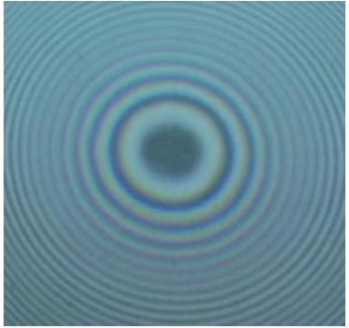
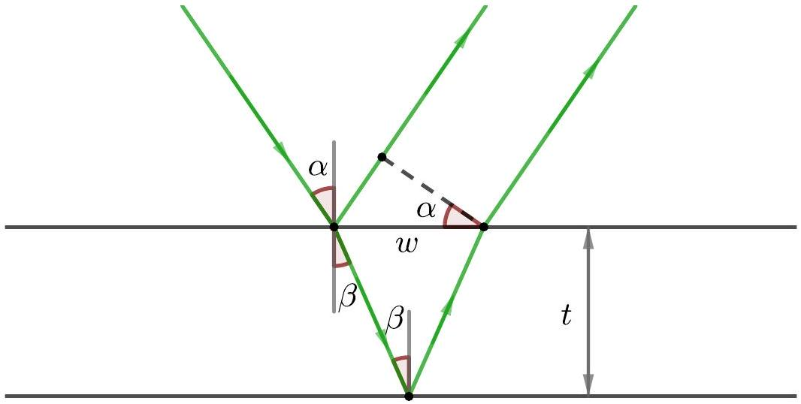

[2] Problem 8. Newton's rings are an interference pattern formed when a lens is placed on a flat glass surface and illuminated from above by light of wavelength $\lambda$. For concreteness, suppose the side of the lens touching the surface is spherical, with radius of curvature $R$. When viewed from above, one sees an interference pattern with circular fringes.

The most important reflection paths are (1) reflection off the top surface of the lens, (2) reflection off the bottom surface of the lens, and (3) reflection off the flat surface. However, the first reflection path has a very different path length from the other two, which means it won't give rise to visible interference fringes, as explained in the remark above. Instead, the first reflection path just adds some background intensity everywhere, preventing the dark fringes from being perfectly dark. Thus, in this problem we'll only consider the second and third paths.
    (a) Explain why the center of the pattern is dark.

(b) Find the radii of the bright and dark fringes, i.e. the values of $r$ where there is a local minimum or maximum of the intensity. For simplicity, assume $r \ll R$.

Solution. (a) Consider light that comes in very close to the center. Then paths (2) and (3) have almost the same path length, but path (2) has reflection from glass to air, which comes with no phase shift, and path (3) has reflection from air to glass, which comes with a $\pi$ phase shift. Therefore, the paths destructively interfere, and the center is dark.

(b) Since $r \ll R$, we can approximate the light as going straight up and down. Putting the origin at the place the lens and flat surface touch, the equation of the lens's curved surface is
$$
r ^ { 2 } + ( y - R ) ^ { 2 } = R ^ { 2 }
$$
where $r$ is the distance from the axis of symmetry. We thus have
$$
r ^ { 2 } = 2 y R - y ^ { 2 } .
$$
We know that $r \ll R$, so for the left-hand side to match the right-hand side, we must have $y \ll R$, which in turn implies the $y ^ { 2 }$ term is negligible. Dropping it gives
$$
y \approx \frac { r ^ { 2 } } { 2 R }
$$
The path length difference is $2 y$, and we have an extra $\pi$ phase shift as explained in part (a), so the condition for destructive interference is
$$
\frac { r ^ { 2 } } { R } = n \lambda , \quad r = \sqrt { n \lambda R }
$$
while the condition for constructive interference is
$$
\frac { r ^ { 2 } } { R } = ( n + 1 / 2 ) \lambda , \quad r = \sqrt { ( n + 1 / 2 ) \lambda R } .
$$
This is a practical way to quickly check how spherical a lens really is.

[3] Problem 9 (Kalda). A hall of a contemporary art installation has white walls and a white ceiling, lit with a monochromatic green light of wavelength $\lambda = 550 \mathrm {~nm}$. The floor of the hall is made of flat transparent glass plates. The lower surfaces of the glass plates are matte and painted black; the upper surfaces are polished and covered with thin transparent film. A visitor standing in the room will see circular concentric bright and dark strips on the floor, centered around himself. A curious visitor observes that the stripe pattern depends on their height, and upon lowering themselves, sees a maximum of 20 stripes. The film's index of refraction is 1.4 and the glass's is 1.6. Determine the thickness of the film.

Solution. Both rays will bounce off a hard surface, so the phase shift due to that will be ignored. All that will be considered is the difference in optical path lengths.

Note that $\sin \alpha = n \sin \beta$. For the immediately reflected ray, it will travel through $L _ { 1 } = w \sin \alpha$, and $\tan \beta = ( w / 2 ) / t$, so $L _ { 1 } = 2 t \tan \beta \sin \alpha$. For the ray that goes through the film, it will travel by $L _ { 2 } = 2 n t / \cos \beta$ where $n = 1.4$, so the path length difference is

$$
\Delta L = \frac { 2 n t } { \cos \beta } - \frac { 2 t \sin \beta \sin \alpha } { \cos \beta } = 2 n t \frac { 1 - \sin ^ { 2 } \beta } { \sqrt { 1 - \sin ^ { 2 } \beta } } = 2 t \sqrt { n ^ { 2 } - ( n \sin \beta ) ^ { 2 } } = 2 t \sqrt { n ^ { 2 } - \sin ^ { 2 } \alpha } .
$$

So $\Delta L$ ranges from $2 t n$ to $2 t \sqrt { n ^ { 2 } - 1 }$. Constructive interference is where $\Delta L = \lambda k$ with $k$ as an integer. Thus for this situation, there are 20 values of $\lambda k$ that fit between $2 t \sqrt { n ^ { 2 } - 1 }$ and $2 t n$, thus $2 t n - 2 t \sqrt { n ^ { 2 } - 1 } \approx 20 \lambda$, giving

$$
t \approx \frac { 20 \text { 人 } } { 2 \left( n - \sqrt { n ^ { 2 } - 1 } \right) } \approx 13 \mu \mathrm {~m} .
$$

## 3 Diffraction

Next, we turn to diffraction.
