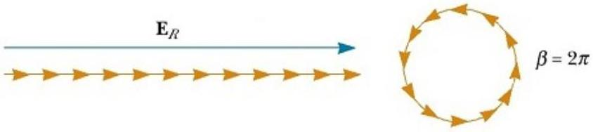
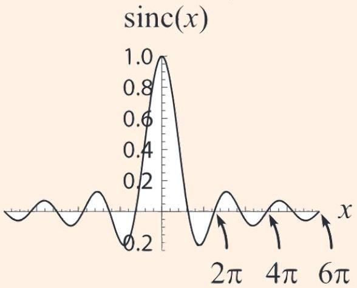

[3] Problem 10. For practical applications of diffraction gratings, we usually focus on the intensity maxima. However, around each maximum there are also secondary maxima.

(a) Argue that the first minimum occurs when there is a phase difference of $2 \pi / N$ between adjacent slits, then compute its angle. This is easiest to see using phasors, i.e. by drawing the individual terms in the amplitude $A$ as vectors in the complex plane.
(b) Show that each secondary maximum is half as wide as the central maximum.
(c) Let the intensity at the central maximum be $I _ { 0 }$. Assuming $N \gg 1$, use phasors to show that the intensity at the $k ^ { \text {th } }$ adjacent secondary maximum is roughly $I _ { 0 } / \left( ( k + 1 / 2 ) ^ { 2 } \pi ^ { 2 } \right)$.

This final result shows that in general, the secondary maxima are much dimmer, and can be neglected; we will ignore them for almost all problems below.

Solution. (a) When the phase difference is $2 \pi / N$ between slits, the phasors sum to zero.

Hence the cumulative phase difference across the whole grating should be $2 \pi$, so

$$
N d \sin \theta = \lambda .
$$

(b) As seen in the formula, we get minima when $N k \Delta r / 2 = \pi n$, so the intensity minima are regularly spaced, except at the primary maxima when $k \Delta r / 2 = \pi n$. Since at the central maximum, the minimum that would be there was replaced with a peak, the distance between adjacent minima becomes twice as large as the distance between the other adjacent minima.

(c) Since every phasor is rotated by the same amount relative to the one before it, and with $N \gg 1$, the phasors form a circular arc in the complex plane. For the secondary maxima, at least one full circle will be formed, and the maximum amplitude is approximately reached when the end point of the arc and the origin form the diameter of the circle. That diameter will be the approximate amplitude of the secondary maximum.
If the total length of the phasors is $A _ { 0 }$, then for the $k ^ { \text {th } }$ secondary maxima, $k + \frac { 1 } { 2 }$ circles will be formed, so that the diameter $A$ of the circle satisfies
$$
\pi A ( k + 1 / 2 ) \approx A _ { 0 } .
$$
Since $I \sim A ^ { 2 }$, we get
$$
I \approx \frac { I _ { 0 } } { ( k + 1 / 2 ) ^ { 2 } \pi ^ { 2 } }
$$

Example 5
Use the previous example to get the interference pattern for a single wide slit of width $a$.

Solution
We can think of a single slit as the limit of a diffraction grating with $N d = a$, where $N \rightarrow \infty$ and $d \rightarrow 0$. Taking these two limits simultaneously is a bit delicate. Starting with our previous result

$$
A \sim \frac { \sin ( N k d \sin \theta / 2 ) } { \sin ( k d \sin \theta / 2 ) }
$$

we may substitute $N d = a$ in the numerator. Only $d$ remains in the denominator, so the $d \rightarrow 0$ limit allows us to use the small angle approximation. We thus have

$$
A \sim \frac { \sin ( k a \sin \theta / 2 ) } { k d \sin \theta / 2 } .
$$

But as $d \rightarrow 0$ the expression blows up, because we're taking the number of slits to infinity while keeping the amplitude from each slit constant. To get a consistent limit, we normalize by dividing the amplitude by $N$, giving $N d = a$ in the denominator for

$$
A \sim \frac { \sin \beta } { \beta } \quad \beta = \frac { k a \sin \theta } { 2 }
$$

The amplitude is proportional to the sinc function, shown below.

What we're really doing here is zooming in on the central maximum of the diffraction grating; the other maxima have been removed by sending the slit spacing to zero.

Remark: Uncertainty Principle
There's a neat way to rephrase our results. In the far field limit and small angle approximation, an opening at height $z$ gives a wave with amplitude $e ^ { i ( k / D ) y z }$ at height $y$ on the screen. If we think of a "slit function" $f ( z )$ which is equal to one at holes and zero elsewhere, then the amplitude $A ( y )$ at the screen is simply the Fourier transform of $f ( z )$ ! Phasors are just a visual way to compute the Fourier transform.

We won't use this language explicitly below, but it can add some intuition if you know it. For example, we know from W1 that the products of the widths of any function and its Fourier transform are bounded. For example, a wavepacket of width $\Delta x$ with Fourier components of width $\Delta k$ obeys $\Delta x \Delta k \gtrsim 1$.

In this case, the Fourier pair is screen height $y$ and the scaled slit height $( k / D ) z$. (Don't get confused with the notation here; now $k$ is fixed while $z$ varies.) Hence the uncertainty principle says

$$
\Delta y \Delta z \gtrsim \frac { D } { k } \sim D \lambda
$$

which you can check holds for all the examples we've seen so far. The uncertainty principle provides a simple explanation for why making the slits narrower makes the pattern wider.

In fact, this is equivalent to the Heisenberg uncertainty relation $\Delta y \Delta p _ { y } \gtrsim \hbar$ for photons passing through the slit, as you can verify. This makes sense, as we should be able to calculate the diffraction pattern in terms of either the whole light wave, or in terms of what happens to each of the photons in the light wave.

Remark
If we take the limit $a \rightarrow \infty$ for the single slit, the central maximum becomes an infinitely sharp, bright point. But in reality, a light will just uniformly illuminate the screen.

The problem is that when $a$ gets too high, the approximations of Fraunhofer diffraction break down, and we must switch to Fresnel diffraction. Fresnel diffraction augments Fraunhofer diffraction with two additional effects.

1. The amplitude of each wavelet falls off as $1 / r$.
2. The amplitude of each wavelet is proportional to the "obliquity factor" $( 1 + \cos \theta ) / 2$, where $\theta$ is the angle from its original forward direction of propagation. (Strictly speaking, this factor appears in Fraunhofer diffraction too, but in that case it's not too important, because all the wavelets that reach a given point of the screen have about the same $\theta$.)

Both effects matter, but it suffices to consider the first to fix the problem. This amplitude falloff implies that in the case $a \gg D$, the illumination at each point on the screen mostly comes from points on the slit within a distance $D$, not from the entire slit. Since every point on the screen can see such a range of points, the screen is uniformly illuminated.

For points on the screen near the edge of the slit, there is a gradual shadow, along with some interference bands from "edge diffraction". In the limit $D \gg \lambda$ these residual diffraction peaks get very close and blur together, leaving only a smooth shadow. This is just as expected, as in this case we have $F \gg 1$ and geometrical optics should apply.

For a derivation of Fresnel diffraction starting from the wave equation, see section 10.4 of Hecht. Incidentally, Fresnel diffraction came first historically, since reaching the simpler Fraunhofer regime $F \ll 1$ requires manufacturing tiny optical instruments. This is yet another example of how the textbook treatment we enjoy today is easier. We can start with the simple case, but the pioneers had to get it all right at once.

## Remark: Interference vs. Diffraction

Interference is the name for the fact that when waves superpose, their energy doesn't just add; it can become larger than the sum (constructive interference) or smaller (destructive interference). Diffraction is the name for the fact that waves do not need to keep going in a straight line when they hit an obstacle.

What's confusing is that double slit "interference", single slit "diffraction", and a many-slit "diffraction" grating all involve both interference and diffraction. Why is it called diffraction when there are one or many holes, but not when there's two? I was very confused about this in high school, but I'm pretty sure there is no difference; it's just historical convention. (However, one pattern is that things that have maxima at larger angles tend to be called "diffraction", because it's more apparent that the direction of the light has been changed.)
