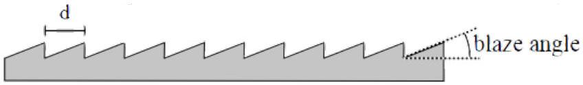

[2] Problem 15. Many common diffraction gratings reflect light rather than transmitting it.

(a) We may crudely model a reflective diffraction grating as a mirror with $N$ small notches, spaced a distance $d$ apart. The notches do not reflect light, but the rest of the mirror serves as a source of Huygens wavelets when light is incident on the grating. Show that, unlike the transmission gratings we considered above, the zeroth order maximum of a reflective grating is much brighter than the others.
(b) This feature is undesirable because the zeroth order maximum is useless for distinguishing different wavelengths. Instead, most modern diffraction gratings are blazed, as shown.

For concreteness, suppose that light is incident straight downward. How should the blaze angle $\gamma$ be chosen so that the $n ^ { \text {th } }$ order maximum is the brightest?

Reflective diffraction gratings are more flexible and more common than transmission gratings. (CDs, DVDs, and "holographic" trading cards and stickers all use reflective diffraction gratings, and you can even make them on chocolate.) Textbooks focus on transmission gratings largely because they make the diagrams a little cleaner.

Solution. (a) This is like single slit diffraction: the angle $\theta = 0$ is the only one where all the Huygens wavelets are automatically in phase, so the maximum in that direction is much brighter than the rest. This corresponds to ordinary, specular reflection.

(b) In this case, the direction of specular reflection is at $\theta = 2 \gamma$. To check this explicitly, note that the path length difference between two points on the same slanted section, separated by a vertical distance $h$, is
$$
h \frac { \sin ( \theta - \gamma ) } { \cos ( \gamma ) } - h \tan ( \gamma )
$$
which indeed vanishes for $\theta = 2 \gamma$.
On the other hand, we also know that the $n ^ { \text {th } }$ order maximum occurs at $d \sin \theta = n \lambda$, so combining our results gives
$$
\gamma = \frac { 1 } { 2 } \arcsin ( n \lambda / d ) .
$$
[2] Problem 16 (PPP 127). When a particular line spectrum is examined using a diffraction grating with 300 lines $/ \mathrm { mm }$ with the light at normal incidence, it is found that a line at $24.46 ^ { \circ }$ contains both red (640-750 nm) and blue/violet (360-490 nm) components. Are there any other angles at which the same would be observed?
Solution. The lines are at $d \sin \theta = n \lambda$ with $d = ( 1 / 300 ) \mathrm { mm }$. This results in $n \lambda = 1380 \mathrm {~nm}$, and $n$ must be an integer. Now, integer values of $n$ are guessed and the values of $\lambda$ that fit in the specified wavelength ranges are $n _ { R } = 2 , \lambda _ { R } = 690 \mathrm {~nm}$ and $n _ { B } = 3 , \lambda _ { B } = 460 \mathrm {~nm}$.

Since the maximum value of $n \lambda$ is $d = 3333 \mathrm {~nm}$, the only other possible value of $d \sin \theta = n _ { R } \lambda _ { R } =$ $n _ { B } \lambda _ { B }$ is when $n _ { R } = 4$ and $n _ { B } = 6$, corresponding to $d \sin \theta = 2 \times 1380$. This gives $\theta = 55.9 ^ { \circ }$. Larger values of $n _ { R }$ and $n _ { B }$ would give no solution for $\theta$.
