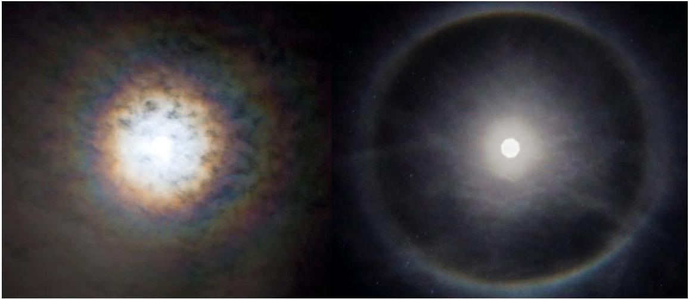
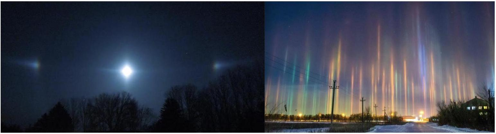
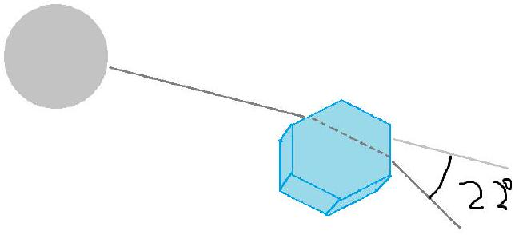

[4] Problem 23. This problem is about some neat atmospheric phenomena. For some parts, it will be useful to use Babinet's principle.

    (a) On a foggy night, there are many tiny water droplets in the air. On such nights one can see a ring around the moon, called a lunar corona, shown at left above. The ring is usually reddish in color. If one looks very carefully on a good night, one can see a blue ring outside the red ring and a blueish-white region inside the red ring. On other nights, one can only see a white haze around the moon. Explain these observations.
    (b) The size of the corona depends on the atmospheric conditions. Estimate the diameter of the water droplets in the air if the first red ring around the moon appears to have a diameter 4 times that of the moon. The angular diameter of the moon in the sky is 0.5°.

(c) On a cold night, there are many thin hexagonal ice crystals in the air. On such nights one can see a much larger, sharper ring around the moon, called a 22° halo, shown at right above. The size of the halo does not depend on the size of the crystals. Explain these observations.
(d) In the photo used in part (c), the moon is shaped like an octagon. Why?
(e) On a cold and exceptionally calm night, the results will be different.

Instead of a circle, one will see two "moon dogs", bright spots displaced about 22° from the moon horizontally. In addition, lights on the ground will produce vertical "light pillars". Explain these observations.

Solution. (a) This is similar to problem 20. Fog is made of small water droplets dispersed in the air, which leads to single slit diffraction by Babinet's principle. The red wavelengths are spread out more, so the bluer regions are seen inside the red rings.
Note that the colors are only pronounced if the droplets are small (to give a large diffraction angle), and nearly uniform in size. A wide range of droplet sizes will wash out the diffraction features, giving a white haze.

(b) This light was deflected by $\theta = 1 ^ { \circ }$, and from the one-dimensional single slit diffraction pattern, we can estimate a drop diameter $a = \lambda / \theta$. (The numeric factor is actually different, since it's two-dimensional diffraction, but we're just doing a rough estimate here.) Taking $\lambda = 650 \mathrm {~nm}$ for red light gives $a = 4 \times 10 ^ { - 5 } \mathrm {~m}$. Anything within a factor of a few is acceptable.
(c) The fact that you always get the same angle, regardless of crystal size, indicates this isn't a diffraction effect. Instead, it's a geometric optics effect. The hexagonal ice crystals refract and reflect the light. The resulting angular deflection has a critical point at 22°, which causes a lot of light to come out with that deflection. The reason that the halo has a red to blue gradient is simply because the index of refraction depends slightly on the wavelength of light. In XRev, you'll carry out this kind of calculation explicitly for a spherical drop of water, which leads to the familiar rainbow.
(d) The octagon is just showing the aperture shape of the camera, i.e. the shape of the opening that the light goes through. The reason it's apparent here is because the photograph is taken in low light conditions, requiring a wide aperture, the moon itself is quite small, and the camera evidently was not focused properly. In bokeh photography, this sort of effect is done intentionally. We'll discuss cameras further in W3.
(e) In the absence of wind, the hexagonal ice crystals will lie flat in the air, so light arriving from the top can just pass right through them without much deflection. We only see a 22° deflection when light enters the hexagon horizontally, as shown.

This yields the two "moon dogs", and if the same thing happens in the daytime, one can instead see "sun dogs".
As for the light pillars, they simply occur when light reflects directly off the flat bottom faces of the hexagons to reach the viewer, as shown here.
