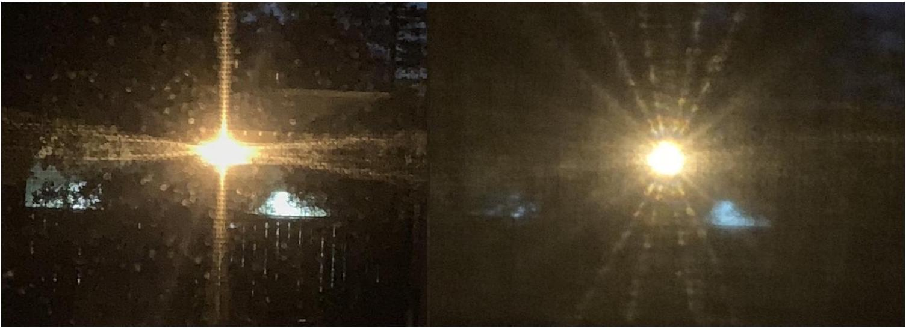

[3] Problem 25. A student noticed an odd pattern when the light from a streetlamp shined through their open window. The window is fitted with a metal mesh screen and a curtain. Photos were taken with the curtain up (left) and down (right).

For scale, the streetlamp was about 30 m away, the distance between the metal wires was 1.4 mm, the diameter of each wire was 0.4 mm, and the curtain was woven from fibers whose width was comparable to that of a human hair.

(a) Explain everything you can about the pattern on the left.
(b) Explain everything you can about the pattern on the right.
(c) What, if anything, can we learn about the streetlamp from either picture?

Solution. (a) This effect is just due to ordinary reflection, not diffraction. This is apparent because the scale of the metal wires is just too big for diffraction to be noticeable.
What's going on is that the wires in the metal mesh make a rectangular grid, and produce specular reflection. The light on the top of the picture, for example, comes from light bouncing off the bottom of one of the top metal wires. The plus shape indicates that the mesh wires are mostly oriented horizontally or vertically, while the two horizontal lines indicate that the mesh wires bend back and forth from the vertical a bit due to the weaving.

(b) This is a diffraction effect, and one way to tell is to note that it affects different colors dramatically differently; there are clearly blue spots near the center and red spots slightly farther away. Evidently, we are seeing a combination of different single slit diffraction patterns, due to fibers in the weave being oriented in different directions. The fact that we see features at sharp angles means that the weaving is quite regular. With more information, we could accurately find the width of the fibers.
(c) The second picture tells us that the lamp is coherent enough to interfere with itself, which is not too surprising because it is so far away. (See the related discussion in the first remark.) It also tells us that the lamp contains colors of all wavelengths, even though it looks yellow.
Decades ago, "sodium lamps" used to be common, and they emitted only yellow light. However, in modern times we've decided that the light from such lamps is ugly, because it has poor "color rendering". (Specifically, in dim light, you would want everything to look just about the same as usual, but dimmer. But in pure dim yellow light, everything that reflects yellow looks very yellow, and everything that absorbs yellow looks completely black, which can be disorienting to the eye.) This wide spectrum tells us that the streetlamp is modern. However, the picture is too blurry to tell if it's incandescent, fluorescent, or LED.
