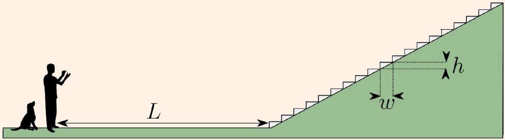

## Example 2

In my former college at Oxford, there is a long staircase that is said to "quack" when one claps at it. What is the explanation of this phenomenon?

## Solution

A diagram of the staircase is given below, courtesy of Felix Flicker, fellow of New College.

The key is that each clap reflects off a stair individually. When the echoes arrive back at the listener, they arrive quickly enough to be heard as a pitch.

The width and height of the steps are $w = 30 \mathrm {~cm}$ and $h = 16 \mathrm {~cm}$. Suppose one claps at a distance $L \gg w , h$. The path length differences for reflections off the bottom few steps are approximately $2 w$, giving the frequency

$$
f = \frac { v } { 2 w } = 570 \mathrm {~Hz}
$$

where we used $v = 343 \mathrm {~m} / \mathrm { s }$. The quack then continues, due to reflections off higher and higher stairs. Once the stairs are much further away than $L$, path length differences for subsequent reflections are approximately $2 \sqrt { w ^ { 2 } + h ^ { 2 } }$, giving frequency

$$
f = \frac { v } { 2 \sqrt { w ^ { 2 } + h ^ { 2 } } } = 500 \mathrm {~Hz} .
$$

Hence the quack consists of a pitch that starts high and then falls slightly lower as it fades away. For further discussion, see the article How the Mound got its Quack.
[3] Problem 4. USAPhO 1998, problem B1. (The official solution has a qualitatively incorrect answer for the final part of the problem; see Stefan Ivanov's errata for the correct answer.)
[3] Problem 5. USAPhO 2016, problem A1.
