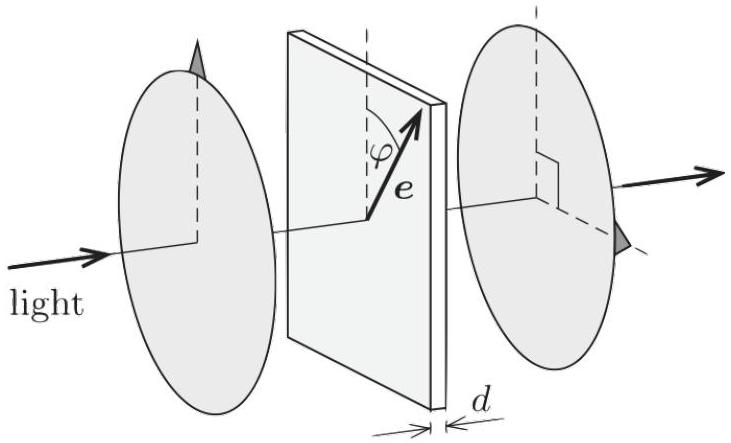

Example 3
A plane wave with amplitude $\mathbf { E } _ { 0 } = E _ { 0 } \hat { \mathbf { x } }$ enters a linear optical device, which does not absorb or reflect any energy. When the plane wave exits the device, it has circular polarization, $\mathbf { E } _ { 0 } = E _ { 0 } ( \hat { \mathbf { x } } + i \hat { \mathbf { y } } ) / \sqrt { 2 }$. What does the device do to light with vertical polarization?

Solution
Vertical polarized light has to exit with circular polarization of the other handedness, i.e. with $\mathbf { E } _ { 0 } = E _ { 0 } e ^ { i \theta } ( \hat { \mathbf { x } } - i \hat { \mathbf { y } } ) / \sqrt { 2 }$ for some unknown phase $\theta$, because this is the only possibility consistent with energy conservation.

To see this, note that the energy of a light wave is proportional to the time-averaged value of $| \mathbf { E } | ^ { 2 }$, which is turn proportional to $\left| \mathbf { E } _ { 0 } \right| ^ { 2 }$. Since horizontal and vertical polarizations are orthogonal, they don't interfere, so sending in both a horizontal and vertical light wave of amplitude $E _ { 0 }$ at the same time just doubles the input energy. This must also double the output energy, and indeed, under the above ansatz we have

$$
\hat { \mathbf { x } } + \hat { \mathbf { y } } \rightarrow \frac { \hat { \mathbf { x } } + i \hat { \mathbf { y } } } { \sqrt { 2 } } + \frac { \hat { \mathbf { x } } - i \hat { \mathbf { y } } } { \sqrt { 2 } } = \sqrt { 2 } \hat { \mathbf { x } }
$$

which indeed has double the energy of one wave by itself.
The more general principle here is that, since $\hat { \mathbf { x } }$ and $\hat { \mathbf { y } }$ were orthogonal to each other, they must be mapped to two other unit vectors which are still orthogonal, as complex vectors. That is indeed true, because

$$
( \hat { \mathbf { x } } + i \hat { \mathbf { y } } ) ^ { \dagger } ( \hat { \mathbf { x } } - i \hat { \mathbf { y } } ) = \hat { \mathbf { x } } \cdot \hat { \mathbf { x } } + i ^ { 2 } \hat { \mathbf { y } } \cdot \hat { \mathbf { y } } = 0 .
$$

Once we know what the device does to horizontally and vertically polarized light, we can find what it does to any polarization of light by superposition.
[2] Problem 8 (MPPP 127). A birefringent material is placed between two orthogonal polarizers. The material has thickness $d$, and has an index of refraction of $n _ { 1 }$ for light linearly polarized along the axis e, and $n _ { 2 }$ for light polarized about an orthogonal axis.

If the system is illuminated with light of wavelength $\lambda$, give a value for $d$ and orientation of e that maximizes the transmitted light.

Solution. We want to turn vertical polarization into horizontal polarization. Note that the horizontal polarization $\hat { \mathbf { x } }$ and vertical polarization $\hat { \mathbf { y } }$ can both be viewed as equal superpositions of the diagonal polarizations $( \hat { \mathbf { x } } \pm i \hat { \mathbf { y } } ) / \sqrt { 2 }$, but with opposite relative sign, i.e. a relative phase shift of $\pi$.

Thus, we want ê to point diagonally, $\varphi = 45 ^ { \circ }$, and set $d$ so that it flips the relative sign between these diagonal polarizations. This occurs if $d = ( k + 1 / 2 ) \lambda / \left( \left| n _ { 1 } - n _ { 2 } \right| \right)$ for a whole number $k$. This system is called a half-wave plate.

[2] Problem 9 (MPPP 128). In the first 3D movies, spectators would wear glasses with one eye tinted blue and the other tinted red. This was quickly abandoned in favor of a system that used the polarization of light.
    (a) If you wear an old pair of 3D movie glasses, close one eye, and look in the mirror, then you can only see the open eye. Explain how these glasses employ light polarization. What disadvantages might this system have?
    (b) If you wear a new pair of 3D movie glasses and do the same, then you can only see the closed eye. Explain why.

Solution. (a) One eye only lets vertically polarized light through, and the other only lets horizontally polarized light through, so that you can see different images with each eye. The disadvantage is that if you tilt your head, the images for each eye will get mixed together.

(b) One eye only lets clockwise polarized light through, and the other only lets counterclockwise polarized light through; the mirror flips the direction of circular polarization.
[2] Problem 10 (HRK). A quarter-wave plate is a birefringent plate that causes a $\pi / 2$ phase shift between light polarized along e and perpendicular to e. Similarly, a half-wave plate causes a $\pi$ phase shift. Suppose you are given an object, which may be a quarter-wave plate, a half-wave plate, a linear polarizer, or just a semi-opaque disk of glass. How can you identify the object? You can use an unpolarized light source, and any number of polarizers and quarter-wave and half-wave plates.
Solution. There are many ways to approach this, but here's a way that just uses an unpolarized light source and up to two polarizers. First, a quarter-wave plate and a half-wave plate don't change the intensity of light, so if the intensity is reduced, it's either a polarizer or a semi-opaque disk. To distinguish between the latter two, you can check if the output is linearly polarized, by applying a polarizer. (For example, there should be an orientation of the polarizer where the output light is blocked entirely.)

To distinguish between a quarter-wave and half-wave plate, one could use a polarizer to send in linearly polarized light. A half-wave plate transforms linearly polarized light into linearly polarized light, with possibly a different polarization axis. That means that the output must be linearly polarized, which you can check by seeing if it can be totally blocked by a polarizer.

On the other hand, a quarter-wave plate can transform linearly polarized light into an arbitrary elliptical polarization, and if you orient it correctly, the output will be circularly polarized. When circular polarized light enters a polarizer of any orientation, exactly half of the intensity is blocked. So if the object is a quarter-wave plate, there will exist an orientation of the object so that when you put a polarizer after it, the output intensity is independent of that polarizer's orientation.

[2] Problem 11 (HRK). A polarizer and a quarter-wave plate are glued together so that, if the combination is placed with face A against a shiny coin, the face of the coin can be seen when illuminated by light of appropriate wavelength. When the combination is placed with face A away from the coin, the coin cannot be seen. Which component is on face A and what is the relative orientation of the components?
Solution. Let the components of the object be A and B. One simple way to think about it is to "unfold" the reflection, i.e. to replace the coin with a inverted version of this system behind it. Then the problem tells us that some light can pass through BAAB, but none can pass through ABBA.
This is only possible if A is the polarizer and B is the quarter wave plate. Some fraction of the light will always pass through BAAB. As for ABBA, suppose we let A be a vertical polarizer, and let the optical axis of B be at 45° to the vertical. Then two copies of B is effectively a half-wave plate, which converts vertically polarized light to horizontally polarized light, which gets blocked by the second copy of A. So no light goes through ABBA.
