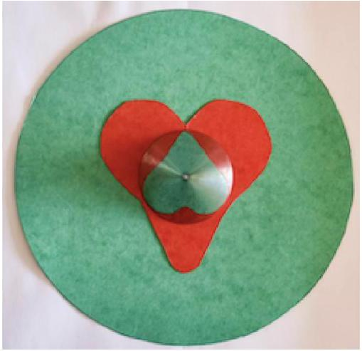
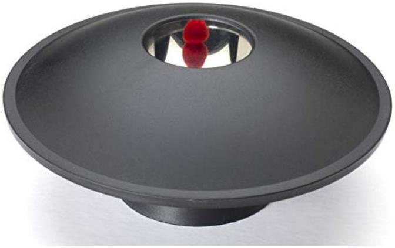

Example 4
Let the index of refraction at height $h$ above the Earth's surface be $n ( h )$. In terms of $n ( 0 )$ and the Earth's radius $R$, what should $d n / d h$ be at the surface so that light rays orbit in circles around the Earth, with constant height?

Solution
First, let's ignore the curvature of the Earth. Consider a light ray moving slightly upward, at a small angle $\theta$ to the horizontal, experiencing index of refraction $n$. Over a horizontal distance $L$, it goes up by a height $L \theta$. At this point, it will have a different angle $\theta ^ { \prime }$ to the horizontal, and experience index of refraction $n + L \theta d n / d h$. Snell's law says

$$
n \cos \theta = \left( n + L \theta \frac { d n } { d h } \right) \cos \theta ^ { \prime }
$$

and expanding to lowest order in the small angles $\theta$ and $\theta ^ { \prime }$ gives

$$
\frac { n } { 2 } \left( \theta ^ { \prime 2 } - \theta ^ { 2 } \right) = L \theta \frac { d n } { d h } .
$$

Approximating again to lowest order gives

$$
\theta - \theta ^ { \prime } \approx - \frac { L } { n } \frac { d n } { d h } .
$$

Thus, the light ray turns through an angle of $( 1 / n ) d n / d h$ per unit horizontal distance. For the light ray to stay at a constant height over the curved Earth, this must equal $1 / R$, giving

$$
\frac { d n } { d h } = - \frac { n ( 0 ) } { R } .
$$

More generally, this calculation shows that light bends towards the direction with higher $n$. In the case of air, where $n - 1 \ll 1$, we can rewrite this as

$$
\frac { d ( n - 1 ) } { d h } \approx - \frac { 1 } { R }
$$

which can plausibly occur on Earth, due to the nice coincidence that $n - 1$ and $H / R$ (where $H$ is the typical scale height of the atmosphere) are both of order $10 ^ { - 3 }$.

Remark: Mirages
There are two classes of mirages.

- When $d n / d h < 0$, light rays bend down. If there is a distant object at the horizon, its image will appear above the horizon. This is called a "superior" mirage.
- When $d n / d h > 0$, light rays bend up. Then a distant object at the horizon will appear below the horizon, forming an "inferior" mirage. This also applies to the sky near the horizon, producing the illusion of water on the ground sometimes seen in deserts.

In air, the refractive index is close to 1 , and $n - 1 \propto \rho \propto P / T$, where $\rho$ is the air density and the second step used the ideal gas law. Usually we have $d \rho / d h < 0$, since $d P / d h < 0$ in hydrostatic equilibrium, but it depends on the value of $d T / d h$.

- In normal conditions, the Sun warms the ground and the hot air rises and adiabatically mixes the atmosphere (as discussed in T1), so that $d T / d h < 0$. This partially cancels the effect of the pressure variation, so that $d n / d h$ is still negative but has small magnitude, so that mirage effects aren't apparent.
- In rare "thermal inversion" conditions, we have $d T / d h > 0$, so that $d n / d h$ is negative with large magnitude, leading to strong superior mirage effects. If $d n / d h$ is negative enough, it can match the value computed in example 4, allowing an observer to see arbitrarily far along the horizon despite the curvature of the Earth. This was the reason the famous Bedford Level experiment concluded the Earth was flat.
- In hot deserts, the air near the ground is very hot, so that $d T / d h < 0$ with a large magnitude. (A strongly negative $d T / d h$ also occurs in cold days above water, since the water stays warmer than the air above it.) Here the temperature gradient overpowers the pressure gradient, so that $d n / d h > 0$ and inferior mirages can occur.

Proponents of the flat Earth hypothesis claim that the Earth only seems curved due to atmospheric refraction. But they have it backwards: in almost all conditions $d n / d h < 0$, which makes the Earth look less curved than it actually is.

[4] Problem 17. IPhO 1995, problem 2. Refraction in the presence of a linearly varying wave speed. (This is a classic setup with a neat solution, also featured in IPhO 1974, problem 2.)
[3] Problem 18. INPhO 2019, problem 1. Another exercise on refraction, with an uglier solution.
[3] Problem 19. USAPhO 2025, problem B2. A problem on shock wave wavefronts.
[3] Problem 20. IPhO 2003, problem 3B. An exercise on refraction and radiation pressure.
[4] Problem 21. IPhO 1993, problem 2. Another exercise on the same theme.

## 5 Ray Tracing

Idea 5
A pointlike object emits light rays in all directions. When those light rays subsequently converge at some other point, that point is the object's real image. If they don't actually converge, but all propagate outward with a common center, that point is the object's virtual image. In general, if we're given that an image exists, we can find its location by following the paths of selected rays from the object and looking for intersections.

[2] Problem 22. A pinhole camera is a simplified camera with no lens. It simply consists of a box with a small hole (the "aperture"). An image of the outside appears on the inside of the box (the "screen"), opposite the hole.

(a) Explain how the pinhole camera works by ray tracing.
(b) What are the disadvantages of having a larger or smaller aperture?
(c) Assuming the object being photographed is very bright, estimate the optimal aperture size for taking a clear picture with a pinhole camera, for a box of side length $L$.

Solution. (a) Consider a point $P$ on an object outside. Light is emitted from $P$ in every direction. If the front of the box was just open, then light rays from $P$ could hit the whole back of the box, brightening the whole screen. But if there's a pointlike hole, then only one ray from $P$ can go through the hole, and that ray hits only one point on the back of the box, making a sharp image of $P$ there.
This is very different from how images are formed by lenses. A lens tries to redirect the light rays from a source so that many of them hit the same point on the screen. A pinhole just removes the unwanted rays.

(b) Using a larger aperture would make the image blurrier, since more rays can get through. Using a smaller aperture would make the image dimmer; also, for very small holes, diffraction becomes more important, and makes the image blurrier again.
(c) If the aperture size is $a$, then two rays can enter the aperture and end up at the same point on the screen even if their directions are different by $\Delta \theta \sim a / L$. This is the "geometric optics" blurring effect, which is minimized by having a smaller hole. At the same time, diffraction causes light passing through the hole to spread out by $\Delta \theta \sim \lambda / a$, which is minimized by having a larger hole. The optimum occurs when the two are comparable, so $a \sim \sqrt { \lambda L }$. For visible light and a camera-sized box, this is a fraction of a millimeter, which you can achieve with a needle or mechanical pencil.

Pinhole cameras are extremely common in everyday life. They can form in the gaps between leaves; the resulting dappled light on the ground is just many images of the disk of the sun.

The next three problems will exercise your intuition with real-world examples.
[2] Problem 23. AuPhO 2020, section C.
[2] Problem 24. AuPhO 2013, problem 11. You'll also need the accompanying answer sheets.
[3] Problem 25. AuPhO 2019, problem 12. You'll also need the accompanying answer sheets.
[2] Problem 26 (NBPhO 2024). This photo shows the reflection of a red heart in a conical mirror.

The photo was taken from far above the mirror. In degrees, what is the mirror's apex angle?

Solution. See the official solution to problem 6(i). The answer is 70°, and any answer within 5° is acceptable.
[3] Problem 27. IZhO 2020, problem 1.3. A test of your intuition for 3D ray tracing.
Solution. You can check the official solutions as usual. But note that, as pointed out by Stefan Ivanov here, the official solution gets the thicknesses of the borders wrong. In the first part, the thickness of the border of the triangle should be $2 r _ { 1 } = 2 \mathrm {~mm}$. In the second part, the thickness of the border of the star should be $3 r _ { 2 } = 0.3 \mathrm {~mm}$.

By the way, this isn't some random question cooked up for an Olympiad; it's a real effect in pinhole cameras that puzzled physicists of the past. As you can read here, this effect distorts the apparent sizes of the Sun and Moon, which puzzled Brahe. The problem was solved by Kepler in 1600, who developed essentially the same ideas you did when solving this problem.

Also, there's an analogous phenomenon with shadows which you've seen many times in real life: the shadow of an object lit by an extended light source contains an umbra and penumbra.

Idea 6
Conic sections have some simple properties under reflection.

- Light rays emitted from one focus of an ellipse will all be reflected to its other focus.
- Light rays emitted from one focus on a hyperbola will all be reflected so that the resulting rays all travel radially outward from the other focus.
- Parallel light rays entering a parabola along its symmetry axis (i.e. the axis perpendicular to the directrix) will all be reflected to its focus.

In the language of idea 5, if the foci of an ellipse/hyperbola are called $F _ { 1 }$ and $F _ { 2 }$, then an object at $F _ { 1 }$ produces a real/virtual image at $F _ { 2 }$. Note that a parabola is simply an ellipse in the limit where $F _ { 1 }$ becomes very far away, so that rays coming in from $F _ { 1 }$ become approximately parallel.
[2] Problem 28 (Povey). The mirascope is a toy consisting of two parabolic mirrors, pointing toward each other, so that the focus of each one is at the vertex of the other.

(a) When an object is placed at the bottom vertex, a real image appears at the top vertex. Why?
(b) How is the image oriented relative to the object?

The real image made by this setup is very convincing. There's a Michelin starred restaurant that uses it in a course: when you reach for what looks like the food, your hand just passes through air.

Solution. (a) Rays departing from the bottom vertex reflect off the top mirror and end up going vertically downward. They then reflect off the bottom mirror and end up focused at the top vertex, which is where the image appears.

(b) To figure this out, you need to trace some rays starting from points near the bottom vertex. The result is that the image is flipped in the horizontal directions but not the vertical directions. For example, if the object is a little pig standing up and facing to the right, the image is a little pig standing up and facing to the left.

## Idea 7: Paraxial Approximation

If a light ray hits a thin lens of focal length $f$ at a shallow angle, and at a distance $y \ll f$ above the lens's center, then it will exit the lens deflected by an angle $\pm y / f$, where the sign depends on whether the lens is converging or diverging. (For example, any light ray going straight through the lens's center isn't bent at all.)

This is the paraxial approximation, which only holds for light rays incident at shallow angles near the center of the lens. The quantity $P = 1 / f$ is also called the optical power.

Conversely, if you don't know the focal length of a system, you can use this idea to find it. For example, the lensmaker's equation, giving the focal length of a lens of radii of curvature $R _ { 1 }$ and $R _ { 2 }$ and thickness $d$, is

$$
\frac { 1 } { f } = ( n - 1 ) \left( \frac { 1 } { R _ { 1 } } - \frac { 1 } { R _ { 2 } } + \frac { ( n - 1 ) d } { n R _ { 1 } R _ { 2 } } \right)
$$

and can be derived by computing the bending of the light ray at each interface.
