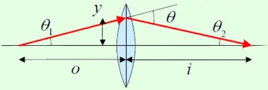

## Example 5

An object is placed a distance $o$ behind a thin converging lens with focal length $f$.

An image is formed a distance $i$ in front of the lens. How are $o , i$, and $f$ related?

## Solution

The horizontal light ray goes straight through, so let's consider another light ray which emerges at a small angle $\theta _ { 1 }$ to the horizontal. Then we read off

$$
\theta _ { 1 } \approx \frac { y } { o } , \quad \theta _ { 2 } \approx \frac { y } { i }
$$

but their sum is the deflection $y / f$, from which we conclude
$$
\frac { 1 } { o } + \frac { 1 } { i } = \frac { 1 } { f } .
$$
This is the familiar thin lens equation.
