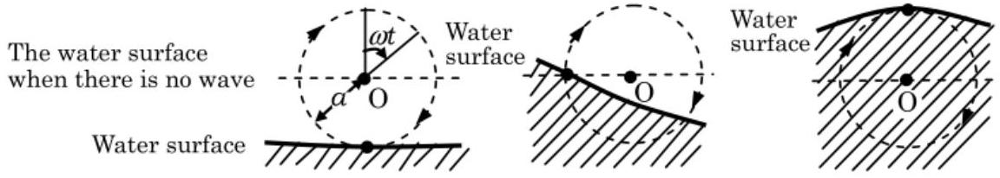
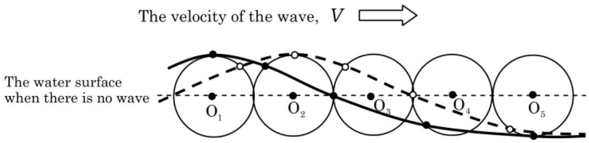

[2] Problem 15 (Japan). In the above problem, we considered shallow water waves, $D \ll \lambda$, in which case the motion of the water is approximately horizontal. But in general, it turns out that the motion of the water will depend on height, and also that the individual water molecules move in ellipses. (This happens even when the wave has small amplitude, which we will always assume; the motion for large amplitude is even more complicated.) In the limit of deep water waves, $D \gg \lambda$, the water molecules move in circles. Using this fact, we can quickly derive the wave speed.
Assume the water molecules at the surface of the wave move in uniform circular motion with radius $a$ and angular velocity $\omega$, as shown.

    (a) Consider the frame of reference moving to the right with velocity $v$. In this frame, the surface of the water is completely stationary, while molecules travel along the surface. Consider a small parcel of water which travels from a valley to a peak. By applying conservation of energy, derive a relationship between $v , \omega$, and $g$.
    (b) Find the phase and group velocity of the wave, in terms of $g$ and the wavenumber $k$. In addition, find the condition on $a$ and $k$ for this derivation to make sense.

Showing that circular motion actually occurs takes more work, and involves solving partial differential equations; you can find a complete derivation here or in the first chapter here.

Solution. (a) At the bottom of the circle, the speed is $v + a \omega$, and at the top the speed is $v - a \omega$. However, since the parcel just moves along the surface of the water, no work is done on it (the water effectively just provides a normal force to keep the parcel on its surface), so this change in speed is balanced by a change in gravitational potential energy. That is,

$$
\frac { 1 } { 2 } \left( ( v + a \omega ) ^ { 2 } - ( v - a \omega ) ^ { 2 } \right) = 2 g a
$$

which implies $v = g / \omega$. (Note that this argument only works for sufficiently small wave amplitudes, $a < v / \omega$.)
(b) The thought experiment in this problem considers an ideal plane wave, so it's computing the phase velocity. Thus, using $v _ { p } = \omega / k$ and $v _ { p } = g / \omega$, we have
$$
v _ { p } = \sqrt { g / k } .
$$
In addition, we can solve for the dispersion relation to find
$$
\omega ( k ) = \sqrt { g k }
$$
from which we find the group velocity,
$$
v _ { g } = \frac { d \omega } { d k } = \frac { 1 } { 2 } \sqrt { g / k } .
$$
Referring back to part (a), this derivation only makes sense if $v _ { p } > a \omega$, which is equivalent to $k a < 1$. That makes sense, as when $k a \gtrsim 1$, the amplitude is large compared to the wavelength, indicating a nonlinear wave. (If we were doing a more rigorous derivation, we would find that the parcels of water only travel in circles in the small amplitude limit $k a \ll 1$.)

As you can see, water waves are quite complex. A diagram of the speeds of nine different limiting cases of water waves can be found in section 8.4 of The Art of Insight.

## 4 Reflection and Refraction

Now we'll introduce reflection and refraction with some real-world applications.
Idea 4
If a wave hits an interface, while traveling at an angle $\theta _ { 1 }$ to the normal to the interface, then it will generically both reflect and refract. The angle of the reflected ray is also $\theta _ { 1 }$, and the angle $\theta _ { 2 }$ of the refracted ray obeys $n _ { 1 } \sin \theta _ { 1 } = n _ { 2 } \sin \theta _ { 2 }$. If there is no solution for $\theta _ { 2 }$ in the latter equation, then only reflection occurs.

These results follow directly from Huygens' principle, so they are very general, applying to light waves, sound waves, water waves, and so on, as long as the index of refraction $n _ { i }$ is always defined to be inversely proportional to the wave speed in each medium.
