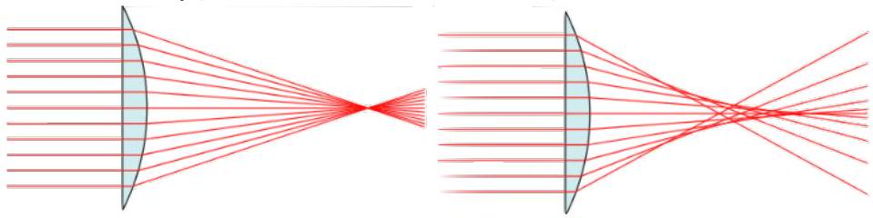

[2] Problem 32. Parallel light rays coming in along the + $\hat { \mathbf { x } }$ direction enter a lens of index of refraction $n$, whose left edge is at $x = 0$ and whose right edge is described by the function $x ( y )$. If all the light beams are to be focused at $x = f$, as shown at left below, what kind of curve does $x ( y )$ have to be?

You should find that $x ( y )$ is not an arc of a circle, which implies that a spherical lens will fail to focus all incoming horizontal light to a point. Instead, we will get spherical aberration, as shown at right above. However, most lenses are spherical because it's easier to make them that way.
Solution. The easiest method is to directly use Fermat's principle. For the ray coming in at height $y$, the total travel time is independent of $y$, so that
$$
n x ( y ) + \sqrt { y ^ { 2 } + ( f - x ( y ) ) ^ { 2 } } = a
$$
for a constant $a$. Solving for $y$ shows that this is part of a hyperbola with eccentricity $n$.
The above questions only cover the most basic features of geometrical optics. For more practice on geometric optics in general, I strongly recommend Stefan Ivanov's collection of Russian problems. If you've taken a standard American high school physics class, you've probably already had some experience with lens systems, but if you want more, I recommend chapter 40 of Halliday and Resnick.
