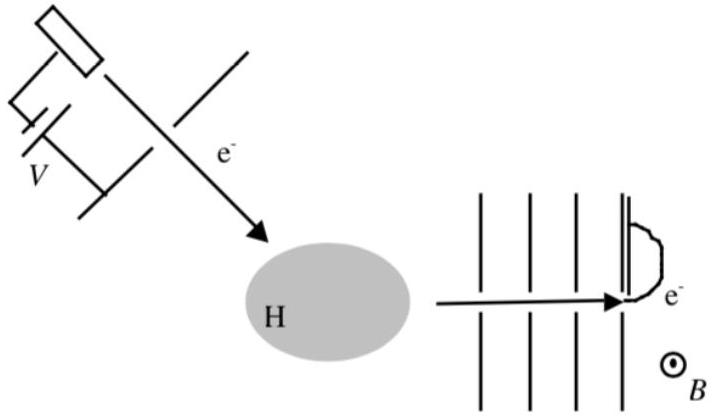
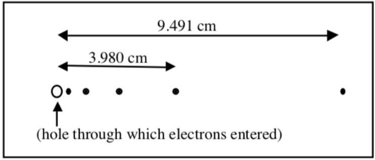
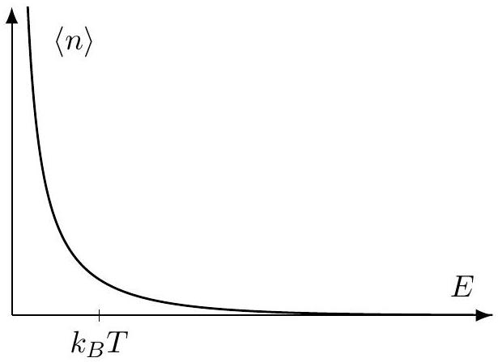
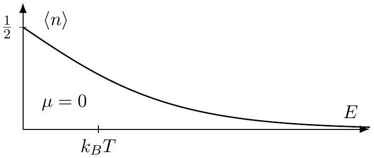
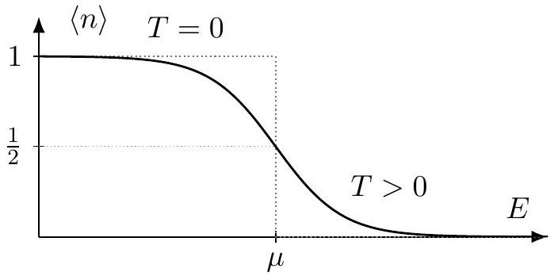

## Modern I: Semiclassical Mechanics

The basics of quantum mechanics can be found in chapters 46 and 47 of Halliday and Resnick, and are covered more thoroughly in chapters 3 through 6 in Krane. Chapter 10 of Krane covers quantum statistical mechanics as used in the final section. For a complete, but advanced treatment of the WKB approximation, see chapter 9 of Griffiths' Introduction to Quantum Mechanics (3rd edition). For some nice conceptual discussion, see chapters I-37 and I-38 of the Feynman lectures, or if you're ambitious, essentially all of volume III. There is a total of 84 points.

## 1 The WKB Approximation

A proper introduction to quantum mechanics would take a whole book. Luckily, there is a "semiclassical" regime of quantum mechanics which can be handled with much less machinery. Historically, this regime was discovered first, by scientists like Bohr, and it suffices to explain many quantum effects. To introduce the WKB approximation, we'll start by considering classical standing waves.

Idea 1
The variation of the phase $\phi$ of a wave is described by its wavenumber and angular frequency,

$$
k = \frac { d \phi } { d x } , \quad \omega = \left| \frac { d \phi } { d t } \right|
$$

As covered in $\mathbf { W 1 }$, the group velocity is

$$
v = \frac { d \omega } { d k } .
$$

A standing wave can form if the wave's phase lines back up with itself after one round trip,

$$
\oint k d x = 2 \pi n , \quad n \in \mathbb { Z } .
$$

A simple case is a string of length $L$ with fixed ends, where we have

$$
2 k L = 2 \pi n
$$

which gives the wavenumbers $k _ { n } = \pi n / L$ and hence the standing wave angular frequencies $\omega _ { n } = \pi v n / L$, as we saw in $\mathbf { W 1 }$.
[1] Problem 1. A slightly more subtle case is the case of a string of length $L$ with one fixed and one free end. Show that the standing wave angular frequencies are

$$
\omega _ { n } = \frac { \pi v } { L } ( n + 1 / 2 ) .
$$

Solution. Here, we see that the end is free, so it corresponds to an anti-node. Thus, the length of the string is a half integer amount of half wavelengths, so $L = \frac { 1 } { 2 } ( n + 1 / 2 ) \lambda _ { n }$, which means that

$$
f _ { n } = v / \lambda _ { n } = \frac { v } { 2 L } ( n + 1 / 2 ) .
$$

Thus, $\omega _ { n } = 2 \pi f _ { n } = \frac { \pi v } { L } ( n + 1 / 2 )$, as desired.

The reason our principle above doesn't give the right answer is that a wave picks up an extra phase shift $\pi$ when it reflects off a fixed end, so we really should have written

$$
\oint k d x = 2 \pi ( n + 1 / 2 )
$$

in this case. We didn't run into any problems for two fixed ends, because in that case we get two phase shifts of $\pi$, which have no overall effect.

[2] Problem 2. Suppose a string of length $L$ is hung from the ceiling. The string has mass density $\mu$, and the bottom of the string is held fixed and pulled down with a force $F \gg g L \mu$. If the string were weightless, then the standing wave angular frequencies would simply be $\pi v n / L$, where $v = \sqrt { F / \mu }$. However, the weight causes the tension and hence the wave speed to vary throughout the rope.
    (a) Explain why the wave's angular frequency $\omega$ is uniform, i.e. why standing wave solutions are proportional to $\cos ( \omega t )$.
    (b) Find the angular frequencies of standing waves, accurate to first order in $g L \mu / F$.

This is a more quantitative version of a problem we encountered in W1.
Solution. (a) Recall that the solutions of the wave equation were proportional to $e ^ { i ( k x - \omega t ) }$ because the wave equation was linear, and had no explicit dependence on $x$ and $t$. The wave equation describing waves on this string does have explicit dependence on $x$, because the tension (and hence the wave velocity) varies along the string. But it still doesn't have any explicit dependence on $t$, so guessing a solution proportional to $e ^ { - i \omega t }$ (or equivalently $\cos ( \omega t )$ in real variables) still works.

(b) Let $h$ be the height from the bottom of the string. By Newton's second law, the tension at height $h$ is $T ( h ) = F + \mu g h$, so the speed is $v ( h ) = \sqrt { F / \mu + g h }$. Thus, the quantization condition is
$$
\oint k d x = 2 \int _ { 0 } ^ { L } k d h = 2 \int _ { 0 } ^ { L } \frac { \omega _ { n } } { v } d h = 2 \int _ { 0 } ^ { L } \frac { \omega _ { n } } { \sqrt { F / \mu + g h } } d h = 2 \pi n .
$$
Note that
$$
\begin{aligned}
2 \int _ { 0 } ^ { L } \frac { \omega _ { n } } { \sqrt { F / \mu + g h } } d h & = \frac { 2 \omega _ { n } } { \sqrt { F / \mu } } \int _ { 0 } ^ { L } \frac { d h } { \sqrt { 1 + g h \mu / F } } \\
& = 2 \omega _ { n } \sqrt { F / \mu } / g \int _ { 0 } ^ { g L \mu / F } \frac { d x } { \sqrt { 1 + x } } \\
& \approx 2 \omega _ { n } \sqrt { F / \mu } / g \int _ { 0 } ^ { g L \mu / F } ( 1 - x / 2 ) d x \\
& = 2 \omega _ { n } \sqrt { F / \mu } / g \left( g L \mu / F - \frac { 1 } { 4 } ( g L \mu / F ) ^ { 2 } \right) \\
& = 2 \omega _ { n } L \sqrt { \mu / F } \left( 1 - \frac { 1 } { 4 } ( g L \mu / F ) \right) .
\end{aligned}
$$
We therefore conclude
$$
\omega _ { n } = \frac { \pi n \sqrt { F / \mu } } { L } \left( 1 + \frac { 1 } { 4 } ( g L \mu / F ) \right) .
$$

If you want the exact solution, you'll have to solve the wave equation with an $h$-dependent wave speed. This can be done with mathematical methods taught in university courses, outside the scope of the Olympiad syllabus, and the answer will be in terms of special functions.

In quantum mechanics, the state of a particle is described by a wavefunction $\psi ( x , t )$ which obeys the Schrodinger equation. When a particle is confined in a finite volume, there are standing wave solutions analogous to those of classical wave mechanics, which have discrete frequencies.

## Idea 2: WKB Approximation

The momentum and energy of a quantum particle obey the de Broglie relations

$$
p = \hbar k , \quad E = \hbar \omega .
$$

As usual, for nonrelativistic particles, the energy $E$ and momentum $p$ are related by

$$
E = \frac { p ^ { 2 } } { 2 m } + V ( x ) .
$$

For a particle with reasonably well-defined momentum, the wavefunction is a wavepacket which travels at the group velocity

$$
v _ { g } = \frac { d \omega } { d k } = \frac { d E } { d p } = \frac { p } { m } .
$$

In the classical limit, this is simply the ordinary velocity of the particle.
The de Broglie relations also apply for relativistic particles, if $E$ is the relativistic kinetic plus potential energy, and $p$ is the relativistic momentum. (If you want, you can also add $m c ^ { 2 }$ to $E$ to get the total relativistic energy, but it makes no difference since a constant shift in energy doesn't do anything.) In this case, the group velocity obeys $p = \gamma m v _ { g }$, as expected.

Just as for a classical standing wave, $\omega$ is the same everywhere for quantum standing waves. Since energy is related to frequency, these standing waves are also states of definite energy. In the semiclassical limit, the standing waves must satisfy

$$
\oint p d x = ( 2 \pi n + \alpha ) \hbar = \left( n + \frac { \alpha } { 2 \pi } \right) h .
$$

The extra phase $\alpha$ depends on how the particle gets reflected at the endpoints of its motion.

## Remark

The left-hand side of the quantization condition above is precisely the adiabatic invariant from M4, which stays the same if we change the system parameters slowly. This ensures the quantization condition is preserved over time, as it must be for self-consistency. If you instead change the system parameters quickly, the integral is not preserved, but that's because the change causes transitions from one energy level to another (i.e. to waves with different $n$ ).
[2] Problem 3. Consider a one-dimensional box of length $L$, with hard walls. We can think of these hard walls as a potential $V ( x )$ that is zero inside the box and infinite outside the box. It can be

shown that each of these "hard" boundaries contributes $\pi$ to $\alpha$, so in this problem we have $\alpha = 2 \pi$, which is equivalent to just taking $\alpha = 0$.

(a) Find the energy levels of a particle of mass $m$.
(b) Now suppose the particle is replaced with a photon, with $E = p c$. Find the allowed energies.

The frequencies you found in part (b) correspond to the standing wave frequencies for electromagnetic waves in a box with reflecting (i.e. perfectly conducting) walls.

Solution. (a) The quantization condition is that

$$
2 p L = 2 \pi n \hbar \Longrightarrow p = \pi n \hbar / L .
$$

Thus, $E = p ^ { 2 } / 2 m = \frac { \pi ^ { 2 } n ^ { 2 } \hbar ^ { 2 } } { 2 m L ^ { 2 } }$. Note that this solution only makes sense for $n \geq 1$.

(b) We see that $p$ is the same, and $E = p c = \pi n \hbar c / L$.

[2] Problem 4. Now consider a particle of mass $m$ in the potential $V ( x ) = k x ^ { 2 } / 2$. In this case, the particle turns around at a point where the potential energy gradually increases from below the particle's energy $E$ to above it. It can be shown that each of these "soft" boundaries contributes $\pi / 2$ to $\alpha$, so that for this potential we can take $\alpha = \pi$.

Show that the energy levels are

$$
E _ { n } = \hbar \omega _ { 0 } \left( n + \frac { 1 } { 2 } \right) , \quad \omega _ { 0 } = \sqrt { \frac { k } { m } } .
$$

This system is called the quantum harmonic oscillator, and remarkably, this is the exact answer, even though we used an approximation to get it. This result will be used in several problems below.

Solution. Here we have the quantization condition

$$
2 \int _ { - A } ^ { A } m \omega _ { 0 } \sqrt { A ^ { 2 } - x ^ { 2 } } d x = 2 \pi \hbar ( n + 1 / 2 ) .
$$

Note that the integral is just the area of a half-ellipse, so

$$
\pi A ^ { 2 } m \omega _ { 0 } = 2 \pi \hbar ( n + 1 / 2 ) ,
$$

so

$$
E = \frac { 1 } { 2 } m \omega _ { 0 } ^ { 2 } A ^ { 2 } = \hbar \sqrt { k / m } ( n + 1 / 2 ) = \hbar \omega _ { 0 } ( n + 1 / 2 )
$$

as desired. Note that this solution makes sense for $n \geq 0$.
[3] Problem 5. USAPhO 2015, problem A1. (The use of the WKB approximation in this problem is technically incorrect: the problem takes $\alpha = \pi$ when it actually should take $\alpha = 3 \pi / 2$. Often, people will apply the WKB approximation in a sloppy way because they're only after rough estimates at small $n$, or the limiting behavior at $n \gg 1$. In the previous problems, we treated $\alpha$ properly because doing so will give the exact correct answer in those cases.)
[5] Problem 6. IPhO 2006, problem 1. This is a neat problem which illustrates the effect of a gravitational field on quantum particles, as well as the basics of interferometry, a subject developed further in W2. Give this a try even if it looks tough; only the ideas introduced above are needed!

Idea 3: Bohr Quantization
In general, $p d x$ may be replaced by any generalized momentum/position pair. For example,

$$
\oint L d \theta = n h .
$$

When angular momentum is conserved, the left-hand side is simply $2 \pi L$, immediately giving

$$
L = n \hbar
$$

which is Bohr's quantization condition. In a system of particles rotating together, $L$ stands for the total angular momentum of the system.

Compared to back-and-forth linear motion, covered in idea 2, rotation is different because it's inherently periodic. For rotation, the integer $n$ can be positive or negative, representing a particle going clockwise or counterclockwise. Also, there is no analogue of the $\alpha$ phase factor because the particle just rotates all the way around; it never gets reflected.

Example 1
Find the energy levels and orbit radii of the electron in the hydrogen atom using Bohr quantization.

Solution
We postulate a circular orbit, and quantize the angular momentum. We have

$$
\frac { m v ^ { 2 } } { r } = \frac { e ^ { 2 } } { 4 \pi \epsilon _ { 0 } r ^ { 2 } } , \quad L = m v r = n \hbar .
$$

Solving the second equation for $v$ and plugging into the first gives

$$
r = \frac { 4 \pi \epsilon _ { 0 } \hbar ^ { 2 } } { m e ^ { 2 } } n ^ { 2 } = a _ { 0 } n ^ { 2 }
$$

where $a _ { 0 } = 5.3 \times 10 ^ { - 11 } \mathrm {~m}$ is called the Bohr radius; these are the allowed orbit radii. To get the energies, we use the standard result for circular motion with an inverse square force that the total energy is half the potential energy, so

$$
E = - \frac { e ^ { 2 } } { 8 \pi \epsilon _ { 0 } r } = - \frac { m e ^ { 4 } } { 2 \left( 4 \pi \epsilon _ { 0 } \right) ^ { 2 } \hbar ^ { 2 } } \frac { 1 } { n ^ { 2 } } .
$$

Evidently, they get more and more closely spaced together as $n$ increases. The big constant in front is called the Rydberg, and is equal to 13.6 eV.
[1] Problem 7. Find the energy levels of positronium, a bound state of a positron and electron.
Solution. You can do this through an explicit analysis very similar to the example. On the other hand, we can also use the idea of reduced mass introduced in M6. The reduced mass of positronium

is $m / 2$, so replacing $m$ with $m / 2$ in the example's answer gives
$$
E = - \frac { m e ^ { 4 } } { 4 \left( 4 \pi \epsilon _ { 0 } \right) ^ { 2 } \hbar ^ { 2 } } \frac { 1 } { n ^ { 2 } } .
$$
[2] Problem 8 (USAPhO 2004). Electrons are accelerated from rest through a potential $V$ into a cloud of cold atomic hydrogen. A series of plates with aligned holes select a beam of scattered electrons moving perpendicular to the plates. Immediately beyond the final plate, the electrons enter a uniform magnetic field $B$ perpendicular to the beam; they curve and strike a piece of film mounted on the final plate.

When the film is developed, a series of spots is observed. The distances between the hole and the two most distant spots are measured. You may assume that the film is large enough to have intercepted all of the electrons, i.e. that there are no spots farther from the hole than those shown. The number of spots shown is not necessarily accurate.
Make the approximation that the mass of the hydrogen atom is much larger than the mass of the electron. Assume that each electron scatters off only one atom, which is initially in the ground state (lowest energy state) and has negligible thermal velocity. Determine $B , V$, and the total number of spots on the film.
Solution. This is USAPhO 2004, problem B1, and you can check its official solutions.
[2] Problem 9. A rotor consists of two particles of mass $m$ connected by a rigid rod of length $L$.
    (a) Find the energy levels if the particles are not identical.
    (b) Find the energy levels if the particles are identical. (Hint: recall that the closed loop integrals in the previous ideas are over paths that take the system back to its original state.)

You might find it disturbing that the result is so different if the particles are or aren't completely identical, but it's a well-verified fact about molecular rotational energy levels. For example, if the two atoms in the molecule had nuclei of different isotopes, we measure the result of part (a), and if they were the same isotope, we measure the result of part (b).

Solution. (a) We see that the angular momentum $L _ { z }$ is constant, so the quantization condition says $L _ { z } \cdot 2 \pi = n h$, or $L _ { z } = n \hbar$. Then, $E = \frac { 1 } { 2 I } L _ { z } ^ { 2 } = \frac { n ^ { 2 } \hbar ^ { 2 } } { m L ^ { 2 } }$.

(b) The point here is that after just a $\pi$ rotation, the system is back in its original state, because the particles are identical. Thus, $L _ { z } \cdot \pi = n h$, or $L _ { z } = 2 n \hbar$, or $E = \frac { 4 n ^ { 2 } \hbar ^ { 2 } } { m L ^ { 2 } }$.
[3] Problem 10. INPhO 2020, problem 3. A problem on the Bohr model for multi-electron atoms. In part (c), you should apply Bohr quantization to each electron individually. This isn't obvious from the question statement, but it's the right thing to do because the two electrons orbit the nucleus with opposite spins, and hence occupy independent quantum states.

[3] Problem 11. INPhO 2016, problem 6.
Remark
In popular science, people sometimes speak of "quantizing" a system as similar to making everything discrete. But as you've seen above, it's more complicated than that. For instance, position never becomes discrete; instead, we integrate over it.
The general rule in quantum mechanics is that confinement to a finite "size" causes the conjugate variable to become discrete. For example, above you looked at several examples of particles bound to potentials. These are confined in space, and hence have discrete orbits in phase space by idea 2, and thus discrete energies. But a free particle not bound to a potential can have any energy, because $E = p ^ { 2 } / 2 m$ and there is no condition at all on $p$. On the other hand, angles are always confined to the finite range $[ 0,2 \pi ]$, which is why the angular momentum of any system is quantized.
[2] Problem 12. Neutrinos are quantum particles with extremely low masses. Because their masses are so low, they are almost always produced moving near the speed of light. In the Sun, neutrinos are produced in a superposition of two types, one with mass $m _ { 1 }$ and another with mass $m _ { 2 }$.
    (a) Suppose the neutrino is produced with definite energy $E$. The part of the neutrino wave with mass $m _ { 1 }$ has wavenumber $k _ { 1 }$, and the part with mass $m _ { 2 }$ has wavenumber $k _ { 2 }$. Find an approximate expression for $k _ { 1 } - k _ { 2 }$ in the ultrarelativistic limit $E \gg m _ { 1 } , m _ { 2 }$.
    (b) Find the distance $L$ that the neutrino travels so that the relative phase between these waves changes by $2 \pi$. This is the characteristic wavelength of "neutrino oscillations". Evaluate it numerically assuming the typical values $E = 10 \mathrm { keV } , m _ { 1 } c ^ { 2 } = 0.010 \mathrm { eV }$, and $m _ { 2 } c ^ { 2 } = 0.013 \mathrm { eV }$.
Solution. (a) Before starting, we should use the ultrarelativistic approximation to simplify things. We note that $c ^ { 2 } p ^ { 2 } = E ^ { 2 } - m ^ { 2 } c ^ { 4 }$, and taking the square root gives
$$
p = \frac { E } { c } \sqrt { 1 - \left( m c ^ { 2 } / E \right) ^ { 2 } } \approx \frac { E } { c } \left( 1 - \frac { m ^ { 2 } c ^ { 4 } } { 2 E ^ { 2 } } \right)
$$
by the binomial theorem. Using the de Broglie relation, we have
$$
k _ { 1 } - k _ { 2 } = \frac { p _ { 1 } - p _ { 2 } } { \hbar } \approx \frac { \left( m _ { 2 } ^ { 2 } - m _ { 1 } ^ { 2 } \right) c ^ { 3 } } { 2 \hbar E } .
$$
    (b) Since the wavenumber is the rate of change of phase, we simply have
$$
L = \frac { 2 \pi } { k _ { 1 } - k _ { 2 } } = \frac { 4 \pi \hbar E } { \left( m _ { 2 } ^ { 2 } - m _ { 1 } ^ { 2 } \right) c ^ { 3 } } = 360 \mathrm {~m} .
$$
Remarkably, even though the masses are so small and the energy so high, the oscillation wavelength turns out to be a macroscopically reasonable length.

## 2 Higher Dimensions

Idea 4
For a system with more than one degree of freedom, the WKB quantization condition holds for each individually,

$$
\oint p _ { i } d x _ { i } = \left( n _ { i } + \frac { \alpha _ { i } } { 2 \pi } \right) h .
$$

In this case, there can be multiple quantum states with a given energy, in which case we say that energy level is degenerate; the number of states with that energy is called the degeneracy.

[2] Problem 13. Consider a particle of mass $m$ in a two-dimensional box of width and length $L$, with hard walls. This is the two-dimensional analogue of problem 3, and again $\alpha _ { 1 } = \alpha _ { 2 } = 0$.
    (a) Write down the energy of the state with quantum numbers $n _ { 1 }$ and $n _ { 2 }$.
    (b) What is the lowest energy level with a degeneracy of greater than 2?

Solution. (a) There are two quantization conditions, for the two dimensions of the box,

$$
\oint p _ { 1 } d x _ { 1 } = n _ { 1 } h , \quad \oint p _ { 2 } d x _ { 2 } = n _ { 2 } h
$$

from which we conclude that

$$
p _ { 1 } = \frac { \pi n _ { 1 } \hbar } { L } , \quad p _ { 2 } = \frac { \pi n _ { 2 } \hbar } { L } .
$$

This yields an energy of

$$
E = \frac { \pi ^ { 2 } \hbar ^ { 2 } } { 2 m L ^ { 2 } } \left( n _ { 1 } ^ { 2 } + n _ { 2 } ^ { 2 } \right) .
$$

To have a sensible standing wave, we need both $n _ { 1 }$ and $n _ { 2 }$ to be positive.

(b) The first number that can be written as the ordered sum of two squares in more than two ways is
$$
50 = 7 ^ { 2 } + 1 ^ { 2 } = 5 ^ { 2 } + 5 ^ { 2 } = 1 ^ { 2 } + 7 ^ { 2 }
$$
corresponding to an energy $E = 25 \pi ^ { 2 } \hbar ^ { 2 } / m L ^ { 2 }$.
[4] Problem 14. Consider a particle of mass $m$ in the potential $V ( x , y ) = k r ^ { 2 } / 2$. This is the twodimensional analogue of problem 4. It is also the potential experienced by an electron in the obsolete "plum pudding" model of the atom, where they are embedded in a ball of uniform charge density.
    (a) By working in Cartesian coordinates, find all of the energy levels, as well as the number of states within each energy level, called the degeneracy.
    (b) [A] Now repeat the exercise in polar coordinates. In this case the integrals
$$
\oint p _ { r } d r , \quad \oint L d \theta
$$
are quantized. Find the energy levels and their degeneracies. Note that for the radial motion, you will have to use the effective potential, as covered in M6. You will run into a difficult integral, so you may use the fact that
$$
\int _ { C - \sqrt { C ^ { 2 } - D ^ { 2 } } } ^ { C + \sqrt { C ^ { 2 } - D ^ { 2 } } } d x \sqrt { \frac { 2 C } { x } - \frac { D ^ { 2 } } { x ^ { 2 } } - 1 } = ( C - | D | ) \pi
$$
valid for $| D | \leq C$. How does your answer compare to that of part (a)?

Solution. (a) Let $\omega = \sqrt { k / m }$. As always, each direction contributes energy $\hbar \omega ( n + 1 / 2 )$, so the total energy is $\hbar \omega \left( n _ { x } + n _ { y } + 1 \right)$. The number of states with energy $\hbar \omega n$ is the number of solutions to $n _ { x } + n _ { y } = n - 1$, which is simply $n$.

(b) By conservation of energy and angular momentum, we have
$$
E = \frac { 1 } { 2 } k r ^ { 2 } + \frac { 1 } { 2 } m \left( \dot { r } ^ { 2 } + v _ { \theta } ^ { 2 } \right) = \frac { 1 } { 2 } k r ^ { 2 } + \frac { L ^ { 2 } } { 2 m r ^ { 2 } } + \frac { p _ { r } ^ { 2 } } { 2 m } .
$$
Quantizing the angular motion gives
$$
\oint L d \theta = 2 \pi L = n _ { \theta } h
$$
which means $L = n _ { \theta } \hbar$ as usual. Let $a \leq r \leq b$ where $\dot { r } = 0$ at $r = a$ or $r = b$. Then quantizing the radial motion (accounting for two "soft" boundaries) gives
$$
\left( n _ { r } + 1 / 2 \right) h = 2 \int _ { a } ^ { b } d r \sqrt { 2 m E - \frac { n _ { \theta } ^ { 2 } \hbar ^ { 2 } } { r ^ { 2 } } - \omega ^ { 2 } m ^ { 2 } r ^ { 2 } }
$$
To clean this up a bit, let's set $\hbar = k = m = 1$ for now and put them back by dimensional analysis at the end. Then the equation reduces to
$$
2 \pi \left( n _ { r } + 1 / 2 \right) = 2 \int _ { a } ^ { b } d r \sqrt { 2 E - \frac { n _ { \theta } ^ { 2 } } { r ^ { 2 } } - r ^ { 2 } }
$$
By substituting $u = r ^ { 2 }$ we find
$$
2 \pi \left( n _ { r } + 1 / 2 \right) = 2 \int _ { a ^ { \prime } } ^ { b ^ { \prime } } \frac { d u } { 2 \sqrt { u } } \sqrt { 2 E - \frac { n _ { \theta } ^ { 2 } } { u } - u } = \int _ { a ^ { \prime } } ^ { b ^ { \prime } } d u \sqrt { \frac { 2 E } { u } - \frac { n _ { \theta } ^ { 2 } } { u ^ { 2 } } - 1 }
$$
where $a ^ { \prime }$ and $b ^ { \prime }$ are the zeroes of the quantity inside the square root,
$$
a ^ { \prime } = E - \sqrt { E ^ { 2 } - n _ { \theta } ^ { 2 } } , \quad b ^ { \prime } = E + \sqrt { E ^ { 2 } - n _ { \theta } ^ { 2 } } .
$$
This incidentally shows that we need $\left| n _ { \theta } \right| \leq E$ for the result to make sense. Using the provided integral, we find
$$
2 \pi \left( n _ { r } + 1 / 2 \right) = \left( E - \left| n _ { \theta } \right| \right) \pi .
$$
The constraint $\left| n _ { \theta } \right| \leq E$ then translates to $n _ { r } \geq 0$, which makes sense. Solving for $E$ gives the final result,
$$
E = 2 n _ { r } + \left| n _ { \theta } \right| + 1 .
$$
By dimensional analysis, the right-hand side needs a factor of $\hbar \omega$ to become an energy, so
$$
E = \hbar \omega \left( 2 n _ { r } + \left| n _ { \theta } \right| + 1 \right) .
$$
The result is identical to that of part (a). The lowest energy level is $E = \hbar \omega$, corresponding to $\left( n _ { r } , n _ { \theta } \right) = ( 0,0 )$. The next is $E = 2 \hbar \omega$, corresponding to $\left( n _ { r } , n _ { \theta } \right) = ( 0 , \pm 1 )$. The next is $E = 3 \hbar \omega$, corresponding to $\left( n _ { r } , n _ { \theta } \right) = ( 1,0 )$ or (0, ±2), and so on.

Remark
Sommerfeld applied an analysis like that of part (b) of problem 14 to the Bohr model, yielding the semiclassical orbits which are ellipses with the nucleus at the focus. (In fact, if you're so inclined, you can do this too, using the same provided integral.) This accounted for the quantum numbers $n$ and $\ell$ in hydrogen. The quantum number $m$ comes from additionally quantizing $L _ { z }$, which implies that the elliptical orbits can only occur in certain planes, an idea known as "space quantization". Sommerfeld even managed to compute relativistic corrections to the energy levels.

With all this included, the Bohr theory provides a complete description of the energy levels of hydrogen, except that (1) the $\ell = 0$ orbitals are missing, since they would have to go straight through the nucleus, (2) space quantization seems artificial and breaks rotational symmetry, and (3) the number of states isn't quite right, a deficiency that would later be fixed by including spin. Many complicated attempts were made to patch these problems, or to extend the theory to multi-electron atoms, but they were forgotten after the modern theory of quantum mechanics (in terms of the Schrodinger equation) appeared.

However, what you've learned above is not completely irrelevant today. The correspondence principle is the idea that quantum results should smoothly transition to classical ones in the limit $\hbar \rightarrow 0$, which in this context means sending the quantum numbers to infinity. And that's exactly what happens. For high quantum numbers, you can superpose atomic orbitals of nearby energy to create a sharply peaked wavefunction, just like how we could create wavepackets from plane waves in $\mathbf { W 1 }$. These peaks act like localized classical particles, following the Bohr model's orbits. Thus, the Bohr model is still useful for studying Rydberg atoms, which are hydrogen-like atoms excited to very high energy levels. For some more discussion of Sommerfeld's results, see this paper.

[3] Problem 15 (Cahn). A crude model of an electron bound to an atom is a particle of mass $m$ attached to a one-dimensional spring, with spring constant $k$ and hence angular frequency $\omega = \sqrt { k / m }$. Consider two such atoms.
    (a) Write down the energy levels of the system, assuming the atoms are completely independent. How many states correspond to each energy?
    (b) Let the electrons have positions $x _ { i }$ relative to their respective equilibrium positions. Now suppose the atoms are brought close together, causing the electrons to repel. For simplicity, we represent this in terms of an extra potential energy term $k ^ { \prime } x _ { 1 } x _ { 2 }$, where $k ^ { \prime }$ is small. Find the new energy levels of the system exactly. (Hint: this can be done with a clever change of variables. However, you have to be careful because changing to new coordinates $x _ { i } ^ { \prime }$ also requires changing the momenta; after all, if we didn't, then the quantization condition of idea 2 would change, leading to different energy levels! If $K$ is the kinetic energy, and you are using position variables $x _ { i }$, then the momenta should be defined as $p _ { i } = \partial K / \partial \dot { x } _ { i }$.)
    (c) Your answer should not make sense for large $k ^ { \prime }$. Physically, what is going on?

Part (b) gives a simple example of how energy levels "split" in the presence of interactions.

Solution. (a) This is just two copies of an ordinary harmonic oscillator, so $E _ { n , m } = \hbar \omega ( n + m + 1 )$ for $n , m \geq 0$. The lowest energy has one corresponding state $( n = m = 0 )$, the next one has two $( ( n , m ) = ( 1,0 )$ or $( 0,1 ) )$, the next has three, and so on.

(b) The energy of the system has the form
$$
E = \frac { p _ { 1 } ^ { 2 } } { 2 m } + \frac { p _ { 2 } ^ { 2 } } { 2 m } + \frac { 1 } { 2 } k x _ { 1 } ^ { 2 } + \frac { 1 } { 2 } k x _ { 2 } ^ { 2 } + k ^ { \prime } x _ { 1 } x _ { 2 } .
$$
This can be brought into a simplified form by expanding in normal modes, just as you saw in M4. Specifically, we define
$$
y _ { 1 } = \frac { x _ { 1 } + x _ { 2 } } { \sqrt { 2 } } , \quad y _ { 2 } = \frac { x _ { 1 } - x _ { 2 } } { \sqrt { 2 } } .
$$
The corresponding momenta, defined as suggested in the hint, are
$$
p _ { 1 } ^ { \prime } = \frac { p _ { 1 } + p _ { 2 } } { \sqrt { 2 } } , \quad p _ { 2 } ^ { \prime } = \frac { p _ { 1 } - p _ { 2 } } { \sqrt { 2 } } .
$$
In terms of these new variables, we have
$$
E = \frac { { p _ { 1 } ^ { \prime } } ^ { 2 } } { 2 m } + \frac { { p _ { 2 } ^ { \prime } } ^ { 2 } } { 2 m } + \frac { 1 } { 2 } \left( k + k ^ { \prime } \right) y _ { 1 } ^ { 2 } + \frac { 1 } { 2 } \left( k - k ^ { \prime } \right) y _ { 2 } ^ { 2 } .
$$
But this is just the form of two independent harmonic oscillators, with resonant angular frequencies $\sqrt { \left( k \pm k ^ { \prime } \right) / m }$. So the energy levels are
$$
E _ { n , m } = \frac { \hbar } { \sqrt { m } } \left( ( n + 1 / 2 ) \sqrt { k + k ^ { \prime } } + ( m + 1 / 2 ) \sqrt { k - k ^ { \prime } } \right) .
$$
This can be written a bit more simply by Taylor expanding, which gives
$$
E _ { n , m } \approx \hbar \omega \left( n \left( 1 + \frac { k ^ { \prime } } { 2 k } \right) + m \left( 1 - \frac { k ^ { \prime } } { 2 k } \right) + 1 \right) = \hbar \omega \left( ( n + m + 1 ) + ( n - m ) \frac { k ^ { \prime } } { 2 k } \right) .
$$
In other words, an energy level that contains $N$ states splits into $N$ separate, closely spaced energy levels. This behavior is ubiquitous in quantum mechanics. This trick of turning everything into a bunch of independent quantum harmonic oscillators by using normal modes is also very important; it'll basically be the bedrock of many graduate physics courses.
(c) For $k ^ { \prime } > k$, the energy becomes an imaginary number. When $k ^ { \prime }$ is this big, the repulsion between the electrons is so strong that they both just shoot off to infinity in opposite directions. That is, the energy is not bounded below; the energy can be lowered to negative infinity by increasing the separation. That means the electrons are not bound at all, so there aren't discrete energy levels.

Example 2
A nonrelativistic particle of mass $m$ is in a cubical box with side length $L$ and hard walls. Find the approximate number of quantum states with energy at most $E _ { 0 }$, where $E _ { 0 }$ is large.

Solution
Using the same reasoning as in previous problems, we apply "hard wall" boundary conditions, requiring the wavefunction to go to zero at the boundary. Thus, the wavefunction is

$$
\psi \propto \sin \left( k _ { x } x \right) \sin \left( k _ { y } y \right) \sin \left( k _ { z } z \right)
$$

where

$$
k _ { i } = \frac { \pi } { L } n _ { i } , \quad n _ { i } \text { positive integer }
$$

and the energy is

$$
E = \frac { p ^ { 2 } } { 2 m } = \frac { \hbar ^ { 2 } k ^ { 2 } } { 2 m } .
$$

The simplest way to proceed is to think in terms of "momentum space", an abstract space whose axes are $p _ { x } , p _ { y }$, and $p _ { z }$. The allowed states form a grid in the first octant of momentum space, with a volume of $( \pi \hbar / L ) ^ { 3 }$ for each state. The surface $E = E _ { 0 }$ corresponds to a sphere of radius $\sqrt { 2 m E _ { 0 } }$. Therefore the number of states with energy at most $E _ { 0 }$ is approximately

$$
N = \frac { 1 } { 8 } \left( \frac { 4 } { 3 } \pi \left( 2 m E _ { 0 } \right) ^ { 3 / 2 } \right) \left( \frac { \pi \hbar } { L } \right) ^ { - 3 } .
$$

Now let's solve the problem a slightly different way: suppose the box has periodic boundary conditions, so that the right side is identified with the left side, and so on. In this case, the wavefunctions can all be written in the form

$$
\psi \propto \exp \left( i \left( k _ { x } x + k _ { y } y + k _ { z } z \right) \right)
$$

but now the allowed values of the wavenumbers are

$$
k _ { i } = \frac { 2 \pi } { L } n _ { i } , \quad n _ { i } \text { integer. }
$$

The allowed states form a grid in all of momentum space, not just the first octant, with a volume of $( 2 \pi \hbar / L ) ^ { 3 }$ for each state. That is, while the volume around each state is eight times as large, the states now occupy eight octants instead of one. Then the overall density of states is still the same, and the number of states with energy at most $E _ { 0 }$ is approximately

$$
N = \left( \frac { 4 } { 3 } \pi \left( 2 m E _ { 0 } \right) ^ { 3 / 2 } \right) \left( \frac { 2 \pi \hbar } { L } \right) ^ { - 3 }
$$

which matches the result for hard walls. The point of this computation is to show that when we care about the statistical properties of many states, the boundary conditions won't matter. In practice, you'll see both kinds of boundary conditions quite often.

If you find the differences between the two boundary conditions confusing, you're not alone. In his original derivation of blackbody radiation, Lord Rayleigh used "hard wall" boundary conditions but also allowed negative $n _ { i }$, leading to a factor of 8 error. Jeans corrected it, which is why the result is now called the Rayleigh-Jeans law.
[4] Problem 16. Do the following JPhO problem. This pedagogical problem introduces the WKB

approximation and phase space, reviewing everything covered above, and applies it to "clusters" of atoms. You can skip sections I and III, which are covered elsewhere on this problem set.

Solution. See the official solutions here.
Remark
Because matter has wave properties, particles such as electrons can exhibit interference effects, like those covered in W2. For example, you can run a double-slit experiment firing individual electrons at a time and seeing where they hit the screen, which will gradually build up an interference pattern. You'll see an example of this in the next problem.
[4] Problem 17. IPhO 1993, problem 3. (Hint: to do the final part of this problem, you should not try to compare the total path lengths traversed by the electrons. That would be very hard, and worse, it won't give the right answer, because the potential from the wire also affects the electrons' phases. Instead, you should use the facts about wavefronts mentioned in W2. That is, waves always propagate perpendicular to wavefronts, and all points on a wavefront have the same phase.)

## 3 The Uncertainty Principle

Idea 5: Heisenberg Uncertainty
So far we have treated a quantum particle as having a well-defined position and momentum, but in reality the uncertainties in the position and momentum obey

$$
\Delta x \Delta p \geq \frac { \hbar } { 2 }
$$

where, as in P2, the uncertainties may be interpreted as standard deviations. The "semiclassical limit" used in the rest of this problem set simply corresponds to the case where the required uncertainty is relatively small, which is reached for energy levels $n \gg 1$. Occasionally, Olympiad questions will ask you to use the Heisenberg uncertainty principle to make a very rough estimate. In these cases, the constant factors will not matter.

Idea 6: Energy-Time Uncertainty
There are two commonly used versions of the energy-time uncertainty principle. If the energy of a system is only measured for a finite time $\Delta t$, it must have a finite uncertainty $\Delta E$ in its energy. In addition, if a system significantly changes its state in time $\Delta t$, then its energy must have been uncertain by a finite amount $\Delta E$. In both cases, we have

$$
\Delta E \Delta t \geq \frac { \hbar } { 2 } .
$$

A third common statement of the energy-time uncertainty principle is "for a short time $\Delta t$, a system can violate energy conservation by an amount $\Delta E$ ". This is wrong, because quantum systems always conserve energy; systems that naively seem to violate energy conservation simply didn't have a well-defined energy in their initial state to begin with. However, thinking this way will usually get you the right answers, essentially because of dimensional analysis.

Example 3
Consider once again a particle of mass $m$ attached to a one-dimensional spring, with natural angular frequency $\omega$. Use the uncertainty principle to estimate the minimum possible energy of the particle, and compare it with the result of problem 4.

Solution
Suppose the uncertainties in position and momentum are $\Delta x$ and $\Delta p$. Then the potential energy is of order $k ( \Delta x ) ^ { 2 } / 2$ and the kinetic energy is of order $( \Delta p ) ^ { 2 } / 2 m$. Dropping constants,

$$
E \sim k ( \Delta x ) ^ { 2 } + \frac { ( \Delta p ) ^ { 2 } } { m } \gtrsim k ( \Delta x ) ^ { 2 } + \frac { \hbar ^ { 2 } } { ( \Delta x ) ^ { 2 } m }
$$

where we applied the uncertainty principle. The ground state minimizes the energy, which is achieved when $( \Delta x ) ^ { 2 } \sim \hbar / \sqrt { k m }$. In this case, the energy is of order $k \hbar / \sqrt { k m } \sim \hbar \sqrt { k / m } \sim \hbar \omega$, which is just what we found earlier. (A similar derivation can be used to derive the energy of the ground state of hydrogen, along with the Bohr radius; try it!)

Remark
We can also "solve" the above problem with the energy-time uncertainty principle incorrectly. The only timescale in the problem is $1 / \omega$, so

$$
\Delta E \gtrsim \frac { \hbar } { \Delta t } \sim \hbar \omega
$$

so $E \gtrsim \hbar \omega$. However, in reality the ground state has no energy uncertainty; its energy is simply the ground state energy. Another way of saying this is that a particle can hang out in the ground state forever, so $\Delta t$ is infinite and hence $\Delta E$ is zero. This incorrect derivation gives the right answer just because it's the only possible answer by dimensional analysis. Thus, a sloppy problem might ask you to do it.

Example 4
Consider a single slit diffraction experiment, where photons of wavelength $\lambda$ pass through a slit of width $a$. If the screen is a large distance $D$ away, roughly how wide is the resulting diffraction pattern on the screen?

Solution
The photon has a momentum $p _ { x } = \hbar k = h / \lambda$, and passing through the slit necessarily gives it a transverse momentum uncertainty of order

$$
\Delta p _ { y } \sim \frac { \hbar } { a }
$$

which means an angle uncertainty of order

$$
\Delta \theta \sim \frac { \Delta p _ { y } } { p _ { x } } \sim \frac { \lambda } { a } .
$$

Therefore, using basic geometry, the size of the pattern on the screen is

$$
\Delta y \sim D \Delta \theta \sim \frac { D \lambda } { a } .
$$

This is the approximate width of the central maximum for single slit diffraction, as we found in W2. The reason the result is the same is that light acts like a wave both classically and quantum mechanically; the quantum version of the derivation is just the same as the classical version, but with "everything multiplied by $h$ ". What's new about this derivation is that it also applies for matter particles, which have $\lambda = h / p$.

Example 5
The Higgs boson has a mass of 125 GeV and a lifetime of about $\tau = 1.6 \times 10 ^ { - 22 } \mathrm {~s}$. About what percentage uncertainty must a measurement of a Higgs boson's mass have?

Solution
Decay is a significant change in the particle's state, and this change happens over a time $\tau$, which means the energy uncertainty is

$$
\Delta E \sim \frac { \hbar } { \tau } = 7 \times 10 ^ { - 13 } \mathrm {~J} = 0.004 \mathrm { GeV }
$$

When we measure the Higgs boson's mass, we really measure the $E = m c ^ { 2 }$ energy released when it decays, so the unavoidable uncertainty of the mass is $\Delta E / E \sim 0.003 \%$. (But the actual measured uncertainties are much higher, due to a variety of other effects.)
[1] Problem 18 (Krane 4.39). An atomic beam is prepared by heating a collection of atoms to a temperature $T$ and allowing the beam to emerge through a hole of diameter $d$ in one side of the oven. Show that the uncertainty principle causes the diameter of the beam, after traveling a length $L$, to be larger than $d$ by an amount of order $L \hbar / d \sqrt { m k _ { B } T }$, where $m$ is the mass of an atom.

Solution. The energy of the particles is on order $k _ { B } T$, so $v \sim \sqrt { k _ { B } T / m }$. Thus, the time taken to travel the length $L$ is $t \sim L / v \sim L \sqrt { m / k _ { B } T }$. Now, the uncertainty in the vertical direction is $d$, so the range of vertical momenta is $\sim \hbar / d$, so the range of vertical speeds is $\sim \hbar / m d$. Thus, in the time $t$, we get a spread of order

$$
\frac { t \hbar } { m d } = \frac { L \hbar } { d \sqrt { m k _ { B } T } } ,
$$

as desired.
[2] Problem 19 (Insight 8.26). When helium is cooled to extremely cold temperatures, it becomes a superfluid, an exotic type of liquid that can flow with zero dissipation. These strange properties occur because quantum mechanical effects are large, making the quantum uncertainty in the position of each helium atom on the same order as the separation between atoms.

(a) Superfluid helium has density $\rho$ and a helium atom has mass $m$. Estimate the temperature $T$ at which helium becomes a superfluid. This is closely related to, but not quite the same thing as Bose-Einstein condensation, a phase transition that bosons undergo at low temperatures.

(b) Numerically evaluate $T$, using $\rho \sim 100 \mathrm {~kg} / \mathrm { m } ^ { 3 }$ and $m \sim 7 \times 10 ^ { - 27 } \mathrm {~kg}$.

Solution. (a) The energy is of order $k _ { B } T$, so the momentum is of order $p \sim \sqrt { 2 m E } \sim \sqrt { m k _ { B } T }$. This leads to a spread in position by the uncertainty principle of

$$
\Delta x \sim \frac { \hbar } { p } \sim \frac { \hbar } { \sqrt { m k _ { B } T } } .
$$

The volume per helium atom is $m / \rho$, giving a typical separation of $( m / \rho ) ^ { 1 / 3 }$. Setting this equal to $\Delta x$ and solving for $T$ gives

$$
T \sim \frac { \rho ^ { 2 / 3 } \hbar ^ { 2 } } { k _ { B } m ^ { 5 / 3 } } .
$$

(b) Plugging in the numbers gives $T \sim 0.7 \mathrm {~K}$. The actual answer is 2.172 K, so this isn't bad for such a rough estimate!

[3] Problem 20. A neutron is inside a small cubical box of side length $d$. Ignore gravity.

(a) Estimate the minimum possible pressure on the walls using the uncertainty principle, dropping all numeric factors. In the next two parts, we'll calculate the pressure more carefully.
(b) Calculate the average pressure on the walls by treating the neutron as a classical particle bouncing back and forth, with the same momentum as expected for the ground state in the WKB approximation.
(c) Calculate the average pressure on the walls by finding the energy $E$ of the ground state using the WKB approximation, and the definition of pressure, $P = - \partial E / \partial V$. (This actually gives the exact answer. Of course, by dimensional analysis, taking $P \sim E / V$ would also produce the right answer, up to a constant factor.)

Solution. (a) Ignoring numeric factors, the uncertainty of position in each dimension is $\sim d$, so the uncertainty of each component of momentum is $\Delta p _ { x } \sim \hbar / d$. Consider the pressure on the faces in the $y z$-plane. The time between collisions is $t \sim d / v _ { x } = m d / p _ { x }$, and the impulse is $\sim p _ { x }$. Thus the force is $\sim p _ { x } ^ { 2 } / m d$, giving a pressure $\sim p _ { x } ^ { 2 } / m d ^ { 3 }$. Setting $p _ { x } \sim \Delta p _ { x }$ gives

$$
P _ { \min } \sim \frac { \hbar ^ { 2 } } { m d ^ { 5 } }
$$

which you could also deduce solely from dimensional analysis.

(b) Earlier, we found that $p _ { i } = \frac { \pi } { d } n _ { i } \hbar$. The time between collisions is $t = 2 m d / p _ { i }$ and the impulse is $2 p _ { i }$, giving a pressure of $p _ { i } ^ { 2 } / m d ^ { 3 }$. Note that this is a directional pressure, i.e. if the $p _ { i }$ were different, the pressures on each wall would be different.
The pressure on the wall perpendicular to the $i$ direction is
$$
P _ { i } = \frac { \pi ^ { 2 } \hbar ^ { 2 } } { m d ^ { 5 } } n _ { i } ^ { 2 } .
$$
For the ground state, the $n _ { i }$ are all equal to one, so we have a uniform pressure,
$$
P = \frac { \pi ^ { 2 } \hbar ^ { 2 } } { m d ^ { 5 } }
$$
which is the same order of magnitude as in part (a).

(c) Earlier, we found that for a two-dimensional box,
$$
E = \frac { \pi ^ { 2 } \hbar ^ { 2 } } { 2 m d ^ { 2 } } \left( n _ { x } ^ { 2 } + n _ { y } ^ { 2 } \right) .
$$
This generalizes straightforwardly to a three-dimensional box. In the ground state, $n _ { x } = n _ { y } =$ $n _ { z } = 1$, giving
$$
E = \frac { \pi ^ { 2 } \hbar ^ { 2 } } { 2 m d ^ { 2 } } ( 1 + 1 + 1 ) = \frac { 3 \pi ^ { 2 } } { 2 } \frac { \hbar ^ { 2 } } { m V ^ { 2 / 3 } } .
$$
Carrying out the derivative,
$$
P = \frac { 3 \pi ^ { 2 } } { 2 } \frac { 2 } { 3 } \frac { \hbar ^ { 2 } } { m V ^ { 5 / 3 } } = \frac { \pi ^ { 2 } \hbar ^ { 2 } } { m d ^ { 5 } } .
$$
As expected, this coincides with the answer to (b), since both ultimately originate from the same approximation.

[3] Problem 21. USAPhO 2018, problem B2.
[3] Problem 22. Classically, an electron orbiting a proton with angular frequency $\omega _ { o }$ emits radiation with angular frequency $\omega _ { c } = \omega _ { o }$, as covered in E7. On the other hand, quantum mechanically the energy levels are discrete, and using the de Broglie relation $\Delta E = \hbar \omega$ indicates the angular frequencies of radiation emitted when the electron drops between energy levels are discrete as well. The classical and quantum models thus seem to be radically different, but in the limit $n \rightarrow \infty$ where quantum effects become negligible, the two should match.

(a) Suppose that the electron can orbit the proton in circular orbits with discrete radii $r _ { n }$. For the $n ^ { \text {th } }$ orbit, compute the angular frequency $\omega _ { c }$ of the emitted radiation according to classical mechanics.
(b) Now suppose the electron drops from the $n ^ { \text {th } }$ energy level to the $( n - 1 ) ^ { \text {th } }$ energy level. Compute the angular frequency $\omega _ { q }$ of the emitted radiation according to quantum mechanics, assuming the orbits have radii $r _ { n }$.
(c) In the limit $n \rightarrow \infty$, the results of parts (a) and (b) should coincide. Therefore, by equating these results, infer how $r _ { n }$ depends on $n$, and thus how $L$ depends on $n$. If all goes well, you should recover the result of Bohr quantization.

The reasoning here is exactly how Bohr came up with Bohr quantization in the first place. (The de Broglie relation we had to use was motivated earlier through Planck's law, as we showed in T2.)

Solution. (a) Classically, we need to balance the centripetal force with the Coulomb force,

$$
m \omega _ { 0 } ^ { 2 } r = \frac { e ^ { 2 } } { 4 \pi \epsilon _ { 0 } r ^ { 2 } } .
$$

Since $\omega _ { c } = \omega _ { 0 }$, we get

$$
\omega _ { c } = \sqrt { \frac { e ^ { 2 } } { 4 \pi \epsilon _ { 0 } r _ { n } ^ { 3 } m } } .
$$

(b) The de Broglie relation tells us that $\hbar \omega _ { q } = E _ { n } - E _ { n - 1 }$, so using standard results for circular orbits in an inverse square potential,
$$
\omega _ { q } = \frac { e ^ { 2 } } { 4 \pi \hbar \epsilon _ { 0 } } \frac { 1 } { 2 } \left( \frac { 1 } { r _ { n - 1 } } - \frac { 1 } { r _ { n } } \right) .
$$

(c) Thinking of $n$ as a large number, we can approximate
$$
\left( \frac { 1 } { r _ { n - 1 } } - \frac { 1 } { r _ { n } } \right) = \frac { r _ { n } - r _ { n - 1 } } { r _ { n - 1 } r _ { n } } \approx \frac { r _ { n } - r _ { n - 1 } } { r _ { n } ^ { 2 } } \approx \frac { 1 } { r _ { n } ^ { 2 } } \frac { d r _ { n } } { d n } .
$$
Plugging this into the equation $\omega _ { c } = \omega _ { q }$ and simplifying, we get
$$
2 \hbar \sqrt { \frac { 4 \pi \epsilon _ { 0 } } { e ^ { 2 } m } } = \frac { 1 } { \sqrt { r _ { n } } } \frac { d r _ { n } } { d n } .
$$
Separating and integrating, we have
$$
r _ { n } = \frac { 4 \pi \epsilon _ { 0 } \hbar ^ { 2 } } { e ^ { 2 } m } n ^ { 2 } .
$$
There could be a constant of integration, but for large $n$, it's negligible, and we can conclude that for large $n , r _ { n } \propto n ^ { 2 }$. On the other hand, we have
$$
L _ { n } = m v _ { n } r _ { n } = m \omega _ { c } r _ { n } ^ { 2 } \propto r _ { n } ^ { 1 / 2 }
$$
which means that for high $n , L _ { n } \propto n$.
This is as far as we can go, "rigorously". The amazing thing is that this derivation is based on $\omega _ { c } = \omega _ { q }$, which only holds at large $n$, along with approximations that only work at large $n$, and also involves an unknown constant of integration. But if we just set the constant of integration to zero, and assume the derivation works for all $n$, then you can check that we recover $L = n \hbar$, which happens to be exactly true in the real world!
[4] Problem 23. IPhO 2005, problem 3. You may skip part 4, since it's quite similar to another problem on this problem set.

## 4 Bosons and Fermions

So far, we've only consider the quantum states of individual particles. Now we'll consider what happens when we put many of these particles together. We will assume the particles do not interact, which means their quantum states are just the same as the quantum states for individual particles. If the particles are fermions, they obey the Pauli exclusion principle, which means no two can occupy the same quantum state. If they are bosons, there is no such restriction; we'll consider bosons first.

[3] Problem 24. USAPhO 2011 A4 is a neat problem, but it has some typos and unphysical assumptions; this is an improved version. Consider a simplified model of the electromagnetic radiation inside a cubical metal box of side length $L$ at temperature $T$. In this model, modes of the electric field have spatial dependence
$$
E ( x , y , z ) = E _ { 0 } \sin \left( k _ { x } x \right) \sin \left( k _ { y } y \right) \sin \left( k _ { z } z \right)
$$
where one corner of the box lies at the origin and the box is aligned with the $x , y$, and $z$ axes. For simplicity, we will treat the electric field as a scalar, even though it actually has direction.
    (a) The electric field must be zero everywhere at the sides of the box. What condition does this impose on the $k _ { i }$ ?

(b) Show that for a typical box at room temperature, $L \sim 1 \mathrm {~m}$ and $T \sim 300 \mathrm {~K}$, the quantity $k _ { B } T$ is much greater than $\hbar \omega _ { 0 }$, where $\omega _ { 0 }$ is the lowest nonzero mode angular frequency. Therefore, for the rest of the problem, you may approximate $k _ { B } T \gg \hbar \omega _ { 0 }$.
(c) Each permitted value of the triple $\left( k _ { x } , k _ { y } , k _ { z } \right)$ corresponds to a mode, which can be occupied by any number of photons. Each photon has an energy $E = \hbar \omega$, where $\omega = c k$ is the angular frequency of the mode. How many modes have an energy per photon of at most $k _ { B } T$ ?
(d) As a crude approximation, suppose that in thermal equilibrium, each mode with energy per photon at most $k _ { B } T$ contains exactly one photon, while all other modes contain no photons. Compute the total energy of the photons in the box. (Answer: $\left( k _ { B } T \right) ^ { 4 } L ^ { 3 } / 8 \pi ^ { 2 } \hbar ^ { 3 } c ^ { 3 }$.)

Note that the procedure here is different from what we did above. Before, we started with particles and quantized $\oint p d x$ to get the allowed quantum states. Here, we're treating a situation with many particles (photons), which are excitations of an underlying field (the electromagnetic field). In this case, we found the (normal) modes of the classical field, then quantized by saying that photons could occupy these modes. This is the methodology of quantum field theory.

Solution. (a) We see that $k _ { x } L = n _ { x } \pi , k _ { y } L = n _ { y } \pi$, and $k _ { z } L = n _ { z } \pi$.

(b) Plugging in the numbers, we have $k _ { B } T / \hbar \omega _ { 0 } \sim 2 \times 10 ^ { 4 } \gg 1$, as desired.

(c) Define the vector $\mathbf { n } = \left( n _ { x } , n _ { y } , n _ { z } \right)$. For each mode, the energy per photon is

$$
E = \hbar \omega = \hbar c k = \frac { \pi \hbar c } { L } \sqrt { n _ { x } ^ { 2 } + n _ { y } ^ { 2 } + n _ { z } ^ { 2 } } .
$$

Moreover, the values of the $n _ { i }$ are positive integers. Therefore, the quantum states we are looking for occupy an eighth of a sphere in phase space, bounded by states with

$$
n _ { \max } = \frac { E _ { \max } L } { \pi \hbar c } .
$$

Because $k _ { B } T \gg \hbar \omega _ { 0 }$, there are many such modes, so we can find the answer approximately by computing the volume of this region. The number of modes (i.e. the number of values of n) with an energy per photon of at most $E _ { \text {max } }$ is thus

$$
N \left( E _ { \max } \right) = \frac { 1 } { 8 } \left( \frac { 4 } { 3 } \pi n _ { \max } ^ { 3 } \right) = \frac { 1 } { 6 \pi ^ { 2 } } \left( \frac { E L } { \hbar c } \right) ^ { 3 } .
$$

In this case, the requested answer is

$$
N \left( k _ { B } T \right) = \frac { 1 } { 6 \pi ^ { 2 } } \left( \frac { k _ { B } T L } { \hbar c } \right) ^ { 3 } .
$$

Note that this is different from the official USAPhO solution, because they also allowed negative values for the $n _ { i }$. This is incorrect, because flipping the sign of one of the $n _ { i }$ gives you exactly the same mode, up to an irrelevant -1 factor.

(d) We sum over the modes. For each occupied mode, we assume the energy stored is $E$, so
$$
U = \int E d N = \int _ { 0 } ^ { k _ { B } T } E \frac { d N } { d E } d E = \frac { 1 } { 6 \pi ^ { 2 } } \left( \frac { L } { \hbar c } \right) ^ { 3 } \int _ { 0 } ^ { k _ { B } T } E \left( 3 E ^ { 2 } \right) d E = \frac { 1 } { 8 \pi ^ { 2 } } \frac { \left( k _ { B } T \right) ^ { 4 } L ^ { 3 } } { \hbar ^ { 3 } c ^ { 3 } } .
$$

[4] Problem 25. The final result of the problem above is correct dimensionally, but has incorrect numerical factors because of the crude approximations made. In this problem we'll do a more careful analysis to get the right result. This question is self-contained, but background from T1 and T2 will be helpful.
    (a) Consider a quantum mode that can support photons of energy $E$. The mode can be occupied by any whole number of photons. Thus, using the Boltzmann distribution, the probability of having $n$ photons is
$$
p _ { n } \propto e ^ { - n E / k _ { B } T } .
$$
Show that the expected number of photons in the mode is
$$
\langle n \rangle = \frac { 1 } { e ^ { E / k _ { B } T } - 1 } .
$$
This is the Bose-Einstein distribution.
    (b) Sketch $\langle n \rangle$ as a function of $E$. How does it behave at high and low $E$, and do those results make physical sense?
    (c) Using the Bose-Einstein distribution, show that the total energy is
$$
U = \frac { L ^ { 3 } \hbar } { \pi ^ { 2 } c ^ { 3 } } \int _ { 0 } ^ { \infty } d \omega \frac { \omega ^ { 3 } } { e ^ { \hbar \omega / k _ { B } T } - 1 }
$$
where $\omega$ is the angular frequency. You'll have to multiply by a factor of two, because there are two independent photon polarizations for each mode we found above. (Note that if we open the box, the photons will fly out, and the frequency distribution of the emitted light will be given by the integrand; this yields Planck's law for blackbody radiation.)
    (d) [A] Using an appropriate substitution, show that $U$ is a dimensionful constant times the dimensionless integral
$$
\int _ { 0 } ^ { \infty } d x \frac { x ^ { 3 } } { e ^ { x } - 1 }
$$
To evaluate this integral, expand the denominator as a power series, integrate each term individually, and use the fact that the Riemann zeta function obeys
$$
\zeta ( s ) = \sum _ { n = 1 } ^ { \infty } \frac { 1 } { n ^ { s } } , \quad \zeta ( 4 ) = \frac { \pi ^ { 4 } } { 90 } .
$$
When the smoke clears, you should find that
$$
U = \frac { \pi ^ { 2 } } { 15 } \frac { \left( k _ { B } T \right) ^ { 4 } L ^ { 3 } } { ( \hbar c ) ^ { 3 } } .
$$

Solution. (a) We see that

$$
\langle n \rangle = \frac { \sum _ { n } n e ^ { - n E / k _ { B } T } } { \sum _ { n } e ^ { - n E / k _ { B } T } } = \frac { e ^ { E / k _ { B } T } / \left( e ^ { E / k _ { B } T } - 1 \right) ^ { 2 } } { e ^ { E / k _ { B } T } / \left( e ^ { E / k _ { B } T } - 1 \right) } = \frac { 1 } { e ^ { E / k _ { B } T } - 1 } ,
$$

as desired.

(b) $\langle n \rangle$ as a function of $E$ looks like this:

For modes with low $E$, we have $\langle n \rangle \approx k _ { B } T / E \gg 1$, so the energy stored in this mode is approximately $\langle n \rangle E \approx k _ { B } T$. That makes physical sense: in this limit where there are lots of photons, their discreteness doesn't matter, so the mode can be treated classically, getting energy $k _ { B } T$ by the equipartition theorem.
For modes with high $E$, we have $\langle n \rangle \approx e ^ { - E / k _ { B } T } \ll 1$. This also makes sense, because in this limit there isn't enough thermal energy to significantly excite the modes.
(c) The logic is exactly the same as part (c) of the previous problem, but instead of saying that some modes have 1 photon and others have 0 photons, we just assign the proper $\langle n \rangle$ photons to every mode. Then
$$
U = \int \langle n \rangle E d N = \frac { 1 } { 2 \pi ^ { 2 } } \left( \frac { L } { \hbar c } \right) ^ { 3 } \int _ { 0 } ^ { \infty } \langle n \rangle E ^ { 3 } d E
$$
As stated, we multiply by a factor of 2 to account for the two polarizations per mode. We also change variables from $E$ to $\omega$ using $E = \hbar \omega$. This gives
$$
U = \frac { L ^ { 3 } \hbar } { \pi ^ { 2 } c ^ { 3 } } \int _ { 0 } ^ { \infty } d \omega \frac { \omega ^ { 3 } } { e ^ { \hbar \omega / k _ { B } T } - 1 }
$$
just as desired.
(d) Now we substitute $x = \hbar \omega / k _ { B } T$, where $d x = \hbar d \omega / k _ { B } T$.
$$
U = \frac { L ^ { 3 } \hbar } { \pi ^ { 2 } c ^ { 3 } } \int _ { 0 } ^ { \infty } \left( \frac { k _ { B } T } { \hbar } d x \right) \frac { \left( k _ { B } T x / \hbar \right) ^ { 3 } } { e ^ { x } - 1 } = \frac { \left( k _ { B } T \right) ^ { 4 } L ^ { 3 } } { \pi ^ { 2 } c ^ { 3 } \hbar ^ { 3 } } \int _ { 0 } ^ { \infty } d x \frac { x ^ { 3 } } { e ^ { x } - 1 } .
$$
We can rearrange the integral into
$$
I = \int _ { 0 } ^ { \infty } d x \frac { x ^ { 3 } } { e ^ { x } - 1 } = \int _ { 0 } ^ { \infty } e ^ { - x } x ^ { 3 } \frac { 1 } { 1 - e ^ { - x } } d x
$$
Recognizing $1 / \left( 1 - e ^ { - x } \right)$ as a geometric series $\sum _ { n = 0 } ^ { \infty } \left( e ^ { - x } \right) ^ { n }$, we can represent the integral as
$$
I = \int _ { 0 } ^ { \infty } \sum _ { n = 0 } ^ { \infty } x ^ { 3 } e ^ { - ( n + 1 ) x } d x
$$

We can reindex this since the only instance of $n$ is $n + 1$, so we can start the summation at $n = 1$. Since we can integrate this term by term, we can change the order of the integral and summation, then integrate by parts to get

$$
\begin{gathered}
I = \sum _ { n = 1 } ^ { \infty } \int _ { 0 } ^ { \infty } x ^ { 3 } e ^ { - n x } d x = \sum _ { n = 1 } ^ { \infty } \int _ { 0 } ^ { \infty } \left( 3 x ^ { 2 } d x \right) \left( \frac { e ^ { - n x } } { n } \right) = \sum _ { n = 1 } ^ { \infty } \int _ { 0 } ^ { \infty } ( 6 x d x ) \left( \frac { e ^ { - n x } } { n ^ { 2 } } \right) \\
= \sum _ { n = 1 } ^ { \infty } \int _ { 0 } ^ { \infty } ( 6 d x ) \left( \frac { e ^ { - n x } } { n ^ { 3 } } \right) = \sum _ { n = 1 } ^ { \infty } \frac { 6 } { n ^ { 4 } } = 6 \zeta ( 4 )
\end{gathered}
$$

Putting this into our original expression gets

$$
U = \frac { \pi ^ { 2 } k _ { B } ^ { 4 } } { 15 c ^ { 3 } \hbar ^ { 3 } } L ^ { 3 } T ^ { 4 }
$$

[5] Problem 26. APhO 2002, problem 1. This useful problem covers the other common example of a quantized bosonic field. In the above problems, we quantized the electromagnetic field to get photons. Here, we quantize a displacement field to get phonons.

Solution. See the official solutions. But they're badly formatted, so I'll also list the answers here.

(a) $m \ddot { X } _ { n } = S \left( X _ { n + 1 } - X _ { n } \right) - S \left( X _ { n } - X _ { n - 1 } \right)$
(b) $\omega ^ { 2 } = ( 4 S / m ) \sin ^ { 2 } ( k a / 2 ) , k = \pi / L , 2 \pi / L , \ldots , N \pi / L , \omega _ { \text {max } } = 2 \sqrt { S / m }$
(c) $\hbar \omega / \left( e ^ { \hbar \omega / k _ { B } T } - 1 \right)$
(d) $( L / \pi ) \Delta k$ modes
(e) $N$ modes, with
$$
E _ { T } = \frac { 2 N } { \pi } \int _ { 0 } ^ { \omega _ { \max } } \frac { \hbar \omega } { e ^ { \hbar \omega / k _ { B } T } - 1 } \frac { d \omega } { \sqrt { \omega _ { \max } ^ { 2 } - \omega ^ { 2 } } }
$$
(f) It grows linearly in $T$ for small $T$, then asymptotes to $N k _ { B } = R$.

Idea 7
In problems 24 and 25, we handled a system of bosons (specifically photons) by considering the modes the photons could occupy, then calculating how many photons were in each mode. This was the easiest route. If we had instead fixed the number of photons, then counted the ways they could be distributed among the modes, the combinatorics would have been a complete nightmare, because multiple photons can occupy the same mode.

Fermions, which obey the Pauli exclusion principle, are simpler, because no two can be in the same state. For instance, if there are $n$ noninteracting fermions in a system, then the lowest energy state of the whole system consists of having one fermion occupy the lowest energy state, the second occupy the second-lowest energy state, and so on. (Accounting for interactions makes the problem much more complicated, because it means the energy of a state depends on whether other states are occupied. However, you can explain a surprising amount while completely neglecting interactions.)

Example 6: Tremaine-Gunn Bound
Suppose all of the dark matter in the galaxy is composed of a single kind of fermionic particle, of mass $m$. The escape velocity of the galaxy is of order $v _ { \text {esc } } \sim 10 ^ { - 3 } c$, and the dark matter density near Earth is $\rho \sim 0.3 \mathrm { GeV } / \left( c ^ { 2 } \mathrm {~cm} ^ { 3 } \right)$. What's the minimum possible value of $m$ ?

Solution
The reason there's a minimum possible value of $m$ is that, as $m$ gets smaller, we need more dark matter particles. But the Pauli exclusion principle tells us that if we want to add more particles, they need to have higher and higher energy, and at some point the particles will have so much energy they won't be bound to the galaxy at all.

To get a rough estimate, let's suppose the galaxy has length scale $L$, so that we need at least $N \sim \rho L ^ { 3 } / m$ dark matter particles. They need to have energy less than $E _ { 0 } \sim m v _ { \text {esc } } ^ { 2 }$. Plugging this into the final result of example 2 and dropping all numeric factors gives

$$
\frac { \rho L ^ { 3 } } { m } \lesssim \frac { m ^ { 3 } v _ { \text {esc } } ^ { 3 } L ^ { 3 } } { \hbar ^ { 3 } }
$$

which yields the bound

$$
m \gtrsim \left( \frac { \rho \hbar ^ { 3 } } { v _ { \mathrm { esc } } ^ { 3 } } \right) ^ { 1 / 4 } \sim 10 \mathrm { eV } / c ^ { 2 } .
$$

A few decades ago, neutrinos were leading dark matter candidates, since they are light fermionic particles that interact very weakly with ordinary matter. But we now know that the neutrino mass is well below this bound, so that nice idea doesn't work. On the other hand, dark matter could still be composed of bosonic particles of much lighter mass.

[2] Problem 27. Consider a system with many noninteracting fermions, and many quantum states. Each quantum state can be either empty or occupied by a fermion. We want to find the probability that a given quantum state, of energy $E$, is occupied.
    (a) To put a fermion in this state, we need to remove a fermion from some other state. Suppose the energy released by doing this, suitably averaged, is $\mu$. (This is the chemical potential, and it depends on the temperature, the number of fermions, and the number of states and their energies.) Using the Boltzmann distribution, show that the probability of occupancy is
$$
\langle n \rangle = \frac { 1 } { e ^ { ( E - \mu ) / k _ { B } T } + 1 } .
$$
This is the Fermi-Dirac distribution.
    (b) Sketch $\langle n \rangle$ as a function of $E$ for small but nonzero temperature, as well as the limit attained for zero temperature.

Solution. (a) The two possibilities are being occupied and not occupied, and the former comes with a Boltzmann factor of $e ^ { - ( E - \mu ) / k _ { B } T }$. Thus,

$$
\langle n \rangle = \frac { e ^ { - ( E - \mu ) / k _ { B } T } } { 1 + e ^ { - ( E - \mu ) / k _ { B } T } } = \frac { 1 } { 1 + e ^ { ( E - \mu ) / k _ { B } T } } .
$$

(b) The graphs are shown below, for zero and nonzero $\mu$.

As $T \rightarrow 0$, the form of $\langle n \rangle$ will start to look like a step function, $\theta ( \mu - E )$. This simply means that the fermions fill up the lowest energy states first, to minimize their total energy. The chemical potential is set by how many fermions there are in total.
[3] Problem 28. In this problem we'll consider the energy of the conducting electrons in a solid at low temperatures. Model a solid as a cubical box of volume $V = L ^ { 3 }$ with periodic boundary conditions.
(a) Suppose there are $N \gg 1$ electrons in total. If the temperature is low enough, they will fill all of the quantum states up to energy $\mu = E _ { F }$, where $E _ { F }$ is called the Fermi energy. Show that
$$
E _ { F } = \frac { h ^ { 2 } } { 2 m _ { e } } \left( \frac { 3 N } { 8 \pi V } \right) ^ { 2 / 3 }
$$
where $m _ { e }$ is the mass of the electron. Be careful to account for the fact that an electron's spin can have two possible values.
(b) A sodium crystal has one conduction electron per atom. (The rest of the electrons are bound to individual atoms, and don't matter for the purposes of this problem.) The density and molar mass are
$$
\rho = 0.971 \times 10 ^ { 3 } \mathrm {~kg} / \mathrm { m } ^ { 3 } , \quad M = 0.023 \mathrm {~kg} / \mathrm { mol } .
$$
Find $N / V$ and $E _ { F }$, and use this to evaluate the typical speed $v _ { F }$ of an electron.
(c) Find a rough estimate for the temperature range at which the above results apply. Is it satisfied for typical solids at room temperature?

Solution. (a) In a cubical box with periodic boundary conditions, the wavenumbers satisfy $k _ { i } = \frac { 2 \pi } { L } n _ { i }$ where $n _ { i }$ can also be a negative integer. As seen in the example, the number of states is $\frac { 4 } { 3 } \pi \left( \sqrt { 2 m _ { e } E _ { F } } \right) ^ { 3 } ( 2 \pi \hbar / L ) ^ { - 3 }$, but we multiply that by 2 due to the two spin states of the electron, so that the number of states with energy at most $E _ { F }$ is

$$
N = \frac { 8 } { 3 } \pi \left( 2 m _ { e } E _ { F } \right) ^ { 3 / 2 } \left( \frac { 2 \pi \hbar } { L } \right) ^ { - 3 } .
$$

Solving for $E _ { F }$ gives the answer,
$$
E _ { F } = \frac { h ^ { 2 } } { 2 m _ { e } } \left( \frac { 3 N } { 8 \pi V } \right) ^ { 2 / 3 } .
$$
(b) If $N _ { A }$ is Avogadro's number, then the mass of each atom is $m _ { a } = M / N _ { A }$, which gives an atom number density of $\rho / m _ { a }$. Since there's one conduction electron per atom, we have $N / V = \rho / m _ { a } = N _ { A } \rho / M$, which gives us $N / V = 2.5 \times 10 ^ { 28 } \mathrm {~m} ^ { - 3 }$. Putting this into our previous formula gives $E _ { F } = 5.0 \times 10 ^ { - 19 } \mathrm {~J}$. The typical speed $v _ { F }$ satisfies
$$
E _ { F } \sim \frac { 1 } { 2 } m _ { e } v _ { F } ^ { 2 }
$$
which gives $v _ { F } \sim 10 ^ { 6 } \mathrm {~m} / \mathrm { s }$, or on the order of 1\% of the speed of light! This verifies a statement made in E4 about electrical conduction in solids.
(c) The condition is $k _ { B } T \ll E _ { F }$, which corresponds to $T \ll 4 \times 10 ^ { 4 } \mathrm {~K}$. This is easily satisfied for a solid at room temperature. In fact, any solid would melt before it got to this temperature! So the model we've developed in this problem is good for any conductor within which the interactions of conduction electrons with ions or other electrons are negligible.

[3] Problem 29. Here we continue the analysis in problem 20, to derive degeneracy pressure.

(a) Suppose $N \gg 1$ nonrelativistic neutrons are in the box. Neutrons are fermions. Neglecting interactions between the neutrons, estimate the minimum possible pressure on the walls. How does it scale with the number density $n = N / V$ ?
(b) Now suppose $n$ is so high that most of the neutrons are ultrarelativistic, $E \approx p c$. In this case, how does the pressure scale with $n$ ?

The degeneracy pressure of neutrons keeps neutron stars from collapsing, and the degeneracy pressure of electrons keeps white dwarfs from collapsing. We'll investigate them more in X3.

Solution. (a) It's cleanest to start from the end of part (c) of problem 20. Tracking the $n _ { i }$ dependence, we have

$$
E _ { \mathbf { n } } = \frac { \pi ^ { 2 } } { 2 } \frac { \hbar ^ { 2 } } { m V ^ { 2 / 3 } } n ^ { 2 } , \quad n ^ { 2 } = n _ { x } ^ { 2 } + n _ { y } ^ { 2 } + n _ { z } ^ { 2 }
$$

where we're treating the $n _ { i }$ like the components of a vector. This contributes a pressure

$$
P _ { \mathbf { n } } = \frac { \pi ^ { 2 } } { 3 } \frac { \hbar ^ { 2 } } { m V ^ { 5 / 3 } } n ^ { 2 } .
$$

Just as in example 2, an eighth of a sphere of $\mathbf { n }$ values is filled, where for $N$ particles in total, the radius $n _ { \text {max } }$ of the sphere obeys

$$
N = \frac { 1 } { 8 } \left( \frac { 4 } { 3 } \pi n _ { \max } ^ { 3 } \right)
$$

which tells us that

$$
n _ { \max } = \sqrt [ 3 ] { \frac { 6 N } { \pi } } .
$$

The total pressure can be found by summing over all the lattice points within this eighth of a sphere. Since $N$ is large, this sum can be approximated as an integral,
$$
P = \int _ { 0 } ^ { n _ { \max } } \frac { 4 \pi n ^ { 2 } d n } { 8 } P _ { \mathbf { n } } = \frac { \pi ^ { 3 } \hbar ^ { 2 } } { 6 m V ^ { 5 / 3 } } \int _ { 0 } ^ { n _ { \max } } n ^ { 4 } d n = \frac { \pi ^ { 3 } \hbar ^ { 2 } } { 30 m d ^ { 5 } } \left( \frac { 6 N } { \pi } \right) ^ { 5 / 3 } \sim \frac { \hbar ^ { 2 } n ^ { 5 / 3 } } { m } .
$$
Thus, the degeneracy pressure scales as $n ^ { 5 / 3 }$. Again, we could get the same result using periodic boundary conditions, or immediately from dimensional analysis.
(b) In the ultrarelativistic limit, the answer can depend on $c$ but not on $m$, so we must have $P \sim \hbar c n ^ { 4 / 3 }$ by dimensional analysis. Of course, you could also get this by repeating the analysis of part (a). The fact that the pressure now depends on $n ^ { 4 / 3 }$ rather than $n ^ { 5 / 3 }$ is a key factor governing the stability of white dwarfs.

[3] Problem 30 (MIT). [A] This is an advanced problem that is only placed here because the final result is neat. An integer $N$ can be partitioned by writing it as a sum of positive integers, and the partition function $p ( N )$ is the number of unique ways this can be done. For example,

$$
4 = 1 + 1 + 1 + 1 = 1 + 1 + 2 = 2 + 2 = 1 + 3 = 4
$$

which implies $p ( 4 ) = 5$. Counting the number of partitions of an integer is a very hard combinatorics problem, but we can get an estimate for large $N$ using string theory.

(a) Consider an ideal string with hard boundary conditions and fundamental angular frequency $\omega$. Show that the number of distinct quantum states with energy $N \hbar \omega$ is $p ( N )$.
(b) Now suppose the string is at temperature $T$, where $T$ is chosen so that the expected energy is $N \hbar \omega$. In the thermodynamic limit $N \gg 1$, find a relation between $N$ and $T$. You may use the result $\zeta ( 2 ) = \pi ^ { 2 } / 6$.
(c) By approximating the entropy as $S \approx k _ { B } \log p ( N )$, show that
$$
\frac { \hbar \omega } { k T } = \frac { d \log p ( N ) } { d N } .
$$
Combine this with your previous result to find an estimate for $p ( N )$.

To check your answer, the celebrated Hardy-Ramanujan formula (which is more accurate than the very rough treatment we give above) is

$$
p ( N ) \sim \frac { 1 } { 4 \sqrt { 3 } N } \exp \left( \pi \sqrt { \frac { 2 N } { 3 } } \right) .
$$

While we only considered a simple nonrelativistic string here, calculations of this sort show up in the thermodynamics of string theory. For further discussion, see chapter 22 of Zwiebach.

Solution. (a) The modes of the string have angular frequencies $m \omega$, which means that upon quantization, each quantum in mode $m$ will have energy $m \hbar \omega$. Thus, putting in quanta to reach total energy $N \hbar \omega$ is the same as building a partition of $N$ out of integers $m$. For example, $4 = 1 + 1 + 1 + 1$ corresponds to putting 4 quanta in the fundamental mode, while $4 = 4$ corresponds to putting 1 quantum in the fourth harmonic.

(b) By borrowing some results from previous problems, we have
$$
N = \sum _ { m } \frac { m } { e ^ { m \hbar \omega / k T } - 1 } \approx \int _ { 0 } ^ { \infty } \frac { m d m } { e ^ { m \hbar \omega / k T } - 1 }
$$
We have already done a similar integral in problem 25, and using the same trick of expanding the denominator in a Taylor series and integrating term by term gives
$$
N \approx \frac { \pi ^ { 2 } } { 6 } \left( \frac { k T } { \hbar \omega } \right) ^ { 2 } .
$$
(c) Using the definition of temperature,
$$
T = \frac { d E } { d S } = \frac { \hbar \omega } { k } \frac { d N } { d \log p ( N ) } .
$$
Rearranging slightly gives the desired result. Eliminating $T$ using the above result,
$$
\frac { d \log p } { d N } \approx \frac { \pi } { \sqrt { 6 N } } .
$$
Separating and integrating,
$$
\log p ( N ) \sim \int _ { 0 } ^ { N } \frac { \pi } { \sqrt { 6 N } } d N = \pi \sqrt { \frac { 2 N } { 3 } }
$$
which agrees with the Hardy-Ramanujan formula. (Of course, this only gets the leading term right, because we made approximations. The most severe approximation we did was taking $S \approx k _ { B } \log p ( N )$. In reality, the energy at a given temperature is not fixed, but rather has fluctuations, so we should have instead summed $p ( n )$ for a range of $n$ near $N$.)

Example 7: Casimir Forces
Consider an infinite uniform string, on which waves propagate with speed $v$. The string is held fixed by pins at two points separated by a distance $L$. When the string is in its ground state, what is the resulting force between the pins?

Solution
Of course, in classical mechanics the ground state would just be $y ( x ) = 0$, and the force would just be the tension $T$. But there is an additional quantum mechanical contribution, which arises because each of the standing waves between the pins, with angular frequencies $\omega _ { n } = n \pi v / L$, carries a so-called "zero point" energy $\hbar \omega _ { n }$.

As usual, force can be found by differentiating energy, $F = - d E / d L$. By summing up the zero point energy in all of the standing waves, we naively get

$$
E = \sum _ { n } \frac { \hbar \omega _ { n } } { 2 } = \frac { \pi \hbar v } { 2 L } \sum _ { n = 1 } ^ { \infty } n = E _ { 0 } \sum _ { n = 1 } ^ { \infty } n = \infty
$$

which is rather unhelpful. This result is off for two reasons. First, even when there aren't any pins, the string still has standing waves, and these waves also have a naively infinite energy density. When we move the pins a bit, we change both the zero point energy outside the pins and inside, by infinite amounts, but the net change is finite, giving a finite force.

Quantitatively, the energy in between the pins due to the standing waves is

$$
E _ { \text {plate } } = E _ { 0 } \sum _ { n = 1 } ^ { \infty } n = \infty
$$

and the energy we would have had there if the pins didn't exist is the "continuous" sum,

$$
E _ { \mathrm { vac } } = E _ { 0 } \int _ { 0 } ^ { \infty } x d x = \infty
$$

The difference should be finite, but we can't just subtract infinity with infinity, which brings us to the second problem: none of these quantities are actually infinite. Any real string will have a finite maximum oscillation frequency - for instance, the wavelength certainly can't get smaller than the atomic spacing. Alternatively, even if we had an idealized string where $E _ { \text {vac } }$ was actually infinite, no real pin can perfectly block waves of all frequencies. For sufficiently high frequencies the waves won't be affected by the pins, so that the sum in $E _ { \text {plate } }$ eventually behaves like the integral in $E _ { \text {vac } }$, leaving a finite difference between the two.

In other words, the difference between $E _ { \text {plate } }$ and $E _ { \text {vac } }$ in reality comes from only low $n$ and $x$. Therefore, let's "regulate" the two expressions above so that they're unchanged in this regime, but match each other at high $n$ and $x$. The simplest way to do this is to take

$$
E _ { \text {plate } } = E _ { 0 } \sum _ { n = 1 } ^ { \infty } n e ^ { - \epsilon n } , \quad E _ { \text {vac } } = E _ { 0 } \int _ { 0 } ^ { \infty } x e ^ { - \epsilon x } d x = \frac { E _ { 0 } } { \epsilon ^ { 2 } }
$$

for small $\epsilon$. To handle the sum, let $\alpha = e ^ { - \epsilon }$, so that

$$
E _ { \text {plate } } / E _ { 0 } = \alpha + 2 \alpha ^ { 2 } + 3 \alpha ^ { 3 } + \ldots .
$$

Now we use the usual trick for arithmetic-geometric series. Note that

$$
\alpha E _ { \text {plate } } / E _ { 0 } = \alpha ^ { 2 } + 2 \alpha ^ { 3 } + 3 \alpha ^ { 4 } + \ldots .
$$

Subtracting, we find

$$
( 1 - \alpha ) E _ { \text {plate } } / E _ { 0 } = \alpha + \alpha ^ { 2 } + \alpha ^ { 3 } + \ldots = \frac { \alpha } { 1 - \alpha } .
$$

We thus conclude that

$$
E _ { \mathrm { plate } } = \frac { e ^ { - \epsilon } } { \left( 1 - e ^ { - \epsilon } \right) ^ { 2 } } E _ { 0 } = E _ { \mathrm { vac } } - \frac { 1 } { 12 } E _ { 0 } + \mathcal { O } ( \epsilon )
$$

where we used a result from P1. Finally, when we take $\epsilon$ to zero, the difference is simply

$$
E = E _ { \text {plate } } - E _ { \text {vac } } = - \frac { 1 } { 12 } E _ { 0 } .
$$

Differentiating gives the force,

$$
F = - \frac { \pi \hbar v } { 24 L ^ { 2 } }
$$

where the negative sign indicates it is attractive. Not only is this finite, it's right! Experiments have measured this "Casimir force" precisely for light between two conductors, where $v = c$, and confirmed the expected results.

You're probably suspicious about this derivation because it depends on the arbitrary choice of an exponential suppression. What if the sums and integrals were regulated at high $n$ and $x$ in a different way? Shouldn't the answer depend on the details of the string and pin? Remarkably, the answer is no: the regulator doesn't matter. If you try others, such as $e ^ { - \epsilon n ^ { 2 } }$ or $1 / n ^ { \epsilon }$, you'll get the same result; you can find a general proof in chapter 15 of Schwartz's Quantum Field Theory and the Standard Model. The reason is that the effect comes from physics at low frequencies, so it doesn't matter how you regulate the high frequencies.

It is for precisely this reason that you will sometimes see the mysterious equation

$$
1 + 2 + 3 + \ldots = - \frac { 1 } { 12 } .
$$

It's not really true. Instead, what it physically means is that the difference between the regulated sum and integral is -1/12 for any reasonable regulator.
