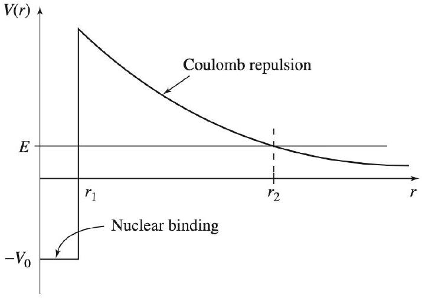
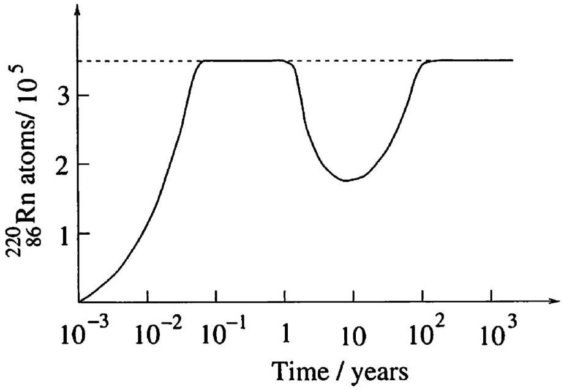
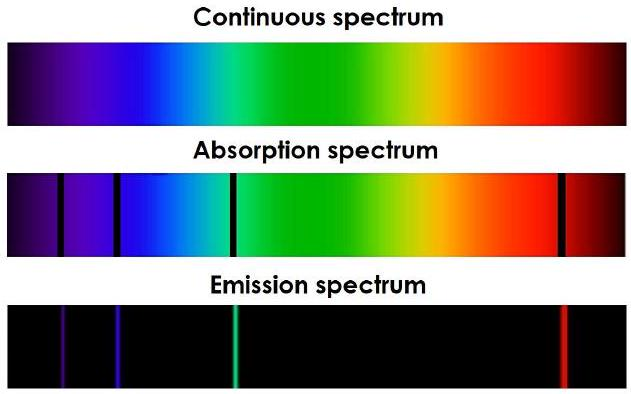

## Modern II: Atoms, Particles, and Nuclei

Chapters 48, 50, 51, and 52 of Halliday and Resnick are a useful introduction. For further reading, see chapters 12 through 14 of Krane for nuclear and particle physics, and for much more, see chapters 1 and 2 of Griffiths' Introduction to Elementary Particles, and David Tong's Lectures on Particle Physics. For all problems, you can consult the periodic table. There is a total of 86 points.

## 1 Nuclear Decay

Idea 1
Atomic nuclei are written as ${ } _ { Z } ^ { A } \mathrm { X }$ where X is the name of the element, $A$ is the mass number (number of neutrons plus protons), and $Z$ is the atomic number (number of protons). Since $Z$ can be inferred from X, we often leave it implicit.

Idea 2
The most common nuclear decay channels are alpha decay,

$$
{ } _ { Z } ^ { A } \mathrm { X } \rightarrow { } _ { Z - 2 } ^ { A - 4 } \mathrm { X } ^ { \prime } + { } _ { 2 } ^ { 4 } \mathrm { He }
$$

and beta decay,

$$
{ } _ { Z } ^ { A } \mathrm { X } \rightarrow { } _ { Z + 1 } ^ { A } \mathrm { X } ^ { \prime } + e ^ { - } + \bar { \nu } _ { e } .
$$

Here, $\bar { \nu } _ { e }$ is a light neutral particle called an anti-electron neutrino. A variant of beta decay, called $\beta ^ { + }$decay or positron emission, is

$$
{ } _ { Z } ^ { A } \mathrm { X } \rightarrow { } _ { Z - 1 } ^ { A } \mathrm { X } ^ { \prime } + e ^ { + } + \nu _ { e }
$$

where $\nu _ { e }$ is called an electron neutrino, and $e ^ { + }$is a positron. If electrons are present, the nuclei may also capture them, leading to the process

$$
{ } _ { Z } ^ { A } \mathrm { X } + e ^ { - } \rightarrow { } _ { Z - 1 } ^ { A } \mathrm { X } ^ { \prime } + \nu _ { e } .
$$

Finally, nuclei can decay from excited states by emitting photons, in gamma decay.
There are many more processes, such as inverse beta decay or double beta decay. However, the general principles underlying which decays are allowed are simple: baryon number, electric charge, and electron number are all conserved. In the restricted setting of nuclear processes,

$$
\begin{aligned}
\text { baryon number } = & \text { number of protons and neutrons } \\
\text { electric charge } = & \text { number of protons and positrons } - \text { number of electrons } \\
\text { electron number } = & \text { number of electrons and electron neutrinos } \\
& - \text { number of positrons and anti-electron neutrinos. }
\end{aligned}
$$

Idea 3
The amount of energy released in a nuclear decay can be inferred from the drop in mass energy, $\Delta E = ( \Delta m ) c ^ { 2 }$. A nuclear decay can only spontaneously occur if it lowers the energy of the entire nucleus. To emphasize this point, note that at the level of individual nucleons, $\beta ^ { \pm }$decay involve the processes

$$
n \rightarrow p + e ^ { - } + \bar { \nu } _ { e } , \quad p \rightarrow n + e ^ { + } + \nu
$$

respectively. Either of these processes could be energetically favorable inside a nucleus, depending on its composition. But an isolated proton will never decay, because isolated protons are lighter than neutrons.
[1] Problem 1 (Krane 12.38). Complete the following decays:

(a) ${ } ^ { 27 } \mathrm { Si } \rightarrow { } ^ { 27 } \mathrm { Al } +$
(b) ${ } ^ { 74 } \mathrm { As } \rightarrow { } ^ { 74 } \mathrm { Se } +$
(c) ${ } ^ { 228 } \mathrm { U } \rightarrow \alpha +$
(d) ${ } ^ { 93 } \mathrm { Mo } + e ^ { - } \rightarrow$
(e) ${ } ^ { 131 } \mathrm { I } \rightarrow { } ^ { 131 } \mathrm { Xe } +$

Solution. (a) ${ } ^ { 27 } \mathrm { Si } \rightarrow { } ^ { 27 } \mathrm { Al } + e ^ { + } + \nu _ { e }$.

(b) ${ } ^ { 74 } \mathrm { As } \rightarrow { } ^ { 74 } \mathrm { Se } + e ^ { - } + \bar { \nu } _ { e }$.
(c) ${ } ^ { 228 } \mathrm { U } \rightarrow \alpha + { } ^ { 224 } \mathrm { Th }$.
(d) ${ } ^ { 93 } \mathrm { Mo } + e ^ { - } \rightarrow { } ^ { 93 } \mathrm { Nb } + \nu _ { e }$.
(e) ${ } ^ { 131 } \mathrm { I } \rightarrow { } ^ { 131 } \mathrm { Xe } + e ^ { - } + \bar { \nu } _ { e }$.

Remark
Nuclear decay processes typically release a huge amount of energy compared to chemical reactions, so they are typically insensitive to their chemical environment. For reference, here are some useful energy scales to keep in mind:

$$
\begin{aligned}
k _ { B } T \text { at room temperature } & \sim 10 ^ { - 2 } \mathrm { eV } \\
\text { chemical bonding energies } & \sim 1 \mathrm { eV } \\
k _ { B } T \text { at core of Sun } & \sim 10 ^ { 3 } \mathrm { eV } \\
\text { rest energy of electron } & \sim 10 ^ { 6 } \mathrm { eV } \\
\text { energy released in nuclear reaction } & \sim 10 ^ { 5 } - 10 ^ { 8 } \mathrm { eV } \\
\text { rest energy of nucleon } & \sim 10 ^ { 9 } \mathrm { eV } \\
\text { rest energy of Higgs boson } & \sim 10 ^ { 11 } \mathrm { eV }
\end{aligned}
$$

Many nuclear reactions release enough energy to create new electrons, but not enough to create additional nucleons. But high-energy particle collisions, such as those intended to

produce Higgs bosons, have enough energy to produce many electrons and nucleons.
There are interesting exceptions to the above rules of thumb. For example, it was recently discovered that an isotope of thorium has a nuclear transition with an energy of only ~ 10 eV. This lucky result may allow the development of nuclear clocks, which would be much more precise than atomic clocks. In addition, it turns out that the decay rate of ${ } ^ { 7 } \mathrm { Be }$ can be slightly changed by its chemical environment. That's because Beryllium atoms have only a few electrons, and ${ } ^ { 7 }$ Be only decays by electron capture; releasing more electrons nearby can therefore measurably affect the decay rate. For more about that subject, see this article.
[4] Problem 2. In Gamow's theory of alpha decay, alpha particles can escape from nuclei by quantum tunneling. The alpha particle is bound to the nucleus by a nuclear force, which we model as a finite square well, $V ( r ) = - V _ { 0 }$ for $r < r _ { 1 }$, and repelled by the Coulomb force, $V ( r ) = k ( Z e ) ( 2 e ) / r = \alpha / r$. The combination of the two creates a potential barrier the alpha particle must tunnel though. Let the alpha particle have mass $m$ and energy $E$.

    (a) Using classical mechanics, calculate the time between collisions with the wall. This is also correct in quantum mechanics; one can take the wavefunction to be a wavepacket, which really does collide with the walls with the same frequency.
    (b) In quantum mechanics, each collision has an associated amplitude to escape by quantum tunneling. To compute this, recall from X1 that the WKB approximation states that the wavefunction picks up a phase $e ^ { i \theta }$, where
$$
\theta = \frac { 1 } { \hbar } \int p d x .
$$
Calculate $\theta$ by integrating from $r _ { 1 }$ to $r _ { 2 }$, assuming that $r _ { 1 } \ll r _ { 2 }$ for simplicity. You should find that $\theta$ is a complex number, indicating the wavefunction exponentially decays in the barrier. (Hint: you will find a tricky integral, for which you should use a trigonometric substitution.)
    (c) Each time the particle hits the well, the amplitude that it escapes is proportional to $e ^ { i \theta }$, and the probability that it escapes is equal to the square of the amplitdue. Using this fact, write down an approximate expression for the timescale $\tau$ for decay to occur.

This model is very rough, so the numeric and slowly varying prefactors should not be expected to be accurate. But the exponential dependence of the timescale on the energy, which you should have

found is due to the tunneling probability scaling as $e ^ { - \sqrt { E _ { g } / E } }$ for some constant $E _ { g }$, is by far the most important piece, and it fits experimental results.

(d) In nuclear fusion reactions in the Sun, the process above occurs in reverse: an incoming alpha particle (i.e. helium nucleus) needs to tunnel through the Coulomb barrier to fuse with another nucleus. The initial energy is Boltzmann distributed as $e ^ { - E / k _ { B } T }$, so the fusion rate is
$$
\Gamma \sim \int d E e ^ { - \sqrt { E _ { g } / E } } e ^ { - E / k _ { B } T }
$$
The integrand is the product of a rapidly rising exponential and a rapidly falling exponential. Estimate the exponential part of the dependence of $\Gamma$ on $T$.

Solution. (a) We have $v = \sqrt { 2 \left( E + V _ { 0 } \right) / m }$, so

$$
t = \frac { 2 r _ { 1 } } { v } = r _ { 1 } \sqrt { \frac { 2 m } { E + V _ { 0 } } } .
$$

(b) Within the barrier, we have
$$
p = \sqrt { 2 m ( E - V ) } = i \sqrt { 2 m ( V - E ) } .
$$
The second turning point $r _ { 2 }$ satisfies $E = \alpha / r _ { 2 }$. Thus, the WKB phase is
$$
\theta = \frac { i } { \hbar } \int _ { r _ { 1 } } ^ { r _ { 2 } } \sqrt { 2 m \left( \frac { \alpha } { r } - E \right) } d r = \frac { i } { \hbar } \sqrt { 2 m E } \int _ { r _ { 1 } } ^ { r _ { 2 } } \sqrt { \frac { r _ { 2 } } { r } - 1 } d r
$$
Since $r _ { 1 } \ll r _ { 2 }$, we can simply set $r _ { 1 } = 0$ in the integral and let $u = r / r _ { 2 }$, leaving
$$
\theta = \frac { i } { \hbar } \sqrt { 2 m E } r _ { 2 } \int _ { 0 } ^ { 1 } \sqrt { 1 / u - 1 } d u
$$
This final integral can be performed by letting $u = \sin ^ { 2 } v$, giving
$$
\theta = \frac { i \alpha } { \hbar } \sqrt { \frac { 2 m } { E } } \int _ { 0 } ^ { \pi / 2 } \sqrt { \frac { 1 } { \sin ^ { 2 } v } - 1 } ( 2 \sin v \cos v ) d v = \frac { i \alpha } { \hbar } \sqrt { \frac { 2 m } { E } } \int _ { 0 } ^ { \pi / 2 } 2 \cos ^ { 2 } v d v
$$
Since cosine squared averages to $1 / 2$, this integral is $\pi / 2$, so
$$
\theta = \frac { i \pi \alpha } { \hbar } \sqrt { \frac { m } { 2 E } } .
$$
(c) The timescale is approximately the time between collisions, divided by the probability of escape per collision,
$$
\tau \sim \frac { t } { e ^ { 2 i \theta } } \sim r _ { 1 } \sqrt { \frac { 2 m } { E + V _ { 0 } } } \exp \left( \frac { \pi \alpha } { \hbar } \sqrt { \frac { 2 m } { E } } \right) .
$$
(d) The integrand is the exponential of a quantity that quickly rises and then falls, which means almost all of the integral's value comes from the region where $- \sqrt { E _ { g } / E } - E / k _ { B } T$ is maximized.

Carrying out the derivative, this corresponds to $E \sim E _ { g } ^ { 1 / 3 } \left( k _ { B } T \right) ^ { 2 / 3 }$. Plugging this back in, we find the integrand is of order $e ^ { - \left( E _ { g } / k _ { B } T \right) ^ { 1 / 3 } }$ near these energies, so
$$
\Gamma \propto e ^ { - \left( E _ { g } / k _ { B } T \right) ^ { 1 / 3 } } .
$$
This general idea for treating sharply peaked integrals is called Laplace's method. With a little more work, we can find the prefactor too. However, the exponential is the qualitatively most important part because it has a very sharp dependence on $T$.
[3] Problem 3. Consider the process by which an electron absorbs a single photon, $e ^ { - } + \gamma \rightarrow e ^ { - }$.
    (a) Show that this process is forbidden by energy-momentum conservation. By time reversal, emission of a single photon should be forbidden as well. This is quite puzzling, since we already know of many processes where something like absorption or emission seems to happen.
    (b) Can an electron in an isolated atom absorb a single photon? If so, why doesn't the reasoning in part (a) work? If not, how can atoms absorb photons at all, as described in X1?
    (c) Can an isolated nucleus emit single photons? If so, why doesn't the reasoning in part (a) work? If not, how can gamma decay occur?
    (d) Can an isolated electron absorb or emit classical electromagnetic radiation? If so, why doesn't the reasoning in part (a) work? If not, how can Thomson scattering (covered in E7) happen?

Solution. (a) Let $c = 1$ and consider the reference frame where the electron was initially at rest with mass $m$. After the collision with the photon with energy and momentum equal to $E _ { \gamma }$, the electron will have energy $m + E _ { \gamma }$ and momentum $E _ { \gamma }$. However, since $E ^ { 2 } = p ^ { 2 } + m ^ { 2 }$, we get $m ^ { 2 } + 2 E _ { \gamma } m + E _ { \gamma } ^ { 2 } = E _ { \gamma } ^ { 2 } + m ^ { 2 }$, reducing to $2 E _ { \gamma } m = 0$, which is a contradiction (neither the mass of an electron nor the energy of the photon is 0).

(b) Yes, an electron in an atom can absorb a photon. The issue in part (a) is that to absorb a photon, the rest mass of the system absorbing must increase (which doesn't happen for a lone electron). When an electron is orbiting an atom, it has potential energy associated with its interaction with the nucleus, and when it absorbs a photon, the electron jumps to a higher energy state, which increases the rest mass-energy of the atom.
(c) Yes, by the same logic as part (b). A nucleus is a composite object with internal energy levels, and it can emit a gamma ray when it falls to a lower energy state.
(d) No, this process is impossible, because the same relativistic kinematics arguments hold whether the radiation is classical or not. But it isn't in contradiction with Thomson scattering, which is the classical analogue of $e ^ { - } + \gamma \rightarrow e ^ { - } + \gamma$. (Note that whenever we talked about the absorption of electromagnetic radiation, it was in the context of electrons inside matter, where the matter can absorb the excess momentum.)

Idea 4
Radioactive decay is a memoryless process: in an infinitesimal time interval $d t$, any nucleus has a probability $\lambda d t$ of decaying, regardless of its previous history. As a result, the probability

that a nucleus remains undecayed, provided that it hadn't decayed at $t = 0$, falls exponentially,
$$
p ( t ) = e ^ { - \lambda t } .
$$
The mean lifetime of the nucleus is $\tau = 1 / \lambda$.
If we have $N _ { 0 } \gg 1$ undecayed nuclei at time $t = 0$, the number of nuclei left is approximately
$$
N ( t ) \approx N _ { 0 } p ( t ) = N _ { 0 } e ^ { - \lambda t } .
$$
The activity $A ( t )$ is the rate of decay events, and also falls exponentially,
$$
A ( t ) = \left| \frac { d N ( t ) } { d t } \right| = \lambda N _ { 0 } e ^ { - \lambda t } .
$$
[3] Problem 4. Some nuclei have extremely long lifetimes $\tau$, so that we can measure $\tau$ by continuously watching a very large sample of $N _ { 0 }$ nuclei, and looking for decay events. However, it turns out that the way we do it can yield different results. Let's consider the following procedures.
    (a) We start a stopwatch at noon and stop it when the next decay happens, giving $t _ { 1 }$.
    (b) We have an intern watch the sample continuously, then at noon, ask them how long it was since the last decay, giving $t _ { 2 }$.
    (c) We have an intern watch the sample continuously, then at noon, ask them how long it was since the last decay. We then set our stopwatch so that $t = 0$ when that decay happened, and stop the stopwatch when the next decay happens, giving $t _ { 3 }$.
    (d) We continuously watch the sample, start a stopwatch when the first decay happens, then stop it when the next decay happens, giving $t _ { 4 }$.

We repeat procedure $i$ many times, so the average of $t _ { i }$ is $\bar { t } _ { i }$. Find the $\bar { t } _ { i }$ in terms of $N _ { 0 }$ and $\tau$.
Solution. (a) The probability of any decay in a time interval $d t$ is $N _ { 0 } d t / \tau$, so the probability of having no decay in that interval is $\left( 1 - N _ { 0 } d t / \tau \right)$. After $N = t / d t$ such time intervals, the probability that a single decay still hasn't occurred is $\left( 1 - N _ { 0 } d t / \tau \right) ^ { N }$. As shown in P1, this becomes $e ^ { - N _ { 0 } t / \tau }$ in the limit $d t \rightarrow 0$. Thus, the probability of the first decay occurring after time $t$ in an interval $d t$ is

$$
P ( t ) d t = \frac { N _ { 0 } } { \tau } e ^ { - N _ { 0 } t / \tau } d t .
$$

The value of $\bar { t } _ { 1 }$ is the average of this time, so

$$
\bar { t } _ { 1 } = \frac { N _ { 0 } } { \tau } \int _ { 0 } ^ { \infty } e ^ { - N _ { 0 } t / \tau } t d t = \int _ { 0 } ^ { \infty } e ^ { - N _ { 0 } t / \tau } d t = \frac { \tau } { N _ { 0 } } .
$$

(b) "Waiting" forward or backwards in time are symmetric, so $\bar { t } _ { 2 } = \bar { t } _ { 1 } = \tau / N _ { 0 }$. (Technically, there's a tiny difference because the previous decay occured when there were $N _ { 0 } + 1$ nuclei instead, but this is negligible in a typical sample containing billions of billions of nuclei.)
(c) By definition, $t _ { 3 } = t _ { 1 } + t _ { 2 }$, and taking expectation values gives $\bar { t } _ { 3 } = \bar { t } _ { 1 } + \bar { t } _ { 2 }$. Thus, $\bar { t } _ { 3 } = 2 \tau / N _ { 0 }$.

(d) We know that the mean time between decays is $\tau / N _ { 0 }$, so $\bar { t } _ { 4 } = \tau / N _ { 0 }$.
Of course, the tricky part of the problem is the following: why is $\bar { t } _ { 3 } \neq \bar { t } _ { 4 }$, even though they seem to be measuring the exact same thing, namely the time between two decays? The difference is in the way we select the decay we look at. For $\bar { t } _ { 4 }$, we look at a random decay event (i.e. if there are a thousand decay events, each one has an equal chance of being the one we look at). But for $\bar { t } _ { 3 }$, we look at the decay happening during a random time, which means that longer time intervals have a larger chance of being randomly picked, so $\bar { t } _ { 3 } > \bar { t } _ { 4 }$.
To show this explicitly, note that the probability distribution of decay times is $\left( N _ { 0 } / \tau \right) e ^ { - N _ { 0 } t / \tau }$, as derived in part (a). The probability distribution of decay times weighted by decay length, as used in part (c), is $\left( N _ { 0 } / \tau \right) ^ { 2 } t e ^ { - N _ { 0 } t / \tau }$. So the expected decay time in part (c) is
$$
\bar { t } _ { 3 } = \frac { N _ { 0 } ^ { 2 } } { \tau ^ { 2 } } \int _ { 0 } ^ { \infty } t ^ { 2 } e ^ { - N _ { 0 } t / \tau } d t = 2 \frac { \tau } { N _ { 0 } }
$$
just as argued more intuitively above.
This is quite a tricky factor of 2. Drude got it wrong when formulating the Drude model, which is the simplest classical model of electrical conduction in a metal. It turns out that the Drude model is totally wrong, due to quantum mechanics, but this mistake, plus two other more conceptual issues, made it look like it agreed with experiment.
Another example of a memoryless process is the collisions of a given gas molecule in an ideal gas, according to kinetic theory. For example, all of the subparts above could have been rephrased in terms of observing the distance a gas molecule moves between collisions, with the same conclusions.
[2] Problem 5 (Krane 12.37). A radioactive sample contains $N _ { 0 }$ atoms at time $t = 0$. It is observed that $N _ { 1 }$ radioactive atoms remain at time $t _ { 1 }$ and then decay by time $t _ { 2 } , N _ { 2 }$ remain at $t _ { 2 }$ and then decay by time $t _ { 3 }$, and so on. Show that if many observations are made, then $\tau$ can be measured as
$$
\tau = \frac { 1 } { N _ { 0 } } \sum _ { i } N _ { i } t _ { i } .
$$
Solution. $N ( t )$ should follow $N ( t ) = N _ { 0 } e ^ { - t / \tau }$, so $d N ( t ) / d t = - N ( t ) / \tau$. Thus the number of atoms that decay between time $t _ { i }$ and $t _ { i + 1 } , N _ { i }$, will be about $N _ { i } = \left( t _ { i + 1 } - t _ { i } \right) d N \left( t _ { i } \right) / d t = \left( t _ { i + 1 } - t _ { i } \right) N ( t ) / \tau$ as the number of measurements are large. With smaller time intervals, this can be seen as $N _ { i } =$ $N ( t ) d t / \tau$. Thus looking at the expression $\frac { 1 } { N _ { 0 } } \sum _ { i } N _ { i } t _ { i }$ gives
$$
\frac { 1 } { N _ { 0 } } \sum _ { i } N _ { i } t _ { i } \approx \frac { 1 } { N _ { 0 } } \int _ { 0 } ^ { \infty } \left( N ( t ) \frac { d t } { \tau } \right) t = \frac { 1 } { \tau } \int _ { 0 } ^ { \infty } e ^ { - t / \tau } t d t
$$
This integral can be evaluated with parts (differentiating $t$ and integrating $e ^ { - t / \tau } d t$ ),
$$
\frac { 1 } { \tau } \int _ { 0 } ^ { \infty } e ^ { - t / \tau } t d t = \int _ { 0 } ^ { \infty } e ^ { - t / \tau } d t = \tau ,
$$
which shows that, as desired,
$$
\tau = \frac { 1 } { N _ { 0 } } \sum _ { i } N _ { i } t _ { i } .
$$

## Example 1

Radium can be found in trace quantities throughout the Earth, and has a half-life of 1620 years. Suppose that there is currently 1 kg of radium on the Earth. Then extrapolating backwards, there was $2 ^ { 4.5 \times 10 ^ { 9 } / 1620 } \mathrm {~kg}$ of radium on the Earth when it was formed, which is greater than the mass of the observable universe! What's wrong with this calculation?

## Solution

Nuclear decays don't happen in isolation; there are entire networks of nuclear decay chains. Radium decays quickly, but it is also constantly produced by the decay of other isotopes, which have much longer half-lives.

[3] Problem 6. USAPhO 2009, problem A2.
[3] Problem 7. IPhO 2000, problem 1c. The problem refers to an answer sheet, but you won't need it.
[3] Problem 8 (PPP 190). Part of the series of isotopes produced by the decay of ${ } ^ { 232 } \mathrm { Th }$, along with the corresponding half-lives, is given below:
$$
{ } _ { 90 } ^ { 232 } \mathrm { Th } \xrightarrow { 1.4 \times 10 ^ { 10 } \mathrm { y } } { } _ { 88 } ^ { 228 } \mathrm { Ra } \xrightarrow { 5.7 \mathrm { y } } { } _ { 89 } ^ { 228 } \mathrm { Ac } \xrightarrow { 6.1 \mathrm {~h} } { } _ { 90 } ^ { 228 } \mathrm { Th } \xrightarrow { 1.9 \mathrm { y } } { } _ { 88 } ^ { 224 } \mathrm { Ra } \xrightarrow { 3.6 \mathrm {~d} } { } _ { 86 } ^ { 220 } \mathrm { Rn } \xrightarrow { 56 \mathrm {~s} } \ldots .
$$
${ } ^ { 232 } \mathrm { Th }$ and ${ } ^ { 228 } \mathrm { Th }$ in equilibrium are extracted from an ore and purified by a chemical process. Sketch the form of the variation in the number of atoms of ${ } ^ { 220 } \mathrm { Rn }$ you would expect to be present in this material over a (logarithmic) range from $10 ^ { - 3 }$ to $10 ^ { 3 }$ years.

Solution. The graph should look like this:

It rises at first due to the ${ } ^ { 224 } \mathrm { Ra }$ from the ${ } ^ { 228 } \mathrm { Th }$ in the initial sample, which will then decay away before ${ } ^ { 228 } \mathrm { Ra }$ from ${ } ^ { 232 } \mathrm { Th }$ plays a significant role. After some time, the effectively infinite bank of ${ } ^ { 232 } \mathrm { Th }$ (since its half life is much longer than $10 ^ { 3 }$ years) will fill up all the parts of the chain when the ${ } ^ { 228 } \mathrm { Ra }$ starts contributing to the ${ } ^ { 228 } \mathrm { Th }$ stock, and the equilibrium amount of ${ } ^ { 220 } \mathrm { Rn }$ will be reached and kept until after around $10 ^ { 10 }$ years.

## 2 Nuclear Processes

Example 2: PTD 45
Heavy nuclei can decay if struck by a neutron, releasing lighter nuclei and several more neutrons in the process. If each decay event causes, on average, more than one other decay event, then a runaway chain reaction occurs, causing a nuclear explosion. This happens in samples of mass greater than a given "critical mass". If the sample can be compressed, roughly how does the critical mass depend on density?

Solution
Let the sample have radius $r$, and let the cross-section of collision between neutrons and heavy nuclei be $\sigma$. Then for small $r$, the probability that a produced neutron will collide with another nucleus before exiting the sample is

$$
p \sim n \sigma r
$$

where $n$ is the number density of nuclei. Critical mass is achieved when this reaches some fixed threshold value, which means $r _ { \text {crit } } \propto 1 / n \propto 1 / \rho$. The critical mass is thus

$$
m _ { \text {crit } } \propto \rho r _ { \text {crit } } ^ { 3 } \propto 1 / \rho ^ { 2 } .
$$

Early nuclear weapons worked on the so-called implosion method, where a conventional explosive was used to compress a sphere of radioactive material.

[1] Problem 9. Nuclear reactions can occur when nuclei are collided. Find the missing particle in these reactions.
    (a) ${ } ^ { 4 } \mathrm { He } + { } ^ { 14 } \mathrm {~N} \rightarrow { } ^ { 17 } \mathrm { O } +$
    (b) ${ } ^ { 9 } \mathrm { Be } + { } ^ { 4 } \mathrm { He } \rightarrow { } ^ { 12 } \mathrm { C } +$
    (c) ${ } ^ { 27 } \mathrm { Al } + { } ^ { 4 } \mathrm { He } \rightarrow n +$
    (d) ${ } ^ { 12 } \mathrm { C } + \rightarrow { } ^ { 13 } \mathrm {~N} + n$
Solution. (a) ${ } ^ { 4 } \mathrm { He } + { } ^ { 14 } \mathrm {~N} \rightarrow { } ^ { 17 } \mathrm { O } + p$
    (b) ${ } ^ { 9 } \mathrm { Be } + { } ^ { 4 } \mathrm { He } \rightarrow { } ^ { 12 } \mathrm { C } + n$
    (c) ${ } ^ { 27 } \mathrm { Al } + { } ^ { 4 } \mathrm { He } \rightarrow n + { } ^ { 30 } \mathrm { P }$
    (d) ${ } ^ { 12 } \mathrm { C } + { } ^ { 2 } \mathrm { H } \rightarrow { } ^ { 13 } \mathrm {~N} + n$
In practice, many nuclear and particle physics problems boil down to "optimal collision" problems as you saw in R2, so we'll avoid repeating them.
[3] Problem 10. NBPhO 2012, problem 6.
The following problems concern nuclear fusion processes in stars, an important topic.
[3] Problem 11. USAPhO 2010, problem A4. This covers the proton-proton chain in our Sun.

[2] Problem 12. In large, hot stars, energy is also produced by the CNO cycle. We start with a population of ${ } ^ { 12 } \mathrm { C }$, in an environment containing many protons. You are given that ${ } ^ { 13 } \mathrm {~N}$ and ${ } ^ { 15 } \mathrm { O }$ quickly undergo $\beta ^ { + }$decay, and that when ${ } ^ { 15 } \mathrm {~N}$ is bombarded by a proton, the reaction
$$
{ } ^ { 15 } \mathrm {~N} + { } ^ { 1 } \mathrm { H } \rightarrow { } ^ { 12 } \mathrm { C } + { } ^ { 4 } \mathrm { He }
$$
occurs. Write out the steps of the CNO cycle and find the net reaction.
Solution. The initial ${ } ^ { 12 } \mathrm { C }$ and protons collide. Letting ${ } ^ { 13 } \mathrm {~N}$ and ${ } ^ { 15 } \mathrm { O }$ undergo immediate $\beta ^ { + }$decay and continuing the proton bombardment will give the following steps:
$$
\begin{aligned}
{ } ^ { 12 } \mathrm { C } + { } ^ { 1 } \mathrm { H } & \rightarrow { } ^ { 13 } \mathrm {~N} , \\
{ } ^ { 13 } \mathrm {~N} & \rightarrow { } ^ { 13 } \mathrm { C } + e ^ { + } + \nu _ { e } , \\
{ } ^ { 13 } \mathrm { C } + { } ^ { 1 } \mathrm { H } & \rightarrow { } ^ { 14 } \mathrm {~N} , \\
{ } ^ { 14 } \mathrm {~N} + { } ^ { 1 } \mathrm { H } & \rightarrow { } ^ { 15 } \mathrm { O } \\
{ } ^ { 15 } \mathrm { O } & \rightarrow { } ^ { 15 } \mathrm {~N} + e ^ { + } + \nu _ { e } , \\
{ } ^ { 15 } \mathrm {~N} + { } ^ { 1 } \mathrm { H } & \rightarrow { } ^ { 12 } \mathrm { C } + { } ^ { 4 } \mathrm { He } .
\end{aligned}
$$
Summing the steps gives a net reaction of
$$
4 ^ { 1 } \mathrm { H } \rightarrow { } ^ { 4 } \mathrm { He } + 2 e ^ { + } + 2 \nu _ { e } .
$$

Idea 5
A very basic model for the fission of large nuclei is the liquid drop model. We suppose the protons and neutrons are packed with uniform density; thus, the volume is proportional to $A$, the surface area to $A ^ { 2 / 3 }$, and the radius to $A ^ { 1 / 3 }$. The binding energy of the nucleus has several contributions:

- Each nucleon is bound to the others by the strong nuclear force. This force is shortranged, so the binding energy for each nucleon is only due to its neighbors, not on how large the nucleus as a whole is, so it is proportional to $A$.
- There is a negative contribution scaling as $- A ^ { 2 / 3 }$ because nucleons at the surface don't have neighbors on one side.
- There is another negative contribution scaling as $- Z ^ { 2 } / A ^ { 1 / 3 }$ due to the Coulomb repulsion between protons. This scales quadratically with $Z$ because the electromagnetic force is long-ranged, so every proton interacts with every other one.
- Depending on the sophistication of the model, there can be other terms added, whose origin can only be understood through quantum mechanics.
[3] Problem 13. INPhO 2014, problem 7. An instructive general application of the liquid drop model.
Solution. See the official solutions as usual. As Stefan Ivanov notes, there's a minor typo in the answer to part E.
[4] Problem 14. 3 IPhO 1997, problem 2. This applies the liquid drop model to nuclear stability.
You can find a few more exercises on the liquid drop model in part A of IPhO 2023, problem 2, though I think the above problems are enough to get the general idea.

## 3 Basic Particle Physics

It's important to get a feeling for the basics of the Standard Model. To do this, read through chapter 14 of Krane or chapter 1 of Griffiths.

[3] Problem 15. After reading the chapter, do the following as well as you can without references. (You can peek if you need to, but try to do that as little as possible.)
    (a) Write down the fundamental particles of the Standard Model, along with their electric charges.
    (b) Order the particles from lightest to heaviest.
    (c) Which particles make up most of what you see in the everyday world?
    (d) Which particles participate in the strong interaction?
    (e) Which particles participate in the weak interaction?

Solution. (a) Quarks: up, charm, top have charges of +2/3, and down, strange, bottom have charges of -1/3.
Leptons: electron, muon, tau have charges of -1, and their neutrinos have no charge.
The gluon, photon, Z boson, and Higgs boson have no charge, and the $\mathrm { W } ^ { \pm }$boson has a charge of ±1.

(b) Photon/gluon (massless), electron neutrino, muon neutrino, tau neutrino, electron, up quark, down quark, strange quark, muon, charm quark, tau, bottom quark, W boson, Z boson, Higgs boson, top quark.
(c) The up and down quarks in nucleons, electrons, and photons.
(d) Gluons mediate the strong interaction, which affects quarks and gluons.
(e) W/Z bosons mediate the weak interaction, which affects quarks and leptons (the electron, muon, tau, and corresponding neutrinos).
[2] Problem 16 (Griffiths 1.19). Your roommate is a chemistry major. She knows all about protons, neutrons, and electrons, and she sees them in action every day in the laboratory. But she is skeptical when you tell her about positrons, muons, neutrinos, pions, quarks, and intermediate vector bosons. Explain to her why each of these play no direct role in chemistry.
Solution. Positrons will annihilate after contacting electrons, neutrinos interact too weakly to be detected, and quarks are locked inside protons and neutrons. Muons are unstable and decay in a few microseconds, and pions and intermediate vector bosons decay even more quickly.
Olympiad questions about particle colliders boil down to questions from E4, E7, and R2, so they should be fairly straightforward if you know the principles.
[3] Problem 17. USAPhO 2024, problem B1. Analyzing the collision rate in a muon collider using relativistic kinematics and dynamics.
[5] Problem 18. IPhO 2016, problem 3. This problem is about the physics of the LHC. Record your answers on the official answer sheet.
[5] Problem 19. IPhO 2018, problem 2. This problem covers LHC data analysis in more depth.

Remark
Now that you know the basics, can you tell the difference between the titles of real high energy physics papers, and randomly generated ones? Test your knowledge here!

## 4 Atomic Physics

There's not too much about atomic physics that can come up, because most quantitative results beyond the Bohr model need the full machinery of quantum mechanics. However, if you're given the atomic energy levels in advance, there's a bit of physics you can do with the resulting transitions.

Idea 6
Electrons in isolated atoms can spontaneously fall from energy level $E _ { 1 }$ to $E _ { 0 }$, releasing a photon of angular frequency $\omega = \left( E _ { 1 } - E _ { 0 } \right) / \hbar$. Thus, since energy levels are discrete, light from such atoms will have a sharply peaked spectrum (i.e. frequency dependence). Since every atom has its own characteristic discrete energy levels, careful investigation of the spectrum can identify them.

Remark
If you like Olympiad number theory, you might want to chew on the following puzzle: in the Bohr hydrogen atom, it's possible that a transition from energy level $n \rightarrow m$ emits a photon of the same energy as some other transition $n ^ { \prime } \rightarrow m ^ { \prime }$. How can you find all of the $\left( n , m , n ^ { \prime } , m ^ { \prime } \right)$ for which this is true? The solution is given here.
[3] Problem 20. In this problem, we discuss how atomic physicists observe atomic energy levels.

(a) The discrete wavelengths of light observed in the spectra are called "spectral lines". Why are they called lines?

Ideally, each spectral line has zero width. However, in practice, isolated atoms emit radiation in a range of wavelengths centered about each spectral line. For concreteness, we'll consider the sodium doublet, a spectral line in sodium vapor which corresponds to yellow light with wavelength $\lambda = 589 \mathrm {~nm}$. (Why specifically sodium vapor?)

(b) One contribution to spectral line width is the energy-time uncertainty principle: if an excited state survives for time $\Delta t$, then the resulting emitted energy must have a spread $\Delta E \Delta t \gtrsim \hbar$. In the case of the sodium doublet, the lifetime is 16 ns. Estimate the spread in wavelengths $\Delta \lambda$ due to this "lifetime broadening".
(c) Another contribution to spectral line width is Doppler broadening: when a gas of atoms is at a nonzero temperature, the atomic motion causes the wavelengths to be changed by the Doppler effect. Estimate the resulting spread in wavelengths $\Delta \lambda$ at $T = 1000 \mathrm {~K}$. (You can consult the tables in appendix D of Krane.)
(d) The spectrum of the Sun has a rather different form. Instead of having radiation at only a few wavelengths, it has radiation at almost all wavelengths, except for a few wavelengths where the amount of radiation decreases. Why?

Solution. (a) The spectra of light can be observed through the dispersion of light, where we a band of colors in increasing (or decreasing) wavelength. When discrete wavelengths are emitted or absorbed, we notice one particular wavelength emitted or absorbed, which will make a colored or dark line in the spectrum. It looks like this:

(b) Since $\Delta E = h \Delta f \sim \hbar / \Delta t$ and $f = c / \lambda$, giving $\Delta f = c \Delta \lambda / \lambda ^ { 2 }$, we get
$$
\Delta \lambda = \lambda ^ { 2 } \frac { \hbar } { h c \Delta t } = \frac { \lambda ^ { 2 } } { 2 \pi c \Delta t } \approx 10 ^ { - 5 } \mathrm {~nm} .
$$
(c) Velocities from thermal motion is much less than $c$, so we can use $\Delta f = f v / c$. We can estimate $\frac { 1 } { 2 } m v ^ { 2 } = \frac { 3 } { 2 } k _ { B } T$, where the mass of a sodium atom is $m = 3.8 \times 10 ^ { - 26 } \mathrm {~kg}$. This gives
$$
\Delta \lambda = \lambda ^ { 2 } \frac { \Delta f } { c } = \lambda v / c = \frac { \lambda } { c } \sqrt { \frac { 3 k _ { B } T } { m } } \approx 2 \times 10 ^ { - 3 } \mathrm {~nm} .
$$
(d) The electrons in the Sun are stripped off the nuclei because it's hot, so they emit a continuous spectrum of blackbody radiation. But the atoms in the cooler atmosphere of the Sun will absorb certain wavelengths, which will create an absorption spectrum.

Idea 7
Conversely, when an atom is placed in an electromagnetic field of angular frequency $\omega$, it may absorb a photon to go from energy level $E _ { 0 }$ to $E _ { 1 }$. The presence of such a field also increases the rate of decay from $E _ { 1 }$ down to $E _ { 0 }$ via stimulated emission, as we saw in T1.

Finally, an electron can be ejected from an atom entirely by absorbing a photon in the photoelectric effect; if the initial energy was $- E$, then the final kinetic energy of the electron is $\hbar \omega - E$.

[3] Problem 21. USAPhO 1997, problem A4.
[3] Problem 22. USAPhO 1998, problem A3.
[3] Problem 23. USAPhO 1998, problem B2. (There's a typo in the solutions, pointed out here.)
[3] Problem 24. INPhO 2012, problem 5.
[5] Problem 25. IPhO 2009, problem 2. This relatively straightforward problem covers the neat application of Doppler laser cooling, a technique for creating ultracold gases that won the 1997 Nobel prize. (For a very similar problem, see APhO 2006, problem 1.)

Solution. See the official solution, but note that it has some factor of 2 errors, as pointed out by Stefan Ivanov here.
[5] Problem 26. IPhO 2020, problem 3. A somewhat more challenging problem focusing on chirped pulse amplification, which won the 2018 Nobel prize.

## Remark

In a conventional refrigerator, cooling the inside requires the heating of a hot reservoir, which is usually a metal coil located at the back of the fridge. But in Doppler laser cooling, a sample of atoms is cooled without a hot reservoir heating up! This is actually allowed by the second law of thermodynamics because the entropy of the photons goes up. They begin by coming in by a definite direction (the laser beam) and come out in a random direction, so the entropy associated with their orientation increases.

To reach even lower temperatures, one uses the technique of evaporative cooling. The atoms are held in place by a trap, which you can think of as a static, attractive potential $U ( r ) \propto r ^ { 2 }$. If the trap has finite height, then only the most energetic atoms can escape. The remaining atoms have less energy on average, and hence are colder, just like how evaporating sweat cools people down. This doesn't violate the second law of thermodynamics because the atoms that escape the trap end up in some random place in the lab, so the entropy associated with their position increases.
[5] Problem 27. IZhO 2019, problem 3. A problem on the dynamics on a laser, which is arguably the most important invention for atomic physics in history.
