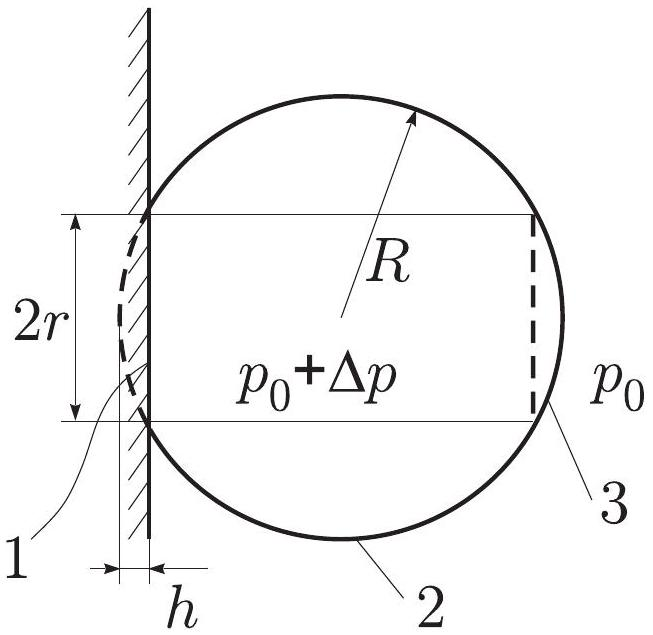
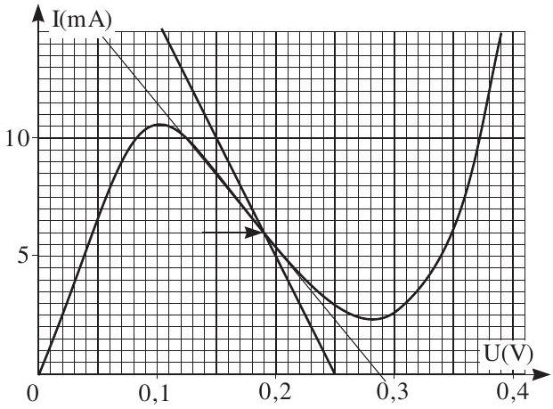
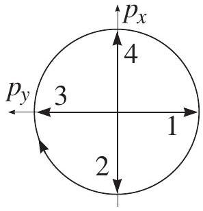
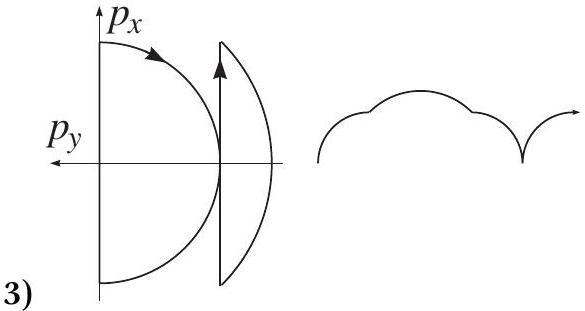
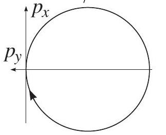
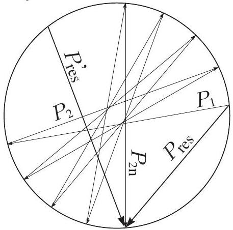
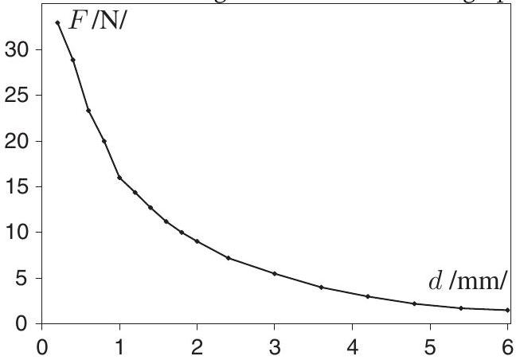

## Solutions

I. Volleyball (8 pts)

1) $F = \Delta p S$, where $S = \pi r ^ { 2 }$ is the segment base surface. It is easy to see that $r ^ { 2 } = ( 2 R - h ) h$, hence $F = \Delta p \pi h ( 2 R - h ) \approx 120 \mathrm {~N}$.
2) During the collision the ball is deformed as shown in Figure: the envelope is not stretchable, hence it retains the spherical shape (except where in touch with the wall). Using the approximation $h \ll R$ we can neglect the term $h ^ { 2 }$ in the expression for the force. Then, the force is proportional to $h$, ie. the ball behaves as a spring of stiffness $k = 2 \pi R \Delta p$. According to the energy conservation law $m v ^ { 2 } = 2 \pi R \Delta p h ^ { 2 }$, hence $h = v \sqrt { m / 2 \pi R \Delta p } \approx 11 \mathrm {~mm}$.

3) This is the half of the harmonic oscillations period, $\tau = \pi \sqrt { m / 2 \pi R \Delta p } = \sqrt { \pi m / 2 R \Delta p } \approx$ 18 ms.
4) Let us use the ball's system of reference. The envelope surface element $d S$ is exerted by the force of inertia $d F _ { i } = \operatorname { amdS } / 4 \pi R ^ { 2 }$, where $a =$ $\Delta p \pi h ( 2 R - h ) / m$. Thus, $d F _ { i } = \Delta p h ( 2 R -$ $h ) d S / 4 R ^ { 2 }$. In order to keep the spherical shape, this force has to be compensated by the force due to the excess pressure $d F _ { r } = \Delta p d S$, hence $h ( 2 R - h ) < 4 R ^ { 2 }$. This condition is always satisfied, no additional constraint is needed. Notice that we considered only the worst case requiring the largest compensating force when the force of inertia is normal to the surface. Remark: The case of stretchable envelope is completely different, sphericity disappears over all the surface (try to press a balloon against a glass!).
2. Heat flux (4 pts)
1) The heat flux $P = \Delta T s / \rho d$, hence $\Delta T =$ $P \rho d / s \approx 12 \mathrm {~K}$.
2) By a constant heat flux $P$, the temperature change along the wire $\Delta T = P \rho \Delta x / S$, where $\Delta x$ is a displacement along the wire. Hence the temperature drop $t _ { 1 } - t _ { 2 } = P \mathcal { S } / S$, where $\mathcal { S }$ is the surface under the graph. Thus, $P =$ $\left( t _ { 1 } - t _ { 2 } \right) S / \mathcal { S }$. Using the graph we find $\mathcal { S } \approx$ $50 \mathrm { Kcm } ^ { 2 } / \mathrm { W }$ and $P \approx 20 \mathrm {~mW}$.
3. Gravitation (6 pts)
1) $g _ { 0 } = \gamma M / R ^ { 2 }$, where $R$ can be found from the relationship $\frac { 4 } { 3 } \pi R ^ { 3 } \rho = M$. Hence,

$$
g _ { 0 } = \gamma M \left( \frac { 4 \pi \rho } { 3 M } \right) ^ { 2 / 3 } .
$$

2) Taking a piece of ground from a certain point of the planet surface and carrying it into another point, the free fall acceleration can be changed (the sign of the change depends on the direction of the transport).
3) Let use the polar coordinates with the origin at the point where the free fall acceleration is to be maximized. Let the axis $\phi = 0$ be given by the direction of the acceleration. Carrying a small piece of ground from a point $\left( r _ { 1 } , \phi _ { 1 } \right)$ to another point $\left( r _ { 2 } , \phi _ { 2 } \right)$ must keep the modulus of the acceleration vector $\vec { g }$ constant, i.e. the vector of the small change must be perpendicular to the vector $\vec { g }$. Consequently, $\cos \phi _ { 1 } / l _ { 1 } ^ { 2 } = \cos \phi _ { 2 } / l _ { 2 } ^ { 2 }$, hence $l = l _ { 0 } \sqrt { \cos \phi }$.

## 4. Tunnel diode (8 pts)

1) For voltages below 0.08 V , the graph is almost a straight line corresponding to a constant resistance $R _ { D } = 0.05 \mathrm {~V} / 6.5 \mathrm {~mA} \approx 7.7 \Omega$. Hence $I = \left( U _ { \text {in } } + \mathcal { E } \right) / \left( R + R _ { D } \right) \approx 4.5 \mathrm {~mA}$.
2) The output voltage can be found graphically: the diode voltage $U ( I ) = \mathcal { E } - I R$, hence, the intersection point of the graph and the straight line $U = \mathcal { E } - I R$, gives us the diode current 6 mA ; then, the output voltage $I R = 60 \mathrm { mV }$ (see the graph).

3) One millivolt input shifts the line intersecting the graph a little-bit sideward, but the shift is so small that the graph can be approximated by a straight line. The cotangent of the slope of that line gives us the differential resistance of the diode, $R _ { d } = - 16 \Omega$. Then, a small change in the input voltage $\Delta U$ will lead to a current change $\Delta I$ given by the relationship $\left( R + R _ { d } \right) \Delta I =$ $\Delta U$; hence, $\Delta I = \Delta U / \left( R _ { d } + R \right)$. The output voltage change $\Delta U _ { \text {out } } = I R = R \Delta U / \left( R _ { d } + \right.$ $R )$, and the amplification factor $\Delta U _ { \text {out } } / \Delta U =$ $R / \left( R _ { d } + R \right) \approx 1.7$. Consequently, the output voltage is 1.7 mV, and ...
4) the output graph is exactly the same as the input graph, except that it is vertically stretched by a factor of -1.7.
5. Vibration (10 pts)
1) $\mu m g \tau \ll v$.
2) $F = 0$, when $| v | < u ; F = \mu m g$, when $| v | > u$.
3) The $x$-component of the frictional force cancels in average out, the $y$-component is left: $F = \mu m g v / \sqrt { v ^ { 2 } + u ^ { 2 } }$.
4) $F = [ \mu ( v + u ) + \mu ( v - u ) ] m g$, if $v > u$ and $F = [ \mu ( u + v ) - \mu ( u - v ) ] m g$, if $v < u ( F > 0$ means that $F$ and $v$ are opposite to each other). It is easy to see that by small values of $v$, the force starts linearly decreasing [with $F ( v = 0 ) = 0$ ] $( F < 0$ implies that force and velocity are in the same direction). At $u = v$, the graph exerts a jump, $F$ becomes positive, and starts decreasing. The attached graph presents a sketch of the effective friction coefficient; the construction has been based on the lengths $\mu _ { k 1 } =$ $\mu \left( w _ { 0 } / 2 \right) - \mu \left( w _ { 0 } \right) , \mu _ { k 2 } = \mu \left( w _ { 0 } / 4 \right) - \mu \left( 5 w _ { 0 } / 4 \right)$, and $\mu _ { k 3 } = \mu ( 0 ) - \mu \left( 3 w _ { 0 } / 2 \right)$.

5) The rest position is unstable, if $u < w _ { 0 }$ : the particle obtains the (stable) velocity $u$. If $u > w _ { 0 }$, the rest position is stable, and the particle velocity remains 0.
6. Charged particle (12 pts)
1) The particle acquires the velocity $v = E q \tau / m$ and starts moving along a circle of radius $R$, with $m v ^ { 2 } / R = B v q$, hence $R = E \tau / B$.

2)

4) Let us consider the vectorial sum of the momenta given to the particle in different moments of time. During the time interval $\Delta t$, all the component-vectors are rotated by the angle $2 \pi \Delta t / T _ { B } = \tau B q / m$. Thus, with each impulse, a vector $\vec { P }$ with modulus $P = E q \tau$ is added; the angle between the lastly added vector, and the previously added vector is $\alpha = \Delta t B q / m$.
5) All these vectors, when added according to the triangle rule, form a circle of radius $\mathcal { R } = P / \sin \alpha \rightarrow P / \alpha = E _ { k } m / B$.

Hence, the average velocity $v _ { y } = - \mathcal { R } / m =$ $E _ { k } / B , v _ { x } = 0$.
6) Two subsequent momenta along $x$-axes result in net moment along $y$-axes $\mathcal { P } _ { y } = P \alpha$. The sequence of such moment pairs form a (nearly) circle (actually, regular equilateral polygon), composed of vectors (with modulus $\mathcal { P } _ { y }$ ), the angle between of which is $2 \alpha$ (see Fig.). The radius of the circle is $\mathcal { P } _ { y } / 2 \alpha = P / 2 = \frac { 1 } { 2 } E q \tau$, and its center coordinates are $m v _ { x } = - E q \tau / 2$, $m v _ { y } = 0$. After an even number of impulses, the endpoint of the particles momentum lies on that circle. Thus, averaged over the moments of time $2 n \Delta t$, the average velocity is $v _ { x } = - E q \tau / 2 m$.

For odd number of impulses, one has to add the lastly given momentum $\vec { P } = ( E q \tau , 0 )$; hence, a similar circle is formed, except that the center is shifted by $\vec { P }$ : the center coordinates are $m v _ { x } = E q \tau / 2 , m v _ { y } = 0$. Correspondingly, averaged over the moments of time $2 n \Delta t$, the average velocity is $v _ { x } = + E q \tau / 2 m$. Averaged over all the moments of time, the final result is $v _ { x } = v _ { y } = 0$.

The figure represents the net moment $P _ { \text {res } }$ after $2 n$-th impulse, and also the net impulse $P _ { \text {res } } ^ { \prime }$ for another time moment $2 n ^ { \prime } \Delta t$. For an odd number of impulses, the pattern is exactly the same, except that all the vectors have opposite direction (because the lastly added component, the vertical vector, has opposite direction).

## 7. Telescope (12 pts)

1) The light flux density decreases inversely proportionally to the square of the distance, therefore $w _ { 1 } = w _ { 0 } R _ { p } ^ { 2 } / L _ { p } ^ { 2 }$, where $R _ { p }$ is the solar radius, and $L _ { p }$ - the solar distance. Due to $\phi = 2 R _ { p } / L _ { p }$, we obtain $w _ { 1 } = w _ { 0 } \phi ^ { 2 } / 4$.
2) The previous result can be applied to the star flux density, which is $q ^ { - 2 } w _ { 1 }$; hence $P _ { 2 } =$ $\frac { 1 } { 4 } \pi D ^ { 2 } w _ { 1 } q ^ { - 2 } = w _ { 0 } \pi ( \phi D / 4 q ) ^ { 2 }$.
3) The paper surface area $S$ radiates towards the lens of the telescope the power $P _ { 3 } =$ $w _ { 1 } \alpha S \left( \frac { \pi } { 4 } D ^ { 2 } / L ^ { 2 } \right)$, where $L$ is the telescope distance. The image of this piece of paper has size $s = S F ^ { 2 } / L ^ { 2 }$; thus, $w _ { 3 } = P _ { 3 } / s =$ $w _ { 1 } \alpha \left( \frac { \pi } { 4 } D ^ { 2 } / F ^ { 2 } \right) = w _ { 0 } \alpha \pi ( \phi D / 4 F ) ^ { 2 }$.
4) The angular distance of the first diffraction minimum (using the single slit approximation - circle is actually not a slit) is $\lambda / D$. Hence, the bright circle radius can be estimated as $\delta = F \lambda / D$. Consequently, $w _ { 2 } = P _ { 2 } / \pi \delta ^ { 2 } =$ $w _ { 0 } \left( \phi D ^ { 2 } / 4 q F \lambda \right) ^ { 2 }$.
5) $k = \left( w _ { 2 } + w _ { 3 } \right) / w _ { 3 } = 1 + ( \alpha \pi ) ^ { - 1 } ( D / \lambda q ) ^ { 2 } \approx$ 4 (assuming $\lambda \approx 500 \mathrm {~nm}$ ).
6) $k - 1 \sim 1$ (or $k - 1 > 1$ ) means that the star can be easily seen (as is the case for the telescope); $k - 1 \ll 1$ means that the star cannot be seen (for the eye, $k - 1 \approx 1 \cdot 10 ^ { - 4 }$ ).

## 8. Experiment (12 pts)

1) We incline the plate until sheet starts sliding: the static coefficient is found as $\mu _ { \text {static } } =$ $h / \sqrt { l ^ { 2 } - h ^ { 2 } }$, where $h$ is height of the plate endpoint, and $l$ - the plate length. Now we push the sheet laying on the plate slightly, and find the inclination angle, for which the sheet will slide down with a constant velocity; we use again the formula $\mu _ { \text {kinetic } } = h / \sqrt { l ^ { 2 } - h ^ { 2 } }$. The reasonable numerical values are $\mu _ { \text {static } } \approx 0.37$ and $\mu _ { \text {kinetic } } \approx 0.29$.
2) We put several paper stripes on the plate, and the magnet on the top of them. We make a loop of cord, put it around the magnet, and pull it using the dynamometer sideward (sliding the whole system of paper and magnet). The attraction force $F \approx N$ (where $N$ is the reaction force) is found as the ratio of the reading of the dynamometer $F _ { d }$ and the appropriate friction coefficient (depends, which reading is taken: either the maximal one, or the one corresponding to sliding), $F \approx F _ { d } / \mu$. The distance $d$ is measured in the number of paper stripes (one stripe had a thickness of $\approx 0.2 \mathrm {~mm}$ ). For large distances (approximately $d > 4 \mathrm {~mm}$ ), the weight of the paper $F _ { p }$ stripes and magnet is no longer negligible, the accuracy of the results can be enhanced by subtracting this weight from $N : F = F _ { d } / \mu - F _ { p }$. 3) We use a similar set-up, except that smaller number of paper stripes is used (totaling up to around 2 mm), and a steep slope of the plate. We let the brick slide down the slope and hit on the magnet. We keep the falling height and plate slope constant, and measure the sliding path, which is covered by the papers and the magnet after having been hit by the brick. This path is inversely proportional to the attraction force $N$. If this path turns out to be too short for an accurate measurement (for very small distances between the magnet and the plate), several brick hits can be used. In that case, the single-hit path can be found as the measured path, divided by the number of hits. The constant of proportionality can be found by comparing the results of this and previous question, for those distances, which are covered by both measuring techniques. Reasonable measurement results are given in the attached graph.

3) The same technique as in the case of previous question is applied, except that a larger number of hits has to be used $( \approx 10 - - 20 )$. Reasonable result for $d = 0.2 \mathrm {~mm}$ (one paper stripe) is $F \approx 270 \mathrm {~N}$. Note that the result is much larger than the double result in the case of a single magnet; this is due to closing the ferromagnetic loop of magnetic field lines.
