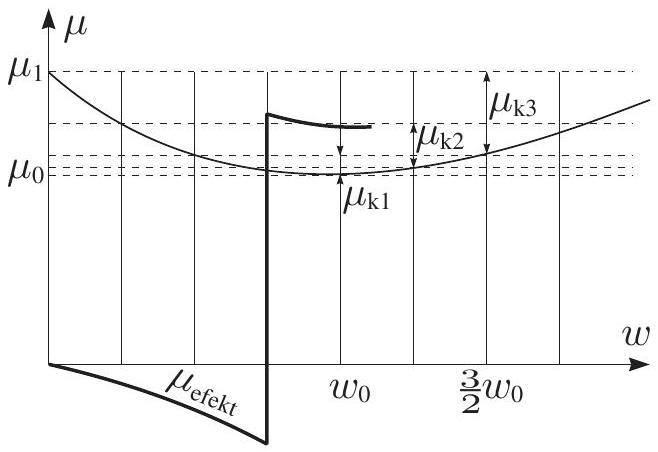

5. Vibration (10 pts)
1) $\mu m g \tau \ll v$.
2) $F = 0$, when $| v | < u ; F = \mu m g$, when $| v | > u$.
3) The $x$-component of the frictional force cancels in average out, the $y$-component is left: $F = \mu m g v / \sqrt { v ^ { 2 } + u ^ { 2 } }$.
4) $F = [ \mu ( v + u ) + \mu ( v - u ) ] m g$, if $v > u$ and $F = [ \mu ( u + v ) - \mu ( u - v ) ] m g$, if $v < u ( F > 0$ means that $F$ and $v$ are opposite to each other). It is easy to see that by small values of $v$, the force starts linearly decreasing [with $F ( v = 0 ) = 0$ ] $( F < 0$ implies that force and velocity are in the same direction). At $u = v$, the graph exerts a jump, $F$ becomes positive, and starts decreasing. The attached graph presents a sketch of the effective friction coefficient; the construction has been based on the lengths $\mu _ { k 1 } =$ $\mu \left( w _ { 0 } / 2 \right) - \mu \left( w _ { 0 } \right) , \mu _ { k 2 } = \mu \left( w _ { 0 } / 4 \right) - \mu \left( 5 w _ { 0 } / 4 \right)$, and $\mu _ { k 3 } = \mu ( 0 ) - \mu \left( 3 w _ { 0 } / 2 \right)$.

5) The rest position is unstable, if $u < w _ { 0 }$ : the particle obtains the (stable) velocity $u$. If $u > w _ { 0 }$, the rest position is stable, and the particle velocity remains 0.
