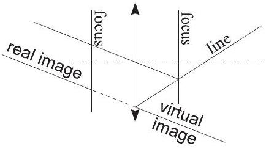
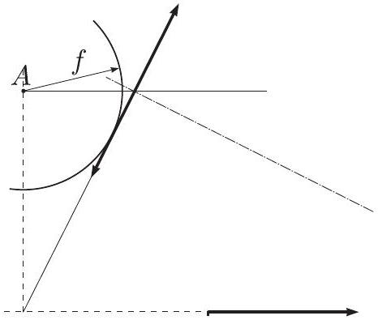
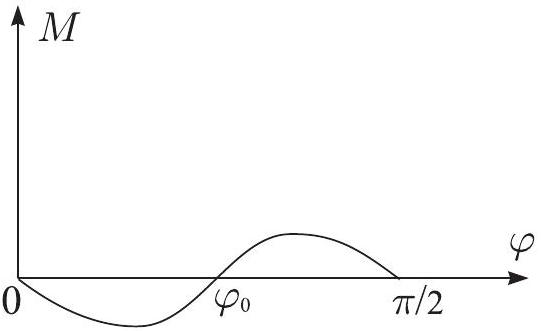

## I. Rubber fiber (12 pts)

1) Volume conservation: $S l = S _ { 0 } l _ { 0 }$, hence $S =$ $S _ { 0 } l _ { 0 } / l$.
2) At the limit of small deformations, $F ( l ) = a +$ $\frac { b } { l } \approx a - b x / l _ { 0 } ^ { 2 } = k _ { 0 } x$, hence $E _ { 0 } S _ { 0 } / l _ { 0 } = - b / l _ { 0 } ^ { 2 }$, hence $b = - E _ { 0 } S _ { 0 } l _ { 0 }$ (1 pt). Besides, at $l = l _ { 0 }$, $F = 0$ (0.5 pts), hence $a + \frac { b } { l } = 0$ and $a = E _ { 0 } S _ { 0 }$ (1 pt).
3) $\Delta F \approx \frac { d F } { d l } d l = E _ { 0 } S _ { 0 } \frac { l _ { 0 } \delta l } { l ^ { 2 } }$.
4) Newton II law: $E _ { 0 } S _ { 0 } \left( 1 - \frac { l _ { 0 } } { l } \right) = 2 K / l$, hence $l = l _ { 0 } + \frac { 2 K } { E _ { 0 } S _ { O } }$.
5) Conservation of angular momentum: $l v _ { t } =$ $L V _ { t }$, hence $v _ { t } = V _ { t } \frac { L } { L + r }$ (1.5 pts). Conservation of energy: $\frac { m } { 2 } \left( v _ { t } ^ { 2 } + v _ { r } ^ { 2 } \right) + E _ { 0 } S _ { 0 } \left( r - l _ { 0 } \ln \frac { r + L } { L } \right) =$ $\frac { m } { 2 } \left( V _ { t } ^ { 2 } + V _ { r } ^ { 2 } \right)$ (2 pts).
6) Substituting $v _ { t }$ from the angular momentum conservation law into the energy equation we obtain $\frac { m } { 2 } \left[ V _ { t } ^ { 2 } \left( \frac { L } { L + r } \right) ^ { 2 } + v _ { r } ^ { 2 } \right] + E _ { 0 } S _ { 0 } ( r -$ $\left. l _ { 0 } \ln \frac { r + L } { L } \right) = \frac { m } { 2 } \left( V _ { t } ^ { 2 } + V _ { r } ^ { 2 } \right)$ (0.4 pts). Further we make use of condition $| r | \ll L$ and substitute $\left( \frac { L } { L + r } \right) ^ { 2 } \approx 1 - 2 \frac { r } { L } + 3 \left( \frac { r } { L } \right) ^ { 2 } ( 0.4$ pts), $\ln \frac { r + L } { L } \approx \frac { r } { L } - \frac { 1 } { 2 } \left( \frac { r } { L } \right) ^ { 2 }$ (0.4 pts). Linear in $r$ terms cancel out due to the condition $E _ { 0 } S _ { 0 } \left( 1 - \frac { l _ { 0 } } { L } \right) = m V _ { t } ^ { 2 } / L$ (0.4 pts). So, we arrive at $\frac { m } { 2 } \left[ 3 V _ { t } ^ { 2 } \left( \frac { r } { L } \right) ^ { 2 } + v _ { r } ^ { 2 } \right] + \frac { 1 } { 2 } E _ { 0 } S _ { 0 } l _ { 0 } \left( \frac { r } { L } \right) ^ { 2 } = \frac { m } { 2 } V _ { r } ^ { 2 }$ (0.4 pts). This is the energy conservation law for a pendulum consisting of a spring with effective stiffness $k _ { \text {eff } } = \left( 3 m V _ { t } ^ { 2 } + E _ { 0 } S _ { 0 } l _ { 0 } \right) L ^ { - 2 }$ and of a body with effective mass $m _ { \text {eff } } = m$ (0.5 pts). So, $T = 2 \pi L / \sqrt { 3 V _ { t } ^ { 2 } + E _ { 0 } S _ { 0 } l _ { 0 } m ^ { - 1 } } \approx 2 \pi L / \sqrt { 3 } V _ { t }$ (0.3+0.2 pts).

## 2. Planets (6 pts)

1) First method: determine the tangents to the graph at the points where the curve crosses the horizontal axis, $a _ { 1 } \approx - 2.8$ and $a _ { 2 } \approx 16$ (in graph units), respectively. Then, $a _ { 2 } = \omega \frac { - k } { 1 + k }$ and $a _ { 2 } = \omega \frac { k } { 1 - k }$. The graph units will cancel out from the ratio of these to tangents, $\varepsilon = - \frac { a _ { 2 } } { a _ { 1 } } =$ $\frac { 1 + k } { 1 - k } \approx 5.7$, hence $k = \frac { 1 - \varepsilon } { 1 + \varepsilon } \approx 1.4$.

Second method (more precise): determine the distances between neighbouring minimum and maximum, $t _ { 1 } \approx 1.2$, and between neighbouring minima $t _ { 2 } \approx 4.6$ (in graph units), respectively. $\mu = \frac { t _ { 1 } } { t _ { 2 } } = \frac { \pi - 2 \arcsin k } { 2 \pi } \approx 0.261$, hence $k = \sin \left[ \left( \frac { 1 } { 2 } - \mu \right) \pi \right] \approx 1.47 \approx 1.5$.
2) For the maximal angular displacement $\varphi _ { m }$, $\sin \varphi _ { m } = k = \sin \left[ \left( \frac { 1 } { 2 } - \mu \right) \pi \right]$, hence $\varphi _ { m } =$ $\left( \frac { 1 } { 2 } - \mu \right) \pi = 0.75 \mathrm { rad } \approx 3.6$ units. Therefore, the unit is $\varphi _ { m } / \left( \frac { 1 } { 2 } - \mu \right) \pi \approx 4.8$.
3) If the angular velocities of the planets are $\omega _ { 1 }$ and $\omega _ { 2 }$, the seeming angular velocity (as seen from the system, where both star and the observer planet are at rest) is $\omega = \omega _ { 1 } - \omega _ { 2 }$. From the Newton II law, $G M r _ { i } ^ { - 2 } = \omega _ { i } ^ { 2 } r _ { i }$, where $i = 1,2$ and $r _ { i }$ is the planet's orbital radius. So, $\omega _ { i } = \sqrt { G M r _ { i } ^ { - 3 } }$ and $\omega = \sqrt { G M } \left( r _ { 2 } ^ { - 1.5 } - \right.$ $\left. r _ { 1 } ^ { - 1.5 } \right) = \sqrt { G M } r _ { 1 } ^ { - 1.5 } \left( 1 - k ^ { - 1.5 } \right)$. Finally, the square of the observed period $T ^ { 2 } = ( 2 \pi / \omega ) ^ { 2 } =$ $4 \pi ^ { 2 } r _ { 1 } ^ { 3 } / G M \left( 1 - k ^ { - 1.5 } \right) ^ { 2 }$ and $r _ { 1 } = \left[ T ^ { 2 } G M ( 1 - \right.$ $\left. \left. k ^ { - 1.5 } \right) ^ { 2 } / 4 \pi ^ { 2 } \right] ^ { 1 / 3 }$. Using $T \approx 4.6$ years $\approx 1.45$. $10 ^ { 8 } \mathrm {~s}$, we arrive at $r _ { 1 } \approx 2.5 \cdot 10 ^ { 11 } \mathrm {~m}$; correspondingly, $r _ { 2 } = k r _ { 1 } \approx 3.7 \cdot 10 ^ { 11 } \mathrm {~m}$.

## 3. Tilt-shift lens (6 pts)

From $f ^ { - 1 } = x ^ { - 1 } - x ^ { - 1 }$ we obtain $x = \frac { x ^ { \prime } f } { x ^ { \prime } + f }$. Since the ray passing through the centre of a lens without refraction, from similar triangles we obtain the relationship between the $y$-coordinates of the image: $y = y ^ { \prime } \frac { x } { x ^ { \prime } } = \frac { y ^ { \prime } f } { x ^ { \prime } + f }$. Substituting into $y = a x + b$ we result in $\frac { y ^ { \prime } f } { x ^ { \prime } + f } = a \frac { x ^ { \prime } f } { x ^ { \prime } + f } + b$, hence $y ^ { \prime } = a x ^ { \prime } + b \left( \frac { x ^ { \prime } } { f } + 1 \right) = x ^ { \prime } \left( a + \frac { b } { f } \right) + b$, which defines also a straight line.

1) First we notice that the line, its image, and lens plane intersect in one point, because the image of that point of the line which lays at the lens plane, coincides with itself. Now, it is easy to construct the image, see the figure.

2) First we notice that the distance of the image of the far end of the field (let us designate it by $A$ ) from the focal plane equals to the focal length $f$. So, the lens plane must touch the circle of radius $f$, drawn around $A$, see figure. Next we notice that there is one such ray connecting far end of the field and its image, which does not refract - the one passing through the enter of the lens, see figure.

## 4. Transparent film (6 pts)

The short-wavelength oscillations on the graph are due to the diffraction on the film, therefore the local maximum condition is $2 d n =$ $\lambda N = c N / \nu$. So, $2 d n \nu = c N$ and $2 d n ( \nu +$ $\delta ) \nu = c ( N + 1 )$, hence $2 d n \delta \nu = c$ and $d =$ $c / 2 n \delta \nu$. In order to measure the distance between two maxima more precisely, we take a longer frequency interval, e.g. $\Delta \nu = 80 \mathrm { THz }$ and count the number of maxima between them, $m \approx 34$. Consequently, $\delta \nu = \Delta \nu / m \approx$ 2.35 THz , and $d \approx 50 \mu \mathrm {~m}$

## 5. 4th order ellipse (6 pts)

1) There are trivial positions $\varphi = 0$ and $\varphi =$ $\pi / 2$. Besides, there is a position between these two. At the equilibrium, the vector from the origin to the touching point $\vec { r } = ( x , y )$ has to be perpendicular to the tangent at that point. In order to find the tangent, let us differentiate the ellipse formula: $4 \frac { x ^ { 3 } } { a ^ { 4 } } d x + 4 \frac { y ^ { 3 } } { b ^ { 4 } } d y = 0$, hence, with $d x = 1 , d y = - \frac { x ^ { 3 } } { y ^ { 3 } } \frac { b ^ { 4 } } { a ^ { 4 } }$, a tangent vector is $\vec { \tau } =$ $\left[ 1 , - \left( \frac { x } { y } \right) ^ { 3 } \left( \frac { b } { a } \right) ^ { 4 } \right]$. The vectors are perpendicular, if the scalar product is zero: $x - y \left( \frac { x } { y } \right) ^ { 3 } \left( \frac { b } { a } \right) ^ { 4 }$, i.e. $\frac { y } { x } = \left( \frac { b } { a } \right) ^ { 2 } = \varphi = \arctan \frac { y } { x } = \left( \frac { b } { a } \right) ^ { 2 }$.
2) Around each zero $\varphi$ changes sign. At $\varphi = 0$, small increase in $\varphi$ will result in a torque trying to return to the initial position, i.e. the torque becomes negative. So, the graph looks like the one below.

3) If the derivative of the graph at equilibrium point is negative, the position is stable; otherwise it is unstable. $\varphi = 0$ and $\varphi = \pi / 2$ are stable, $\varphi = \left( \frac { b } { a } \right) ^ { 2 }$ is unstable.

## 6. Magnets (6 pts)

1) Each permanent magnet can be considered as a solenoidal molecular current at the surface of the magnets. Suppose that each magnet has net surface current $I$. Consider triangular contour going through the interiors of the magnets $A , B , C$. According to the circulation theorem for that contour, the circulation $B _ { A } l + B _ { B } l +$ $B _ { C } l$ is proportional to the overall molecular current through that contour: $B _ { A } l + B _ { B } l + B _ { C } l =$ $3 k I$. Here, $B _ { A }$ designates magnetic inductance inside the magnet $A ; B _ { B }$ and $B _ { C }$ are defined analogously. For a single magnet attached to a massive U-shaped ferromagnetic, the circulation theorem yields $B _ { 0 } l = k I$ (where $B _ { 0 }$ is the magnetic inductance inside the magnet; the contribution to the circulation inside a massive Ushaped ferromagnetic can be neglected, because the magnetic field there is much smaller than inside the magnet). So, $B _ { A } + B _ { B } + B _ { C } = 3 B _ { 0 }$ and $\Phi _ { A } + \Phi _ { B } + \Phi _ { C } = 3 \Phi$.
2) There are no sources of magnetic field lines (and hence of the flux), so $\Phi _ { A } = \Phi _ { B } + \Phi _ { F }$.
3) Due to symmetry, $\Phi _ { F } / \Phi _ { C } = 1$.
4) Upon using symmetry, $\Phi _ { F } = \Phi _ { C }$ and $\Phi _ { D } =$ $\Phi _ { B }$. From the circulation theorem for the triangle $C D E , \Phi _ { C } + \Phi _ { E } - \Phi _ { B } = \Phi$. From the noflux-source condition for the vertex with magnets $E , C , B$ we obtain $\Phi _ { E } = \Phi _ { C } - \Phi _ { B }$. Together with the equations form questions 1 and 2, $\Phi _ { A } = \frac { 3 } { 2 } \Phi , \Phi _ { C } = \Phi _ { F } = \Phi , \Phi _ { B } = \Phi _ { D } =$ $\Phi _ { E } = \frac { 1 } { 2 } \Phi$.
5) The larger the flux, the more difficult to remove a magnet, because the magnetic flux needs to go through the air gap which will be formed (enlarging the magnetic energy), when starting the removal. So, the answer is " $A$ ".

## 7. Passive air-cooling (9 pts)

1) Using $\gamma = c _ { p } / c _ { V }$ and $c _ { p } = c _ { V } + R$ we arrive at $c _ { p } = \frac { \gamma } { \gamma - 1 } R$.
2) From the ideal gas equation, $p _ { 0 } = \frac { \rho } { \mu } R T$ (the process is by constant pressure, otherwise there would be huge acceleration due to pressure drop).
3) Different air densities inside and outside the pipe give rise to small residual (as compared to the static pressure distribution inside the pipe) pressure difference between the open ends of the pipe, $\Delta p = - \Delta \rho g L$. This pressure difference is responsible for the acceleration of the air, from zero, up to the velocity of the air flow $v$. The momentum balance for small time interval $\tau$ yields $S \Delta p \tau = \rho ( S v \tau ) v$, hence $\left( \rho _ { 0 } - \rho \right) g L = \rho v ^ { 2 }$. . Here, the cold air density $\rho _ { 0 } = p _ { 0 } \mu / R T _ { 0 }$. Finally, $\left( \frac { p _ { 0 } \mu } { R T _ { 0 } } - \rho \right) g L = \rho v ^ { 2 }$.
4) Heat flux: $P = \frac { \gamma } { \gamma - 1 } R \left( T - T _ { 0 } \right) S v \rho / \mu$.
5) From the result of question 2 , we obtain $\frac { \Delta \rho } { \rho } = - \frac { \Delta T } { T }$. From the result of question $3 , \frac { \Delta \rho } { \rho } = - \frac { v ^ { 2 } } { g L }$. Substituting these values into the equation obtained for question 4, $P =$ $\frac { \gamma } { \gamma - 1 } R \frac { v ^ { 3 } } { g L } T S \rho / \mu$. Using the gas equation, this simplifies to $v ^ { 3 } = \frac { \gamma } { \gamma - 1 } \frac { g L } { S } \frac { P } { p _ { 0 } }$. So, $T = T _ { 0 } [ 1 +$ $\left. \left( \frac { \gamma } { \gamma - 1 } \frac { g L } { S } \frac { P } { p _ { 0 } } \right) ^ { 2 / 3 } / g L \right] \approx 322 \mathrm {~K}$.

## 8. Loop of wire (7 pts)

1) At the distance $r$ from the current $I _ { 0 }$, the magnetic induction $B = \frac { \mu _ { 0 } I _ { 0 } } { 2 \pi r }$. Then, the flux through the contour $\Phi = \int _ { l } ^ { l + a } B b d x =$ $\int _ { l } ^ { l + a } \frac { b \mu _ { 0 } I _ { 0 } } { 2 \pi x } d x = \frac { b \mu _ { 0 } I _ { 0 } } { 2 \pi } \ln \frac { a + l } { l }$.

Alternatively, we can find it using the graph by determining the area $S$ under the curve, from $r = r _ { 1 } = 0,01 \mathrm {~m}$ to $r = r _ { 2 } = 0,04 \mathrm {~m}$ : $S \approx 0,28 \mathrm { mT } \cdot \mathrm { m }$, further, $\Phi = S b = 280 \mu \mathrm {~Wb}$.
2) After switching off the current, the flux through the tends to zero. From the Ohm's law $R \frac { d q } { d t } = \frac { d \Phi } { d t }$, hence $R d q = d \Phi$, i.e. $R Q = \Delta \Phi =$ $\Phi$. Finally, $Q = \Phi / R = 280 \mu \mathrm { C }$.
3) We calculate the force as difference between the forces at the two loop segments parallel to the straight line: $F _ { 1 } = b i B _ { 1 }$ and $F _ { 2 } =$ $b i B _ { 2 }$, where $i = R ^ { - 1 } \frac { d \Phi } { d t }$. So, $d p = \left( F _ { 1 } - \right.$ $\left. F _ { 2 } \right) d t = b R ^ { - 1 } \left( B _ { 1 } - B _ { 2 } \right) d \Phi$. Using $B _ { 1 } =$ $\mu _ { 0 } I / 2 \pi l$ and $B _ { 1 } = \mu _ { 0 } I / 2 \pi ( l + a )$, we end up with $d p = \frac { b } { R } \frac { \mu _ { 0 } I } { 2 \pi } \frac { a } { l ( l + a ) } d \Phi$. Using the result of first question, $d \Phi = \frac { b \mu _ { 0 } } { 2 \pi } \ln \frac { a + l } { l } d I$, i.e. $d p = \left( \frac { b \mu _ { 0 } } { 2 \pi } \right) ^ { 2 } \frac { a } { R l ( l + a ) } \ln \frac { a + l } { l } I d I$. Finally, $p =$ $\frac { a \left( b \mu _ { 0 } I _ { 0 } \right) ^ { 2 } } { 8 \pi ^ { 2 } R l ( l + a ) } \ln \frac { a + l } { l } \approx 2.08 \cdot 10 ^ { - 6 } \mathrm {~kg} \cdot \mathrm {~m} / \mathrm { s } ^ { 2 }$.

The same result could have been obtained using the graph and approach used in the alternative solution of the question 1.

## 9. Experiment (15 pts)

The idea: take readings of discharge current, as a function of time. The surface area under the graph is the outflown charge $Q$. Taking the readings of voltage $U _ { 0 }$ and $U _ { 1 }$ at the beginning and at the end of discharge, we obtain $Q / C = U _ { 0 } -$ $U _ { 1 }$, i.e. $C = Q / \left( U _ { 0 } - U _ { 1 } \right)$. As for V-I characteristic, interrupt from time to time discharge, take reading of discharge current $I$ just before interruption, measure voltage $U$, and continue discharging. Collect enough data to draw V-I characteristic.
