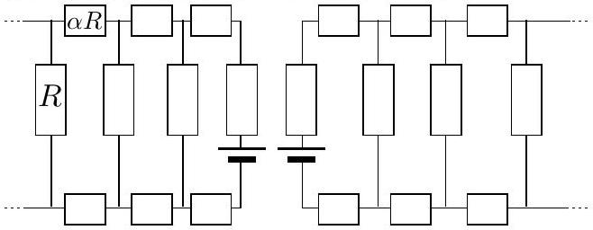
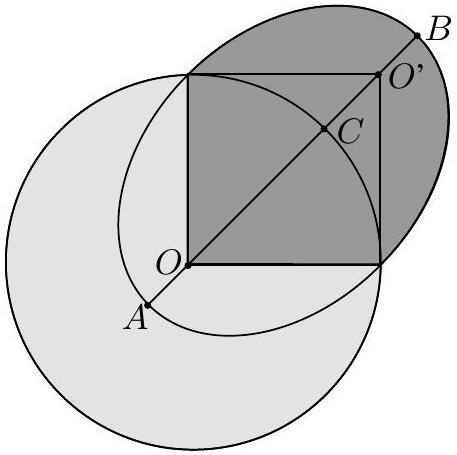

## I. Rock Climber

1) In the case of falling, the acceleration should not exceed $5 g$, which means that $\frac { \sigma ( \varepsilon ) } { m } - g < 5 g$. Maximum strain is the solution of the following equation $\sigma ( \varepsilon ) = 6 g m = 6 \times 9.8 \frac { m } { s ^ { 2 } } \times 80 k g = 4.7 k N$. According to the graph, $\varepsilon = 0.315$; hence, $l < 0.315 ( L + H ) + L$
2) In the case of falling, the climber reaches the lowest point, when its velocity become zero. This means that the energy absorbed by the rope becomes equal to the change of the potential energy:

$$
E = m g ( 2 L + x ) ,
$$

where $x = l - L$. Energy absorbed by the rope is given by

$$
E = \int \sigma ( \varepsilon ) d x = \int \sigma ( \varepsilon ) ( L + H ) d \varepsilon = ( L + H ) \int \sigma ( \varepsilon ) d \varepsilon
$$

We know that the maximal value is $\varepsilon = 0.315$, which makes it possible to calculate the integral numerically, as the area under the graph.

$$
S ( \varepsilon ) = \int _ { 0 } ^ { 0.31 } \sigma ( \varepsilon ) d \varepsilon \approx 564.8 N
$$

Thus,

$$
( L + H ) S ( \varepsilon ) = m g ( 2 L + x ) = m g ( 2 L + \varepsilon ( L + H ) ) ,
$$

hence

$$
L = \frac { H ( m g \varepsilon - S ( \varepsilon ) ) } { S ( \varepsilon ) - m g ( \varepsilon + 2 ) } \approx 5.08 m .
$$

So, the new carabiner must be anchored within next $L = 5.08 \mathrm {~m}$.

## 2. Magnetic brake

1) Sleeper is a simple cylindrical conductor:

$$
R = \frac { \rho h } { \left( \frac { \delta } { 2 } \right) ^ { 2 } \pi } \approx 5.59 m \Omega
$$

2) Length of the railway element is $\alpha R$, hence the resistance is $R _ { 2 } =$ $\alpha R$. Main ideas: first - we can imagine that railway is infinite; second - the resistance $\left( R _ { R } \right)$ of this infinit array remain same even if we cut of one periodic element. Hence,

$$
R _ { R } = \frac { R \left( 2 R _ { 2 } + R _ { R } \right) } { 2 R _ { 2 } + R _ { R } + R } .
$$

After solving the equation

$$
R _ { R } = - R _ { 2 } \pm \sqrt { R _ { 2 } ^ { 2 } + 2 R _ { 2 } R } = \sqrt { R _ { 2 } ^ { 2 } + 2 R _ { 2 } R } - R _ { 2 }
$$

and noting that the negative solution of the equation has to be dropped (it does not have physical meaning), we arrive at

$$
R _ { R } = R ( \sqrt { \alpha ( \alpha + 2 ) } - \alpha ) .
$$

3) Important ideas:
- electromotive force is generated when conductors move in magnetic field;
- There is always two sleepers moving between magnets (in magnetic field);
- Those sleepers act as a sources of electromotive force (like a battery);
- those sleepers also have internal resistance $R$.

Notice also that we can take account symmetry and connect points with equal potential; this allows us later to simplify cyclic railway to previously solved infinite (actually, very long) railway. We can also see that there is no current between the two sleepers residing in the magnetic field (there is no potential difference), hence we can disconnect them. So, we can obtain two indipendent (almost) infinite railways and both have their own source of elecromotive force.

4) Electromotive force in the sleeper is $\mathcal { E } = B v h$. Energy is dissipated into heat $P = \frac { \mathcal { E } ^ { 2 } } { R _ { \text {circuit } } }$. where $R _ { \text {circuit } } = \frac { 1 } { 2 } \left( R _ { R } + 2 \alpha R + R \right)$,

$$
R _ { \text {circuit } } = \frac { 1 } { 2 } R ( \sqrt { \alpha ( 2 + \alpha ) } + \alpha + 1 ) .
$$

Consequently

$$
P = \frac { 2 B ^ { 2 } \omega ^ { 2 } r ^ { 2 } h ^ { 2 } } { R ( \sqrt { \alpha ( 2 + \alpha ) } + \alpha + 1 ) }
$$

Eventually,

$$
k = \frac { 2 r ^ { 2 } h ^ { 2 } } { \sqrt { \alpha ( 2 + \alpha ) } + \alpha + 1 } \approx 2.12 \times 10 ^ { - 6 } .
$$

5) Since the power equls to $M \omega = P$, the torqe can be found as

$$
M = \frac { P } { \omega } = \frac { 2 B ^ { 2 } \omega r ^ { 2 } h ^ { 2 } } { R ( \sqrt { \alpha ( 2 + \alpha ) } + \alpha + 1 ) } \approx 0.39 \mathrm { mNm } .
$$

6) Disc has a momentum of inertia eual to $I = \frac { 1 } { 2 } m r ^ { 2 }$; the angular acceleration $\varepsilon = \frac { M } { I } = \frac { d \omega } { d t }$. Consequently (using decelerating M),

$$
\frac { k B ^ { 2 } \omega } { I R } = - \frac { d \omega } { d t } .
$$

If we group the variables $I$ and $t$ into different side of the equation, we obtain

$$
\frac { k B ^ { 2 } } { I R } d t = \frac { d \omega } { \omega } .
$$

Integrating the both sides of the equation yields

$$
\int _ { 0 } ^ { t } \frac { k B ^ { 2 } } { I R } d t = - \int _ { \omega _ { 0 } } ^ { \omega } \frac { d \omega } { \omega } \Rightarrow \frac { k B ^ { 2 } } { I R } t = - \ln \frac { \omega } { \omega _ { 0 } }
$$

$\omega = \omega _ { 0 } e ^ { - \frac { k B ^ { 2 } } { 1 R } } t$, and finally $\tau = \frac { I R } { k B ^ { 2 } } \approx 2.9 s$.

## 3. Ballistic rocket

1) The net energy depends only on the longer semi-axes. Hence, the longer semi-axes is the same as in the case of near-Earth orbit: $a = R$.

2) The ellipse has a property that the sum of lengths from each point on the orbit to the both foci of the orbit is constant (equals to $2 a$ ). Hence, the other focus (i.e. which is not the centre of Earth) is at the distance $R$ from both the launching point and landing point, see Fig. So, the height $h = | C B | = | O B | - R$; since $| O B | = R + \frac { 1 } { 2 } \left| O O ^ { \prime } \right| = R \left( 1 + \frac { \sqrt { 2 } } { 2 } \right)$, we finally obtain $h = \frac { R } { \sqrt { 2 } }$.
3) The ratio of the flight time to the period along the elliptic orbit equals to the ratio of two surface areas: the one painted dark grey in Fig, and the overall area of the ellipse. The rotation period is the same as in the case of near-Earth orbit (due to Kepler's third law), $T = 2 \pi R / v = 2 \pi \sqrt { R / g }$. The dark gray surface area is calculated as the sum of half of the ellipse area, and a triangle area. So, $\tau = T \cdot \left( \frac { \pi } { 2 } R \cdot \frac { R } { \sqrt { 2 } } + R ^ { 2 } / 2 \right) / \pi R \cdot \frac { R } { \sqrt { 2 } } = ( \pi + \sqrt { 2 } ) \sqrt { R / g }$.

## 4. Water pump

1) Let us consider the process in the system, rotating together with the tank. Then, there is a potential energy related to the centrifugal force: $U _ { c } = \int _ { 0 } ^ { r } \omega ^ { 2 } r d r = \frac { 1 } { 2 } \omega ^ { 2 } r ^ { 2 }$. So, the pressure $p _ { 2 } = p _ { 0 } - \rho g h + \frac { 1 } { 2 } \omega ^ { 2 } r ^ { 2 }$.
2) From the Bernoulli formula, $\frac { 1 } { 2 } \rho u ^ { 2 } = p _ { 2 } - p _ { 0 } = \frac { 1 } { 2 } \omega ^ { 2 } r ^ { 2 } - \rho g h$, hence the squared velocity in the rotating reference system $u ^ { 2 } = \omega ^ { 2 } r ^ { 2 } - 2 g h$. The laboratory speed $v _ { 2 } = u ^ { 2 } + \omega ^ { 2 } r ^ { 2 } = 2 \left( \omega ^ { 2 } r ^ { 2 } - g h \right)$, i.e. $v _ { 2 } =$ $\sqrt { 2 \left( \omega ^ { 2 } r ^ { 2 } - g h \right) }$.
3) The point of lowest pressure $p _ { m }$ inside the pump is the upmost point of the tube. Using the Bernoulli formula, $p _ { 0 } = p _ { m } + \rho g h + \frac { 1 } { 2 } \rho v _ { 1 } ^ { 2 }$, where the velocity in the tube can be found from the continuity condition: $S _ { 1 } v _ { 1 } = S _ { 2 } u = S _ { 2 } \sqrt { \omega ^ { 2 } r ^ { 2 } - 2 g h }$. Therefore, $p _ { m } = p _ { 0 } - \rho g h -$ $\frac { 1 } { 2 } \rho \left( \omega ^ { 2 } r ^ { 2 } - 2 g h \right) \left( \frac { S _ { 2 } } { S _ { 1 } } \right) ^ { 2 }$. Notice that the "boiling" starts when $p _ { m } = p _ { k }$.
So, $\omega _ { m } ^ { 2 } r ^ { 2 } = 2 g h + \left( \frac { p _ { 0 } - p _ { k } } { \rho } - g h \right) \left( \frac { S _ { 1 } } { S _ { 2 } } \right) ^ { 2 }$; finally we obtain

$$
\omega _ { m } = r ^ { - 1 } \sqrt { 2 g h + \left( \frac { p _ { 0 } - p _ { k } } { \rho } - g h \right) \left( \frac { S _ { 1 } } { S _ { 2 } } \right) ^ { 2 } } .
$$

4) The maximal productivity is apparently achieved for the highest efficiency. The efficiency is highest, when the residual velocity is lowest: $u \rightarrow 0$, and $\omega \rightarrow \omega _ { \text {min } }$. According to the results of the second question, $\omega _ { \text {min } } = r ^ { - 1 } \sqrt { 2 g h }$. So, the minimal residual velocity of the water streams is $v _ { \text {min } } = \omega _ { \text {min } } r = \sqrt { 2 g h }$. The associated lost power is $\frac { 1 } { 2 } \mu v _ { \text {min } } ^ { 2 } = \mu g h$. The useful power is associated with the potential energy increase (by $g h$ ),i.e. the total power $P = 2 \mu g h$. Hence, $\mu = P / 2 g h$.

## 5. Anemometer

1) First we need to find the angle after the refraction $\beta$ : For small incidence angles we find approximately $\beta = \alpha / n$. In the liquid, the wavelength is decreased $n$ times: $\lambda ^ { \prime } = \lambda / n$. The requested wavelength can be found as the distance between the lines connecting the intersection points of the equal phase lines of the two beams. Alternatively (and in a simpler way), it is found as the difference of the two wavevectors: $k ^ { \prime } = k \beta$, where $k = 2 \pi / \lambda ^ { \prime } = 2 \pi n / \lambda$ is the wavevector of the incident beams. So, $\Delta = 2 \pi / k ^ { \prime } = \lambda / \alpha \approx 7,4 \mu \mathrm {~m}$.
2) The scattered light fluctuates due to the motion of the scattering particles; the frequency is $\nu = v / \Delta = v \alpha / \lambda$. There is no way to determine the direction of the flow, but the modulus is obtained easily: $v = \nu \lambda / \alpha \approx 0.37 \mathrm {~m} / \mathrm { s }$.
3) The spatial structure of the interference pattern remains essentially unchanged (the wavelength difference is negligible). However, the pattern obtains temporal frequency $\delta \omega = \delta ( c / \lambda ) \approx c \delta \lambda / \lambda ^ { 2 }$. The velocity of the interference pattern $u = \Delta \delta \omega = \frac { c } { \alpha } \frac { \delta \lambda } { \lambda }$. If the fluid speed is $v \approx 0.37 \mathrm {~m} / \mathrm { s }$, then the relative speed of the pattern and the fluid is $\nu ^ { \prime } = \frac { c } { \alpha } \frac { \delta \lambda } { \lambda } \pm v$, depending on the direction of the flow (in both cases, $\nu ^ { \prime } \approx 740 \mathrm { kHz }$ ). So, the output frequency allows us to determine the flow direction as long as we can be sure that the interference pattern velocity is larger than the flow velocity.

## 6. Mechano-electrical oscillator

1) From the Newton's second law, $m \ddot { x } = - k x$, hence $\ddot { x } = - \frac { k } { m } x$, hence $\omega = \sqrt { k / m }$.
2) From the Gauss' law, the charge on the plate $Q = S \varepsilon _ { 0 } E =$ $S \varepsilon _ { 0 } U / X _ { 1 }$. The force acting on it $F _ { e } = k \left( X _ { 0 } - X _ { 1 } \right) = Q \langle E \rangle$, where $\langle E \rangle$ is the average electric field (averaged over the charges). Let us look at the charge layer (at the surface of the plate) with a high magnification: the electric field there depends linearly on the net charge inwards (in the plate) from the current point. Therefore, the average field is just the arithmetic average of the fields on both sides of the layer: $\langle E \rangle = E / 2$. Finally, $F _ { e } = k \left( X _ { 0 } - X _ { 1 } \right) = Q E / 2$ (this result could have been obtained from energetic considerations, using infinitesimal virtual displacement of the plate and the energy conservation law). So, $F _ { e } = \frac { S } { 2 } \varepsilon _ { 0 } \left( U / X _ { 1 } \right) ^ { 2 }$, hence $U = X _ { 1 } \sqrt { 2 k \left( X _ { 0 } - X _ { 1 } \right) / S \varepsilon _ { 0 } }$.
3) If the plates move by $x$, the change of the force due to electric field is $\delta F _ { e } = x \left| \frac { d } { d X _ { 1 } } \frac { S } { 2 } \varepsilon _ { 0 } \left( U / X _ { 1 } \right) ^ { 2 } \right| = \frac { x } { X _ { 1 } } S \varepsilon _ { 0 } \left( U / X _ { 1 } \right) ^ { 2 }$; bearing in mind that $\frac { S } { 2 } \varepsilon _ { 0 } \left( U / X _ { 1 } \right) ^ { 2 } = k \left( X _ { 0 } - X _ { 1 } \right)$, we obtain $\delta F _ { e } = 2 \frac { x } { X _ { 1 } } k \left( X _ { 0 } - X _ { 1 } \right)$. There is also force cahnge due to elasticity: $\delta F _ { k } = - k x$; the two forces have opposite sign (while approaching the discs, $\delta F _ { k }$ tries to push back, and $\delta F _ { e }$ tries to pull disks even closer). So, $\delta F = - k x \left[ 1 - 2 \left( \frac { X _ { 0 } } { X _ { 1 } } - \right. \right.$ $1 ) ] = - k x \left( 3 - 2 \frac { X _ { 0 } } { X _ { 1 } } \right)$. Finally, $\ddot { x } = \delta F / m = - x \frac { k } { m } \left( 3 - 2 \frac { X _ { 0 } } { X _ { 1 } } \right)$, and $\omega = \sqrt { \frac { k } { m } \left( 3 - 2 \frac { X _ { 0 } } { X _ { 1 } } \right) }$
4) Now we have two oscillating variables, $x$ and $q$. First, we write down the equation due to Kirchoff's laws: $L \ddot { q } = - \frac { q } { C } - x Q \frac { d } { d X _ { 1 } } C ^ { - 1 }$. Here, the second term describes the voltage change on the capacitor due to the change of the capacitance (we approximate the real change by differential, valid for small shifts $x$ ). Note that $C ^ { - 1 } = X _ { 1 } / S \varepsilon _ { 0 }$ and

$$
\begin{aligned}
& Q = S \varepsilon _ { 0 } U / X _ { 1 } ; \text { hence } \frac { d } { d X _ { 1 } } C ^ { - 1 } = 1 / S \varepsilon _ { 0 } , \text { and } \\
& L \ddot { q } = - \frac { q } { C } - U \frac { x } { X _ { 1 } } .
\end{aligned}
$$

Here, the sign of the second term assumes that the $x$-axes is directed upwards (there is no current in the inductance and $L \ddot { q } = 0$, if the voltage on the capacitor keeps constant; for increasing charge $q > 0$, this assumes increasing capacitance, i.e. $x < 0$; in a full agreement with the signs of the above expression).

The second equation describes the Newton second law. First we note that the expression for $F _ { e }$ can be rewritten as $F _ { e } = Q ^ { 2 } / 2 S \varepsilon _ { 0 }$. So, if the charge on the plate does not change $( q = 0 )$, neither does change $F _ { e }$. So, $\delta F _ { e } = q \frac { d } { d Q } Q ^ { 2 } / 2 S \varepsilon _ { 0 } = q Q / S \varepsilon _ { 0 }$. The infinitesimal force changes ( $\delta F _ { k }$ and $\delta F _ { e }$ ) can be simply added:

$$
m \ddot { x } = - k x - q Q / S \varepsilon _ { 0 } .
$$

Now, let us look for a sinusoidal solution of circular frequency $\omega$. Then, $\ddot { x } = - \omega ^ { 2 } x$ and $\ddot { q } = - \omega ^ { 2 } q$. Substituting this into the two above obtained equations, we find

$$
\left\{ \begin{array} { l }
\left( L \omega ^ { 2 } - C ^ { - 1 } \right) q = x U / X _ { 1 } \\
\left( \omega ^ { 2 } m - k \right) x = q Q / S \varepsilon _ { 0 }
\end{array} . \right.
$$

This has a non-zero solution for $x$ and $q$ only if

$$
\left( L \omega ^ { 2 } - C ^ { - 1 } \right) \left( \omega ^ { 2 } m - k \right) = U Q / X _ { 1 } S \varepsilon _ { 0 } .
$$

Bearing in mind that $U Q / X _ { 1 } = 2 k \left( X _ { 0 } - X _ { 1 } \right)$ and $C = \varepsilon _ { 0 } S / X _ { 1 }$, we can rewrite the equation as

$$
\left( \varepsilon _ { 0 } S L \omega ^ { 2 } - X _ { 1 } \right) \left( \omega ^ { 2 } m - k \right) = 2 k \left( X _ { 0 } - X _ { 1 } \right) .
$$

Introducing $\omega _ { 0 } ^ { 2 } = k / m$ and $\omega _ { 1 } ^ { 2 } = X _ { 1 } / \varepsilon _ { 0 } S L$ we can further rewrite as

$$
\omega ^ { 4 } - \omega ^ { 2 } \left( \omega _ { 1 } ^ { 2 } + \omega _ { 0 } ^ { 2 } \right) + \omega _ { 0 } ^ { 2 } \omega _ { 1 } ^ { 2 } \left( 3 - 2 \frac { X _ { 0 } } { X _ { 1 } } \right) = 0 .
$$

Therefore,

$$
2 \omega ^ { 2 } = \omega _ { 1 } ^ { 2 } + \omega _ { 0 } ^ { 2 } \pm \sqrt { \omega _ { 1 } ^ { 4 } + \omega _ { 0 } ^ { 4 } + 2 \omega _ { 1 } ^ { 2 } \omega _ { 0 } ^ { 2 } \left( X _ { 0 } X _ { 1 } ^ { - 1 } - 5 \right) } ,
$$

i.e. this system has two eigenfrequencies, if $\frac { X _ { 0 } } { X _ { 1 } } < \frac { 3 } { 2 }$ (and becomes unstable, otherwise).

## 7. Heat exchange

1) It is easy to see that the temperature profile along the plate is linear, and the temperature difference $\Delta T$ between the two plates is constant, $\Delta T \equiv T _ { 0 } - T _ { 2 }$. Indeed, then the heat exchange rate $q$ (per unit plate area) is also constant, which in its turn corresponds to a linear temperature profile. Let us use a reference frame moving together with the incoming air. Then, the temperature increase rate at a given point is $\dot { T } = v \left( T _ { 2 } - T _ { 1 } \right) / x$. Then, the heat balance for a air element of volume $V = s \times h$ is written as $\rho s h c _ { p } \dot { T } = q = s \sigma \Delta T / d = s \sigma \left( T _ { 0 } - T _ { 2 } \right) / d$. So, $p s h c _ { p } v \left( T _ { 2 } - T _ { 1 } \right) / x = s \sigma \left( T _ { 0 } - T _ { 2 } \right) / d$, hence

$$
T _ { 2 } = \frac { x \sigma T _ { 0 } + \rho h c _ { p } v d T _ { 1 } } { x \sigma + \rho h c _ { p } v d } .
$$

2) Rewriting the heat balance equation $P = - C \frac { d T } { d t }$ as $d t = - C P ^ { - 1 } d T$ we conclude that time can be found via the area $S$ under the graph, where $P ^ { - 1 }$ is plotted versus the temperature as $t = S C$. The graph data:

| $T ( \mathrm {~K} )$ | 100 | 200 | 300 | 400 | 500 | 600 | 700 | 800 |
| :--- | :--- | :--- | :--- | :--- | :--- | :--- | :--- | :--- |
| $P ( \mathrm {~W} )$ | 13 | 30 | 55 | 83 | 122 | 177 | 258 | 395 |
| $100 P ^ { - 1 }$ | 7.7 | 3.3 | 1.8 | 1.2 | . 82 | . 57 | . 39 | . 25 |

Substituting the region with smooth boundaries with a superposition of trapezoids we find $S \approx 12 \mathrm {~K} / \mathrm { W }$. Consequently, $t = 120 \mathrm {~s}$.

## 8. Balloon

We can measure the lift of the ball by attaching a weight $M = 100 \mathrm {~g}$ to it and taking the reading of the scales $F / g = m + M - \rho V = 73.4 \mathrm {~g}$, where $\rho = \mu p _ { 0 } / R T \approx 1.2 \mathrm {~g} / \mathrm { l }$. Hence, $\rho V - M = 27.6 \mathrm {~g}$. So, we need to determine the volume of the ball. To that end, we tighten the rope around the ball as tightly as the fasteners can hold (note that smaller tension values would results in a too small volume decrease, and hence, in a large uncertainty of the final answer). We weight the ball with rope (93.3 $\mathrm { g } )$ and subtract the mass of the rope (19.1 g) to find $\rho V ^ { \prime } - M = 28.4 \mathrm {~g}$, where $V ^ { \prime }$ is the ball volume, when the rope is tightened. Hence, the volume decrease $\Delta V = V - V ^ { \prime } = ( 28.4 - 27.6 ) / 1.2 \mathrm { l } \approx .67 \mathrm { l }$. Later, we determine the maximal tension in rope (which can be hold by fasteners) with dynamometer, $T \approx 30 \mathrm {~N}$. We also estimate the average angle $\tan \alpha \approx 1.4$. The radius of the loop is calculated from the measurement of the perimeter, $R \approx 15 \mathrm {~cm}$. According to the given formula, these data correspond to $\Delta p \approx 1900 \mathrm {~Pa}$. Due to gas law, $\frac { \Delta p } { p _ { 0 } } \approx \frac { \Delta V } { V }$, hence $V \approx p _ { 0 } \frac { \Delta V } { \Delta p } \approx 331$. Therefore, $M = \rho V - 27.6 \mathrm {~g} \approx 12 \mathrm {~g}$.

## 9. Mechanical black box

First we determine the coefficient of friction as follows. We make sure that the object is at the bottom of the box. We put the box on the plank so that the axes of the cylinder is parallel to the axes of the plank. We start inclining the plank so that the bottom of the cylindrical box gets higher. We determine the angle of the plank $\alpha$, when the object starts sliding: it hits the cover of the box. It is convenient to put the cover (and the rim of the cover) of the box hanging slightly over an end of the plank. In that case, object hiting the cover of the box results in box falling down from the plank. We measure the tangent of the plank at that moment: $\mu = \tan \alpha = 0.17 \pm 0.2$.

Now we turn the axes of the cylinder perpendicular to the axes of the plank, but keep lying on its side. We start again inclining the plank and determine the angle $\beta$, at which the box starts rolling down. Assuming that the object is small (as compared to the radius of the box), the following relationship can be derived: $M \sin \beta = m ( \sin \alpha - \sin \beta )$, where $m$ is the mass of the object and $M$ - the mass of the empty box. Using $\sin \alpha = \frac { 60 \pm 5 } { 350 }$ and $\sin \beta = \frac { 25 \pm 3 } { 350 }$ we obtain $M / m = 35 / 25 =$ $1.4 \pm 0.2$. From the measurement of the net weight $M + m = 10.4 \mathrm {~g}$ we find $m = 10.4 \mathrm {~g} / 2.4 = ( 4.3 \pm 0.4 ) \mathrm { g }$. Note that the actual mass was 4.5 g.

The mass ratio can be, in principle, determined from the period of small oscillations, $T \approx 0.4 \mathrm {~s}$. Then, if we estimate the moment of inertia of the system box+object as $( M + m ) r ^ { 2 }$, where $r$ is the radius of the cylinder, then $I \ddot { \varphi } = - m r g \varphi$, i.e. $\omega ^ { 2 } = \frac { m } { m + M } \frac { g } { r }$. Using $r = 16 \mathrm {~mm}$ we obtain $\frac { M + m } { m } = \frac { g } { r } T ^ { 2 } / 4 \pi ^ { 2 } = 3.9$. This result, however, is rather approximate, because it is difficult to measure such a short oscillation period (at the high dissipation rate). Furthermore, the period is taken to the second power, this explains the unrealistic result (so,it does not make sense to try to improve the approach by taking account the geometric factors for the calculation of the moent of inertia of the box etc).
