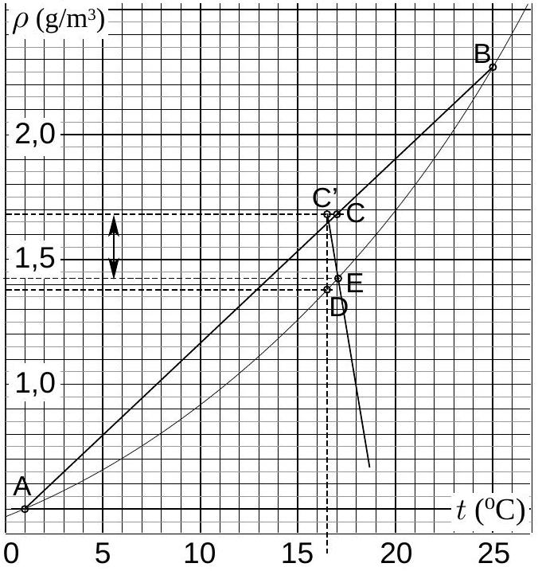
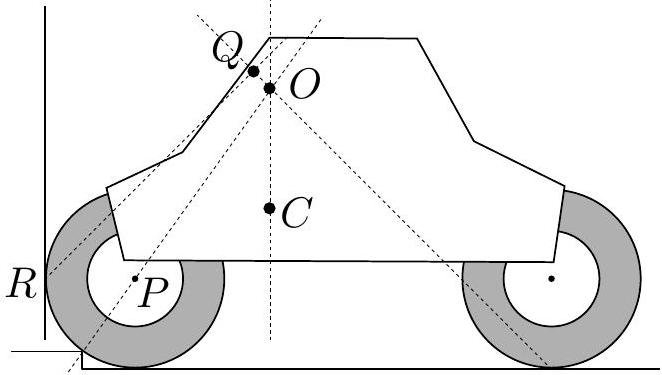

## I. Drying

1) Let the number of moles of cold and warm air be $\nu _ { 1 }$ and $\nu _ { 2 }$; let $C _ { V }$ designate the molar heat capacitance at a fixed volume. Then the total change of internal energy is $\Delta U = C _ { V } \left[ \nu _ { 1 } \left( T - T _ { 1 } \right) + \nu _ { 2 } ( T - \right.$ $\left. T _ { 2 } \right) = \left( C _ { V } p _ { 0 } / R \right) \left( V - V _ { 1 } - V _ { 2 } \right)$ (using the ideal gas law). Internal energy change must be equal to the work of the external pressure: $\left( C _ { V } p _ { 0 } / R \right) \left( V - V _ { 1 } - \right. \left. V _ { 2 } \right) = p _ { 0 } \left( V - V _ { 1 } - V _ { 2 } \right)$, hence $V - V _ { 1 } - V _ { 2 }$ (since $C _ { V } / R \neq 1$ ).
2) The molar amount of gas $\left( p _ { 0 } / R \right) \left( V _ { 1 } / T _ { 1 } + \right.$ $\left. V _ { 2 } / T _ { 2 } \right) = \left( p _ { 0 } / R \right) \left( V _ { 1 } + V _ { 2 } \right) / T _ { * }$, hence $T _ { * } = \left( V _ { 1 } + \right.$ $\left. V _ { 2 } \right) / \left( V _ { 1 } T _ { 1 } ^ { - 1 } + V _ { 2 } T _ { 2 } ^ { - 1 } \right)$, i.e. $t _ { * } \approx 16,5 ^ { \circ } \mathrm { C }$.
3) The vapor mass $m _ { a } = \rho _ { a } \left( t _ { 1 } \right) V _ { 1 } + \rho _ { a } \left( t _ { 2 } \right) V _ { 2 }$, the mass of saturating vapor at the given temperature $m _ { a k } = \rho _ { a } \left( t _ { * } \right) \left( V _ { 1 } + V _ { 2 } \right)$. Relative humidity $r = m _ { a } / m _ { a k }$, because at the fixed temperature, the pressure is proportional to the density. So, $r = \tilde { \rho } _ { a } / \rho _ { a } \left( t _ { * } \right)$, where the weighted average of the vapor $\tilde { \rho } _ { a } = \left[ \rho _ { a } \left( t _ { 1 } \right) V _ { 1 } + \rho _ { a } \left( t _ { 2 } \right) \right] / \left( V _ { 1 } + V _ { 2 } \right)$ - this value can be found from the graph as the coordinate of the point $C$ : we draw the line $a t + b$, connecting points $A$ and $B$, and take the reading for the point $C$ lying on the line $a t _ { * * } + b \approx 1,68 \mathrm {~g} / \mathrm { m } ^ { 3 }$ at $t _ { * * } = 17 ^ { \circ } \mathrm { C }$ (this value divides the interval $\left[ t _ { 2 } ; t _ { 1 } \right]$ in the proportions $V _ { 1 } : V _ { 2 }$ ). The saturating vapor pressure at the given temperature is found as the coordinate of the point $D : p _ { a } \left( t _ { * } \right) \approx 1,38 \mathrm {~g} / \mathrm { m } ^ { 3 }$. Finally we obtain $r \approx 1,22 = 122 \%$.

4) In order to find the condensating mass, we write down heat balance: $c _ { p } \rho _ { 0 } \Delta t = q \left[ \tilde { \rho } _ { a } - \rho _ { a } \left( t _ { * } + \Delta t \right) \right]$, where $\Delta t$ is the temperature change due to the condensation. By designating $t _ { * } + \Delta t = \tau$ we can rewrite the balance as $\rho _ { a } ( \tau ) = \tilde { \rho } _ { a } - c _ { p } \rho _ { 0 } \left( \tau - t _ { * } \right) / q$. So, we need to find the intersection point $E$ of the curve $\rho _ { a } ( \tau )$ with the line $\tilde { \rho } _ { a } - c _ { p } \rho _ { 0 } \left( \tau - t _ { * } \right) / q =$ $\tilde { \rho } _ { a } - 0,478 \mathrm {~g} \cdot \mathrm {~m} ^ { - 3 } \mathrm {~K} ^ { - 1 } \cdot \left( \tau - t _ { * } \right)$ (line $C ^ { \prime } E$ in Fig.). Using the graph we find $\Delta \rho \approx 0,25 \mathrm {~g} / \mathrm { m } ^ { 3 } -$ this is the length of the line with arrows. So, the condensating mass $\Delta m = \Delta \rho \left( V _ { 1 } + V _ { 2 } \right) \approx 7,5 \mathrm {~g}$.

Thus, when meteorologists tell us that at the meeting point of cold and hot air, there are heavy rains, the phenomenon can be explained by this problem.

## 2. Photographing

Let us notice that at the lower part of the photo, there are few brighter spots of regular circular shape and clear edges - unlike all the rest at the smudged (out of focus) part of the image. This can be only due to the point sources in that far area. Let the distance of the linear from the lens be $l$, and the distance between the sensor and the focus $- x$. Then, according to the Newton formula, $x ( l - f ) = f ^ { 2 }$, where $f$ is the focal distance; hence $\frac { l - f } { f } = \frac { f } { x }$. Let the spot diameter be $\delta$. Then the lens diameter $d = \delta \frac { f } { x } = \delta \frac { l - f } { f }$. Let the size of the image of the linear be $a$, and the size of the linear itself $- A$. Then $A = a \frac { l } { x + f }$. From the lens formula, $\frac { 1 } { x + f } = \frac { l - f } { f l }$, hence $A = a \frac { l - f } { f }$. Comparing with the previous result we obtain $d = \delta A / a$, i.e. the lens diameter equals to the spot diameter, using the scale of the linear. From the figure, we find $d = 17 \mathrm {~mm}$.

## 3. Sucking

1) Let $x$ be the horizontal axes, and $y$ - the vertical axes. At the liquid surface, the potential energy of a unit volume is constant (so that the liquid will not flow towards the lower potential energy). So, the formula for the height $\chi ( x )$ of the liquid surface is given by $\Pi _ { v p } = \rho _ { m } g \chi - \frac { 1 } { 4 \pi \varepsilon _ { 0 } } \rho _ { e } q / r = 0$, where $r = \sqrt { x ^ { 2 } + ( \chi - H ) ^ { 2 } }$ is the distance of the given point from the charge. Let us designate $\chi _ { 0 } \equiv \chi ( 0 )$. From the previous formula we obtain (bearing in mind that for $x = 0$ we have $r = H - \chi _ { 0 }$ ) the result $\chi _ { 0 } \left( \chi _ { 0 } - H \right) + \frac { 1 } { 4 \pi \varepsilon _ { 0 } } \frac { \rho _ { e } q } { \rho _ { m } g } = 0$. Using the designation

$$
\begin{aligned}
\frac { 1 } { 4 \pi \varepsilon _ { 0 } } \frac { \rho _ { e } q } { \rho _ { m } g } = & A , \text { the result can be written as } \\
& \chi _ { 0 } = \frac { 1 } { 2 } \left( H - \sqrt { H ^ { 2 } - 4 A } \right) .
\end{aligned}
$$

2) It is clear that flowing starts at the point $x =$ 0, where the fluid surface is the highest. When the flowing starts, this surface point [with coordinates $\left. \left( 0 , \chi _ { 0 } \right) \right]$ realizes the potential energy maximum, when moving along the $y$-axes towards the charge. So, the function $\Pi ( y ) = \rho _ { m } g y - \frac { 1 } { 4 \pi \varepsilon _ { 0 } } \rho _ { e } q / ( h - y )$ has a maximum at $y = H _ { 0 }$. This gives us two equations:

$$
\begin{gathered}
\rho _ { m } g \chi _ { 0 } - \frac { 1 } { 4 \pi \varepsilon _ { 0 } } \rho _ { e } q / \left( h - \chi _ { 0 } \right) = 0 , \\
\rho _ { m } g - \frac { 1 } { 4 \pi \varepsilon _ { 0 } } \rho _ { e } q / \left( h - \chi _ { 0 } \right) ^ { 2 } = 0 .
\end{gathered}
$$

Comparing these, we find $h = 2 \chi _ { 0 }$ and $\chi _ { 0 } ^ { 2 } =$ $\frac { 1 } { 4 \pi \varepsilon _ { 0 } } \rho _ { e } q / \rho _ { m } g$, hence

$$
h = \sqrt { \rho _ { e } q / \pi \varepsilon _ { 0 } \rho _ { m } g } .
$$

## 4. Electrical experiment

We start with charging the capacitor (waiting long enough, to allow equalizing the voltages of the source and the capacitor, of the order of the discharge time below). The capacitor will be discharge on the diode and two resistances (the unknown one $r$ is parallel to the diode), using the scheme in the figure. We perform two experiments using for the sequentially connected resistor $R$ the both supplied resistors with known resistance, $R = R _ { 1 }$ and $R = R _ { 2 }$.

Initial voltage of the capacitor $U _ { 0 } = \mathcal { E }$; the voltage drop on the diode is constant (while emitting light)- exactly as on a voltage source. Therefore, the voltage on the capacitor approaches that value exponentially:

$$
U - U _ { c } = \left( \mathcal { E } - U _ { c } \right) e ^ { - t / R C }
$$

Diode stops burning, when all the current $I = ( U -$ $\left. U _ { c } \right) / R$ goes through the unknown resistor, $I =$ $U _ { c } / r$. Thus, at the fading moment $( t = \tau )$ :

$$
r \left( \mathcal { E } - U _ { c } \right) e ^ { - \tau / R C } = R U _ { c } .
$$

Rewriting the latter equality for the both experiments,

$$
\begin{aligned}
& r \left( \mathcal { E } - U _ { c } \right) e ^ { - \tau _ { 1 } / R _ { 1 } C } = R _ { 1 } U _ { c } . \\
& r \left( \mathcal { E } - U _ { c } \right) e ^ { - \tau _ { 2 } / R _ { 2 } C } = R _ { 2 } U _ { c } .
\end{aligned}
$$

Dividing these and taking the logarithm results in

$$
C = \left( \frac { \tau _ { 2 } } { R _ { 2 } } - \frac { \tau _ { 1 } } { R _ { 1 } } \right) / \ln \frac { R _ { 1 } } { R _ { 2 } } .
$$

## 5. Empty sack

1) The pressure at the floor $P = p + \sigma g$, hence $\sigma L g = ( p + \sigma g ) c$, from which $c = L / \left( \frac { p } { \sigma g } + 1 \right)$.
2) Here we provide a solution departing from the recommendations (finding the other solution is left for the reader). Let the tension of the material at some contact point with floor $P _ { 0 }$ be $T _ { 0 }$. Consider the energy balance of a piece of material between the points $P$ and $P _ { 0 }$ for a tiny virtual displacement $\delta$, tangential everywhere to the material (thus, the shape of the material is preserved). The potential energy change (per unit length of the sack) is $\sigma \delta g x$ (because the piece of material of length $\delta$ will get from the floor to the height $x$ ); the work done equals to $\left( T - T _ { 0 } \right) \delta$. The energy balance yields $T = \sigma g x + T _ { 0 }$, hence $\alpha = \sigma g$.
3) The force balance between the left and right halves of the sack can be written as $T _ { 1 } + T _ { 0 } = p a$. Bearing in mind that $T _ { 0 } = T _ { 1 } - \sigma g a$, we find $T _ { 1 } = ( p + \sigma g ) \frac { a } { 2 }$.
4) The force balance between the lower and upper halves of the sack: $2 T _ { 2 } + L _ { 1 } \sigma g = p b$, where $T _ { 2 }$ is the tension at the widest point, and $L _ { 1 } \approx L / 2$ is the length of the upper half. The tension $T$ grows linearly with the height, and the widest point is approximately at the half height; hence $2 T _ { 2 } \approx T _ { 1 } + T _ { 0 } =$ $p a$. Substituting it into the first equation, we obtain $p ( b - a ) = L \sigma g / 2$. Taking into account that the sack is almost of a circular cross-section, we write $\pi ( b + a ) \approx 2 L$; hence, we finally obtain $\varepsilon \approx \frac { \pi g \sigma } { 4 p }$.

## 6. Car

1) Let us consider the force balance projected to the horizontal axes. The only force, which could create a non-zero projection, is the resultant of the friction and reaction force, applied by the corner of the delimiter. Due to the balance, this must be also zero, i.e. this resultant force is directed vertically, hence $H = \frac { d } { 4 } ( 2 - \sqrt { 2 } ) \approx 15 \mathrm {~cm}$.
2) Consider the torque balance with respect to the point $O$ - the intersection point of the lines of the resultant force applied to the rear wheel by ground, and of the gravity force (vertical line through $C$ ). At the equilibrium, the line of the reaction force applied to the front wheel by the delimiter must go through the same point. Thus, the intersection point of the line $O P$ with the wheel gives us the corner of the delimiter ( $P$ is the center of the front wheel). Using the scale of the figure yields $H \approx 10 \mathrm {~cm}$.
3) Consider the torque balance with respect to the point $Q$ - intersection point of the lines of the resultant forces applied to the touching points of the front- and rear wheels with the wall and floor, respectively. Only the gravity force can contribute to the net torque; since $Q$ lies leftwards to the center of mass, this torque rotates car rising its front. So, the front will start rising.

## 7. Mass-spectrometer

1) The trajectory of a charged particle in the magnetic field is circle of radius $R = l / \sqrt { 2 }$. Lorenz force is responsible for the acceleration, $B e v = M v ^ { 2 } / R$, hence $B e R = p$. Substituting $p ^ { 2 } = 2 M U e =$ $B ^ { 2 } e ^ { 2 } R ^ { 2 }$, we obtain

$$
M = B ^ { 2 } l ^ { 2 } e / 4 U .
$$

2) Now, the radius can be $R \pm r$. Approximate calculus yields $\Delta R / R = r \sqrt { 2 } / l \approx \Delta M / 2 M$, hence $\Delta M \approx M r 2 \sqrt { 2 } / l$, i.e.

$$
\Delta M = B ^ { 2 } \operatorname { lre } / \sqrt { 2 } U .
$$

3) Ion leaves the magnetic field at the distance $r$ before (or after) performing a quarter of the circle. So, $\Delta \varphi \approx r / R = r \sqrt { 2 } / l$.
4) Certain initial energy $k T$ implies that the terminal energy $U e + k T = e ( U + k T / e )$; this is equivalent to the change of the voltage by $\delta U = k T / e$. Using approximate calculus and the result of the first question, we obtain: $\delta M = \frac { d M } { d U } k T / e$, i.e.

$$
\delta M = B ^ { 2 } l ^ { 2 } k T / 4 U ^ { 2 } .
$$

## 8. Optical experiment

1) Looking at the bottle from a distance reveals that the central part of the scale is not reversed, unlike the image at the extreme edge of the bottle. The turning point corresponds to an one end of the visible part of the glued scale (the other end-point is symmetrically situated). Looking from smaller distances results in large visible part (Gray line $c$ in Fig.), than in the case of very large distance (black line $d$ ). In the latter case, the ray (in Fig, $a$ ) is refracted at the entrance to the bottle by a certain angle; when observing from smaller distances, one ray ( $b$ in Fig) is refracted by the same angle. These two rays coincide after rotation by an angle $\beta$ around the center of the bottle. So, the part of the scale, given by the gray line in Fig, is longer than the black line at least by $2 R \beta$. We should perform the measurements with as large $L$ as possible; the result of the measurement is to be adjusted by subtracting $2 R \beta$, where $\beta = \arcsin ( l / 2 L )$.

Alternatively, we can measure $c$ by different values of $L$, and present the results on graph. It makes sense to use $1 / L$ as the scale for the horizontal axes. Then, $L = \infty$ represents the origin, to which the curve can be easily extrapolated).

The measurements yield $d \approx 22 \mathrm {~mm}$ (by $R =$ 31 mm).
2) Comparing the ray geometry for the previous problem (in connection to the piece scale $c$ ), and the ray geometry in the rainbow, it turns out that the geometry is actually identical, with $\frac { d } { 2 } = R \frac { \alpha } { 2 }$, see Fig. So, $\alpha = d / R$. Using the data from the previous part, $\alpha \approx 41 ^ { \circ }$.

