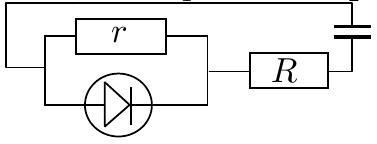

## 4. Electrical experiment

We start with charging the capacitor (waiting long enough, to allow equalizing the voltages of the source and the capacitor, of the order of the discharge time below). The capacitor will be discharge on the diode and two resistances (the unknown one $r$ is parallel to the diode), using the scheme in the figure. We perform two experiments using for the sequentially connected resistor $R$ the both supplied resistors with known resistance, $R = R _ { 1 }$ and $R = R _ { 2 }$.

Initial voltage of the capacitor $U _ { 0 } = \mathcal { E }$; the voltage drop on the diode is constant (while emitting light)- exactly as on a voltage source. Therefore, the voltage on the capacitor approaches that value exponentially:

$$
U - U _ { c } = \left( \mathcal { E } - U _ { c } \right) e ^ { - t / R C }
$$

Diode stops burning, when all the current $I = ( U -$ $\left. U _ { c } \right) / R$ goes through the unknown resistor, $I =$ $U _ { c } / r$. Thus, at the fading moment $( t = \tau )$ :

$$
r \left( \mathcal { E } - U _ { c } \right) e ^ { - \tau / R C } = R U _ { c } .
$$

Rewriting the latter equality for the both experiments,

$$
\begin{aligned}
& r \left( \mathcal { E } - U _ { c } \right) e ^ { - \tau _ { 1 } / R _ { 1 } C } = R _ { 1 } U _ { c } . \\
& r \left( \mathcal { E } - U _ { c } \right) e ^ { - \tau _ { 2 } / R _ { 2 } C } = R _ { 2 } U _ { c } .
\end{aligned}
$$

Dividing these and taking the logarithm results in

$$
C = \left( \frac { \tau _ { 2 } } { R _ { 2 } } - \frac { \tau _ { 1 } } { R _ { 1 } } \right) / \ln \frac { R _ { 1 } } { R _ { 2 } } .
$$
