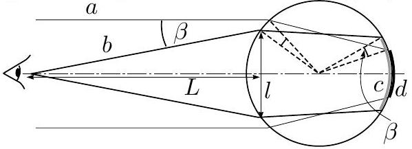
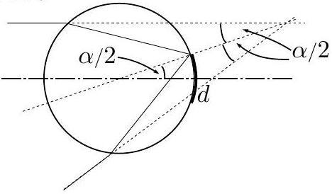

## 8. Optical experiment

1) Looking at the bottle from a distance reveals that the central part of the scale is not reversed, unlike the image at the extreme edge of the bottle. The turning point corresponds to an one end of the visible part of the glued scale (the other end-point is symmetrically situated). Looking from smaller distances results in large visible part (Gray line $c$ in Fig.), than in the case of very large distance (black line $d$ ). In the latter case, the ray (in Fig, $a$ ) is refracted at the entrance to the bottle by a certain angle; when observing from smaller distances, one ray ( $b$ in Fig) is refracted by the same angle. These two rays coincide after rotation by an angle $\beta$ around the center of the bottle. So, the part of the scale, given by the gray line in Fig, is longer than the black line at least by $2 R \beta$. We should perform the measurements with as large $L$ as possible; the result of the measurement is to be adjusted by subtracting $2 R \beta$, where $\beta = \arcsin ( l / 2 L )$.

Alternatively, we can measure $c$ by different values of $L$, and present the results on graph. It makes sense to use $1 / L$ as the scale for the horizontal axes. Then, $L = \infty$ represents the origin, to which the curve can be easily extrapolated).

The measurements yield $d \approx 22 \mathrm {~mm}$ (by $R =$ 31 mm).
2) Comparing the ray geometry for the previous problem (in connection to the piece scale $c$ ), and the ray geometry in the rainbow, it turns out that the geometry is actually identical, with $\frac { d } { 2 } = R \frac { \alpha } { 2 }$, see Fig. So, $\alpha = d / R$. Using the data from the previous part, $\alpha \approx 41 ^ { \circ }$.

