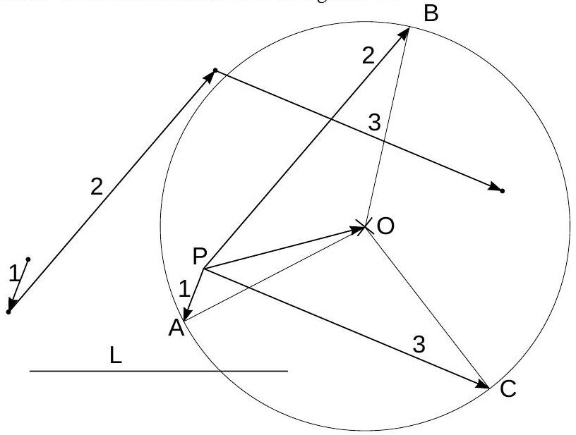

## 5. Rotating disk (7 pts)

1) We notice that there is no image of the orange pulse, hence it must have taken place immediately before the shutter release. So the blue pulse is first, red - the second etc. The exposure time must have been triple and quadruple flash interval, $300 \mathrm {~ms} < t < 500 \mathrm {~ms}$.
2) The displacement of the lamp between two subsequent pulses can be represented as the sum of two components: $\vec { r } _ { i } = \vec { v } \tau + 2 R \sin ( \omega \tau / 2 ) \vec { e } _ { i }$, where each next unit vector $\vec { e } _ { i + 1 }$ is rotated with respect to the previous one $\left( \vec { e } _ { i } \right)$ by angle $\omega \tau$. So, if the starting points of the displacement vectors $\vec { r } _ { i }$ coincide, then the end-points must be on a circle, at equal angular distances $\omega \tau$ from each other, see figure.

In our case we redraw the displacement vectors 1,2 and 3 as vectors with common origin, $\overrightarrow { P A } , \overrightarrow { P B }$, and $\overrightarrow { P C }$. Since the starting points of the vectors $2 R \sin ( \omega \tau / 2 ) \vec { e } _ { i }$ are brought together to the point $O$, their endpoints lay on the circle, the center of which can be found as the center of the circle drawn around the triangle $A B C$.

The velocity of center of the disk is found as the ratio of the length $P O$ and the interval $\tau : v \approx 65 \mathrm {~cm} / \mathrm { s }$. The angular velocity is found as the ratio of the angle $\angle A O B = \angle B O C$ and the interval $\tau : \omega \approx 23 \mathrm { rad } / \mathrm { s }$. Radius of the disk is found from the length $| O A | = 2 R \sin ( \omega \tau / 2 ) = 2 R \sin \angle B O C \approx 1.5 R$; using the scale of the figure, $1.5 R \approx 8 \mathrm {~cm}$ and $R \approx 5 \mathrm {~cm}$.
