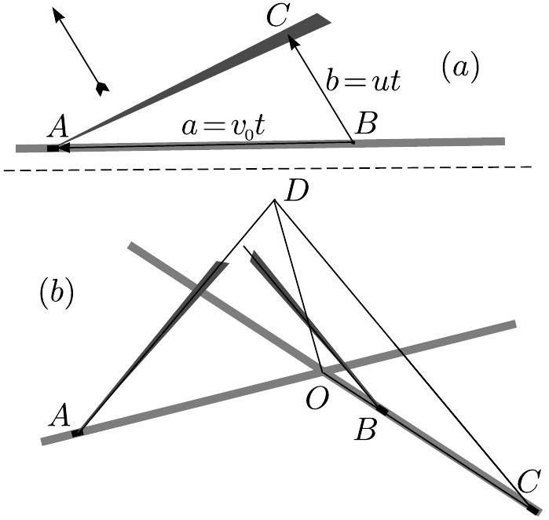
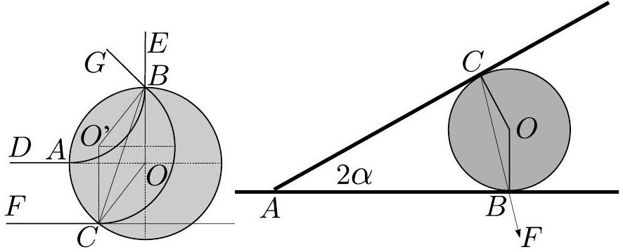
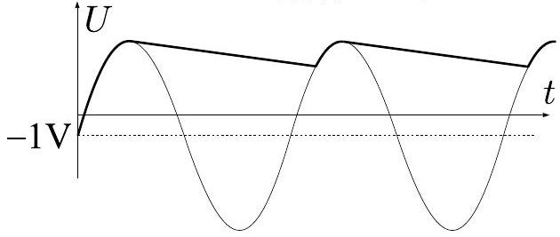
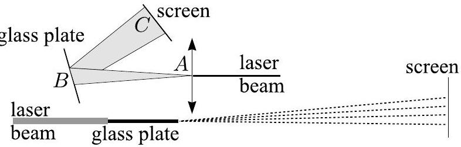

1. Dumbbell (6 points)
1) During the first collision, we can neglect the effect of the spring, because during the collision time, the balls almost don't move, hence the spring doesn't deform. Two absolutely elastic identic balls exchange velocity during a central collision. So, the first ball will remain at rest, and the second one will obtain the velocity $v$. So, the velocity of the centre of mass of the dumbbell is $v / 2$.
2) After the impact, the dumbbell will oscillate in the system of reference of its centre of mass with circular frequency $\omega = \sqrt { 2 k / m }$ (balls oscillate so that the middlepoint of the spring is at rest; twice shorter spring has a twice larger stiffness).

Due to the energy conservation law, the only way for the fourth ball to acquire the velocity $v$ is such that all the other balls remain at a complete rest after the interaction. Therefore, before the impact of the third and fourth balls, the third ball must have velocity $v$ (and the second ball must be at rest). This is the opposite phase of the moment, when the dumbbell started its motion. Hence, the travel time $t$ of the dumbbell must be a halfinteger multiple of the period $T = 2 \pi \sqrt { m / 2 k }$. For that phase of oscillation, the spring is, again, undeformed, i.e. the travel distance of the centre of mass is also $L$. So, $2 L / v = T \left( n + \frac { 1 } { 2 } \right)$, hence

$$
L = \pi v \left( n + \frac { 1 } { 2 } \right) \sqrt { m / 2 k } .
$$

2. Microcalorimeter (9 points)
1) Every bridge has thermal resistance $L / \kappa S$; so, the overall resistance is $R = L / 4 \kappa S$.
2) The power dissipation $P$ results in an heat flux through the bridges, $\Phi = \Delta T / R$, and in the change of the heat contained in the microcalorimeter, $\dot { Q } = C \dot { T } = C \Delta \dot { T }$ (here, dot denotes the time derivative). So,

$$
P _ { 0 } \cos ( \omega t ) = C \Delta \dot { T } + \Delta T / R .
$$

Now, we can search the solution as $\Delta T = A \cos ( \omega t + \phi )$, and denote $\psi = \arcsin \left( C \omega / \sqrt { C ^ { 2 } \omega ^ { 2 } + R ^ { - 2 } } \right)$. Then,

$$
P _ { 0 } \cos ( \omega t ) = A \sqrt { C ^ { 2 } \omega ^ { 2 } + R ^ { - 2 } } \cos ( \omega t + \phi - \psi ) .
$$

So, we must have $\phi = \psi$ and $A = P _ { 0 } / \sqrt { C ^ { 2 } \omega ^ { 2 } + R ^ { - 2 } }$, i.e.

$$
T = T _ { 0 } + \frac { P _ { 0 } \cos \left( \omega t + \arcsin \left( C \omega / \sqrt { C ^ { 2 } \omega ^ { 2 } + R ^ { - 2 } } \right) \right) } { \sqrt { C ^ { 2 } \omega ^ { 2 } + R ^ { - 2 } } } .
$$

3) The amplitude of the oscillations is $A = \frac { P _ { 0 } } { \sqrt { C ^ { 2 } \omega ^ { 2 } + R ^ { - 2 } } }$; it must be as sensitive with respect to the small changes of $C$, i.e. $d A / d C$ must be maximal by modulus. $d A / d C = P _ { 0 } \left( C ^ { 2 } \omega ^ { 2 } + \right.$ $\left. R ^ { - 2 } \right) ^ { - 3 / 2 } C \omega ^ { 2 }$; if we denote $x = ( C \omega ) ^ { 2 }$, we need to minimize the following function of $x$ :

$$
\ln \left[ ( d C / d A ) ^ { 2 } \right] = 3 \ln \left( x + R ^ { - 2 } \right) - \ln x + \ln C .
$$

Upon taking derivative and putting it equal to 0, we obtain $3 x = x + R ^ { - 2 }$, from where $x = R ^ { - 2 } / 2$, i.e.

$$
\omega = 1 / \sqrt { 2 } C R .
$$

4) The heat contained in the bridge must be comparable with the heat, which flows through it during one half-period (if it is much smaller, the stationary linear profile will develop very soon). So, $A c \rho S L \approx A \kappa S / \left( L \omega _ { c } \right)$; hence,

$$
\omega _ { c } \approx \kappa / c \rho L ^ { 2 } .
$$

3. Tractor (6 points)

1) Let us draw from an arbitrary point $B$ on the road a line parallel to the direction of the wind, and let it intersect the smoke trail at point $C$. Then, the smoke emitted by the tractor at $B$ has travelled the distance $| B C | = u t$, where $u$ is the wind speed. Tractor itself has travelled the distance $| A B | = v _ { 0 } t$. So, we can measure the distances $| A B |$ and $\mid B C$ from the figure and calculate

$$
u = v _ { 0 } \frac { | B C | } { | A C | } = \frac { 18 \mathrm {~mm} } { 42 \mathrm {~mm} } 30 \mathrm {~km} / \mathrm { h } \approx 13 \mathrm {~km} / \mathrm { h } .
$$

2) If the second tractor (at the right-hand-side) had started somewhat earlier, the two tractors had been at the crossroad simultaneously. Now, the tractors would be at the same distance from the crossroad, i.e. for the current position of the second tractor $C , | O C | = | A O | = v _ { 0 } t$ (this is how we find the point $C$ ). Its smoke trail can be found as a line, parallel to its smoke trail at its actual position $B$. Such a meeting of the tractors would have been resulted in the crossing of the smoke trails. which would be now in position $D$, with $O D = u t$. So, we find

$$
u = v _ { 0 } \frac { | O D | } { | A O | } = \frac { 27 \mathrm {~mm} } { 39 \mathrm {~mm} } 30 \mathrm {~km} / \mathrm { h } \approx 21 \mathrm {~km} / \mathrm { h } .
$$

4. Magnetic field (6 points)
1) Since the radius of the cyclotron orbit is equal to the radius of the region $R$, the trajectory is given by the curve $D A B E$ in the Figure ( $A B$ is a circle fragment). 2) Circular part of the trajectory is a quarter of the full circle, so $t = \pi R / 2 v$.
2) Let $O ^ { \prime }$ be the centre of the circular orbit of the electron and $B$ - the intersection point of the trajectory with the region boundary. The polygon $C O B O ^ { \prime }$ is rhomb, because all the sides are equal to $R$. So, the line $B O$ is vertical (because $O ^ { \prime } C$ is vertical and $B O$ is parallel to it). Hence, the inclination angle of the electron is

$$
\alpha = \angle C O ^ { \prime } B = \angle A O B + \angle A O C = \frac { \pi } { 2 } - \arcsin \frac { a } { R } .
$$

5. Ball (9 points)

We lay one of the rulers horizontally on the table. Then, we put the ball on that ruler, and the other ruler laying on the ball. With finger, we keep one end of the second ruler in contact with the first ruler and find the closest stable position of the ball (resulting in the largest inclination angle of the second ruler), see Figure. Now, we consider the torque balance (for the ball) with respect to the ball and ruler touching point $B$. Gravity force has no torque, because it is applied to the centre of the ball $O$. So, the resultant vector of the friction and reaction forces at $C$ must have also zero torque, i.e. it has to go through $B$. At the threshold of sliding, the angle between this vector and the surface normal $C O$ is $\arctan \mu$. So, $\mu = \tan \angle B C O = \tan \angle O A B = | O B | / | A B | = R / | A B |$. The radius of the ball $R \approx 40 \mathrm {~mm}$ can be measured by rolling the ball on the ruler by angle $2 \pi$. The distance $| A B |$ can be measured directly using the ruler. Several measurements are needed, to find the critical position of the ball more accurately.

We have used one ruler as the basis, because if the surface has smaller coefficient of friction than the ruler, the sliding starts at the point $B$, hence we are not able to obtain the required result.
6. Rectifier (8 points)

1) Since none of the DC current through the load can come from the capacitor, all must come through the diode. Hence, the average current through the diode is also $I = 2 \mathrm {~mA}$, and the average power dissipation is obtained by multiplying it with the diode voltage $u = 1 \mathrm {~V} : P = 2 \mathrm {~mW}$.
2) If the diode is open, $U _ { \text {load } } ( t ) = U _ { 0 } \cos ( \omega t ) - u$. If the diode is closed [i.e. $U _ { 0 } \cos ( \omega t ) < U _ { \text {load } } ( t ) + u$ ], the capacitor discharges through the load. However, the relative change of the

voltage of the capacitor has to be small (otherwise $\Delta I / I$ would not be small). The respective load voltage as a function of time is sketched in the Figure. So, we can use the above written Kirchoff's law with $U _ { \text {load } } ( t ) \approx I R$, hence $U _ { 0 } = I R + u = 21 \mathrm {~V}$.

3) The change of the voltage of the capacitor during the discharge cycle can be estimated as $\Delta U = \Delta Q / C$, where the capacitor's charge drop $\Delta Q = I t$, and $t$ is the discharge time. Since the discharge cycle occupies almost all the period (see Figure), we can use $t \approx 1 / \nu$. Further, $\Delta I / I = \Delta U / U = \Delta Q / C U = \Delta Q / C I R =$ $1 / C R \nu$. Hence, $C \geq 100 / R \nu = 200 \mu \mathrm {~F}$.
4) Initially, the capacitor is empty, so that the charge flowing through the capacitor during the first cycle is $Q = C I R$. Hence, the average power $P _ { 1 } = Q u \nu = C I R u \nu = 200 \mathrm {~mW}$.
7. Fire (6 points)

The smoke will rise until its density becomes equal to the density of the air at the same height. Since the molar masses and pressures of the smoke and air are equal, this implies also equal temperatures (pressures are equal, because otherwise, there would be no mechanical equilibrium). Temperature of the smoke will drop with increasing height due to adiabatic expansion. If we combine the law of the adiabatic process $p V ^ { \gamma } =$ Const with the ideal gas law $( p V / T ) ^ { \gamma } =$ Const, we obtain $p ^ { \gamma - 1 } / T ^ { \gamma } =$ Const. Taking a logarithm and differential from this equation, we obtain $( \gamma - 1 ) \frac { d p } { p } - \gamma \frac { d T } { T } = 0$, hence we can use approximate expression for the require temperature change

$$
20 \mathrm {~K} = \Delta T = T \frac { \gamma - 1 } { \gamma } \frac { \Delta p } { p } .
$$

We can use $\Delta p = \rho g h$, where $\rho = p \mu / R T \approx 1.2 \mathrm {~kg} / \mathrm { m } ^ { 3 }$ is the air density. Also, we can substitute $\gamma = c _ { p } / c _ { V } = \left( c _ { V } + R \right) / c _ { V }$. So, we obtain

$$
\Delta T = \frac { R } { c _ { V } + R } \frac { \mu g h } { R } ,
$$

hence

$$
h = \left( 1 + \frac { c _ { V } } { R } \right) \frac { \Delta T R } { \mu g } \approx 2040 \mathrm {~m} .
$$

8. Electron (5 points)

Let us write the Newton's II law for $x$ - and $y$-components of the electrons coordinates:

$$
\begin{gathered}
m \ddot { x } = - e E _ { 0 } \omega \cos \omega t , \\
m \ddot { y } = e E _ { 0 } \sin \omega t .
\end{gathered}
$$

We can integrate these equations over time (bearing in mind that initial velocity is zero):

$$
\begin{gathered}
m \dot { x } = - e E _ { 0 } \omega ^ { - 1 } \sin \omega t , \\
m \dot { y } = e E _ { 0 } \omega ^ { - 1 } ( 1 - \cos \omega t ) .
\end{gathered}
$$

Now, we can integrate once more, bearing in mind that the initial coordinates are zero:

$$
\begin{gathered}
x = \frac { e E _ { 0 } } { m \omega ^ { 2 } } ( \cos \omega t - 1 ) \\
y = \frac { e E _ { 0 } } { m \omega ^ { 2 } } \cos \omega t + \frac { e E _ { 0 } } { \omega m } t
\end{gathered}
$$

So, the electron performs circular motion in the system of reference, moving with velocity (parallel to the $y$-axis) $u = \frac { e E _ { 0 } } { \omega m }$. The radius of the orbit is $R = \frac { e E _ { 0 } } { \omega ^ { 2 } m }$. In the laboratory system, this is a cycloid (the curve drawn by a point on the edge of a rolling disk); the distance between the neighbouring loops is $\Delta = 2 \pi u / \omega = 2 \pi R$.
9. Asteroid (7 points)

1) The longer semiaxis is $a = \frac { 1 } { 2 } \left( r _ { 1 } + r _ { 2 } \right) = \frac { 1 } { 2 } ( \alpha + \beta ) R$. So, the full energy of the asteroid at the Earth's location is

$$
\frac { E } { m } = - \frac { \gamma M } { 2 a } = \frac { 1 } { 2 } v ^ { 2 } - \frac { \gamma M } { R } .
$$

Bearing in mind that $v _ { 0 } ^ { 2 } = \frac { \gamma M } { R }$, we can rewrite this as

$$
\frac { v _ { 0 } ^ { 2 } } { \alpha + \beta } = v _ { 0 } ^ { 2 } - \frac { 1 } { 2 } v ^ { 2 } .
$$

So, we obtain

$$
v = v _ { 0 } \sqrt { 2 \left[ 1 - ( \alpha + \beta ) ^ { - 1 } \right] } \approx 34.5 \mathrm {~km} / \mathrm { h } .
$$

2) Tangential component can be found from the angular momentum conservation law: $v _ { r } = v _ { p } \beta$, where the velocity at the perihelion can be found analogously to $v$ :

$$
v _ { p } = v _ { 0 } \sqrt { 2 \left( \frac { 1 } { \beta } - \frac { 1 } { \alpha + \beta } \right) } = v _ { 0 } \sqrt { \frac { 2 \alpha } { \alpha + \beta } } \approx 37.5 \mathrm {~km} / \mathrm { h } .
$$

So,

$$
v _ { t } = v _ { 0 } \beta \sqrt { \frac { 2 \alpha } { \alpha + \beta } } \approx 24.4 \mathrm {~km} / \mathrm { h } .
$$

Radial component

$$
v _ { r } = \sqrt { v ^ { 2 } - v _ { t } ^ { 2 } } \approx 24.4 \mathrm {~km} / \mathrm { h } .
$$

3) The required components can be found by subtracting the Earth's orbital velocity. Apparently $u _ { r } = v _ { r }$, and

$$
u _ { t } = v _ { t } - v _ { 0 } \approx - 5.6 \mathrm {~km} / \mathrm { h } .
$$

4) When the asteroid approaches Earth's surface along the parabolic orbit, the energy due to the Earth gravity force $g R _ { 0 }$ is added to its kinetic energy in the Earth's system of reference:

$$
w = \sqrt { u _ { t } ^ { 2 } + u _ { r } ^ { 2 } + 2 g R _ { 0 } } \approx 27.4 \mathrm {~km} / \mathrm { h }
$$

10. Glass plate (10 points)

There are two possible setups. First, we consider the interference of the beams, reflected from the upper and lower surfaces of the glass plate, see Figure, upper drawing. Second, we direct the beam on the edge of the plate. As a result, on the screen, there will be almost the same diffraction pattern, as from a single slit (lower drawing in the Figure).

In the first case, we need to calculate the optical path difference, see Figure. $\Delta l = 2 ( n | C D | - | A B | ) = 2 ( n d / \cos \beta -$ $d \sin \beta \sin \alpha ) = 2 d \left( n / \cos \beta - \sin ^ { 2 } \alpha / n \right)$; we keep in mind that $\sin \beta = \sin \alpha / n$. We need to find such a change in $\alpha$, which gives rise to the change of $\Delta l$ by $\lambda$ (this corresponds to a transition from one diffraction minimum to another one): $\Delta \alpha \cdot \frac { d ( \Delta l ) } { d \alpha } = \lambda$. Then, we can relate the measured quantity, the distance between the minima on the screen $a = L \Delta \alpha$ (where $L$ is the path length $| A B | + | B C |$ ) to the plate thickness. $\frac { d ( \Delta l ) } { d \alpha } = 2 d \left( \sin \alpha / \cos ^ { 2 } \beta - \sin 2 \alpha / n \right) = 2 d \sin \alpha \left( \cos ^ { - 2 } \beta - \right.$ $2 \cos \alpha / n )$. So, $L \lambda = 2 a d \sin \alpha \left( \cos ^ { - 2 } \beta - 2 \cos \alpha / n \right)$; hence, $d = L \lambda / 2 a \sin \alpha \left( \cos ^ { - 2 } \beta - 2 \cos \alpha / n \right)$. We can easily measure $\alpha$ and calculate $\beta$; for $n$, we can use typical value $n \approx 1.4$, or use the Brewster angle $\alpha _ { B }$ measurement to find $n = \tan \alpha _ { B }$. For the precise measurement of $a$, we count several, e.g. 10, inter-minima intervals, and divide the distance between the farthest minima by 10.

In the second case, the angular distance between the minima is given by $\Delta \alpha = 2 \lambda / d$, so that $a = 2 L \lambda / d$ and $d = 2 L \lambda / a$. Numerically, the thickness was $d \approx 0.20 \mathrm {~mm}$.
