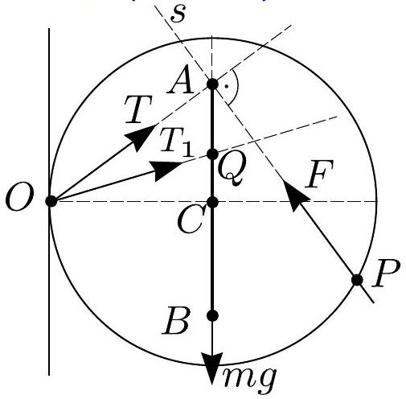
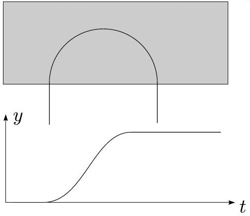
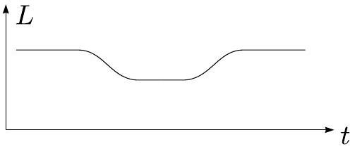
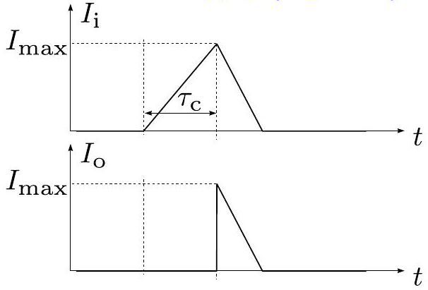
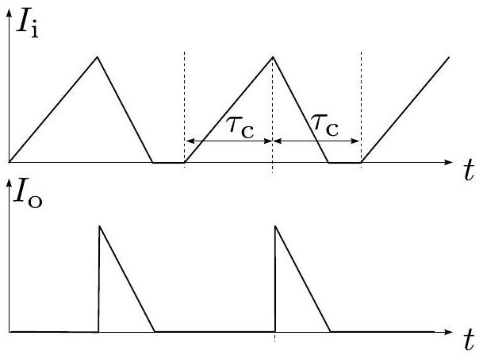
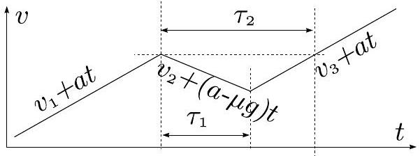

## Estonian-Finnish Olympiad - 2010

Problem 1. Charges in E (8 points) i. (2.5 pts) The initial and final momentum of the dumbbell differ by $4 m v$. The only external force acting on the dumbbell is the electrostatic force $E q$, applied to the blue particle. So, the duration of that force must satisfy condition $E q \tau = 4 m v$, hence $\tau = 4 m v / E q$. ii. (3 pts) Once the blue particle enters the electric field, the dumbbell's center of mass $C$ obtains acceleration $a = E q / 2 m$. Let us consider the motion in the system, where $C$ is at rest. Red and blue particles move symmetrically in that system; let us consider the red particle. Due to the inertial force $F _ { i } =$ $m a = E q / 2$, the equilibrium position of the red particle is shifted (the half-spring is to be deformed by $x = F _ { i } / 2 k = E q / 4 k$ to achieve the equilibrium); the particle starts from rest, apart from the equilibrium. So, it starts oscillations, the circular frequency being given by $\omega = \sqrt { 2 k / m }$ (the factor 2 accounts for the fact that oscillations take place around the center of the spring and half-spring has twice larger stiffness). For the dumbbell to return with the same velocity as it approached, the residual oscillations must be absent (otherwise, some part of the initial kinetic energy would be turned into the oscillations energy, so that the center of mass velocity would be decreased). So, the oscillations phase needs to be $\omega \tau = 2 n \pi$, where $n$ is an integer. Since the spring's length achieves minimum only once, $n = 1$. So, $\omega \tau = 2 \pi$, and the equality can be written as

$$
\sqrt { \frac { 2 k } { m } } \frac { 4 m v } { E q } = \pi .
$$

iii. (2.5 pts) There is a requirement that the red particle never enters the region $x > 0$. The most critical moment is $t = \tau / 2$ ( $t = 0$ corresponds to the blue particle enetring the electric field), when the spring is maximally compressed. The center of mass has displaced by $s = a t ^ { 2 } / 2 = ( E q / 2 m ) \cdot \tau ^ { 2 } / 8 = m v ^ { 2 } / E q$, and the spring half-length has decreased by $2 x$ ( $x$ is the difference between lengths of the initial and equlibrium states; we need the differece between the lengths of the initial, i.e maximally stretched state, and maximally compressed state). So,

$$
\frac { L } { 2 } > s + 2 x = m v ^ { 2 } / E q + E q / 2 k
$$

## Problem 2. Thermos bottle (6 points)

i. (3.5 pts) Remark: this problem techically rather challenging. Therefore, reasonable estimates like $P \approx \sigma \varepsilon S _ { 1 } \left( T _ { 2 } ^ { 4 } - T _ { 1 } ^ { 4 } \right) \approx$ 2.6 W or $P \approx \frac { 1 } { 2 } \sigma \varepsilon S _ { 1 } \left( T _ { 2 } ^ { 4 } - T _ { 1 } ^ { 4 } \right) \approx 1.3 \mathrm {~W}$ will be graded by 2-2.5 pts.

The heat flux radiated from one wall is partially reflected back by other wall, which is also partially reflected back, etc. Besides, the flux from the outer wall can hit itself, if it misses the inner wall. So, near the surface of the outer wall, we can split the heat flux into inwards flux $Q _ { i }$ and outwards flux $Q _ { o }$. Then, upon designating the flux radiated by the outer wall by $Q = \varepsilon \sigma S _ { 2 } T _ { 2 } ^ { 4 }$, we have equalities

$$
Q _ { i } = Q + Q _ { o } ( 1 - \varepsilon ) ,
$$

i.e. the inward flux consists of (a) inital radiation, and of (b) the back-reflected part of the outwards flux. Similarly we have

$$
Q _ { o } = Q _ { i } \kappa ( 1 - \varepsilon ) + Q _ { i } ( 1 - \kappa ) = Q _ { i } ( 1 - \kappa \varepsilon ) ,
$$

i.e. the outward flux consists of (a) the part $\kappa$ of itself, which hits the inner wall and is reflected back, and of (b) the part $1 - \kappa$ of itself, which misses the inner wall hence reaches again the outer wall as an outwards flux. Upon substituting $Q _ { o }$ from the second equation into the first one, we obtain

$$
Q = Q _ { i } [ 1 - ( 1 - \kappa \varepsilon ) ( 1 - \varepsilon ) ] = Q _ { i } \varepsilon ( 1 + \kappa - \kappa \varepsilon ) ,
$$

hence $Q _ { i } = Q / \varepsilon ( 1 + \kappa - \varepsilon )$. From that inwards flux, the part which hits the inner wall is $\kappa$; in order to get the dissipated part, we need further to multiply the result by $\varepsilon$. So, the dissipated flux is

$$
Q _ { d i } = \varepsilon \sigma S _ { 2 } T _ { 2 } ^ { 4 } \kappa / ( 1 + \kappa - \kappa \varepsilon ) .
$$

In order to obtain the flux $Q _ { d o }$, which is radiated from the inner wall and is dissipated in the outer wall, we proceed in the same way. Now, let $Q = \varepsilon \sigma S _ { 1 } T _ { 1 } ^ { 4 }$; then,

$$
Q _ { o } = Q + Q _ { i } ( 1 - \kappa \varepsilon ) ,
$$

and

$$
Q _ { i } = Q _ { o } ( 1 - \varepsilon ) ,
$$

so that $Q _ { o } = Q / [ \varepsilon ( 1 + \kappa - \kappa \varepsilon ) ]$ and

$$
Q _ { d o } = \varepsilon \sigma S _ { 1 } T _ { 1 } ^ { 4 } / ( 1 + \kappa - \kappa \varepsilon ) .
$$

Now, let us consider (an imaginary) situation, when $T _ { 1 } = T _ { 2 }$. This is thermal equilibrium, when the heat flux $Q _ { d o }$ given by the inner wall to the outer one must be equal to the flux $Q _ { d i }$, which is given by the outer wall to the inner one. Using our expressions we see that $\kappa S _ { 2 } = S _ { 1 }$, i.e. $\kappa = S _ { 1 } / S _ { 2 }$. Now we can finally write down the expression for the net flux given to the nitrogen,

$$
P = Q _ { d i } - Q _ { d o } = \frac { \varepsilon \sigma 4 \pi R _ { 1 } ^ { 2 } \left( T _ { 2 } ^ { 4 } - T _ { 1 } ^ { 4 } \right) } { 1 + ( 1 - \varepsilon ) R _ { 1 } ^ { 2 } / R _ { 2 } ^ { 2 } } \approx 1.78 \mathrm {~W} .
$$

ii. (2.5 pts) The net heat received by the inner wall is spent on evaporating the nitrogen, i.e. $\tau P = \lambda m$, where $m = \frac { 4 } { 3 } \pi \rho R ^ { 3 }$. So,

$$
\tau = \frac { 4 } { 3 } \pi \rho R ^ { 3 } \lambda \mu / P \approx 36 \mathrm {~h} .
$$

## Problem 3. Tyrannosaur (T. Rex) (6 points)

i. (3 pts) Knowing that mass $m$ is proportional to volume, the relationship between mass and length scale is $L = l ( M / m ) ^ { 1 / 3 }$. The force F on animal bones is proportional to its mass and to the cross-sectional area of the bone; hence, the area is propotional to the mass. So, $\frac { M } { m } = N$, from which $L = l N ^ { 1 / 3 } \approx$ 3.23 m. The step length is half of the distance between two traces of the same leg, i.e. 2 m. This corrsponds to the angle between the legs $\alpha = 2 \arcsin \frac { 1 } { 3.2 } \approx 36 ^ { \circ }$, which seems reasonable.
ii. (3 pts) Let us model the leg with a physical pendulum. The leg can be approximated as a uniform rod attached from its upper end (the hip joint). Then its moment of inertia is $I = \frac { 1 } { 3 } \mathcal { M } L ^ { 2 }$, where $\mathcal { M }$ is the leg mass.

For small-angle swings of the pendulum, the only force acting on the leg is from the mass of the leg. Thus, the torque equation will be

$$
\frac { 1 } { 3 } \mathcal { M } L ^ { 2 } \cdot \ddot { \varphi } = - \mathcal { M } g \varphi \frac { L } { 2 }
$$

here, $\varphi$ is the angle of the leg, so that the gravity force's lever arm is equal to $\varphi \frac { L } { 2 }$. Hence, the circular frequency of the leg is $\omega = \sqrt { \frac { 3 g } { 2 L } }$. The displacement $A$ corresponds to the whole period, i.e. the walking speed $v = A / T = A \omega / 2 \pi = \frac { A } { 2 \pi } \sqrt { \frac { 3 g } { 2 L } } \approx$

$1.2 \mathrm {~m} / \mathrm { s } \approx 5 \mathrm {~km} / \mathrm { h }$. So, the walking speed is comparable to that of a human.

## Problem 4. Ball (6 points)

The friction force $F _ { f }$ cannot exceed $\mu N$, where $N$ is the normal force. Hence, the resultant vector $\vec { T }$ of those two forces must point to some point $Q$ on the segment $A B$, the length of which is $2 \mu R$, and $R$ stands for the radius of the ball (so that $A C = \mu R$, where $C$ is the ball's center).

The ball has three forces applied: the force applied by the wall $( \vec { T } )$, the gravity force $m \vec { g }$, and the external force $\vec { F }$. All the lines defined by these vectors must intersect in a single point. Indeed, suppose that the line defined by the force $\vec { F }$ intersects the vertical axis of the ball in a point, different from $Q$. Then it would have a non-zero torque with respect to the point $Q$ - unlike the other two forces, causing imbalance of torques.

Now let us consider the torque balance with respect to $O$. The torque of the gravity force $m g R$ is balanced by the torque of $F$; so, in order to have as small as possible force $F$, its lever arm must be as long as possible. Hence, $Q$ must be as far away as possible from $O$, i.e. coincide with $A$, and $P A$ must be perpendicular to $O A$ (this answers the question ii). Finally, $F _ { \text {min } } = m g R / O A = m g / \sqrt { 1 + \mu ^ { 2 } } \approx 800 \mathrm {~N}$.

## Problem 5. Elastic thread (10 points) i. (5 pts)

Using the tape, we fix one end of the thread to one end of the wooden rod (let it be point $A$ ), and press another end (or a point in the middle of the thread) to some point on the rod by finger (or also by using the tape; let it be the point $B$ ). Then we hang the load to the middle of that part of the thread, which is between the points $A$ and $B$; this will be refferred to as the point $C$. Further we measure the final length of the thread $l$, together with the non-stretched length $l _ { 0 }$, and calculate the tension $T$ in the thread: $T = \frac { 1 } { 2 } m g \frac { A C } { C D }$, where $D$ is the middle of the segment $A B$. By changing the length $A B$ and the used thread length (the thread can be already stretched before hanging the load), we can cover the range from $l \approx 1.1 l _ { 0 }$ to $l \approx 4.5 l _ { 0 }$.
ii. (5 pts) Note that $\varepsilon S = \frac { l - l _ { 0 } } { l _ { 0 } } S = \frac { V } { l _ { 0 } } - S$, i.e. $V = ( \varepsilon + 1 ) S =$ $\frac { T } { E \varepsilon } ( \varepsilon + 1 ) = \frac { T } { E } \left( 1 + \varepsilon ^ { - 1 } \right)$. Since we are interested in the relative change of $V$, it suffices to plot $T \left( 1 + \varepsilon ^ { - 1 } \right)$ (which is $V / E$ ) versus $\varepsilon$.

## Problem 6. Charges in B (5 points)

i. (1.5 pts) In the magnetic field, the particle moves along a circle of radius $R$, such that the Lorentz force $q v B = m v ^ { 2 } / R$, hence $R = m v / q B$. Outside the magnetic field, the trajectory is a straight line, see Fig. For the period of circular motion, $y = R - R \cos ( \omega t )$, for the rest of the time, $y = 0$ or $y = 2 R$.
ii. (3.5 pts) The second particle follows the first one by being delayed along the trajectory by the same distance as it was originally. Once the first particle enters the magnetic field, the geometrical distance starts decreasing and achieves a minimum, when the distance changing rate swaps sign, i.e. reaches zero (at least for a single moment). In that state, they move as if being a part of a rigid body, i.e. the distance to the instantaneous rotation center (which would be the intersection point of the perpendiculars to the velocity vectors) must be equal for both particles (because the velocities are equal). It is easy to see that this equality of distances is achieved precisely when the second particle also enters the field and remains satisfied as long as both particles stay there. When the first particle exits the field, the distance starts increasing symmetrically to how it decreased before. The resulting graph is sketched in Fig; note that the curve is smooth; indeed, non-smooth joints of segments would imply infinite second time-derivative of the distance, i.e. infinite acceleration and force.

Once both particles are in the field, they are on a endpoints of circle segment of arclength $L _ { 0 }$. So, the distance $L _ { \text {min } } = 2 R \sin \frac { \alpha } { 2 }$, where the angle in radians $\alpha = L _ { 0 } / R$. So,

$$
L _ { \min } = \frac { 2 m v } { q B } \sin \frac { L _ { 0 } q B } { 2 m v } .
$$

## Problem 7. Satellite (5 points)

i. (3 pts) Before the collisions, the balls achieve the velocity $u = \sqrt { 2 g h }$. The first collison is between the large ball and ground; the velocity of the large ball reverses direction. Let us consider the second collision in the system of the center of mass, which is approximately the same as the large ball's system of reference. In that system, the small ball approaches with velocity $u + u = 2 u$, and after the collisions, departs with the same velocity. In the laboratory system, the velocity is $2 u + u = 3 u = 3 \sqrt { 2 g h }$.
ii. (2 pts) We use the same method as previously. Let designate the velocity of the $i$-th ball before the $i + 1$-st collision by $v _ { i }$. Then, in the system of the $i$-th ball, the $i + 1$-st ball approaches and departs (after the collision) with the velocity $v _ { i } + u$; in the laboratory system, the departing vleocity is

$$
v _ { i + 1 } = \left( v _ { i } + u \right) + v _ { i } = 2 v _ { i } + u .
$$

Bearing in mind that $v _ { 1 } = u$, we find that $v _ { 2 } = 3 u , v _ { 3 } = 7 u$, $v _ { 4 } = 15 u$ etc, $v _ { N } = \left( 2 ^ { N } - 1 \right) u$. So, $v _ { N } = \left( 2 ^ { N } - 1 \right) \sqrt { 2 g h }$, hence

$$
N = \left\lceil \log _ { 2 } \left( 1 + \frac { v _ { N } } { 2 g h } \right) \right\rceil = 11 .
$$

Here, $\lceil \ldots \rceil$ denotes the ceiling function, i.e. rounding up.
Each next ball is 10 times less massive than the previous one, so that the lowest ball must have a mass equal to $M _ { N } \cdot 10 ^ { N - 1 } = 1 \times 10 ^ { 10 } \mathrm {~kg}$.
Problem 8. Sprinkler (3 points) It is known that for a body thrown at some angle $\alpha$ to the horizon with a vleocity $v$, the maximal flight length is achieved with $\alpha = 45 ^ { \circ }$ (this result

can be also easily derived). That maximal flight length is found as $s _ { \text {max } } = v t / \sqrt { 2 }$, where the flight time $t$ is obtained from the condition $g t = 2 v / \sqrt { 2 }$. So, $s _ { \text {max } } = v ^ { 2 } / g$. This distance gives the radius of the circular region, watered by the sprinkler; its area is $S = \pi s _ { \text {max } } ^ { 2 } = \pi v ^ { 4 } / g ^ { 2 }$.
i. (1.5 pts) Let us plot the flight distance $s$ as a function of the angle $\alpha$ at the outlet of the sprinkler. This is a smooth curve with one maximum. For a range of distances from $s$ to $s + \Delta s$, the amount of received water is (roughly speaking) proportional to the corresponding width of the angle range $\Delta \alpha$. So, the watering intensity is (roughly)propotional to $Q \propto \frac { \Delta \alpha } { \Delta s } = 1 / \frac { \Delta s } { \Delta \alpha }$. At the limit of small $\Delta \alpha$ and $\Delta s$, this transforms into a derivative: $Q \propto 1 / \frac { d s } { d \alpha }$, i.e. $Q$ tends to infinity at the maximum of $s ( \alpha )$. In other words, the best position is at the distance $s = s _ { \text {max } }$.

## Problem 9. Power supply (6 points)

i. (2 pts) When the key is closed, there is no current through the diode, because it has reverse voltage applied. Meanwhile, the voltage applied to the inductance is $U _ { i } = L \dot { I }$, hence $I = I _ { 0 } + U _ { i } t / L$. Since there was initially no current, $I _ { 0 } = 0$, and $I = U _ { i } t / L$. So, the maximal current achieved is $I _ { \text {max } } = U _ { i } \tau _ { c } / L$. The current through an inductance cannot change instananuously; so, when the key is opened, all the current is redirected to the diode. The diode receives a forward current, hence it has no voltage drop. Thus, the inductance obtains the voltage $L \dot { I } = U _ { i } - U _ { o }$, (which is smaller than $- U _ { i }$ ). Hence, $I = I _ { 0 } - \left( U _ { 0 } - U _ { i } \right) t / L$, where $I _ { 0 }$ is such as to match the current $I _ { \text {max } }$ at the moment when the key is opened. Once the current reaches zero, the diode is closed and no further current flows in the system. These findings allow us to sketch the Figure above.
ii. (2 pts) For the first cycle, we can use the result of the question i. We notice that at the beginning of the second cycle, the system is exactly at the same state as at the beginning of the first cycle. So, the process starts to behave periodically, see Fig.

The average output current $J$ is the surface area under one period of the graph, divided by the period length. So, $J = \frac { 1 } { 2 } I _ { \text {max } } \tau _ { 1 } / \left( 2 \tau _ { c } \right)$, where $\tau = \tau _ { c } \frac { U _ { i } } { U _ { 0 } - U _ { i } }$ is the length of a time segment when $I _ { o } > 0$. So,

$$
J = I _ { \max } \frac { 1 } { 4 } \frac { U _ { i } } { U _ { 0 } - U _ { i } } = \frac { \tau _ { c } } { 4 L } \frac { U _ { i } ^ { 2 } } { U _ { 0 } - U _ { i } } .
$$

iii. (2 pts) Now, we can use the result of the question ii, be- cause the situation is exactly the same as it was, except that the output voltage will establish itself according to the value of average current $J$. Note that average current to the capacitor is 0 (because its upper plate is isolated from the lower one), therefore, all the current $J$ goes to the resistor. (The capacitor works as a buffer, redistributing the strongly fluctuating current of the previous graph over time, so that the current to the resistor is almost constant.) So, the output voltage $U _ { o } = J R$, where the expression for $J$ can be found from the answer of the question ii. It is convenient to designate $U _ { o } / U _ { i } = \kappa$. Then we have

$$
\kappa ( \kappa - 1 ) = \frac { \tau _ { c } R } { 4 L } \Rightarrow 2 \kappa = 1 \pm \sqrt { 1 + \frac { \tau _ { c } R } { L } } .
$$

We need $\kappa \geq 2$, so the "-" sign can be excluded, and we arrive at

$$
U _ { o } = \frac { U _ { i } } { 2 } \left( 1 + \sqrt { 1 + \frac { \tau _ { c } R } { L } } \right) ,
$$

which is valid as long as $\tau _ { c } R \geq 8 L$. If this inequality is not satisfied, the assumption $U _ { o } \geq 2 U _ { i }$ will not be satisfied, so that the expression for $J$ will fail.

If $U _ { o } < 2 U _ { i }$, the ascending branch of the $I _ { i } ( t )$-graph is steeper than the descending one. So, the sawtooth profile of that graph starts "climbing up". The higher it goes, the larger will be $J$ and hence the larger will be $U _ { o }$. In its turn, larger $U _ { o }$ results in a steeper the descending branch of the $I _ { i } ( t )$ graph; the process continues until reaching a state when the ascending and descending branches are equally steep; this corresponds to $U _ { 0 } = 2 U _ { i }$. So,

$$
U _ { 0 } = 2 U _ { i } , \quad \text { if } \quad \tau _ { c } R < 8 L .
$$

## Problem 10. Ice-rally (7 points)

i. (2 pts) Since at the very beginning, the effect of the air friction is negligible, the acceleration (i.e. the tangent of the graph) gives us the ratio of the friction force $F _ { f }$ and the mass $m$, i.e. $\mu g$. From the graph, this tangent is $\mu g = 1.0 \mathrm {~m} / \mathrm { s } ^ { 2 }$, hence $\mu = 0.1$.

ii. (2.5 pts) When the driving force stops, the acceleration is reduced by $F _ { f } / m = \mu g$, i.e. from the slope at the current point of the graph we need to subtract the slope of it at the origin. A close-up sketch of the graph around the period of gear change is given in Fig. After the gear change, the new graph follows the ideal graph, but is shifted rightwards by $\tau _ { 2 }$, this shift is marked also in Fig. Since $2 \tau _ { 1 } = \tau _ { 2 }$, the ascending and descending slopes in that close-up sketch must be of equal steepness, i.e. $a = \mu g / 2$. So, the gear change takes place at that speed, when the acceleration is twice smaller than at zero-speed. From the graph we can find that $v _ { 0 } \approx 25 \mathrm {~m} / \mathrm { s }$.
iii. (2.5 pts) The distance difference is the surface area $S$ between the actual $v ( t )$ graph, and the ideal one. These graphs coincide for $v < v _ { 0 }$ and upon achieving the value $v = v _ { t }$. So, the area $S$ is enclosed into the range $v _ { t } > v > v _ { 0 }$, where the actual graph is, in fact, just the ideal graph, but shifted rightwards by $\tau _ { 2 }$. This area has a shape of a narrow curved stripe, the horizontal width of which is at every value of $v$ equal to $\tau _ { 2 }$. One can divide this stripe into tiny horizontal layers of height $\delta$ and width $\tau _ { 2 }$. If we sum up the surface areas of these layers, we can bring $\tau _ { 2 }$ before the braces; then, the sum of the layer

widths goes into the braces and yields $v _ { t } - v _ { 0 }$. So, the surface area $S = \tau _ { 2 } \left( v _ { t } - v _ { 0 } \right) \approx 15 \mathrm {~m}$.
Problem 11. Black box (10 points) There are several measurements, which can be made.
i. (2 pts) We can measure the voltage of the battery $\mathcal { E } \approx 3.2 \mathrm {~V}$. ii. (2 pts) Then, we can connect battery to the outlets of the box via ammeter and measure the current. It appears that at the first moment, $I _ { c 0 } \approx 1.3 \mathrm {~mA}$; however, the current starts to decrease (decreasing twice during $\tau _ { 1 } \approx 12 \mathrm {~s}$ ) and achieves at the long-time limit the final value $I _ { c \infty } \approx 0.35 \mathrm {~mA}$.
iii. (2 pts) Further, we can measure voltage at the outlet after disconnecting the battery. At the first moment, $V _ { d } \approx 2.35 \mathrm {~V}$; it decreases twice per $\tau _ { 2 } \approx 25 \mathrm {~s}$ and vanishes at the long-time limit.
iv. (4 pts) Finally, we can connect the ammeter to the outlet immediately after disconnecting the battery, and measure the current. Initially, it has value $I _ { d } \approx 1.0 \mathrm {~mA}$, and vanishes at the long-time limit.

From iii and ii we can conclude that the box must contain a capacitor $C$ (if there were an inductance, the current $I _ { c }$ would increase in time). Because of self-discharge (voltage vanishes for iii), there must be a resistance $R _ { 1 }$ parallel to the capacitor. Because of a prolonged charging (for ii, $\tau _ { 1 } > 0$ ), there must be also a resistor $R _ { 2 }$ in serial connection to the capacitor. So, there are two possible schemes, Fig (a) and Fig (b).

In case (a):

$$
\begin{gathered}
I _ { c 0 } = \mathcal { E } / R _ { 2 } , \quad I _ { c \infty } = \mathcal { E } / \left( R _ { 1 } + R _ { 2 } \right) , \\
I _ { d } = \mathcal { E } R _ { 1 } / R _ { 2 } \left( R _ { 1 } + R _ { 2 } \right) , \quad U _ { d } = \mathcal { E } R _ { 1 } / \left( R _ { 1 } + R _ { 2 } \right) .
\end{gathered}
$$

In case (b),

$$
\begin{aligned}
I _ { c 0 } & = \mathcal { E } \left( R _ { 2 } ^ { - 1 } + R _ { 1 } ^ { - 1 } \right) , \quad I _ { c \infty } = \mathcal { E } / R _ { 1 } , \\
I _ { d } & = \mathcal { E } / R _ { 2 } , \quad U _ { d } = \mathcal { E } R _ { 1 } / \left( R _ { 1 } + R _ { 2 } \right) .
\end{aligned}
$$

In both cases, we have two unknown quantities ( $R _ { 1 }$ and $R _ { 2 }$ ), and four equations. It appears (follows from these equations) that in both cases, two equalities should hold between the measured quantities: $U _ { d } = \mathcal { E } I _ { c \infty } / I _ { c 0 }$, and $I _ { c 0 } = I _ { c \infty } + I _ { d }$. So, the effective (independent) number of equations is reduced by two, which still leaves two - just sufficient for finding $R _ { 1 }$ and $R _ { 2 }$, but not enough to distinguish between the cases (a) and (b). In fact, it can be shown that these two cases cannot be distinguished even if we study the time-dependences of voltage and currents. So, we can say that we have either scheme (a) with $R _ { 2 } = \mathcal { E } / I _ { c 0 } \approx 2.5 \mathrm { k } \Omega$ and $R _ { 1 } = \mathcal { E } / I _ { c \infty } - R _ { 2 } \approx 6.9 \mathrm { k } \Omega$, or scheme (b) with $R _ { 1 } = \mathcal { E } / I _ { c \infty } \approx 9.1 \mathrm { k } \Omega$ and $R _ { 2 } = \mathcal { E } / I _ { d } \approx$ $3.2 \mathrm { k } \Omega$.

The value of the capacitor can be estimated from characteristic current decay times. For instance, using the characteristic time $\tau _ { 2 }$, in the case (a) we have $\tau _ { 2 } = \ln 2 R _ { 1 } C$, hence $C = \tau _ { 2 } / \ln 2 R _ { 1 } \approx 5.2 \mathrm { mF }$. In the case (b), $\tau _ { 2 } = \ln 2 \left( R _ { 1 } + R _ { 2 } \right) C$, hence $C = \tau _ { 2 } / \ln 2 \left( R _ { 1 } + R _ { 2 } \right) \approx 2.9 \mathrm { mF }$.
