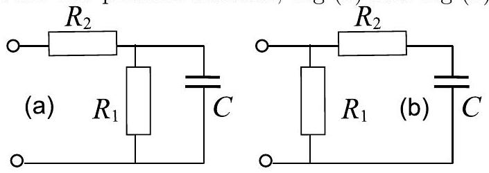

Problem 11. Black box (10 points) There are several measurements, which can be made.
i. (2 pts) We can measure the voltage of the battery $\mathcal { E } \approx 3.2 \mathrm {~V}$. ii. (2 pts) Then, we can connect battery to the outlets of the box via ammeter and measure the current. It appears that at the first moment, $I _ { c 0 } \approx 1.3 \mathrm {~mA}$; however, the current starts to decrease (decreasing twice during $\tau _ { 1 } \approx 12 \mathrm {~s}$ ) and achieves at the long-time limit the final value $I _ { c \infty } \approx 0.35 \mathrm {~mA}$.
iii. (2 pts) Further, we can measure voltage at the outlet after disconnecting the battery. At the first moment, $V _ { d } \approx 2.35 \mathrm {~V}$; it decreases twice per $\tau _ { 2 } \approx 25 \mathrm {~s}$ and vanishes at the long-time limit.
iv. (4 pts) Finally, we can connect the ammeter to the outlet immediately after disconnecting the battery, and measure the current. Initially, it has value $I _ { d } \approx 1.0 \mathrm {~mA}$, and vanishes at the long-time limit.

From iii and ii we can conclude that the box must contain a capacitor $C$ (if there were an inductance, the current $I _ { c }$ would increase in time). Because of self-discharge (voltage vanishes for iii), there must be a resistance $R _ { 1 }$ parallel to the capacitor. Because of a prolonged charging (for ii, $\tau _ { 1 } > 0$ ), there must be also a resistor $R _ { 2 }$ in serial connection to the capacitor. So, there are two possible schemes, Fig (a) and Fig (b).

In case (a):

$$
\begin{gathered}
I _ { c 0 } = \mathcal { E } / R _ { 2 } , \quad I _ { c \infty } = \mathcal { E } / \left( R _ { 1 } + R _ { 2 } \right) , \\
I _ { d } = \mathcal { E } R _ { 1 } / R _ { 2 } \left( R _ { 1 } + R _ { 2 } \right) , \quad U _ { d } = \mathcal { E } R _ { 1 } / \left( R _ { 1 } + R _ { 2 } \right) .
\end{gathered}
$$

In case (b),

$$
\begin{aligned}
I _ { c 0 } & = \mathcal { E } \left( R _ { 2 } ^ { - 1 } + R _ { 1 } ^ { - 1 } \right) , \quad I _ { c \infty } = \mathcal { E } / R _ { 1 } , \\
I _ { d } & = \mathcal { E } / R _ { 2 } , \quad U _ { d } = \mathcal { E } R _ { 1 } / \left( R _ { 1 } + R _ { 2 } \right) .
\end{aligned}
$$

In both cases, we have two unknown quantities ( $R _ { 1 }$ and $R _ { 2 }$ ), and four equations. It appears (follows from these equations) that in both cases, two equalities should hold between the measured quantities: $U _ { d } = \mathcal { E } I _ { c \infty } / I _ { c 0 }$, and $I _ { c 0 } = I _ { c \infty } + I _ { d }$. So, the effective (independent) number of equations is reduced by two, which still leaves two - just sufficient for finding $R _ { 1 }$ and $R _ { 2 }$, but not enough to distinguish between the cases (a) and (b). In fact, it can be shown that these two cases cannot be distinguished even if we study the time-dependences of voltage and currents. So, we can say that we have either scheme (a) with $R _ { 2 } = \mathcal { E } / I _ { c 0 } \approx 2.5 \mathrm { k } \Omega$ and $R _ { 1 } = \mathcal { E } / I _ { c \infty } - R _ { 2 } \approx 6.9 \mathrm { k } \Omega$, or scheme (b) with $R _ { 1 } = \mathcal { E } / I _ { c \infty } \approx 9.1 \mathrm { k } \Omega$ and $R _ { 2 } = \mathcal { E } / I _ { d } \approx$ $3.2 \mathrm { k } \Omega$.

The value of the capacitor can be estimated from characteristic current decay times. For instance, using the characteristic time $\tau _ { 2 }$, in the case (a) we have $\tau _ { 2 } = \ln 2 R _ { 1 } C$, hence $C = \tau _ { 2 } / \ln 2 R _ { 1 } \approx 5.2 \mathrm { mF }$. In the case (b), $\tau _ { 2 } = \ln 2 \left( R _ { 1 } + R _ { 2 } \right) C$, hence $C = \tau _ { 2 } / \ln 2 \left( R _ { 1 } + R _ { 2 } \right) \approx 2.9 \mathrm { mF }$.
