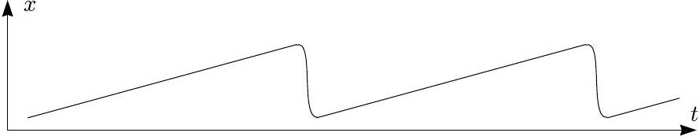
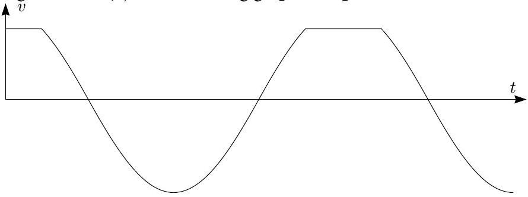
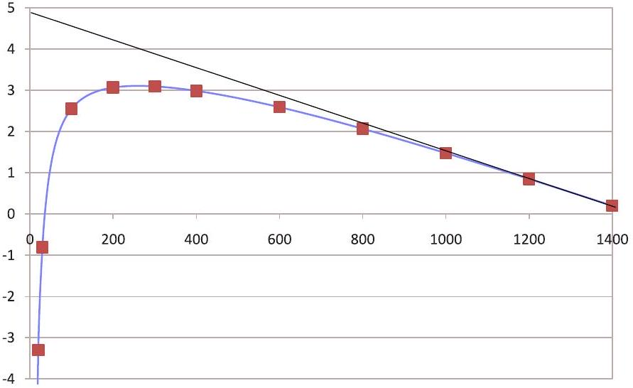

## Estonian-Finnish Olympiad - 2011: solutions

1. Spool (12 points) i) First solution. The momentary rotation centre of the spool is the contact point $P$ with the floor (since this point is at rest). So, the velocity of the spool is $u ^ { \prime } = R \omega$, where $\omega$ is the angular velocity. Consider triangle $P O A$, where $A$ is defined as the point where the loose end of the rope meets the inner part of the spool at the current moment of time, but which is actually a point of the spool, i.e. it rolls together with the spool); $O$ is the centre of the spool. Let us denote $\angle P A O = \beta$; it is easy to see that $\angle A O P = \pi - \alpha$. The velocity $\vec { v } _ { A }$ of the point $A$ is perpendicular to $P A$ and, hence, forms angle $\beta$ with the loose end of the rope. Its projection to the rope equals to $u$, therefore $v _ { A } = u / \cos \beta$. Further, $\omega = v _ { A } / l$, where $l = | A P |$ can be found from the cosine theorem: $l = \sqrt { R ^ { 2 } + r ^ { 2 } + 2 R r \cos \alpha }$. The angle $\beta$ can be found using the sine theorem for the triangle $A O P : \sin \beta = \frac { R \sin \alpha } { l }$. Combining everything together we end up with

$$
u ^ { \prime } = \frac { u R } { \sqrt { R ^ { 2 } \cos ^ { 2 } \alpha + r ^ { 2 } + 2 R r \cos \alpha } } = \frac { u R } { | R \cos \alpha + r | } .
$$

Second solution. Let us decompose the velocity $\vec { v } _ { A }$ into two components: the tangential component (parallel to the rope) equals (by modulus) to $u$; let us denote the radial component as $u _ { r }$. Since the distance between $O$ and $A$ is constant, the projection of the velocities of $O$ and $A$ to the line $O A$ are equal:

$$
u _ { r } = v \sin \alpha \Rightarrow v = u _ { r } / \sin \alpha \Rightarrow \omega = u _ { r } / R \sin \alpha .
$$

The vertical component of the velocity of the point $A$ remains unchanged if we switch the laboratory system of reference with the system associated with point $O$; hence,

$$
\begin{gathered}
u \sin \alpha - u _ { r } \cos \alpha = \omega r \sin \alpha = u _ { r } r / R \Rightarrow \\
v = \frac { u _ { r } } { \sin \alpha } = \frac { u R } { R \cos \alpha + r } .
\end{gathered}
$$

ii) (2 pts) The easiest way to solve this part is to use the energy balance for infinitesimal displacement of the cylinder and apply the answer to the previous question:

$$
\begin{aligned}
F u \cdot d t & = d \left[ \frac { M } { 2 } v ^ { 2 } \left( 1 + \frac { J } { M R ^ { 2 } } \right) \right] = M v d v \left( 1 + \frac { J } { M R ^ { 2 } } \right) \\
a & = \frac { d v } { d t } = \frac { F u } { M v \left( 1 + \frac { J } { M R ^ { 2 } } \right) } = \frac { F } { M } \cdot \frac { \cos \alpha + \frac { r } { R } } { 1 + \frac { J } { M R ^ { 2 } } }
\end{aligned}
$$

iii) Let us write the force balance projection to the horizontal axis assuming that the spool is at the edge of slipping, i.e. the friction force $F _ { f } = \mu _ { \min } N$, where $N = m g - F \sin \alpha$ is the normal force:
$M a = F \cos \alpha + \mu _ { \text {min } } N = F \cos \alpha + \mu _ { \text {min } } ( M g - F \sin \alpha )$. Using the result of the previous task, we can use this equation directly to obtain an expression for the minimal allowed value of the coefficient of friction:

$$
\mu _ { \min } = \frac { \left| \frac { r } { R } - \frac { J } { M R ^ { 2 } } \cos \alpha \right| } { \left( 1 + \frac { J } { M R ^ { 2 } } \right) \left| \frac { M g } { F } - \sin \alpha \right| }
$$

iv) The angular moment of the spool with respect to the edge of the threshold conserves during the impact (since the impact force has zero arm):

$$
\begin{gathered}
M u ( R - H ) + J \frac { u } { R } = \left( J + M R ^ { 2 } \right) \frac { v } { R } \Rightarrow \\
v = u \left( 1 - \frac { H / R } { 1 + \frac { J } { M R ^ { 2 } } } \right)
\end{gathered}
$$

v) From the energy conservation law we obtain immediately

$$
\begin{aligned}
\left( J + M R ^ { 2 } \right) \frac { v ^ { 2 } } { R ^ { 2 } } & = \left( J + M R ^ { 2 } \right) \frac { w ^ { 2 } } { R ^ { 2 } } + 2 M g H \Rightarrow \\
w & = \sqrt { v ^ { 2 } - \frac { 2 g H } { 1 + \frac { J } { M R ^ { 2 } } } } .
\end{aligned}
$$

vi) The spool is the most prone to jumping immediately after the impact; the gravity force needs to be large enough to bind the centre of mass to the rotational motion around the edge of the threshold:

$$
\begin{aligned}
\frac { M v ^ { 2 } } { R } & \leq g \frac { R - H } { R } \Rightarrow v ^ { 2 } \leq \frac { g } { M } ( R - H ) \Rightarrow \\
u _ { 0 } & = \sqrt { \frac { g } { M } ( R - H ) } \frac { 1 + \frac { J } { M R ^ { 2 } } } { 1 + \frac { J } { M R ^ { 2 } } - \frac { H } { R } } .
\end{aligned}
$$

2. Capacitor (6 points)
i) The energy is $W = C U ^ { 2 } / 2 = \frac { 1 } { 2 } \varepsilon _ { 0 } \frac { A } { d } E ^ { 2 } d ^ { 2 } = \frac { 1 } { 2 } \varepsilon _ { 0 } A d E ^ { 2 }$; hence, the energy density $w = W / A d = \frac { 1 } { 2 } \varepsilon _ { 0 } E ^ { 2 }$.
ii) There are two ways to calculate the force. First, we notice that the innermost charges $q$ at the capacitor plates are affected by the electric field E, therefore there is a force $q E$ acting upon these. The outermost charges, however, have no electric field around them (because outside the inter-plate space, there is no electric field). ⇒ Due to the Gauss law, the electric field decreases linearly with the net charge left below the level of the current point (i.e. towards the inter-plate space). Therefore, the electric field averaged over the charges is just half of the maximal value $E : \langle E \rangle = \frac { 1 } { 2 } E$, and the net force acting on the plate is $F = Q \langle E \rangle = C E d \langle E \rangle =$ $\frac { 1 } { 2 } \varepsilon _ { 0 } A E ^ { 2 }$.

The second way includes writing the energy balance for a small displacement of a plate: $F \cdot \delta d = \delta \left( Q ^ { 2 } / 2 C \right) = \frac { Q ^ { 2 } } { 2 \varepsilon _ { 0 } A } \delta d =$ $\frac { 1 } { 2 } C ^ { 2 } E ^ { 2 } d . \delta d \Rightarrow F = \frac { 1 } { 2 } \varepsilon _ { 0 } A E ^ { 2 }$. iii) Let us push away part of the water from the inter-plate space so that there will be a small region of plate area $d A$, where there is no water between the plates (here, $\Delta p$ is the pressure difference between the inter-plate space and the outside regions). By doing so, we perform work $d \cdot \delta A \cdot \Delta p$, and increase the capacitor's energy:

$$
\delta W = \delta \left( Q ^ { 2 } / 2 C \right) = \frac { Q ^ { 2 } d } { 2 \varepsilon _ { 0 } } \left[ \frac { 1 } { \varepsilon A } - \frac { 1 } { \varepsilon ( A - \delta A ) + \delta A } \right] .
$$

So,

$$
\delta W = \frac { Q ^ { 2 } d ( \varepsilon - 1 ) \cdot \delta A } { 2 \varepsilon _ { 0 } \varepsilon ^ { 2 } A ^ { 2 } } = \frac { 1 } { 2 } \varepsilon _ { 0 } E ^ { 2 } d ( \varepsilon - 1 ) \cdot \delta A ;
$$

comparing this with the pressure work $d \cdot \delta A \cdot \Delta p$ we conclude that

$$
\Delta p = \frac { 1 } { 2 } \varepsilon _ { 0 } E ^ { 2 } ( \varepsilon - 1 ) \Rightarrow p = p _ { 0 } + \frac { 1 } { 2 } \varepsilon _ { 0 } E ^ { 2 } ( \varepsilon - 1 ) .
$$

3. Charged cylinder (8 points)
i) Moving surface charge creates a solenoidal surface current with the surface density $j = \sigma v = \sigma \omega r$. From the circulation theorem for a rectangular loop embracing a segment of surface current we obtain $\frac { B l } { \mu _ { 0 } } = j l$, where $l$ is the length of the surface current segment (so that $j l$ gives the current flowing through the loop). Hence, $B = \mu _ { 0 } j = \mu _ { 0 } \sigma \omega r$.
ii) Using formula $\mathcal { E } = \frac { d \Phi } { d t } = B \frac { d S } { d t }$, where $S$ is the area covered by the wire, we obtain $\mathcal { E } = B \omega r ^ { 2 } / 2$. Indeed, during a small time interval $d t$, the wire covers a equilateral triangle of side lengths $r$, $r$, and $r \omega d t$; its area is apparently $r ^ { 2 } \omega d t / 2$. By using the earlier obtained expression for $B$ we end up with

$$
\mathcal { E } = \mu _ { 0 } \sigma \omega ^ { 2 } r ^ { 3 } / 2 .
$$

iii) We need to show that from the previous task, $\frac { d S } { d t }$ is independent of the wire shape. First we note that due to rotational symmetry, $\frac { d S } { d t }$, it cannot depend on the rotation angle, i.e. $\frac { d S } { d t } \equiv \dot { S } =$ Const. Further we note that regardless of the wire shape, during the entire rotation period $2 \pi / \omega$, the whole circle area is covered; $\dot { S } \cdot 2 \pi / \omega = \pi r ^ { 2 } \Rightarrow \dot { S } = r ^ { 2 } \omega / 2$.
4. Black box (10 points) There are several ways to perform this task. First one can notice that if two capacitors discharge at the same resistor, starting with equal voltages and ending also with equal voltages, the ratio of the discharge times equals to the ratio of the capacitances (because for each given voltage, the discharge currents are the same, but larger capacitor has more charge-proportionally to the capacitance). Therefore we can first charge the known capacitor (using the battery), and let it discharge on the voltmeter (which has some finite resistance), measuring the time $t _ { 1 }$ required for it to reach a pre-defined final voltage. Then we need

to repeat the procedure with the other capacitor and measure the time $t _ { 2 }$ and calculate $C _ { 2 } = C _ { 1 } t _ { 2 } / t _ { 1 }$; the uncertainty is estimated as $\Delta C _ { 1 } = C _ { 1 } \left( \frac { \Delta t _ { 1 } } { t _ { 1 } } + \frac { \Delta t _ { 2 } } { t _ { 2 } } + \frac { \Delta C _ { 1 } } { C _ { 1 } } \right)$.

It is recommended to check the negligibility of the leak current across the plates of the capacitor. To this end, one can charge a capacitor, measure the voltage, remove the voltmeter and wait for some time (of the order $t _ { 1 }$ and $t _ { 2 }$ ), and check again the voltage.

Another way is to discharge completely one capacitor by short-circuiting its terminals and charge the other capacitor up to the voltage of the battery. Further, we connect the terminals $A$ and $B$ so that the capacitors re-distribute the charge $Q = \mathcal { E } C _ { 1 }$ and take the same voltage: $Q _ { 1 } / C _ { 1 } = \left( Q - Q _ { 1 } \right) / C _ { 2 } \Rightarrow Q _ { 1 } =$ $Q C _ { 1 } / \left( C _ { 1 } + C _ { 2 } \right) = \mathcal { E } C _ { 1 } ^ { 2 } / \left( C _ { 1 } + C _ { 2 } \right)$. Consequently, the new voltage (which we measure) is $U = Q _ { 1 } / C _ { 1 } = \mathcal { E } C _ { 1 } / \left( C _ { 1 } + C _ { 2 } \right)$, from where $C _ { 2 } = \left( \frac { \mathcal { E } } { U } - 1 \right) C _ { 1 }$.
5. Plutonium decay (3 points)

Let the number of $\mathrm { Pu } ^ { 239 }$-atoms be reduced during time interval $t = 1 \mathrm {~s}$ by a factor of $1 - \lambda$ (with $\lambda \ll 1$ ). Then, during the time period of $\tau _ { 1 / 2 }$, it is reduced by a factor of $( 1 - \lambda ) ^ { \tau _ { 1 / 2 } / t } \approx$ $e ^ { - \lambda \tau _ { 1 / 2 } / t } = \frac { 1 } { 2 } \Rightarrow \lambda = t \ln 2 / \tau _ { 1 / 2 }$. Therefore, the number of atom decay events is $N _ { d } = N t \ln 2 / \tau _ { 1 / 2 }$, where $N = \rho d S / m _ { 0 }$ is the number of atoms, i.e. the $\alpha$-particle flux is $\Phi = N _ { d } / 2 S t$ (where the factor 2 accounts for the fact that the particles are emitted towards the both sides of the plate). Upon bringing all the expressions together, we obtain

$$
\Phi = \frac { \rho d \ln 2 } { 2 \tau _ { 1 / 2 } m _ { 0 } } \approx 2.36 \times 10 ^ { 13 } \mathrm {~m} ^ { - 2 } \cdot \mathrm {~s} ^ { - 1 } .
$$

6. Violin string (9 points)
i) When the plate slides, there is a constant friction force $\mu _ { 2 } N$ acting upon the block, which means that the equilibrium deformation of the spring is $x _ { 0 } = \mu _ { 2 } N / k$; the net force acting upon the block (due to spring and friction) is given by $F = - k \xi$, where we have defined $\xi = x - x _ { 0 }$. Therefore, while sliding, the block oscillates harmonically around the point $\xi = 0$. Slipping starts when the static friction will be unable to keep equilibrium, i.e. at $k x = \mu _ { 1 } N$, which corresponds to $\xi _ { 0 } = \left( \mu _ { 1 } - \mu _ { 2 } \right) N / k$. If the plate moves slowly, the block is released with essentially missing kinetic energy, and the energy conservation law yields $\frac { 1 } { 2 } k \xi _ { 0 } ^ { 2 } = \frac { 1 } { 2 } m v _ { \text {max } } ^ { 2 } \Rightarrow v _ { \text {max } } = \xi _ { 0 } \sqrt { k / m }$.
ii) As mentioned, when the plate slides, the motion of the block is harmonic, i.e. the graph of $x ( t )$ is a segment of a sinusoid; when there is no sliding, the block moves together with the plate, i.e. the graph of $x ( t )$ is a straight line. At the moment when slipping starts or stops, the oscillatory speed is equal to the speed of plate, i.e. the straight line is tangent to the sinusoid. The length of a straight segment can be calculated as

$$
T _ { 1 } = 2 \xi _ { 0 } / u = 2 \left( \mu _ { 1 } - \mu _ { 2 } \right) N / k u ;
$$

the sinusoidal segment corresponds to a half-period and therefore has a length of $T _ { 2 } = \pi \sqrt { m / k }$.

iii) The speed $v ( t ) = \frac { d x } { d t }$ is the derivative of $x ( t )$; therefore, the sinusoidal segment of $x ( t )$ will correspond to a sinusoidal segment of $v ( t )$, and a straight segment of $x ( t )$ - to a horizontal segment of $v ( t )$. The resulting graph is depicted below.

iv) Let the amplitude of the oscillations be $A$, i.e. the sinusoidal segments follow the law $\xi ( t ) = A \cos ( \omega t )$, where $\omega = \sqrt { k / m }$. Correspondingly, $v ( t ) = A \omega \sin ( \omega t ) \Rightarrow A \sin ( \omega t ) =$ $v ( t ) / \omega$; hence, for any point at a sinusoidal segment, $\xi ^ { 2 } +$ $v ^ { 2 } / \omega ^ { 2 } = A ^ { 2 }$. At a point, where a sinusoid and a straight line meet, the straight line and sinusoid have equal values for $\xi =$ $\xi _ { 0 } = \left( \mu _ { 1 } - \mu _ { 2 } \right) N / k$ and $v = u$. Consequently,

$$
\begin{gathered}
\left( \mu _ { 1 } - \mu _ { 2 } \right) ^ { 2 } N ^ { 2 } / k ^ { 2 } + u ^ { 2 } / \omega ^ { 2 } = A ^ { 2 } \Rightarrow \\
A = \frac { 1 } { k } \sqrt { \left( \mu _ { 1 } - \mu _ { 2 } \right) ^ { 2 } N ^ { 2 } + u ^ { 2 } m k }
\end{gathered}
$$

v) The oscillations will be almost harmonic when the straight segments are very short, i.e. when $u / \omega \gg \left( \mu _ { 1 } - \mu _ { 2 } \right) N / k \Rightarrow$ $u \gg \left( \mu _ { 1 } - \mu _ { 2 } \right) N / \sqrt { m k }$.
7. Vacuum bulb (8 points)
i) Each pumping cycle reduces the number of molecules inside the bulb by a factor of $( 1 - \alpha )$; therefore, after $N$ cycles, the number of molecules (and hence, the pressure) by a factor of $\beta = ( 1 - \alpha ) ^ { N } \approx e ^ { - N \alpha } \Rightarrow$

$$
N = - \frac { \ln \beta } { \alpha } .
$$

ii) Majority of the pumping cycles are done when the pressure inside the bulb is negligible as compared to the outside pressure. During such a cycle, a work equal to $p _ { 0 } V \alpha$ is done. Therefore, $A \approx N p _ { 0 } V \alpha = p _ { 0 } V | \ln \beta |$. iii) Due to adiabatic law, $p V ^ { \gamma } =$ Const; when combined with the gas law $p V \propto T$ we obtain $p ^ { \gamma - 1 } \propto T ^ { \gamma }$. During the last downwards motion of the piston, the pressure inside the cylinder is increased by a factor of $1 / \beta$; thus, $T = T _ { 0 } \beta ^ { \frac { 1 } { \gamma } - 1 }$.
iv) According to the modified pumping scheme, the work/energy loss is only due to the release of the hot air. Note that if we had a cylinder of volume $V$, we could be able to create vacuum inside there using only one pumping motion, i.e. by performing work $A = p _ { 0 } V$ and without any energy loss. Now, we perform an excess work, which is converted into internal energy of the released hot air, which needs to be calculated. Let $\xi = \frac { p } { p _ { 0 } }$ be an intermediate rarefaction factor; then, we can apply the previous result to calculate the internal energy of released air, if its quantity is $d \nu$ moles: $d U = T _ { 0 } \left( \xi ^ { \frac { 1 } { \gamma } - 1 } - 1 \right) c _ { V } d \nu$. Let us note that the number of moles inside the bulb is $\nu = \frac { p _ { 0 } \xi V } { R T _ { 0 } } \Rightarrow d \nu = \frac { p _ { 0 } V } { R T _ { 0 } } d \xi$. So, $U = p _ { 0 } V \frac { c _ { V } } { R } \int _ { 0 } ^ { 1 } \left( \xi ^ { \frac { 1 } { \gamma } - 1 } - 1 \right) d \xi = ( \gamma - 1 ) p _ { 0 } V \frac { c _ { V } } { R }$. Now, recall that $\gamma = c _ { p } / c _ { V } = 1 + \frac { R } { c _ { V } }$, hence $\frac { c _ { V } } { R } = \frac { 1 } { \gamma - 1 }$ and $U = p _ { 0 } V$. This gives us the energy loss due to heating the released air; another $p _ { 0 } V$ is required for loss-free creation of the vacuum. Hence, the total required work is $A = 2 p _ { 0 } V$.
8. Heat sink (6 points)
i) When the average temperature is stable at $T _ { 0 }$, all the power dissipated at the electronic component is eventually given to the air: the air is being heated with power $P$. As the heat flux depends linearly on the temperature difference between a point on the plate and the air, the average heat flux and therefore the net power dissipated into the air depends linearly on the average temperature of the plate. The average temperature determines the radiated power.

Now consider the situation after the heating has ended. The average temperature is initially the same, so the radiated heat power is initially still $P$. By the definition of heat capacity, an infinitesimal heat amount given to the surroundings is $d Q =$ $- C d T _ { \text {avg } }$ with the minus sign encoding the direction of the heat flow. Thus, at the first moment, $P = \frac { d Q } { d t } = - C \frac { d T _ { \text {avg } } } { d t }$. Assuming that during $\tau$ the average temperature depends approximately linearly on time (because $T _ { 0 } - T _ { 1 } = 1 ^ { \circ } \mathrm { C }$ is much less than the usual ambient temperature), $\frac { d T _ { \text {avg } } } { d t } \approx \frac { T _ { 1 } - T _ { 0 } } { \tau }$ and $C \approx \frac { P \tau } { T _ { 0 } - T _ { 1 } } =$ $350 \mathrm {~J} / { } ^ { \circ } \mathrm { C }$. Actually the graph of $T _ { \text {avg } } ( t )$ is slightly curved downwards (as it is an exponential eventually stabilizing at the ambient temperature) and initially somewhat steeper, so $C$ is a bit smaller. ii) The average temperature of the heat sink falls off exponentially, therefore, if the "tail" of the given graph turns out to be exponential, we can presume the "tail" depicts the situation where the sensor is sensing the average temperature and the initial "bump"

in the temperature distribution has evened out. Extrapolating the exponential to $t = 0$ we get the initial average temperature $T _ { \text {avg } , 0 }$ (immediately after the $Q$ has been dissipated into the sink) and, by $Q = C \left( T _ { \text {avg } , 0 } - T _ { \text {amb } } \right)$, the heat $Q$. The ambient temperature $T _ { \mathrm { amb } }$ can be read off from the beginning of the given graph where the sensor's surroundings have not yet heated up. This is furthermore a check for the assumption $T _ { 0 } - T _ { 1 } \ll T _ { \text {amb } }$ made in the first part of the solution. From the table, $T _ { \mathrm { amb } } = 20.0 ^ { \circ } \mathrm { C }$.

Let us analyse the (yet hypothetical) exponential $T _ { \text {avg } } - T _ { \text {amb } }$ ought to obey, so that eventually we expect $T \sim T _ { \text {avg } } =$ $T _ { \mathrm { amb } } + T _ { c } e ^ { - \frac { t } { t _ { c } } }$ where $T _ { c }$ and $t _ { c }$ are, respectively, a characteristic temperature and a characteristic time. (The "~" means "is asymptotical to" or "approaches".) We plot $\ln \left( T - T _ { \text {amb } } \right)$ using the data from the table. Then approximate the "tail" linearly (valuing the end of it most) to get $\ln \left[ \left( T - T _ { \text {amb } } \right) / ^ { \circ } \mathrm { C } \right] \sim 4.89 - \frac { t } { 300 \mathrm {~s} }$. Therefore $T _ { c } \approx e ^ { 4.89 { } ^ { \circ } \mathrm { C } } \approx 133 ^ { \circ } \mathrm { C }$. On the other hand, plugging $t = 0$ into our exponential function shows that $T _ { \text {avg } , 0 } - T _ { \text {amb } } = T _ { c }$ and, finally, $Q = C T _ { c } \approx 46700 \mathrm {~J}$.

Actually, quite a good result can be obtained without replotting anything, by just considering the last three datapoints of the table. Denote $\Delta T _ { i } \equiv T _ { i } - T _ { \text {amb } }$. If the times $t _ { 3 } -$ $t _ { 2 } = t _ { 2 } - t _ { 1 }$, then with an exponential we should observe that $\Delta T _ { 3 } / \Delta T _ { 2 } = \Delta T _ { 2 } / \Delta T _ { 1 }$. The last three timepoints are good indeed, so we check $\Delta T _ { 1 } = 4.4 ^ { \circ } \mathrm { C } , \Delta T _ { 2 } = 2.3 ^ { \circ } \mathrm { C }$ and $\Delta T _ { 3 } = 1.2 ^ { \circ } \mathrm { C }$. Their ratios are $\Delta T _ { 3 } / \Delta T _ { 2 } \approx 0.522$ and $\Delta T _ { 2 } / \Delta T _ { 1 } \approx 0.523$, a splendid match. This confirms the exponential "tail". As in every equal time interval the $\Delta T$ is multiplied by the same number (that is the essence of exponentials), $T _ { c } = \Delta T _ { \mathrm { avg } , 0 } = \Delta T _ { 3 } \times \left( \frac { \Delta T _ { 2 } } { \Delta T _ { 3 } } \right) ^ { \frac { t _ { 3 } } { t _ { 3 } - t _ { 2 } } } \approx 114 ^ { \circ } \mathrm { C }$. From this, $Q \approx 39900 \mathrm {~J}$. This is discrepant from our previous calculation, but not too much: $T _ { c }$ is exponentially sensitive to the $T$-intercept of the straight line fitted to the "tail" (its crossing point with the $T$-axis) on the logarithmic plot. The bump has still not yet disappeared completely enough.

## 9. Coefficient of refraction (10 points)

i) We direct the laser beam radially into the semi-cylinder: perpendicularly through its cylindrical surface. The beam enters the plate without refraction and reaches the opposing flat face at the axis of the cylinder. Depending on the angle between that face and the beam, there may or may not be a refracting beam, but there is always a reflecting (from the flat face) beam. We rotate the semicylinder around its axis to find the position, when the refracting beam appears/disappears; the angle $\alpha$ between the flat face and the incident beam correspond to the angle of complete internal reflection, i.e. $n = 1 / \cos \alpha$. We can measure $\cos \alpha$ using the graph paper: we draw the beam as a segment $A O$ and the flat face of the semi-cylinder as a line $B O$ so that $\angle A B O = \pi / 2$; then, $n = | A O | / | B O |$. The uncertainty can be found using the formula $\Delta n = n \left( \frac { \Delta | A O | } { | A O | } + \frac { \Delta | B O | } { | B O | } \right)$ and by estimating the uncertainties of the direct length measurements $\Delta | A O |$ and $\Delta | B O |$. ii) We drop the liquid on the prism and press it against the flat face of the semi-cylindrical plate. Further we study the complete internal reflection at the boundary between the semi-cylinder and prism (which is filled with the liquid) by repeating the above described experiment. Thereby we measure new lengths $A ^ { \prime } O$ and $B ^ { \prime } O$; the condition of complete internal reflection is now $n / n _ { l } = \left| A ^ { \prime } O \right| / \left| B ^ { \prime } O \right| \Rightarrow n _ { l } = n \left| B ^ { \prime } O \right| / \left| A ^ { \prime } O \right|$, where $n _ { l }$ stands for the coefficient of refraction of the liquid. The uncertainty is now calculated as $\Delta n _ { l } = n _ { l } \left( \frac { \Delta \left| A ^ { \prime } O \right| } { \left| A ^ { \prime } O \right| } + \frac { \Delta \left| B ^ { \prime } O \right| } { \left| B ^ { \prime } O \right| } + \frac { \Delta n } { n } \right)$.
