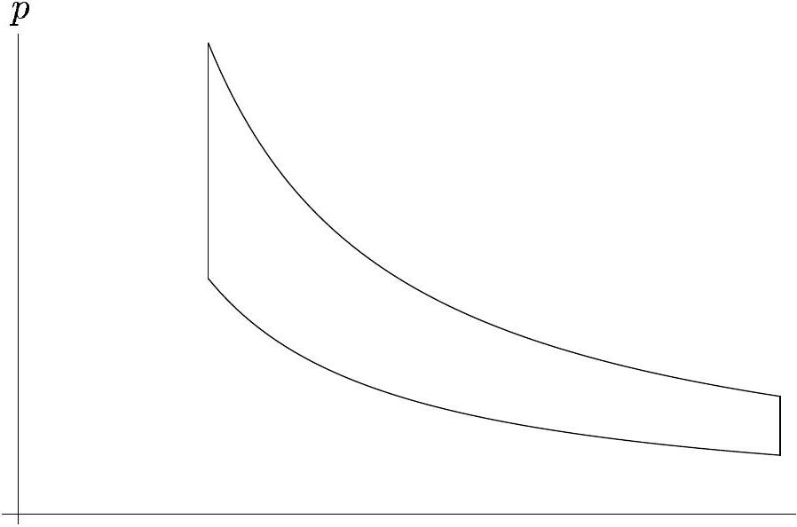

## Estonian-Finnish Olympiad - 2012

Problem 1. Asteroid (14 points)
Part A. Collision with Earth (5 points)
i. (2 pts) The longer axis of the asteroid $2 a = R _ { \text {max } } + R _ { \text {min } } =$ $2 R _ { e }$ equals to that of Earth, so the full energies, when reduced to the unit mass, are equal. Immediately before the collision, the Earth and the asteroid are at the same distance from the Sun, so the gravitational potentials are equal, too. Hence, the speeds are also equal. The distance between the Sun and the asteroid equals to the longer semiaxis, hence it is situated at the shorter semiaxis of the orbit. The velocity of the asteroid is perpendicular to the shorter semiaxis, and the velocity of the Earth - to the radius vector drawn from the Sun. So, the angle between those two vectors is the angle between the radius vector and the shorter semiaxis, $\sin \alpha = \frac { 1 } { 2 } \left( R _ { \text {max } } - R _ { \text {min } } \right) / R _ { e } = \frac { 1 } { 2 }$, hence $\alpha = 30 ^ { \circ }$. The relative velocity of the asteroid is the vector difference of the two vectors, so its modulus equals to $v _ { a } = 2 v _ { 0 } \sin 15 ^ { \circ } \approx 15.5 \mathrm {~km} / \mathrm { s }$. When accelerated further by the Earth's gravity field, the respective gravitational energy will be added to the kinetic one, $v _ { b } = \sqrt { v _ { a } ^ { 2 } + 2 g r _ { e } } = 19.1 \mathrm {~km} / \mathrm { s }$.
ii. (2 pts) At the limit case of impact, the trajectory of the asteroid is tangent to the surface of the Earth. So, we can apply the conservation of angular momentum for the point where the trajectory touches the Earth, $v _ { a } b = v _ { b } r _ { e }$, hence $b = r _ { e } v _ { b } / v _ { a } = 7900 \mathrm {~km}$.
iii. (1 pt) Suppose that the asteroid is delayed by $\tau$; at that moment when the asteroid is at the Earth's orbit, the Earth is at the distance $l = v _ { 0 } \tau$ from the asteroid. The relative velocity of the asteroid forms with this displacement vector an angle equal to $90 ^ { \circ } - 15 ^ { \circ } = 75 ^ { \circ }$, hence the impact parameter $b = v _ { 0 } \tau \sin 75 ^ { \circ }$, from where $\tau = b / v _ { 0 } \sin 75 ^ { \circ } \approx 270 \mathrm {~s}$. Since this time delay is accumulated over 10 periods, the delay need for a single period is $\tau / 10 = 27 \mathrm {~s}$.
Part B. Changing the solar pull (9 points)
i. (2 pts) When $\gamma$ changes, the kinetic energy remains constant:

$$
- \frac { \gamma _ { 0 } } { 2 a } + \frac { \gamma _ { 0 } } { 0.5 R _ { e } } = - \frac { \gamma _ { 1 } } { 2 a ^ { \prime } } + \frac { \gamma _ { 1 } } { 0.5 R _ { e } }
$$

where $a = R _ { e }$ and $2 a ^ { \prime } = 0.5 R _ { e } + R _ { \text {max } } ^ { \prime }$. So,

$$
\begin{gathered}
\frac { \gamma _ { 1 } } { 2 a ^ { \prime } } = \frac { \gamma _ { 0 } } { 2 R _ { e } } \left( 4 \frac { \gamma _ { 1 } } { \gamma _ { 0 } } - 3 \right) \Rightarrow ( 1 - \kappa ) R _ { e } = a ^ { \prime } ( 1 - 4 \kappa ) , \\
a ^ { \prime } = R _ { e } \frac { 1 - \kappa } { 1 - 4 \kappa } , \quad R _ { \max } ^ { \prime } = \frac { R _ { e } } { 2 } \frac { 3 } { 1 - 4 \kappa } .
\end{gathered}
$$

ii. ( $\mathbf { 2 }$ pts) At the limit of small $\kappa$, we can simplify the previous result,

$$
\frac { a ^ { \prime } } { R _ { e } } \approx 1 + 3 \kappa .
$$

From the Kepler's third law, $T / T _ { 0 } = \left( a ^ { \prime } / a \right) ^ { 3 / 2 } \sqrt { \gamma _ { 0 } / \gamma _ { 1 } }$, from where $\frac { \Delta T } { T _ { 0 } } \approx \frac { 3 } { 2 } \frac { a ^ { \prime } - a } { a } + \frac { \kappa } { 2 } = 5 \kappa$. So, $\Delta T = 5 T _ { 0 } \kappa$.
iii. (4 pts) For photons, the energy-to-mass ratio is $c$. Therefore, at the Sun's surface, the momentum carried by photons per unit time across a surface area $S$ is given by $d p / d t =$ $S \sigma T _ { s } ^ { 4 } / c$. As the result of the coating, the photons are reflected back by the asteroid, instead of being absorbed. So, before coating, each photon gave to the asteroid a momentum equal to its own; no it will double. Hence, the change in the force due to photons is given by $\Delta F = \pi r _ { a } ^ { 2 } \sigma T _ { s } ^ { 4 } / c$ (assuming that the asteroid is at the Sun's surface). Both the pressure of photons and gravity force are inversely proportional to the distance from the Sun, so the force due to photons can be, indeed, considered as a correction to the gravity constant. $\kappa$ is the relative change of that constant and can be calculated for the Sun's surface as

$$
\kappa = \Delta F / g _ { S } m _ { a } = \pi r _ { a } ^ { 2 } \sigma T _ { s } ^ { 4 } / c g _ { S } m _ { a } \approx 2.8 \times 10 ^ { - 8 } .
$$

iv. (1 pt) We need to have $\Delta T = 27 \mathrm {~s}$, hence $\kappa = \frac { 1 } { 5 } \frac { \Delta T } { T _ { 0 } } \approx$ $1.7 \times 10 ^ { - 7 }$. This exceeds by an order of magnitude the effect provided by the coating. $\kappa$ provided by the coating is inversely proportional to the diameter of the asteroid; the required $\kappa$ is inversely proportional to $N$. So, it would be possible to avert collision for $r _ { a } = 2 \mathrm {~m}$, or for $r _ { a } = 10 \mathrm {~m}$ with $N = 60$. In the first case, the asteroid may not be large enough to warrant attention; in the second case, 60 years is too long time. So, the answer is "no".

Problem 2. Thermodynamic cycle (5 points)

$V$
It is possible to realise the described process as a reversible cycle between two reservoirs at $T _ { 1 }$ and $T _ { 2 }$ (in this case it is called the Stirling cycle). A thermodynamic process is reversible if and only if there is never any heat flux between regions having non-infinitesimally different temperatures. During either isotherm we may keep the system in contact with a reservoir. The isochores can be connected with a heat exchanger in such a way that the heat emitted at any specific temperature on one isochore is later reused at the same temperature on the other isochore. A corollary of Carnot's theorem (which says that the Carnot cycle is the most efficient one possible between to reservoirs) is that any reversible cycle between two reservoirs has the same efficiency as Carnot's. Assuming $T _ { 1 } > T _ { 2 }$, the efficiency is $\left( T _ { 1 } - T _ { 2 } \right) / T _ { 1 }$.

Alternatively: for an isotherm, $p \propto T / V$, therefore the work done during compression from $V _ { 1 }$ to $V _ { 2 }$ is $Q _ { 12 } ( T ) = \int _ { V _ { 1 } } ^ { V _ { 2 } } p d V \propto T \int _ { V _ { 1 } } ^ { V _ { 2 } } \frac { d V } { V } =$ $T \int _ { V _ { 1 } } ^ { V _ { 2 } } d \ln V = T \ln \frac { V _ { 2 } } { V _ { 1 } }$. During isochores there is no displacement and thus no work done. The efficiency $\eta = \frac { Q _ { 12 } \left( T _ { 2 } \right) - Q _ { 12 } \left( T _ { 1 } \right) } { Q _ { 12 } \left( T _ { 2 } \right) } = \frac { T _ { 2 } - T _ { 1 } } { T _ { 2 } }$.

## Problem 3. Bars and rod (5 points)

With $\mu = \frac { 1 } { 2 }$, the resultant force of the normal force and friction force forms an angle $\arctan \frac { 1 } { 2 }$ with the surface normal (assuming that the rod is as short as possible and hence, at the threshold of slipping). There are three forces applied to the rod - the gravity force $m g$ applied to the centre of mass $C$, and the two forces due to the bars. At equilibrium, the three lines $s _ { 1 } , s _ { 2 }$, and $s _ { 3 }$, defined by these three forces need to intersect at a single point $Q$ (otherwise, with respect to the intersection point of two lines, the torque of the third force would cause a rotation of the rod). This configuration is depicted in Figure.

Since the friction force forms angle $\arctan \frac { 1 } { 2 }$ with the surface normal, hence $\angle D P Q = \angle D R Q = \arctan 2$, hence $A P =$ $R S = \frac { 1 } { 4 } d$ (see Figure). From the geometry of the blue triangle, $A S = 2 \sqrt { 3 } d$; due to $A P = R S , P R = A S = 2 \sqrt { 3 } d$ and $P D = \sqrt { 3 } d$. Now, let us recall that $\tan \angle D P Q = 2$, hence $D Q = P R = 2 \sqrt { 3 } d$. From the geometry of the blue triangle, $\angle D C Q = 30 ^ { \circ }$, so that $D C = D Q / \tan 30 ^ { \circ } = 6 d$. Now we can finally express

$$
\begin{gathered}
A C = C D + D P - P A = 5 \frac { 3 } { 4 } d + \sqrt { 3 } d \Rightarrow \\
L = 2 A C = ( 11,5 + 2 \sqrt { 3 } ) d \approx 14.96 d .
\end{gathered}
$$

## Problem 4. RLC-circuit (5 points)

i. (1 pt) In the stationary regime, the capacitors can be effectively disconnected (they conduct no direct current) and the inductors can be substituted by wires. If the voltmeter is ideal, there is therefore no current through $R _ { 1 }$ and the voltmeter shows the voltage on $R _ { 2 }$ equalling $\mathcal { E }$.
ii. (2 pts) Capacitors cannot immediately change their voltage and inductors cannot instantaneously change their current. $L _ { 1 }$ and $L _ { 2 }$ had both been carrying all the current that had been flowing through the circuit, hence, after opening the switch, they still carry a current of $\mathcal { E } / R _ { 2 }$ and act as such current sources. As the current from $L _ { 2 }$ flows also through $R _ { 2 }$, the voltage on $R _ { 2 }$ is $\mathcal { E }$ (with the "+"-side at the centre of the circuit). The current through $L _ { 1 }$ flows also through $R _ { 1 }$ (it is the current charging $C _ { 1 }$ ); therefore the voltage on $R _ { 1 }$ is $\mathcal { E } R _ { 1 } / R _ { 2 }$ (with the "+"-side at the centre). The reading of the voltmeter has changed its sign and is $\mathcal { E } \left( 1 - R _ { 1 } / R _ { 2 } \right)$ or, plugging in the data, $- 2 \mathcal { E }$.
iii. (2 pts) Immediately after opening the switch, capacitor $C _ { 1 }$ was uncharged (it had been parallel to $R _ { 1 }$ that was carrying no current) and $C _ { 2 }$ had a voltage of $\mathcal { E }$ (it had been directly parallel to the battery). $L _ { 1 }$ and $L _ { 2 }$ were both carrying a current of $\mathcal { E } / R _ { 2 }$. The voltmeter can be effectively disconnected (its resistance is huge), giving us two separate circuits, $R _ { 1 } L _ { 1 } C _ { 1 }$ and $R _ { 2 } L _ { 2 } C _ { 2 }$. Therefore (by the potential energy formulae $C U ^ { 2 } / 2$ and $L I ^ { 2 } / 2$ ) the energy stored in the left-hand circuit was $L _ { 1 } \mathcal { E } ^ { 2 } / \left( 2 R _ { 2 } ^ { 2 } \right)$ or, with the given data, $L \mathcal { E } ^ { 2 } / \left( 2 R ^ { 2 } \right)$. This is the energy dissipated from $R _ { 1 }$. The corresponding expressions for the right-hand circuit (giving the energy dissipated from $R _ { 2 }$ ) are $C _ { 2 } \mathcal { E } ^ { 2 } / 2 + L _ { 2 } \mathcal { E } ^ { 2 } / \left( 2 R _ { 2 } ^ { 2 } \right)$ and $C \mathcal { E } ^ { 2 } / 2 + L \mathcal { E } ^ { 2 } / \left( 2 R ^ { 2 } \right)$.

## Problem 5. Diffraction grating (7 points)

The experiment is rather straightforward, except that the grating pitch is smaller than the wavelength. Therefore, for a perpendicularly falling laser beam, first main maximum cannot be observed. In order to observe that maximum, the laser beam needs to be inclined. The easiest way is to determine angle by which the first main maximum is observed at the direction, directly opposite to the laser beam. Then the optical path difference between the rays originating from two neighbouring stripes is found as $\Delta l = 2 d \sin \alpha = \lambda$, so that $d = \frac { 1 } { 2 } \frac { \lambda } { \sin \alpha }$, where $\alpha$ is such an angle between the laser beam and grating surface normal for which the first main maximum is observed at the direction, directly opposite to the laser beam. $\sin \alpha = a / c$ can be calculated from geometrical measurements of the sides $a$ and $c$ of a right triangle. For the uncertainty, $\frac { \Delta \lambda } { \lambda } = \frac { \Delta a } { a } + \frac { \Delta c } { c }$. Measurements yield $d \approx ( 320 \pm 4 ) \mathrm { nm }$.

## Problem 6. Uranium decay (7 points)

i. (2 pts) It can be seen from the table that the fist half-life is much longer than all the others. This means that as soon as something is produced by the decay of $\mathrm { U } ^ { 238 }$, all the other decay steps in the chain take place almost immediately, and for the other isotopes, a quasi-stationary concentration level is achieved - such that the number of decays per unit time of the isotope equals to that of $\mathrm { U } ^ { 238 }$. Let us apply this to $\mathrm { U } ^ { 234 }$. If the number of $\mathrm { U } ^ { 238 }$ atoms is $N _ { 238 }$ then the number of decays per unit time is $\frac { d N } { d t } = N _ { 0 } \ln 2 / \tau _ { 238 } = N _ { 234 } \ln 2 / \tau _ { 234 }$, hence $N _ { 234 } / N _ { 238 } = \tau _ { 234 } / \tau _ { 238 }$ The total number of uranium atoms equals to $N = N _ { 238 } / 0.993$, so

$$
\frac { N _ { 234 } } { N } = \frac { \tau _ { 234 } } { 0,993 \tau _ { 238 } } \approx 5.53 \times 10 ^ { - 5 } .
$$

ii. (2 pts) Since the uranium ore has reached a quasistationary composition of isotopes, per each decay of $\mathrm { U } ^ { 238 }$, there is one decay event for each of the isotopes. So we need to sum up all the decay energies in the second row of the table, this gives us $E _ { \text {dec } } = 52.1 \mathrm { MeV }$. Then the heat production rate is given by $w = N _ { A } \frac { \rho } { \mu } E _ { \text {dec } } \frac { \ln 2 } { \tau _ { 238 } } \approx 2.0 \mathrm {~W} / \mathrm { m } ^ { 3 }$.
iii. (3 pts) The heat released will escape owing to the thermal conductance. Inside a sphere of radius $r$, the heat released equals to $\frac { 4 } { 3 } \pi w r ^ { 3 } = 4 \pi r ^ { 2 } \kappa \frac { d T } { d r }$ (the right-hand-side gives the thermal flux due to conductance). From this equation we obtain $r d r = 3 \frac { \kappa } { w } d T$, which yields after integration

$$
R = \sqrt { 6 \frac { \kappa } { w } \left( T _ { 0 } - T _ { a } \right) } \approx 305 \mathrm {~m} .
$$

## Problem 7. Lifting by current (7 points)

i. (2 pts) The Ampère force pulls the wires to the side so that the wires will take a curved shape. Since the Ampère force is perpendicular to the wire, the mechanical tension is constant along the wires. Let the tension be $T$ and the curvature of the wire at a certain point $- R$. Let us consider a short piece of the wire, of length $a \ll R$. Then the angle by which the tangent of the wire rotates while the tangent point moves over an arc of length $a$ is given by $\alpha = a / R$. Let us study the force balance in the perpendicular direction for that piece of wire: the Ampère's force $I a B$ is balanced by the tension $T \alpha = T a / R$. So, $R = T / I B$ which means that $R$ is constant, and the wire will take the form of a circle segment. To conclude, both halves of the wire will take the form of a circle segment, the convex sides of which are turned outside.

ii. (2 pts) The maximal height is achieved when the circle segments form a perfect circle, in which case the lifting height is $\Delta h = l \left( 1 - \frac { 2 } { \pi } \right)$.
iii. (2 pts) If the central angle of the circle segments is $2 \alpha$, the tangents to the wires at the point where the load is fixed forms angle $\alpha$ with the vertical direction. So, the lifting force is $m g = 2 T \cos \alpha$. From the other hand, $R = l / 2 \alpha = T / I B$, ie.

$$
\alpha \frac { m g } { l I B } = \cos \alpha ,
$$

which is the equation from where one can determine the angle $\alpha$. Then, the lifting height

$$
\Delta h = l - 2 R \sin \alpha = l - \frac { 2 T } { l I B } \sin \alpha = l \left( 1 - \frac { \sin \alpha } { \alpha } \right) .
$$

iv. (1 pt) From the previous result it can be seen that we need to have $\frac { \sin \alpha } { \alpha } = \frac { \pi } { 3 }$, hence $\alpha = \frac { \pi } { 6 }$ and

$$
I = \frac { m g \alpha } { l B \cos \alpha } = \frac { m g \pi } { 3 \sqrt { 3 } l B } .
$$

## Problem 8. Elastic collision (7 points)

i. (1 pt) The centre of mass moves with the velocity $\vec { u } =$ $\frac { M } { M + m } \vec { v }$, and that will be the speed of the small ball in new reference frame, hence its momentum $\vec { p } = - m \vec { u } = - \frac { M m } { M + m } \vec { v }$. Since in this frame, the centre of mass is at rest, the large ball needs to have equal by modulus and opposite momentum.
ii. (3 pts) Let the balls change a momentum $\vec { q }$. The small ball will have momentum $\vec { p } ^ { \prime } = \vec { p } + \vec { q }$, and as the centre of mass remains at rest, the large ball will have momentum $- \vec { p } ^ { \prime }$. The energy conservation law can be written now as follows:

$$
\frac { \vec { p } ^ { 2 } } { 2 m } + \frac { \vec { p } ^ { 2 } } { 2 M } = \frac { \vec { p } ^ { \prime 2 } } { 2 m } + \frac { \vec { p } ^ { \prime 2 } } { 2 M } \Rightarrow | \vec { p } | = \left| \vec { p } ^ { \prime } \right| ,
$$

ie. the moduli of the momenta will remain unchanged.
iii. (3 pts) In the laboratory frame, the momentum of the large ball will be

$$
\vec { p } ^ { \prime \prime } = M \vec { u } - \vec { p } ^ { \prime } ;
$$

since $\left| \vec { p } ^ { \prime } \right|$ remains constant, the angle $\alpha$ between $\vec { p } ^ { \prime \prime }$ and $\vec { u }$ will be maximal when $\vec { p } ^ { \prime \prime } \perp \vec { p } ^ { \prime }$, with

$$
\alpha = \arcsin \frac { \left| \vec { p } ^ { \prime } \right| } { | M \vec { u } | } = \arcsin \frac { m } { M } .
$$

## Problem 9. Power lines (7 points)

i. (2 pts) Let us use a frame where the moving perturbations are at rest. There, the centripetal acceleration required for the motion along a trajectory of curvature radius $R$ is given by the mechanical tension of the rope, for a small piece of rope (of length $l$ )

$$
T \frac { l } { R } = \frac { v ^ { 2 } } { R } \sigma l \Rightarrow v = \sqrt { \frac { T } { \sigma } } ,
$$

ie. $k = 1$.
ii. (2 pts) We consider the torque balance for one half of the wire, with respect to the point where it is fixed to the pole. Then, the centre of mass lays approximately at the distance $\frac { L } { 4 }$ (since the shape of the wire is not far from a straight line), and the equation can be written as

$$
T d = \frac { L } { 4 } \sigma g \frac { L } { 2 } \Rightarrow T = \frac { L ^ { 2 } \sigma g } { 8 d } .
$$

iii. (3 pts) For the natural oscillation modes, there will be standing waves with nodes at the fixing points; the lowest frequency corresponds to the longest wavelength, which is $2 L$, so that $f _ { 0 } = v / 2 L = \frac { 1 } { 2 L } \sqrt { \frac { T } { \sigma } }$.

Problem 10. Black box (8 points) We study what will happen, if we connect pair-wise all the leads of the black box.

If we connect leads C and D, there will be permanently light from the red lamp which sticks out from one of the small holes of the box. This indicates that there is a light emitting diode or a lamp connected in series with a battery between these leads.

If we connect leads A and C, there may or may not be light from the same lamp. Once the light disappears, it will appear again only after D and A have been connected for a short time, or D and B for a longer time. In any case, the lamp light vanishes during ca 10 seconds. This means that between these leads, there is (a) either a diode and a capacitor in sequence (in which case the capacitor needs to be charged for a light to appear), or (b) diode, capacitor, and a battery (in which case the capacitor needs to be discharged for a light to appear). When comparing with the previous paragraph, we see that segments CA and CD need to have a common segment; CA includes a capacitor, which is missing from CD. So, CD and DA need to be connected in sequence. Thereby we exclude option (a).

If we connect leads A and D, there may or may not appear a spark, indicating that there is only a capacitor between these leads, or a capacitor and a battery. However, the battery is in segment CD, so there is no battery in this segment.

If we connect leads D and B, there may or may not be green light from another lamp. In any case, the lamp light vanishes during ca 10 seconds. The light reappears after A and C have been connected, and disappears after D and A have been connected. This means that between these leads, there is either a diode and a capacitor in sequence, or a diode, a capacitor, and a battery. The capacitor is in segment DA, so DA needs to be included in DB, ie. DA and AB need to be in sequence. Since the battery is already in CD, there is no battery in this segment.

If we connect leads C and B, nothing happens. If we compare this with what we have learnt earlier - there are two lamps or diodes, a capacitor and a battery between these leads, we conclude that the light emitting components need to be diodes of opposite polarity.

If we connect leads A and B, nothing happens; comparing with what has been found earlier we conclude that there is a diode between these leads.

Finally, since the charge- and discharge time of the capacitor are relatively long $( R C \approx 5 \mathrm {~s} )$, except when discharging via the A-D lead pair, the resistors need to be included into the segments CD and AB.

Bringing everything together, the circuit needs to be as given in Figure (or the same circuit with swapped polarities of the diodes and the battery).

