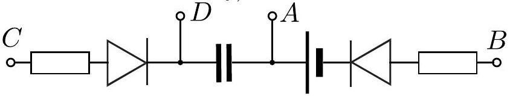

Problem 10. Black box (8 points) We study what will happen, if we connect pair-wise all the leads of the black box.

If we connect leads C and D, there will be permanently light from the red lamp which sticks out from one of the small holes of the box. This indicates that there is a light emitting diode or a lamp connected in series with a battery between these leads.

If we connect leads A and C, there may or may not be light from the same lamp. Once the light disappears, it will appear again only after D and A have been connected for a short time, or D and B for a longer time. In any case, the lamp light vanishes during ca 10 seconds. This means that between these leads, there is (a) either a diode and a capacitor in sequence (in which case the capacitor needs to be charged for a light to appear), or (b) diode, capacitor, and a battery (in which case the capacitor needs to be discharged for a light to appear). When comparing with the previous paragraph, we see that segments CA and CD need to have a common segment; CA includes a capacitor, which is missing from CD. So, CD and DA need to be connected in sequence. Thereby we exclude option (a).

If we connect leads A and D, there may or may not appear a spark, indicating that there is only a capacitor between these leads, or a capacitor and a battery. However, the battery is in segment CD, so there is no battery in this segment.

If we connect leads D and B, there may or may not be green light from another lamp. In any case, the lamp light vanishes during ca 10 seconds. The light reappears after A and C have been connected, and disappears after D and A have been connected. This means that between these leads, there is either a diode and a capacitor in sequence, or a diode, a capacitor, and a battery. The capacitor is in segment DA, so DA needs to be included in DB, ie. DA and AB need to be in sequence. Since the battery is already in CD, there is no battery in this segment.

If we connect leads C and B, nothing happens. If we compare this with what we have learnt earlier - there are two lamps or diodes, a capacitor and a battery between these leads, we conclude that the light emitting components need to be diodes of opposite polarity.

If we connect leads A and B, nothing happens; comparing with what has been found earlier we conclude that there is a diode between these leads.

Finally, since the charge- and discharge time of the capacitor are relatively long $( R C \approx 5 \mathrm {~s} )$, except when discharging via the A-D lead pair, the resistors need to be included into the segments CD and AB.

Bringing everything together, the circuit needs to be as given in Figure (or the same circuit with swapped polarities of the diodes and the battery).

