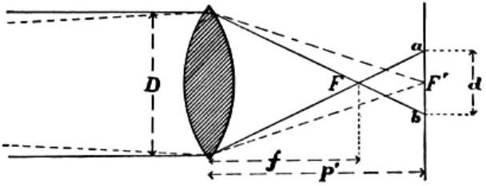

2. CELLPHONE CAMERA (6 points) The distance $L$ is often called hyperfocal distance in photography and it was calculated more than one hundred years ago by Louis Derr (the figure is taken from his book Photography for students of physics and chemistry, published in 1906).

Fig. 49. Hyperfocal Distance.

Let's consider that the camera is focused to distance $L$ and the image is formed exactly on the sensor's plane. The object's distance $L$ and its image's distance $a$ (corresponds to $p ^ { \prime }$ on the figure) are related by the lens formula $\frac { 1 } { L } + \frac { 1 } { a } = \frac { 1 } { f }$, thus

$$
a = \frac { L f } { L - f } = \frac { L f } { L ( 1 - f / L ) } \approx \frac { L f } { L } \left( 1 + \frac { f } { L } \right) = f + \frac { f ^ { 2 } } { L } ,
$$

where the approximation $( 1 + x ) ^ { - 1 } \approx 1 - x$ (for small $x$ ) was used. Image's distance exceeds the focal length by $\Delta a = a - f = f ^ { 2 } / L$.
i) (4 points) The light coming from an infinitely far away object will pass the focal point F and form a cone which is cut by the sensor's plane. The diameter $d$ of the cut on the sensor's plane can be found from similar triangles $d / D = \Delta a / f$, thus $d = D f / L$. Taking into account the sharpness condition $d \leq \eta$, where $\eta = w / N$ is the size of a single element of the sensor, we find that the limiting value of $L$ is $L = D f / \eta = D f N / w \approx 5.5 \mathrm {~m}$.
ii) (2 points) We'll now find the shortest distance $s$ satisfying the sharpness condition. Object at distance $s$ will have an image at distance $b = f + f ^ { 2 } / s$ and the light passing the lens will converge behind the sensor's plane forming a cone. The diameter $d _ { 2 }$ of the cone's cut with the sensor's plane can be calculated from similar triangles: $d _ { 2 } / D = ( b - a ) / b$. Accounting for sharpness condition $d _ { 2 } = \eta$, we can express $b = a / ( 1 - \eta / D )$, and substituting the values of $a$ and $b$ gives

$$
\begin{aligned}
f + \frac { f ^ { 2 } } { s } & = \frac { f + \frac { f ^ { 2 } } { L } } { 1 - \eta / D } = f \frac { 1 + \eta / D } { 1 - \eta / D } \approx f \left( 1 + \frac { \eta } { D } \right) ^ { 2 } \\
& \approx f \left( 1 + \frac { 2 \eta } { D } \right)
\end{aligned}
$$

Finally, $f ^ { 2 } / s = 2 f \eta / D$, or $s = \frac { 1 } { 2 } D f / \eta = L / 2 \approx$ 2.75 m.
