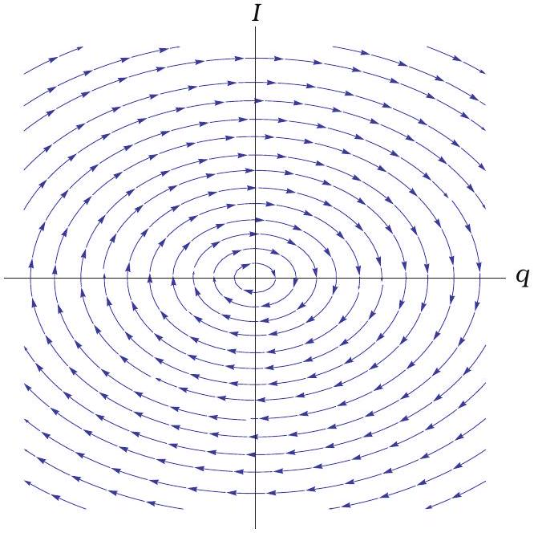
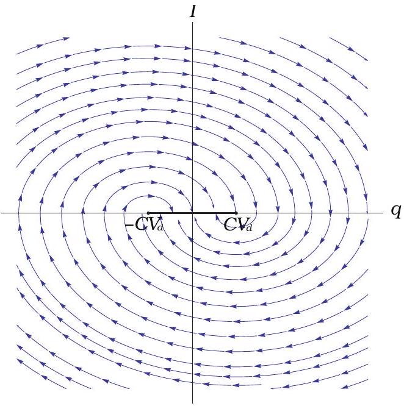

8. ZENER DIODE (7 points)
i) (1 point) Kirchoff's $2 ^ { \text {nd } }$ law gives $L \dot { I } +$ $q / C = 0$ or $\ddot { q } + \frac { 1 } { L C } q = 0$. This is the equation of a simple harmonic oscillator with the frequency $\omega = \frac { 1 } { \sqrt { L C } }$ and we can immediately write $q ( t ) = q _ { 0 } \cos \omega t$, while $I ( t ) = \dot { q } ( t ) =$ $- \omega q _ { 0 } \sin \omega t$.

Note that

$$
q ^ { 2 } + \frac { 1 } { \omega ^ { 2 } } I ^ { 2 } = q _ { 0 } ^ { 2 } \left( \sin ^ { 2 } \omega t + \cos ^ { 2 } \omega t \right) = q _ { 0 } ^ { 2 }
$$

and therefore the phase diagram of the system is an ellipse centred at the origin, with semi-axes $q _ { 0 }$ and $\omega q _ { 0 }$. Alternatively, this relation comes directly from the conservation of energy:

$$
\frac { L I ^ { 2 } } { 2 } + \frac { q ^ { 2 } } { 2 C } = E _ { 0 } = \frac { q _ { 0 } ^ { 2 } } { 2 C } .
$$

By looking at $q$ and $I$ a quarter-period later from $t = 0$, say, it's not hard to see that the system must evolve in a clockwise sense on the phase diagram. Note that in this instance, only $q = 0$ is an equilibrium point: for all non-zero $q$ there will be never-ending oscillations in the circuit.

ii) (2 points) Now the sign of the voltage on the diode depends on the direction of the current, giving either of $L \ddot { q } + \frac { q } { C } \pm V _ { d } = 0$. We can summarize the equations as follows:

$$
\begin{array} { l l }
L \ddot { q } + \frac { q } { C } = V _ { d } & \text { if } \dot { q } < 0 \\
L \ddot { q } + \frac { q } { C } = - V _ { d } & \text { if } \dot { q } > 0
\end{array}
$$

Let us introduce the new variables $q _ { 1,2 }$ such that $q _ { 1 } = q - C V _ { d }$ and $q _ { 2 } = q + C V _ { d }$. Then we can rewrite the two equations above in a more familiar form:

$$
\begin{array} { l l }
L \ddot { q } _ { 1 } + \frac { q _ { 1 } } { C } = 0 & \text { if } \dot { q } < 0 \\
L \ddot { q } _ { 2 } + \frac { q _ { 2 } } { C } = 0 & \text { if } \dot { q } > 0
\end{array}
$$

Thus the introduction of the diode only serves to shift the equilibrium points for the otherwise simple harmonic orbits. For $\dot { q } > 0$, the equilibrium point is $q _ { 2 } = 0$ or $q = - C V _ { d }$, while for $\dot { q } < 0$ it is $q = C V _ { d }$. So the orbit will consist of half-ellipses in the upper and the lower parts of the $I - q$ diagram, centred at $q = - C V _ { d }$ for the upper half and at $q = C V _ { d }$ for the lower half. As the evolution is continuous, these half-ellipses will join up at $I = 0$.

iii) (2 points) We can see on the diagram that there is a "dead zone" between $\pm C V _ { d }$ (for $I = 0$ ). If a trajectory reaches any of the points in that segment, it will stay there forever. The extent of that region is $2 C V _ { d }$.
iv) (2 points) Let's use the phase diagram to figure this out. Suppose the capacitor initially has the charge $q _ { 0 } \gg C V _ { d }$. Then the charge will first swing to the other way of $C V _ { d }$ and will become $q _ { T / 2 } = C V _ { d } - \left( q _ { 0 } - \right.$ $\left. C V _ { d } \right) = 2 C V _ { d } - q _ { 0 }$. Then it will perform the other half-oscillation around $- C V _ { d }$ and the charge at the end of that is $q _ { T } = - C V _ { d } +$ $\left( - C V _ { d } - \left( 2 C V _ { d } - q _ { 0 } \right) \right) = q _ { 0 } - 4 C V _ { d }$, and therefore $\Delta q = - 4 C V _ { d }$.

Note that we have the right to talk about half- and full periods because the oscillations still happen at the immutable frequency $\omega = \frac { 1 } { \sqrt { L C } }$. Therefore the time between the two maxima is just a full period of oscillation, $T = \frac { 2 \pi } { \omega }$.

Once $q ( t )$ has a zero derivative inside the region bounded by $\pm C V _ { d }$, it will remain at that particular value forever. For a large initial $q _ { 0 }$, we expect there to be approximately $\left| \frac { q _ { 0 } } { \Delta q } \right| = \frac { \left| q _ { 0 } \right| } { 4 C V _ { d } }$ total oscillations.

More exactly, the distance from the "dead zone" is initially $\left| q _ { 0 } \right| - C V _ { d }$ and decreases during each half-oscillation by $2 C V _ { d }$. The total number of half-oscillations is $N = \left\lfloor \frac { \left| q _ { 0 } \right| - C V _ { d } } { 2 C V _ { d } } \right\rfloor$ and the total time $t = N \frac { T } { 2 } = N \frac { \pi } { \omega } = N \pi \sqrt { L C }$.
