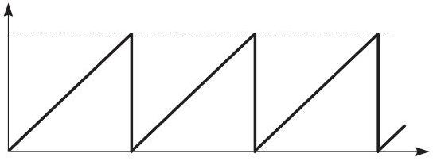
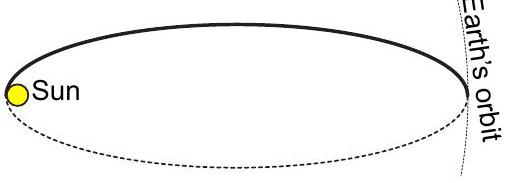

## 1. DC-DC converter

1) (1 pt) From the Kirchoff's voltage law for the loop consisting of $L$ and $\mathcal { E } , \mathcal { E } = L \frac { d I } { d t }$, hence $I = \mathcal { E } t / L$. From $I _ { 0 } = \mathcal { E } \tau _ { L } / L$ we obtain

$$
\tau _ { L } = L I _ { 0 } / \mathcal { E } .
$$

2) (1 pts) Once the current $I _ { 0 }$ is reached, the key is opened; the current trough $L$ cannot change instantaneously and therefore is forced to flow through the resistor $R$. Since the characteristic time of this current loop (consisting of $L$ and $R$ is very short $\left( L / R \ll \tau _ { K } \right)$, the current decays very fast and becomes essentially equal to zero while the key is still open. Now there is no current through the inductor, so that the key will close again and the process will start repeating from the beginning. As a result we'll have a periodic graph as shown in figure.

3) (1 pt) The voltage through the resistor is maximal when the current is maximal, which happens immediately after the switch is opened; the maximal current is $I _ { 0 }$ so that $V _ { \text {max } } = R I _ { 0 }$.
4) (2 pts) Due to $V _ { \max } \gg V _ { 0 }$, we can neglect the effect of the diode; so we have the Kirchoff's voltage law $L \frac { d I } { d t } = R I = R \frac { d q } { d t }$ (here we expressed the current via the charge $q$ which flows through the resistor). Integration over a single cycle (when the inductor current drops from $I _ { 0 }$ down to 0) yields $L I _ { 0 } = R \Delta q$, hence the charge flown through the resistor (and through the diode) $\Delta q = I _ { 0 } L / R$. During that cycle, the diode had a constant voltage $V _ { 0 }$, so the electric field performed work $A = V _ { 0 } \Delta q$ which was released as heat in the diode. So, the average power dissipation

$$
P = \frac { A } { \tau _ { L } } = \frac { V _ { 0 } I _ { 0 } L } { R \tau _ { L } } = \frac { V _ { 0 } \mathcal { E } } { R } .
$$

5) (2 pts) Now, since the characteristic time of the $R C$-loop is very large, the capacitor maintains its charge (and voltage) during that period of time when the diode is closed. Once the key $K _ { 1 }$ opens, the diode will open, and the capacitor is connected to the inductor so that a $L C$-loop is formed. That loop admits oscillations of period $T _ { L C } = 2 \pi \sqrt { L C }$ and as the current to the resistor can be neglected (since $R C \gg T _ { L C }$ ), we can neglect the presence of the resistor. During the time interval when the diode is open, we can also neglect the presence of the diode since $V _ { 0 } \ll V _ { \text {max } }$. Hence, the current $i$ in the $L C$-loop changes in time sinusoidally, starting from $i = I _ { 0 }$ and ending when $i = 0$ (then the diode will close disconnecting the $L C$-loop). During that process, the magnetic energy of the inductor $\frac { 1 } { 2 } L I _ { 0 } ^ { 2 }$ is converted into the electric field energy of the capacitor, which is later released as heat on the resistor. When the stationary regime is achieved, the energy lost by the capacitor during one period (of duration $\tau _ { L }$ ) as the heat dissipation on the resistor $Q = V _ { a v } ^ { 2 } \tau _ { L } / R$ must be equal to the energy received from the inductor; so,

$$
\frac { V _ { a v } ^ { 2 } \tau _ { L } } { R } = \frac { 1 } { 2 } L I _ { 0 } ^ { 2 } \Rightarrow V _ { a v } = I _ { 0 } \sqrt { \frac { L R } { 2 \tau _ { L } } } = \sqrt { \frac { \mathcal { E } I _ { 0 } R } { 2 } } .
$$

6) (1 pt) The charge which flows away from the capacitor when the diode is closed can be found as $q _ { C } = \tau _ { L } V _ { a v } / R$ (owing to $R C \gg \tau _ { L C }$, the relative change of the capacitor's voltage is small). Hence, the voltage drop is found as $\Delta V = q _ { C } / C = \tau _ { L } V _ { a v } / ( R C )$. The amplitude is half of the difference between the minimal and maximal values, so that the amplitude

$$
U _ { 0 } = \frac { \Delta V } { 2 } = \frac { \tau _ { L } V _ { a v } } { 2 R C } = \frac { I _ { 0 } L } { 2 C } \sqrt { \frac { I _ { 0 } } { 2 R \mathcal { E } } } .
$$

## 2. Waste project

1) The trajectory is a very elliptical ellipse, perihelion of which is within the Sun. In order to minimize the fuel consumption, the speed near the Earth's orbit needs to be as large as possible (we need to decelerate the ship to bring it to the elliptical orbit), hence the full orbital energy of the ship $E = - \frac { G M m } { 2 a }$ needs to be as small as possible. Here, $M$ is the mass of the Sun, $m$ - the mass of the space ship, and $a$ - the longer semiaxis. So, $a$ needs to be as large as possible, which means that the perihelion needs to lie at the surface of the Sun, in which case $2 a = R _ { E } + r _ { S }$, where $R _ { E }$ is the orbital radius of the Earth and $r _ { S }$ - the radius of the Sun. The resulting trajectory is depicted below.

2) If we neglect the radius of the Sun, the space ship needs to "fall" directly to the Sun, which means that its initial orbital speed must be zero, hence its trajectory is an ellips with longer semiaxis equal to $R _ { E } / 2$. According to the Kepler's III law, the period on such an orbit is $2 ^ { 3 / 2 }$ times shorter than the Earth's orbital period $T$. The travel time $t$ is half of the period, so that $t = 2 ^ { - 5 / 2 } T \approx 64.6$ days.
3) In the Sun's frame of reference, the speed needs to be zero; hence, in the Earth's frame of reference, it is opposite to the orbital velocity of the Earth and by modulus equal to $v _ { 0 } = 29.8 \mathrm {~km} / \mathrm { s }$.
4) The speed $v _ { S }$ in the Sun's frame of reference is found from the expression for the total energy, $- \frac { G M m } { 2 a } = - \frac { G M m } { R _ { E } + r _ { S } } = - \frac { G M m } { R _ { e } } + \frac { m v _ { S } ^ { 2 } } { 2 }$,
hence

$$
v _ { S } = \sqrt { \frac { G M } { R _ { E } } \frac { 2 r _ { S } } { R _ { E } + r _ { S } } } .
$$

This expressing can be rewritten by using equality $v _ { 0 } ^ { 2 } = \frac { G M } { R _ { E } }$ as

$$
v _ { S } = v _ { 0 } \sqrt { \frac { 2 r _ { S } } { R _ { E } + r _ { S } } } = v _ { 0 } \sqrt { 2 \sin \left( \frac { \alpha } { 2 } \right) } \approx v _ { 0 } \sqrt { \alpha } .
$$

Numerically this yields $v _ { S } \approx 2.8 \mathrm {~km} / \mathrm { s }$; the speed in the Earth's frame of reference $v _ { E } = v _ { 0 } - v _ { S } \approx$ 27.0 km/s.
5) Part of the initial kinetic energy in the Earth's frame of reference goes to the change of the potential energy due to the gravitational pull of the Earth, $\Delta \Pi = \frac { G M _ { E } m } { R } = g m R$ hence $g R + \frac { v _ { E } ^ { 2 } } { 2 } = \frac { u ^ { 2 } } { 2 }$. Here, $M _ { E }$ is the Earth's mass and $u$ is the launching speed. So,

$$
u = \sqrt { v _ { E } ^ { 2 } + 2 g R } \approx 29.2 \mathrm {~km} / \mathrm { s } .
$$

## 3. Magnets

There three forces acting on the hanging magnet: the downwards directed gravity force $m \vec { g }$, the tension force $\vec { T }$, which is directed along the thread, and the horizontal magnetic force $\vec { F } _ { \mathrm { m } }$. Since the thread's angle is very small, the modulus of $\vec { T }$ is almost equal to $m g$, so that its horizontal projection is expressed as $- ( x / l ) m g$, where $l$ is the length of the thread and $x = 1 \mathrm {~cm}$ (the displacement from the initial position). The net horizontal force $F = F _ { \mathrm { m } } - ( x / l ) m g$. At the equilibrium point $F = 0$. The equilibrium point is stable if a small (virtual) displacement $\Delta x$ gives rise to a returning force

$$
\Delta F = \Delta F _ { \mathrm { m } } - \frac { \Delta x } { l } m g
$$

which needs to push towards the equilibrium point. Let $F _ { \mathrm { m } } = k d ^ { - n }$, where $k$ is an unknown proportionality coefficient. Then

$$
\Delta F _ { \mathrm { m } } = F _ { \mathrm { m } } ^ { \prime } ( d ) \Delta d = \frac { k n } { d ^ { n + 1 } } \Delta x ,
$$

because $\Delta d = - \Delta x$. Therefore

$$
\Delta F = \left( \frac { k n } { d ^ { n + 1 } } - \frac { m g } { l } \right) \Delta x .
$$

At the limit case of the loss of stability (which is described by this problem) $\Delta F = 0$. Thus we have two equations with two unknowns ( $n$ and $k$ ):

$$
\frac { k } { d ^ { n } } - \frac { x m g } { l } = 0 , \quad \frac { k n } { d ^ { n + 1 } } - \frac { m g } { l } = 0 ;
$$

this can be rewritten as

$$
\frac { k } { d ^ { n } } = \frac { x m g } { l } , \quad \frac { k n } { d ^ { n + 1 } } = \frac { m g } { l } .
$$

If we divide the corresponding sides of the two equations we obtain $d / n = x$, hence

$$
n = d / x = 4 .
$$

## 4. Superballs

1) During the collision with the floor, the bottom-most ball will retain its speed and change the direction of the velocity; its upwards speed $v _ { 0 } = v$. Let the $k$-th ball move up with a velocity $v _ { k }$; we'll consider the collision between this and $( k + 1 )$-st ball, which moves down with the velocity $v$. In the frame of reference of the centre of mass, $u = \frac { v _ { k } - f v } { 1 + f }$; hence, after the collision the upwards velocity equals to $v _ { k + 1 } =$ $v + 2 \frac { v _ { k } - f v } { 1 + f } = \frac { 2 } { 1 + f } v _ { k } + \frac { 1 - f } { 1 + f } v$. With $v _ { 0 } = v$, we can conclude that $v _ { 1 } = \frac { 3 - f } { 1 + f } v = \left( \frac { 4 } { 1 + f } - 1 \right) v$. 2) One can see that if we apply the recurrent formula repetitively, the result at the $n$-th step will be $v _ { n } = \left( 2 \left( \frac { 2 } { 1 + f } \right) ^ { n } - 1 \right) v$.
2) Now we need to relate the speeds to the jumping heights via $v ^ { 2 } = 2 g h _ { 0 }$ and $v _ { n } ^ { 2 } = 2 g h _ { n }$; hence,

$$
h _ { n } / h _ { 0 } = \sqrt { v _ { n } / v _ { 0 } } = \sqrt { 2 \left( \frac { 2 } { 1 + f } \right) ^ { n } - 1 } .
$$

For $f = 0.5$ and $n = 10$ we obtain that the final height will be ca 1200 larger than the initial one.

## 5. Planck's constant

1) When we connect each of the diodes to the battery, we can observe the light of the emitted light; the mapping is as follows: 940 nm - invisible (infrared), 620 nm - red, 590 nm - orange, 525 nm - green; 470 nm - blue; 450 nm -violet.
2) We can measure the current $I$ through the diode (which is also the current through the resistor $R$ ), so that the voltage on the diode would

be $V _ { d } = \mathcal { E } - I R$, but we don't know the battery voltage. However, we do know that the diode's voltage equals approximately to the photon's energy $E _ { p }$ expressed in electron volts, $E _ { p } =$ $h c / ( \lambda e )$. Since we expect that $I R = \mathcal { E } - V _ { d }$, if we plot $I R$ versus $1 / \lambda$, we should obtain a straight line

$$
I R = \mathcal { E } - \frac { 1 } { \lambda } \frac { h c } { e } .
$$

We can measure the slope of the straight line $A = h c / e$, which allows us to calculate $h =$ $e A / c$.
3) The major source of the uncertainty is not the instrument uncertainties, but the departure of the real diode data from the simplistic model. Therefore we can try to fit the data points with different straight lines making the slope $A$ as steep as possible (while still keeping a reasonable fit with the data points, and also as flat as possible; the uncertainty of $A$ is found as $\Delta A = \frac { 1 } { 2 } \left( A _ { \text {max } } - A _ { \text {min } } \right)$, and $\Delta h = h \Delta A / A$.

## 6. Running on ice

1) During the process, the velocity vector needs to change its direction by 90 degrees. Let us consider the this graphically using the $v _ { x } - v _ { y } -$ plane: we need to move from the point $A$ with coordinates $( 0 , v )$ to a point $B$ with coordinates $( v , 0 )$ while having a constant "speed". Indeed, the velocity of a point in the $v _ { x } - v _ { y }$-plane is the acceleration of the body, which has here a constant modulus $\mu g$. Obviously, the fastest path is a straight line of length $v \sqrt { 2 }$, so that $t = v \sqrt { 2 } / \mu g \approx 7.2 \mathrm {~s}$.
2) Since the direction of the acceleration is constant, the trajectory is the same as for a body in the Earth's field of gravity - a parabola.

## 7. Spin system

1) According to Boltzmann's distribution, $p _ { \uparrow } =$ $A \cdot e ^ { - \epsilon m }$, where the constant $A$ can be found from the condition that the probability of having either up or down orientation is one: $A$. $e ^ { - \epsilon / 2 } + A \cdot e ^ { \epsilon / 2 } = 1$, hence

$$
A = \frac { 1 } { e ^ { - \epsilon / 2 k T } + e ^ { \epsilon / 2 k T } } = \frac { 1 } { 2 \cosh ( \epsilon / 2 k T ) } .
$$

Thus,

$$
p _ { \uparrow } = \frac { e ^ { - \epsilon / 2 k T } } { e ^ { - \epsilon / 2 k T } + e ^ { \epsilon / 2 k T } } .
$$

2) The average energy is the weighted average of up- and down-state energies for a single spin, multiplied by the number of spins:

$$
E = \frac { N \epsilon } { 2 } \frac { e ^ { - \epsilon / 2 k T } - e ^ { \epsilon / 2 k T } } { e ^ { - \epsilon / 2 k T } + e ^ { \epsilon / 2 k T } } = - \frac { N \epsilon } { 2 } \tanh ( \epsilon / 2 k T ) .
$$

3) For small values of the argument of the hyperbolic tangent, the last expression can be approximated as $E \approx - N \epsilon ^ { 2 } / 4 k T$.
4) According to the definition of the heat capacity, $C = \frac { d E } { d T } = N \epsilon ^ { 2 } / 4 k T ^ { 2 }$.

## 8. Mirror interference

1) For a position $y$, the arriving rays form an angle $\alpha = y / L$ (we use the small-angle approximation; the angle is in radians). Then, the optical path difference between the reflected and direct rays is $\Delta = 2 l \cos \alpha \approx 2 N \lambda - N \lambda \alpha ^ { 2 }$. Since there is an additional phase shift for the reflected rays at the reflection from optically denser dielectric material, the total phase shift is $\varphi = 2 \pi \Delta / \lambda = 4 \pi N - \pi \left( 2 N \alpha ^ { 2 } - 1 \right)$. At the maxima, this equals to $2 \pi ( 2 N - n )$, where $n$ is an integer. Therefore, the condition for the maxima is written as

$$
\alpha = \sqrt { \frac { n + 0.5 } { N } } \Rightarrow y _ { n } = L \sqrt { \frac { n + 0.5 } { N } } ,
$$

where $n = 0,1 , \ldots \ll N$.
2) Since the rays of a given order number $n$ form a fixed angle with the $x$-axis, the maxima form on the screen concentric circles; the pitch between the neighbouring circles becomes smaller as the order number $n$ grows (using the length unit defined by the smallest radius, the radii form a sequence $\sqrt { 1 } = 1 , \sqrt { 3 } \approx 1.73$, $\sqrt { 5 } \approx 2.23$, etc).
3) Since the reflected rays can reach the screen only within a hemisphere, the phase shift varies between $\varphi _ { \text {max } } = 4 \pi N + \pi$ and $\varphi _ { \text {min } } = \pi$. The number of maxima

$$
m = \left( \varphi _ { \max } - \varphi _ { \min } \right) / 2 \pi = 2 N .
$$

## 9. Thermal acceleration

1) For the heat energy of one mole of material $d q = C _ { v } d T$. There is no heat energy by $T = 0$, hence $q = \int _ { 0 } ^ { T } C _ { v } d T$. Using the graph we find this as the area under the curve, $q \approx R \cdot 560 \mathrm {~J} / \mathrm { K }$. The number of moles $\nu = a ^ { 3 } \rho / M _ { A } \approx 0.117 \mathrm {~mol}$, hence the total heat energy $Q = q \nu \approx 546 \mathrm {~J}$.
2) Each photon of frequency $\nu$ radiated by the cube carries away heat energy equal to $E = h \nu$, and carries momentum $p = h / \lambda = h \nu / c = E / c$. If the photon departs at the angle $\alpha$ with respect to the surface normal then the component parallel to the surface normal $p _ { \| } = \frac { E } { c } \cos \alpha$. The total momentum given by the photons to the cube equals by modulus to the total momentum carried by the photons; when averaged over all the photons, the perpendicular to the surface normal components cancel out (photons go to all the directions). The average value of the parallel component can be estimated just as $p _ { \| } \sim \frac { E } { c }$.

If we want to obtain an exact result, we need to integrate over all the directions while keeping in mind that the light intensity is proportional to $\cos \alpha$. So, the momentum averaged over all the directions $\bar { p } _ { \| } = \frac { E } { c } \frac { 1 } { 2 \pi } \int \cos ^ { 2 } \alpha d \Omega$, where the solid angle differential $d \Omega = 2 \pi \sin \alpha d \alpha$. Therefore, $\bar { p } _ { \| } =$ $\frac { E } { c } \int _ { 0 } ^ { \pi / 2 } \sin \alpha \cos ^ { 2 } \alpha d \alpha = \frac { E } { c } \int _ { 0 } ^ { \pi / 2 } \cos ^ { 2 } \alpha d \cos \alpha = \frac { E } { 3 c }$.
Since the momentum-energy ratio is the same for all the photons, equal to $1 / c$, the overall momentum equals to $Q / c$. Thus, $a ^ { 3 } \rho v \sim Q / c$, hence

$$
v \sim \frac { Q } { \rho a ^ { 3 } c } \approx 0.67 \mathrm {~mm} / \mathrm { s } .
$$

If we apply the exact factor $\frac { 1 } { 3 }$ (obtained above via integration), we end up with $v \approx 0.22 \mathrm {~mm} / \mathrm { s }$. 3) The heat balance at very low temperatures can be written as $A T ^ { 3 } d T = - \sigma S T ^ { 4 } d t$, where $A$ is a constant, $\sigma$ is the Stefan-Boltzmann constant, and $S$ - the radiating area. This simplifies to

$$
\frac { d T } { T } = - B t \Rightarrow T = A \cdot e ^ { - B t } .
$$

4) In the case of a hydrogen atmosphere, the momentum is given to the cube due to the fact that the molecules colliding with the coated faces bounce back with the same speed as the they came, but uncoated face gives away heat energy, and the molecules leave at higher temperature. If we assume that the departing molecules have the same temperature as the cube (which serves us only as an estimate - when particles of different masses collide, only a part of the energy is transferred), then the momentum-to-heat ratio is estimated as $1 / v _ { T }$, where $v _ { T } = \sqrt { R T / M _ { H } }$ is the thermal speed of the molecules after the collision with the cube for the motion along the surface normal. So we estimate $a ^ { 3 } \rho v \sim Q / v _ { T }$, hence

$$
v \sim \frac { Q } { \rho a ^ { 3 } } \sqrt { \frac { M _ { H } } { R T } } \approx 180 \mathrm {~m} / \mathrm { s } .
$$

It should be noted that in fact, one should have been careful with such an estimate, because the thermal speed is at the denominator. This will increase the relative contribution of the heat radiated at low temperatures. However, the remaining heat at low temperatures is proportional to $T ^ { 4 }$, and therefore the contribution of those molecules which collide with the cube at low temperatures to the overall momentum remains still small.

## 10. Young's modulus of rubber

1) The setup is as follows. The rubber thread is fixed to the stand, and the plastic bag is fixed to the free end of the thread. The hex nuts are added, one-by-one, into the bag, starting with zero and ending with 15. The laser light is directed to the thread and the diffraction pattern is observed on the screen (which is a vertically fixed sheet of graphic paper on a support). The diffraction pattern from a wire is the same as from a single slit (the superposition of the Huygens sources from those two cases gives a full set of sources on a flat wave front, hence the electric fields from those two cases must provide equal and opposite wave amplitudes and equal intensities). So, if we measure on the screen the distance $a$ between such maxima which are separated by $n ($ e.g. $n = 10 )$ periods of the diffraction pattern then using small-angle-approximation, $n \lambda / d = a / L$, where $L$ is the distance from the thread to the screen and $d$ - the thread diameter. So,

$$
d = n L \lambda / a .
$$

The strain is calculated by making markings on the thread and measuring the distance $b$ between these in a stretched state,

$$
\varepsilon = \frac { b - b _ { 0 } } { b _ { 0 } } ,
$$

where $b _ { 0 }$ is the length in a non-strained state. The stress is calculated as

$$
\sigma = \frac { 4 N m g } { \pi d _ { c } ^ { 2 } } ,
$$

where $N$ is the number of hex nuts in the bag and $m$ - the mass of a single nut. The data are plotted in a graph; linear relationship corresponds to a straight line. The uncertainties are calculated using the rule of relative uncertainties, either using Pythagorean or simple addition, e.g.

$$
\Delta \varepsilon = \varepsilon \Delta b \left( \frac { 2 } { b - b _ { 0 } } + \frac { 1 } { b _ { 0 } } \right) ,
$$

where $\Delta b \approx 0.5 \mathrm {~mm}$ is the length measurement uncertainty. Similarly,

$$
\Delta \sigma = 2 \sigma \frac { \Delta d } { d } .
$$

These uncertainties are marked in the graph as error bars.
2) Using the plot, we need to determine such a value of $\varepsilon = \varepsilon _ { * }$ that for $\varepsilon _ { 1 } > \varepsilon _ { * }$, it is impossible to draw a straight line intersecting the error bars of all the data points with $\varepsilon _ { 1 } < \varepsilon _ { * }$.
