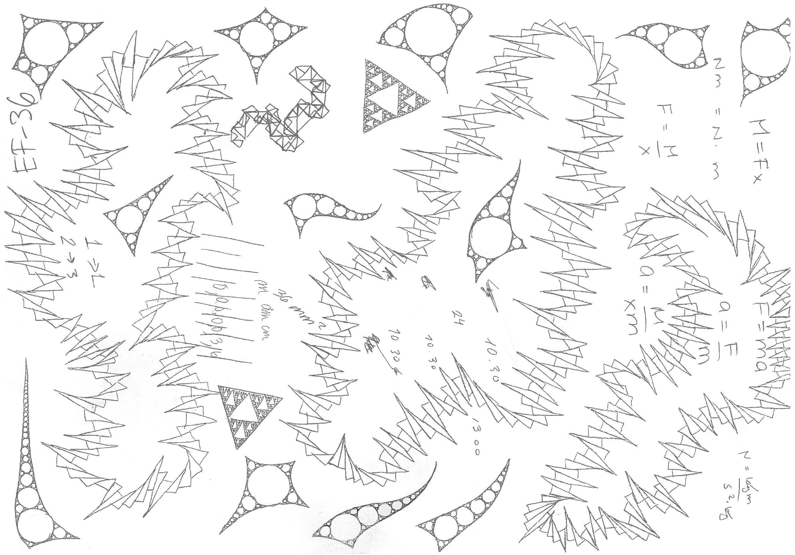
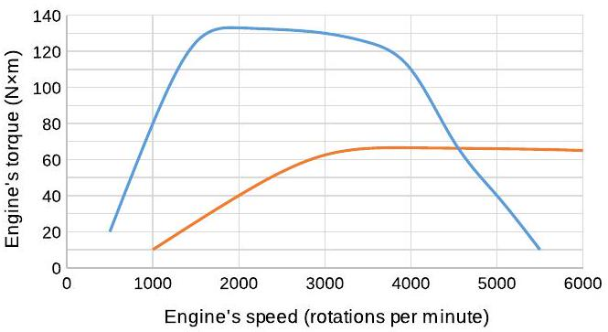
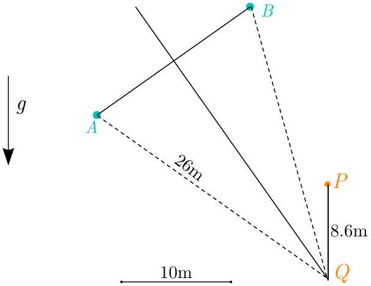

## Estonian-Finnish Olympiad 2015 Solutions

## 1. ANNIHILATION

i) Electron's total energy $E = \gamma m _ { e } c ^ { 2 } \Longrightarrow$ $\gamma = \frac { E } { m _ { e } c ^ { 2 } }$, where $E = T + m _ { e } c ^ { 2 }$ (here, $T =$ 1 MeV is the given kinetic energy). Now, $\gamma = 1 / \sqrt { 1 - v _ { e } ^ { 2 } / c ^ { 2 } } \Longrightarrow v _ { e } = c \sqrt { 1 - 1 / \gamma ^ { 2 } } =$ $c \sqrt { 1 - m _ { e } ^ { 2 } c ^ { 4 } / E ^ { 2 } } = \frac { c \sqrt { T ^ { 2 } + 2 T m _ { e } c ^ { 2 } } } { T + m _ { e } c ^ { 2 } }$. Numerically, $v _ { e } \approx 0.941 c$.
ii) The photons fly away symmetrically with respect to the electron's trajectory: in the zero-total-momentum frame, momentum conservation implies that the photons have equal momenta and, thus, equal energies, and fly in exactly opposite directions; their energies can be equal also in the positron's frame only if they are flying totally symmetrically. Each photon gets a half of the total energy in the system: $E _ { \gamma } = \frac { 1 } { 2 } \left( T + 2 m _ { e } c ^ { 2 } \right) \approx$ 1.01MeV.
iii) $E _ { \gamma } = p _ { \gamma } c \Longrightarrow p _ { \gamma } = E _ { \gamma } / c = 1.01 \mathrm { MeV } / c$.
iv) From $E = p _ { e } ^ { 2 } c ^ { 2 } + m _ { e } ^ { 2 } c ^ { 4 }$, the electron's momentum is $p _ { e } = \sqrt { \frac { E ^ { 2 } } { c ^ { 2 } } - m _ { e } ^ { 2 } c ^ { 2 } } =$ $\frac { 1 } { c } \sqrt { T ^ { 2 } + 2 T m _ { e } c ^ { 2 } }$. (Equivalent result can be derived from $p _ { e } = \gamma m _ { e } v _ { e }$.) Momentum conservation in the $z$-direction then implies that $p _ { e } = 2 p _ { \gamma } \cos \alpha \Longrightarrow \alpha = \arccos \frac { p _ { e } } { 2 p _ { \gamma } } =$ $\arccos \frac { 1 } { \sqrt { 1 + 2 m _ { e } c ^ { 2 } / T } } = \arctan \sqrt { \frac { 2 m _ { e } c ^ { 2 } } { T } } \approx 45.3 ^ { \circ }$.
v) In the center-of-mass frame, the total momentum of any system is zero. This means that if the outcome of a collision is only a single particle, then the particle's momentum must be zero in the center-of-mass frame. However, a photon's momentum can never be zero, because otherwise it would have zero energy and an infinite wavelength.

## 2. HOLOGRAPHIC LENS

i) Let $N = 0,1 , \ldots$ number the zones (both opaque and transparent). The optical path difference between two neighbouring zones must be $\lambda / 2$ (opposite phase is demanded). The path difference between the $N ^ { \text {th } }$ zone and the $0 ^ { \text {th } }$ zone, on the other hand, is $\Delta _ { N } =$ $\sqrt { r _ { N } ^ { 2 } + f ^ { 2 } } - f$. Therefore, $\frac { N \lambda } { 2 } = \sqrt { r _ { N } ^ { 2 } + f ^ { 2 } } -$ $f$ and $r _ { N } = \sqrt { \left( \frac { N \lambda } { 2 } \right) ^ { 2 } + N \lambda f }$. Only oddnumbered zones are transparent, thus we need $r _ { 2 m + 1 } = \sqrt { \left( m + \frac { 1 } { 2 } \right) ^ { 2 } \lambda ^ { 2 } + ( 2 m + 1 ) \lambda f }$.
ii) A perfectly focussing glass lens is such that all the possible light rays that go to the focus have an equal optical path length. The optical path length inside a refracting medium is $n$ times longer than the corresponding geometric length (the phase velocity is slowed down by a factor of $n$ ). Denote the sought-after thickness by $x$. Equate the optical path lengths of a ray through the edge of the lens and of a ray through its centre: $\sqrt { \left( \frac { d } { 2 } \right) ^ { 2 } + f ^ { 2 } } = f - x + n x \Longrightarrow x =$ $\frac { 1 } { n - 1 } \left[ \sqrt { \left( \frac { d } { 2 } \right) ^ { 2 } + f ^ { 2 } } - f \right] \approx 2.4 \mathrm {~cm}$.
iii) Firstly, note that the given pulse is short enough that the whole lens never illuminates the focus - the pulse is only $\frac { \tau c } { \lambda } = 18$ periods long, but $r _ { 2 \times 18 } \approx 1.3 \mathrm {~mm} \ll 5 \mathrm {~cm}$. This implies that only a thin strip of the lens is illuminating the focus at a time. The intensity, when the $N ^ { \text {th } }$ period is being observed, is proportional to the area of the $N ^ { \text {th } }$ zone. This is $A _ { N } = \pi \left( r _ { N + 1 } ^ { 2 } - r _ { N } ^ { 2 } \right) = \pi \left( \frac { N \lambda ^ { 2 } } { 2 } + \frac { \lambda ^ { 2 } } { 4 } + \lambda f \right)$.

As $N$ is proportional to time (the period of the wave is constant), the intensity will also grow linearly in time. The linear part starts at $N = 1$ with a jump and ends at $N _ { \max } \frac { \lambda } { 2 } = \sqrt { \left( \frac { d } { 2 } \right) ^ { 2 } + f ^ { 2 } } - f$ with a jump back into darkness, when the light from the edge of the lens arrives. The total duration of illumination is (approximately) $\tau _ { \text {hol } } = N _ { \text {max } } \frac { \lambda } { c } =$ $\frac { 2 } { c } \left[ \sqrt { \left( \frac { d } { 2 } \right) ^ { 2 } + f ^ { 2 } } - f \right] \approx 7.9 \times 10 ^ { - 9 } \mathrm {~s}$.
iv) The pulse is localized into a region of space with a width $\Delta x = c \tau$. Because of the Heisenberg's uncertainty principle, the pulse is composed of photons with a range of momenta (if we take the picture that the properties of the individual photons are classical) or, from a different viewpoint, is a single photon with a somewhat uncertain momentum; either way, the characteristic width in the momentum space is $\Delta p = \frac { \hbar } { \Delta x } = \frac { \hbar } { c \tau }$. The wavelength of a photon, whose momentum $p$ is known, is $\lambda = \frac { h } { p }$ (this is the de Broglie relation: the photon's energy is $p c$ and also $\left. h v = \frac { h c } { \lambda } \right)$. Thus, $\Delta \lambda \approx \left| \frac { \mathrm { d } } { \mathrm { d } p } \frac { h } { p } \right| \Delta p = \frac { h \Delta p } { p ^ { 2 } } =$ $\frac { h \frac { \hbar } { c \tau } } { \left( \frac { h } { \lambda } \right) ^ { 2 } } = \frac { \lambda ^ { 2 } } { 2 \pi c \tau } \approx 4.4 \times 10 ^ { - 9 } \mathrm {~m}$.
v) The spread of the arrival times of waves with different wavelengths is the largest for the waves that spend the longest time inside the lens. Therefore it is enough to consider only the waves that go through the thickest part of the lens - its centre. The spread in the arrival times is $\Delta t = \Delta \frac { x } { v _ { g } } =$ $\frac { x \Delta v _ { g } } { v _ { g } ^ { 2 } } = \frac { x \Delta \lambda } { v _ { g } ^ { 2 } } \frac { \mathrm {~d} v _ { g } } { \mathrm {~d} \lambda }$. To find the group velocity $v _ { g }$ itself, we can use the hint (given during the examination) that in this question we may assume the group velocity and the phase velocity to be equal (in reality it would be an unusual coincidence): $v _ { g } = v _ { p }$ and the phase velocity $v _ { p } = c / n$. Therefore, $\Delta t =$ $\frac { x \Delta \lambda } { v _ { g } ^ { 2 } } \times 0.02 \frac { v _ { g } } { \lambda } = 0.02 \frac { x n \Delta \lambda } { c \lambda } \approx 2.1 \times 10 ^ { - 14 } \mathrm {~s}$. The total observed pulse length behind the glass lens is $\tau _ { \mathrm { gl } } = \tau + \Delta t = 5.1 \times 10 ^ { - 14 } \mathrm {~s}$.

## 3. GEAR SHIFT

i) The acceleration of the car is proportional to the torque applied to the wheels. Therefore we should keep the torque onto the wheels as big as possible, and shift gears when the torque applied onto the wheels in the second gear is bigger than the one obtained in the first gear. At the same car's speed, the engine's speed is $( 14 : 1 ) : ( 7 : 1 ) = 2$ times bigger in the first gear than in the second gear. Correspondingly, at the same engine's speed, the torque onto the wheels is two times smaller in the second gear than in the first gear. Therefore we can draw another graph where the engine's torque is twice as small and the engine's speed is two times bigger. The intersection of those graphs is the point where the gear should be changed.

From the graph we read that at that moment in the first gear, the engine's torque is $\tau _ { e } = 66.5 \mathrm {~N} \cdot \mathrm {~m}$ and the engine's speed is $\omega _ { e } =$ 4550 rpm . The wheels' angular speed is then $\omega _ { w } = \frac { 1 } { 14 } \omega _ { e }$ and the car's speed is $v = \frac { 1 } { 2 } \omega _ { w } d =$ $\frac { 1 } { 28 } \omega _ { e } d$. Let's convert $1 \mathrm { rpm } = 120 \pi \mathrm { rad } / \mathrm { h }$ and $d = 6 \times 10 ^ { - 4 } \mathrm {~km}$. Thus, $v \approx 37 \mathrm {~km} / \mathrm { h }$.
ii) At the optimum point, the acceleration before and after gear change is the same. From Newton's second law, it equals $a = F / m = \frac { 2 \tau _ { w } } { m d }$, where the net torque applied to the wheels is $\tau _ { w } = 14 \tau _ { e }$. Hence, $a = \frac { 28 \tau _ { e } } { m d } \approx 2.2 \mathrm {~m} / \mathrm { s } ^ { 2 }$.

## 4. STAR WARS

i) The period of a Keplerian orbit having major semi-axis $a$ can be expressed using relation $T ^ { 2 } = \frac { 4 \pi ^ { 2 } a ^ { 3 } } { G M }$. However, if we didn't know the formula, we should recall Kepler's 3rd law $T ^ { 2 } \sim a ^ { 3 }$ and simply express the period for a circular orbit with $a = r$. Therefore, $T ^ { 2 } = \frac { 4 \pi ^ { 2 } r ^ { 2 } } { v ^ { 2 } }$, were we need to insert $v$ from $\frac { v ^ { 2 } } { r } = \frac { G M } { r ^ { 2 } }$.

For finding the period, we can get the major semi-axis from the expression for orbit's

total energy $- \frac { G M m } { 2 a } = \frac { m v ^ { 2 } } { 2 } - \frac { G M m } { R }$, equivalently $a = \frac { G M } { 2 \frac { G M } { R } - v ^ { 2 } } = \frac { 1 } { \frac { 2 } { R } - \frac { v ^ { 2 } } { G M } }$. Finally $T = \frac { 2 \pi a ^ { 3 / 2 } } { \sqrt { G M } }$.
ii) According to the properties of an ellipse, the distances $l _ { 1 }$ and $l _ { 2 }$ drawn from any point on the ellipse to its two foci add up to constant value $l _ { 1 } + l _ { 2 } = 2 a$. Since $l _ { 1 } = R$, the other focus must be at distance $l _ { 2 } = 2 a - R$, so the other focus $F$ lies on a circle with radius $| P F | = l _ { 2 } = 2 a - R$ around $P$.
iii) This is the previous part in reverse. Since we have distance to one focus given $| Q S | = r$, we can express the distance to the other focus $| Q F | = 2 a - r$.
iv) The points $\mathrm { P } , \mathrm { Q }$, and F form a triangle, for which we have expressed two of its side lengths: $| P F |$ and $| Q F |$. The third side QP must satisfy $| Q P | \leq | P F | + | Q F |$. The $| Q P | _ { \text {max } }$ is obtained for a degenerated triangle (all the three points lying along a common line). Therefore, $| Q P | _ { \text {max } } = 4 a - R - r$.
v) It turns out that for all the maximal distance points $Q$ the sum of $| S Q | + | P Q |$ is constant and equal to $4 a - R$. That means it also defines an ellipse with focal points $S$ and $P$ and major semi-axis $2 a - R / 2$. This ellipse is the area that we can hit.

## 5. RADIATOR

We wind the wire around one end of the aluminium profile and supply current to it for heating. In most cases it was OK to supply up to 5A (the maximum possible) through the wire, only when it was wound very compact it could get too hot. This should give us good $100 ^ { \circ } \mathrm { C }$ to measure on the profile, but the experiment also worked if smaller currents/temperatures were used. Now we wait until the temperature in the profile stabilises, this takes about five to ten minutes and we can check if it has stabilised with the thermometer.

When the temperature has stabilised we measure and write down the temperature values along the part of the profile that is not covered with wire using a reasonable distance interval. We can see that that the other end of the profile is still at room temperature (the difference is below or near the resolution of this thermometer). This means that in the given solution for Helmholtz equation,

$$
T ( x ) = T _ { 0 } + C _ { 1 } e ^ { x \sqrt { \frac { h } { k A } } } + C _ { 2 } e ^ { - x \sqrt { \frac { h } { k A } } } ,
$$

the integration constant $C _ { 1 } = 0$.
Now one way is to use $T ( 0 )$ to express $C _ { 2 } = T ( 0 ) - T _ { 0 }$ and use any other temperature measurement to calculate $h$. A better way is to plot the temperature difference in a logarithmic scale: $\log \left( T ( x ) - T _ { 0 } \right) = - \sqrt { \frac { h } { k A } } x + C _ { 2 }$, and use the slope of the graph $a = - \sqrt { \frac { h } { k A } }$ to calculate $h$. This gives a more accurate value for $h$ and allows us to better estimate the uncertainty by finding the range of slopes that can reasonably be drawn on the graph.

The correct answer is in the range $h =$ $0.3 \mathrm {~W} / \mathrm { K } \cdot \mathrm { m }$ to $h = 0.5 \mathrm {~W} / \mathrm { K } \cdot \mathrm { m }$, it depends slightly on how the profile is placed on the table. The heat transfer coefficient is higher when the profile is on the edge of the table or slightly raised due to the wiring.

## 6. two balls

Let us consider the process in a freefalling frame of reference; them the both balls will move with constant velocities. The speeds are equal, but directions different; hence, for any moment of time, they are at equal distance from the throwing point $Q$. Thus, point $Q$ can be found as the intersection point of the perpendicular bisector to the segment $A B$ (connecting the balls), and the vertical line drawn from the point $P$.

In the lab frame, the point $Q$, however, is a free-falling point, and by time $t$ has travelled distance $| P Q | = g t ^ { 2 } / 2$. Using the provided scale we find from the figure that $| P Q | \approx 8.6 \mathrm {~m}$, hence $t = \sqrt { 2 | P Q | / g } \approx 1.3 \mathrm {~s}$. Hence, the throwing speed $v = | A Q | / t \approx$ $20 \mathrm {~m} / \mathrm { s }$; here we have used reading from the figure, $| A Q | \approx 26 \mathrm {~m}$.

## 7. BOUNCY BALL

i) Energy is conserved: $\frac { m v ^ { 2 } } { 2 } + \frac { I \omega ^ { 2 } } { 2 } = \frac { m v ^ { 2 } } { 2 } +$ $\frac { I \omega _ { 2 } ^ { 2 } } { 2 } \Longrightarrow \left| \omega _ { 2 } \right| = | \omega |$. As the ball receives some angular momentum from the wall (the net force from the wall is not directed through the ball's centre), the angular velocity changes its sign - the rotation flips its direction and $\omega _ { 2 } = - \omega$.
ii) The angular momentum is conserved with respect to the contact point, because all the forces are directed through the point. Let $a =$ $R \cos \alpha$ be the distance from the trajectory of the center of mass to the contact point. Then the aforementioned angular momentum conservation reads $I \omega - m a v = I \omega _ { 2 } + m a v$. As $\omega _ { 2 } = - \omega$, this gives $\omega = \frac { m a v } { I } = \frac { 5 v \cos \alpha } { 2 R }$.
iii) At the verge of slipping on a surface, the angle between the surface normal and the resultant of the reaction force and the frtiction force equals $\arctan \mu$. Here this angle is $\frac { \pi } { 2 } - \alpha$, thence $\mu \geq \cot \alpha$.

## 8. ELECTRIC FIELD

i) By the Biot-Savart law, every piece of the ring with length and direction $\mathrm { d } \vec { l }$ creates a magnetic field $\mathrm { d } \vec { B } = \frac { \mu _ { 0 } I \mathrm { I } \overrightarrow { \mathrm { l } } \times \hat { a } } { 4 \pi a ^ { 2 } }$, where $\vec { a }$ is the displacement vector from the piece to the point where we are calculating $\vec { B }$, and $\hat { a } = \vec { a } / a$. By symmetry, the magnetic field on the $z$-axis adds up to being exactly along the $z$-axis, because the perpendicular components cancel out. $\mathrm { d } B _ { z }$ is proportional to $\mathrm { d } l$ and $\mathrm { d } \vec { l } \perp \hat { a }$. The vector $\mathrm { d } \vec { l } \times \hat { a }$ is at an angle $\alpha = \arctan \frac { r } { z }$ from the horizontal. Therefore we can add up the contributions and write $B ( z ) = \frac { \mu _ { 0 } I \times 2 \pi R \sin \alpha } { 4 \pi \left( z ^ { 2 } + R ^ { 2 } \right) } = \frac { \mu _ { 0 } I R ^ { 2 } } { 2 \left( z ^ { 2 } + R ^ { 2 } \right) ^ { 3 / 2 } }$. The field is along the $z$-axis.
ii) The electric field measured by a charged observer must be in the same direction as the Lorentz force acting on the observer in the laboratory frame of reference. Therefore the electric fieldlines are circles around the $z$ axis. Now we may apply Faraday's induction law to such a circle, as it approaches the ring: the total electromotive force $E ( z , r ) \times 2 \pi r =$ $\dot { \Phi } = - \frac { \mathrm { d } \Phi } { \mathrm { d } z } v \approx - \frac { \mathrm { d } } { \mathrm { d } z } B ( z ) \times \pi r ^ { 2 } \times v \Longrightarrow E ( z , r ) =$ $- \frac { r v } { 2 } B ^ { \prime } ( z ) = \frac { 3 \mu _ { 0 } I r R ^ { 2 } v z } { 4 \left( z ^ { 2 } + R ^ { 2 } \right) ^ { 5 / 2 } }$.

## 9. SOLENOIDS

i) The overlapping region has magnetic field $2 B$, rest of the coils' insides has $B$. Let the inner coil have an area of $A _ { 2 }$. Energy density, where the magnetic field is $B$, is $\frac { B ^ { 2 } } { 2 \mu _ { 0 } }$. Therefore $E _ { m } = \frac { B ^ { 2 } } { 2 \mu _ { 0 } } \left( A _ { 1 } l - A _ { 2 } ( l - x ) + \right.$ $\left. A _ { 2 } x \right) + \frac { ( 2 B ) ^ { 2 } } { 2 \mu _ { 0 } } A _ { 2 } ( l - x ) = \frac { B ^ { 2 } } { 2 \mu _ { 0 } } \left[ A _ { 1 } l + A _ { 2 } ( 3 l - 2 x ) \right] =$ $\frac { \mu _ { 0 } I ^ { 2 } N ^ { 2 } } { 2 l ^ { 2 } } \left[ A _ { 1 } l + A _ { 2 } ( 3 l - 2 x ) \right]$.
ii) The outer coil is intersected by all the internal coil's magnetic flux $B A _ { 2 }$. After time $d t$ this flux is enclosed by fewer turns of the outer coil - by the $N v d t / l$ turns that are on the length $v d t$. Thus the flux enclosed by the outer coil changes with a rate $\mathscr { E } _ { 1 } = \dot { \Phi } _ { 1 } = B A _ { 2 } N v / l = \mu _ { 0 } A _ { 2 } I N ^ { 2 } v / l ^ { 2 }$. The inner coil is also intersected by the flux $B A _ { 2 }$, thus $\mathscr { E } _ { 2 } = \mathscr { E } _ { 1 }$; those electromotive forces are in the same direction.
iii) The work done when pulling a coil out is balanced in two places: the magnetic field

energy decreases and our constant current source dissipates some energy (because our electomotive forces work against it). In total, the applied mechanical power $F v = \frac { \mathrm { d } E _ { m } } { \mathrm {~d} x } v +$ $I \left( \mathscr { E } _ { 1 } + \mathscr { E } _ { 2 } \right)$, from where $F = - \frac { B ^ { 2 } A _ { 2 } } { \mu _ { 0 } } + \frac { 2 I B A _ { 2 } N } { l } =$ $\frac { \mu _ { 0 } I ^ { 2 } N ^ { 2 } A _ { 2 } } { l ^ { 2 } }$.

## 10. VAPOUR PRESSURE

We construct a manometer by fixing the pipe into a "U" shape using the stand, and filling the tube partially with water. With a small trouble we should get the water to the bottom of "U" shape and then we can measure the pressure difference from differences of depth $\Delta p = \rho g \Delta h$. After we attach a bottle to one end, we should let the pressures equalise through a needle hole in the bottle. We then squirt the unknown liquid to the bottle and close the needle hole with tape as fast as possible. We then shake the bottle to hasten the vaporisation and write down the difference of depths $\Delta h$ after it has reached a stable value. During all this we should be careful to heat the bottle with our body as little as possible.

If the volume would have been fixed we would get the vapour pressure directly from the manometer reading as according to Dalton's law. But since the diameter of the pipe was not that small we should take the relative volume increase to account.

If the depth difference is $\Delta h$, we have a relative increase of pressure $n _ { p } = \frac { \rho g \Delta h } { p _ { 0 } }$ and a relative increase of volume $n _ { V } = \frac { S \Delta h } { 2 V _ { 0 } }$. Assuming an ideal gas, this gives us relative molar increase $n _ { n } = \frac { \left( 1 + n _ { p } \right) \left( 1 + n _ { V } \right) p _ { 0 } V _ { 0 } - p _ { 0 } V _ { 0 } } { p _ { 0 } V _ { 0 } } \approx$ $n _ { p } + n _ { V }$. Substituting in the given values we get $n _ { n } \approx 0.0987 \mathrm {~m} ^ { - 1 } \times h + 0.00471 \mathrm {~m} ^ { - 1 } \times h \approx$ $0.1034 \mathrm {~m} ^ { - 1 } \times h$.

Since all the molar increase is due to the vapour, we can get the vapour pressure (partial pressure exerted by vapour) by multiplying the pressure with the molar fraction of vapour $p _ { x } = \left( p _ { 0 } + \Delta p \right) \frac { n _ { n } } { 1 + n _ { n } }$.

The unknown liquid was ethanol with vapour pressure of $p _ { x } = 6.52 \mathrm { kPa }$ at $21.6 ^ { \circ } \mathrm { C }$. However, the grading scheme was not insistent on the exact value as it proved technically quite difficult to get it correct.
