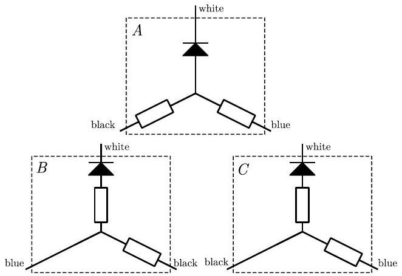
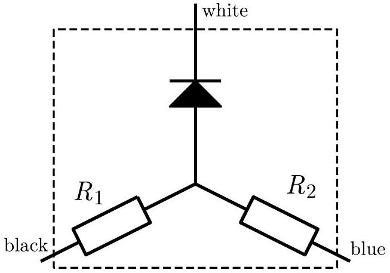
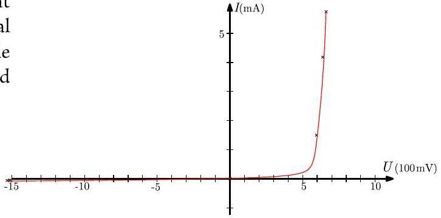

## 10. Black box

i) There are a few ways to get an initial idea, what could be in the black box. One way is to put the ammeter in series with the voltage source and measure the current through each combination.

$$
\begin{gathered}
U _ { \text {bat } } = 1581 \pm 14 \mathrm { mV } \\
I _ { \text {black } \rightarrow \text { white } } = 4.33 \pm 0.09 \mathrm {~mA} \\
I _ { \text {black } \rightarrow \text { blue } } = 2.21 \pm 0.07 \mathrm {~mA} \\
I _ { \text {blue } \text { → white } } = 1.80 \pm 0.06 \mathrm {~mA} \\
I _ { \text {blue } \rightarrow \text { black } } = 2.20 \pm 0.07 \mathrm {~mA} \\
I _ { \text {white } \rightarrow \text { blue } } = 90.9 \pm 2.8 \mu \mathrm {~A} \\
I _ { \text {white } \rightarrow \text { black } } = 81.2 \pm 2.8 \mu \mathrm {~A}
\end{gathered}
$$

We can see that the other terminals are connected to white through the diode. That leaves us three options.

We can deduce the correct schematics of the black box from these measurements, but there are more straightforward ways to test these options. One is to measure the voltage $U _ { 1 }$ between "black" and "blue", while connecting the battery between "black" and "white". Secondly measure the voltage $U _ { 2 }$ between "blue" and "black", while connecting the battery between "blue" and "white".

$$
U _ { 1 } = 857 \pm 9 \mathrm { mV } , U _ { 2 } = 884 \pm 9 \mathrm { mV }
$$

Since neither is 0 we can eliminate options B and C.
ii) From voltages $U _ { 1 }$ and $U _ { 2 }$ and currents $I _ { \text {black } \text { → white } }$ and $I _ { \text {blue } \text { → white } }$ we can calculate $R _ { 1 }$ and $R _ { 2 }$.

$$
R _ { 1 } = U _ { 1 } / I _ { \text {black } \text { → white } } = 196 \pm 7 \Omega
$$

$$
R _ { 2 } = U _ { 2 } / I _ { \text {blue } \rightarrow \text { white } } = 491 \pm 22 \Omega
$$

Uncertainties are calculated by summing the relative errors of the current and voltage measurements.

The calculated datapoints:

$$
\begin{gathered}
I _ { 0 } = 0 , U _ { 0 } = 0 \\
I _ { 1 } = 1.80 \mathrm {~mA} , U _ { 1 } = 697 \mathrm { mV } \\
I _ { 2 } = 4.33 \mathrm {~mA} , U _ { 2 } = 732 \mathrm { mV } \\
I _ { 3 } = 5.86 \mathrm {~mA} , U _ { 3 } = 760 \mathrm { mV } \\
I _ { 4 } = 90.9 \mu \mathrm {~A} , U _ { 4 } = 1536 \mathrm { mV } \\
I _ { 5 } = 81.2 \mu \mathrm {~A} , U _ { 5 } = 1541 \mathrm { mV } \\
I _ { 6 } = 85.3 \mu \mathrm {~A} , U _ { 6 } = 1569 \mathrm { mV }
\end{gathered}
$$

iii) From the current measurements we can already calculate 4 datapoints for the current voltage curve of the diode. We obtain additional two datapoints by measuring the current while the resistors inside the black box are connected in parallel.

$$
\begin{gathered}
I _ { \text {blueandblack } \rightarrow \text { white } } = 5.86 \pm 0.10 \mathrm {~mA} \\
I _ { \text {white } \rightarrow \text { blueandblack } } = 85.3 \pm 2.8 \mu \mathrm {~A}
\end{gathered}
$$

