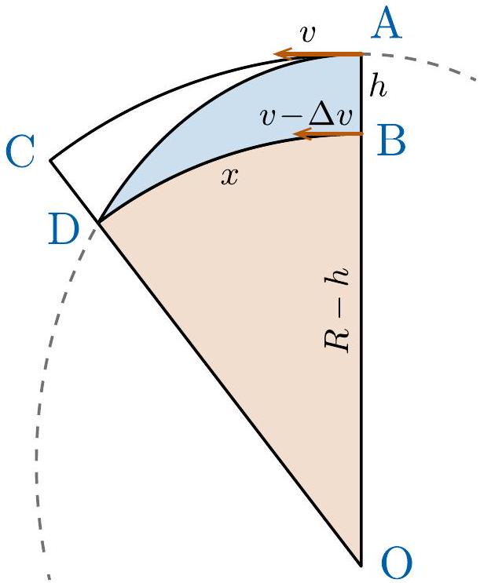

## 9. Deflection on Falling

i) The Earth is rotating with angular velocity $\omega = \frac { 2 \pi } { T }$, where $T = 24 \mathrm {~h}$. The velocities at the top and bottom of the shaft are $v _ { t } = \omega R$ and $v _ { b } = \omega ( R - h )$, where $R$ is radius of Earth. The difference of the velocities is thus $\Delta v = v _ { t } - v _ { b } =$ $\omega h \approx 7.3 \mathrm {~mm} / \mathrm { s }$.
ii) The time of free fall can be found from the relation $h = g t ^ { 2 } / 2$, giving $t = \sqrt { 2 h / g }$. Thus, the horizontal displacement is simply $\Delta x = \Delta v t =$ $\omega h t = \omega \sqrt { 2 h ^ { 3 } / g } \approx 33 \mathrm {~mm}$.
iii) There are at least three different approaches to this problem; one is using the angular momentum conservation law, second one is based on Kepler's laws (given later below), and the third one - which we don't consider here - is based on Coriolis force formula.

Consider the rotation speed $\omega ^ { \prime }$ of the radius vector drwan from the falling body to the centre of Earth, and let us compare this speed with the rotation speed of Earth $\omega$. The angular momentum of the falling body is conserved, hence $\omega ^ { \prime } r ^ { 2 } = \omega R ^ { 2 }$. We can substitute $r = R - y$, where $y$ is the current depth, and approximate $\omega ^ { \prime } = \omega \left( \frac { R } { r } \right) ^ { 2 } \approx \omega \left( 1 + 2 \frac { y } { R } \right)$. Therefore, the horizontal displacement speed in the Earth's frame of reference $v _ { h } = \left( \omega ^ { \prime } - \omega \right) r \approx 2 \omega y R$. Finally, horizontal dipslacement is found as $\Delta x = \int v _ { h } \mathrm {~d} t =$ $\int \left( 2 \omega y R / v _ { v } \right) \mathrm { d } y$, where the vertical falling speed $v _ { v } = \sqrt { 2 g y }$. So, we find $\Delta x = \frac { 2 } { 3 } R \omega \sqrt { 2 h ^ { 3 } / g } \approx$ 22 m.

Now, let obtain the same result using the Kepler's laws. Consider the trajectory of the steel ball as seen in a non-rotating frame of reference. Although it is a thin ellipse, we have drawn the figure out of scale in order the facilitate the calculation of areas. The steel ball is released from point A and it hits the bottom of the shaft at point D, at distance $x$ from B, the location of bottom at the start of fall. As the falling time is still $t = \sqrt { 2 h / g }$, the location of the bottom travels $x ^ { \prime } = ( v - \Delta v ) t = v t - \omega h t$ during the fall. Thus, the horizontal displacement of the landing point is simply $\Delta x = x - x ^ { \prime }$.

Now, the distance $x$ can be found using the Kepler's second law, stating that the area covered by radius vector per unit time $\Delta S / \Delta t$ is constant, which is a manifestation of conservation of angular momentum $\Delta S / \Delta t = L / 2 m = r v _ { \perp } / 2$. (The latter relation could easily be obtained by observing a circular orbit.) For our steel ball, $L / 2 m = R v / 2 = \omega R ^ { 2 } / 2$. The area covered by the steel ball can be calculated as the sum of the segment OBD and the region ADB. Keeping in mind that $x \ll R$, the segment OBD is simply a triangle with area $x ( R - h ) / 2$. Likewise, the region ACDB is approximately a rectangle of area $x h$ and knowing that a parabola divides the area of its surrounding rectangle into proportions 1/3 and $2 / 3$, we conclude that the area of region ADB is $2 x h / 3$. Thus, from the Kepler's second law:

$$
\begin{array} { r }
S = \frac { 1 } { 2 } x ( R - h ) + \frac { 2 } { 3 } x h = \frac { 1 } { 2 } v R t , \\
x = \frac { v t } { 1 + \frac { 1 } { 3 } \frac { h } { R } } \approx v t - \frac { 1 } { 3 } \omega h t .
\end{array}
$$

Finally, the horizontal displacement $\Delta x =$ $x - x ^ { \prime } = \frac { 2 } { 3 } \omega h t \approx 22 \mathrm {~mm}$. (Note that the naive answer overestimated the correct one by 50\%.)
