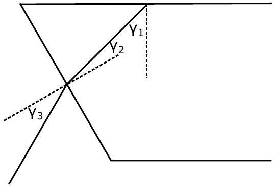
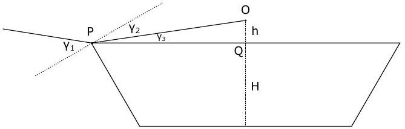
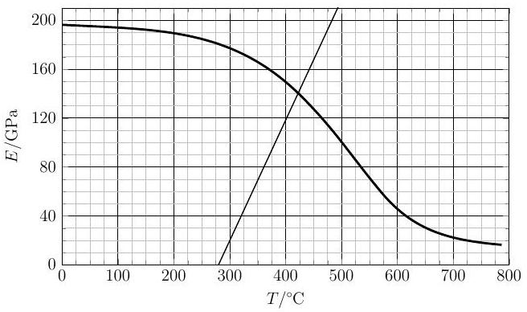
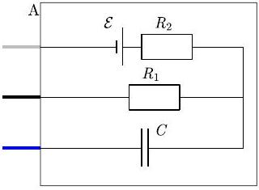
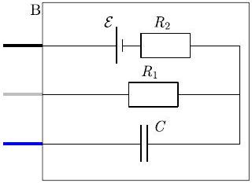

## Nordic-Baltic Physics Olympiad 2017 Solutions

## 1. DRAGON

i) First we have to note that the diameter of the bowl and the height of the dragon give inconsistent results. Because the distance between the two images of the dragons is relatively small compared to the height of the dragon, the height of the water level is almost 3 cm, i.e. the dragon's height. But by comparing the water level to the diameter of the bowl the water level is around 7 cm . So either the bowl's diameter or the dragon's height is incorrect. Neglecting the inconsistency of the provided values we will give the solution method below.

The dragon is relatively large and covers most of the bottom of the bowl. Therefore when viewing from below we would expect some of the rays to always hit the dragon after being reflected from the horizontal top water surface. This happens until the rays are incident to the water surface at an angle smaller than the total internal reflection angle. Then the rays will go through the water surface and we no longer see the reflection of the dragon. From the image below for the total internal reflection case we have

$$
\begin{gathered}
n \sin \gamma _ { 1 } = \sin 90 = 1 , \\
\gamma _ { 1 } = \arcsin \left( \frac { 1 } { n } \right) \approx 48.8 ^ { \circ } .
\end{gathered}
$$

Because the normals to the top water surface and the side of the bowl are at $60 ^ { \circ }$, we have

$$
\gamma _ { 1 } + \gamma _ { 2 } = 60 ^ { \circ } \Longrightarrow \gamma _ { 2 } \approx 11.2 ^ { \circ } .
$$

From Snell's law we have

$$
\begin{gathered}
\sin \gamma _ { 3 } = n \sin \gamma _ { 2 } \Longrightarrow \gamma _ { 3 } = \arcsin \left( n \sin \gamma _ { 2 } \right) , \\
\gamma _ { 3 } \approx 15.0 ^ { \circ } .
\end{gathered}
$$

Because the normal to the side of the bowl is at $30 ^ { \circ }$ to the horizon, the angle of the ray that exited the bowl is $30 ^ { \circ } + \gamma _ { 3 } \approx 45.0 ^ { \circ }$ below the horizon.

ii) First, notice that all calculations below are not very precise and slight departure from the given numbers is acceptable as the bowl wall is slightly curved (the angle between horizon and the wall is not strictly constant).

By the size and shape of the dragon we will assume that the highest point of the dragon is roughly in the middle of the bowl. The last point that we will see as we increase the viewing angle is the image of the highest point of the dragon, which we denote by $O$. By using a ruler to measure the size of the dragon and the distance between the highest point of the dragon to the same point on the reflected image, we get 4.5 cm and 0.45 cm. The actual height of the dragon is 3cm, so the actual distance between the dragon and its reflection is $2 h = \frac { 0.45 } { 4.5 } \cdot 3 \mathrm {~cm} = 0.3 \mathrm {~cm}$. The two images are at equal distances from the water surface, because they are reflections of each other. Therefore the distance from the highest point of the dragon to the water surface is $h = 0.15 \mathrm {~cm}$.

The height $H$ of the water surface can be measured from the photo, by measuring the diameter of the bottom of the bowl and the height of the water level on the photo with a ruler. We get 9.3 cm and 6.5 cm. The actual diameter is $d = 10 \mathrm {~cm}$. Therefore the actual height of the water level is $H = \frac { 6.5 } { 9.3 } \cdot 10 \mathrm {~cm} = 7.0 \mathrm {~cm}$ (or we can add up the height of the dragon and the distance of it's highest point from the water surface, which we found before). In the image below we can find

$$
| Q P | = \frac { d } { 2 } + H \tan \left( 30 ^ { \circ } \right) \approx 9 \mathrm {~cm} .
$$

Now we can use the following relations

$$
\begin{gathered}
\tan \gamma _ { 3 } = \frac { h } { | Q P | } \\
\gamma _ { 2 } = 30 ^ { \circ } - \gamma _ { 3 } \\
n \sin \gamma _ { 2 } = \sin \gamma _ { 1 }
\end{gathered}
$$

The final angle above the horizon is $\alpha = \gamma _ { 1 } -$ 30 deg and by using the previous relations we get

$$
\begin{gathered}
\alpha = \operatorname { asin } \left( n \sin \left( 30 ^ { \circ } - \operatorname { atan } \left( \frac { h } { | Q P | } \right) \right) - 30 \mathrm { deg } , \right. \\
\alpha \approx 10.2 ^ { \circ } .
\end{gathered}
$$

## 2. COMET

i) Since the distance to aphelion is very large, the comet's full energy $- G \frac { M _ { \odot } } { R _ { \min } + R _ { \max } }$ can be taken to be zero and near the Sun the orbit is approximately shaped like a parabola. Hence, at the distance $R _ { 0 } , \frac { 1 } { 2 } v ^ { 2 } = G \frac { M _ { \odot } } { R _ { 0 } }$ (the same result can be found by writing out the conservation of angular momentum and energy for the comet at two points: the aphelion and the intersection of the two orbits; and by using $R _ { \text {max } } \gg R _ { 0 }$ ). Since $\alpha = 45 ^ { \circ }$, the tangential and radial velocities are equal, $v _ { t } = v _ { r }$ and $v ^ { 2 } \equiv v _ { t } ^ { 2 } + v _ { r } ^ { 2 } = 2 v _ { t } ^ { 2 }$, therefore

$$
v _ { t } ^ { 2 } = G \frac { M _ { \odot } } { R _ { 0 } }
$$

(which is exactly the same expression what we have for the orbital speed $w$ of Earth). Angular momentum conservation law allows us to express the speed at perihelion $u = v _ { t } R _ { 0 } / R _ { \text {min } }$; from energy conservation law $\frac { 1 } { 2 } u ^ { 2 } = G \frac { M _ { \odot } } { R _ { \min } }$. Thus,

$$
\frac { 1 } { 2 } \frac { G M _ { \odot } } { R _ { 0 } } \cdot \frac { R _ { 0 } ^ { 2 } } { R _ { \min } ^ { 2 } } = \frac { G M _ { \odot } } { R _ { \min } }
$$

from where $R _ { \text {min } } = \frac { 1 } { 2 } R _ { 0 }$.
ii) Denote by $O$ the focus of the elliptical orbit of the comet where the Sun is, and by $Q$ the other focus of the comet's orbit. Let $B$ and $C$ be the intersection points of the Earth's and the comet's orbits.

We will show that the points $B , C$ and $O$ are all approximately on the same line by proving that the angle $\angle Q O B$ is approximately $90 ^ { \circ }$. By the property of the ellipse that the sum of the lengths of the line segments drawn from any point on the ellipse to the two focal points is constant we get

$$
| Q B | + | B O | = | Q P | + | O P | = | Q O | + 2 | O P | .
$$

By using $| B O | = R _ { 0 }$ and that approximately $| O P | = \frac { 1 } { 2 } R _ { 0 }$ (the equality is in the limit that $R _ { \text {max } }$ goes to infinity), we get that $| Q B | =$ $| Q O |$. So the triangle $\triangle Q B O$ is isosceles and the angles $\angle Q O B$ and $\angle Q B O$ are equal. Because $| Q B | \gg | O B |$, we have approximately $\angle Q O B =$ $\angle Q B O = 90 ^ { \circ }$ and all the points $B , C$ and $O$ are approximately on the same line.

The radius vector of the comet covers an area $S _ { B C P }$ contained between the segment $B C P$ of the ellipse and the straight line $B C$. We will approximate this segment of the ellipse as a parabola. The surface area of a mirror-symmetric parabolic segment is equal to two thirds of the product of its height and length, as can be de-

termined by integrating the parabola:

$$
S _ { B C P } = \frac { 2 } { 3 } \cdot 2 R _ { 0 } \cdot \frac { R _ { 0 } } { 2 } = \frac { 2 } { 3 } R _ { 0 } ^ { 2 } .
$$

By Kepler's second law the comet sweeps out equal areas in equal times (i.e. the time required to cover some segment of the ellipse is proportional to the area of the segment drawn out by the radius vector connecting the comet and the Sun). Since $v _ { t } = w$, the radius vector of the comet covers the surface area at the same rate as the radius vector of the Earth, which is $\pi R _ { 0 } ^ { 2 } / T$, where $T$ is one year. Therefore

$$
t = \frac { S _ { B C P } } { \pi R _ { 0 } ^ { 2 } } T = \frac { 2 } { 3 \pi } 365 \text { days } \approx 77 \text { days. }
$$

Alternative solution: We can also prove that the intersection points of the orbits and the sun lie on the same line in the following way. Near the Sun we can approximate the orbit as a parabola. Due to the geometrical property of a parabola, if we take the $x$-axis parallel to be the axis of the parabola pointing towards the perihelion $P$, and the origin $O$ at the focus (i.e. the Sun) then for any point $S$ at the parabola, $| O S | + x =$ $2 | O P | = R _ { 0 }$, where $x$ is the $x$-coordinate of $S$. For the intersection points $B$ and $C$ of the Earth's and comet's orbits. $| O B | = | O C | = R _ { 0 }$, therefore for the both points $x = 0$, i.e. $O , A$, and $B$ all lie on the $y$-axis.

Alternative solution: Here is an alternative solution to show that the points $B , C$ and $O$ are all approximately on the same line. We have

$$
| O Q | = R _ { \max } - R _ { \min } = R _ { \max } - \frac { R _ { 0 } } { 2 } .
$$

Every ellipse has the property that the lines drawn from any point on the ellipse to the two focal points are at the same angle to the tangent. Using this property, because the tangent at point $B$ is at 45° to the segment $O B$, then $| B Q |$ is also at $45 ^ { \circ }$ to the tangent and $\angle O B Q =$ $90 ^ { \circ }$. So in the right angled triangle $\triangle B O Q$ we have

$$
\cos \angle B O Q = \frac { | O B | } { | O Q | } = \frac { R _ { 0 } } { R _ { \max } - \frac { R _ { 0 } } { 2 } } \approx 0 ,
$$

where we used the fact that $R _ { \text {max } } \gg R _ { 0 }$. So we have approximately $\angle B O Q = 90 ^ { \circ }$ and the points $B , C$ and $O$ all lie on the same line.

## 3. RESISTORS AND CAPACITORS

i) Once the potentials have stabilized, there is no current through any capacitor, therefore we can then analyze the resistor network by effectively cutting away all the capacitors. We get the following equivalent circuit.

We can analyze it using the laws of series and parallel connections. The resistance of the three resistors between the points X and C is $R _ { X C } = \frac { 1 } { R ^ { - 1 } + ( 2 R ) ^ { - 1 } } = \frac { 2 } { 3 } R$. The resistance of the network between X and B is then $R _ { X B } =$ $\frac { 1 } { \left( R _ { X C } + R \right) ^ { - 1 } + R ^ { - 1 } } = \frac { 5 } { 8 } R$. Therefore the potentials $\varphi _ { B } = \frac { R } { R _ { X B } + R } U = \frac { 8 } { 13 } U$ and $\varphi _ { C } = \varphi _ { B } +$ $\frac { R } { R _ { X C } + R } \left( U - \varphi _ { B } \right) = \frac { 11 } { 13 } U$.
ii) The stabilized potentials inside a capacitor network are entirely defined by the potentials at its boundary. Therefore we may now analyze the capacitor network in isolation (pretending that the resistors have all been cut, but there are external voltage sources). It is equivalent to the following circuit.

Using the laws of parallel and series connection of capacitors, this simplifies even further.

The dotted area contains no charge, hence (as $q = C U$ and $\varphi _ { A } = 0$ )

$$
\frac { 1 } { 2 } C \left( \varphi _ { D } - \varphi _ { A } \right) + \frac { 3 } { 2 } C \left( \varphi _ { D } - \varphi _ { C } \right) + C \left( \varphi _ { D } - \varphi _ { B } \right) = 0
$$

## 4. GRAVITATIONAL WAVES

i) Black holes will merge at this distance.

$$
r _ { \min } = r _ { s 1 } + r _ { s 2 } = \frac { 2 G \left( m _ { 1 } + m _ { 2 } \right) } { c ^ { 2 } }
$$

Substituting for $r$ in the power equation, we get the maximum power for a system with masses $m _ { 1 }$ and $m _ { 2 }$.

$$
P _ { \max } \left( m _ { 1 } , m _ { 2 } \right) = \frac { 1 } { 5 } \frac { c ^ { 5 } } { G } \frac { \left( m _ { 1 } m _ { 2 } \right) ^ { 2 } } { \left( m _ { 1 } + m _ { 2 } \right) ^ { 4 } }
$$

Now let us consider the effect of masses. Let us define $a : = \frac { \left( m _ { 1 } m _ { 2 } \right) ^ { 2 } } { \left( m _ { 1 } + m _ { 2 } \right) ^ { 4 } }$. The intuition tells us, that more power should be radiated off a bigger system, thus the masses should tend to infinity for maximum power.

However the limit $\lim _ { m _ { 1 } = m _ { 2 } \rightarrow \infty } a = 1$ suggests otherwise. So does the dimensional analysis: the dimension of $[ a ] = \frac { ( M \cdot M ) ^ { 2 } } { M ^ { 4 } } = 1$ means that the absolute values of the masses don't contribute to the equation. This is intuitively explained by the proportionally increasing Schwarzschild radii.

However the mass distribution does matter, since $a$ isn't the same for all $m _ { 1 } , m _ { 2 }$ either. Let us determine the maximum value it can take. Let us redefine it in terms of the total mass $M : = m _ { 1 } + m _ { 2 }$ and the mass distribution $k : = \frac { m _ { 1 } } { M }$. Then $m _ { 1 } = k M$
$m _ { 2 } = ( 1 - k ) M$
$\Rightarrow a = \frac { \left( m _ { 1 } m _ { 2 } \right) ^ { 2 } } { \left( m _ { 1 } + m _ { 2 } \right) ^ { 4 } } = \frac { ( k M ( k - 1 ) M ) ^ { 2 } } { M ^ { 4 } } = [ k ( k - 1 ) ] ^ { 2 }$
$\frac { d } { d k } [ k ( k - 1 ) ] ^ { 2 } = 0 \Leftrightarrow k = \frac { 1 } { 2 } \Leftrightarrow m _ { 1 } = m _ { 2 }$
$\Rightarrow a _ { \text {max } } = \left[ \frac { 1 } { 2 } \left( 1 - \frac { 1 } { 2 } \right) \right] ^ { 2 } = \frac { 1 } { 16 }$
So that finally
$P _ { \text {max } } = \frac { 1 } { 5 } \frac { c ^ { 5 } } { G } \frac { 1 } { 16 } = \frac { 1 } { 80 } \frac { c ^ { 5 } } { G } = 4.5 \times 10 ^ { 50 } \mathrm {~W}$
Interestingly enough, the peak power emitted in gravitational radiation by any merging binary system will be the same. $\frac { c ^ { 5 } } { G }$ is also called luminosity of the universe.
ii) $U = \frac { 1 } { 2 } k \Delta \ell ^ { 2 }$, energy stored in a uniformly deformed body
$k = \frac { F } { \Delta \ell }$
$F = \sigma S$
$\Delta \ell = \varepsilon \ell$
$\sigma = \varepsilon E$
$u = \frac { U } { V }$, where $V = S \ell$ is the volume
$\Rightarrow u = \frac { U } { V _ { 0 } } = \frac { 1 } { 2 } E \varepsilon ^ { 2 }$
iii) $[ G ] = L ^ { 3 } M ^ { - 1 } T ^ { - 2 }$, from e.g. $F = \frac { G M m } { r ^ { 2 } }$
$[ c ] = L T ^ { - 1 }$
$[ f ] = T ^ { - } 1$
$[ E ] = M L ^ { - 1 } T ^ { - 2 }$, from e.g. $\sigma = \varepsilon E$
let $E = G ^ { \alpha } c ^ { \beta } f ^ { \gamma }$. Solving for each dimension yields
$M : 1 = - \alpha \quad \Rightarrow \alpha = - 1$
$L : - 1 = 3 \alpha + \beta \Rightarrow \beta = 2$
$T : - 2 = - 2 \alpha - \beta - \gamma \quad \Rightarrow \gamma = 2$
$\Rightarrow E = \frac { c ^ { 2 } } { G } f ^ { 2 }$
iv) The gravitational wave spreads as a spherical wave centered at the source. It's wavefront occupies a thin spherical shell with the surface area $S = 4 \pi z ^ { 2 }$ and its associated infinitesimal volume is $d V = S d z$, where $d z = c d t$ for a wave traveling with the speed of light $c$. The power $P$ and energy density $u$ at a distance $z$ is coupled through $d E = P d t = u d V \Leftrightarrow z = \sqrt { \frac { P } { 4 \pi u c } }$.

Using the models from

$$
\begin{aligned}
& P = \frac { 1 } { 80 } \frac { c ^ { 5 } } { G } \\
& u = \frac { U } { V _ { 0 } } = \frac { 1 } { 2 } E \varepsilon ^ { 2 } \\
& E = \frac { c ^ { 2 } } { G } f ^ { 2 }
\end{aligned}
$$

we finally get

$$
z = \frac { 1 } { \sqrt { 160 \pi } } \frac { c } { \varepsilon f }
$$

5. VIRTUAL MASS The main idea is that the added mass will change the period of oscillations of the ball on the spring, which is given by $T = 2 \pi \sqrt { \frac { m } { k } }$ and changes as the mass changes. Let's measure the period $T _ { 1 }$ of oscillations in the air by measuring the time for 20 oscillations and dividing it by 20 to get the period. Similarly we will measure the period $T _ { 2 }$ of the oscillations in water. Then we have

$$
\frac { T _ { 2 } ^ { 2 } } { T _ { 1 } ^ { 2 } } = \frac { m + m _ { v } } { m } \Longrightarrow m _ { v } = m \left( \frac { T _ { 2 } ^ { 2 } } { T _ { 1 } ^ { 2 } } - 1 \right)
$$

where $m$ is the mass of the ball and $m _ { v }$ is the added mass (notice that the buoyancy doesn't appear in the equations, because it is a constant force and only changes the equilibrium point of the ball on the spring, but not the period). The periods turn out to be $T _ { 1 } = 1.066 \mathrm {~s}$ and $T _ { 2 } = 1.136 \mathrm {~s}$.

To determine the mass of the ball we will measure the elongation $x$ of the spring in two cases: with the ball hanging in the air and with the ball in the water. The ball causes the spring to elongate tens of centimeters, so these distances can be measured quite accurately. Considering the buoyancy in the water we get

$$
\begin{gathered}
k x _ { 1 } = m g \\
k x _ { 2 } = \left( m - \rho _ { v } V \right) g
\end{gathered}
$$

where $V = \frac { 4 } { 3 } \pi \left( \frac { d } { 2 } \right) ^ { 2 }$ (instead of the first equation $k x _ { 1 } = m g$ we could have used $m / k = \left( T _ { 1 } / 2 \pi \right) ^ { 2 }$, depending on how accurately the period was measured the final result might be more accurate using this). Using this we find

$$
m = \frac { \rho _ { v } V x _ { 1 } } { x _ { 1 } - x _ { 2 } } \approx 720 \mathrm {~g} .
$$

Finally the added mass is

$$
m _ { v } \approx 98 \mathrm {~g} .
$$

6. LOOP
i) The loop starts to move because of induction. A changing magnetic field induces an EMF to the loop, which causes current to flow. The external magnetic field exerts a force to the current-carrying wire.

The EMF induced in the loop is

$$
U = - \frac { d \phi } { d t } = - A _ { l } \frac { d B } { d t } ,
$$

where $A _ { l } = l d$.
The current is $I = U / R$ where

$$
R = \sigma \frac { s } { A _ { w } }
$$

with $s = 2 h + 2 l , A _ { w }$ the cross-sectional area of the wire and $\sigma$ the resistivity of copper.

Thus

$$
I = U / R = \frac { A _ { l } \frac { d B } { d t } A _ { w } } { \sigma s } = 0.0705 \mathrm {~A}
$$

The net force exerted by the magnetic field is $F = I l B$ and the acceleration

$$
\begin{gathered}
a = F / m = \frac { A _ { l } \frac { d B } { d t } A _ { w } l B } { \sigma s \cdot \rho A _ { w } s } = \frac { A _ { l } \frac { d B } { d t } l B } { \sigma \rho s ^ { 2 } } \\
a = 0.627 \mathrm {~m} / \mathrm { s } ^ { 2 } \approx 0.63 \mathrm {~m} / \mathrm { s } ^ { 2 }
\end{gathered}
$$

(Forces exerted by the external field on the other sides are either zero or cancel out. The magnetic field caused by the current itself is negligible compared to the external field. The inductance of the coil is very small compared to the EMF and the current is approximately constant, as the speed of the coil is very small and the external magnetic field changes at a constant rate. The magnetic forces between different parts are internal and do not affect the situation. The magnetic field of the current carrying wire
itself is, of course, considerably close to the wire itself but this is always the case when $F = I l B$ is used. This is the root cause of the force and thus OK.)
ii) a) The cross-sectional area cancels out in the previous, which means that the answer remains the same.
(Twice thicker wire has one quarter the resistance which means four times larger current and force. The mass also quadruples, however, which means that acceleration does not change.)
b) The loop is replaced by a coil with three turns, which gives a three times larger EMF. The wire is also three times longer and thus has three times the resistance. Current stays the same.

This current passes three times through the $l$-side, which give three times the force. The wire, however, has three times the mass and acceleration stays the same.

Mathematically

$$
\begin{gathered}
a = F / m = \frac { 3 A _ { l } \frac { d B } { d t } A _ { w } 3 l B } { \sigma 3 s \cdot \rho A _ { w } 3 s } = \frac { A _ { l } \frac { d B } { d t } l B } { \sigma \rho s ^ { 2 } } , \\
a = 0.627 \mathrm {~m} / \mathrm { s } ^ { 2 } \approx 0.63 \mathrm {~m} / \mathrm { s } ^ { 2 }
\end{gathered}
$$

where symbols denote the original values.
(The same considerations apply to the coil. Especially all the effects between the windings are internal. The current is still constant. The simple force formula is applied in e.g. calculation of the torque exerted on a currentcarrying coil by an external field, where we often have hundreds of windings and a considerable current.)
c) The cross-section cancels out and we can replace 3 by 2 in the previous calculation. The acceleration is still the same.
(Twice larger EMF, four times larger resistance and two times through the field means the same force. Mass is the same.)
d) The largest acceleration is given by the material for which the product of resistivity and density is the smallest. Aluminum is good, but lithium seems to be the best.
e) We have doubled the dimensions, which means

$$
\begin{gathered}
a = F / m = \frac { 4 A _ { l } \frac { d B } { d t } A _ { w } 2 l B } { \sigma 2 s \cdot \rho A _ { w } 2 s } = 2 \frac { A _ { l } \frac { d B } { d t } l B } { \sigma \rho s ^ { 2 } } , \\
a = 1.253 \mathrm {~m} / \mathrm { s } ^ { 2 } \approx 1.25 \mathrm {~m} / \mathrm { s } ^ { 2 }
\end{gathered}
$$

where symbols denote the original values.
7. ZENER
i) The diode limits the maximum amount of voltage that can be applied to the inductor. Whenever the current from the current source is higher than the current through the inductor, the voltage $V _ { 1 }$ is applied to the inductor, and when the current current source is lower than the current through the inductor a voltage $- V _ { 2 }$ is applied to the inductor. If the largest voltage $V _ { 1 }$ would be applied to the inductor for one period $T = \frac { 2 \pi } { \omega }$, then the change in the current through the inductor is

$$
\delta I = \frac { V _ { 1 } } { L } T = \frac { 2 \pi V _ { 1 } } { L \omega } .
$$

Because we had the relation $L \omega I _ { 0 } \gg V _ { 1 }$, we get that $\delta I \ll I _ { 0 }$. The current through the inductor changes negligibly little compared to $I _ { 0 }$ during one period and can be considered constant. The equilibrium current can be found by finding when the average voltage is zero. During one period let $T _ { 1 }$ be the time when $\langle I \rangle > I _ { 0 } \cos \omega t$, and let $T _ { 2 }$ be the time when $\langle I \rangle \left\langle I _ { 0 } \cos \omega t \right.$. We get

$$
T _ { 1 } = \frac { 2 } { \omega } \arccos \left( \frac { \langle I \rangle } { I _ { 0 } } \right) .
$$

The average voltage is zero when $V _ { 1 } T _ { 1 } = V _ { 2 } T _ { 2 }$ and by using $T _ { 1 } + T _ { 2 } = T$ we have

$$
\begin{gathered}
V _ { 1 } T _ { 1 } = V _ { 2 } \left( T - T _ { 1 } \right) \Longrightarrow T _ { 1 } = \frac { V _ { 2 } } { V _ { 1 } + V _ { 2 } } T \Longrightarrow \\
\frac { 2 } { \omega } \arccos \left( \frac { \langle I \rangle } { I _ { 0 } } \right) = \frac { V _ { 2 } } { \left( V _ { 1 } + V _ { 2 } \right) } \frac { 2 \pi } { \omega } \Longrightarrow \\
\langle I \rangle = I _ { 0 } \cos \left( \frac { \pi V _ { 2 } } { V _ { 1 } + V _ { 2 } } \right) .
\end{gathered}
$$

ii) The peak-to-peak amplitude of the current fluctuations can be calculated from $\frac { d I } { d t } = \frac { U } { L }$

$$
\Delta I = \frac { V _ { 2 } T _ { 2 } } { L } = \frac { V _ { 1 } T _ { 1 } } { L } = \frac { 2 \pi V _ { 1 } V _ { 2 } } { \omega L \left( V _ { 1 } + V _ { 2 } \right) } .
$$

8. BEAMS
i) The beam in the middle expands $\alpha \Delta T =$ $0.10 \%$ due to the temperature increase. The beams are all between rigid support plates, so they must all have the same final length. Because the middle beam has expanded, in the limiting case when the maximal load is applied the middle beam has a strain of $\beta$. The two other beams have a strain of $\epsilon = \beta - \alpha \Delta T$, because they haven't expanded due to temperature. The force applied by each beam is proportional to its strain, so we can find the ratio of the maximal allowed weights by calculating the ratio of the sum of strains in the two cases. In the even temperatures case each beam has a strain of $\beta$ under the maximal load. So the fraction of the new maximum weight compared to the original case is

$$
\frac { 2 \epsilon + \beta } { 3 \beta } = \frac { 2 \times 0.30 + 0.40 } { 3 \times 0.40 } \approx 0.83 .
$$

ii) Denote by $\epsilon _ { 1 }$ the strain of the middle beam and by $\epsilon _ { 2 }$ the strain of the outer beams. Like in the previous part of the problem, the final lengths of the beams have to be the same. Considering the expansion of the middle beam, we must have

$$
\epsilon _ { 1 } - \alpha \Delta T = \epsilon _ { 2 } .
$$

Denote by $E _ { 0 }$ the Young's modulus at temperature $T = 0 ^ { \circ } \mathrm { C }$. At this temperature the maximum allowed force is $3 S E _ { 0 } \beta$ ( $S$ is the area of each of the beams), because each beam has a strain of $\beta$. So $20 \%$ of the maximal load exerts a force of

$$
F _ { 1 } = 0.2 \times 3 S E _ { 0 } \beta = 0.6 S E _ { 0 } \beta .
$$

In general the force exerted by the beams at any temperature is given by

$$
F = S E ( T ) \epsilon _ { 1 } + 2 S E _ { 0 } \epsilon _ { 2 } .
$$

The maximal force can be found by setting $\epsilon _ { 1 } =$ $\beta$ and by substituting $\epsilon _ { 2 }$ from above.

$$
F _ { \max } = S E ( T ) \beta + 2 S E _ { 0 } ( \beta - \alpha \Delta T ) .
$$

By solving $F _ { \text {max } } = F _ { 1 }$ we can find the temperature we are looking for. We get

$$
\begin{gathered}
S E ( T ) \beta + 2 S E _ { 0 } ( \beta - \alpha \Delta T ) = 0.6 S E _ { 0 } \beta \rightarrow \\
E ( T ) = \frac { 2 \alpha } { \beta } E _ { 0 } \Delta T - 1.4 E _ { 0 } .
\end{gathered}
$$

This is a straight line representing what the Young's modulus should be such that with a $\Delta T$ temperature increase of the middle beam the system can maximally support 20\% of the original maximal weight. By plotting this line on the Young's modulus graph and finding the intersection point of the two lines we get that $\Delta T = 420 ^ { \circ } \mathrm { C }$ and $T = 420 ^ { \circ } \mathrm { C }$.

9. SPACECRAFT PRESSURE
i) Consider an air slice between $r$ and $r + d r$ with area $A$ and mass $m$. In a rotating frame of reference, force balance gives

$$
A ( p ( r + d r ) - p ( r ) ) = m \omega ^ { 2 } r .
$$

The mass is related to the density with $m =$ $A \rho ( r ) d r$. Using the ideal gas law,

$$
\begin{gathered}
p V = n R T \Longrightarrow \\
\rho ( r ) = \frac { m } { V } = \frac { m } { n R T } p ( r ) = \frac { \mu } { R T } p ( r ) ,
\end{gathered}
$$

so that when we combine the two equations, we get the following equation for pressure:

$$
\frac { p ( r + d r ) - p ( r ) } { d r } = p ^ { \prime } ( r ) = \frac { \mu \omega ^ { 2 } } { R T } r p ( r ) .
$$

This can be solved using separation of variables, giving

$$
\begin{gathered}
\int \frac { d \rho } { \rho } = \int \frac { \mu \omega ^ { 2 } } { R T } r d r \\
\ln \rho - \ln \rho _ { 0 } = \frac { \mu \omega ^ { 2 } } { 2 R T } r ^ { 2 }
\end{gathered}
$$

From this we find

$$
p ( r ) = p _ { 0 } \exp \left( \frac { \mu \omega ^ { 2 } } { 2 R T } r ^ { 2 } \right) .
$$

ii) This time the force balance is

$$
A ( p ( h + d h ) - p ( h ) ) = - m g
$$

The corresponding pressure equation is

$$
p ^ { \prime } ( h ) = - \frac { \mu g } { R T } p ( h )
$$

with the solution

$$
p ( h ) = p _ { 0 } \exp \left( - \frac { \mu g } { R T } h \right) .
$$

10. BLACK BOX
i) By measuring the current and the voltage between the black and white leads, we can determine that there can only be the battery and the resistor(s) between them. Measuring the current from blue to black and blue to white shows that there is a capacitor connected in both case. Since we get a higher current (then between black and white) in one or both of these measurements, we can say that the capacitor can only be connected to the other elements in a star connection. That leaves two options.

It is possible to differentiate between the two (for example by looking at the leakage of the capacitor), but not if we are using an ideal capacitor as the model. Both were considered correct when grading.
ii) Let's look at option A (for option B the $R _ { 1 }$ and $R _ { 2 }$ values are exchanged). We can get the values for the elements in many ways. Measuring the voltage from the black and white leads gets us $\mathscr { E } \approx 1.57 \mathrm {~V}$. Measuring the initial current from the blue and white leads (after holding blue and black closed for a while) gets us $R _ { 2 } = \mathscr { E } / I _ { 2 } \approx 51 \mathrm { k }$. Measuring the initial current from the blue and black leads (after holding blue and black closed for a while) gets us $R _ { 1 } = \mathscr { E } / I _ { 1 } \approx 200 \mathrm { k }$.

Capacitance can be measured for example from the time the current between blue and white halves: $C = t _ { 2 } / \left( R _ { 2 } \ln 2 \right) \approx 330 \mathrm { tg }$; looking at the current or voltage plot in semilogarithmic axes or looking at the area under the current plot are also good options.
