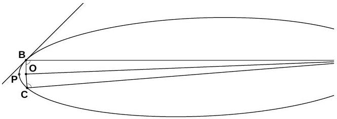

## 2. COMET

i) Since the distance to aphelion is very large, the comet's full energy $- G \frac { M _ { \odot } } { R _ { \min } + R _ { \max } }$ can be taken to be zero and near the Sun the orbit is approximately shaped like a parabola. Hence, at the distance $R _ { 0 } , \frac { 1 } { 2 } v ^ { 2 } = G \frac { M _ { \odot } } { R _ { 0 } }$ (the same result can be found by writing out the conservation of angular momentum and energy for the comet at two points: the aphelion and the intersection of the two orbits; and by using $R _ { \text {max } } \gg R _ { 0 }$ ). Since $\alpha = 45 ^ { \circ }$, the tangential and radial velocities are equal, $v _ { t } = v _ { r }$ and $v ^ { 2 } \equiv v _ { t } ^ { 2 } + v _ { r } ^ { 2 } = 2 v _ { t } ^ { 2 }$, therefore

$$
v _ { t } ^ { 2 } = G \frac { M _ { \odot } } { R _ { 0 } }
$$

(which is exactly the same expression what we have for the orbital speed $w$ of Earth). Angular momentum conservation law allows us to express the speed at perihelion $u = v _ { t } R _ { 0 } / R _ { \text {min } }$; from energy conservation law $\frac { 1 } { 2 } u ^ { 2 } = G \frac { M _ { \odot } } { R _ { \min } }$. Thus,

$$
\frac { 1 } { 2 } \frac { G M _ { \odot } } { R _ { 0 } } \cdot \frac { R _ { 0 } ^ { 2 } } { R _ { \min } ^ { 2 } } = \frac { G M _ { \odot } } { R _ { \min } }
$$

from where $R _ { \text {min } } = \frac { 1 } { 2 } R _ { 0 }$.
ii) Denote by $O$ the focus of the elliptical orbit of the comet where the Sun is, and by $Q$ the other focus of the comet's orbit. Let $B$ and $C$ be the intersection points of the Earth's and the comet's orbits.

We will show that the points $B , C$ and $O$ are all approximately on the same line by proving that the angle $\angle Q O B$ is approximately $90 ^ { \circ }$. By the property of the ellipse that the sum of the lengths of the line segments drawn from any point on the ellipse to the two focal points is constant we get

$$
| Q B | + | B O | = | Q P | + | O P | = | Q O | + 2 | O P | .
$$

By using $| B O | = R _ { 0 }$ and that approximately $| O P | = \frac { 1 } { 2 } R _ { 0 }$ (the equality is in the limit that $R _ { \text {max } }$ goes to infinity), we get that $| Q B | =$ $| Q O |$. So the triangle $\triangle Q B O$ is isosceles and the angles $\angle Q O B$ and $\angle Q B O$ are equal. Because $| Q B | \gg | O B |$, we have approximately $\angle Q O B =$ $\angle Q B O = 90 ^ { \circ }$ and all the points $B , C$ and $O$ are approximately on the same line.

The radius vector of the comet covers an area $S _ { B C P }$ contained between the segment $B C P$ of the ellipse and the straight line $B C$. We will approximate this segment of the ellipse as a parabola. The surface area of a mirror-symmetric parabolic segment is equal to two thirds of the product of its height and length, as can be de-

termined by integrating the parabola:

$$
S _ { B C P } = \frac { 2 } { 3 } \cdot 2 R _ { 0 } \cdot \frac { R _ { 0 } } { 2 } = \frac { 2 } { 3 } R _ { 0 } ^ { 2 } .
$$

By Kepler's second law the comet sweeps out equal areas in equal times (i.e. the time required to cover some segment of the ellipse is proportional to the area of the segment drawn out by the radius vector connecting the comet and the Sun). Since $v _ { t } = w$, the radius vector of the comet covers the surface area at the same rate as the radius vector of the Earth, which is $\pi R _ { 0 } ^ { 2 } / T$, where $T$ is one year. Therefore

$$
t = \frac { S _ { B C P } } { \pi R _ { 0 } ^ { 2 } } T = \frac { 2 } { 3 \pi } 365 \text { days } \approx 77 \text { days. }
$$

Alternative solution: We can also prove that the intersection points of the orbits and the sun lie on the same line in the following way. Near the Sun we can approximate the orbit as a parabola. Due to the geometrical property of a parabola, if we take the $x$-axis parallel to be the axis of the parabola pointing towards the perihelion $P$, and the origin $O$ at the focus (i.e. the Sun) then for any point $S$ at the parabola, $| O S | + x =$ $2 | O P | = R _ { 0 }$, where $x$ is the $x$-coordinate of $S$. For the intersection points $B$ and $C$ of the Earth's and comet's orbits. $| O B | = | O C | = R _ { 0 }$, therefore for the both points $x = 0$, i.e. $O , A$, and $B$ all lie on the $y$-axis.

Alternative solution: Here is an alternative solution to show that the points $B , C$ and $O$ are all approximately on the same line. We have

$$
| O Q | = R _ { \max } - R _ { \min } = R _ { \max } - \frac { R _ { 0 } } { 2 } .
$$

Every ellipse has the property that the lines drawn from any point on the ellipse to the two focal points are at the same angle to the tangent. Using this property, because the tangent at point $B$ is at 45° to the segment $O B$, then $| B Q |$ is also at $45 ^ { \circ }$ to the tangent and $\angle O B Q =$ $90 ^ { \circ }$. So in the right angled triangle $\triangle B O Q$ we have

$$
\cos \angle B O Q = \frac { | O B | } { | O Q | } = \frac { R _ { 0 } } { R _ { \max } - \frac { R _ { 0 } } { 2 } } \approx 0 ,
$$

where we used the fact that $R _ { \text {max } } \gg R _ { 0 }$. So we have approximately $\angle B O Q = 90 ^ { \circ }$ and the points $B , C$ and $O$ all lie on the same line.
