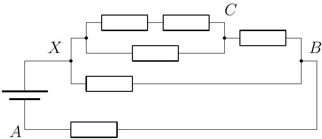
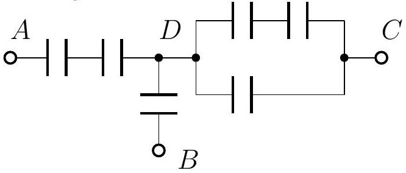
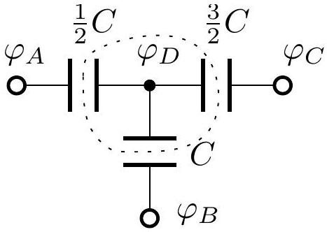

## 3. RESISTORS AND CAPACITORS

i) Once the potentials have stabilized, there is no current through any capacitor, therefore we can then analyze the resistor network by effectively cutting away all the capacitors. We get the following equivalent circuit.

We can analyze it using the laws of series and parallel connections. The resistance of the three resistors between the points X and C is $R _ { X C } = \frac { 1 } { R ^ { - 1 } + ( 2 R ) ^ { - 1 } } = \frac { 2 } { 3 } R$. The resistance of the network between X and B is then $R _ { X B } =$ $\frac { 1 } { \left( R _ { X C } + R \right) ^ { - 1 } + R ^ { - 1 } } = \frac { 5 } { 8 } R$. Therefore the potentials $\varphi _ { B } = \frac { R } { R _ { X B } + R } U = \frac { 8 } { 13 } U$ and $\varphi _ { C } = \varphi _ { B } +$ $\frac { R } { R _ { X C } + R } \left( U - \varphi _ { B } \right) = \frac { 11 } { 13 } U$.
ii) The stabilized potentials inside a capacitor network are entirely defined by the potentials at its boundary. Therefore we may now analyze the capacitor network in isolation (pretending that the resistors have all been cut, but there are external voltage sources). It is equivalent to the following circuit.

Using the laws of parallel and series connection of capacitors, this simplifies even further.

The dotted area contains no charge, hence (as $q = C U$ and $\varphi _ { A } = 0$ )

$$
\frac { 1 } { 2 } C \left( \varphi _ { D } - \varphi _ { A } \right) + \frac { 3 } { 2 } C \left( \varphi _ { D } - \varphi _ { C } \right) + C \left( \varphi _ { D } - \varphi _ { B } \right) = 0
$$
