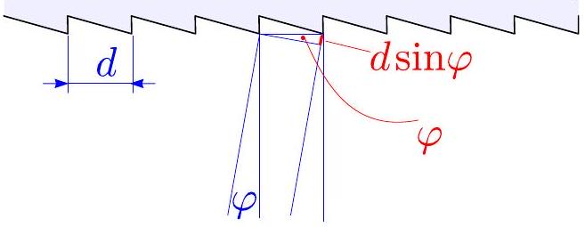
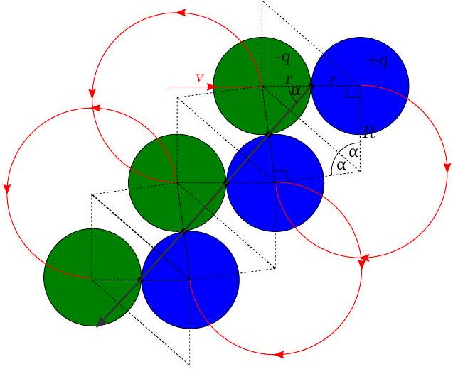
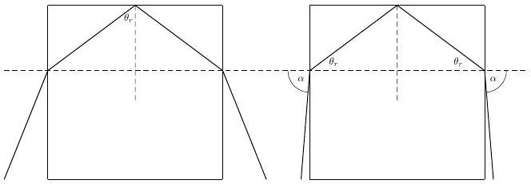
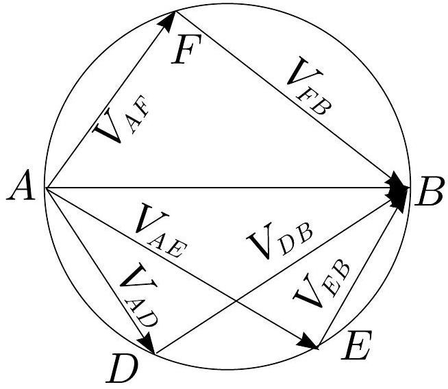
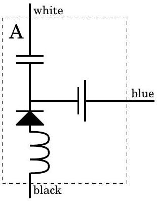

## Nordic-Baltic Physics Olympiad 2018 Solutions

## 1. GRAVITATIONAL RACING

i) (a) Since all three bodies move along the same trajectory, they must be $\frac { T } { 3 }$ away from each other at any moment of time. Thus, it takes $\frac { T } { 3 }$ to get from $O _ { 2 }$ to $O$.
(b) From symmetry, time taken to go from $P$ to $O$ must be $\frac { T } { 4 }$. Furthermore, it takes $\frac { T } { 3 }$ to get from $P _ { 2 }$ to $P$ and from $O$ to $O _ { 3 }$. This means that it takes $\frac { T } { 3 } + \frac { T } { 3 } + \frac { T } { 4 } = \frac { 11 T } { 12 }$ to get from $P _ { 2 }$ to $O _ { 3 }$ or $T - \frac { 11 T } { 12 } = \frac { T } { 12 }$ to get from $O _ { 3 }$ to $P _ { 2 }$.
ii) Since there are no external forces at play, the centre of mass of the three body system must stay in place and, due to symmetry, be located at $O$. Thus, $\vec { r } _ { 1 } + \vec { r } _ { 2 } + \vec { r } _ { 3 } = 0$, where $\vec { r } _ { 1 } , \vec { r } _ { 2 }$ and $\vec { r } _ { 3 }$ are position vectors from $O$. Differentiating,

$$
\begin{equation*}
\vec { v } _ { 1 } + \vec { v } _ { 2 } + \vec { v } _ { 3 } = 0 . \tag{1}
\end{equation*}
$$

iii) The total angular momentum is conserved. Thus, we can find the angular momentum at a moment of time that's most convenient for us, such as the configuration when one of the bodies is at $O$. Due to symmetry, $\vec { r } _ { 2 } = - \vec { r } _ { 3 }$ and $\vec { v } _ { 2 } = \vec { v } _ { 3 }$. The total angular momentum is then

$$
\begin{aligned}
& J = m \vec { r } _ { 1 } \times \vec { v } _ { 1 } + m \vec { r } _ { 2 } \times \vec { v } _ { 2 } + m \vec { r } _ { 3 } \times \vec { v } _ { 3 } = \\
& = m \left( \vec { r } _ { 2 } \times \vec { v } _ { 2 } + \vec { r } _ { 3 } \times \vec { v } _ { 3 } \right) = m \left( \vec { r } _ { 2 } \times \vec { v } _ { 2 } - \vec { r } _ { 2 } \times \vec { v } _ { 2 } \right) = 0 .
\end{aligned}
$$

$$
\begin{equation*}
E = \frac { 3 m v _ { o } ^ { 2 } } { 4 } - \frac { 5 G m ^ { 2 } } { 2 r _ { o } } . \tag{2}
\end{equation*}
$$

Total Energy at $P$ is

$$
E = \frac { m v _ { 1 , p } ^ { 2 } } { 2 } + \frac { m v _ { 2 , p } ^ { 2 } } { 2 } + \frac { m v _ { 3 , p } ^ { 2 } } { 2 } - \frac { G m ^ { 2 } } { r _ { 12 , p } } - \frac { G m ^ { 2 } } { r _ { 23 , p } } - \frac { G m ^ { 2 } } { r _ { 31 , p } } .
$$

$2 d \sin \alpha$. Furthermore, applying equation ?? on the y -axis, $v _ { 1 , p } - v _ { 2 , p } \sin \alpha - v _ { 3 , p } \sin \alpha = 0$. Thus, $v _ { 1 , p } = v _ { p } = 2 v _ { 2 , p } \sin \alpha = 2 v _ { 3 , p } \sin \alpha$ since $v _ { 2 , p } = v _ { 3 , p }$. The total energy at $P$ is then

$$
\begin{align*}
E & = \frac { m v _ { p } ^ { 2 } } { 2 } \left( 1 + \frac { 1 } { 2 \sin ^ { 2 } \alpha } \right) - \frac { G m ^ { 2 } } { d } \left( 2 + \frac { 1 } { 2 \sin \alpha } \right) = \\
& = 6.68 \mathrm {~m} v _ { p } ^ { 2 } - 4.49 \frac { G m ^ { 2 } } { d } . \tag{3}
\end{align*}
$$

When a body is at $P$, the gravitational force is equal to the centrifugal force. This means that

$$
\begin{gather*}
\frac { m v _ { p } ^ { 2 } } { R _ { p } } = 2 \frac { G m ^ { 2 } } { d ^ { 2 } } \cos \alpha = 1.96 \frac { G m ^ { 2 } } { d ^ { 2 } } , \\
G m = 0.510 \frac { v _ { p } ^ { 2 } d ^ { 2 } } { R _ { p } } . \tag{4}
\end{gather*}
$$

Combining equations ??, ?? and ?? gives

$$
\frac { 3 v _ { o } ^ { 2 } } { 4 } = 6.68 v _ { p } ^ { 2 } + 0.510 \frac { v _ { p } ^ { 2 } d ^ { 2 } } { R _ { p } } \left( \frac { 5 } { 2 r _ { o } } - \frac { 4.49 } { d } \right) ,
$$

rearranging,

$$
\frac { v _ { o } } { v _ { p } } = \sqrt { \frac { 4 } { 3 } \left( 6.68 + 0.510 \frac { d ^ { 2 } } { R _ { p } } \left( \frac { 5 } { 2 r _ { 0 } } - \frac { 4.49 } { d } \right) \right) } = 2.8 .
$$

2. SPEED CAMERA
i) The Doppler shift formula has to be applied twice. First, the observer on the approaching car sees both the incoming and reflected wave with frequency $f ^ { \prime } = f _ { 0 } ( 1 + v / c )$. Now, the observer at the speed camera sees the reflected wave Doppler shifted to $f _ { 1 } = f ^ { \prime \prime } = f ^ { \prime } ( 1 + v / c ) = f _ { 0 } ( 1 + v / c ) ^ { 2 }$. Finally, we can simplify:

$$
f _ { 1 } = f _ { 0 } ( 1 + v / c ) ^ { 2 } \approx f _ { 0 } ( 1 + 2 v / c ) .
$$

ii) Using the trigonometric identity given in the problem, we can express the product of two waves simply as a sum of waves

$$
\begin{aligned}
& \cos \left( 2 \pi f _ { 1 } t \right) \cos \left( 2 \pi f _ { 0 } t \right) = \\
& = \frac { 1 } { 2 } \cos \left[ 2 \pi \left( f _ { 1 } + f _ { 0 } \right) t \right] + \frac { 1 } { 2 } \cos \left[ 2 \pi \left( f _ { 1 } - f _ { 0 } \right) t \right]
\end{aligned}
$$

where we can easily identify two frequency components $f _ { \text {high } } = f _ { 1 } + f _ { 0 }$ and $f _ { \text {low } } = f _ { 1 } - f _ { 0 }$.
iii) We can express $f _ { \text {low } } = f _ { 1 } - f _ { 0 } = 2 f _ { 0 } v / c$ and calculate the speed of car as

$$
v = \frac { f _ { \text {low } } } { 2 f _ { 0 } } c = 30 \mathrm {~m} / \mathrm { s } .
$$

## 3. WEATHER FORECAST

i) The angle $\varphi$ is equal to the latitude. This means that on the northern hemisphere the Coriolis force vector is rotated 90° clockwise from the velocity vector if both are drawn on the map. To maintain force balance, the Coriolis force needs to be directed opposite to the pressure gradient force, i.e. in the direction of increasing pressure. Thus the velocity needs to be directed along the isobars. The forces should be directed counter-clockwise around the pressure minimum, i.e. to the north in A and to the southwest in B. The answer may also be accepted if the velocity has a small component towards the pressure minimum, as long as this is much smaller than the component along the isobars.
ii) In point A the isobars are approximately straight, meaning that the velocity is constant and thus that all forces sum to zero. A small slab of air with area $A$ and thickness $\mathrm { d } z$ has the mass $\mathrm { d } m = \rho A \mathrm {~d} z$.

The force from the pressure difference $\mathrm { d } p$ between opposite sides in $F _ { p } = A \mathrm {~d} p$, such that the force per mass is

$$
\frac { F _ { p } } { \mathrm {~d} m } = - \frac { A \mathrm {~d} p } { \rho A \mathrm {~d} z } = - \frac { 1 } { \rho } \left| \frac { \mathrm {~d} p } { \mathrm {~d} z } \right|
$$

The pressure gradient can be estimated by measuring the distance between a few nearby isobars in the map, and $\rho \approx 1 \mathrm {~kg} \mathrm {~m} ^ { - 3 }$. Force balance gives the equation

$$
2 v \Omega \sin \varphi = \frac { 1 } { \rho } \left| \frac { \mathrm {~d} p } { \mathrm {~d} z } \right| \Longrightarrow v = \frac { 1 } { 2 \rho \Omega \sin \varphi } \left| \frac { \mathrm {~d} p } { \mathrm {~d} z } \right|
$$

Using $\Omega = 7.27 \times 10 ^ { - 5 } \mathrm {~s} ^ { - 1 } , \quad \phi = 56 ^ { \circ }$, $| \mathrm { d } p / \mathrm { d } z | \approx 0.8 / 250 \mathrm { Pam } ^ { - 1 } = 0.0032 \mathrm { Pam } ^ { - 1 }$ we get the estimation $v = 22 \mathrm {~m} \mathrm {~s} ^ { - 1 }$. Since the students are only asked for an estimation, a wide range of numerical answers are accepted, as long as the method is correct.
iii) Now the isobars are curved, and from the map one can estimate the radius of curvature $r \approx 206 \mathrm {~km}$. The difference of the pressure gradient force and the Coriolis force must equal the centripetal force:

$$
\frac { v ^ { 2 } } { r } = \frac { 1 } { \rho } \left| \frac { \mathrm {~d} p } { \mathrm {~d} z } \right| - 2 v \Omega \sin \varphi
$$

This is a second order equation in $v$ with positive solution

$$
v = - r \Omega \sin \varphi + \sqrt { ( r \Omega \sin \varphi ) ^ { 2 } + \frac { r } { \rho } \left| \frac { \mathrm {~d} p } { \mathrm {~d} z } \right| }
$$

With $\phi = 60 ^ { \circ } , | \mathrm { d } p / \mathrm { d } z | \approx 0.0034 \mathrm {~Pa} \mathrm {~m} ^ { - 1 }$ we get the estimation $v = 14 \mathrm {~m} \mathrm {~s} ^ { - 1 }$. As a comparison, if we neglect the curvature of the isobars we get $22 \mathrm {~m} \mathrm {~s} ^ { - 1 }$.

## 4. FRESNEL PRISM

i) In order to find the grating pitch, we set up a simple diffraction experiment: direct laser light through the grating to the screen; there will be a long series of bright spots which correspond to a series of main maxima; all angles are small, so we can apply small-angle approximation. As compared with a pair of beams exiting the grating from two neighbouring slits perpendicularly, a pair of beams exiting at a small angle $\varphi$ obtains an additional optical path difference equal to $d \sin \varphi \approx d \varphi$, see figure. Suppose that angle $\varphi _ { 0 }$ corresponds to a main diffraction maximum of a certain order $n$ so that the optical path difference between the two beams is equal to an integer number $n$ of wavelengths. Then, for the $n + j$-th main maximum, observed at angle $\alpha _ { j }$, the optical path difference between the neighbouring beams is $( n + j ) \lambda$. Hence, $d \varphi _ { j } - d \varphi _ { 0 } =$ $j \lambda$ so that $\varphi _ { j } - \varphi _ { 0 } = j \lambda / d$. Angle difference $\varphi _ { j } - \varphi _ { 0 }$ results in the distance of bright spots at screen being equal to $a _ { j } = \left( \varphi _ { j } - \varphi _ { 0 } \right) L$, where $L$ is the distance from the grating to the screen. So, we can measure the distance $a _ { j }$ between such a pair of bright spots on the screen which are separated by $j - 1$ bright spots, and calculate the grating constant as

$$
d = \frac { j \lambda L } { a _ { j } } .
$$

In order to obtain better accuracy, it is necessary to use as large as possible value of $j$ (the largest such value that the both dots remain on the screen). With $L = , j =$, and $a _ { 10 }$, we obtain $d =$.

ii) There are two ways of determining the prism angle. First, one can use laser light and screen to determine, to which distance $x$ is the brightest spot on the screen (the zeroth main maximum) shifted when the Fresnel prism is inserted into the path of the beam at distance $L$ from the screen. It appears that the angle $\beta$ by which the prism deflects the beam remains small, so that we can still use the small angle approximation: $\beta = x / L$. Simple geometrical optics calculation yields

$$
\alpha = \frac { \beta } { n - 1 } = \frac { x } { L ( n - 1 ) } .
$$

For $L =$ and $x =$ we obtain $\alpha =$
An alternative approach is using the cyan stripes on the sheet. We look through the prism so that we can see stripes both through the prism, and bypassing the stream simultaneously. We find such two neighbouring stripes and such distance $h$ between the prism and the sheet that one stripe seen through the prism seems to be exactly at the same position as the other stripe seen beyond the edge of the prism. We measure the distance $y$ between these two stripes on the sheet. Then, the deflection angle of the prism is found as $\beta = y / h$, so that

$$
\alpha = \frac { \beta } { n - 1 } = \frac { y } { h ( n - 1 ) } .
$$

For $y =$ and $h =$ we obtain $\alpha =$
iii) Finally, we use that part of the sheet where there are neighbouring cyan and magenta stripes. We use a closely positioned pair of such stripes, and look at it through the prism. Depending on the orientation of the prism the pair of stripes is either brought close to each other, or, vice versa, moved apart. We use such orientation for which the stripes are brought closer to each other, and find such a distance $H$ between the prism and the sheet for which the two stripes overlap exactly (resulting in a seemingly yellowish stripe). We also measure the distance $z$ between the stripes. Using our expression for the deflection angle $\beta = \alpha n - 1$, we obtain an expression for the change of the deflection angle $\delta \beta = \alpha \delta n$, where $\delta n$ denotes the difference of the refraction index for the cyan and magenta. Therefore, $\delta n = \delta \beta / \alpha$. We can find the change of the deflection angle from our measurement data as $\delta \beta = z / H$. So, $\delta n = z / ( H \alpha )$, and

$$
\frac { \mathrm { d } n } { \mathrm {~d} \lambda } = \frac { z } { H \alpha \left( \lambda _ { m } - \lambda _ { c } \right. } .
$$

Using $z =$ and $H =$ we obtain $\frac { \mathrm { d } n } { \mathrm {~d} \lambda } =$.

## 5. MAGNETIC BILLIARD

i) After the first collision, let the velocities of the first and second ball be $v _ { 1 }$ and $v _ { 2 }$ respectively. Applying the conservation of energy gives $\frac { m v ^ { 2 } } { 2 } = \frac { m v _ { 1 } ^ { 2 } } { 2 } + \frac { m v _ { 2 } ^ { 2 } } { 2 }$ or $v ^ { 2 } = v _ { 1 } ^ { 2 } + v _ { 2 } ^ { 2 }$. Conservation of momentum yields $m v = m v _ { 1 } + m v _ { 2 }$ or $v = v _ { 1 } + v _ { 2 }$. Combining the two equations gives $v ^ { 2 } = v _ { 2 } ^ { 2 } + \left( v - v _ { 2 } \right) ^ { 2 } = v ^ { 2 } - 2 v v _ { 2 } + 2 v _ { 2 } ^ { 2 }$ and $v _ { 2 } = 0 ; v$. Since the first solution corresponds to the case when the collision doesn't happen, the speed of the second ball must be $v _ { 2 } = v$.
ii) The balls experience Lorentz force due to the external magnetic field. Since the Lorentz force is perpendicular to the line of motion and constant in magnitude, the balls move along a circular orbit. Equating the Lorentz force with centrifugal force gives $\frac { m v ^ { 2 } } { R } = q v B$. Thus, $R = \frac { m v } { q B }$ and $\omega = \frac { v } { R } = \frac { q B } { m }$. This means that one of the charges moves along the orbit clockwise and the other anticlockwise.

After each collision, one of the balls moves at speed $v$ while the other one is at rest. The moving ball travels a part of the full cyclotron period (either clockwise or anticlockwise, depending on the charge) before making a headon collision with the ball at rest. The momentum is given over to the first ball and the previously moving ball stays at rest and the motion starts once again. During the subsequent collisions, the balls start drifting in one direction as can be seen in the figure.

iii) The average velocity of the balls is equal to the average speed of the collision points. From the figure, it can be seen that the direction of the average velocity is $\pi - \alpha$ clockwise from the initial direction of the incoming ball, where $\alpha = \arctan \frac { 2 r } { R }$. The collision point moves by $d = r \cos \alpha$ between two subsequent collisions.

In between the two collisions, one of the balls moves $2 \pi - 2 \alpha$ along a cyclotron orbit. The time taken is then $t = \frac { 2 \pi - 2 \alpha } { \omega } = \frac { 2 m } { q B } \left( \pi - \arctan \frac { 2 r } { R } \right)$ and the average velocity is

$$
\begin{aligned}
v _ { a v g } & = \frac { d } { t } = \frac { r \omega \cos \alpha } { 2 ( \pi - \alpha ) } = \frac { v r R } { R \sqrt { 4 r ^ { 2 } + R ^ { 2 } } ( \pi - \alpha ) } = \\
& = \frac { v } { \sqrt { 4 + \frac { R ^ { 2 } } { r ^ { 2 } } } \left( \pi - \arctan \frac { 2 r } { R } \right) } .
\end{aligned}
$$

iv) Let the velocities of the two balls at any moment of time be $\vec { v } _ { 1 }$ and $\vec { v } _ { 2 }$. The velocity of the centre of mass is then $\vec { v } _ { C M } = \frac { \vec { v } _ { 1 } + \vec { v } _ { 2 } } { 2 }$. The equation of motion of the system is

$$
q \vec { v } _ { 1 } \times \vec { B } - \vec { F } + q \vec { v } _ { 2 } \times \vec { B } + \vec { F } = m \dot { \vec { v } } _ { 1 } + m \dot { \vec { v } } _ { 2 } ,
$$

where $\vec { F }$ is the force between the two balls, either the elastic forces during a collision or the electrostatic forces. Then

$$
\begin{gathered}
q \left( \vec { v } _ { 1 } + \vec { v } _ { 2 } \right) \times \vec { B } = m \frac { \mathrm {~d} } { \mathrm {~d} t } \left( \vec { v } _ { 1 } + \vec { v } _ { 2 } \right) , \\
q \vec { v } _ { C M } \times \vec { B } = m \frac { \mathrm {~d} } { \mathrm {~d} t } \vec { v } _ { C M } .
\end{gathered}
$$

This means that the centre of mass of the system undergoes cyclotronic motion with a radius of $R = \frac { m v } { q B }$. Because every collision point can only be located where the center of mass is, the collision points must also be limited to the same circle. Thus, the maximum distance between any two collisions is $2 R = \frac { 2 m v } { q B }$
6. CUBE The cube gets pushed by the light reflecting against its surfaces. Since there is no partial reflection, light can only reflect inside the cube via total internal reflection.

Let the cube's faces be aligned to $\mathrm { x } - \mathrm { y } - \mathrm { z }$ axis and let the light enter from the face which is perpendicular to the z-axis.

Before entering the cube, let the unit vector directed along the motion of the light be $\vec { t } = \left( t _ { x } , t _ { y } , t _ { z } \right)$, after entering the cube, $\vec { r } = \left( r _ { x } , r _ { y } , r _ { z } \right)$, before leaving the cube, $\vec { r } ^ { \prime } =$ $\left( r _ { x } ^ { \prime } , r _ { y } ^ { \prime } , r _ { z } ^ { \prime } \right)$ and after leaving the cube, $\vec { t } ^ { \prime } =$ $\left( t _ { x } ^ { \prime } , t _ { y } ^ { \prime } , t _ { z } ^ { \prime } \right)$. Every time the light bounces against one of the sides of the cube, the respective component of $\vec { r }$ gets flipped.
i) The laser beam is limited to propagate in a two-dimensional plane. Take $t _ { y } = 0 , r _ { y } = 0$, $r _ { y } ^ { \prime } = 0$ and $t _ { y } ^ { \prime } = 0$.

In time $\mathrm { d } t$, the laser pointer generates light with total energy $P \mathrm {~d} t$ carrying momentum $\frac { P } { c } \mathrm {~d} t$. In that time, the same amount of light enters the cube and exits it, only with different direction. Applying Newton's III law, the cube must attain a momentum of $\mathrm { d } \vec { p } = \frac { P } { c } \mathrm {~d} t \left( \vec { t } - \vec { t } ^ { \prime } \right)$ and thus experiences a force of $\vec { F } = \frac { \mathrm { d } \vec { p } } { \mathrm {~d} t } = \frac { P } { c } \left( \vec { t } - \vec { t } ^ { \prime } \right) =$ $\frac { P } { c } \sqrt { \left( t _ { x } - t _ { x } ^ { \prime } \right) ^ { 2 } + \left( t _ { z } - t _ { z } ^ { \prime } \right) ^ { 2 } }$. This means that we wish to maximize the quantity $\left( t _ { x } - t _ { x } ^ { \prime } \right) ^ { 2 } + \left( t _ { z } - \right.$ $\left. t _ { z } ^ { \prime } \right) ^ { 2 }$.

Snell's law can be written as $n r _ { x } = t _ { x }$ and $n r _ { x } ^ { \prime } = t _ { x } ^ { \prime }$ since $t _ { x }$ and $r _ { x }$ are the sines of angles of incidence and departure respectively.

The laser beam can only reflect against the side that is perpendicular to the x -axis, beam path with internal reflection is shown inthe figure. Thus, $r _ { z } ^ { \prime } = r _ { z }$ and $t _ { z } ^ { \prime } = t _ { z }$. Let's investigate the reflection against the x -face. The angle of incidence is $\cos \alpha = r _ { x }$. The condition for total internal reflection is $\sin \alpha n \geq 1$. Rearranging the terms yields $\cos \alpha < \sqrt { 1 - \frac { 1 } { n ^ { 2 } } }$ or $r _ { x } < \sqrt { 1 - \frac { 1 } { n ^ { 2 } } }$. This means that $t _ { x } < \sqrt { n ^ { 2 } - 1 }$.

The force is maximal when the laser beam bounces against the cube odd number of times. Then $r _ { x } ^ { \prime } = - r _ { x }$ and $t _ { x } ^ { \prime } - t _ { x } < 2 \sqrt { n ^ { 2 } - 1 }$. Thus, $F = \frac { P } { c } \sqrt { \left( t _ { x } - t _ { x } ^ { \prime } \right) ^ { 2 } + \left( t _ { z } - t _ { z } ^ { \prime } \right) ^ { 2 } } < \frac { 2 P } { c } \left( n ^ { 2 } - 1 \right)$. Note that $t _ { x } ^ { 2 } + t _ { z } ^ { 2 } = 1$ so $t _ { x } < 1$. This means that the force can't be larger than $\frac { 2 P } { c }$. The maximal force is then

$$
F = \begin{cases} 2 \frac { P } { c } \sqrt { n ^ { 2 } - 1 } , & \text { if } n < \sqrt { 2 } \\ 2 \frac { P } { c } , & \text { otherwise } \end{cases}
$$

ii) We proceed in a similar way as in the previous part, the main difference being that the y-component doesn't have to be 0.

The act of entering the cube keeps the light moving in the same direction in the $\mathrm { x } - \mathrm { y }$ plane. Thus, $\frac { t _ { x } } { t _ { y } } = \frac { r _ { x } } { r _ { y } }$. Snell's law can be written as $\sqrt { t _ { x } ^ { 2 } + t _ { y } ^ { 2 } } = n \sqrt { r _ { x } ^ { 2 } + r _ { y } ^ { 2 } }$, since $\sqrt { t _ { x } ^ { 2 } + t _ { y } ^ { 2 } }$ and $\sqrt { r _ { x } ^ { 2 } + r _ { y } ^ { 2 } }$ are the sines of the angles of incidence and departure respectively. Combining these equations, we get $r _ { x } = \frac { t _ { x } } { n } , r _ { y } = \frac { t _ { y } } { n }$. Similarly, $t _ { x } ^ { \prime } = n r _ { x } ^ { \prime }$ and $t _ { y } ^ { \prime } = n r _ { y } ^ { \prime }$.

The act of reflecting against the sides of the cube doesn't change the magnitude of $r _ { x }$ and $r _ { y }$. Thus, $t _ { z } ^ { \prime } = t _ { z }$. This means that the quantity $\left( t _ { x } - t _ { x } ^ { \prime } \right) ^ { 2 } + \left( t _ { y } - t _ { y } ^ { \prime } \right) ^ { 2 }$ needs to be maximized and this happens when $r _ { y } ^ { \prime } = - r _ { y }$ and $r _ { x } ^ { \prime } = - r _ { x }$ so $F = 2 \frac { P } { c } \sqrt { t _ { x } ^ { 2 } + t _ { y } ^ { 2 } } = 2 n \frac { P } { c } \sqrt { r _ { x } ^ { 2 } + r _ { y } ^ { 2 } }$.

Using the same argumentation as in the previous subtask, the condition for a reflection to happen against the x -face is $t _ { x } < \sqrt { n ^ { 2 } - 1 }$. Similarly, $t _ { y } < \sqrt { n ^ { 2 } - 1 }$ must hold for the y-face.

This means that $r _ { x } ^ { 2 } + r _ { y } ^ { 2 } < 2 \left( 1 - \frac { 1 } { n ^ { 2 } } \right)$. On the other hand, $t _ { x } ^ { 2 } + t _ { y } ^ { 2 } + t _ { z } ^ { 2 } = 1$ so $t _ { x } ^ { 2 } + t _ { y } ^ { 2 } < 1$ and $r _ { x } ^ { 2 } +$ $r _ { y } ^ { 2 } < \frac { 1 } { n ^ { 2 } }$. Thus, $r _ { x } ^ { 2 } + r _ { y } ^ { 2 } < \min \left( 2 \left( 1 - \frac { 1 } { n ^ { 2 } } \right) , \frac { 1 } { n ^ { 2 } } \right) =$ $\frac { 1 } { n ^ { 2 } } \min \left( 2 \left( n ^ { 2 } - 1 \right) , 1 \right)$. The maximum force the cube can experience is then

$$
F = \begin{cases} 2 \sqrt { 2 } \frac { P } { c } \sqrt { n ^ { 2 } - 1 } , & \text { if } n < \sqrt { 3 / 2 } \\ 2 \frac { P } { c } , & \text { otherwise } \end{cases}
$$

## 7. LCR-CIRCUIT

i) Let us consider first the upper branch of the circuit consisting of the capacitor $C$ and resistor $R _ { 2 }$. There is the same current $I _ { 1 }$ through the both elements so that the complex voltage amplitudes are $I _ { 1 } / ( \mathrm { i } \omega C )$ and $I _ { 1 } R _ { 2 }$, respectively. Division by imaginary unit rotates a vector in complex plane clock-wise by $\pi / 2$, hence the voltage vector on resistor is rotated with respect to the voltage on the capacitor counter-clock-wise by $\pi / 2$. Similar analysis leads us to the conclusion that the voltage on the inductor $L _ { 1 }$ is rotated with respect to the voltage on the resistor $R _ { 0 }$ counter-clock-wise by $\pi / 2$, and that the voltage on the resistor $R _ { 1 }$ is rotated with respect to the voltage on the inductor $L _ { 0 }$ clock-wise by $\pi / 2$. The resulting phasor diagram is shown below.

ii) From Thales theorem we can conclude that the points $F , D$, and $E$ in the figure above lay on the circle drawn around the segment $A B$ as a diameter. Hence, the voltage $V _ { A B }$ which we want to know equals by modulus to the diameter $A B$ of the circumcircle of the triangle $F D E$ for which we know the side lengths. By making use of the two formulas for the surface area of a triangle, the Heron formula $A =$ $\sqrt { p ( p - a ) ( p - b ) ( p - c ) }$, with $p = \frac { 1 } { 2 } ( a + b + c )$, and $A = \frac { a b c } { 4 R }$ with $R$ denoting the radius of the circumcircle, we conclude that the diameter of the circumcircle

$$
2 R = \frac { a b c } { 2 \sqrt { p ( p - a ) ( p - b ) ( p - c ) } } .
$$

With $a = 7 \mathrm {~V} , b = 15 \mathrm {~V}$ and $c = 20 \mathrm {~V}$ we obtain $p = 21 \mathrm {~V}$ and $V _ { A B } = 2 R = 25 \mathrm {~V}$.

## 8. AIR IN A SUBMARINE

i) We are supposed to calculate the volume rate (in $\frac { \mathrm { m } ^ { 3 } } { s }$ ) at which the water flows in. We know $A = 10 \mathrm {~cm} ^ { 2 }$. We apply Bernoulli's equation, where the initial point is in the sea and the final point is in the hole:

$$
\begin{equation*}
P _ { i } + \underbrace { \frac { 1 } { 2 } \rho v _ { i } ^ { 2 } } _ { = 0 } = P _ { f } + \frac { 1 } { 2 } \rho v _ { f } ^ { 2 } \tag{5}
\end{equation*}
$$

from which we get:

$$
\begin{equation*}
v _ { f } = \sqrt { 2 \frac { \Delta P } { \rho } } \approx \sqrt { 2 g h } = 76.72 \mathrm {~m} / \mathrm { s } . \tag{6}
\end{equation*}
$$

Here $v _ { f }$ is the speed at which the water flows in. This we can insert into the equation for the volume rate:

$$
\begin{equation*}
Q = A v _ { f } = 0.153 \frac { \mathrm {~m} ^ { 3 } } { \mathrm {~s} } \approx 150 \frac { \text { litres } } { \mathrm { s } } . \tag{7}
\end{equation*}
$$

ii) Atmospheric air consists mainly of diatomic nitrogen and oxygen gas. At the temperatures involved these molecules have $f = 5$ degrees of freedom: 3 translational and 2 rotational. The adiabatic constant $\gamma$ is $\gamma = ( f + 2 ) / f = 7 / 5$. One can also obtain this result from $\gamma = \left( c _ { V } + R \right) / c _ { V }$. For adiabatic compression we have

$$
\begin{equation*}
p _ { i } V _ { i } ^ { \gamma } = p _ { f } V _ { f } ^ { \gamma } . \tag{8}
\end{equation*}
$$

The final pressure is the pressure from the sea, which is approximately $p _ { 0 } + \rho g h = \left( 10 ^ { 5 } + 1000 \cdot \right.$ $9.8 \cdot 300 ) \mathrm { Pa } \approx 3 \mathrm { MPa }$. This gives

$$
\begin{equation*}
V _ { f } = V _ { i } \left( \frac { p _ { i } } { p _ { f } } \right) ^ { \frac { 5 } { 7 } } \approx 0.9 \mathrm {~m} ^ { 3 } \tag{9}
\end{equation*}
$$

Note: The final temperature is only about 2.6 times the initial temperature, such that the vibrational degrees of freedom of the molecules does not have to be considered. iii) The work $W$ done on the system (consisting of the whole submarine) by the surrounding water is $W = P _ { c } \Delta V$, where $P _ { c }$ is the constant pressure of the surrounding water. There is no heat exchange, so this work must be equal to the change in internal energy of the system:

$$
\begin{equation*}
W = \Delta U _ { \mathrm { gas } } + \Delta U _ { \mathrm { water } } = c _ { V } n \Delta T + K _ { \mathrm { turb } } \tag{10}
\end{equation*}
$$

where $K _ { \text {turb } }$ is the quantity that we are after and get:

$$
\begin{equation*}
K _ { \text {turb } } = P _ { c } \Delta V - c _ { V } n \Delta T . \tag{11}
\end{equation*}
$$

We need the value of $n$ (NB. you can also figure it out from the ideal gas law):

$$
\begin{equation*}
n = \frac { m } { M } \tag{12}
\end{equation*}
$$

where $m = 1.23 \frac { \mathrm {~kg} } { \mathrm {~m} ^ { 3 } } \cdot 10 \mathrm {~m} ^ { 3 } = 12.3 \mathrm {~kg}$ and $M =$ $0.02897 \frac { \mathrm {~kg} } { \mathrm {~mol} }$. Plugging in the values we get $n \approx$ 424 mol . The final temperature can be calculated from the initial temperature by using that $p ^ { 1 - \gamma } T ^ { \gamma }$ is conserved.

By plugging in all the other values we get:

$$
\begin{equation*}
K _ { \text {turb } } \approx 2.2 \times 10 ^ { 7 } \mathrm {~J} . \tag{13}
\end{equation*}
$$

Alternative solution: Alternatively, one can look at the gas and the water (inside the submarine) as separate subsystems. The work done on the gas is equal to the change in internal energy of the gas:

$$
\begin{equation*}
\int P _ { g } \mathrm {~d} V = c _ { V } n \Delta T . \tag{14}
\end{equation*}
$$

The work done on the water inside the submarine by the water outside the submarine is $P _ { c } \Delta V$. The water inside the submarine also does work on the gas given by $\int P _ { g } \mathrm {~d} V$. The change in internal energy of the water in the submarine is then

$$
\begin{equation*}
K _ { \text {turb } } = P _ { c } \Delta V - \int P _ { g } \mathrm {~d} V = P _ { c } \Delta V - c _ { V } n \Delta T \tag{15}
\end{equation*}
$$

where the last equality follows from eqn (??). From here one proceeds as already written above.
9. BLACK BOX By measuring current with with positive lead of multimeter connected to "blue"

$$
\begin{aligned}
& \text { and negative lead connected to "black" } \\
& \text { we get } I _ { 0 } \approx 95 \mathrm {~mA} \text {. }
\end{aligned}
$$

From this measurement alone, since we made a circuit that continuously conducted current,
we can deduce that the circuit inside the black box has to be one of following:

Note that the order of the inductor and di-
ode in series does not change anything.

The actual measured current value varies a bit from one black box to another and also changes very slightly due battery voltage dropping and inductor heating up slightly.
i)

Measuring voltage between "blue" and "black" we determine the electromotive force of the battery $U = 9.5 \mathrm {~V}$.
ii)

We get the internal resistance of the inductor from $R _ { l } = U / I _ { 0 } \approx 100 \mathrm { ohm }$. We can also get some hint to the magnitude of the inductance as we saw no exponential ramp up of current when measuring, meaning $L / R \ll t$.
iii)

Determining which of the two possible circuits is inside the black box is trickier. One way to do it, is to notice that when we disconnect "blue" and "black" we can get a small spark, or feel a small pulse of current if we happen to touch the wires at that point. That is because $L \frac { \partial I } { \partial t } = U _ { l } -$ the current through the inductor can't change instantaneously and the voltage will generated by the inductor enough for spark or high voltage pulse. Meanwhile if we have capacitor in parallel with inductor while disconnecting the circuit we wont get the effect. By testing with "white" lead parallel with "black" or with "blue" we can determine that no spark happens in latter case and the circuit in the black box is circuit $B$ from the figure.
iv)

By connecting voltmeter between "white" and "black" or "white" and "blue" we can see the voltage decaying exponentially. That means indeed, that the capacitor is connected to the "white" wire and depending if the other lead is connected to "black" or "blue" we are charging the capacitor to negative battery voltage through voltmeter or discharging it through voltmeter and inductor and diode. We have to be careful not to touch both wires at the same time, since the resistance of good skin conductance is much smaller then the resistance of the voltmeter.

We can measure the capacitance by measuring the exponent: for example by taking two voltage readings and measuring the time interval between the readings. $C = \frac { \ln \frac { U _ { 1 } } { U _ { 2 } } } { \tau R _ { m } } \approx 1 \mathrm { uF }$.
v)

First we connect all three wires together. That means we have current running through inductor and the capacitor is charged to negative of battery voltage. We connect voltmeter between "white" and "black", so that we measure the total of the capacitor and battery voltage. The reading is zero at the start since all black box leads are connected. Now we disconnect the

inductor battery current loop by disconnecting "black" from other box leads and the multimeter reading will jump to $U _ { c } + U$ approx 32 V and starts to decay exponentially as before. We can do this many times to get a maximum reading.

After disconnecting the "black", the current goes through LCR circuit formed by inductor and capacitor, but instead of oscillating it stops due to the diode when current through inductor has reached zero.

We can get the upper and lower bounds for the inductance value by considering two different cases.

Upper bound we can get when we neglect the resistive losses. In that case all the energy at the end is in the capacitor. When we write down the energy balance we get:

$$
\frac { U ^ { 2 } C } { 2 } + \frac { I ^ { 2 } L } { 2 } = \frac { U _ { c } ^ { 2 } C } { 2 } \Rightarrow L \approx 130 \mathrm { mH }
$$

Lower bound we can get when we assume that most of the energy went to resistive losses, in that case the inductor current decays exponentially and we can write expression for the down the total charge:

$$
\left( U _ { c } + U \right) * C = I \frac { R _ { l } } { L } \Rightarrow L \approx 33.6 \mathrm { mH }
$$

The correct value for the inductor $L \approx$ 100 mH is between those bounds and closer to the upper bound as we may guess since $U _ { c } > U$.

It is possible to get more accurate value by looking at it without the assumptions - as a damped harmonic oscillation.
