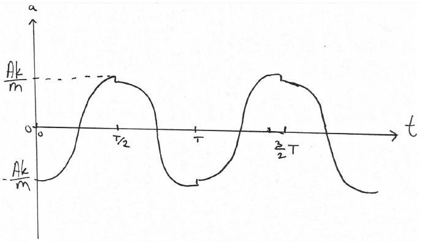
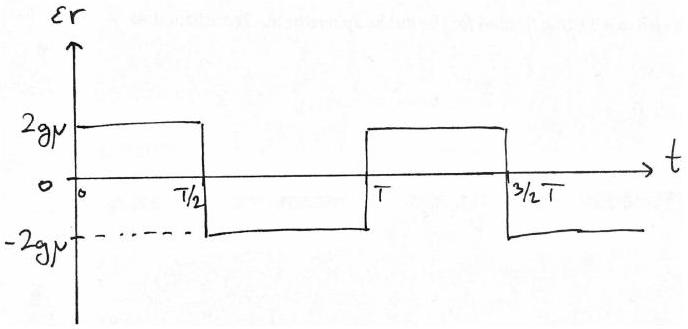

## Nordic-Baltic PhO 2019 - solutions

1. Satellite (8 points) - Taavet Kalda.
i) (1 point) From the energy conservation law,

$$
\frac { m v _ { m } ^ { 2 } } { 2 } - \frac { G M _ { \oplus } m } { r _ { \oplus } } = 0
$$

hence

$$
v _ { m } = \sqrt { \frac { 2 G M _ { \oplus } } { r _ { \oplus } } } .
$$

ii) (2 points) Let the speed of the satellite just after leaving Earth's gravitational field be $v _ { 1 }$. From energy conservation,

$$
\frac { m v _ { 0 } ^ { 2 } } { 2 } - \frac { G M _ { \oplus } m } { r _ { \oplus } } = \frac { m v _ { 1 } ^ { 2 } } { 2 } ,
$$

where $M _ { \oplus }$ is Earth's mass. Furthermore, we have $g = \frac { G M _ { \oplus } } { r _ { \oplus } ^ { 2 } }$. Thus,

$$
v _ { 1 } = \sqrt { v _ { 0 } ^ { 2 } - \frac { 2 G M _ { \oplus } } { r _ { \oplus } } } = \sqrt { v _ { 0 } ^ { 2 } - 2 g r _ { \oplus } } .
$$

iii) (2.5 points) The average solar irradiance can be expressed as

$$
I _ { \mathrm { avg } } = \frac { 1 } { T } \int _ { 0 } ^ { T } I ( t ) \mathrm { d } t
$$

where $I ( t )$ the solar irradiance at time $t$. We can express the solar irradiance as $I ( t ) =$ $\frac { L _ { \odot } } { 4 \pi r ( t ) ^ { 2 } }$. Furthermore, it might be more convenient to integrate over the angle instead of time so we can use $\mathrm { d } t = \frac { \mathrm { d } \alpha } { \omega ( \alpha ) }$, where $\omega$ is the angular velocity of the satellite. This yields

$$
I _ { \text {avg } } = \frac { 1 } { T } \int _ { 0 } ^ { 2 \pi } \frac { L _ { \odot } } { 4 \pi r ^ { 2 } } \frac { \mathrm {~d} \alpha } { \omega } = \frac { L _ { \odot } } { 4 \pi T } \int _ { 0 } ^ { 2 \pi } \frac { \mathrm {~d} \alpha } { \omega r ^ { 2 } } .
$$

Note that the denominator in the integrand is very similar to the angular momentum of the satellite. Indeed, the angular momentum is $J = m v r = m \omega r ^ { 2 } =$ Const. Thus,

$$
I _ { \text {avg } } = \frac { L _ { \odot } } { 4 \pi T } \int _ { 0 } ^ { 2 \pi } \frac { \mathrm {~d} \alpha m } { J } = \frac { L _ { \odot } m } { 4 \pi T J } \int _ { 0 } ^ { 2 \pi } \mathrm {~d} \alpha = \frac { L _ { \odot } m } { 2 T J } .
$$

iv) (2.5 points) Since $L _ { \odot }$ and $m$ are constant, we need to minimise the quantity $T J$. Note that the minimal angular momentum corresponds to the case when the satellite is launched directly opposite to the motion of Earth. It turns out that this also corresponds to the minimal orbital period. Let $\vec { v } _ { 2 }$ be the satellite's velocity in Sun's frame. Then $\vec { v } _ { 2 } =$ $\vec { v } _ { 1 } - \vec { v } _ { \oplus }$, where $v _ { \oplus } = \sqrt { \frac { G M _ { \odot } } { R _ { \oplus } } }$ is Earth's velocity. For convenience, let's write $x = \frac { v _ { 2 } } { v _ { \oplus } }$. Consider the total energy of an elliptical orbit $E _ { \text {tot } } = - \frac { G M _ { \odot } m } { 2 a }$. On the other hand, the total energy is $E _ { \text {tot } } = \frac { m v _ { 2 } ^ { 2 } } { 2 } - \frac { G M _ { \odot } m } { R _ { \oplus } }$. combining the two equations and rearranging, $\frac { R _ { \oplus } } { a } =$ $2 - \frac { v _ { 2 } ^ { 2 } R _ { \oplus } } { G M _ { \oplus } } = 2 - x ^ { 2 }$. From Kepler's III Law, $\frac { T ^ { 2 } } { a ^ { 3 } } = \frac { 4 \pi ^ { 2 } } { G M _ { \odot } }$. Thus, $T = \frac { 2 \pi R _ { \oplus } ^ { 3 } } { \sqrt { G M _ { \odot } } } \left( 2 - x ^ { 2 } \right) ^ { - 3 / 2 }$. As we can see, in order to minimise $T , v _ { 2 }$ needs to be minimal as well.
In conclusion, $I _ { \text {avg } }$ is maximal when the satellite is launched directly against the motion of Earth. The corresponding value for $I _ { \text {avg } }$ is

$$
\begin{gathered}
I _ { \text {avg } } = \frac { L _ { \odot } } { 4 \pi R _ { \oplus } ^ { 2 } } \sqrt { \frac { G M _ { \odot } } { R _ { \oplus } } } \frac { 1 } { v _ { 2 } } \left( 2 - x ^ { 2 } \right) ^ { 3 / 2 } = \\
\frac { L _ { \odot } } { 4 \pi R _ { \oplus } ^ { 2 } } \frac { \left( 2 - x ^ { 2 } \right) ^ { 3 / 2 } } { x } ,
\end{gathered}
$$

where $x = \sqrt { \frac { R _ { \oplus } } { G M _ { \odot } } } \sqrt { v _ { 0 } ^ { 2 } - 2 g r _ { \oplus } } - 1$.
2. Roller (8 points) - Lasse Frantti (iv,v: Jaan Kalda).(Solution of parts iv and v: Taavet Kalda).
i) (1 point) If there is no friction between the cyinder and the board, the cylinder will not rotate, and we have a simple spring-block oscillator, $T _ { 0 } = 2 \pi \sqrt { M / k }$.
ii) (1 point)

Because the cylinder is not slipping, it's rotating about the point of contact with the ground. The moment of inertia with respect to the contact point is $I = M r ^ { 2 } + \frac { 1 } { 2 } M r ^ { 2 } =$ $\frac { 3 } { 2 } M r ^ { 2 }$. The angular acceleration $\alpha$ and accel- eration $a$ are related by $a = \alpha r$. The equation of motion therefore reads

$$
I \alpha = F r = - k x r .
$$

Simplifying,

$$
\frac { 3 } { 2 } M a = - k x .
$$

This corresponds to a harmonic oscillator with a period of

$$
T = \frac { 2 \pi } { \sqrt { \frac { 2 } { 3 } \frac { k } { M } } } = 2 \pi \sqrt { \frac { 3 } { 2 } \frac { M } { k } } .
$$

iii) (2 points) The motion of the cylinder is sinusoidal:

$$
x = A \sin \left( \sqrt { \frac { 2 } { 3 } \frac { k } { M } } t \right) .
$$

From the horisontal force balance,

$$
- k x + F _ { \mu } = M a ,
$$

so the frictional force is linearly dependent on the acceleration and given by

$$
F _ { \mu } = - \frac { 1 } { 2 } M a .
$$

The acceleration is

$$
a = \ddot { x } = - \frac { 2 } { 3 } \frac { k } { M } A \sin ( \omega t ) .
$$

Maximal frictional force is given by

$$
F _ { \mu } ^ { \max } = \mu M g = \frac { 1 } { 2 } M \cdot \frac { 2 } { 3 } \frac { k } { M } A \rightarrow A < \frac { 3 \mu M g } { k } .
$$

Or in other words,

$$
A _ { \star } = \frac { 3 \mu M g } { k } .
$$

iv) (2 points) The equation of motion still reads

$$
- k x + F _ { \mu } = M \ddot { x } ,
$$

but now, $F _ { \mu }$ is equal to $M g \mu$ for most of the motion so it can be treated as a constant (the length of time where it's not equal to that gets proportionally smaller as $A _ { 0 }$ is increased). Rewriting,

$$
- k \left( x - \frac { F _ { \mu } } { k } \right) = M \ddot { x } .
$$

We see that the cylinder undergoes sinusoidal point around $x = \frac { F _ { \mu } } { k }$ but because $A _ { 0 } \gg$ $A _ { \star }$, this is negligible.

The rotational equation of motion yields $\frac { 1 } { 2 } M r ^ { 2 } \alpha = r F _ { \mu } = r M g \mu$ so $\alpha = \frac { 2 } { M r } F _ { \mu }$. Since the direction of the frictional force is constant during $0 \leq t \leq T / 2$, we have $\omega =$ $\frac { 2 } { M r } F _ { \mu } t$ and this is maximal at $t = T / 2$ so

$$
\omega _ { \max } = \frac { g \mu T } { r } .
$$

v) (2 points) From the last part, we saw that $\epsilon$ is constant but opposite in sign for $0 < t <$ $T / 2$ and $T / 2 < t < T$ with the magnitude equal to $\epsilon r = 2 g \mu$. The linear acceleration, on the other hand, follows harmonical motion. From, $x = A _ { 0 } \cos \left( \sqrt { \frac { k } { M } } t \right) , a = \ddot { x } =$ $- \frac { k } { M } A \cos ( 2 \pi t / T )$. The approximate plots are shown in the figures below.

3. Motion in B (8 points) - Andréas Sundström, Joonas Kalda (ii,iii).

i) (1 point) In the homogeneous electric field of strength $E$ along the $x$-axis, we can write down an electrostatic potential $\phi ( x ) =$ $- x E$. For the particle not to hit the wall, the particle's kinetic enregy $m v ^ { 2 } / 2$ must be less than $q \phi ( l ) = - q l E$, thus $| E | > \frac { m v ^ { 2 } } { 2 l | q | }$; the direction of $E$ is such that $q E < 0$.
ii) (2 points)In the magnetic field, the particle moves along a circle with radius $R$ such that the Lorentz force is equal to the centrifugal force, $q v B = m v ^ { 2 } / R$. Since the particle barely reaches the screen, the circular orbit must touch the screen. So $R = l$ and $B = \frac { m v } { l q }$.
iii) (2 points)

The first particle travels for a quarter period before stopping i.e. $t = \frac { T } { 4 } = \frac { \pi l } { 2 v }$. For the second particle the total Lorentz force must be zero so $u = \frac { E } { B }$. Equating times gives $\frac { l } { u } = \frac { \pi l } { 2 v }$ i.e. $E = \frac { 2 B v } { \pi }$.
iv) (3 points) In order to derive the adiabatic invariant, we note that the magnetic flux of the helixal trajectory follows $\Phi \propto$ Area × $B _ { z } \propto R ^ { 2 } B _ { z } \propto B _ { z } / v _ { \perp } ^ { 2 }$, where $v _ { \perp }$ is the component of the velocity that's perpendicular to the magnetic field. Therefore the adiabatic invariant can be written as $v _ { \perp } ^ { 2 } / B _ { z }$.

During the motion of the electron, its kinetic energy is conserved because the magnetic field doesn't do any work. In the critical case, where the electron is almost reflected, the perpendicular compoment of the velocity of the electron at the surface of the earth will be equal to $u _ { 0 }$. The adiabatic invariant then yields

$$
\frac { v _ { \perp 0 } ^ { 2 } } { B \left( R _ { 0 } \right) } = \frac { u _ { 0 } ^ { 2 } } { B \left( R _ { E } \right) } .
$$

Now $v _ { \perp 0 } = u _ { 0 } \sin \alpha$ so the critical angle is given by

$$
\alpha _ { 0 } = \arcsin \left( \sqrt { \frac { B \left( R _ { 0 } \right) } { B \left( R _ { E } \right) } } \right) = \arcsin ( 1 / 5 \sqrt { 5 } ) =
$$

The angle $\alpha$ has to be smaller than $\alpha _ { 0 }$ for the electron to reach the surface of the Earth.
4. Retroreflective film (12 points) - Eero Uustalu and Jaan Kalda.(Solution: Taavet Kalda)
i) (2 points) By shining the laser straight on to the retroreflective film, we see six dots appear on the screen. These dots represent the laser beam refracting through the six different prisms that appear on the film. In the symmetrical case, where $\alpha _ { i } =$ const., we expect the dots to lie on the vertices of a hexagon. What we actually see is a hexagon, where two dots are squished inwards while the other four are equidistant from the centre. This implies that four angles and two angles are pairwise the same. We could say that faces 1 and 4 correspond to the dots that are squished inwards. In that case, $\alpha _ { 1 } = \alpha _ { 4 } , \alpha _ { 2 } = \alpha _ { 3 } = \alpha _ { 5 } = \alpha _ { 6 }$ and $\alpha _ { 1 } < \alpha _ { 2 }$.
ii) (2 points) We can find the minimal deflection angles by holding the laser and the screen in place while tilting the film. In that case, the changing deflection angles are directly represented by the movement of the dots on the screen. Then the only thing left is to find the orientation of the film such that the deflection of the dots on the screen is minimal. Measurements yield $\beta _ { 1 } \approx 28 ^ { \circ }$ and $\beta _ { 2 } \approx 40 ^ { \circ }$.
iii) (4 points) Minimal deflection angle corresponds to the rays traversing the prisms symmetrically. This allows us to conveniently find the minimal deflection angle in terms of $\alpha$ and $\gamma$, where $\gamma$ is the angle of the film with respect to the laser beam. Further measurements show $\gamma _ { 1 } = 11 ^ { \circ }$ and $\gamma _ { 2 } = 9 ^ { \circ }$. From geometry, we get $\beta / 2 = \alpha / 2 - \gamma$ so $\alpha = 2 \gamma + \beta$. This gives $\alpha _ { 1 } = 50 ^ { \circ } , \alpha _ { 2 } = 58 ^ { \circ }$.
iv) (1 point) For our values, $\cos ^ { 2 } \alpha _ { 1 } + \cos ^ { 2 } \alpha _ { 3 } +$ $\cos ^ { 2 } \alpha _ { 5 } = 0.97$. Either by trying different values or binary searching, we see that we can subtract $\Delta \alpha = 0.5 ^ { \circ }$ to get almost exactly 1 as ${ } _ { 5 } ^ { \text {the } }$ value for the sum of cosines squared.
v) (3 points) From Snell's law, $\sin ( \alpha - \gamma ) =$ $n \sin ( \alpha / 2 )$ so $n = \sin ( \beta + \gamma ) / \sin ( \gamma + \beta / 2 ) \approx$ 1.5.
5. Brachistochrone (10 points) - Rūdolf Treilis.
i) (2 points) The ball that moves on the orange curve is under an effective acceleration $a _ { \text {eff } } = \frac { H } { \sqrt { H ^ { 2 } + L ^ { 2 } } } g$, so $\frac { a _ { \text {eff } } t _ { o } ^ { 2 } } { 2 } = \sqrt { H ^ { 2 } + L ^ { 2 } }$ and $t _ { o } = \sqrt { \frac { 2 \left( H ^ { 2 } + L ^ { 2 } \right) } { g H } }$. The ball that moves on the blue curve initially falls for a time $t _ { 1 } =$ $\sqrt { 2 H / g }$ and then moves with a velocity $v =$ $\sqrt { 2 g H }$ for the remainder, hence $t _ { 2 } = \frac { L } { \sqrt { 2 g H } }$ and the total time is $t _ { b } = t _ { 1 } + t _ { 2 } = \frac { 2 H + L } { \sqrt { 2 g H } }$ . The equation $t _ { o } = t _ { b }$ can be solved to give $\frac { L } { H } = \frac { 4 } { 3 }$
ii) (2 points) To understand this point one needs to apply Fermat's principle, which states that light always takes the path of locally least time between two points. Since the speed of the ball will vary based on height, this is reinterpreted as a height-variable index of refraction. From energy conservation it is know that $\frac { m v ( y ) ^ { 2 } } { 2 } = m g y$, hence $v ( y ) =$ $\sqrt { 2 g y }$ and $n ( y ) = \frac { v ( H ) } { v ( y ) } = \sqrt { \frac { H } { y } }$.
iii) (2 points) From Snell's law we know that $n ( y ) \sin \theta =$ const. $= C$, so we need to express $\frac { d y } { d x } = \cot \theta$ in terms of $\sin \theta$ (notice that derivative is the cotangent is this case, because of the way how the angle is defined in optics). Use the result that $1 + \cot ^ { 2 } \theta =$ $\frac { 1 } { \sin ^ { 2 } \theta } = \frac { n ( y ) ^ { 2 } } { C ^ { 2 } }$, hence $\frac { d y } { d x } = \sqrt { A n ( y ) ^ { 2 } - 1 }$ with $A = \frac { 1 } { C ^ { 2 } }$
iv) (2 points) We know that $\frac { d y } { d x } ( y = 0 ) =$ 0 (from the grazing condition), so find $n ( 0 ) = n _ { 0 }$ and $\frac { d y } { d x } ( y = 0 ) = \sqrt { A n _ { 0 } ^ { 2 } - 1 }$ hence $A = \frac { 1 } { n _ { 0 } ^ { 2 } }$. This in turn gives us $\frac { d y } { d x } = \sqrt { ( 1 + \alpha y ) ^ { 2 } - 1 }$, so $\frac { d y } { d x } ( y = h ) =$ $\sqrt { 2 \alpha h + \alpha ^ { 2 } h ^ { 2 } }$, hence $d = \frac { h } { d y / d x ( y = h ) } =$ $\frac { h } { \sqrt { 2 \alpha h + \alpha ^ { 2 } h ^ { 2 } } }$.
v) (2 points) In this case there is a trivial cycloid linking the points $A$ and $B$ that also satisfies the initial condition $v _ { A } = 0$. Choose a wheel with radius $R = \frac { H } { 2 } = \frac { L } { \pi }$, so that the wheel completes exactly half a revolution between points $A$ and $B$. We want to find the functional dependence of the angular velocity on the roll angle $\omega ( \theta )$ such that the point at the top is at the same position as the point mass for all time. We can find the components of the velocity $v _ { y } = R \omega ( \theta ) \sin \theta$ and $v _ { x } = R \omega ( \theta ) [ 1 - \cos \theta ]$, hence $v ^ { 2 } =$ $2 R ^ { 2 } \omega ( \theta ) ^ { 2 } [ 1 - \cos \theta ] = 2 g R [ 1 - \cos \theta ]$, where the last equality comes from energy conservation of the ball. Hence we can conclude that the angular velocity is constant $\omega ^ { 2 } =$ $\frac { \pi ^ { 2 } } { t _ { \text {min } } ^ { 2 } } = \frac { g } { R }$ and $t _ { \text {min } } = \pi \sqrt { \frac { R } { g } } = \pi \sqrt { \frac { H } { 2 g } }$.
6. Self-gravitating gas (10 points) - Eero Vaher (v: Jaan Kalda).(Solution: Taavet Kalda)
i) (2 points) Consider the parcel having crosssectional area of $S$ and thickness $\mathrm { d } r$. Let the local density of the gas at that parcel be $\rho$. Due to spherical symmetry, the gravitational field acting on the parcel will be $g =$ $- G \frac { M ( r ) } { r ^ { 2 } }$ and thus, the gravitational force is $F _ { g } = - G \frac { M ( r ) m } { r ^ { 2 } } = - G \frac { M ( r ) } { r ^ { 2 } } S \mathrm {~d} r \rho$. This is essentially due to Gauss' Law for gravitational field. The gas will also experience the gas pressure $p$ from the bottom side acting outward and gas pressure $p + \mathrm { d } p$ acting inward from the top surface. This pressure will exert a total force of $F _ { p } = ( p - p - \mathrm { d } p ) S$. In a hydrastatical equilibrium, $F _ { p } + F _ { g } = 0$, thus $S \mathrm {~d} p = - G \frac { M ( r ) S \rho } { r ^ { 2 } } \mathrm {~d} r$ or in other words, $p ^ { \prime } = - G \frac { M ( r ) \rho } { r ^ { 2 } }$.
ii) (2 points) All the subsequent integrals will be from the centre of the gas cloud all the way to the edge where the pressure will be 0. The thermal energy of the gas can be expressed as $U = \int n ( r ) 4 \pi r ^ { 2 } \mathrm {~d} r \langle E \rangle$, where $\langle E \rangle = \frac { 3 } { 2 } k T$ is the average energy of one gas molecule. From the ideal gas law, $p = n k T$ so $U =$ $\frac { 3 } { 2 } \int p \mathrm {~d} V$. We want the integral to be of the form $U = - \alpha \int V \mathrm {~d} p$. For that we can use integration by parts: $\int p \mathrm {~d} V = \left. p V \right| _ { \text {centre } } ^ { \text {edge } } - \int V \mathrm {~d} p$. The limits for $p V$ are both zero because in both cases, either $p = 0$ or $V = 0$. Therefore

$$
U = - \frac { 3 } { 2 } \int V \mathrm {~d} p ,
$$

and $\alpha = \frac { 3 } { 2 }$.
iii) (3 points) Gravitational potential energy

is of the form $E _ { G } = - \int \frac { G M ( r ) } { r } \mathrm {~d} M =$ $- \int \frac { G M ( r ) } { r } 4 \pi r ^ { 2 } \mathrm {~d} r \rho$. To simplify this, we can use the result from the first part $G M =$ $- \frac { \mathrm { d } p } { \mathrm {~d} r } \frac { r ^ { 2 } } { \rho }$. Therefore,

$$
E _ { G } = \int \mathrm { d } p 4 \pi r ^ { 3 } = 3 \int \mathrm {~d} p V
$$

From this we see that

$$
\frac { E _ { G } } { 3 } = - \frac { 2 } { 3 } U
$$

or

$$
U = - \frac { 1 } { 2 } E _ { G } .
$$

Therefore $\beta = \frac { 1 } { 2 }$. Alternatively, one can write this immediately down from virial theorem.
iv) (1 point) With heat radiation, the total energy of the system is slowly being radiated away. In this model, the total energy is negative and some observations about the system can be made. If we increase the dimension of the gas cloud, then clearly the magnitude of the total energy will go down. If we increase the temperature, then the magnitude of the total energy will go up. This is sufficient to determine that due to heat radiation, the temperature of the gas cloud will go up while the radius of the gas cloud will get smaller.
v) (2 points) In the case of a plasma ball, both the electrons and protons are free to move around. Both electrons and protons can be treated as exerting equal pressure. This effectively doubles the average energy of one molecule from $\frac { 3 } { 2 } k T$ to $3 k T$ while keeping the gravitational energy expression the same. Therefore $U = - 3 \int V \mathrm {~d} p = - E _ { G }$ so the new proportionality factor between the thermal energy and gravitational energy is $\beta = 1$.
7. Dominoes (6 points) - Kaarel Hänni. Let the $i$ 'th domino have initial angular velocity $\omega _ { i }$. Let us first find $\omega _ { i } ^ { \prime }$, the angular velocity of this domino just before colliding with the next one. A collision occurs after the domino has fallen by an angle of $\alpha = \arctan \left( \frac { 1 } { 2 } \right)$. By conservation of energy, $\frac { 1 } { 2 } I \omega _ { i } ^ { \prime 2 } = \frac { 1 } { 2 } I \omega _ { i } ^ { 2 } +$ $\frac { 1 } { 2 } m g \ell ( 1 - \cos ( \alpha ) )$. Hence,

$$
\begin{equation*}
\omega _ { i } ^ { \prime } = \sqrt { \omega _ { i } ^ { 2 } + \frac { m g \ell } { I } ( 1 - \cos ( \alpha ) ) } = \tag{1}
\end{equation*}
$$

$$
\sqrt { \omega _ { i } ^ { 2 } + \frac { 3 g } { \ell } \left( 1 - \frac { 2 } { \sqrt { 5 } } \right) } .
$$

The collision of two dominoes is inelastic, so after the collision the two dominoes move together (for a negligibly short time before the first domino bumps into the corner of a step). After the two dominoes collide, let the angular velocity of the first one be $\omega _ { i } ^ { \prime \prime }$. Since the two dominoes move in unison,

$$
\begin{equation*}
\cos ( \alpha ) \ell \omega _ { i } ^ { \prime \prime } = \cos ( \alpha ) \frac { \ell } { 2 } \omega _ { i + 1 } \Longrightarrow \omega _ { i } ^ { \prime \prime } = \frac { 1 } { 2 } \omega _ { i + 1 } . \tag{2}
\end{equation*}
$$

During the collision, the force between the two dominoes is always horizontal (since there is no friction between the two), let this force be $F ( t )$, where $t$ is the time. Let us consider the angular momentum of the $i$ 'th domino w.r.t. its base.

$$
\begin{equation*}
I \left( \omega _ { i } ^ { \prime } - \omega _ { i } ^ { \prime \prime } \right) = \ell \cos ( \alpha ) \int _ { \text {beginning of collision } } ^ { \text {uniformiz. of velocities } } \tag{3}
\end{equation*}
$$

For the second domino, we have an analogous equation.

$$
\begin{equation*}
I \omega _ { i + 1 } = \cos ( \alpha ) \frac { \ell } { 2 } \int _ { \text {beginning of collision } } ^ { \text {uniformiz. of velocities } } F ( t ) \mathrm { d } t \tag{4}
\end{equation*}
$$

Equations (3) and (4) together imply

$$
\begin{equation*}
\omega _ { i } ^ { \prime } - \omega _ { i } ^ { \prime \prime } = 2 \omega _ { i + 1 } . \tag{5}
\end{equation*}
$$

We can now plug equations (2) and (1) into (5) to express $\omega _ { i + 1 }$ in terms of $\omega _ { i }$.

$$
\begin{equation*}
\omega _ { i + 1 } = \frac { 2 } { 5 } \omega _ { i } ^ { \prime } = \frac { 2 } { 5 } \sqrt { \omega _ { i } ^ { 2 } + \frac { 3 g } { \ell } \left( 1 - \frac { 2 } { \sqrt { 5 } } \right) } \tag{6}
\end{equation*}
$$

By stability, $\omega _ { i } = \omega _ { i + 1 } = \omega$. This lets us finally evaluate $\omega$.

$$
\begin{gathered}
\omega _ { i } ^ { 2 } = \frac { 4 } { 25 } \omega _ { i } ^ { 2 } + \frac { 12 g } { 25 \ell } \left( 1 - \frac { 2 } { \sqrt { 5 } } \right) \Longrightarrow \\
\omega = \omega _ { i } = \sqrt { \frac { 4 g } { 7 \ell } \left( 1 - \frac { 2 } { \sqrt { 5 } } \right) }
\end{gathered}
$$

8. Four resistors (10 points) - Jaan Kalda and Eero Uustalu. i) (2 points) If we were to measure the resistance of each of the resistors separately, the reading would be something like $4.67 \mathrm { k } \Omega$, and the uncertainty would be four last digits, $40 \Omega$, plus 1\% of the reading, $47 \Omega$, all together $\delta r = 87 \Omega$. This can be a systematic error which means that different measurement errors can be strongly correlated so that for the sum $r _ { A } + r _ { B } + r _ { C } + r _ { D }$, we need to add the uncertainties (as opposed to adding squared uncertainties in the case of uncorrelated errors). Therefore, the uncertainty of $\bar { r } = \left( r _ { A } + r _ { B } + r _ { C } + r _ { D } \right) / 4$ would be also $87 \Omega$.

However, we can also measure a series connection of any number of these resistors. It can be easily seen that the smallest uncertainty will be if we connect all the four resistors in series, in which case we obtain $r _ { A } + r _ { B } + r _ { C } + r _ { D } = 18.68 \mathrm { k } \Omega$ with the uncertainty of $187 + 40 = 227 \Omega$; hence, $\bar { r } =$ $4.67 \mathrm { k } \Omega \pm 57 \Omega$.
ii) (2 points) The problem with the given resistors is that the ohmmeter cannot operate in the more precise $4 \mathrm { k } \Omega$ range. However, if we connect two resistors in parallel, we'll measure directly their harmonic average, and the ohmmeter will operate in the $4 \mathrm { k } \Omega$ range. Note that we shouldn't connect more than two resistors as that would reduce the reading without changing the range and hence, increase the relative error. So, we can obtain $r _ { A } r _ { B } / \left( r _ { A } + r _ { B } \right) = r _ { C } r _ { D } / \left( r _ { C } + r _ { D } \right) =$ $2.337 \mathrm { k } \Omega \pm 27.4 \Omega$, hence $\langle r \rangle = 4.674 \mathrm { k } \Omega \pm 55 \Omega$
iii) (1 point) The precision of direct measurments is not sufficient for distinguishing, which resistors have bigger resistance, and which have smaller. So, we need to build a bridge connection by connecting. For instance, we can connect the minus of the voltage source to the resistor $A$, connect $A$ to $B$, and $B$ - to the plus of the voltage source; we'll do the same with $C$ and $D$, and measure voltage between the junction $P$ between $A$ and $B$ and junction $Q$ between $C$ and $D$. In order to get the highest precision, we'll use the highest possible voltage of $U = 30 \mathrm {~V}$. If we connect $Q$ to the minus of the voltmeter and $P$ to the plus of the voltmeter, we might get the reading $V _ { 1 } = 7.5 \pm 0.5 \mathrm { mV }$. If we switch the order of the resistors $A$ and $B$, the reading becomes negative: $V _ { 1 } ^ { \prime } = - 17.5 \pm$ 0.5 mV : the potential of the junction $P$ became smaller. In the first case, the junction's potential was $U r _ { A } / \left( r _ { A } + r _ { B } \right)$, in the second case $- U r _ { B } / \left( r _ { A } + r _ { B } \right)$. So we conclude $r _ { A } >$ $r _ { B }$. Repeating this procedure with different connections, we'll find $r _ { A } > r _ { C } > r _ { D } > r _ { B }$.
iv) (5 points) With the data of the previous task we have

$$
\frac { r _ { A } - r _ { B } } { r _ { A } + r _ { B } } = \frac { V _ { 1 } - V _ { 1 } ^ { \prime } } { U } .
$$

Similarly we can have

$$
\frac { r _ { A } - r _ { C } } { r _ { A } + r _ { C } } = \frac { V _ { 2 } - V _ { 2 } ^ { \prime } } { U }
$$

with $V _ { 2 } = 7.5 \pm 0.5 \mathrm { mV }$ and $V _ { 2 } ^ { \prime } = - 0.8 \pm$ 0.4 mV; also

$$
\frac { r _ { A } - r _ { D } } { r _ { A } + r _ { D } } = \frac { V _ { 3 } - V _ { 3 } ^ { \prime } } { U }
$$

with $V _ { 3 } = 17.5 \pm 0.5 \mathrm { mV }$ and $V _ { 3 } ^ { \prime } = - 0.8 \pm$ 0.4 mV. With a very good approximation (negligible relative error), we can use $r _ { A } +$ $r _ { B } = r _ { A } + r _ { C } = r _ { A } + r _ { D } = 2 \bar { r }$ so that with the given data we obtain:
$\frac { r _ { A } - r _ { B } } { 2 \bar { r } } = ( 8.34 \pm 0.3 ) \cdot 10 ^ { - 4 }$,
$\frac { r _ { A } - r _ { C } } { 2 \bar { r } } = ( 2.78 \pm 0.3 ) \cdot 10 ^ { - 4 }$,
$\frac { r _ { A } - r _ { D } } { 2 \bar { r } } = ( 6.10 \pm 0.3 ) \cdot 10 ^ { - 4 }$.
If we add up all these equalities, we obtain $2 \left( r _ { A } - \bar { r } \right) = \bar { r } \cdot ( 17.2 \pm 0.9 ) \cdot 10 ^ { - 4 }$. With $\bar { r } = 4.67 \mathrm { k } \Omega$ (which has negligbly small relative error), we end up with

$$
r _ { A } - \bar { r } = ( 4.02 \pm 0.21 ) \Omega .
$$

In a similar way, we can find

$$
\begin{gathered}
r _ { B } - \bar { r } = ( - 3.78 \pm 0.21 ) \Omega , \\
r _ { C } - \bar { r } = ( 1.43 \pm 0.21 ) \Omega ,
\end{gathered}
$$

and

$$
r _ { D } - \bar { r } = ( - 1.68 \pm 0.21 ) \Omega .
$$
