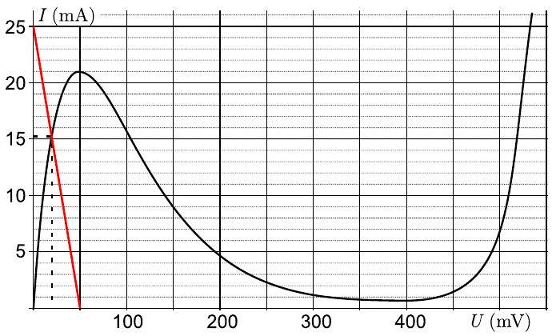
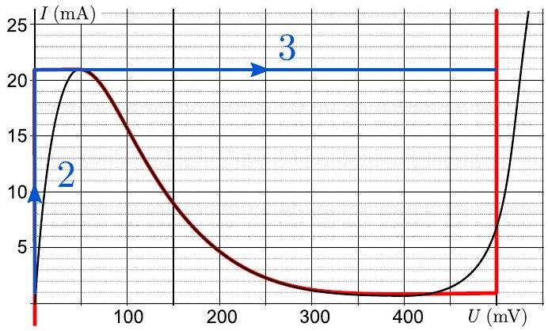
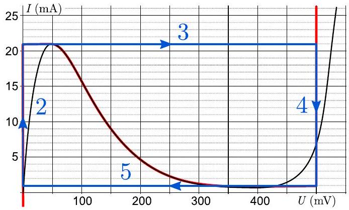
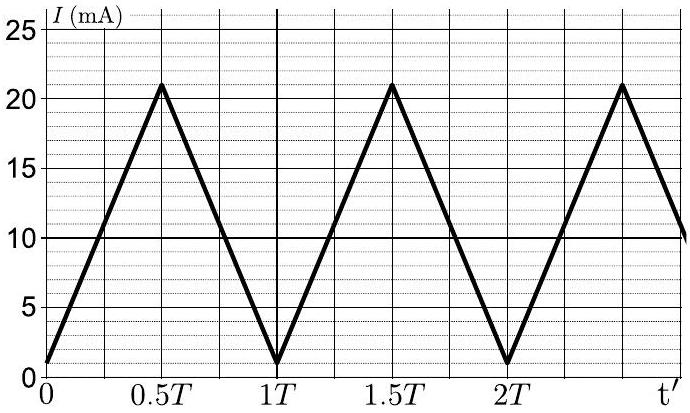
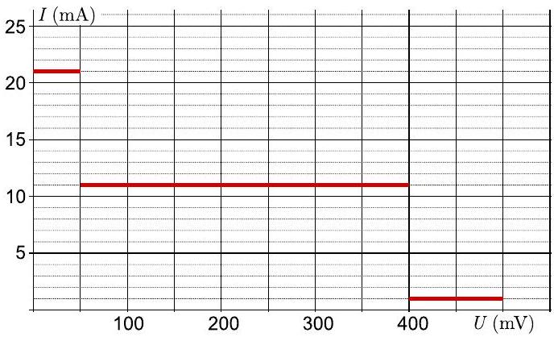
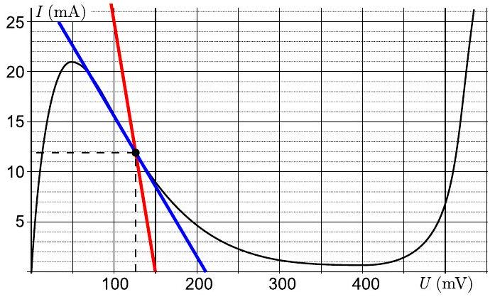
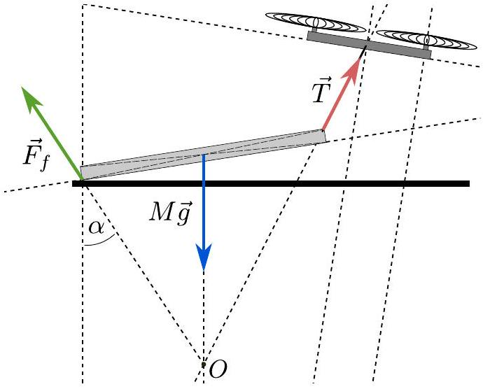
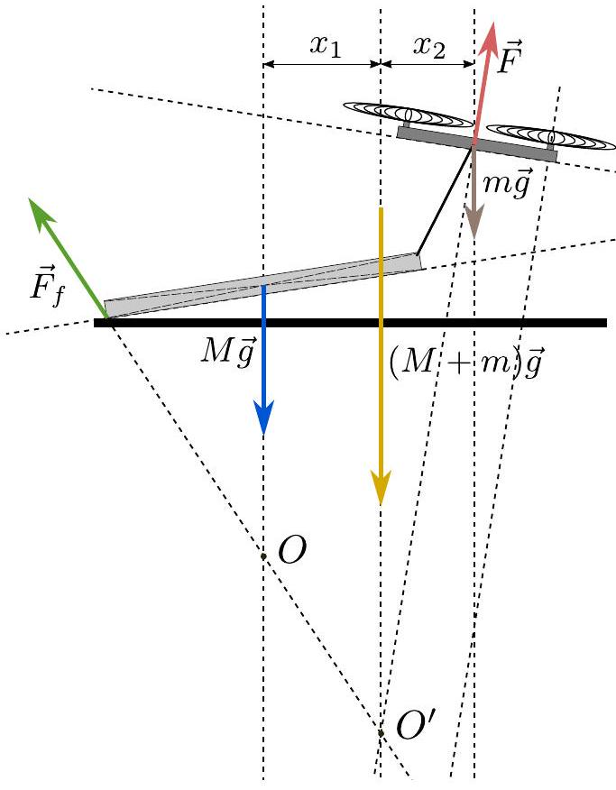
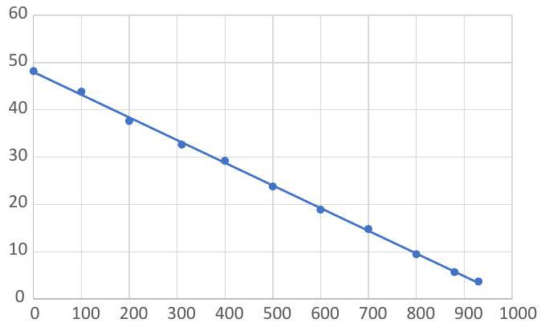

1. Phases of water (6 points) - Solution by Johan Runeson, grading schemes by Johan Runeson and Adam Warnerbring.
i) (1.5 points) We approximate the volume difference by the volume of the gas and use the ideal gas law: $V _ { g } - V _ { l } \approx V _ { g } = \frac { n R T } { m p } = \frac { R T } { \mu p }$. Then it follows from the law of Clausius-Clapeyron that

$$
\frac { \mathrm { d } p } { p } = \frac { \mu \left| \Delta H _ { l g } \right| } { R T ^ { 2 } } \mathrm {~d} T
$$

which after integration gives

$$
p = p _ { 0 } \exp \left( - \frac { \mu \left| \Delta H _ { l g } \right| } { R T } \right) ,
$$

where $p _ { 0 }$ is a reference pressure. We also accept introducing a reference temperature $T _ { 0 }$ so that

$$
\begin{equation*}
p = p _ { 0 } ^ { \prime } \exp \left[ - \frac { \mu \left| \Delta H _ { l g } \right| } { R } \left( \frac { 1 } { T } - \frac { 1 } { T _ { 0 } } \right) \right] , \tag{1}
\end{equation*}
$$

where $p _ { 0 } ^ { \prime }$ is another reference pressure.
Grading: Using ideal gas law - 0.5 pts; Writing correct differential equation - 0.2 pts;
Solution has exponential dependence of $1 / T$ - 0.6 pts;
Correct solution overall - $\mathbf { 0 . 2 }$ pts;
ii) (1.5 points) For any two points on the liquid-gas transision curve it holds that

$$
\frac { p _ { 2 } } { p _ { 1 } } = \exp \left( - \frac { \mu \left| \Delta H _ { l g } \right| } { R } \left[ \frac { 1 } { T _ { 2 } } - \frac { 1 } { T _ { 1 } } \right] \right) ,
$$

assuming that $\Delta H _ { l g }$ is constant. Using for example $T _ { 1 } = 0 ^ { \circ } \mathrm { C } , p _ { 1 } = 610 \mathrm {~Pa} , T _ { 2 } = 10 ^ { \circ } \mathrm { C }$ and $p _ { 2 } = 1230 \mathrm {~Pa}$ (with temperatures converted to kelvin), we get $\left| \Delta H _ { l g } \right| = 2503 \mathrm {~kJ} / \mathrm { kg }$. Using this together with $T _ { 3 } = 15 ^ { \circ } \mathrm { C } = 283.15 \mathrm {~K}$ and $T _ { 4 } = T _ { 3 } + 3 \mathrm {~K}$ gives

$$
\frac { p _ { 4 } - p _ { 3 } } { p _ { 3 } } = \exp \left( - \frac { \mu \left| \Delta H _ { l g } \right| } { R } \left[ \frac { 1 } { T _ { 4 } } - \frac { 1 } { T _ { 3 } } \right] \right) - 1 = 0.21 .
$$

That is, the vapor pressure rises by 21\%. (This means that the water cycle will be enhanced, so that we can on average expect more humid weather after global warming. On the other hand, the Earth is not homogeneous, and in reality it is expected that wet locations become more wet while dry locations become more dry.)

Grading: Found $\Delta H _ { l g }$ by measuring in graph - $\mathbf { 0 . 4 }$ pts;
Numerical value for $\left| \Delta H _ { l g } \right|$ correct within 10\% - $\mathbf { 0 . 3 }$ pts;
Correct formula for $p _ { 2 } / p _ { 1 } - \mathbf { 0 . 3 } \mathbf { p t s }$; Correct percentage ±2\% - 0.5 pts;

Grading for alternative solution: Extrapolation via derivative - 0.5 pts;
Correct expression for final result - $\mathbf { 0 . 5 }$ pts; Correct percentage ±2\% - 0.5 pts;
iii) (3 points) First, look at the solid-gas transition line and assume also here that $V _ { g } - V _ { s } \approx V _ { g }$. This gives a similar curve as for the liquid-gas transition but with a different transition enthalpy. From $T _ { 5 } = 0 ^ { \circ } \mathrm { C }$, $p _ { 5 } = 610 \mathrm {~Pa} , T _ { 6 } = - 10 ^ { \circ } \mathrm { C }$ and $p _ { 6 } = 260 \mathrm {~Pa}$, we get the sublimation enthalpy $\left| \Delta H _ { s g } \right| =$ 2828 kJ/kg . This allows us to compute the melting enthalpy as

$$
\left| \Delta H _ { s l } \right| = \left| \Delta H _ { s g } \right| - \left| \Delta H _ { l g } \right| = 325 \mathrm {~kJ} / \mathrm { kg } .
$$

To measure the slope of the melting curve we draw a tangent in the origin and measure (for example) $\Delta T = 5 \mathrm {~K}$ and $\Delta p = - 0.65 \times 10 ^ { 8 } \mathrm {~Pa}$. With $T = 273.15 \mathrm {~K}$, the law of Clausius-Claperyron finally gives

$$
V _ { l } - V _ { s } = \frac { \Delta T } { \Delta p } \frac { \left| \Delta H _ { s l } \right| } { T } = - 9.2 \times 10 ^ { - 5 } \mathrm {~m} ^ { 3 } / \mathrm { kg } .
$$

(The experimental value is $- 9.1 \times 10 ^ { - 5 } \mathrm {~m} ^ { 3 } / \mathrm { kg }$.) Note that ice has a larger volume than liquid water, which is an exception from most other substances.

Grading: Found $\Delta H _ { s g } - \mathbf { 0 . 5 }$ pts; Found $\Delta H _ { s l } - \mathbf { 0 . 5 p t s }$; Using slope of melting curve - $\mathbf { 0 . 5 ~ p t s }$; Accurately measuring the slope of the melting curve near atmospheric pressure - $\mathbf { 0 . 5 }$
pts;
Correct result within 50\% - 0.5 pts; Correct result within 10\% - 0.5 pts; Wrong sign - -0.5 pts;
2. Tunnel diode (10 points) - Solution by Taavet Kalda, grading schemes by Jaan Kalda, Axel Boeltzig, Bastian Hacker, and Fedor Tsybrov.
i) (1 point) Kirchhoff's voltage law (KVL) on the circuit:

$$
\mathscr { E } = I _ { i } r + V _ { i } .
$$

Rearranging,

$$
\begin{equation*}
I _ { i } = \frac { \mathscr { E } - V _ { i } } { r } = 25 \mathrm {~mA} - \frac { 1 } { 2 \Omega } V _ { i } . \tag{2}
\end{equation*}
$$

$V _ { i }$ and $I _ { i }$ also have to obey the diode's $V - I$ curve. We can find a solution graphically by plotting (2) on the $\boldsymbol { V } - \boldsymbol { I }$ curve. This yields $V _ { i } = 20 \mathrm { mV } , I _ { i } = 15.3 \mathrm {~mA}$.

Grading: Writing down correct KVL - 0.3 pts;
drawing a correct line on V-I curve or explaining this procedure clearly in text - $\mathbf { 0 . 3 }$ pts (attempts of substituting the diode with equivalent resistance, only if numerically reasonable equivalent resistance - $\mathbf { 0 . 1 }$ pts; obtaining correct numerical value for $\boldsymbol { I }$ (from 15 to 15.5 mA) - 0.2 pts (for $I$ from 14 to 16 $\mathrm { mA } - 0.1 \mathrm { pts } )$; for correct numerical value for $\boldsymbol { V }$ (from 19 to 20 mV ) - $\mathbf { 0 . 2 }$ pts (for $V$ from 18 to 22 mV - 0.1 pts). If the pair of values is not consistent with the KVL (voltage mismatch is $\geq 1 \mathrm { mV }$ ), subtract 0.1 from the voltage value subscore (if it was positive). No marks for the numerical values if obtained in a wrong way.
ii) (1 point) After setting $r = 0$, the KVL takes the form

$$
\begin{equation*}
\mathscr { E } = V _ { i } + L \frac { \mathrm {~d} I _ { i } } { \mathrm {~d} t } . \tag{3}
\end{equation*}
$$

Rearranging and integrating,

$$
L \int _ { 0 } ^ { I _ { 1 } } \frac { \mathrm {~d} I _ { i } } { \left. \mathscr { E } - V _ { i } \left( I _ { i } \right) \right) } = \int _ { 0 } ^ { t _ { 1 } } \mathrm {~d} t .
$$

Looking at the idealised $\boldsymbol { V } - \boldsymbol { I }$ dependence, it's clear that $V _ { i } \left( I _ { i } \right) = 0$ all throughout the increase of current from $I _ { i } = 0$ to $I _ { i } = I _ { 1 } =$ 20 mA . This simplifies the expression for $t _ { 1 }$ :

$$
t _ { 1 } = \frac { L } { \mathscr { E } } \int _ { 0 } ^ { I _ { 1 } } \mathrm {~d} I _ { i } = \frac { L I _ { 1 } } { \mathscr { E } } = 4 \times 10 ^ { - 8 } \mathrm {~s} .
$$

Grading:
Writing down correct KVL - $\mathbf { 0 . 3 }$ pts; Integrate equation - $\mathbf { 0 . 2 }$ pts; Note that $V _ { i } \left( I _ { i } \right) = 0 - \mathbf { 0 . 2 }$ pts; Correct result for $t _ { 1 } - \mathbf { 0 . 2 }$ pts;
iii) (1 point) Equation (3) must hold no matter what the characteristic curve for the diode looks like. This means that the current will continue to rise without any discontinuities, even if it means the voltage on the diode will jump (the inductance keeps the current from changing too fast but there is no such constraint on the voltage). The expected behaviour of $V - I$ is given in the following figure:

In leg 2 of the journey, the current increases from $I _ { i } = 0$ to $I _ { i } = I _ { 2 } = 21 \mathrm {~mA}$ (measured from the figure). The time taken is $t _ { 2 } = L I _ { 2 } / \mathscr { E } = 4.2 \times 10 ^ { - 8 } \mathrm {~s}$. Since in leg 3, the change in current is 0, the time taken is essentially instantaneous compared to $t _ { 2 }$. Hence $t _ { 3 } = 0$ for our considerations. The total time taken is then

$$
t _ { 2 } + t _ { 3 } = 4.2 \times 10 ^ { - 8 } \mathrm {~s} .
$$

Grading:
Description / understanding of the processes - 0.5 pts;
Calculation $t _ { 2 } - \mathbf { 0 . 2 }$ pts;
Result $t _ { 2 } + t _ { 3 } - \mathbf { 0 . 3 }$ pts;
iv) (2 points) We can use similar logic as before to deduce how the voltage and current behave as a function of time. Since the equilibrium voltage $\mathscr { E } = 250 \mathrm { mV }$ lies between the two peaks in the $\boldsymbol { V } - \boldsymbol { I }$ curve, the current will perform a horizontal jump as before. At $\boldsymbol { V } _ { \mathbf { 2 } } =$ 500 mV, equation (3) takes the form

$$
\mathscr { E } = V _ { 2 } + L \frac { \mathrm {~d} I _ { i } } { \mathrm {~d} t } ,
$$

so

$$
\frac { \mathrm { d } I } { \mathrm {~d} t } = \frac { \mathscr { E } - V _ { 2 } } { L } < 0 .
$$

Hence, $I _ { i }$ will continue to decrease from $I _ { 2 }$ to $I _ { 3 } = 1 \mathrm {~mA}$. Like before, the voltage will then instantaneously jump from $V _ { 2 }$ to 0 and the cycle starts again. A sketch of a single cycle is shown in the following figure.

The time taken in legs 3 and 5 are effectively 0 and because the deviation of the voltage from $\mathscr { E }$ in legs 2 and 4 is the same, alongside with the change in current, the time duration for 2 and 4 must also be the same. The change in current is $I _ { 2 } - I _ { 3 } =$ $20 \mathrm {~mA} = I _ { 1 }$. Hence $t _ { 2 } = t _ { 4 } = t _ { 1 }$ and the duration of one full period is $T = t _ { 2 } + t _ { 3 } + t _ { 4 } + t _ { 5 } =$ $2 t _ { 1 } = 8 \times 10 ^ { - 8 } \mathrm {~s}$. A sketch of $I$ as a function of time is shown in the following figure. $t ^ { \prime }$ has the moment when the current is at its minimum at $t ^ { \prime } = 0$.

Grading:
Writing down correct KVL at $V _ { 2 } - \mathbf { 0 . 3 ~ p t s }$; Argument that $\Delta t _ { 3 }$ and $\Delta t _ { 5 } = 0 - \mathbf { 0 . 3 ~ p t s }$; Calculation $\Delta t _ { 4 } - \mathbf { 0 . 3 }$ pts;
Period of oscillation - $\mathbf { 0 . 3 ~ p t s }$;
Amplitude of oscillation - $\mathbf { 0 . 3 ~ p t s }$;
Offset of oscillation - $\mathbf { 0 . 2 }$ pts;
Correct plot, starting from $I = 0 - \mathbf { 0 . 3 }$ pts;
v) (2 points) The system operates in 4 distinct modes as the battery voltage is varied:
1. Applied voltage is smaller than the first peak in the $\boldsymbol { V } - \boldsymbol { I }$ curve. In that case, the current will increase from 0 to $I =$ 21 mA and reach the equilibrium position at $V = \mathscr { E }$. Indeed, it's an equilibrium because it satisfies KVL given by (3):
$$
\frac { \mathrm { d } I } { \mathrm {~d} t } = 0 = \frac { \mathscr { E } - V } { L } .
$$
Hence, the ammeter measures a constant 21 mA.
2. Applied voltage is between the two peaks in the $\boldsymbol { V } - \boldsymbol { I }$ curve. The system will follow a similar trajectory to the one exhibited in iv) since the same argumentation holds. Following the same notation as in iv), the average current in leg 2 is the arithmetic average between 1 mA and 21 mA (because the current is increasing at a constant rate). Leg 2 thus has an average current of 11 mA . Leg 4 similarly has the same average current. Leg 3 and 5 don't contribute to the average current because they happen effectively instantaneously. The total average current is then 11 mA .
3. Applied voltage is bigger than the second peak in the $\boldsymbol { V } - \boldsymbol { I }$ curve but smaller than 500 mV. In the beginning, the current will increase to 21 mA and make a horizontal jump, just as expected. Then the current will decrease to 1 mA and the voltage takes the value of the battery and reaches an equilibrium without performing any additional jumps. The average current is thus 1 mA .
4. If the applied voltage is bigger than 500 mV , then the current will blow up to infinity (in our ideal model) and that's not physical. Hence, the current is undefined.
From the $\boldsymbol { V } - \boldsymbol { I }$ curve, the first peak has a voltage of $V _ { 3 } = 50 \mathrm { mV }$, second a voltage of $V _ { 4 } = 400 \mathrm { mV }$. The four scenarios can be summarised in the following plot:

Grading: For each of the four modes, Identification - 0.2 pts;
Determination of constant value - $\mathbf { 0 . 3 ~ p t s }$;
vi) (1 point)

First, we'll find the operational mode using the same graphical method as in part i). The graphed line has an equation of

$$
I _ { i } = \frac { \mathscr { E } - V _ { i } } { r } = 75 \mathrm {~mA} - \frac { 1 } { 2 \Omega } V _ { i } ,
$$

shown in red in the figure. The steady voltage and current are measured to be $V _ { 0 } = 125 \mathrm { mV }$ and $I _ { 0 } = 11.9 \mathrm {~mA}$. For small perturbations from the steady state, we can use Taylor series while neglecting higher orders:

$$
V _ { 0 } + \delta V ( t ) = V \left( I _ { 0 } + \delta I ( t ) \right) \simeq V _ { 0 } + \left. \delta I ( t ) \frac { \mathrm { d } V } { \mathrm {~d} I } \right| _ { I _ { 0 } } .
$$

Therefore

$$
\delta V = \left. \frac { \mathrm { d } V } { \mathrm {~d} I } \right| _ { I _ { 0 } } \delta I = R _ { d } \delta I
$$

We can express $\left. \frac { \mathrm { d } V } { \mathrm {~d} I } \right| _ { I _ { 0 } }$ graphically by drawing a line tangent to the $\boldsymbol { V } - \boldsymbol { I }$ curve going through the steady state. The derivative is then found by dividing the horizontal projection with the vertical, while keeping track of

the sign:

$$
R _ { d } = \left. \frac { \mathrm { d } V } { \mathrm {~d} I } \right| _ { I _ { 0 } } = \frac { 178 \mathrm { mV } } { - 25 \mathrm {~mA} } = - 7.1 \Omega .
$$

Grading: Writing down correct KVL - 0.1 pts;
drawing a correct line on V-I curve or explaining this procedure clearly in text - $\mathbf { 0 . 2 }$ pts; obtaining correct numerical value for $\boldsymbol { I }$ (from 11 to 13 mA) - 0.1 pts;
for correct numerical value for $\boldsymbol { V }$ (from 115 to 135 mV) - $\mathbf { 0 . 1 }$ pts;
for drawing tangent line to the curve through the intersection point - $\mathbf { 0 . 2 }$ pts;
determining correctly $\boldsymbol { R } _ { \boldsymbol { d } }$ as the slope of the tangent (from -6.5 to -7.6) - $\mathbf { 0 . 3 ~ p t s }$; if the result is from -6 to -8-0.2 pts, if it is from from - 5 to $- \mathbf { 9 } - \mathbf { 0 . 1 }$ pts. Zero marks if the minus sign is missing.
If final result is correct, but the values of $\boldsymbol { I } _ { 0 }$ and $V _ { 0 }$ not shown, no penalty is applied.
vii) (2 points)In order to find the stability condition, one could operate with complex impedances and write down the resonance condition

$$
r + \mathrm { i } \omega L + \frac { R _ { d } } { \mathrm { i } \omega R _ { d } C + 1 } = 0
$$

hence, denoting $\lambda = \mathrm { i } \omega$,

$$
( r + \lambda L ) \left( \lambda R _ { d } C + 1 \right) + R _ { d } = 0 .
$$

A more tedious but perhaps clearer way would be to write down the KVL and solve the resulting differential equation.

Let the deviation of the charge on the capacitor from steady state be $\delta q$. Then, from KVL, $\delta I R _ { d } = \delta q / C$. Hence, the current through the resistor $r$ and inductor is $\delta I + \dot { \delta q }$, where $\dot { \delta q } = \dot { \delta I } R _ { d } C$. KVL for the whole circuit takes the form

$$
\begin{aligned}
0 & = ( \delta I + \dot { \delta q } ) r + L \frac { \mathrm {~d} } { \mathrm {~d} t } ( \delta I + \dot { \delta q } ) + \delta I R _ { d } \\
& = R _ { d } L C \ddot { \delta } I + \left( L + R _ { d } r C \right) \dot { \delta I } + \left( R _ { d } + r \right) \delta I \\
& = \ddot { \delta I } + \left( \frac { 1 } { R _ { d } C } + \frac { r } { L } \right) \dot { \delta I } + \frac { r + R _ { d } } { R _ { d } L C } \\
& = \ddot { \delta I } + b \dot { \delta I } + c ,
\end{aligned}
$$

where $b = \left( \frac { 1 } { R _ { d } C } + \frac { r } { L } \right) , c = \frac { r + R _ { d } } { R _ { d } L C }$. This is a second order differential equation. Depending on the values for $\boldsymbol { b }$ and $\boldsymbol { c }$, the solution might grow exponentially. The standard method for solving this type of equation involves making an educated guess and plugging it into the equation. In this case, an exponential solution of the form $\delta I =$ $\delta I _ { 0 } \exp ( \lambda t )$ will work. Note that this is all equivalent to operating with complex impedances but with $\lambda = \mathrm { i } \omega$. substituting the ansatz into the differential equation and reducing the prefactors, one gets the characteristic equation:

$$
\lambda ^ { 2 } + b \lambda + c = 0 .
$$

This is a quadratic equation with two solutions

$$
\lambda _ { 12 } = - \frac { b } { 2 } \pm \sqrt { \frac { b ^ { 2 } } { 4 } - c } .
$$

$\lambda _ { 12 }$ can be either both real or both complex, depending on the sign of the discriminant. If $\lambda _ { j } = m _ { j } + n _ { j } \mathbf { i }$, where $m$, and $n$ are both real, then

$$
\delta I = \sum _ { j = 1 } ^ { 2 } \delta I _ { 0 j } \mathrm { e } ^ { m _ { j } t } \left( \cos \left( n _ { j } t \right) + \mathrm { i } \sin \left( n _ { j } t \right) \right) .
$$

It can be seen that for the solution to be stable, $m < 0$ is needed as that leads to an exponential decay in the current. In other words, the real part of $\lambda$ has to always be negative, otherwise the current will start growing exponentially. With careful analysis, it's possible to determine necessary conditions for $b$ and $c$ for this to be the case.

Vieta's second formula states that $\lambda _ { 1 } \lambda _ { 2 } =$ $c$. If $\lambda$ is real, then this means that $c$ has to be positive, because otherwise either $\lambda _ { 1 }$ or $\lambda _ { 2 }$ is negative. If $\lambda$ is complex, then $\lambda _ { 2 }$ and $\lambda _ { 1 }$ are each-other's complex conjugates and so their product must be positive. Hence, $c > 0$ regardless of whether $\lambda$ is real or complex.

According to Vieta's first formula, $\lambda _ { 1 } +$ $\lambda _ { 2 } = - b$. If $\lambda$ is real, then their sum has to be negative, otherwise at least one of $\lambda _ { 1 }$ and $\lambda _ { 2 }$ is positive. Hence, $b > 0$. If $\lambda$ is complex, then their sum is purely real (because they're each-other's complex conjugates) and hence again, the sum has to be negative for the real parts to be negative. Hence, $b > 0$ must always hold.

The $b > 0$ and $c > 0$ are necessary and sufficient conditions for the solution to be stable. Condition $b > 0$ implies

$$
\left( \frac { 1 } { R _ { d } C } + \frac { r } { L } \right) > 0
$$

so

$$
L < \left| R _ { d } \right| r C = 4.3 \times 10 ^ { - 10 } \mathrm { H } = 0.43 \mathrm { nH } .
$$

Inequality $c > 0$ implies

$$
\frac { r + R _ { d } } { R _ { d } L C } > 0 ,
$$

hence

$$
r + R _ { d } < 0 .
$$

As can be seen, the value for $\boldsymbol { L }$ can't exceed 0.43 nH .

Grading: consideration of current small deviation - 0.1 pts;
relationship between capacitor charge $\delta q$ and diod current $\delta I - \mathbf { 0 . 1 }$ pts; initial KVL for whole circuit - $\mathbf { 0 . 3 ~ p t s }$; correct differential equation - 0.3 pts; quadratic equation - 0.2 pts; analyze of quadratic equation according to the problem - 0.6 pts; expression for inductance: $L < \left| R _ { d } \right| r C - \mathbf { 0 . 3 }$
pts;
numerical answer: $L < 0.43 n H - \mathbf { 0 . 1 }$ pts;
3. Conical room (3 points) - Solution by Taavet Kalda, grading schemes by Maurice Zeuner, Eugen Dizer, and Titus Bornträger. If the distance from the base to the apex is $H$, then from energy conservation

$$
g H = \frac { v _ { 0 } ^ { 2 } } { 2 } .
$$

Let the shortest distance from the base to the wall be $h$ and the sought minimal speed $v _ { 1 }$. From geometry, $h = H \sin \alpha$. Let's consider a new system of coordinates where the two axis $x ^ { \prime }$ and $y ^ { \prime }$ are parallel and perpendicular to the wall respectively. Gravitational acceleration has components $g _ { x ^ { \prime } } = g \cos \alpha$ and $g _ { y ^ { \prime } } = g \sin \alpha$. It is clear that the motion along the $x ^ { \prime }$ axis doesn't affect whether the projectile hits the wall. Because the motions in the $x ^ { \prime }$ and $y ^ { \prime }$ direction are independent, one has to set the component of $\vec { v } _ { 1 }$ parallel to $x ^ { \prime }$ to 0 in order to minimize the total speed.

Then the problem reduces to hitting a projectile into a conventional ceiling of height $h$ in effective gravity $g \sin \alpha$. Thus, from energy conservation,

$$
g \sin \alpha h = g H \sin ^ { 2 } \alpha = \frac { v _ { 1 } ^ { 2 } } { 2 } .
$$

And so

$$
v _ { 1 } = v _ { 0 } \sin \alpha = \frac { \sqrt { 3 } } { 2 } v _ { 0 } .
$$

Grading: We expect to see mostly two different solution schemes. The first one is the given sample solution using the coordinate transformation. The second one is by mathematically deriving the intersection points of the trajectory with the walls.

Grading for sample solution: Deriving the relation $g H = v _ { 0 } ^ { 2 } / 2$. - $\mathbf { 0 . 5 }$ pts; Using the relation $h = H \sin \alpha$. - $\mathbf { 0 . 5 }$ pts; Change of coordinate system and splitting the gravitational force - $\mathbf { 1 . 0 }$ pts; Further calculation - $\mathbf { 0 . 5 }$ pts; Correct result for $v _ { 1 } - \mathbf { 0 . 5 }$ pts.

Grading for alternative methods: Deriving the relation $g H = v _ { 0 } ^ { 2 } / 2$. - $\mathbf { 0 . 5 }$ pts; Equations of motion and derivation of the trajectory $y ( x )$ of the projectile - $\mathbf { 0 . 5 }$ pts; Mathematical description of wall - $\mathbf { 0 . 3 ~ p t s }$; Solving for intersection points and choosing the physical solution - 0.7 pts; Finding the optimal angle for minimum velocity (first derivative of velocity with respect to initial angle must be zero) - 0.5 pts; Correct result for $v _ { 1 } - \mathbf { 0 . 5 }$ pts.
4. Drone (9 points) - Solution by Taavet Kalda, grading schemes by Oleg Košik, Jānis Cimurs, and Joonas Kalda.
i) (2 points) Let the mass of the cuboid be $M$. There are three forces acting on the drone: the resultant of friction and the normal force $\vec { F } _ { f }$, rope tension $\vec { T }$ directed along the rope, and gravitational acceleration $M \vec { g }$ directed vertically down from the centre of the cuboid. Since the cuboid is sliding with constant speed, the three forces must balance each other out. The only way for this to be possible is if the vectorial extensions of the forces intersect in one point, $O$.

One can prove this by contradiction. If the forces don't intersect in a single point, one needs only consider the torque around one of the intersection points to see that there is non-zero torque and that the forces aren't in equilibrium.

If the normal force is $\boldsymbol { N }$, then the frictional force is $N \mu$ so the resultant $\vec { F } _ { f } = N \hat { y } -$ $N \mu \hat { x }$. Therefore, $\vec { F } _ { f }$ is always directed at an angle $\alpha = \arctan \mu$ with respect to the vertical.

Since the starting point and direction of the forces of gravity and tension are known, one can reconstruct the position of $\boldsymbol { O }$ and $\vec { F } _ { f }$. Because $\mu = \tan \alpha$, one can conveniently measure $\mu$ as the ratio of the horizontal and vertical projection of $\vec { F } _ { f } : \mu \approx 0.659$.

ii) (2 points) Consider the system made up of the cuboid and the drone. Once again, there are three forces acting on this system: gravitational force $( M + m ) \vec { g }$, friction $\vec { F } _ { f }$, and the force $\overrightarrow { \boldsymbol { F } }$ keeping drone afloat. The thrust for the drone is directed along the symmetry axis of the drone. Since the forces are in equilibrium, their extensions must intersect in one point $\boldsymbol { O } ^ { \prime }$. Owing to the last part, $\boldsymbol { O } ^ { \prime }$ can be found by intersecting the frictional force and the thrusting force. Since gravitational force is vertical, we can find the horizontal projection of the centre of mass. If $x _ { 1 }$ and $x _ { 2 }$ are the horizontal distances from $\boldsymbol { O } ^ { \prime }$ to the centres of the cuboid and drone respectively, then

$$
\frac { x _ { 1 } } { x _ { 2 } } = \frac { M } { m } .
$$

From the figure we measure $x _ { 1 } / x _ { 2 } = 0.796$ and so

Grading for i) and ii)
Solutions that use force balance and torque balance in i) and force balance in ii):
i) correctly identifying all forces acting on cuboid - 0.2 pts;
use that $\mu = \frac { F _ { f } } { N }$, where $F _ { f }$ is friction force and $N$ is normal force - $\mathbf { 0 . 2 }$ pts; writing force balance equations using angles - 0.4 pts;
writing torque balance equation - $\mathbf { 0 . 4 }$ pts; deriving $\mu$ - $\mathbf { 0 . 4 }$ pts;
numerical result with high enough precision - 0.4 pts; (error within 5\% - 0.4pts, error within 10\% - 0.2pts)
ii) correctly identifying all forces acting on drone - $\mathbf { 0 . 2 }$ pts;
writing force balance equations using angles - 0.6 pts;
combining with equations form part i) and deriving $\boldsymbol { M } \boldsymbol { - } \mathbf { 0 . 8 }$ pts;
numerical result with high enough precision - 0.4 pts; (error within 5\% - 0.4pts, error within 10\% - 0.2pts)

Remark. Solutions that assume that cuboid is linear, get 0 for precision for both parts i) and ii), but there are no deductions for deriving $\mu$ and $M$.

Solutions that use point $O$ in $\boldsymbol { i }$ ):
Correctly identifying all forces acting on cuboid - 0.2 pts;
Use fact that vectorial extensions intersect at one point or another way to take into account torque balance for point $\boldsymbol { O } - \mathbf { 0 . 8 }$ pts;
Use that $\mu = \tan \alpha$ or $\mu = \frac { F _ { f } } { N }$, where $F _ { f }$ is friction force and $N$ is normal force - $\mathbf { 0 . 2 }$ pts; Deriving $\boldsymbol { \mu }$ - $\mathbf { 0 . 4 }$ pts;
Numerical result with high enough precision - 0.4 pts.

Solutions that use point $O$ ' in ii):
Correctly identifying all forces acting on system - $\mathbf { 0 . 2 }$ pts;
Use fact that vectorial extensions intersect at one point or another way to take into account torque balance for point $\boldsymbol { O } ^ { \prime } - \mathbf { 0 . 8 ~ p t s }$;
Use torque balance for gravitational forces - 0.4 pts;
Express formula for mass $M - \mathbf { 0 . 2 }$ pts;
Numerical result with high enough precision - 0.4 pts.
iii) (2 points) Imagine a pocket of air with fixed mass moving around in the atmosphere. Let the pocket's volume be $\boldsymbol { V } = \boldsymbol { V } ( \boldsymbol { z } )$. In an adiabatic atmosphere, $p V ^ { \gamma } =$ const, where $\gamma = c _ { p } / c _ { v } = 1.39$. Now, $p V \propto T$ and $\rho \propto V ^ { - 1 }$, so

$$
p V ^ { \gamma } \propto V ^ { \gamma - 1 } T \propto \rho ^ { 1 - \gamma } T = \text { const. }
$$

Hence,

$$
\rho ( z ) = \rho _ { 0 } \left( \frac { T ( z ) } { T ( 0 ) } \right) ^ { \frac { 1 } { \gamma - 1 } } = \rho _ { 0 } \left( 1 - \frac { g z } { c _ { p } T _ { 0 } } \right) ^ { \frac { 1 } { \gamma - 1 } } .
$$

Grading: There are two expected solutions. One of them is given by the sample solution while the other involves integrating $\mathrm { d } \rho$ from $z = 0$ to $z$.
Grading for sample solution:
Using or deriving the adiabatic relation $p V ^ { \gamma } =$ const $- \mathbf { 0 . 6 }$ pts;

Using or deriving an expression for $\gamma = c _ { p } / c _ { v }$ - 0.2 pts;
Deriving an exact expression for $\rho$, or obtaining its dependence on $\boldsymbol { V }$ and/or on $\boldsymbol { p } , \boldsymbol { T }$ - 0.6 pts;
Obtaining the correct expression for $\boldsymbol { \rho } \boldsymbol { - } \mathbf { 0 . 6 }$ pts;
Grading for alternative solution:
Using or deriving the relation for the pressure change $\mathrm { d } p ( z ) = - \rho ( z ) g \mathrm {~d} z - \mathbf { 0 . 1 }$ pts; Using the relation $c _ { p } - c _ { v } = R / \mu - \mathbf { 0 . 2 }$ pts; Using ideal gas law or equivalent to get another differential - $\mathbf { 0 . 3 ~ p t s }$;
Obtaining an expression for $\boldsymbol { \rho }$ in terms of other quantities of interest - $\mathbf { 0 . 6 ~ p t s }$;
Correctly setting up the integral for $\rho$ and $\boldsymbol { z }$ or equivalent quantities - $\mathbf { 0 . 2 }$ pts;
Obtaining the correct expression for $\boldsymbol { \rho } \boldsymbol { - } \mathbf { 0 . 6 }$ pts;
iv) (3 points) The drone stays afloat by using the motor to push air through its propellers. The amount of thrust is clearly a function of the density of the air and the speed $v$ at which air goes through the propellers.

Force balance can be written down as $\boldsymbol { F }$ $m _ { \text {tot } } g = 0$, where $F$ is the vertical thrust and $m _ { \text {tot } }$ the total mass of the drone. If $A$ is the effective area of the propellers, it's possible to write down the expression for $\boldsymbol { F }$ by either using the dynamical pressure $\rho v ^ { 2 }$ or by considering the conservation of momentum. In a time interval $\Delta t$, a volume of $\Delta V = A v \Delta t$ of air passes through the propellers. The air volume carries momentum $\Delta p = \Delta V \rho v$, so the thrust is given by $F = \Delta p / \Delta t = A \rho v ^ { 2 }$.

Secondly, it's possible to tie the power output $P$ of the motor with outside air density and speed. Notably, the air is pushing the propellers vertically up with a force $F$. In order to function, the propeller blades need to be slanted. This amounts to a torque that's proportional to $F$. Further, it's clear that the rotational speed of the propeller blades is also proportional to $v$. This means that the output power of the motor is proportional to the product of $F$ and $v$ and so $P \propto \rho v ^ { 3 }$. In our considerations, the output power of the drone is fixed so $v \propto \rho ^ { - 1 / 3 }$ and $\boldsymbol { F } \propto \rho \left( \rho ^ { - 1 / 3 } \right) ^ { 2 } =$ $\rho ^ { 1 / 3 }$. From force balance, $F = m _ { \text {tot } } g$. Hence, $m _ { \text {tot } } \propto \rho ^ { 1 / 3 }$. Evaluating the ratio at $z = 0$ and $z = z _ { \text {max } }$, one gets

$$
\frac { 1.5 m } { m } = \left( \frac { \rho ( 0 ) } { \rho \left( z _ { \max } \right) } \right) ^ { 1 / 3 } = \left( 1 - \frac { g z _ { \max } } { c _ { p } T _ { 0 } } \right) ^ { - \frac { 1 } { 3 ( \gamma - 1 ) } } ,
$$

and so

$$
z _ { \max } = \frac { c _ { p } T _ { 0 } } { g } \left( 1 - 1.5 ^ { - 3 ( \gamma - 1 ) } \right) = 11.3 \mathrm {~km} .
$$

Grading: Writing down the force balance equation - 0.4 pts;
Deriving a relation between the thrust and the air density and speed by either considering momentum conservation over a small time interval or using the expression for dynamical pressure - $\mathbf { 0 . 8 }$ pts;
Tying the motor power with air density and speed - 0.6 pts;
Finding a relation between the maximum lift power and air density - 0.4 pts;
Evaluating the two conditions for maximum lift power of the drone at $z = 0$ and $z = z _ { \text {max } } -$ 0.2 pts;
Obtaining the correct expression for $z _ { \text {max } }$ - 0.4 pts;
Obtaining the correct numerical value for $z _ { \text {max } } - 0.2$ pts;
5. Bottle's sound (8 points) - Solution by Jaan Kalda, marking schemes by Eero Uustalu (task i), Topi Löytäinen, and Miha Marttinen (tasks ii, iii).
i) (4 points) The following frequencies can be obtained for 1-litre bottle, measured frequency of sound is tabulated versus the volume of water in the bottle.

| V (ml) | 0 | 100 | 200 | 310 | 400 |  |
| :--- | :--- | :--- | :--- | :--- | :--- | :--- |
| f (Hz) | 144 | 151 | 163 | 175 | 185 |  |
| V (ml) | 500 | 600 | 700 | 800 | 880 | 930 |
| f (Hz) | 205 | 230 | 260 | 325 | 420 | 520 |

Grading: The measurement data give evidence that volumes have been measured correctly: 0.2 pts (for instance, if a portion of water was added without making a notice of it, all the subsequent volumes are offset by a certain amount, and in that case, this 0.2 pts is not awarded)

There is at least one measurement with empty bottle $( V = 0 ) 0.2$ pts.
There is at least one measurement with less than 10\% of the bottle's volume being empty 0.2 pts.
There is at least one measurement in each of the volume ranges: $0 < V / V _ { 0 } \leq 20 \%$; $20 < V / V _ { 0 } \leq 40 \% ; 40 < V / V _ { 0 } \leq 60 \% ;$ $60 < V / V _ { 0 } \leq 70 \% ; 70 < V / V _ { 0 } \leq 80 \% ;$ $80 < V / V _ { 0 } \leq 90 \% ; \mathbf { 0 . 2 }$ pts.

Quality of measurements: in $f ^ { - 2 }$ versus $V$ graph, the data should lie on a strait line. Every point (up to 10th point) which is "good", i.e. lies on a line - 0.2 pts. If an outlier point corresponds to the second harmonic, 0.1 pts is given instead of 0.2 pts.

Volume of the bottle measured: 0.2 pts. If volume is not measured but read from the label - 0.1 pts.

If instead of the volume of water, the volume of air is used, the total score for task i is multiplied by 0.8 and rounded up to the first decimal digit. The same applies if frequency is not recorded in Herz, but musical notes.

If only a graph is built with no tabulated data, subtract 10\% from the final result of this subtask.
ii) (1.5 points) We can consider the air in the region of the bottle's neck of volume $v \ll V _ { 0 } =$ 11 as a mass $m = \rho _ { a } v$ ( $\rho _ { a }$ denotes the density of air) which can move back and forth while the air inside the bulk of the bottle serves as a spring. If the air inside the neck moves by distance $x$, the volume inside the bottle is changed by $\boldsymbol { A } \boldsymbol { x }$, where $\boldsymbol { A }$ denotes the cross-section area of the neck. The process is fast, characteristic time is around few milliseconds, so we can consider it to be adiabatic (characteristic time of thermalization is on the order of a second). From $p W ^ { \gamma } =$ const (where $W = V _ { 0 } - V$ denotes the air volume inside the bottle) we obtain $\ln p + \gamma \ln W = \operatorname { const }$, hence $\frac { \Delta p } { p } + \gamma \frac { \Delta W } { W } = 0$, i.e.

$$
\Delta p = - \gamma p \frac { \Delta W } { W } = \gamma p \frac { A x } { W } .
$$

Now we can write the equation of motion for the air inside the neck as

$$
\rho _ { a } v \ddot { x } = - \Delta p A = - x \gamma p \frac { A ^ { 2 } } { W } ,
$$

hence the frequency

$$
f = \frac { 1 } { 2 \pi } \sqrt { \gamma \frac { p A ^ { 2 } } { \rho _ { a } v W } } = \frac { 1 } { 2 \pi } \sqrt { \gamma \frac { R T } { \mu } \frac { A ^ { 2 } } { v \left( V _ { 0 } - V \right) } } .
$$

Grading:

- 1.5p: If $f \propto 1 / \sqrt { V _ { 0 } - V }$ [or $f \propto \left( V _ { 0 } - V \right) ^ { - n }$ with $n \approx 0.5$ ] either based on data analysis or adiabatic oscillation approach.
- 0.5p: Data analysis leading to unphysical (linear, quadratic, exponential,...) dependence.
- 1p: Standing wave approach or data analysis leading to 1/V dependence.

iii) (3 points)Based on our previous result, we can see that the squared period

$$
T ^ { 2 } = 4 \pi ^ { 2 } \frac { \mu } { R T } \frac { v \left( V _ { 0 } - V \right) } { A ^ { 2 } }
$$

is a linear function of the volume of water. Using the measurement data we calculate the squared period ( $\mathrm { ms } ^ { 2 }$ ).

| V (ml) | 0 | 100 | 200 | 310 | 400 |  |
| :--- | :--- | :--- | :--- | :--- | :--- | :--- |
| $\mathrm { T } ^ { 2 } \left( \mathrm {~ms} ^ { 2 } \right)$ | 48.2 | 43.9 | 37.6 | 32.7 | 29.2 |  |
| V (ml) | 500 | 600 | 700 | 800 | 880 | 930 |
| $\mathrm { T } ^ { 2 } \left( \mathrm {~ms} ^ { 2 } \right)$ | 23.8 | 18.9 | 14.8 | 9.5 | 5.7 | 3.7 |

These data are plotted below.

The linear fit of these data yields

$$
T ^ { 2 } = 48 \mathrm {~ms} ^ { 2 } - V \cdot 48 \mathrm {~ms} ^ { 2 } / \mathrm { l } ,
$$

so that

$$
f = \left( 48 \mathrm {~ms} ^ { 2 } - V \cdot 48 \mathrm {~ms} ^ { 2 } / \mathrm { l } \right) ^ { - 1 / 2 }
$$

Grading:

- 1p: For graph (labels, units)
- 1p: Linearization or comparison to model prediction.
- 1p: For parameterization consideration either theoretical or physical (heuristic) justification
