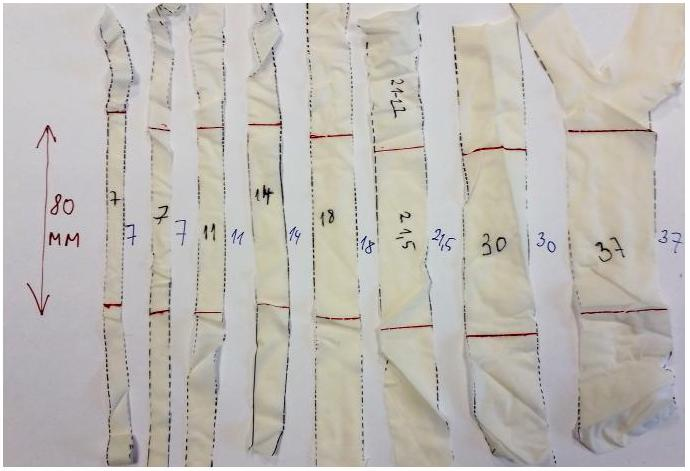
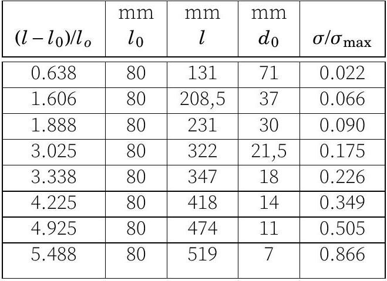
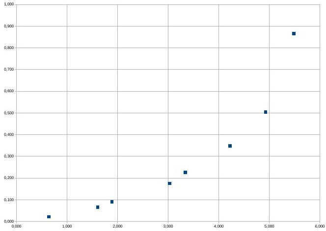
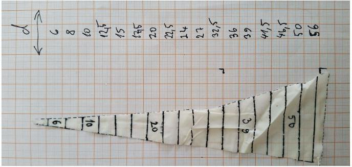
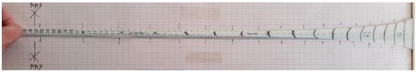
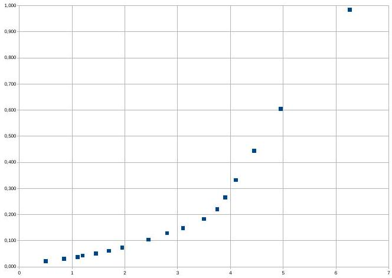

1. Photon rocket (5 points) - Solution by Taavet Kalda, grading schemes by Oskar Vallhagen and Konstantin Dukach.
i) (1 point) At non-relativistic speeds, we can apply classical momentum and energy conservation to find the acceleration in terms of the antimatter burning rate $\mu$. In a time interval $\Delta t$, a mass of $\Delta m = \mu \Delta t$ antimatter annihilates with an equal mass of matter. The resulting photons have an energy equal to the annihilated rest energy $\Delta E = 2 \Delta m c ^ { 2 }$. For maximal acceleration, the photons have to be all emitted in the same direction (can be achieved, for example, using mirrors). The resulting photon cloud will then have a momentum of $\Delta p = \Delta E / c$. From the conservation of momentum, the space ship must get a momentum boost in the opposite direction, equal to $\Delta p = M \Delta v = M g \Delta t$. Combining everything, we get $\mu = M g / ( 2 c ) =$ $1.635 \times 10 ^ { - 3 } \mathrm {~kg} / \mathrm { s }$.

## Grading:

- Introducing time $\Delta t$ and expressing $\Delta m =$ $\mu \delta t$ 0.2 pts.
- Photon energy $\Delta E = 2 \Delta m c ^ { 2 }$
- Photon momentum $\Delta p = \Delta E / c$

0.2 pts.

- Rocket momentum $\Delta p = M g \Delta t$ (half point if only force $\boldsymbol { F } = \boldsymbol { M } \boldsymbol { g }$ is stated) 0.2 pts.
- Final answer

0.2 pts.

- Missing factor 2 accounting for both antimatter and matter fom interstellar plasma

## -0.2 pts.

- Finding photon momentum by reasoning that the annihilated mass can be regarded as expelled with the speed of light -0.2 pts

ii) (3 points) The final speed is easiest to find by applying energy and momentum (4- momentum) conservation in the initial and final configurations. If the final rest mass of the ship is $m _ { f }$, then $M - m _ { f }$ of antimatter is burnt throughout the acceleration and an equal amount of matter is burnt from the interstellar space. Hence, it makes sense to consider the system of the ship + the burnt - Relating energy and momentum with 4- interstellar gas. momentum invariants (or equivalent, half
The initial rest mass of the system is $\boldsymbol { M } +$ of the points each for rocket and photons) $\left( M - m _ { f } \right) = 2 M - m _ { f } = M _ { i }$. This corresponds 1 pts. to an energy of $\boldsymbol { E } _ { i } = \boldsymbol { M } _ { i } \boldsymbol { c } ^ { 2 }$ and momentum $p _ { i } = 0$ due to the gas and the ship initially be-

- Solving the equation system in terms of energies and momentum 0.5 pts.

In the final configuration, we have the

- Solving for $v _ { f }$ Non-relativistic solution:

- Realising that the problem can be solved by considering conservation of momentum and energy between initial and final state only 0.25 pts.

- Correct conservation laws for momentum and energy (half of the points for each)

0.25 pts. have the 4-momentum invariant for both the space ship and the photon gas. They read

- Relating energy and momentum to $v _ { f }$ 0.25 pts.

- Final answer (if commenting on unphysical results, otherwise no points) $\mathbf { 0 . 2 5 }$ pts. Solution 2 by Oskar Vallhagen

$$
p _ { f } = \frac { M _ { i } ^ { 2 } - m _ { f } ^ { 2 } } { 2 M _ { i } } c , \quad E _ { f } = \frac { M _ { i } ^ { 2 } + m _ { f } ^ { 2 } } { 2 M _ { i } } c .
$$

An alternative way to solve the problem is to find an expression for the reactive force
We could find the velocity by solving for $v _ { f }$ felt by the rocket, and use it to derive an equa- in the expression for the relativistic energy tion for the resulting velocity change. Dur- $E _ { f } = m _ { f } \gamma _ { f } c ^ { 2 }$ with $\gamma _ { f } = \left( 1 - v _ { f } ^ { 2 } / c ^ { 2 } \right) ^ { - 0.5 }$. A faster ing a time $\mathrm { d } t$, the energy released as photons way, however, would be to use the expres- from the burnt rocket antimatter is $\gamma \mu \mathrm { d } t c ^ { 2 }$ sion for final momentum, $p _ { f } = m _ { f } \gamma _ { f } v$, and (including the kinetic energy of this mass) notice that and the energy released from the ordinary

$$
\begin{aligned}
v _ { f } & = \frac { p _ { f } } { E _ { f } } c ^ { 2 } = \frac { M _ { i } ^ { 2 } - m _ { f } ^ { 2 } } { M _ { i } ^ { 2 } + m _ { f } ^ { 2 } } c \\
& = \frac { \left( 2 M - m _ { f } \right) ^ { 2 } - m _ { f } ^ { 2 } } { \left( 2 M - m _ { f } \right) ^ { 2 } + m _ { f } ^ { 2 } } c \\
& = \frac { 180 } { 181 } c \approx 0.9945 c .
\end{aligned}
$$

matter needed for the annihilation is $\mu \mathrm { d } t c ^ { 2 }$. As the photon momentum scales as the inverse of the wavelength, which is red-shifted by a factor of $\sqrt { 1 + v / c } / \sqrt { 1 - v / c }$ in the rest frame compared to the rocket frame, the corresponding change in photon momentum in the rest frame is

## Grading:

- Realising that the problem can be solved by considering conservation of momentum and energy between initial and final state only 0.5 pts.
- Correct conservation laws for momentum and energy (half of the points for each)

0.5 pts. The force acting on the rocket can now be ex- pressed as

$$
\begin{aligned}
\frac { \mathrm { d } p } { \mathrm {~d} t } & = \frac { \mathrm { d } } { \mathrm {~d} v } ( \gamma v ) m \frac { \mathrm {~d} v } { \mathrm {~d} t } + \gamma v \frac { \mathrm {~d} m } { \mathrm {~d} t } \\
& = m \left( \gamma ^ { 3 } \frac { v ^ { 2 } } { c ^ { 2 } } + \gamma \right) \frac { \mathrm { d } v } { \mathrm {~d} t } - \gamma v \mu \\
& = m \gamma ^ { 3 } \frac { \mathrm {~d} v } { \mathrm {~d} t } - \gamma v \mu = \frac { \mathrm { d } p _ { p h } } { \mathrm {~d} t } \\
& = ( \gamma + 1 ) \mu c \sqrt { \frac { 1 - v / c } { 1 + v / c } }
\end{aligned}
$$

We now change variable from time to mass by noting that

$$
I = \int - \frac { \cos y \mathrm {~d} y } { ( 1 - \sin y ) ( \cos y + \sin y + 1 ) }
$$

We now make the further substitution $\boldsymbol { z } =$ $\tan y / 2$, which gives
$\sin y = \frac { 2 z } { 1 + z ^ { 2 } } , \quad \cos y = \frac { 1 - z ^ { 2 } } { 1 + z ^ { 2 } } , \quad \mathrm {~d} y = \frac { 2 } { 1 + z ^ { 2 } } \mathrm {~d} z$,

so that the integral becomes, after some manipulation,

$$
I = \int - \frac { \mathrm { d } z } { 1 - z } = \ln ( 1 - z )
$$

Substituting back, we use the trigonometric expressions $\sin y = 2 \sin ( y / 2 ) \cos ( y / 2 )$ and $\cos y = 2 \cos ^ { 2 } ( y / 2 ) - 1$ to rewrite $z = \tan ( y / 2 ) =$ $\sin ( y / 2 ) / \cos ( y / 2 ) = \sin y / \left( 2 \cos ^ { 2 } ( y / 2 ) \right) =$ $\sin y / ( 1 + \cos y ) = x / \left( 1 + \sqrt { 1 - x ^ { 2 } } \right)$, which after insertion into the original integral gives

$$
\begin{aligned}
& \ln \left( \frac { m _ { f } } { M } \right) = \ln \left( 1 - \frac { x _ { f } } { 1 + \sqrt { 1 - x _ { f } ^ { 2 } } } \right) \\
& \Rightarrow \frac { 1 } { 10 } = 1 - \frac { x _ { f } } { 1 + \sqrt { 1 - x _ { f } ^ { 2 } } } \\
& \Rightarrow x _ { f } = \frac { 180 } { 181 } .
\end{aligned}
$$

Grading:

- Correct photon momentum change in the rest frame 0.5 pts
- Expanding the momentum change of the rocket in terms of $v$ and setting up total momentum (or force) balance 0.25 pts
- Eliminate the time variable

- Express solution as an integral using separation of variables 0.5 pts
- Simplifying the integral and first substitution 0.5 pts
- Second substitution

- Substitute back and calculate final answer 0.5 pts

Non-relativistic solution:

- Momentum balance 0.25 pts
- Eliminate time variable and express as integral using separation of variables
- Evaluate the integral 0.25 pts
- Final answer (if commenting on unphysical results, otherwise no points) 0.25 pts

iii) (1 point) The last photon is emitted when the space ship moves at a speed of $v _ { f }$. The photon is observed by a stationary observer. We can directly use the relativistic Doppler shift effect to find

$$
\begin{aligned}
f _ { \mathrm { obs } } & = f _ { 0 } \sqrt { \frac { 1 - v / c } { 1 + v / c } } = \frac { m _ { f } } { M _ { i } } f _ { 0 } \\
& = \frac { m _ { f } } { 2 M - m _ { f } } f _ { 0 } = \frac { 1 } { 19 } f _ { 0 }
\end{aligned}
$$

Grading:

- Correct relativistic expression for doppler shift (-0.3 pts if non-relativistic or only valid for $v _ { f } \ll c$ ) 0.5 pts.
- Final answer (no points if unphysical, eg negative frequencies, even if consistent with previous calculations) 0.5 pts.
2. Gas and fluid flows (10 points) - Solution by Taavet Kalda, grading schemes by Joonas Kalda, Mihkel Kree, Andres Põldaru, Oleg Košik.
i) (1 point) As the plate falls, it will rotate around the bump without slipping and push the air out from beneath it, at ever faster speeds, the closer it gets to the bottom plate. As such, part of the rotational energy of the plate is transferred over to the escaping air molecules. Further, the pressure and temperature of the gas is uniform, because of the incompressibility condition.

Since the problem is 2-dimensional, the mass, volumes, moment of inertia and other quantities are per unit length of the system (on the figure, into the page). Let $x$ mark the distance from the bump and $v$ denote the horizontal speed of air at $x$. There is a volume of air equal to $V ( x ) = x h x / ( 2 L )$ between $x = 0$ and $\boldsymbol { x }$. As the plate falls down, $\boldsymbol { V } ( \boldsymbol { x } )$ gets smaller and as a result, air is pushed out. Consider a small time interval $\mathrm { d } t$. In that time interval, $h$ changes by $\dot { h } \mathrm {~d} t = - \omega L \mathrm {~d} t$. From the conservation of air particles, $0 = \mathrm { d } V ( x ) + v ( x ) h x / L$ with $\mathrm { d } V ( x ) = - x ^ { 2 } \omega / 2$. Hence,

$$
v ( x ) = \frac { x L \omega } { 2 h } .
$$

Evaluated at $x = L$, this yields $v ( x = L ) = \frac { L ^ { 2 } \omega } { 2 h }$.

Grading:

- Stating the idea of using conservation of mass (or implicitly using it) to find the velocity 0.4 pts.

- Equation for the conservation of mass
0.4 pts.
- Correct final expression 0.2 pts.
ii) (2.5 points) Since the air flow is laminar and there is no diffusion, all of the lost rotational energy from the falling glass plate will be converted into kinetic energy of air particles. As such, we have $K _ { \text {rot } } + K _ { \text {air } } =$ const . We found from the previous parts that the air is pushed out at ever faster speeds (between the plates, $v ( x ) \gg L \omega )$ from between the two plates. However, outside of the two plates, the flow will diffuse fast in all directions, such that the vast majority of kinetic energy will be concentrated between the two plates.

The kinetic energy of the air between the two plates is

$$
\begin{aligned}
K _ { \text {in } } & = \int _ { 0 } ^ { L } \mathrm {~d} x \frac { h x } { L } \rho _ { a } \frac { 1 } { 2 } v ( x ) ^ { 2 } \\
& = \frac { \rho _ { a } L \omega ^ { 2 } } { 8 h } \int _ { 0 } ^ { L } x ^ { 3 } \mathrm {~d} x \\
& = \frac { \rho _ { a } L ^ { 5 } \omega ^ { 2 } } { 32 h }
\end{aligned}
$$

and the rotational energy of the glass plate is

$$
K _ { \mathrm { rot } } = \frac { I \omega ^ { 2 } } { 2 } = \frac { m _ { \mathrm { glass } } L ^ { 2 } } { 3 } \frac { \omega ^ { 2 } } { 2 } = \frac { L ^ { 3 } t \rho _ { g } \omega ^ { 2 } } { 6 } .
$$

Energy conservation then reads as

$$
\begin{aligned}
\frac { \rho _ { a } L ^ { 5 } \omega ^ { 2 } } { 32 h } + \frac { L ^ { 3 } t \rho _ { g } \omega ^ { 2 } } { 6 } & = \text { const } \\
& = \frac { \rho _ { a } L ^ { 5 } \omega _ { 0 } ^ { 2 } } { 32 h _ { 0 } } + \frac { L ^ { 3 } t \rho _ { g } \omega _ { 0 } ^ { 2 } } { 6 } ,
\end{aligned}
$$

and hence,

$$
\omega = \omega _ { 0 } \sqrt { \frac { 1 + \frac { 3 \rho _ { a } L ^ { 2 } } { 16 \rho _ { g } t } \frac { 1 } { h _ { 0 } } } { 1 + \frac { 3 \rho _ { a } L ^ { 2 } } { 16 \rho _ { g } t } \frac { 1 } { h } } } .
$$

We can see that $\lim _ { h \rightarrow 0 } \omega = 0$, i.e. the air acts as a cushion and stops the glass plate before it hits the stationary plate.

Grading:

- Noticing from the laminarity of the flow that the kinetic energy of the glass plate and its surrounding air is conserved. If the flow is assumed to be dissipative, and the problem is otherwise solved correctly, the maximum score is reduced by 0.3 pts from this part. this part. 0.6 pts.
- Calculating the kinetic energy of the air, of which: which: 1.2 pts,
- Noting that the majority of the air's kinetic energy is between the two glass plates (no formal proof required) $\mathbf { 0 . 6 ~ p t s }$.
- Finding the air velocity at a distance $x$ from the pivot 0.2 pts.
- Correct setup for the integral for the kinetic energy - Correct final expression for the kinetic energy of air 0.1 pts.
- Calculating the kinetic energy of the glass slab, of which: slab, of which: - Correct expression for the moment of inertia 0.2 pts.
- Final expression for angular speed as a function of $h$ 0.3 pts.

iii) (3 points)The incoming water from '2' will spread out axisymmetrically along the space between the stone disk and the ceiling. After that, it will spread into the basin and eventually leave through the outgoing pipe '3'. The stone disk is kept up by the pressure differences between the top and bottom of the disc, arising from the flow speed of the water differing on either sides. The fact that pressures differ on boths sides can be seen directly by the application of the Bernoulli Prin-

ciple $p + \rho _ { w } v ^ { 2 } / 2 =$ const along a streamline or by noting that the flow speed gradients are driven by pressure gradients.

The flow speed outside the gap is negligible due to $t \ll R$, hence we can take the pressure at the bottom side to be uniformly $p _ { 0 }$. The flow speed in the gap at a distance $\boldsymbol { x }$ from the axis of symmetry can be found from the conservation of mass applied on a concentric cylinder of radius $x$ and height $t$, giving $2 \pi x t \rho _ { w } v ( x ) = \mu$. Hence,

$$
v ( x ) = \frac { \mu } { 2 \pi x t \rho _ { w } } .
$$

Applying Bernoulli's principle, we get $p ( x ) +$ $\rho _ { w } v ^ { 2 } / 2 = p _ { 0 }$ and so

$$
\Delta p = p _ { 0 } - p ( x ) = \frac { \rho _ { w } v ^ { 2 } } { 2 } = \frac { 1 } { 2 \rho _ { w } } \left( \frac { \mu } { 2 \pi x t } \right) ^ { 2 } .
$$

We can hence find the force due to the pressure differences in the gap by integrating from $x = r$ to $x = R$. First note that the resulting force will be pointing vertically up, because $p ( x ) < p _ { 0 }$. Integrating,

$$
\begin{aligned}
F _ { 1 } & = \int _ { x = r } ^ { x = R } 2 \pi x \mathrm {~d} x \Delta p \\
& = \frac { \mu ^ { 2 } } { 4 \pi t ^ { 2 } \rho _ { w } } \int _ { x = r } ^ { x = R } \frac { \mathrm {~d} x } { x } \\
& = \frac { \mu ^ { 2 } } { 4 \pi t ^ { 2 } \rho _ { w } } \ln \left( \frac { R } { r } \right) .
\end{aligned}
$$

Note that the water entering through the pipe will slow down, pushing the disk further down. The net force from this, however, turns out to be negligible due to the condition $r \gg t$. To see this, one can argue that the said force is of order $\mu v _ { \text {pipe } } \sim \mu \mu / \left( \rho _ { w } r ^ { 2 } \right) \sim$ $\mu ^ { 2 } / \left( \rho _ { w } r ^ { 2 } \right) \ll F _ { 1 }$.

Further, we have the gravitational force $F _ { g } = - m g = - \pi R ^ { 2 } h \rho _ { s } g$ pulling the disk down and buoyancy force $F _ { b } = \pi R ^ { 2 } h \rho _ { w } g$ pushing disk up. The force balance then reads $\boldsymbol { F } _ { \boldsymbol { g } } +$ $F _ { b } + F _ { 1 } = 0$. Solving the equation, we find

$$
\mu = 2 \pi R t \sqrt { \frac { h \rho _ { w } \left( \rho _ { s } - \rho _ { w } \right) } { \ln ( R / r ) } g . }
$$

Grading:

- Speed dependence $v ( x )$ from continuity condition
0.5 pts.
- Dynamic pressure from Bernoulli equation
0.5 pts.
- Express force by integrating dynamic pressure over disk area.
0.5 pts.
- Explanation why the jet's impact force can be ignored (or equivalently, an expression for the impact force that is carried along in the solution)
- Disk's weight and buoyancy force
0.5 pts.
- Express answer from force balance 0.5 pts.
iv) (0.5 points) In the context of thermodynamics, entropy is defined in terms of its differential, such that the change in entropy of a system is given by $\mathrm { d } \boldsymbol { S } = \mathrm { d } \boldsymbol { Q } / \boldsymbol { T }$, where $\mathrm { d } \boldsymbol { Q }$ is the heat entering the system, and $T$ its temperature. Further, entropy in reversible thermodynamic processes is a state function, i.e. it only depends on the current (equilibrium) thermodynamical state of the system. This means that when calculating the entropy difference of one mole of vapour and liquid, the temperature at which the phase transition took place does not affect the final result.

As such, it's most convenient to consider the two final states as only differing by the liquid undergoing condensation at $t _ { 0 } = 100 ^ { \circ } \mathrm { C }$. The final temperature is $t _ { 0 } = 100 ^ { \circ } \mathrm { C }$ because that's when water vapour pressure is equal to $p _ { 0 }$ (i.e. boiling temperature at atmospheric pressure). This corresponds to a heat of $\Delta Q =$ $\boldsymbol { m } \boldsymbol { L } = \mathbf { 1 } \mathbf { ~ m o l } \cdot \boldsymbol { M } \boldsymbol { L }$ entering the vapour system, compared to the liquid one. Hence, the entropy difference between one mole of vapour and liquid is given by

$$
\Delta S = \frac { \Delta Q } { T _ { 0 } } = \frac { 1 \mathrm {~mol} \cdot M L } { T _ { 0 } } = 110 \mathrm {~J} / \mathrm { K }
$$

Grading:

- $\Delta S = \frac { \Delta Q } { T }$
- $\Delta Q = L M$
- Understanding that $T = T _ { 0 }$
- Correct numerical answer v) (3 points)Because the expansion of water is reversible, entropy is conserved. This means that the change in entropy due to the expansion of the vapour is balanced by the entropy change due to condensation. As discussed before, because entropy is a function of state, it's most convenient to calculate the entropy change by imagining $n$ moles of water ( $n$ will later cancel out) cooling and expanding from $T _ { t } , p _ { t }$ to $T _ { 0 } , p _ { 0 }$ and condensing $r n$ moles of water at the end. $r$ is found by demanding that $\Delta \boldsymbol { S } = 0$ in this process.

The entropy change of the vapour is found by applying the first law of thermodynamics over a small temperature and pressure increment $\mathrm { d } T , \mathrm {~d} p$ :

$$
\mathrm { d } S _ { \text {vapour } } = \frac { \mathrm { d } Q } { T } = \frac { \mathrm { d } U + \mathrm { d } W } { T } ,
$$

where $\mathrm { d } U = n c _ { v } \mathrm {~d} T$ is the change in internal energy of the vapour and $\mathrm { d } W = p \mathrm {~d} V$ is the work done by the vapour. Importantly, we neglect the volume of water compared to the vapour, as that allows using the ideal gas to simplify the work differential. Using the ideal gas law, we then have

$$
p \mathrm {~d} V = p \mathrm {~d} \left( \frac { n R T } { p } \right) = n R \mathrm {~d} T - n R T \frac { \mathrm {~d} p } { p } .
$$

Hence,

$$
\mathrm { d } S _ { \text {vapour } } = n \left( c _ { v } + R \right) \frac { \mathrm { d } T } { T } - n R \frac { \mathrm {~d} p } { p }
$$

and we can integrate to get

$$
\Delta S _ { \text {vapour } } = n c _ { p } \ln \left( \frac { T _ { 0 } } { T _ { 1 } } \right) - n R \ln \left( \frac { p _ { 0 } } { p _ { 1 } } \right)
$$

where $c _ { p } = c _ { v } + R = R ( i + 2 ) / 2 = R \gamma / ( \gamma - 1 )$ is the heat capacity at constant pressure. The net change in entropy is then

$$
\begin{aligned}
\Delta S _ { \text {tot } } = 0 & = \Delta S _ { \text {vapour } } + \Delta S _ { \text {condens } } \\
& = \Delta S _ { \text {vapour } } - r n \frac { M L } { T _ { 0 } } \\
& = n c _ { p } \ln \left( \frac { T _ { 0 } } { T _ { 1 } } \right) - n R \ln \left( \frac { p _ { 0 } } { p _ { 1 } } \right) - r n \frac { M L } { T _ { 0 } } .
\end{aligned}
$$

0.1 pts. Thus,

$$
r = \frac { R T _ { 0 } } { M L } \left( \ln \left( \frac { p _ { 1 } } { p _ { 0 } } \right) - \frac { \gamma } { \gamma - 1 } \ln \left( \frac { T _ { 1 } } { T _ { 0 } } \right) \right) = 0.114 .
$$

To find the mass flow rate, we start by finding the flow speed $v$ of the outgoing liquid/vapour. Since we know $r$, we can apply energy conservation (necessary for the reversibility to hold) on a flowing water packet. This is most conveniently done by demanding energy conservation on the system as a whole. Suppose that in some time interval $n$ moles of water vapour with a volume of $\boldsymbol { V } _ { \boldsymbol { t } }$ are created at the boiler. Then at the outlet, in the steady state, due to conservation of particles, $( 1 - r ) n$ moles of water vapour at a volume of $V _ { 0 }$, alongside $r n$ moles of liquid water, are removed. The outflowing water has an additional kinetic energy of $n \mu v ^ { 2 } / 2$. The energy change of the whole system due to both steps must cancel each-other out due to energy conservation. We can write this as

$$
0 = W _ { \text {in } } - W _ { \text {out } } + U _ { \text {in } } - U _ { \text {out } } - n M v ^ { 2 } / 2 = 0 ,
$$

where $W _ { \text {in } } = p _ { t } V _ { t } = n R T _ { t }$ and $W _ { \text {out } } = p _ { 0 } V _ { 0 } =$ $( 1 - r ) n R T _ { 0 }$ are the works done by the incoming and outgoing packet and similarly, $U _ { \text {in } } = c _ { v } n T _ { t }$ and $U _ { \text {out } } = c _ { v } n T _ { 0 } - r n M L + r n R T _ { 0 }$ are the internal energies of the incoming and outgoing packet. Notice that for the outgoing internal energy, we have an extra term of $r p _ { 0 } V _ { 0 } = r n R T _ { 0 }$. This is because when talking about the latent heat of vaporisation, it includes the work done in order to expand the vapour into the volume it's supposed to occupy. Therefore, we should subtract the said work from the latent heat of vaporisation, in order for it to capture the actual change in the internal energy of the water. Combining everything, we get

$$
\begin{aligned}
0 & = n R T _ { t } - ( 1 - r ) n R T _ { 0 } + c _ { v } n T _ { t } \\
& - c _ { v } n T _ { 0 } + r n M L - r n R T _ { 0 } - n M v ^ { 2 } / 2 \\
& = \left( c _ { v } + R \right) n \left( T _ { t } - T _ { 0 } \right) + r n M L - n M v ^ { 2 } / 2 ,
\end{aligned}
$$

and hence,

$$
v = \sqrt { 2 \left( \frac { c _ { p } \Delta T } { M } + r L \right) } = 906 \mathrm {~m} / \mathrm { s } .
$$

The density of air at the outlet is found from ideal gas law $\rho = p _ { 0 } M / \left( R T _ { 0 } \right)$. The mass flow rate of water vapour is then

$$
\mu _ { \text {vapour } } = A \rho v = \frac { A p _ { 0 } M v } { R T _ { 0 } } ,
$$

but we also have liquid water flowing out, such that the total flow rate is given by

$$
\mu = \frac { 1 } { 1 - r } \mu _ { \text {vapour } } = \frac { A p _ { 0 } M v } { ( 1 - r ) R T _ { 0 } } = 59 \mathrm {~g} / \mathrm { s } .
$$

Grading:
Finding $r$

- Idea that entropy is conserved.
- Idea to calculate entropy change of the whole gas from $T _ { t } , P _ { t }$ to $T _ { 0 } , P _ { 0 }$.
0.1 pts, and $d S = \frac { c d T + p d V } { T }$
- Using the ideal gas law to calculate $\boldsymbol { d } \boldsymbol { S }$ using two of the variables $T , V , P$.
0.1 pts

- Integrating 0.2 pts and expressing entropy difference in terms of $\boldsymbol { P }$ and $\boldsymbol { T }$
- Using or deriving $c _ { v } = 3 R$.
0.1 pts
- Correct entropy change due to the phase change
0.2 pts
- Express the correct result for $\boldsymbol { r }$
0.1 pts

1.5 pts

- Idea to use energy conservation along the flow.
0.2 pts
- Correct expression for work in the energy conservation.
- Correct internal energy change.
0.5 pts
- Correct energy change due to kinetic energy.
- Express correct $v$
- Equation for gas flow rate $\mu = v \rho _ { g } A$.
- The ideal gas law with density
0.1 pts

- Correction factor $\frac { 1 } { 1 - r }$ for the whole mass flow.
0.2 pts

Note: using simple Bernoulli's equation, which does not consider phase changes, gave 0 pts since the problem is about deriving what happens in that case.
3. Rotating space station (13 points) - Solution by Kaarel Hänni, grading schemes by Adam Warnerbring, Kaur Aare Saar, Maksim Pokrovskiy and ....

i) (0.5 points) Letting $\omega$ be the angular velocity, the acceleration experienced by people on the "ground" is $\omega ^ { 2 } R = \left( \frac { 2 \pi } { \tau } \right) ^ { 2 } R$. Setting this equal to $g$ gives
$$
\left( \frac { 2 \pi } { \tau } \right) ^ { 2 } R = g \Longrightarrow \tau = 2 \pi \sqrt { \frac { R } { g } } \approx 63.437 \mathrm {~s} .
$$

Grading:

- Finding the acceleration at the "ground" 0.2 pts
- Correct expression for the period

0.2 pts

- Correct numerical answer

0.1 pts.

ii) (2 points) Let us consider the motion of the ball in the non-rotating (inertial) frame of the center of mass of the spaceship. As the travel time is $t = \tau / 2$, the throwing point on the ground will rotate by exactly half a circle between the ball being thrown and the ball being caught. In our inertial frame, the trajectory of the ball will just be a straight line between these two diametrically opposed points; this has length $2 R$. In this inertial frame, the ball thus travels with a constant velocity $v _ { \text {inertial } } = \frac { 2 R } { \tau / 2 } = \frac { 4 R } { \tau }$ (in the radial direction). The initial velocity vector in the rotating frame is the difference of the velocity vector in the inertial frame and the velocity vector of the throwing point in the rotating frame compared to the inertial frame. So the initial velocity vector in the rotating frame has a radial component of $\frac { 4 R } { \tau }$ and a tangential component of $\frac { 2 \pi R } { \tau }$. The throwing speed $s$ is the magnitude of this vector, which is
$s = \sqrt { \left( \frac { 4 R } { \tau } \right) ^ { 2 } + \left( \frac { 2 \pi R } { \tau } \right) ^ { 2 } } = \frac { 2 R } { \tau } \sqrt { 4 + \pi ^ { 2 } } \approx 117 \mathrm {~m} / \mathrm { s }$.

Grading:

- Finding the trajectory in an inertial frame $\frac { \mathbf { 8 } } { \mathbf { 1 5 } }$ pts
- Finding the radial velocity
- Finding the tangential velocity
- Correct velocity addition
- Correct numerical answer

iii) (2 points) When the balloon comes to a stop, it is in equilibrium in the rotating frame. An object at radius $R ^ { \prime }$ of mass $m _ { 1 }$ has a fictitious radial (downward) force of $m _ { 1 } \omega ^ { 2 } R ^ { \prime }$ acting on it in this frame. This force on the mass $m$ is $m \omega ^ { 2 } ( R - H + l )$. The upward force on the balloon is the difference between this force for the balloon and the buoyant force in the rotating frame, which is $\frac { 4 } { 3 } \pi r ^ { 3 } ( M - \left. M ^ { \prime } \right) \frac { n } { V } \omega ^ { 2 } ( R - H ) = \frac { 4 } { 3 } \pi r ^ { 3 } \left( M - M ^ { \prime } \right) \frac { P } { R _ { G } T } \omega ^ { 2 } ( R - H )$. Putting all this together, we can write down the condition that the radial force is 0 in equilibrium

$$
m \omega ^ { 2 } ( R - H + l ) = \frac { 4 } { 3 } \pi r ^ { 3 } \left( M - M ^ { \prime } \right) \frac { P } { R _ { G } T } \omega ^ { 2 } ( R - H )
$$

$\Longrightarrow m = \frac { \frac { 4 } { 3 } \pi r ^ { 3 } \left( M - M ^ { \prime } \right) P ( R - H ) } { R _ { G } T ( R - H + l ) } \approx 110.8 \mathrm {~kg}$.
Grading: If $l$ is neglected, i.e. the mass and balloon are considered to be at equal heights, this problem is marked out of $\mathbf { 1 . 0 }$ pts maximum. Idea: balance of fictitious radial force and buoyant force 0.8 pts. Correct expression for force on balloon $\mathbf { 0 . 5 }$ pts and mass 0.2 pts. Force balance correct 0.2 pts. Expression for m correct 0.2 pts. Numerical answer correct $\mathbf { 0 . 1 }$ pts.
iv) (1.5 points) In the rotating frame, letting $r$ be the distance from the axis of the cylinder, there is an effective radial potential of

$$
\varphi ( r ) = \int _ { 0 } ^ { r } \left( - \omega ^ { 2 } x \right) d x = - \frac { \omega ^ { 2 } r ^ { 2 } } { 2 }
$$

where we have chosen the potential zero level to be at $r = 0$. In other words, in this frame, there is a fictitious radial force of $m _ { 1 } \omega ^ { 2 } r = - m _ { 1 } \frac { d \varphi } { d r }$ acting on an object of mass $m _ { 1 }$. The rope takes a shape that minimizes this potential energy. For this part and the next, we will just be figuring out properties of a rope that minimizes this potential energy (and other than that, we can forget about the rotation). Consider cutting off a tiny piece of rope of length $\boldsymbol { \ell }$ from point $\boldsymbol { C }$, then pulling the rope tight at $\boldsymbol { C }$ and gluing it back together (doing work $\boldsymbol { \ell } \boldsymbol { T } _ { \boldsymbol { C } }$ ), then cutting the rope open at $A$, letting it slip by length $\boldsymbol { \ell }$ (doing work $- \boldsymbol { \ell } \boldsymbol { T } _ { \boldsymbol { A } }$ ), and finally moving the tiny piece from point $\boldsymbol { C }$ to point $\boldsymbol { A }$ (doing work $\left. \ell \lambda ( \varphi ( R ) - \varphi ( R - h ) ) = - \frac { \ell \lambda \omega ^ { 2 } h ( 2 R - h ) } { 2 } \right)$, filling the gap of length $\ell$. The state of the rope is now the same as initially, so the total work done should be 0:

$$
\ell T _ { C } - \ell T _ { A } - \frac { \ell \lambda \omega ^ { 2 } h ( 2 R - h ) } { 2 } = 0 ,
$$

from where

$$
T _ { A } - T _ { C } = - \frac { \lambda 2 \pi ^ { 2 } h ( 2 R - h ) } { \tau ^ { 2 } } .
$$

See 200 More Puzzling Physics Problems, problem 78 (and its hint and solution) for a longer explanation of this idea.

Grading: Idea: move piece of rope from C to A/B 0.2 pts. Idea: work done by tension 0.1 pts and correct expression 0.3 pts. Idea: change in radial potential in rotating frame OR kinetic energy in lab frame 0.1 pts and correct expression $\mathbf { 0 . 3 ~ p t s }$. Total work done is zero 0.2 pts. Correct answer for tension difference 0.3 pts.
v) (1.5 points) Let's use the equilibrium condition that torque around the center of the cylinder is 0 (in the rotating frame) for the left half of the rope. Note that the fictitious force is radial, so that contributes nothing to the force. So the only contributions are from the tension in the rope on the two sides, so

$$
R T _ { A } \cos \alpha = ( R - h ) T _ { C } \Longrightarrow \frac { T _ { A } } { T _ { C } } = \frac { R - h } { R \cos \alpha } .
$$

Grading: Idea: rope in equilibrium 0.2 pts. Using zero total torque as condition 0.2 pts. Eliminating radial force by choice of point $\mathbf { 0 . 4 }$ pts. Some correct torque expression containing both tensions 0.2 pts. Correct ratio 0.5 pts.
vi) (1.5 points) Let the $x$-axis be the diameter $A B$, with coordinates chosen to be in meters, and with the coordinates of $A$ being $( - R , 0 )$. (So the coordinates of $B$ are $( R , 0 )$ and the coordinates of $\boldsymbol { C }$ are $( 0 , - ( R - h ) )$. The unique parabola $y = a x ^ { 2 } + b x + c$ that goes through these three points has $b = 0$ from symmetry across the $y$ axis, $c = - ( R - h )$ from condsidering the point $\boldsymbol { C }$, and then $\boldsymbol { a } = - \frac { R - h } { R ^ { 2 } }$ from considering the point $A$. The derivative at $A$ is $\left. \frac { d y } { d x } \right| _ { x = - R } = 2 a \cdot R = - \frac { 2 ( R - h ) } { R }$, from which

$$
\begin{aligned}
\cos \alpha & = \frac { - d y } { \sqrt { ( d y ) ^ { 2 } + ( d x ) ^ { 2 } } } = \frac { 1 } { \sqrt { 1 + \left( \frac { d x } { d y } \right) ^ { 2 } } } \\
& = \frac { 1 } { \sqrt { 1 + \frac { R ^ { 2 } } { 4 ( R - h ) ^ { 2 } } } } \approx 0.7106 .
\end{aligned}
$$

Using the equations from parts (iv) and (v), we now have a system of equations in two unknowns:

$$
\left\{ \begin{array} { l }
T _ { A } - T _ { C } = - \frac { \lambda 2 \pi ^ { 2 } h ( 2 R - h ) } { \tau ^ { 2 } } \\
R T _ { A } \cdot 0.7106 = ( R - h ) T _ { C }
\end{array} . \right.
$$

It remains to solve this system of equations. The second equation gives $T _ { A } =$ $T _ { C } \frac { R - h } { R \cdot 0.7106 } \approx T _ { C } \cdot 0.7107$. Plugging this into the first equation then gives

$$
T _ { C } = \frac { \lambda 2 \pi ^ { 2 } h ( 2 R - h ) } { \tau ^ { 2 } ( 1 - 0.7107 ) } \approx 12631 \mathrm {~N} .
$$

Grading: Some correct parabola given some choice of axes 0.3 pts. Correct expression for $\cos \alpha \mathbf { 0 . 2 }$ pts and correct numerical value 0.2 pts. System of equations using expressions found in iv) and v), even if they are incorrect, $\mathbf { 0 . 2 }$ pts. Correct expression for tension 0.4 pts. Solved only for $T _ { A }$ : full marks with penalty $\mathbf { - 0 . 1 }$ pts. Correct numerical value for $T _ { C } \mathbf { 0 . 2 }$ pts.
vii) (2 points)The rotating charge on the walls is making the spaceship into a solenoid carrying current $I = \frac { Q } { \tau }$. Inside of the spaceship, this creates a constant axial magnetic field of magnitude

$$
B = \mu _ { 0 } \frac { I } { L } = \mu _ { 0 } \frac { Q } { \tau L } .
$$

The force this creates on the charged ball is $- q v B = - q \frac { 2 \pi R } { \tau } \mu _ { 0 } \frac { Q } { \tau L }$ in the radial upward direction. For the ball to hover above the "ground" motionlessly, the acceleration created by this radial force has to be equal to the centripetal acceleration $\omega ^ { 2 } R = \frac { ( 2 \pi ) ^ { 2 } R } { \tau ^ { 2 } }$ :

$$
- \frac { q } { m } \frac { 2 \pi R } { \tau } \mu _ { 0 } \frac { Q } { \tau L } = \frac { ( 2 \pi ) ^ { 2 } R } { \tau ^ { 2 } } \Longrightarrow \frac { q } { m } = - \frac { 2 \pi L } { \mu _ { 0 } Q } .
$$

Grading:
Method 1:

- Finding the current $\overline { \mathbf { 1 5 } }$ pts 0.4 pts
- Finding the upward force on the charged ball $\frac { \mathbf { 2 } } { \mathbf { 3 } }$ pts
- Writing out the centripetal acceleration of the ball $\frac { \mathbf { 4 } } { \mathbf { 3 0 } }$ pts
- Correct relation between force and acceleration $\frac { \mathbf { 4 } } { \mathbf { 1 5 } }$ pts
- Correct final expression - Wrong sign of the charge $- \frac { \mathbf { 4 } } { \mathbf { 1 5 } }$ pts

Method 2:

- Finding the current - Finding the magnetic field 0.4 pts
- Finding the upward force on the charged ball $\frac { \mathbf { 2 } } { \mathbf { 3 } }$ pts
- Writing out the force balance in the rotating frame (with the correct expression of the upward force) 0.4 pts
- Correct final expression - Wrong sign of the charge $- \frac { \mathbf { 4 } } { \mathbf { 1 5 } }$ pts

$$
\vec { E } = \frac { 2 \pi \mu _ { 0 } Q } { \tau ^ { 2 } L } \vec { r } .
$$

We now have an expression for $\boldsymbol { E }$ at each point in the rotating frame; what remains is to evaluate $\oint \vec { E } \cdot \mathrm {~d} \vec { A }$. For the sake of variety, we will demonstrate two ways to evaluate this integral.

For the first option, note that our $\overrightarrow { \boldsymbol { E } } =$ const $\cdot \vec { r }$ is exactly the electric field of a uniformly charged cylinder (with the correctly chosen charge density), and so we could equivalently find the same integral around such a uniformly charged cylinder, which Gauss' theorem gives as $V \rho / \epsilon _ { 0 } = V \cdot c _ { 1 }$. We can find an expression for the constant $c _ { 1 }$ by considering the simple case where the surface we are dealing with is a cylinder of width 1 m itself, in which case the integral is

$$
\oint \vec { E } \cdot \mathrm {~d} \vec { A } = 1 \mathrm {~m} \cdot 2 \pi r \frac { 2 \pi \mu _ { 0 } Q } { \tau ^ { 2 } L } r = V \frac { 4 \pi \mu _ { 0 } Q } { \tau ^ { 2 } L } .
$$

Hence, $c _ { 1 } = \frac { 4 \pi \mu _ { 0 } Q } { \tau ^ { 2 } L }$, and so

$$
\oint \vec { E } \cdot \mathrm {~d} \vec { A } = V \frac { 4 \pi \mu _ { 0 } Q } { \tau ^ { 2 } L } .
$$

To briefly describe a second option for evaluating this integral, note that by partitioning a 3D body into volume slices, with each slice bounded by an area element $\mathrm { d } \vec { A }$ and with cylindrical radius vector $\vec { r }$, and with the volume of each slice being $\vec { r } \cdot \mathrm {~d} \vec { A } / 2$, we get that the volume of the body is the sum of volumes of all such slices,

$$
V = \oint \frac { 1 } { 2 } \vec { r } \cdot \mathrm {~d} \vec { A } .
$$

This lets us evaluate the main integral as

$$
\begin{aligned}
& \oint \vec { E } \cdot \mathrm {~d} \vec { A } = \oint \frac { 2 \pi \mu _ { 0 } Q } { \tau ^ { 2 } L } \vec { r } \cdot \mathrm {~d} \vec { A } \\
= & \frac { 4 \pi \mu _ { 0 } Q } { \tau ^ { 2 } L } \oint \frac { 1 } { 2 } \vec { r } \cdot \mathrm {~d} \vec { A } = \frac { 4 \pi \mu _ { 0 } Q } { \tau ^ { 2 } L } V .
\end{aligned}
$$

Grading:

- Arguing that in the rotating frame there is only an electric field 0.4 pts
- Finding the electric field strength

- Evaluating the surface integral and obtaining the correct answer 0.8 pts.
4. Stretching gloves (8 points) - Solution by Eero Uustalu, grading schemes by ....
i) (1 point)

Cut a few strips of the material with the same constant width and mark them with two perpendicular lines close to the ends of the strip while leaving ample space for affixing or binding. Then roll one strip lengthwise into a cylindrical shape for stretching. Measure the initial length between the marked lines $l _ { 0 }$. With a straight measuring tape affixed to the surface of the table, stretch one of the strips to the breaking point while determining the maximum length between the lines before the strip breaks $l _ { \text {max } }$. Repeat this at least three times to see if the data is reproducible. Calculate the result $\epsilon _ { \text {max } } = \left( l _ { \text {max } } - l _ { 0 } \right) / \left( l _ { 0 } \right)$.

In our measurement we got $\epsilon _ { \text {max } } = 5.5$.
Grading:

- Selection of the actual latex piece for the sample. Strips have to be of high quality and not include the finger end. and not include the finger end. - Selecting the strip length: 0.2 pts
- at least 8cm:
- at least 4cm:
- shorter, not specified
0/0.2 pts
- Remark. If a series of different lengths of strips is used, then the medium value should be considered. Additionally, if

the graph for finding $\epsilon _ { \text {max } }$ is used by including the point $( 0,0 )$, then 0.1 pts should be subtracted.
- Method of measurement, of which: 0.4 pts
- one end affixed with tape or held using a ruler 0.1 pts.
- lines marked on the strip, or the strip is affixed over the edge of the ruler 0.1 pts (if both ends are affixed, $\mathbf { 0 . 2 }$ pts, but can't get more than 0.4 pts for this section).
- using narrow strips 0.1 pts.
- measuring only the part of the strip that's being stretched (between marks) 0.1 pts.
- Measuring the full length of the stip
0.1 pts.
- Repetition of measurements: 0.2 pts
- measurement repeated at least 5 times 0.2/0.2 pts.
- measurement repeated at least 3 times 0.1/0.2 pts.
- if distortion of measured $\epsilon _ { \text {max } }$ values is low +0.1 pts.
- Final numerical value. If the value lies in range 4-7 (depends on the material, even 311 may be ok) 0.1 pts.
ii) (7 points)

\section*{Theoretical considerations.}

We can assume the material has uniform thickness. Knowing that $\sigma = \frac { F } { A } , V =$ const, and that any force applied to the strip affects all directions perpendicular to the applied force equally, then at any time for the same strip
$$
V = a \cdot a \cdot k \cdot l = a _ { 0 } \cdot a _ { 0 } \cdot k \cdot l _ { 0 } = a _ { \max } \cdot a _ { \max } \cdot k \cdot l _ { \max } ,
$$
where $a _ { 0 }$ is the initial thickness of material with no force applied and $l _ { 0 }$ is the initial length of the strip with no force applied, $a$ is the thickness when force $\boldsymbol { F }$ is applied and $\boldsymbol { l }$ is the length of the strip when force $\boldsymbol { F }$ is applied, $a _ { \text {max } }$ and $l _ { \text {max } }$ are the respective values at the breaking force $\boldsymbol { F } _ { \text {max } }$.
$k$ is the ratio between the width $d$ and

We make many strips with different widths, mark them with the same initial length $l _ { 0 }$ using perpendicular lines, measure and record the initial widths $d _ { 0 }$ of each segment, then roll them lengthwise into a cylindrical shape and bind them one after another. The force will be the same for all the segments, but the value of $\sigma$ for each segment will depend on the initial width of each individual strip.

A range where $d _ { \text {min } }$ and $d _ { \text {max } }$ differ at least 8 times is recommended.

Rolling the strip lengthwise into a cylindrical shape before binding gives the possibility to distribute the force evenly on all the strips regardless of the width of the strip!

Our solution was to make two identical strips with the smallest possible width and attach them to one another at one end to form a $\boldsymbol { Y }$ shape. The previously determined $\boldsymbol { \epsilon } _ { \text {max } }$ was used to estimate the possible maximum stretching almost to the breaking point of the narrowest strip. In case of a breakage event the identical spare strip at the other end of the $\boldsymbol { Y }$ shape could be used for measurement. After affixing the multi-width rope of combined strips at its maximum stretch position, the values of $l$ were recorded for each individual section. Afterwards the rope was stretched till breaking to find the actual breaking length $l _ { \text {max } }$ of the narrowest strip.

The 7 mm wide initially 80 mm long test strip broke at length 522 mm. Therefore the

And the graph, $\frac { \sigma } { \sigma _ { \text {max } } }$ for the $\boldsymbol { Y }$ axis and $\boldsymbol { \epsilon }$ for the $X$ axis.

\begin{figure}

\end{figure}

We make two identical elongated triangles from the longest piece of material available. We mark the triangles with evenly spaced perpendicular lines. (The lines are perpendicular to the central symmetry line of the elongated triangle.)

We record the initial length $l _ { 0 }$ and the average width $d _ { 0 }$ of each segment as defined by the perpendicular lines. When stretched, all segments will have the same force applied but each segment will have its own $\sigma$. We have to affix the base of the prolonged triangle to the ruler with tape (it has to be a good strong joint) and we affix the ruler to the table. A long strip of graph paper was taped to the table to have the rubber triangle stretched over it.

The triangle was stretched until the narrow end segment was near breaking point, and the values of $l$ were recorded for each segment. (Most easily done by using a marker on the graph paper while holding the narrow end of the triangle at a fixed position with the other hand). One of the triangles was actually stretched to the braking point, the other triangle was stretched to the breaking point only after the measurement was made.

The narrow end segment of the first triangle of length 10 mm and of average width 6 mm broke at length 73.1 mm. Therefore the measurement of the second similar triangle tested was made using force $\boldsymbol { F }$ stretching the narrow end segment of the triangle to 72.6 mm. The actual breaking of the narrow segment of the second triangle occurred at length 73.7 mm .

$$
\text { So the } d _ { \max 0 } = 6 \mathrm {~mm} \text { and } l _ { \max } = 73.7 \mathrm {~mm} \text {. }
$$

| $\sigma / \sigma _ { \text {max } }$ | mm $l _ { 0 }$ | mm $l$ | mm $d _ { 0 }$ | $\left( l - l _ { 0 } \right) / l _ { o }$ |
| :--- | :--- | :--- | :--- | :--- |
| 0.985 | 6 | 10 | 72.6 | 6.26 |
| 0.605 | 8 | 10 | 59.5 | 4.95 |
| 0.444 | 10 | 10 | 54.5 | 4.45 |
| 0.333 | 12.5 | 10 | 51 | 4.1 |
| 0.266 | 15 | 10 | 49 | 3.9 |
| 0.221 | 17.5 | 10 | 47.5 | 3.75 |
| 0.183 | 20 | 10 | 45 | 3.5 |
| 0.148 | 22.5 | 10 | 41 | 3.1 |
| 0.129 | 24 | 10 | 38 | 2.8 |
| 0.104 | 27 | 10 | 34.5 | 2.45 |
| 0.074 | 32.5 | 10 | 29.5 | 1.95 |
| 0.061 | 36 | 10 | 27 | 1.7 |
| 0.051 | 39 | 10 | 24.5 | 1.45 |
| 0.043 | 41.5 | 10 | 22 | 1.2 |
| 0.037 | 46.5 | 10 | 21 | 1.1 |
| 0.030 | 50 | 10 | 18.5 | 0.85 |
| 0.022 | 56 | 10 | 15 | 0.5 |

And the graph, $\frac { \sigma } { \sigma _ { \text {max } } }$ for the $\boldsymbol { Y }$ axis and $\boldsymbol { \epsilon }$ for the $X$ axis.

Grading:
GOOD practice:

- using the longest possible strips
- marking the initial length on the strip with a marker or
- measuring initial length to one straight affixed surface to another parallel affixed surface
- rolling the marker-marked strip lengthwise into a cylindrical shape for uniform stretch

- reasonable amount of repetitions (breaking is not very well repeatable)
BAD practice:
- intentionally variable length strips / short strips
- not marking the initial length on the strip with a marker
- not stretched with perpendicularly uniform strain
- not taking measurements only from actual part to be stretched
- not accounting for possible friction (some methods) part ii other solutions proposed:
- multiple similar masses used (not in the equipment list)
- a lever and some mass
- from the same latex material (a very long uniform and relatively thick strip is needed to be in proportional range, but then the measured force will be low)
- multiple similar strips in parallel as opposed to using fever strips in row and breaking with even force
- trigonometry and constant force
- different width strip pairs (force applied must remain constant for all pairs, in some solutions friction would need to be accounted for)

unsuccessful solving attempts / bad practices:

- using equipment not listed
- calculated, not measured (experiment!) 0 pts.
- using a finger as a force measuring device 0 pts.
- assuming the repeatedly applied force is constant (which it might not be) 0 pts.
- measuring by varying the length of the strip while keeping the applied force constant (stress created remains constant)

0 pts.

- stretching the strip to different lengths not knowing the actual force applied 0 pts.
- MOST OFTEN: Assumption that $\mathrm { F } = \mathrm { kx }$ ! That is actually an alternative lightly modified form of writing down the dependency WE HAVE TO MEASURE, not assume! (and the real dependency is not linear) 0 pts.

Possible grading scheme for the solutions given as example: part ii theory:

- assuming that the material has initial uniform thickness idea that as $\boldsymbol { V } =$ const then the dimensions in axes perpendicular to the applied force change in a fixed ratio to each other $\mathbf { 1 . 0 }$ pts.
- idea of changing $\boldsymbol { \sigma }$ by changing the width $d$ of the material when constant force is applied plied - idea of applying a common force to all the different samples at the same time 1.0 pts.
- finding how to calculate the value of $\boldsymbol { \epsilon }$ to be plotted - finding how to calculate the value of $\boldsymbol { \sigma } / \boldsymbol { \sigma } _ { \text {max } }$ to be plotted measurements and data:

- the strips/intervals used are as long as possible (in our case at least 14cm) 0.1 pts.

- data range covered - value of the largest measured $\boldsymbol { \sigma }$ differs from the smallest measured $\sigma$ at least 8 times 0.1 pts.
- data points - at least 8 points measured ( 0.2 pts for each correctly measured point or rectly measured point if less than 4 points measured (have you seen graph with 3 data points?), for maximum 8 measured points) MAX 1.6 pts.
- data evenly distributed

- at least one data point measured with a $\sigma$ value at least 0,8 of $\sigma _ { \text {max } }$ 0.1 pts.

- measurements for the breaking event values correctly done 0.2 pts.

- chart of measured and calculated values given 0.3 pts.

graph:

- graph correctly plotted with all measured points 0.3 pts.
- graph plotted in units asked (ratios, no

units)
0.2 pts.

If the results of any intermediate calculations are excessively rounded, a deduction from the final score of -0.1 pts for every intermediate stage used. using out of list equipment:

allow for any principally new methods of solution, any credit awarded for the parts of the solution that rely on the use of the out of list equipment or data measured with it will be reduced by 50\%.
- If the out of list equipment does enable a principally new method of solution, credit will only be awarded for aspects of the solution that would be applicable in a solution that does not rely on the out of list equipment.
