## NBPHO-2022 Solutions

1. Escape (8 points) - Solution by Päivo Simson.
i) Let's denote the diving angle by $\phi$, the magnitude of the trust force by $T$ and the magnitude of the lift force by $L$. As we can see below, the later is not needed in the solution. The Forces acting on the ariplane during a dive are shown in the figure below.

For the level flight $\phi = 0$, and we have, by balancing the horizontal forces

$$
F _ { d } = k v _ { 0 } ^ { 2 } = T .
$$

For the dive we have, by balancing the forces acting parallel to the trajectory,

$$
F _ { d } = k v ^ { 2 } = T + m g \sin \phi .
$$

By eliminating $T$ from the above equations we get

$$
v ^ { 2 } = v _ { 0 } ^ { 2 } \left( 1 + \frac { m g } { k v _ { 0 } ^ { 2 } } \sin \phi \right) .
$$

The maximum angle is obtained from the last equation by equating $v = c$ and solving for $\phi$ :

$$
\phi _ { \max } = \arcsin \left( \frac { k \cdot \left( c ^ { 2 } - v _ { 0 } ^ { 2 } \right) } { m g } \right) .
$$

## Grading:

- Correct force equations (0.5 pts)
- Correct expression for $v$ or $v ^ { 2 }$ ( $\mathbf { 0 . 3 ~ p t s ) }$
- Expressing the final answer (0.2 pts)
ii) The propagation speed of the radiation can be considered infinite compared to the speed of the airplane. Therefore, the radiation burst hits the plane at the same instant when the bomb detonates. The time it takes for the bomb to drop from altitude $H$ to $h$, without air resistance, is obtained from

$$
H - h = g \frac { t ^ { 2 } } { 2 }
$$

By solving for $t$ we have

$$
t = \sqrt { \frac { 2 ( H - h ) } { g } } \approx 41.6 \mathrm {~s} .
$$

## Grading:

- Understanding that the propagation speed of the radiation can be considered infinite compared to the speed of the plane (0.3 pts)
- Correct free fall equation (0.2 pts)
- Correct formula for $t$ (0.3 pts)
- Correct numerical answer (0.2 pts)
iii) The forces acting perpendicular to the plane's trajectory during a turn are shown in the figure below.
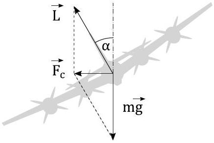
Here

$$
F _ { c } = m \frac { v ^ { 2 } } { R }
$$

is the centripetal force, and $R$ is the curvature radius of the trajectory. From the figure we get

$$
L \cos \alpha = m g ; \quad L \sin \alpha = m \frac { v ^ { 2 } } { R } .
$$

Since the maximum allowed lift-to-weight ratio is $n = 2.5$, we have for this case

$$
L = \frac { m g } { \cos \alpha } = n m g .
$$

By solving the above equations with respect to $R$ and $\alpha$, we get the following values for the minimal curvature radius and for the corresponding bank angle of the airplane:

$$
\begin{aligned}
R & = \frac { v ^ { 2 } } { g \tan \alpha } = \frac { v ^ { 2 } } { g \sqrt { n ^ { 2 } - 1 } } = \\
& = 1606.0 \mathrm {~m} \approx 1.6 \mathrm {~km} \\
\alpha & = \arccos \left( \frac { 1 } { n } \right) \approx 66.4 ^ { \circ }
\end{aligned}
$$

## Grading:

- Correct force equations (0.3 pts)
- Correct understanding and use of $n$ (0.1 pts)
- Correct formula for $R$ (0.2 pts)
- Correct formula for $\alpha$ (0.2 pts)
- Correct numerical value for $R$ (0.1 pts)
- Correct numerical value for $\alpha$ (0.1 pts)
iv) As the problem text states, the air resistance acting on the bomb can be neglected. This means that the bomb's horizontal speed is always the same as the speed of the plane, $v = 190 \mathrm {~m} / \mathrm { s }$. If the airplane keeps travelling straight after releasing the bomb, it will end up directly above the detonation point by the time the bomb explodes, leaving only the distance $H - h = 8.5 \mathrm {~km}$ between the bomb and the airplane. Hypothetically, the best way to get as much distance between the bomb and the airplane would be if the plane turned around instantly and kept flying straight after that. This is clearly not possible, but it gives us the clue that the plane should start turning immediately after releasing the bomb, and the turn should be as sharp as possible, leaving us with the previously found curvature radius $R = 1.6 \mathrm {~km}$. After the turn, it should fly straight so that the detonation point is directly behind it. The geometric construction of this trajectory is shown in the figure below.
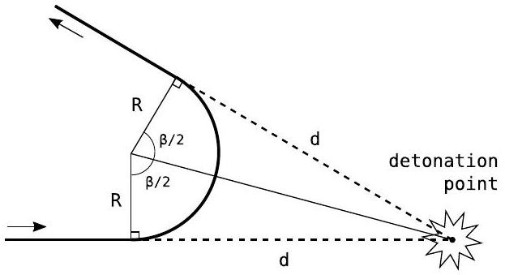

In the figure, $d$ is the horizontal distance the bomb travels before detonation,

$$
d = v t = v \sqrt { \frac { 2 ( H - h ) } { g } } = 7909.4 \mathrm {~m} \approx 7.9 \mathrm {~km} ,
$$

and $\beta$ is the total turning angle. From the right triangle shown in the figure, we get

$$
\beta = 2 \arctan \left( \frac { d } { R } \right) \approx 157 ^ { \circ } .
$$

## Grading:

- Good and well explained overall analysis of the problem (even if it contains some mistaken assumptions and the suggested trajectory ends up being incorrect) (0.6 pts)
- Realising that the plane has to start turning immediately with the previously found turning radius $R$ (0.2 pts)
- Correct trajectory (0.6 pts)
- Good justification for the correct trajectory (0.5 pts)
- Correct formula for $d$ (0.2 pts)
- Correct numerical value for $d$ (0.2 pts)
- Correct formula for $\beta$ (0.5 pts)
- Correct numerical value for $\beta$ (0.2 pts)
v) Solution 1. Let $D$ be the distance from the detonation point to the airplane at the moment when the shockwave hits it, and let $z = H - h = 8500 \mathrm {~m}$. We can divide the horizontal distance from the detonation point to the plane into three parts as shown in the figure below.
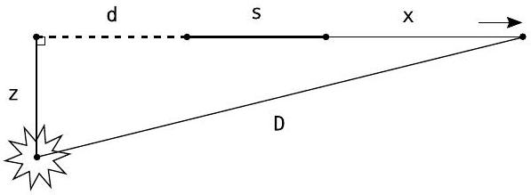

In the figure, $s$ is the distance the plane files straight after the turn and before the bomb detonates,

$$
s = v \cdot \left( t - t _ { \text {turn } } \right) = d - R \beta = 3507.3 \mathrm {~m} ,
$$

and $x$ is the distance it flies straight while the shockwave travels. If the travelling time is $t _ { 0 }$, then $x = v t _ { 0 }$ and $D = u t _ { 0 }$. Eliminating $t _ { 0 }$ from these equations gives

$$
x = \frac { v } { u } D .
$$

From the Pythagorean theorem we have

$$
D ^ { 2 } = ( d + s + x ) ^ { 2 } + z ^ { 2 } ,
$$

or

$$
D ^ { 2 } = \left( a + \frac { v } { u } D \right) ^ { 2 } + z ^ { 2 } ,
$$

where we have eliminated $x$ and denoted $a =$ $d + s = 2 d - R \beta$ for simplicity. The distance $D$ is obtained by solving this quadratic equation. The solution corresponding to our problem is

$$
\begin{gathered}
D = \frac { a u } { v } \cdot \frac { 1 + \sqrt { 1 + \left( \frac { u ^ { 2 } } { v ^ { 2 } } - 1 \right) \left( \frac { z ^ { 2 } } { a ^ { 2 } } + 1 \right) } } { \frac { u ^ { 2 } } { v ^ { 2 } } - 1 } \approx \\
\approx 27.9 \mathrm {~km} .
\end{gathered}
$$

Since the safe distance was 25 km, we can say that the airplane can escape the explosion.

Additional numerical values to help with the grading. Lenght of the turn: $R \beta = 4.4 \mathrm {~km}$; the time required to make the turn: $t _ { \text {turn } } =$ $R \beta / v = 23.2$ s; the time to travel the distance $s : t - t _ { \text {turn } } = 41.6 - 23.2 = 18.4 \mathrm {~s}$; distance $x : x = v t _ { 0 } = 15.1 \mathrm {~km}$; total time from releasing the bomb to getting hit by the shockwave: $t + t _ { 0 } = 121.3 \mathrm {~s}$; Total horizontal distance: $d + s + x = 26.5 \mathrm {~km}$; the parameter $a$ : $a = d + s = 2 d - R \beta = 11.4 \mathrm {~km}$.

## Grading:

- Correct understanding of the problem and correctly breaking it into smaller parts (even if the detailed calculations are incorrect) (0.2 pts)
- Correct expression and/or value for the distance $s$ ( $\mathbf { 0 . 4 } \mathbf { ~ p t s }$ )
- Correct expression relating $x$ and $D$ (0.4 pts)
- Correct Pythagorean equation or analogous equation for the suggested trajectory (even if the trajectory found before was incorrect) (0.4 pts)
- Correct solution of the Pythagorean or corresponding equation (0.4 pts)
- Correct value $D = 27.9 k m$ (0.2 pts)
- Vertical distance $z$ is not taken into account when calculating $D$ (-0.3 pts)

Solution 2. The beginning is the same as in Solution 1. Instead of directly calculating $D$, we can first calculate the travelling time $t _ { 0 }$ of the shockwave. We have

$$
x = v t _ { 0 } = 190 t _ { 0 } ; \quad D = u t _ { 0 } = 350 t _ { 0 } ;
$$

$$
d = 7909.4 \mathrm {~m} ; \quad s = 3507.3 \mathrm {~m} .
$$

Inserting these into the Pythagorean theorem and simplifying, we get a quadratic equation for $t _ { 0 }$ :

$$
t _ { 0 } ^ { 2 } - 50.2 t _ { 0 } - 2344.8 = 0 .
$$

The positive solution is $t _ { 0 } = 79.65 \mathrm {~s}$ and

$$
D = u t _ { 0 } \approx 27.9 \mathrm {~km} .
$$

## Grading:

- Correct understanding of the problem and correctly breaking it into smaller parts (even if the detailed calculations are incorrect) (0.2 pts)
- Correct expression and/or value for the distance $s$ ( $\mathbf { 0 . 4 } \mathbf { ~ p t s }$ )
- Correct expressions for $x$ and $D$ (0.4 pts)
- Correct equation for shockwave travelling time $t _ { 0 }$ for the suggested trajectory (even if the trajectory found before was incorrect) (0.4 pts)
- Correct expression and/or value for $t _ { 0 }$ for the suggested trajectory (0.4 pts)
- Correct numerical value $D = 27.9 k m$ or close to it if approximations were used (0.2 pts)
- Vertical distance $z$ is not taken into account when calculating $D$ (-0.3 pts)

Solution 3. Same as Solution 1. but solving the Pythagorean equation approximately. For the first approximation we can take $z = 0$. This gives us a simple linear equation for $D _ { 1 }$ :

$$
D _ { 1 } = a + \frac { v } { u } D _ { 1 }
$$

with $a = d + s = 2 d - R \beta = 11.4 \mathrm {~km}$, and the solution

$$
D _ { 1 } = \frac { a } { 1 - \frac { v } { u } } = 25.0 \mathrm {~km} .
$$

The second approximation is

$$
D _ { 2 } = \sqrt { \left( a + \frac { v } { u } D _ { 1 } \right) ^ { 2 } + z ^ { 2 } } = 26.4 \mathrm {~km} .
$$

This is enough to see that the plane is able to escape the explosion. The third approximation would be

$$
D _ { 3 } = \sqrt { \left( a + \frac { v } { u } D _ { 2 } \right) ^ { 2 } + z ^ { 2 } } = 27.1 \mathrm {~km} .
$$

## Grading:

- Correct understanding of the problem and correctly breaking it into smaller parts (even if the detailed calculations are incorrect) (0.2 pts)

- Correct expression and/or value for the distance $s$ ( $\mathbf { 0 . 4 } \mathbf { ~ p t s }$ )
- Correct expression relating $x$ and $D$ (0.4 pts)
- Correct Pythagorean equation or analogous equation for the suggested trajectory (even if the trajectory found before was incorrect) (0.4 pts)
- Correct approximate solution method of the Pythagorean or corresponding equation (0.4 pts)
- Correct value $D = 26 \ldots 28 k m$ ( $\mathbf { 0 . 2 }$ pts)
- Vertical distance $z$ is not taken into account when calculating $D$ (-0.3 pts)

## 2. Gas (6 points) - Solution by Jaan Kalda.

i) (2 points) Immediately after stopping, all the gas molecules move with the speed $v$. In the box's frame, the total energy of the molecules is conserved, so the average energy of each of the molecules is conserved, too: $\langle T \rangle = m v ^ { 2 } / 2$. On the other hand, after thermalisation, this will be equal to $\frac { 3 } { 2 } k T$, hence $T = \frac { 1 } { 3 } m v ^ { 2 } / k = \frac { 1 } { 3 } \mu v ^ { 2 } / R$.

Grading: relating final average energy of the molecules to the initial energy in the box's frame or in another way showing that this energy gives rise to the temperature: 1 pt; relating this to the internal energy of monomolecular gas: 0.5 pt; expressing final answer: 0.5 pt. Solutions which used $\frac { 1 } { 2 } k T$ or $k T$ instead of $\frac { 3 } { 2 } k T$ as the internal energy but otherwise correct get 1.5 pts.
ii) (2 points) Immediately after stopping, all the molecules move towards the wall with the same speed $v$. Hence, during time interval $t$, the molecules inside the near-wall region of thickness $v t$ and volume $W = A v t$ (where $A$ stands for the area of the wall) are hitting the wall. There are $N = \nu N _ { a } W / V =$ $\nu N _ { a } A v t / V$ such molecules. After hitting, the molecules depart from the wall with the opposite velocity, hence each of them transfers momentum $\Delta p _ { 0 } = 2 m v$ to the wall. So, the total transferred momentum is $\Delta p =$ $N \Delta p _ { 0 } = 2 \nu N _ { a } A m v ^ { 2 } t / V$ which corresponds to the pressure $P = \Delta p / A t = 2 \nu N _ { a } m v ^ { 2 } / V =$ $2 \nu \mu v ^ { 2 } / V$.

Grading: expressing the number of molecules hitting a wall during time period $t$ : 0.5 pts; finding the momentum transferred by each molecule: 0.5 pts; expressing the pressure in terms of the transferred momentum: 0.5 pts; bringing all these components together to get the final answer: 0.5 pts. Solutions that forget that particles obtain a velocity $- v$ after bouncing on the wall that are otherwise correct get 1.5 pts in total.
iii) (2 points) Fast molecules escape the trapping region, only molecules whose $x$-, $y$ , and $z$-components of velocity are smaller by modulus than $u = \frac { 1 } { 2 } V ^ { 1 / 3 } / \tau = 100 \mathrm {~m} / \mathrm { s }$ get trapped. This is much smaller than the thermal speed $v _ { T } = \sqrt { R T / \mu } \approx 790 \mathrm {~m} / \mathrm { s }$. In that range of velocities, the Maxwell distribution is almost constant, hence we may assume that the trapped molecules have velocity components evenly distributed from $- u$ to $u$. Hence,

$$
\left\langle v _ { x } ^ { 2 } \right\rangle = \frac { 1 } { u } \int _ { 0 } ^ { u } u ^ { 2 } \mathrm {~d} u = \frac { 1 } { 3 } u ^ { 2 } ,
$$

so that the total average kinetic energy is $\frac { 1 } { 2 } m \left( v _ { x } ^ { 2 } + v _ { y } ^ { 2 } + v _ { z } ^ { 2 } \right) = \frac { 1 } { 2 } m u ^ { 2 }$. On the other hand, this is equal to $\frac { 3 } { 2 } k T$, hence $T = \frac { 1 } { 3 } m u ^ { 2 } / k =$ $\frac { 1 } { 3 } \mu u ^ { 2 } / R \approx 1.6 \mathrm {~K}$.

Grading: realising that only slow molecules get trapped: 0.3 pts; finding the maximal velocity projection of trapped molecules: 0.3 pts; noting that velocity distribution function of trapped molecules is a constant: 0.3 pts; finding $\left\langle v _ { x } ^ { 2 } \right\rangle : 0.3 \mathrm { pts }$; expressing hence the kinetic energy: 0.2 pts; relating this to $\frac { 3 } { 2 } k T$ : 0.3 pts bringing all these components together to get the final answer: 0.3 pts.
3. Rocket (5 points) - Solution by Jaan Kalda.
i) (1 point) Momentum of the reflected photons was $p _ { 0 } = W / c = \alpha M _ { 0 } c$, and becomes after reflection opposite, $p _ { 1 } = - p _ { 0 } =$ $- \alpha M _ { 0 } c$, hence the momentum transferred to the rocket $\Delta p = 2 \alpha M _ { 0 } c$. Due to the conservation of the total momentum, the momentum of the rocket $M _ { 0 } v = \Delta p = 2 \alpha M _ { 0 } c$, hence $v = 2 \alpha c$.

Grading: relationship $p _ { 0 } = W / c : 0.3$ pts; $\Delta p = 2 p _ { 0 } : 0.2 \mathrm { pts } ; M _ { 0 } v = \Delta p : 0.4 \mathrm { pts }$; final answer: 0.1 pts.
ii) (2 points) Let the final relativistic mass of the rocket be $M$, and the momentum $- p$, and let the total mass of photons after reflection be $\mu$. For convenience, we'll be using units by which $c = 1$. Then we have the relativistic invariant for the 4-momentum

$$
p ^ { 2 } + M _ { 0 } ^ { 2 } = M ^ { 2 } .
$$

As the rest mass of photons is zero, the timeand space components of their 4-momentum are equal, hence the momentum of the photons $P = \mu$. The momentum conservation is written as

$$
p = M _ { 0 } + \mu ;
$$

the energy conservation law is written as

$$
M + \mu = 2 M _ { 0 } .
$$

The last two equations yield $p = 3 M _ { 0 } - M$. Upon taking this equation into square and combining with the first equation, we obtain $M = \frac { 5 } { 3 } M _ { 0 }$, hence $\mu = 2 M _ { 0 } - M = \frac { 1 } { 3 } M _ { 0 }$, and $p = M _ { 0 } + \mu = \frac { 4 } { 3 } M _ { 0 }$. Therefore, the speed of the rocket $v = p / M = \frac { 4 } { 5 }$. Returning to the SI system of units, this corresponds to $v = \frac { 4 } { 5 } c$.

Grading: Correctly written conservation laws (momentum, energy): 0.5 pts each; relativistic invariant for the rocket: 0.3 pts; equality $p = \mu : 0.3$ pts; solving the obtained set of equations to find the relativistic mass (energy) of the rocket: 0.1 pts; and expressing the final answer for the speed: 0.3 pts. Partial credit if the speed has not been found: 0.2 pts for expressing $v = p / M$.
iii) (2 points) The perceived acceleration is proportional to the transfer rate of the momentum, from photons to the rocket, in the rocket's frame. This transfer rate is inversely proportional to the time interval between two subsequent photons, and to the momentum of each of the photons. Due to the Doppler shift, both get longer with the increasing speed by the Doppler factor

$$
k = \sqrt { \frac { 1 + v } { 1 - v } } .
$$

Hence, the perceived acceleration is proportional to $k ^ { - 2 }$. When the rocket is still at rest, this factor is equal to 1; at the end of the process, it is equal to

$$
\frac { 1 - v } { 1 + v } = \frac { 1 } { 9 } .
$$

Therefore, the acceleration is reduced 9 times.

Grading: Stating the two reasons why acceleration becomes smaller: 0.4 pts each. Using the Doppler effect formula for finding the red shift of the photons in the rocket's frame: 0.4 pts; using the Doppler effect formula for finding the time delay between two subsequent photons: 0.6 pts; expressing the final answer: 0.2 pts.
4. AC FILTER (5 points) - Solution by Jaan Kalda.
i) (2 points) The output voltage $V _ { \text {out } }$ is the difference of the voltages on the capacitors. Hence, for $V _ { \text {out } }$ to become infinite, one of the currents must become infinite. This is possible only if the impedance of the lower branch becomes zero:

$$
\frac { 1 } { \mathrm { i } \omega _ { 0 } C _ { 0 } } + \mathrm { i } \omega _ { 0 } L = 0 ,
$$

hence $\omega _ { 0 } = 1 / \sqrt { L C _ { 0 } }$.
Grading: Concluding that the impedance of the lower branch must be zero: 0.8 pts; expressing this impedance: 1 pt; finding the final answer: 0.2 pts.
ii) (3 points) Let us draw a phasor for this circuit. As compared with $\omega = \omega _ { 0 }$, the ratio of the impedances on the inductor and on a capacitor is increased four-fold. For the lower branch, these two impedances were equal previously, hence now the impedance of the inductor is four times bigger than the impedance of the capacitor; the same applies to the corresponding voltages: $V _ { L } = 4 V _ { C 0 }$. The two voltage vectors are antiparallel and must add up to the input voltage $V _ { 0 }$, hence $V _ { L } - V _ { C 0 } =$ $V _ { 0 }$, hence $V _ { C 0 } = V _ { 0 } / 3$ and $V _ { L } = \frac { 4 } { 3 } V _ { 0 }$. The voltage vectors on $C _ { 1 }$ and $R$ are perpendicular to each other and must add up also to the input voltage $V _ { 0 }$, hence these three voltage vectors form a right triangle. According to the Thales theorem, the right angle must lie on a circle, with the input voltage being a diameter of this circle. This is depicted in the figure below where the voltage vectors are color-couded as follows: output - black; capacitor $C _ { 1 }$ - cyan; capacitor $C _ { 0 }$ - blue; inductor - red; resistor - green. Radius of the circle is shown in purple.
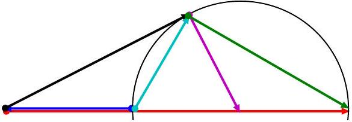
From this figure, it becomes obvious that the
From this figure, it becomes obvious that the phase shift $\varphi$ is maximal when the output phase shift $\varphi$ is maximal when the output voltage vector is tangent to the circle, hence voltage vector is tangent to the circle, hence

$$
\varphi = \arcsin \frac { V _ { 0 } / 2 } { V _ { L } - V _ { 0 } / 2 } = \frac { 3 } { 5 } ,
$$

and

$$
V _ { \mathrm { out } } = \frac { V _ { 0 } / 2 } { \tan \varphi } = \frac { 2 } { 3 } V _ { 0 } .
$$

Alternatively, the problem can be solved using the standard impedance-based approach, but this will be mathematically significantly more technical.

Grading: Concluding that $V _ { C 0 } = V _ { 0 } / 3$ and $V _ { L } = \frac { 4 } { 3 } V _ { 0 } : 0.5 \mathrm { pts }$; concluding that the potential of the upper output node draws a circle (applying the Thales theorem): 1 pt; noting that phase shift is maximal when the output voltage vector is tangent to the circle: 1 pt; finding the phase shift: 0.2 pts; finding $V _ { \text {out } } : 0.3$ pts.
5. ferromagnetic stripe (12 points) - Solution by Jaan Kalda.
i) (0.5 points) We measure $\mathcal { E } = 3.15 \mathrm {~V}$. Any value above 3.20 V or 3.00V will give 0 points. Missing units: subtract 0.2 points.
ii) (1.5 points) We turn the dot on the sensor pointing up, and measure $V _ { 1 } = 1.4 \mathrm { mV }$; then turn it pointing down and measure $V _ { 2 } = - 3.8 \mathrm { mV }$.
(No points are awarded if only one of the voltages $V _ { 1 }$ or $V _ { 2 }$ are measured or voltages readings are incorrect. Reading is judged to be incorrect if the corresponding vertical magnetic field (when calculated correctly) would be greater than $80 \mu \mathrm {~T}$.) The voltage is affected by the offset voltage and the Earth's magnetic field $B _ { E z }$. The Earth's magnetic field influences the reading by a voltage offset $V _ { E z } = B _ { E z } / a$, where $a$ is a constant. We know that if the battery voltage were to be 3 V, then each millivolt is $10 \mu \mathrm {~T}$. Our battery increases the scaling by a factor of $\mathcal { E } / 3 \mathrm {~V}$. In other words, to convert from volts to microteslas, we multiply our voltage through by $a = 10 \mu \mathrm {~T} / \mathrm { mV } \cdot 3 \mathrm {~V} / \mathcal { E } = 9.5 \mu \mathrm {~T} / \mathrm { mV } . ( \mathbf { 0 . 1 } \mathbf { p t s } )$

Taking all this together, we have $V _ { 1 } =$ $V _ { 0 } + B _ { E z } / a$ and $V _ { 2 } = V _ { 0 } - a B _ { E z }$ and so $V _ { 0 } = \left( V _ { 1 } + V _ { 2 } \right) / 2$,
Numerically we get $V _ { 0 } = - 1.3 \mathrm { mV }$,

For this magnetic field value, no points are given if its calculation has mistakes (i.e. it does not correspond to the reported voltage values). If $a = 10.0 \mu \mathrm {~T} / \mathrm { V }$ was used even though the voltage was not 3.00 V, 0.2 point will be subtracted.

Now we can also measure the horizontal component of the magnetic field. To that end, we turn the sensor horizontally, and turn it in horizontal plane so as to maximise the reading $V _ { 3 } = 0.2 \mathrm { mV }$; then the horizontal component can be found as

$$
\begin{equation*}
B _ { E h } = \left( V _ { 3 } - V _ { 0 } \right) a \approx 14 \mu \mathrm {~T} . \tag{0.2pts}
\end{equation*}
$$

Deduce 0.2 pts if the offset is not subtracted, and 0.1 if the scaling factor $a$ is not applied.

The magnetic field strength can be found as $B _ { E } = \sqrt { B _ { E h } ^ { 2 } + B _ { E z } ^ { 2 } }$,
numerically $\approx 52 \mu \mathrm {~T}$.
alternatively, one can turn the sensor in 3D so as to maximize the reading $V _ { \text {max } } = 1.6 \mathrm { mV }$ resulting in $B _ { E } = \left( V _ { \text {max } } - V _ { 0 } \right) a \approx 52 \mu \mathrm {~T}$.

The angle between the vertical direction and the magnetic field is found as $\theta = \arctan B _ { E h } / B _ { E z }$,

numerically $\approx 16 ^ { \circ }$ (0.1 pts)
iii) (2.5 points) We perform the measurements in the same way as before, but we need to keep in mind to subtract not only the offset, but the contribution of the Earth's magnetic field. The easiest way to do this is to subtract from all the readings the voltage $V _ { 1 }$ which includes both the contribution from the Earth's field, and the offset.

| $y / \mathrm { mm } /$ | $V / \mathrm { mV } /$ | $B _ { z } ( y ) / \mu \mathrm { T } /$ |
| :--- | :--- | :--- |
| -15 | 36.5 | 333 |
| -10 | 33.2 | 302 |
| -5 | 30.6 | 277 |
| 0 | 22.6 | 201 |
| 5 | 22.6 | 201 |
| 10 | 24.9 | 223 |
| 15 | 29.3 | 265 |

Each data point from third to seventh, with reasonable values (from $140 \mu \mathrm {~T}$ to $400 \mu \mathrm {~T}$ : 0.3 pts.
Failure to subtract $V _ { 1 }$ : deduce 0.1 pts from each data point; failure to apply the scaling factor $a$ : deduce 0.1 pts from each data point.

Notice that the data are asymmetric with respect to $y = 0$, this is due to inhomogeneity of the stripe. The field values near the edge of the stripe should be higher than at the middle; if this is not observed, subtract 0.3 pts for any subscore not smaller than 0.3 pts.

The average value can be calculating by numerical integration (e.g. by using the trapezoidal or Simpson's rule): $\langle B \rangle = \int B _ { z } \mathrm {~d} y / w$, (0.2 pts)
where the stripe's width $w = 30 \mathrm {~mm}$. (0.2 pts)
Numerical integration yields $\int B _ { z } \mathrm {~d} y \approx$ $752 \mu \mathrm {~T} \mathrm {~cm}$, hence $\langle B \rangle \approx 252 \mu \mathrm {~T}$. (0.4 pts)

Only 0.2 pts are given if this result is smaller than $200 \mu \mathrm {~T}$ or bigger than $300 \mu \mathrm {~T}$; no points are given if it is smaller than $120 \mu \mathrm {~T}$ or bigger than $400 \mu \mathrm {~T}$.

Finally, using the numbers given above, we obtain $\kappa = 0.80$. (0.2 pts)

Points are given only if the result is between 0.6 and 1.
iv) (3.5 points) We proceed similarly to the previous task, except that now we need to subtract also the field of the permanent magnet (previousy the distance from the magnet was so big that the field of the magnet was neglibly small). To that end, we repeat experiment with the magnet only, by moving stripe away as far as possible.

Up to the third data point in the range $3 \mathrm {~cm} \leq x < 8 \mathrm {~cm}$, for each one $\mathbf { 0 . 3 }$ pts. No marks here if the field of the permanent magnet is not subtracted.

Up to the third data point in the range $8 \mathrm {~cm} \leq x < 35 \mathrm {~cm}$, for each one $\mathbf { 0 . 3 p t s }$. Subtract 0.2 pts from the score of each data point if the field of the permanent magnet is not subtracted.

Up to the third data point in the range $35 \mathrm {~cm} \leq x < 67 \mathrm {~cm}$, for each one $\quad \mathbf { 0 . 3 ~ p t s }$. Subtract 0.1 pts from the score of each data point if the offset voltage and the Earth's field are not subtracted.

If no units, but the units can be guessed: subtract 0.1 for missing voltage units, 0.1 for missing distance units, and 0.1 for missing magnetic field units.

For correct plotting: 0.5 pts.
Missing units on graph: subtract 0.1 pts for each. Graph fills less than one third of the graph area: subtract 0.1 pts.
Magnetic field at small $x$ is around 10 times bigger than at moderate values of $x$ : $\mathbf { 0 . 3 }$ pts.
v) (2.5 points) Magnetic flux is "attracted" into ferromagnetic materials (minimising this way the energy of the magnetic field by a fixed magnetic flux). However, ferromagnetic will attract the field only until a saturation is reached from which point this is no longer energetically favourable. For our soft ferromagnetic $\mu \gg 1$, hence the magnetisation $\vec { J } = \vec { B } / \mu _ { 0 } - \vec { H } \approx \vec { B } / \mu _ { 0 }$. This means that all we need to do is to determine the field $B = B _ { x } \hat { x }$ attracted into the ferromagnetic stripe: $\mu _ { 0 } J = B _ { x }$. (0.5 pts)

Due to the Gauss law for the magnetic field, $B _ { x } ( x = a ) w t = 2 w \kappa \int _ { a } ^ { L } B _ { z } \mathrm {~d} x$, 1 point.
Here $a = 3 \mathrm {~cm}$ stands for the point at which we calculate the B-field. At even smaller values of $x$, the magnetisation is slightly larger, but the difference is not big (it can be estimated through the magnetic flux leakage from $x = 0$ to $x = a$ ). The factor two stands for the fact that the magnetic flux exits the stripe both through the top surface, and the bottom surface. If factor 2 is missing, subtract 0.3 pts.

We can integrate numerically using trapezoidal or Simpson's rule to obtain $\int _ { a } ^ { L } B _ { z } \mathrm {~d} x \approx 79 \mathrm { mT } \cdot \mathrm { cm }$ (0.7 pts)

This subscore is given only if the numerical integration is preformed with a relative error less than 10\% (from the Simpson's rule result).

Finally, we obtain $\mu _ { 0 } J _ { s } = 2 \int _ { a } ^ { L } B _ { z } \mathrm {~d} x / t \approx$ 2.5 T. (0.3 pts)

This subscore is given only if the result is from 1.6 to 3.2 T.
vi) (1.5 points) In principle, there are two ways to show that the saturation is reached.

The first method is to estimate the total magnetic field flux $\Phi \approx \pi B _ { 0 } d ^ { 2 } / 4$ sent by the permanent magnet to the ferromagnetic stripe, where $B _ { 0 }$ is an estimate for the magnetic field strength at the circular face of the magnet, and $d \approx 1 \mathrm {~cm}$ denotes the diameter of the magnet. If this flux is bigger than the flux $\Phi _ { s } = 2 w \kappa \int _ { a } ^ { L } B _ { z } \mathrm {~d} x$ then the saturation has been reached. has been reached. (0.5 pts)

From the results above we find $\Phi _ { s } 79 \mathrm { mT } \cdot \mathrm { cm } \cdot w \approx 0.24 \mathrm {~T} \cdot \mathrm {~cm} ^ { 2 }$. (0.2 pts)

The value of $B _ { 0 }$ can be estimated by extrapolating the field measurement data along the axis of the magnet using the dipole field dependence $B \propto l ^ { - 3 }$, where $l$ denotes the distance to the centre of the magnet. (0.5 pts)

The result is $B _ { 0 } \approx 0.7 \mathrm {~T}$, and $\Phi \approx$ $0.5 \mathrm {~T} \cdot \mathrm {~cm} ^ { 2 }$. This is bigger than $\Phi _ { s }$, but not much bigger, so the calculations need to be accurate. accurate. (0.3 pts)

The second way is to put the magnet to the centre of the stripe and repeat the magnetic field measurements along the stripe as was done in task iv. (0.5 pts)

It turns out that the field strength as a function of distance from the magnet is the same as it was before. (0.5 pts)

This means that now the magnet sends twice as big flux into the sheet, from the centre towards the both ends of the stripe. Hence, previously the stripe had a capacity to conduct only half or less of the full flux of the magnet. (0.5 pts)

6. Life hacks (6 points) - Solution by Taavet Kalda.
i) (1 point) A healthy eye can see from $a _ { 0 } =$ 0.25 m to $b _ { 0 } = \infty$. The images formed by the two limit points through the contact lens define the range $\left( a _ { 1 } , b _ { 1 } \right)$ the nearsighted eye can focus. For this, we use the Lens' formula:

$$
\begin{aligned}
& \frac { 1 } { a _ { 0 } } + \frac { 1 } { a _ { 1 } } = D _ { 0 } , \\
& \frac { 1 } { b _ { 0 } } + \frac { 1 } { b _ { 1 } } = D _ { 0 } = \frac { 1 } { b _ { 0 } } ,
\end{aligned}
$$

where $D _ { 0 } = - 6 \mathrm { dptr }$. This yields

$$
\begin{aligned}
a _ { 1 } & = \frac { 1 } { D _ { 0 } - 1 / a _ { 0 } } = - 10.0 \mathrm {~cm} , \\
b _ { 1 } & = - \frac { 1 } { D _ { 0 } } = - 16.7 \mathrm {~cm} .
\end{aligned}
$$

Because of the sign convention in the Lens formula, the clear-vision range without contact lenses is from $- a _ { 1 } = 10.0 \mathrm {~cm}$ to $- b _ { 1 } =$ 16.7 cm.

Grading:

- Correct understanding of the optical setup (0.5 pts)
- Lens equation (0.3 pts)
- Expressing the final answer (0.2 pts)

ii) (2 points) The setup is the same, only that the lens moves a distance $L = 2.00 \mathrm {~cm}$ away from the eye. Since both of the locations of the limit points and their images must stay the same relative to the eye, both the limit points and their images are shifted relative to the glass lens by $L$. Taking care with the signs, this translates to the required lens power for the limit points to be

$$
\begin{aligned}
& \frac { 1 } { a _ { 1 } + L } + \frac { 1 } { a _ { 0 } - L } = - 8.15 \mathrm { dptr } , \\
& \frac { 1 } { b _ { 1 } + L } + \frac { 1 } { b _ { 0 } - L } = - 6.82 \mathrm { dptr } .
\end{aligned}
$$

The minimal required glass lens power $D _ { 1 }$ is the higher (in absolute value) of the two values, hence $D _ { 1 } = - 8.15 \mathrm { dptr }$. We can indeed check that this focuses infinity, as infinity gets focused to a distance of $- 1 / D _ { 1 } + L =$ 14.2 cm from the eye, safely in $\left( a _ { 1 } , b _ { 1 } \right)$.

Grading: - Understanding that the limit points and their images stay the same relative to the eye (1.0 pts)

- Correct formulation of the lens equations (0.5 pts)

- Choosing the correct value for the lens power (0.3 pts)

- Expressing the final answer (0.2 pts)

iii) (3 points) Let the distance between the front and back wheels be $2 a$, and the height of the centre of mass from the bottom of the car $h$.

In the case of the car blocking all the wheels, the car acts as one solid body, i.e. the slipping condition can be written as $\mu =$ $\tan \alpha _ { 0 } = \tan 45 ^ { \circ } = 1$.

The acceleration of a front-wheel-drive car is limited by the grip of its front wheels (i.e. friction with the ground) with the back wheels rolling frictionlessly. In total, there are four forces acting on the car, but the normal and friction forces acting on the front wheel can be coupled into one resultant force $\vec { F } _ { f }$ acting at an angle of $\beta = \arctan \mu$ with respect to the surface normal. There is further the normal force of the back wheels, $\vec { N } _ { b }$, and finally the gravitational force $m \vec { g }$ applied on the centre of mass of the car. The forces are shown on the figure below
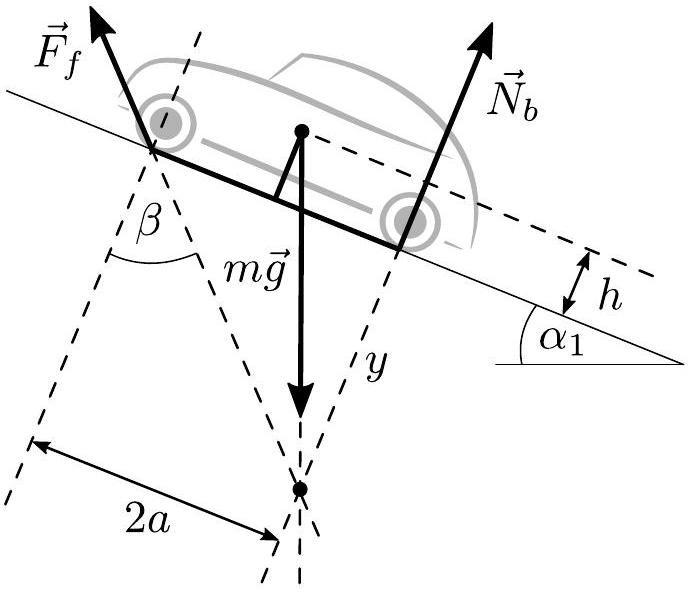

At the critical angle $\alpha _ { 1 } = 22 ^ { \circ }$, the forces are in equilibrium. This condition can be solved in multitude of ways, either by brute force (1 rotational and 2 translational force balance equations) or geometrically by noting that the three forces in equilibrium must all intersect in one point. This can be proven by contradiction by observing the torque around any intersection of two of the forces. With the geometrical approach, we make use of the fact that $m \vec { g }$ is vertical, $\vec { N } _ { b }$ is perpendicular to the surface (so at an angle $\alpha _ { 1 }$ w.r.t. $m \vec { g }$ ) and $\vec { F } _ { f }$ at an angle $\beta$ w.r.t. the surface normal. The intersection condition is then most conveniently written by expressing the distance of the intersection point from the surface, $y$, in two different ways:

$$
y = \frac { 2 a } { \tan \beta } = \frac { a } { \tan \alpha _ { 1 } } - h .
$$

Hence,

$$
\frac { h } { a } = \frac { 1 } { \tan \alpha _ { 1 } } - \frac { 2 } { \tan \alpha _ { 0 } } .
$$

We can proceed exactly the same way for the case of the car backing up at the other, yet unknown, critical angle $\alpha _ { 2 }$, illustrated below.
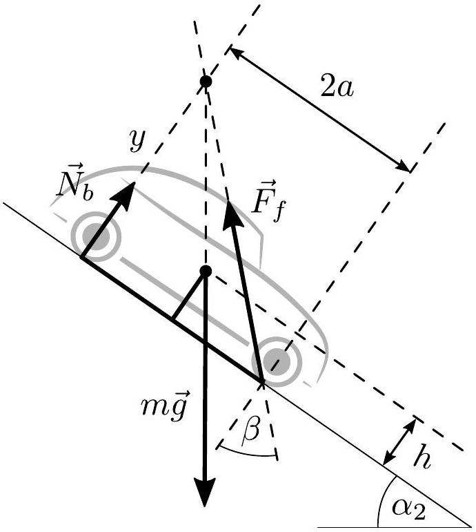

We proceed to write down the equilibrium condition the same way as before, by expressing the distance of the intersection point from the surface in two different ways:

$$
y = \frac { 2 a } { \tan \beta } = \frac { a } { \tan \alpha _ { 2 } } + h .
$$

Hence,

$$
\begin{aligned}
\tan \alpha _ { 2 } & = \left( \frac { 2 } { \tan \alpha _ { 0 } } - \frac { h } { a } \right) ^ { - 1 } \\
& = \left( \frac { 4 } { \tan \alpha _ { 0 } } - \frac { 1 } { \tan \alpha _ { 1 } } \right) ^ { - 1 }
\end{aligned}
$$

and so $\alpha _ { 2 } = 33.3 ^ { \circ }$.
Grading:

- Understanding the dynamics of a frontwheel-drive car; identifying the four forces acting on the car ( $\mathbf { 0 . 8 ~ p t s ) }$
- Solving the case with brakes blocking all wheels (0.4 pts)
- Writing down the equilibrium condition for going uphill (0.8 pts)
- Writing down the equilibrium condition for reversing uphill (0.8 pts)
- Expressing the final answer (0.2 pts)
7. Electrons in magnetic field (9 points)

- Solution by Taavet Kalda.
i) (2 points) Due to Lorentz force not acting along the direction that's parallel to $B$, the condition for electrons to stay the same distance along that axis becomes simply that their velocity components along $B$ are equal. We will henceforth only consider the motion on the plane that's perpendicular to $B$.

Neglecting electrostatic interactions, electrons move on circular trajectories of frequency $\omega$ given by the right hand rule, found from the centrifugal and Lorentz force balance:

$$
\frac { m v ^ { 2 } } { R } = m v \omega = v e B ,
$$

hence $\omega _ { 0 } = e B / m$. In other words, the angular frequency for both electrons is the same and independent of their speeds. We also get an expression for the radius of the circular trajectory: $R = v / \omega _ { 0 } = m v / ( e B )$.

An important consequence is that the angle between the velocities of the two electrons stays constant in time. Hence, the relative velocity between the two electrons is also constant in magnitude (and not zero!) and rotating with $\omega _ { 0 }$. For the relative velocity to keep the distance between electrons constant, the distance vector between the two electrons must be perpendicular to the relative velocity and hence also rotate with angular speed $\omega _ { 0 }$. This is enough to conclude

that the only way this is satisfied is when the two electrons move on concentric circular trajectories.

The condition for the relative velocity to be perpendicular to the distance vector gives us that the speed of the other electron is $u =$ $v / \cos \alpha$. The radii of the two circles are then $R _ { 1 } = v / \omega _ { 0 }$ and $R _ { 2 } = v / \left( \cos \alpha \omega _ { 0 } \right)$. The trajectories are illustrated below.

## Grading:

- Finding the cyclotron frequency and radius of curvature from force balance (0.5 pts)
- Showing that the two orbits must be concentric, of which
- deducing that the angle between velocities is constant (0.3 pts)
- showing that the displacement trajectory rotates with $\omega _ { 0 }$ on a circular trajectory (0.4 pts)
- concluding that the orbits are concentric (0.2 pts)
- Correct sketch of the trajectories (0.3 pts)
- Correct expression for the speed of the other electron (0.3 pts)

ii) (1 point) The class of solutions we found in the previous part does not cover the case where the two trajectories intersect. However, the previous part assumed that $\alpha \neq 0$. Hence, for the trajectories to intersect, we need $\alpha = 0$ and $u = v$. In other words, $\vec { u } = \vec { v }$. This leaves us complete freedom in the locations of the centres of the two trajectories, as long as they intersect. A sketch of a potential trajectory is shown below
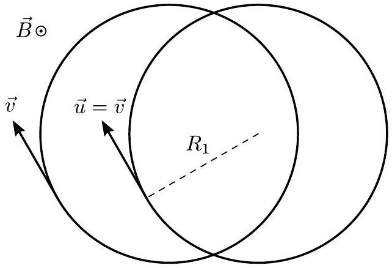

## Grading:

- Deducing that $\alpha = 0$ and $u = v$ (0.4 pts)
- Concluding that $\vec { u } = \vec { v }$ (0.3 pts)
- Sketch (0.3 pts)

iii) (2 points) The frequency of the periodic motion is $2 \pi / T = e B / ( 3 m ) = \omega _ { 0 } / 3$, i.e. a third of the cyclotron frequency. Now, it's clear that a simple solution that can satisfy the electrons being equidistant and with equal speeds is simply the one where they move on the same circular trajectory, but in the opposite phase. We proceed to reason why this is the only potential solution.

The net force on any of the electrons must be perpendicular to the velocity of the said electron (otherwise $v \neq$ const). The Lorentz force is automatically perpendicular to the velocity, and hence we need the Coulomb force to also be perpendicular to the velocity. This means that the displacement vector has to be perpendicular to the velocities and this, combined with the electrons being equidistant, gives us the aforementioned circular solution.

The radial force balance equation reads

$$
\frac { m \omega ^ { 2 } l } { 2 } = e v B - \frac { k e } { l ^ { 2 } } ,
$$

where negative sign points outward (Lorentz force must be positive signed for the electrons not to repulse each-other). Using $v =$ $\omega l / 2$ and substituting $\omega$, we get

$$
\frac { e ^ { 2 } B ^ { 2 } l } { 18 m } = \frac { e ^ { 2 } B ^ { 2 } l } { 2 m } - \frac { k e ^ { 2 } } { l ^ { 2 } }
$$

and so

$$
l = \sqrt [ 3 ] { \frac { 9 k m } { 4 B ^ { 2 } } }
$$

## Grading:

- Showing that the electrons must be orbiting each-other on a circular orbit (0.7 pts)
- Radial force balance (0.8 pts)
- Final answer (0.5 pts)

iv) (2 points)In order to analyse the trajectories given on the figure, we need some basic understanding of their underlying dynamics. As compared to the previous task, the condition for the centre of mass to be at rest is now relaxed. We start in the most general form and write down the forces acting on the two electrons, 1 and 2:

$$
\begin{aligned}
& m \dot { \vec { v } } _ { 1 } = - \frac { k e ^ { 2 } } { l ^ { 2 } } \hat { l } + e \vec { v } _ { 1 } \times \vec { B } \\
& m \dot { \vec { v } } _ { 2 } = \frac { k e ^ { 2 } } { l ^ { 2 } } \hat { l } + e \vec { v } _ { 2 } \times \vec { B }
\end{aligned}
$$

where $\vec { l } = \vec { r } _ { 2 } - \vec { r } _ { 1 }$ is the displacement vector from 1 to 2 and $\hat { l }$ is the corresponding unit vector. We can cancel out the Coulomb force by adding the two equations together:

$$
m \left( \dot { \vec { v } } _ { 1 } + \dot { \vec { v } } _ { 2 } \right) = e \left( \vec { v } _ { 1 } + \vec { v } _ { 2 } \right) \times \vec { B } .
$$

This can be further simplified by substituting the centre of mass velocity $\vec { v } _ { \mathrm { CM } } = \left( \vec { v } _ { 1 } + \vec { v } _ { 2 } \right) / 2$ :

$$
m \dot { \vec { v } } _ { \mathrm { CM } } = e \vec { v } _ { \mathrm { CM } } \times \vec { B } .
$$

This mirrors exactly the equation of motion of a single electron, meaning the centre of mass moves on a circular trajectory with frequency $\omega _ { 0 }$, even in the presence of the Coulomb force.

We proceed with a similar analysis for the difference of velocities:

$$
m \left( \dot { \vec { v } } _ { 1 } - \dot { \vec { v } } _ { 2 } \right) = - 2 \frac { k e ^ { 2 } } { l ^ { 2 } } \hat { l } + e \left( \vec { v } _ { 1 } - \vec { v } _ { 2 } \right) \times \vec { B } .
$$

Substituting in the velocity of 1 w.r.t. CM $\Delta \vec { v } _ { 1 } = \vec { v } _ { 1 } - \vec { v } _ { \mathrm { CM } } = \left( \vec { v } _ { 1 } - \vec { v } _ { 2 } \right) / 2$ we get

$$
m \Delta \dot { \vec { v } } _ { 1 } = - \frac { k e ^ { 2 } } { l ^ { 2 } } \hat { l } + e \Delta \vec { v } _ { 1 } \times \vec { B }
$$

which, once again, mirrors the equation of motion of the previous sub-task. Explicitly, the EoM of the previous part was

$$
m \dot { \vec { v } } = - \frac { k e ^ { 2 } } { l ^ { 2 } } \hat { l } + e \vec { v } \times \vec { B } .
$$

Therefore, $\Delta \vec { v } _ { 1 }$ rotates with an angular frequency $\omega$ that's smaller than $\omega _ { 0 }$.

In conclusion, the motion of an electron is the superposition of the circular trajectory of the centre of mass of radius $\left| \vec { R } _ { 1 } \right| = R _ { 1 }$ and frequency $\omega _ { 0 }$ and the circular motion of the electron of radius $\left| \vec { R } _ { 2 } \right| = R _ { 2 }$ and frequency $\omega < \omega _ { 0 }$ around the centre of mass. The other electron is diametrically opposite around the centre of mass, separated by a distance $R _ { 2 }$ from the first electron. $R _ { 1 } , R _ { 2 }$ and $\omega$ are free parameters.

We finally continue with the graph given in the statement. Since the trajectory makes one hoop in a full period, $\omega _ { 0 }$ must be an integer multiple of $\omega$. If this wasn't the case, both $\vec { R } _ { 1 }$ and $\vec { R } _ { 2 }$ must make more than one full rotation in a period and the result would be a hoop that goes around itself more than once (possibly self-intersecting in the process). Thus, $\omega _ { 0 } = N \omega$, where $N \in \{ 2,3 , \ldots \}$ ( $N = 1$ gives a circle).

For the next step, let's consider the effect of radius of curvature, an easily observable property of the trajectory. In general, the bigger the speed, the bigger the radius of curvature (Coulomb force gives a constant contribution to the radial force, and Lorentz force has a monotonously increasing relation between $R$ and $v$ ). Hence, the point on the trajectory with the biggest radius of curvature has the highest speed (marked on the figure with $B$ ), and vice-versa (marked with $A$ ). Further, the biggest speed happens when $\vec { R } _ { 1 }$ and $\vec { R } _ { 2 }$ are parallel, and the smallest when they're antiparallel (having speeds $\omega _ { 0 } R _ { 1 } + \omega R _ { 2 }$ and $\left| \omega _ { 0 } R _ { 1 } - \omega R _ { 2 } \right|$ respectively). Now, in a full period, $\vec { R } _ { 2 }$ goes around once, and $\vec { R } _ { 1 }$ goes around $N$ times. Therefore, $\vec { R } _ { 1 }$ overtakes $\vec { R } _ { 2 }$ a total of $N - 1$ times and we expect to see $N - 1$ occurrences of maximal speed, i.e. maximal radius of curvature. Because we see this happen once, $N = 2$. This immediately gives the period of the motion to be $T = 2 \pi / \omega = 4 \pi / \omega _ { 0 } = 4 \pi m / ( e B )$.

From the previous theory, $| A B | = 2 R _ { 2 }$, and the centre point $O _ { 1 }$ between $A$ and $B$ is where $\vec { R } _ { 1 }$ intersects with the axis of symmetry. The other point where $\vec { R } _ { 1 }$ intersects with the axis is when $\vec { R } _ { 1 }$ and $\vec { R } _ { 2 }$ are per-

pendicular. This can be found by finding the points (using a ruler) which are $| A B | / 2$ away from the principal axis (we mark these by $C$ and $D$ ). There are two solutions, the right one of which is unphysical (as can be seen by the following constructions breaking down). Having found the other intersection point $O _ { 2 }$ (which happens to coincide with $A$ ), we can fully reconstruct $\vec { R } _ { 1 }$ (colored blue) and from there it's easy to find the centre of mass corresponding to the marked electron (by finding the point on $\vec { R } _ { 1 }$ which is a distance $R _ { 2 }$ from the marked point using a compass) and hence the location of the other electron (by mirroring the marked electron w.r.t. the centre of mass), marked cyan.
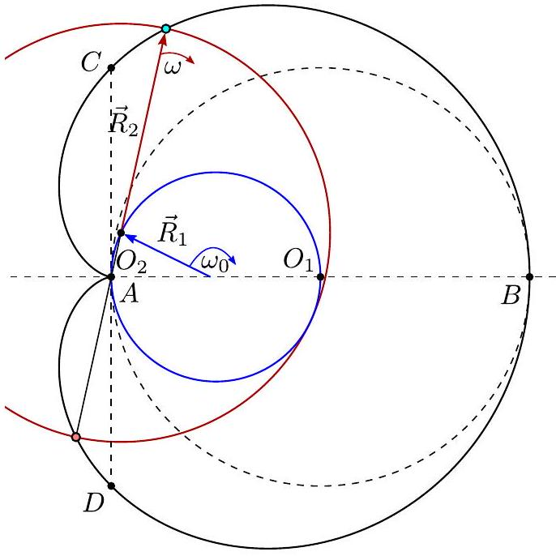

Alternative solution.
An alternative solution with simpler geometric operations, but more complex algebra would follow a similar line of reasoning until $N = 2$. After that, one can show that the two electrons follow the same orbit by expressing the locations of the two electrons via complex numbers $z _ { \pm } = R _ { 1 } \exp ( 2 \mathrm { i } \omega t ) \pm R _ { 2 } \exp ( \mathrm { i } \omega t )$. This is a commonly deployed method to simplify vector operations. The real part of the complex number is the $x$-coordinate, and the imaginary the $y$-coordinate. Now, if we apply a phaseshift of $\pi$ to $\omega t , z _ { + }$becomes $z _ { - }$and vice-versa. This is because $\exp ( 2 \mathrm { i } ( \omega t + \pi ) ) = \exp ( 2 \mathrm { i } \omega t ) \cdot \exp ( 2 \pi \mathrm { i } ) =$ $\exp ( 2 \mathrm { i } \omega t )$ and $\exp ( \mathrm { i } \omega t + \mathrm { i } \pi ) = - \exp ( \mathrm { i } \omega t )$. Hence, $z _ { + }$and $z _ { - }$follow the same trajectory but with a $\pi$ phaseshift, exactly as we wanted.

Now, the location of the other electron can be simply found by drawing a circle of radius $| A B |$ from the first electron and seeing where it intersects with the trajectory.

## Grading:

- Analysis of the dynamics of the system, of which:
- Equations of motions for both electrons (0.4 pts)
- Deducing that the centre of mass moves on a circular orbit of frequency $\omega _ { 0 }$ (0.3 pts)
- Deducing that the electrons orbit centre of mass with frequency $\omega < \omega _ { 0 }$. (0.4 pts) If the student implicitly assumes $\omega > \omega _ { 0 }$ but does the rest correctly (including the constructions), award a maximum of 1.5 points.
- Analysing the trajectory to show that $\omega =$ $\omega _ { 0 } / 2$. (0.3 pts)
- Using points $A$ and $B$ to get $2 R _ { 2 }$ (0.3 pts)
- Using $C$ and $D$ to find $R _ { 1 }$ and hence the location of the other electron (alternatively using $| A B |$ and reasoning that the electrons must share a trajectory) (0.3 pts)

v) (2 points) Based on the previous reasoning, we see that the trajectory has two points with maximal radius of curvature, and hence $N = 3$, i.e. the same as in part iii). Now, the first electron is at the inflection point where it's momentarily at rest (before being pushed into motion by Coulomb force). Also, since it's the point with highest curvature, we have $v _ { 1 } = \left| \omega _ { 0 } R _ { 1 } - \omega R _ { 2 } \right| = 0$ so $\omega _ { 0 } R _ { 1 } = \omega R _ { 2 }$. Because the other electron is diametrically opposite w.r.t. centre of mass, it's at the point of highest speed, i.e. $v _ { 2 } = \omega _ { 0 } R _ { 1 } + \omega R _ { 2 } = 2 \omega R _ { 2 }$.

Now, because the equation of motion defining $R _ { 2 }$ is the same as in part iii) (as highlighted in the previous subtask), we can reuse the result form that part to get

$$
R _ { 2 } = \frac { l } { 2 } = \sqrt [ 3 ] { \frac { 9 k m } { 32 B ^ { 2 } } }
$$

and so

$$
v _ { 2 } = 2 \omega R _ { 2 } = \frac { 2 e B } { 3 m } R _ { 2 } = e \sqrt [ 3 ] { \frac { k B } { 12 m ^ { 2 } } } .
$$

## Grading:

- Deducing that $\omega = \omega _ { 0 } / 3$ (the toolset for this should've been developed in the previous part) (0.3 pts)
- Finding that the highlighted electron is at rest (0.3 pts)
- Rest condition $\omega _ { 0 } R _ { 1 } = \omega R _ { 2 }$ (0.3 pts)
- Expressing the speed of the other electron as $2 \omega R _ { 2 }$ ( $\mathbf { 0 . 3 }$ pts)
- Solving the force balance equation for $R _ { 2 }$ (or reusing the result from part iii)) (0.7 pts)
- Final expression (0.1 pts)
8. Planets (9 points) - Solution by Taavet Kalda.
i) (0.7 points)A waxing crescent moon can be seen immediately after sunset, illustrated below
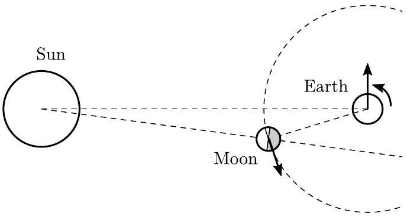

Grading:

- Figure with Moon between Earth and Sun (0.3 pts)
- All rotation directions consistent (0.1 pts)
- Correct answer A (0.3 pts)

ii) (1.2 points) Zenith in Tallinn forms an angle $\varphi = 59.5 ^ { \circ }$ with the celestial equator. During a winter solstice, the Sun is $\varepsilon =$ $23.5 ^ { \circ }$ below the celestial equator. Since full moon occurs when it's opposite to the Sun, Moon must be $\varepsilon$ above the celestial equator. Further, the Moon is at its highest when it crosses the plane formed by the centre of Earth, the north pole (marked NP) and the ray pointing towards the zenith in Tallinn. A convenient way to imagine this is how during one day, stars and planets (alongside the Moon) stay roughly the same relative to eachother in the sky, but the sky as a whole rotates around the axis formed by the centre of Earth and north pole. This is depicted in the figure below, alongside with the celestial equator. From the figure, we can now read that the Moon is an angle $\varphi - \varepsilon$ from the zenith and hence the maximal culmination angle is $90 ^ { \circ } - \varphi + \varepsilon = 54.0 ^ { \circ }$.
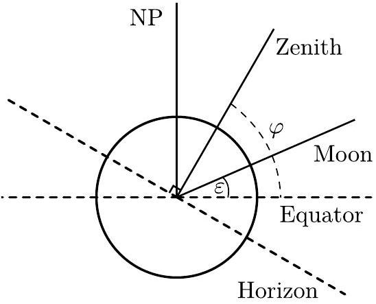

Grading:

- Understanding of the positions of Tallinn, Earth and Moon at the maximum point (0.5 pts)
- Correct final expression (0.6 pts)
- Correct numerical value $54.0 ^ { \circ }$ (0.1 pts)
- Expression and value to Zenith 36.0° given instead (0.5 pts)

iii) (1.2 points) The flux of an object drops inverse squared to the distance from the said object.

Mars is closest/farthest to Earth when it aligns with the line formed by Earth and Sun. In both cases, Mars is at full phase. At its closest, Mars is $d _ { - } = R _ { \sigma ^ { 7 } } - R _ { \oplus }$ from Earth, and its farthest, $d _ { + } = R _ { \Omega ^ { 7 } } + R _ { \oplus }$. In both cases, the same amount of sunlight reaches the Mars surface (because we assume Mars to always be $R _ { \Omega ^ { \text {® } } }$ from the Sun). This, combined with phases being the same, gives us the ratio of illuminances to be

$$
\frac { I _ { \max } } { I _ { \min } } = \frac { d _ { + } ^ { 2 } } { d _ { - } ^ { 2 } } = \left( \frac { R _ { \Omega ^ { \gamma } } + R _ { \oplus } } { R _ { \Omega ^ { \gamma } } - R _ { \oplus } } \right) ^ { 2 } = 25 .
$$

Grading:

- Noting $I \propto 1 / r ^ { 2 }$ (0.2 pts)
- Noting minimum/maximum correspond to $R _ { \Omega ^ { \text {九 } } } \pm R _ { \oplus }$ (0.2 pts)
- Noting Mars is at full phase in both positions (0.2 pts)
- Correct final expression (0.5 pts)
- Correct numerical value 25 (0.1 pts)

iv) (1.2 points) Looking from the Sun, the separation between Earth and Mars must change from 0 to $\pi$ between the two described situations. The relative angular speed of the two planets is $\Delta \omega = 2 \pi / T _ { \oplus }$ - $2 \pi / T _ { \sigma ^ { \text {® } } }$. Mars' period can be found from Kepler's III law as $T _ { \sigma ^ { r } } = T _ { \oplus } \sqrt { \left( R _ { \Omega ^ { r } } / R _ { \oplus } \right) ^ { 3 } }$. The time taken is thus

$$
t = \frac { \pi } { \Delta \omega } = \frac { T _ { \oplus } } { 2 } \frac { 1 } { 1 - \left( R _ { \oplus } / R _ { \Omega ^ { r } } \right) ^ { 3 / 2 } } = 1.1 \mathrm { yrs } .
$$

Grading:

- Expressing the relative angular speed $\Delta \omega$ (0.3 pts)
- Solving $T _ { \sigma ^ { r } }$ in terms of $T _ { \oplus }$ and orbital radii (0.3 pts)
- Correct final expression for half a period (0.5 pts)
- Correct numerical value 1.1 yrs (0.1 pts)

v) (1.2 points) The maximal angular separation between Sun and Venus, as seen from Earth, can be found as the angle between Earth-Sun ray and the ray that goes through Earth and is tangent to the orbit of Venus. From the right angled triangle, we get the seperation to be $\alpha = \arcsin \left( R _ { ণ } / R _ { \oplus } \right) = 46.1 ^ { \circ }$. We therefore see Venus for a duration of

$$
1 \text { day } \cdot \frac { \alpha } { 2 \pi } = 11050 \mathrm {~s} = 3 \mathrm { hrs } 4 \mathrm {~min} .
$$

Grading:

- Angular separation is the angle between the Earth-Sun and Earth-Venus rays (0.2 pts)
- Expressing time as a ratio to a full rotation of the Earth (0.2 pts)
- Maximal when tangent to orbit (0.4 pts)
- Correct expression for $\alpha$ (0.3 pts)
- Correct numerical value for time $11050 \mathrm {~s} =$ 3hrs 4min (0.1 pts)

vi) (2.5 points) As discussed in part iii), the luminosity of a planet is the product of its phase, $\varphi$ (the fraction of its area which is illuminated), and the inverse squared distance to Earth. In other words,

$$
\frac { I } { I _ { 0 } } = \frac { \varphi } { L ^ { 2 } } .
$$

In the figure below, the phase is simply the ratio of the lengths of the "visible" to the "dark" part.
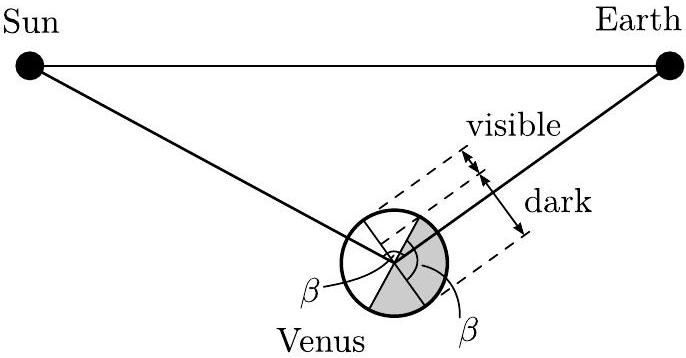
From the geometry, we see that this is ( $1 +$ $\cos \beta ) / 2$, where $\beta$ is the angle between the Sun, Venus, and Earth. From cosine law, we get

$$
R _ { \oplus } ^ { 2 } = R _ { \oplus } ^ { 2 } + L ^ { 2 } - 2 R _ { \oplus } L \cos \beta
$$

so

$$
1 + \cos \beta = 1 + \frac { R _ { \oplus } ^ { 2 } - R _ { \oplus } ^ { 2 } + L ^ { 2 } } { 2 R _ { + } L } .
$$

Hence,

$$
\begin{aligned}
\frac { I } { I _ { 0 } } & = \frac { R _ { q } ^ { 2 } - R _ { \oplus } ^ { 2 } } { 2 R _ { \circ } L ^ { 3 } } + \frac { 1 } { L ^ { 2 } } + \frac { 1 } { 2 R _ { \circ } L } \\
& = - \frac { R _ { \oplus } ^ { 2 } - R _ { \circ } ^ { 2 } } { 2 R _ { \circ } } x ^ { 3 } + x ^ { 2 } + \frac { 1 } { 2 R _ { \circ } } x ,
\end{aligned}
$$

where we set $x = L ^ { - 1 }$.
Grading:

- Realizing $I / I _ { 0 }$ is dependent on what fraction of Venus is illuminated from Earth's view (0.4 pts)
- Dependency of the form $\varphi / L ^ { 2 }$ (0.4 pts)
- Realizing illuminated area is proportional to $1 + \cos \beta$ (0.8 pts)
- Expressing $\beta$ using the cosine law (0.2 pts)
- Correct final expression (0.7 pts)

vii) (1 point) Our goal is to maximise $I ( x ) / I _ { 0 }$ in the range $x \in \left[ 1 / \left( R _ { \oplus } + R _ { q } \right) , 1 / \left( R _ { \oplus } - R _ { q } \right) \right]$. $I ( x )$ is a cubic that starts off from 0 at $x = 0$ and extends all the way to negative infinity at $x \longrightarrow \infty$. We find the extrema by setting the derivative to zero

$$
\frac { \mathrm { d } } { \mathrm {~d} x } \left( \frac { I } { I _ { 0 } } \right) = 0 = - 3 \frac { R _ { \oplus } ^ { 2 } - R _ { \ominus } ^ { 2 } } { 2 R _ { \ominus } } x ^ { 2 } + 2 x + \frac { 1 } { 2 R _ { \circ } } .
$$

This is a quadratic whose solutions are

$$
x _ { \pm } = \frac { 2 R _ { \supsetneq } \pm \sqrt { 3 R _ { \oplus } ^ { 2 } + R _ { \circ } ^ { 2 } } } { 3 \left( R _ { \oplus } ^ { 2 } - R _ { \circ } \right) ^ { 2 } } .
$$

The negative solution is smaller than 0, and hence doesn't interest us. Now, the positive solution must correspond to a maximum due to the function tending to negative infinity at big values. After careful rearranging, the positive solution simplifies to

$$
1 / x _ { + } = - 2 R _ { \circ } + \sqrt { 3 R _ { \oplus } ^ { 2 } + R _ { \circ } ^ { 2 } } = 0.436 \mathrm { AU } ,
$$

which safely falls in the range of $\left[ R _ { \oplus } - \right.$ $\left. R _ { \mathrm { q } } , R _ { \oplus } + R _ { \mathrm { q } } \right]$ and hence is the distance of maximal intensity, $L _ { 0 } = 1 / x _ { + } = 0.436 \mathrm { AU }$.

We find the maximal angular distance between the Sun and Venus using cosine law as

$$
\alpha _ { 0 } = \arccos \left( \frac { R _ { \oplus } ^ { 2 } + L _ { 0 } ^ { 2 } - R _ { \ominus } ^ { 2 } } { 2 L _ { 0 } R _ { \oplus } } \right) = 39.6 ^ { \circ } .
$$

Grading:

- Noting maxima occurs at zero of derivative (0.5 pts)
- Correct final expression for $L$ (0.2 pts)
- Correct numerical value for $L$ (0.1 pts)
- Numerical answer within range [0.28 au, 1.72 au] (0.1 pts)
- Correct numerical value for the angular distance 39.6° (0.1 pts)
9. Magnet in glass (12 points) - Solution by Jaan and Taavet Kalda.
i)(1 point)The height is best measured using a caliper by either making markings on the surface of the cylinder corresponding to the perpendiculars of the ends of the magnet, or by measuring it from far away. Either way, the goal is to remove the effects of parallax when measuring the height of the cylinder. The following measurements were made

| $i$ | $h ( \mathrm {~mm} )$ |
| :--- | :--- |
| 1 | 9.7 |
| 2 | 9.5 |
| 3 | 9.4 |

1 measurement (0.3/0.5 pts)
2 measurements (0.4/0.5 pts)
3 or more measurements (0.5/0.5 pts)

The average height is found to be $h =$ 9.5(2) mm. value within $[ 9.1 \mathrm {~mm} , 10.0 \mathrm {~mm} ]$ (0.3 pts) error (0.2 pts)
ii) (3 points)Note that if the solid cylinder and the cylinder with a magnet were to roll down on the same slope of angle $\alpha$, the former will roll slower because it has relatively larger moment of inertia. One can easily derive a formula for the acceleration by rolling: $a = g \sin \alpha / ( 1 + \kappa )$. For cylinder, $\kappa _ { c } = \frac { 1 } { 2 }$, hence, for the cylinder with magnet, $\kappa > \frac { 1 } { 2 }$.

Correct formula for $a$ (0.4 pts)
This observation brings us to the idea about how to perform the experiment: we need to build two slopes side-by-side, with slightly different slope angles, so that the two cylinders were to roll down with exactly the same speed.

This idea (0.6 pts)
If we release cylinders simultaneously, we can easily detect by eye if one of them is faster. We need to perform many experiments, though, because the release is sometimes unsuccessful, and one of the cylinders will obtain a slight head-start. Also, we need to make many experiments to reduce the statistical uncertainty.

It is convenient to build the sightly different slopes by supporting the two boards from one end on the same brick, but displacing one of them by a certain distance $s$.

With board length $L = 60 \mathrm {~cm}$ and brick height $h = 56 \mathrm {~mm}$, we build slopes so that the brick is supporting the boards near their end.
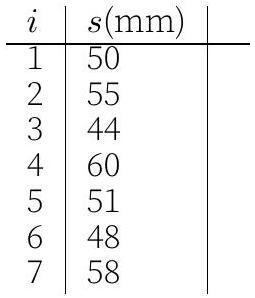
This means that in average, $s \approx 52 \mathrm {~mm}$

Each measurement up to the 7th (0.1/0.7 pts) Measuring $L$ (0.2 pts) Measuring $h$ (0.2 pts)

Based on the formula for $a$, we obtain $( 1 + \kappa ) \sin \alpha = \frac { 3 } { 2 } \sin ( \alpha + \Delta )$ from where from where

$$
\kappa = \frac { 3 } { 2 } \frac { \sin ( \alpha + \Delta ) } { \sin \alpha } - 1 ,
$$

Relating $\kappa$ to $\Delta$ (0.2 pts)

Meanwhile, $\sin \alpha = \frac { h } { L }$ and $\sin ( \alpha + \Delta ) =$ $\frac { h } { L - s }$, hence

$$
\frac { \sin ( \alpha + \Delta ) } { \sin \alpha } = \frac { L - s } { L } .
$$

Bringing all together,

$$
\kappa = \frac { 3 } { 2 } \frac { L - s } { L } - 1 = \frac { 1 } { 2 } - \frac { 3 s } { L } .
$$

Numerically we obtain $\kappa \approx 0.24$.

Relating $\kappa$ to the directly measured quantities (0.2 pts) Numerical values from 0.2 to 0.3 (0.5/0.5 pts)
From 0.15 to 0.2 and from 0.3 to 0.4 (0.2/0.5 pts)
iii) (2.5 points) A potential method would be to observe the light ray that barely touches the edge of the magnet, (0.5 pts) and make markings where the ray enters and exits the cylinder. This works, because the markings define a chord whose distance from the centre is the radius of the magnet $r = d / 2$. Hence, the distance between the markings $a$ relates to $r$ and $R$ via Pythagoras theorem via $r = \sqrt { R ^ { 2 } - a ^ { 2 } / 4 }$ or in other words,

$$
d = \sqrt { 4 R ^ { 2 } - a ^ { 2 } } .
$$

(0.7 pts)
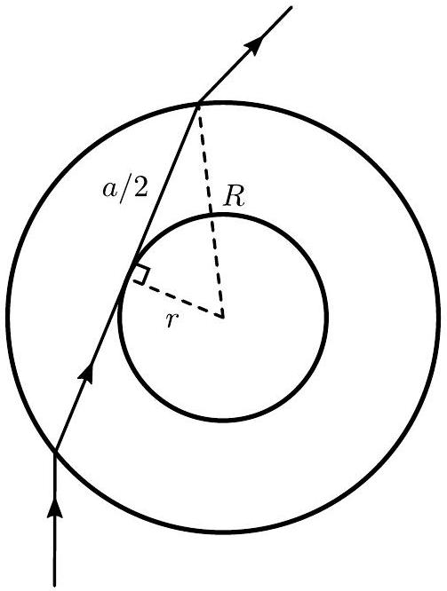

We start by using the caliper to measure the base diameter $2 R \approx 25.1 \mathrm {~mm}$. (0.2 pts)

We make the following measurements for $a$ :
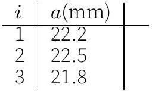

1 measurement (0.3/0.5 pts)
1 measurement (0.3/0.5 pts) 2 measurements (0.4/0.5 pts) 2 measurements (0.4/0.5 pts) 3 or more measurements (0.5/0.5 pts) 3 or more measurements (0.5/0.5 pts)

This yields $a = 22.2 ( 3 ) \mathrm { mm }$ such that $d =$
Tabulated measurements of the apparent 12.0(7) mm. width are shown below

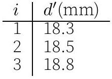
3 or more measurements (0.3 pts) with units (0.2 pts)

Averaging, $d ^ { \prime } = 18.5 ( 4 ) \mathrm { mm }$ average value of $d$ with errors (0.25 pts)
and so $n _ { o } = 1.54$ with an associated error of $\Delta n _ { o } = 0.09$. value within [1.50, 1.58] (0.25 pts) error (0.25 pts)
v) (3 points)We repeat what we did by part iii: we mark a point $A$ on the cylinder, turn the cylinder until the point $A$, as seen through the cylinder, is barely seen through the outer part, and just disappearing behind the interface between the inner and outer parts, and make marking $B$ at that point on the front surface were the image of $A$ is seen, cf. the figure below. Then we continue turning the cylinder until point $A$ appears again, now at point $C$ and is seen through the inner region of the cylinder. The corresponding ray undergoes refraction at 90-degree incidence angle at point $M$, hence $\cos \gamma = n _ { o } / n _ { c }$, see the figure.

It can be seen that $\angle B O C = 2 \gamma$. We can measure the distance between the markings $| B C | \approx 5.3 \mathrm {~mm}$ using the caliper. Then we can express $\sin \gamma = | B C | / 2 R \approx 0.211$. Finally, $n _ { c } = n _ { o } / \cos \gamma = n _ { o } / \sqrt { 1 - \sin ^ { 2 } \gamma } \approx$
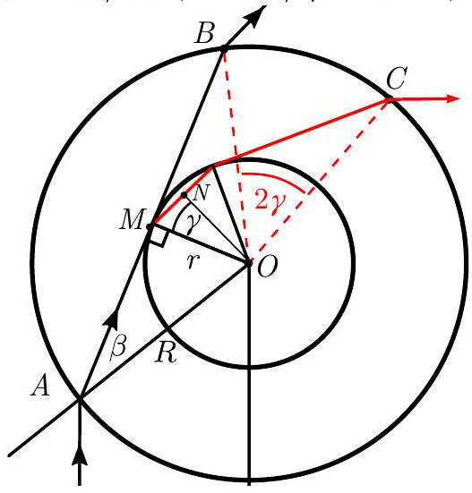

Idea of this method (0.8 pts) Formula for relating $| B C |$ to $\gamma$ ( $\mathbf { 0 . 8 }$ pts) Measuring $| B C |$ (0.4 pts) Formula for relating $n _ { c }$ to $\gamma$ ( $\mathbf { 0 . 4 }$ pts) Obtaining final result for $n _ { c }$ which is from 1\% to 4\% bigger than $n _ { o }$ (0.6 pts)
