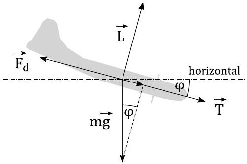

1. Escape (8 points) - Solution by Päivo Simson.
i) Let's denote the diving angle by $\phi$, the magnitude of the trust force by $T$ and the magnitude of the lift force by $L$. As we can see below, the later is not needed in the solution. The Forces acting on the ariplane during a dive are shown in the figure below.

For the level flight $\phi = 0$, and we have, by balancing the horizontal forces

$$
F _ { d } = k v _ { 0 } ^ { 2 } = T .
$$

For the dive we have, by balancing the forces acting parallel to the trajectory,

$$
F _ { d } = k v ^ { 2 } = T + m g \sin \phi .
$$

By eliminating $T$ from the above equations we get

$$
v ^ { 2 } = v _ { 0 } ^ { 2 } \left( 1 + \frac { m g } { k v _ { 0 } ^ { 2 } } \sin \phi \right) .
$$

The maximum angle is obtained from the last equation by equating $v = c$ and solving for $\phi$ :

$$
\phi _ { \max } = \arcsin \left( \frac { k \cdot \left( c ^ { 2 } - v _ { 0 } ^ { 2 } \right) } { m g } \right) .
$$
