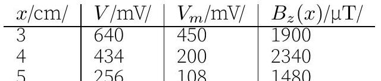
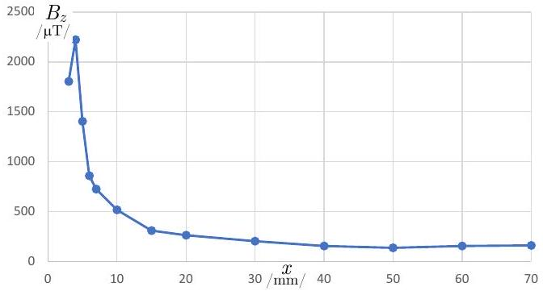

5. ferromagnetic stripe (12 points) - Solution by Jaan Kalda.
i) (0.5 points) We measure $\mathcal { E } = 3.15 \mathrm {~V}$. Any value above 3.20 V or 3.00V will give 0 points. Missing units: subtract 0.2 points.
ii) (1.5 points) We turn the dot on the sensor pointing up, and measure $V _ { 1 } = 1.4 \mathrm { mV }$; then turn it pointing down and measure $V _ { 2 } = - 3.8 \mathrm { mV }$.
(No points are awarded if only one of the voltages $V _ { 1 }$ or $V _ { 2 }$ are measured or voltages readings are incorrect. Reading is judged to be incorrect if the corresponding vertical magnetic field (when calculated correctly) would be greater than $80 \mu \mathrm {~T}$.) The voltage is affected by the offset voltage and the Earth's magnetic field $B _ { E z }$. The Earth's magnetic field influences the reading by a voltage offset $V _ { E z } = B _ { E z } / a$, where $a$ is a constant. We know that if the battery voltage were to be 3 V, then each millivolt is $10 \mu \mathrm {~T}$. Our battery increases the scaling by a factor of $\mathcal { E } / 3 \mathrm {~V}$. In other words, to convert from volts to microteslas, we multiply our voltage through by $a = 10 \mu \mathrm {~T} / \mathrm { mV } \cdot 3 \mathrm {~V} / \mathcal { E } = 9.5 \mu \mathrm {~T} / \mathrm { mV } . ( \mathbf { 0 . 1 } \mathbf { p t s } )$

Taking all this together, we have $V _ { 1 } =$ $V _ { 0 } + B _ { E z } / a$ and $V _ { 2 } = V _ { 0 } - a B _ { E z }$ and so $V _ { 0 } = \left( V _ { 1 } + V _ { 2 } \right) / 2$,
Numerically we get $V _ { 0 } = - 1.3 \mathrm { mV }$,

For this magnetic field value, no points are given if its calculation has mistakes (i.e. it does not correspond to the reported voltage values). If $a = 10.0 \mu \mathrm {~T} / \mathrm { V }$ was used even though the voltage was not 3.00 V, 0.2 point will be subtracted.

Now we can also measure the horizontal component of the magnetic field. To that end, we turn the sensor horizontally, and turn it in horizontal plane so as to maximise the reading $V _ { 3 } = 0.2 \mathrm { mV }$; then the horizontal component can be found as

$$
\begin{equation*}
B _ { E h } = \left( V _ { 3 } - V _ { 0 } \right) a \approx 14 \mu \mathrm {~T} . \tag{0.2pts}
\end{equation*}
$$

Deduce 0.2 pts if the offset is not subtracted, and 0.1 if the scaling factor $a$ is not applied.

The magnetic field strength can be found as $B _ { E } = \sqrt { B _ { E h } ^ { 2 } + B _ { E z } ^ { 2 } }$,
numerically $\approx 52 \mu \mathrm {~T}$.
alternatively, one can turn the sensor in 3D so as to maximize the reading $V _ { \text {max } } = 1.6 \mathrm { mV }$ resulting in $B _ { E } = \left( V _ { \text {max } } - V _ { 0 } \right) a \approx 52 \mu \mathrm {~T}$.

The angle between the vertical direction and the magnetic field is found as $\theta = \arctan B _ { E h } / B _ { E z }$,

numerically $\approx 16 ^ { \circ }$ (0.1 pts)
iii) (2.5 points) We perform the measurements in the same way as before, but we need to keep in mind to subtract not only the offset, but the contribution of the Earth's magnetic field. The easiest way to do this is to subtract from all the readings the voltage $V _ { 1 }$ which includes both the contribution from the Earth's field, and the offset.

| $y / \mathrm { mm } /$ | $V / \mathrm { mV } /$ | $B _ { z } ( y ) / \mu \mathrm { T } /$ |
| :--- | :--- | :--- |
| -15 | 36.5 | 333 |
| -10 | 33.2 | 302 |
| -5 | 30.6 | 277 |
| 0 | 22.6 | 201 |
| 5 | 22.6 | 201 |
| 10 | 24.9 | 223 |
| 15 | 29.3 | 265 |

Each data point from third to seventh, with reasonable values (from $140 \mu \mathrm {~T}$ to $400 \mu \mathrm {~T}$ : 0.3 pts.
Failure to subtract $V _ { 1 }$ : deduce 0.1 pts from each data point; failure to apply the scaling factor $a$ : deduce 0.1 pts from each data point.

Notice that the data are asymmetric with respect to $y = 0$, this is due to inhomogeneity of the stripe. The field values near the edge of the stripe should be higher than at the middle; if this is not observed, subtract 0.3 pts for any subscore not smaller than 0.3 pts.

The average value can be calculating by numerical integration (e.g. by using the trapezoidal or Simpson's rule): $\langle B \rangle = \int B _ { z } \mathrm {~d} y / w$, (0.2 pts)
where the stripe's width $w = 30 \mathrm {~mm}$. (0.2 pts)
Numerical integration yields $\int B _ { z } \mathrm {~d} y \approx$ $752 \mu \mathrm {~T} \mathrm {~cm}$, hence $\langle B \rangle \approx 252 \mu \mathrm {~T}$. (0.4 pts)

Only 0.2 pts are given if this result is smaller than $200 \mu \mathrm {~T}$ or bigger than $300 \mu \mathrm {~T}$; no points are given if it is smaller than $120 \mu \mathrm {~T}$ or bigger than $400 \mu \mathrm {~T}$.

Finally, using the numbers given above, we obtain $\kappa = 0.80$. (0.2 pts)

Points are given only if the result is between 0.6 and 1.
iv) (3.5 points) We proceed similarly to the previous task, except that now we need to subtract also the field of the permanent magnet (previousy the distance from the magnet was so big that the field of the magnet was neglibly small). To that end, we repeat experiment with the magnet only, by moving stripe away as far as possible.

Up to the third data point in the range $3 \mathrm {~cm} \leq x < 8 \mathrm {~cm}$, for each one $\mathbf { 0 . 3 }$ pts. No marks here if the field of the permanent magnet is not subtracted.

Up to the third data point in the range $8 \mathrm {~cm} \leq x < 35 \mathrm {~cm}$, for each one $\mathbf { 0 . 3 p t s }$. Subtract 0.2 pts from the score of each data point if the field of the permanent magnet is not subtracted.

Up to the third data point in the range $35 \mathrm {~cm} \leq x < 67 \mathrm {~cm}$, for each one $\quad \mathbf { 0 . 3 ~ p t s }$. Subtract 0.1 pts from the score of each data point if the offset voltage and the Earth's field are not subtracted.

If no units, but the units can be guessed: subtract 0.1 for missing voltage units, 0.1 for missing distance units, and 0.1 for missing magnetic field units.

For correct plotting: 0.5 pts.
Missing units on graph: subtract 0.1 pts for each. Graph fills less than one third of the graph area: subtract 0.1 pts.
Magnetic field at small $x$ is around 10 times bigger than at moderate values of $x$ : $\mathbf { 0 . 3 }$ pts.
v) (2.5 points) Magnetic flux is "attracted" into ferromagnetic materials (minimising this way the energy of the magnetic field by a fixed magnetic flux). However, ferromagnetic will attract the field only until a saturation is reached from which point this is no longer energetically favourable. For our soft ferromagnetic $\mu \gg 1$, hence the magnetisation $\vec { J } = \vec { B } / \mu _ { 0 } - \vec { H } \approx \vec { B } / \mu _ { 0 }$. This means that all we need to do is to determine the field $B = B _ { x } \hat { x }$ attracted into the ferromagnetic stripe: $\mu _ { 0 } J = B _ { x }$. (0.5 pts)

Due to the Gauss law for the magnetic field, $B _ { x } ( x = a ) w t = 2 w \kappa \int _ { a } ^ { L } B _ { z } \mathrm {~d} x$, 1 point.
Here $a = 3 \mathrm {~cm}$ stands for the point at which we calculate the B-field. At even smaller values of $x$, the magnetisation is slightly larger, but the difference is not big (it can be estimated through the magnetic flux leakage from $x = 0$ to $x = a$ ). The factor two stands for the fact that the magnetic flux exits the stripe both through the top surface, and the bottom surface. If factor 2 is missing, subtract 0.3 pts.

We can integrate numerically using trapezoidal or Simpson's rule to obtain $\int _ { a } ^ { L } B _ { z } \mathrm {~d} x \approx 79 \mathrm { mT } \cdot \mathrm { cm }$ (0.7 pts)

This subscore is given only if the numerical integration is preformed with a relative error less than 10\% (from the Simpson's rule result).

Finally, we obtain $\mu _ { 0 } J _ { s } = 2 \int _ { a } ^ { L } B _ { z } \mathrm {~d} x / t \approx$ 2.5 T. (0.3 pts)

This subscore is given only if the result is from 1.6 to 3.2 T.
vi) (1.5 points) In principle, there are two ways to show that the saturation is reached.

The first method is to estimate the total magnetic field flux $\Phi \approx \pi B _ { 0 } d ^ { 2 } / 4$ sent by the permanent magnet to the ferromagnetic stripe, where $B _ { 0 }$ is an estimate for the magnetic field strength at the circular face of the magnet, and $d \approx 1 \mathrm {~cm}$ denotes the diameter of the magnet. If this flux is bigger than the flux $\Phi _ { s } = 2 w \kappa \int _ { a } ^ { L } B _ { z } \mathrm {~d} x$ then the saturation has been reached. has been reached. (0.5 pts)

From the results above we find $\Phi _ { s } 79 \mathrm { mT } \cdot \mathrm { cm } \cdot w \approx 0.24 \mathrm {~T} \cdot \mathrm {~cm} ^ { 2 }$. (0.2 pts)

The value of $B _ { 0 }$ can be estimated by extrapolating the field measurement data along the axis of the magnet using the dipole field dependence $B \propto l ^ { - 3 }$, where $l$ denotes the distance to the centre of the magnet. (0.5 pts)

The result is $B _ { 0 } \approx 0.7 \mathrm {~T}$, and $\Phi \approx$ $0.5 \mathrm {~T} \cdot \mathrm {~cm} ^ { 2 }$. This is bigger than $\Phi _ { s }$, but not much bigger, so the calculations need to be accurate. accurate. (0.3 pts)

The second way is to put the magnet to the centre of the stripe and repeat the magnetic field measurements along the stripe as was done in task iv. (0.5 pts)

It turns out that the field strength as a function of distance from the magnet is the same as it was before. (0.5 pts)

This means that now the magnet sends twice as big flux into the sheet, from the centre towards the both ends of the stripe. Hence, previously the stripe had a capacity to conduct only half or less of the full flux of the magnet. (0.5 pts)
