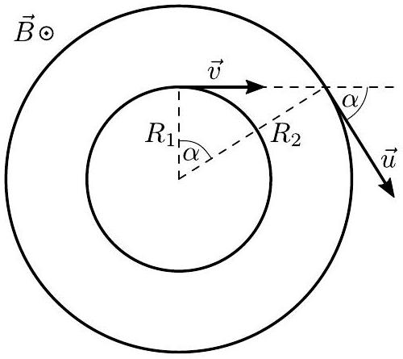

7. Electrons in magnetic field (9 points)

- Solution by Taavet Kalda.
i) (2 points) Due to Lorentz force not acting along the direction that's parallel to $B$, the condition for electrons to stay the same distance along that axis becomes simply that their velocity components along $B$ are equal. We will henceforth only consider the motion on the plane that's perpendicular to $B$.

Neglecting electrostatic interactions, electrons move on circular trajectories of frequency $\omega$ given by the right hand rule, found from the centrifugal and Lorentz force balance:

$$
\frac { m v ^ { 2 } } { R } = m v \omega = v e B ,
$$

hence $\omega _ { 0 } = e B / m$. In other words, the angular frequency for both electrons is the same and independent of their speeds. We also get an expression for the radius of the circular trajectory: $R = v / \omega _ { 0 } = m v / ( e B )$.

An important consequence is that the angle between the velocities of the two electrons stays constant in time. Hence, the relative velocity between the two electrons is also constant in magnitude (and not zero!) and rotating with $\omega _ { 0 }$. For the relative velocity to keep the distance between electrons constant, the distance vector between the two electrons must be perpendicular to the relative velocity and hence also rotate with angular speed $\omega _ { 0 }$. This is enough to conclude

that the only way this is satisfied is when the two electrons move on concentric circular trajectories.

The condition for the relative velocity to be perpendicular to the distance vector gives us that the speed of the other electron is $u =$ $v / \cos \alpha$. The radii of the two circles are then $R _ { 1 } = v / \omega _ { 0 }$ and $R _ { 2 } = v / \left( \cos \alpha \omega _ { 0 } \right)$. The trajectories are illustrated below.

