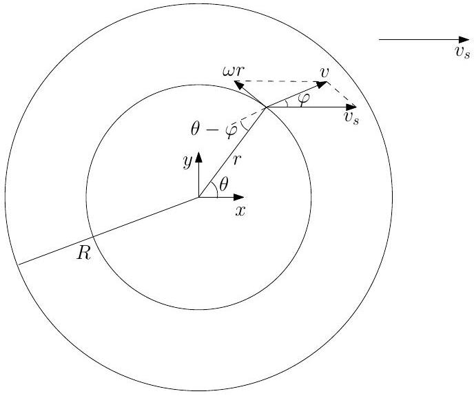
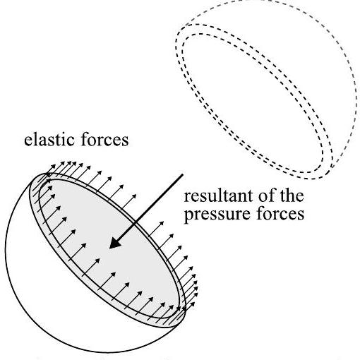
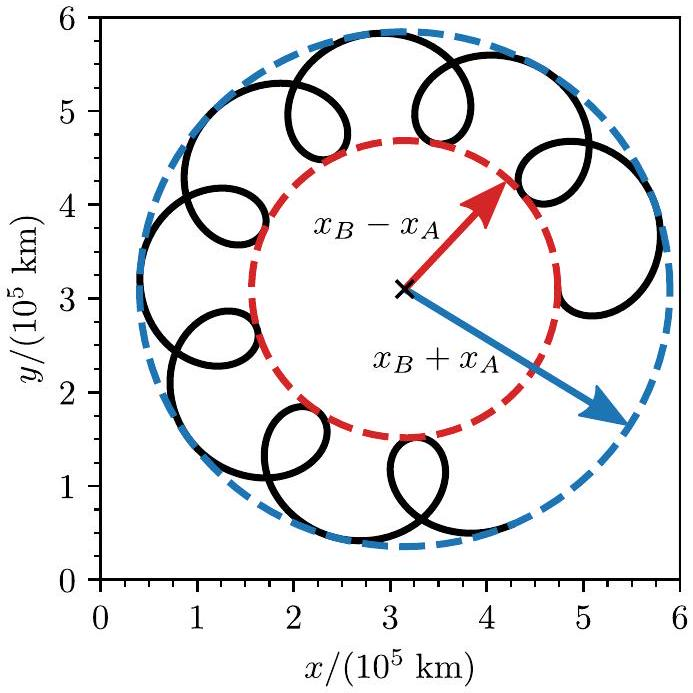
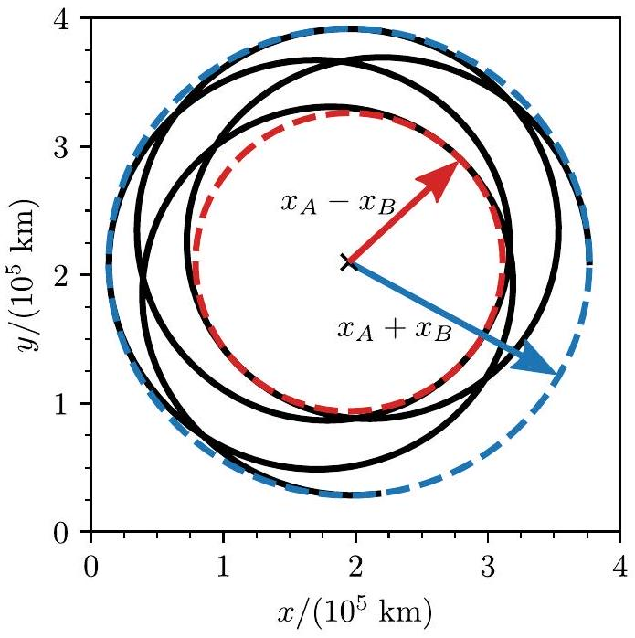
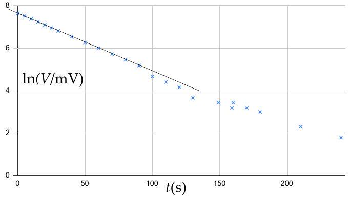
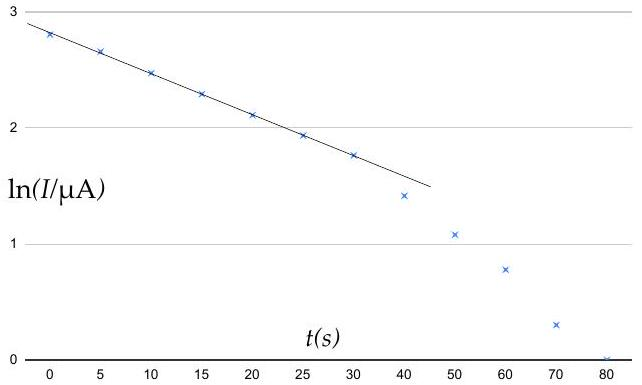
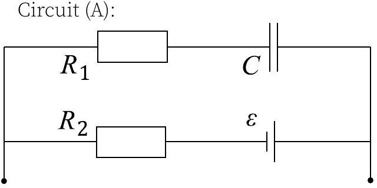
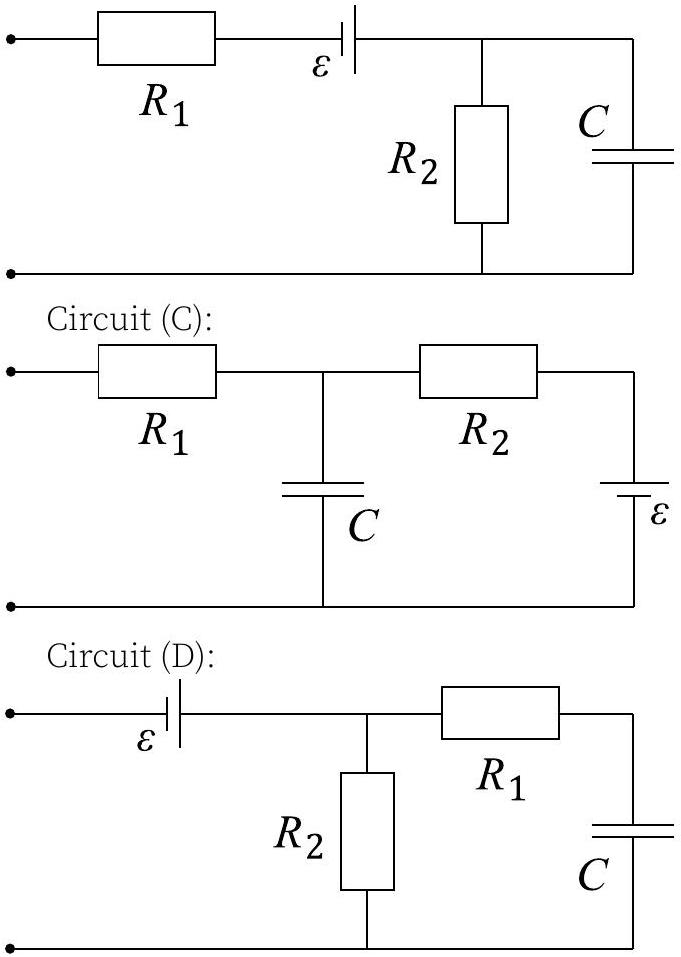
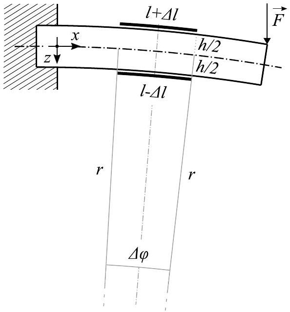
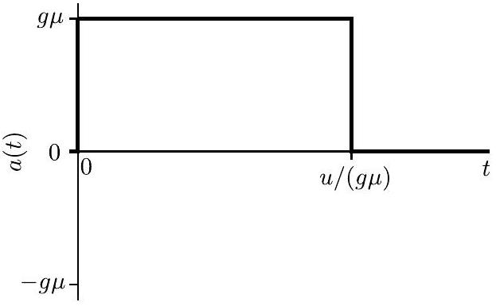

## Nordic-Baltic Physics Olympiad 2023

1. Curling (8 points) - Solution by Jaan Kalda, Oskar Vallhagen, grading schemes by Oskar Vallhagen.
i) (1 point) As the stone is gliding over the ice everywhere on the contact surface, the friction force is $F _ { f x } = \mu m g$, i.e. the acceleration is $\mu g$, directed in the negative $x$ direction (with the $x$-direction pointing towards the target stone). Thus, we get

$$
\frac { d v _ { s } } { d t } = - \mu g \Rightarrow v _ { s } = v _ { 0 } - \mu g t .
$$

## Grading:

- Correct friction force (0.5 pts)
- Correct acceleration (0.2 pts)
- correct $v _ { s }$ (0.3 pts)

ii) (1 point) The simplest way to obtain the final velocity is to use energy conservation, noting that the friction force does a work $W _ { f } = \mu m g s$. Thus, we get

$$
\frac { m v _ { 0 } ^ { 2 } } { 2 } = \frac { m v _ { \mathrm { hit } } ^ { 2 } } { 2 } + \mu m g s \Rightarrow v _ { \mathrm { hit } } = \sqrt { v _ { 0 } ^ { 2 } - 2 \mu g s } .
$$

## Grading:

- Idea of using energy conservation (0.2 pts)
- Calculating the work done by the friction force (0.3 pts)
- Correct total energy conservation equation $v _ { s }$ (0.3 pts)
- Correct $v _ { \text {hit } }$ (0.2 pts)

Alternatively, one can first calculate the time $t _ { \text {hit } }$ before the stone hits the opponents stone. Integrating the expression for $v _ { s }$ up to this time gives

$$
s = v _ { 0 } t _ { \mathrm { hit } } - \mu g \frac { t _ { \mathrm { hit } } ^ { 2 } } { 2 } .
$$

Solving for $t _ { \text {hit } }$, we get

$$
t _ { \text {hit } } = \frac { v _ { 0 } } { \mu g } - \sqrt { \frac { v _ { 0 } ^ { 2 } } { \mu ^ { 2 } g ^ { 2 } } - \frac { 2 s } { \mu g } }
$$

(the solution with the plus sign gives a negative velocity). Inserting back into the expression for $v _ { s }$ and simplifying gives

$$
v _ { \mathrm { hit } } = \sqrt { v _ { 0 } ^ { 2 } - 2 \mu g s } .
$$

Grading:

- Integration of the expression for $v _ { s }$ (0.4 pts)
- Solving for $t _ { \text {hit } }$ (0.4 pts)
- Inserting into expression for $v _ { s }$ and final answer (0.2 pts)

iii) (2 points) Consider the motion of a point at the ring in contact with the ice at an angle $\theta$ from the $x$-axis, moving at a velocity $v$ as depicted in the figure below. The components of this motion along the $x$ and $y$ axes can be seen to be $v _ { x } = v _ { s } - \omega r \sin \theta$ and $v _ { y } = \omega r \cos \theta$, respectively.

The friction force per unit length has the magnitude

$$
F _ { f } ^ { \prime } = \frac { \mu m g } { 2 \pi r }
$$

everywhere on the circle in contact with the ice, as before, but is now directed opposite to the local velocity $v$ rather than the sliding velocity $v _ { s }$. The component of the force density in the $x$-direction thus becomes

$$
F _ { f x } ^ { \prime } = - F _ { f } ^ { \prime } \cos \varphi = - F _ { f } ^ { \prime } \frac { v _ { x } } { v } .
$$

From this point on, there are two ways to work out the mathematical calculations. First, consider an infinitesimal arc of the contact ring of central angle $\mathrm { d } \theta$; the friction force exerted on it has magnitude $\mathrm { d } F _ { f } =$ $\frac { \mu m g } { 2 \pi } \mathrm {~d} \theta$. The total force is obviously directed antiparallel to the velocity of the stone as $y$ directional components of the acting on arcs at $\theta$ and $\pi - \theta$ cancel pairwise out. The projection of the friction force acting on our arc is given by

$$
\mathrm { d } F _ { x } = \frac { \mu m g } { 2 \pi } \cos \varphi \mathrm {~d} \theta
$$

Using the small parameter $\delta \equiv \omega r / v _ { s } \approx$ $\omega r / v \ll 1$, we conclude that $\varphi \ll 1$, hence we can use approximation

$$
\mathrm { d } F _ { x } \approx \frac { \mu m g } { 2 \pi } \left( 1 - \frac { 1 } { 2 } \varphi ^ { 2 } \right) \mathrm { d } \theta .
$$

The angle $\varphi$ can be found from the sine theorem assuming $\sin \varphi \approx \varphi : \varphi \approx$ $\sin \left( \frac { \pi } { 2 } - \theta \right) \frac { \omega r } { v } \approx \cos \theta \frac { \omega r } { v _ { s } } \equiv \delta \cos \theta$. Alternatively, a similarly accurate expression cab be found by noting that

$$
\varphi \approx \tan \varphi = \frac { v _ { y } } { v _ { x } } \approx \frac { v _ { y } } { v _ { s } } = \frac { \omega r \cos \theta } { v _ { s } } .
$$

Thus,

$$
\mathrm { d } F _ { x } = \frac { \mu m g } { 2 \pi } \left( 1 - \frac { \delta ^ { 2 } } { 2 } \cos ^ { 2 } \theta \right) \mathrm { d } \theta .
$$

Recognising that $\int _ { 0 } ^ { 2 \pi } \cos ^ { 2 } \theta d \theta = \pi$, this can be integrated to obtain

$$
F _ { x } = \mu m g \left( 1 - \frac { \omega ^ { 2 } r ^ { 2 } } { 4 v _ { s } ^ { 2 } } \right)
$$

so that the final answer is

$$
\Delta F _ { x } = - \frac { \mu m g \omega ^ { 2 } r ^ { 2 } } { 4 v _ { s } ^ { 2 } } .
$$

The second way is by continuing

$$
\begin{aligned}
F _ { f x } ^ { \prime } & = F _ { f } ^ { \prime } \frac { v _ { x } } { v } \\
& = F _ { f } ^ { \prime } \frac { v _ { s } - \omega r \sin \theta } { \sqrt { v _ { s } ^ { 2 } - 2 v _ { s } \omega r \sin \theta + \omega ^ { 2 } r ^ { 2 } } } \\
& = F _ { f } ^ { \prime } \frac { 1 - \delta \sin \theta } { \sqrt { 1 - 2 \delta \sin \theta + \delta ^ { 2 } } } .
\end{aligned}
$$

To second order in $\delta$, we get, using the approximation suggested in the problem text for $x = - 2 \delta \sin \theta + \delta ^ { 2 }$ and doing some elementary algebra,

$$
F _ { f x } ^ { \prime } \approx F _ { f } ^ { \prime } \left( 1 - \frac { 1 } { 2 } \delta ^ { 2 } \cos ^ { 2 } \theta \right) .
$$

The total friction force can now be obtained by integrating over the length element of size $r d \theta$ along the ring in contact with the ice, yielding, after simplifying and re-inserting the expression for $F _ { f } ^ { \prime }$,

$$
F _ { f x } = \int _ { 0 } ^ { 2 \pi } F _ { f x } ^ { \prime } r d \theta = \mu m g \left( 1 - \frac { 1 } { 4 } \delta ^ { 2 } \right) .
$$

## Grading:

- Understanding that the friction force is everywhere antiparallel with the local velocity (0.4 pts)
- Calculating the magnitude of the force per unit length (0.3 pts)
- Correct expression for the $x$ component (0.2 pts)

## First solution:

- Approximate expression for $F _ { f x } ^ { \prime }$ or $\mathrm { d } F _ { f x }$ for small $\boldsymbol { \varphi }$ (0.3 pts)
- Expressing $\varphi$ in terms of $\delta$ and $\theta$ (0.5 pts)
- Correct integral and final answer (0.3 pts)

## Second solution:

- Expressing $F _ { f x } ^ { \prime }$ or $\mathrm { d } F _ { f x }$ in terms of $\delta$ and $\theta$ (0.3 pts)
- Approximate expression for $F _ { f x } ^ { \prime }$ or $\mathrm { d } F _ { f x }$ for small $\delta$ (0.5 pts)
- Correct integral and final answer (0.3 pts)

iv) (2 points)For the torque $\tau ^ { \prime }$ per unit length (around the central axis of the stone), we see from the figure that the angle between the local force per unit length and the radius is $\theta - \varphi$, yielding

$$
\tau ^ { \prime } = F _ { f } ^ { \prime } r \sin ( \theta - \varphi ) .
$$

From here on, there are again two ways to continue. First, we can use Taylor series and keep only the linear term: $\sin ( \theta - \varphi ) \approx$ $\sin \theta - \varphi \cos \theta$; by using the previously obtained expression $\varphi \approx \delta \cos \theta$, we can express

$$
\mathrm { d } \tau = \mu m g r \left( \sin \theta - \delta \cos ^ { 2 } \theta \right) \frac { \mathrm { d } \theta } { 2 \pi }
$$

integration of which yields

$$
\tau = - \frac { \mu m g \omega r ^ { 2 } } { 2 v _ { s } } .
$$

The second way is to write

$$
\begin{aligned}
\tau ^ { \prime } & = F _ { f } ^ { \prime } r \sin ( \theta - \varphi ) \\
& = F _ { f } ^ { \prime } r ( \sin \theta \cos \varphi - \cos \theta \sin \varphi ) \\
& = F _ { f } ^ { \prime } r \left( \sin \theta \frac { v _ { x } } { v } - \cos \theta \frac { v _ { y } } { v } \right) ,
\end{aligned}
$$

which, using the above expressions for $v _ { x }$ and $v _ { y }$, can be simplified to

$$
\tau ^ { \prime } = F _ { f } ^ { \prime } r \frac { \sin \theta - \delta } { \sqrt { 1 - 2 \delta \sin \theta + \delta ^ { 2 } } }
$$

Applying the same approximation as in the previous part and keeping only the first, now leading, order terms in $\delta$, we get

$$
\tau ^ { \prime } \approx F _ { f } ^ { \prime } r \left( \sin \theta - \delta \cos ^ { 2 } \theta \right) .
$$

Integrating to find the total torque, we get

$$
\tau = \int _ { 0 } ^ { 2 \pi } \tau ^ { \prime } r d \theta = - \frac { 1 } { 2 } \delta \mu m g r
$$

Grading:

- Finding the angle between the local force per unit length and the radius (0.5 pts)
- Correct expression for $\tau ^ { \prime } ( \mathbf { 0 . 4 } \mathbf { p t s } )$

First solution:

- Approximate expression for $\tau ^ { \prime }$ or $\mathrm { d } \tau$ for small $\boldsymbol { \varphi }$ (0.3 pts)
- Expressing $\varphi$ in terms of $\delta$ and $\theta$ (0.5 pts)
- Correct integral and final answer (0.3 pts)

Second solution:

- Expressing $\tau ^ { \prime }$ or $\mathrm { d } \tau$ in terms of $\delta$ and $\theta$ (0.3 pts)
- Approximate expression for $\tau ^ { \prime }$ or $\mathrm { d } \tau$ for small $\delta$ (0.5 pts)
- Correct integral and final answer (0.3 pts)

v) (2 points) The equation describing the rotation is, now expressed in terms of $\omega$ and $v _ { s }$ rather than $\delta$,

$$
I \frac { d \omega } { d t } = \tau = - \frac { 1 } { 2 } \mu m g r ^ { 2 } \frac { \omega } { v _ { s } } ,
$$

where the moment of inertia is $I \approx \frac { 1 } { 2 } m R ^ { 2 }$. As the correction to $F _ { f x }$ is only of second order in $\delta$, to the first, leading order approximation, we may neglect the effect of rotation on
$F _ { f x }$. Thus, the sliding speed $v _ { s }$ has the same time dependenca as in part i). The equation above can then be separated as

$$
\begin{aligned}
& \int _ { \omega _ { 0 } } ^ { \omega _ { \mathrm { hit } } } \frac { d \omega } { \omega } = \int _ { 0 } ^ { t _ { \mathrm { hit } } } - \mu g \frac { r ^ { 2 } } { R ^ { 2 } } \frac { d t } { v _ { 0 } - \mu g t } \Rightarrow \\
& \ln \frac { \omega _ { \mathrm { hit } } } { \omega _ { 0 } } = \frac { r ^ { 2 } } { R ^ { 2 } } \ln \frac { v _ { 0 } - \mu g t _ { \mathrm { hit } } } { v _ { 0 } } ,
\end{aligned}
$$

which, recognising that $v _ { 0 } - \mu g t _ { \text {hit } } = v _ { \text {hit } }$, yields

$$
\omega _ { \mathrm { hit } } = \omega _ { 0 } \left( \frac { v _ { \mathrm { hit } } } { v _ { 0 } } \right) ^ { \frac { r ^ { 2 } } { R ^ { 2 } } } .
$$

Grading:

- Correct equation of motion for the rotation (0.5 pts)
- Realising that $v _ { s }$ is unaffected by the rotation to leading order (0.5 pts)
- Using separation of variabels (0.5 pts)
- Final answer (0.5 pts)
2. Nitrogen explosion (8 points) - Solution by Päivo Simson, grading schemes by Päivo Simson and ....
i) (1.5 points) As shown in the first figure of the problem, the sphere floats so that exactly half of it is submerged in water. When studying buoyancy, the mass of nitrogen gas can be considered negligibly small compared to the masses of liquid nitrogen and the plastic sphere. According to Archimedes' principle, we have

$$
\rho _ { n } V _ { n } + \rho _ { p } V _ { p } = \rho _ { w } V _ { w } ,
$$

where $V _ { n } , V _ { p }$, and $V _ { w }$ are the volumes of liquid nitrogen, plastic, and displaced water, respectively. We have

$$
\frac { 1 } { 2 } \cdot \frac { 4 \pi r ^ { 3 } \rho _ { n } } { 3 } + d \cdot 4 \pi r ^ { 2 } \rho _ { p } = \frac { 1 } { 2 } \cdot \frac { 4 \pi r ^ { 3 } \rho _ { w } } { 3 } ,
$$

and solving for $d$ we get

$$
d = \frac { r } { 6 } \cdot \frac { \rho _ { w } - \rho _ { n } } { \rho _ { p } } = 1.5 \mathrm {~mm} .
$$

Grading:

- Archimedes' principle (0.3 pts)
- Correct volumes of liquid nitrogen, plastic, and displaced water (0.6 pts)

- Correctly solving for $d$ (0.3 pts)

- Correct answer $d = 1.5 \mathrm {~mm}$ (0.3 pts)

ii) (1.5 points) The sphere will explode when the pressure difference $p _ { 2 } - p _ { a }$ is such that the maximum tensile strength of the plastic is reached. Let's look at only one-half of the sphere and study the balance of the forces.

The resultant force due to pressure is ( $p _ { 2 } -$ $\left. p _ { a } \right) \pi r ^ { 2 }$. This must always be balanced by the elastic forces in the plastic. Right before the explosion, we have the equality

$$
\left( p _ { 2 } - p _ { a } \right) \pi r ^ { 2 } = \sigma 2 \pi r d ,
$$

where $2 \pi r d$ is the cross-sectional area of the plastic. Now solving for $p _ { 2 }$ we get

$$
p _ { 2 } = p _ { a } + \frac { 2 \sigma d } { r } = 1.1 \cdot 10 ^ { 6 } \mathrm {~Pa} .
$$

Grading:

- Qualitative understanding of the conditions for the sphere to explode - resultant pressure force equals the total tensile strength (0.4 pts)
- The idea of breaking the sphere in half and analysing the forces acting on only one side of the sphere (0.4 pts)
- Correct condition for the sphere to explode: $\left( p _ { 2 } - p _ { a } \right) \pi r ^ { 2 } = \sigma 2 \pi r d$ (0.4 pts)
- Correct final expression and answer (0.3 pts)

iii) (1.5 points) During boiling at constant pressure, the temperature of the liquid does not change, even though the liquid is gaining energy all the time. If however the pressure changes, as we have in our problem, then so does the boiling point, following exactly the phase transition line on the phase diagram. Since we know the final pressure $p _ { 2 }$, we can simply read the corresponding temperature of the diagram:

$$
p _ { 2 } = 1.1 \cdot 10 ^ { 6 } \mathrm {~Pa} \Longrightarrow T _ { 2 } = 106 \mathrm {~K} .
$$

Grading:

- Correctly stating that the process 1-2 follows the phase transition line. (1.0 pts)
- Reading the correct temperature from the graph (0.5 pts)

iv) (1.5 points) If $p , V$, and $T$ are known, the mass of the nitrogen gas can be calculated using the ideal gas equation:

$$
p V = \frac { m } { M } R T \Longrightarrow m = \frac { p V M } { R T } .
$$

Since we know the initial and final states, the mass $\Delta m$ of nitrogen that evaporated between these states is

$$
\begin{gathered}
\Delta m = m _ { 2 } - m _ { 1 } = \\
= \frac { 2 \pi r ^ { 3 } M } { 3 R } \left( \frac { p _ { 2 } } { T _ { 2 } } - \frac { p _ { 1 } } { T _ { 1 } } \right) = 0.065 \mathrm {~kg} .
\end{gathered}
$$

Grading:

- The idea of calculating the mass of nitrogen gas in the initial and final state (0.3 pts)
- Realizing that ideal gas law can be used to calculate the mass of nitrogen gas (0.3 pts)
- Correct ideal gas law (0.3 pts)
- Correctly using the molar mass (0.3 pts)
- Correct calculation and correct final answer (0.3 pts)

v) (2 points) Neglecting the heat capacity of the plastic and the heat flux through the upper half of the sphere, we only need to consider the heat of evaporation:

$$
Q _ { e } = \lambda \Delta m = 1,31 \cdot 10 ^ { 4 } \mathrm {~J} ,
$$

and the heat for raising the temperature of the liquid nitrogen:

$$
\begin{gathered}
Q _ { l } = c _ { v } m _ { l } \left( T _ { 2 } - T _ { 1 } \right) = \\
= \frac { 2 } { 3 } \pi r ^ { 3 } \rho _ { n } c _ { v } \left( T _ { 2 } - T _ { 1 } \right) = 9,7 \cdot 10 ^ { 4 } \mathrm {~J} .
\end{gathered}
$$

The heat for rising the temperature of the nitrogen gas can be neglected, as the mass of the gas is very small compared to the mass of liquid nitrogen $( \approx 1.7 \mathrm {~kg} )$. The total heat $Q _ { e } + Q _ { l }$ is taken from the water through the plastic. The average temperature of nitrogen is $T _ { n } = \left( T _ { 1 } + T _ { 2 } \right) / 2 = 91.7 \mathrm {~K}$, and the average temperature difference between water

and nitrogen is $T _ { w } - T _ { n } = 201.5 \mathrm {~K}$. The heat flux through the plastic is

$$
q = k \cdot \frac { T _ { w } - T _ { n } } { d } .
$$

The total amount of heat carried through the lower half of the sphere during time $\Delta t$ is

$$
\Delta Q = q A \Delta t = Q _ { e } + Q _ { l } ,
$$

where $A = 2 \pi r ^ { 2 }$ is half of the surface area of the sphere. Finally, solving for $\Delta t$, we have the estimated time it takes for the sphere to explode:

$$
\Delta t = \frac { d \cdot \left( Q _ { e } + Q _ { l } \right) } { 2 \pi r ^ { 2 } k \left( T _ { w } - T _ { n } \right) } = 15.5 \mathrm {~s} .
$$

Grading:

- Understanding that $Q _ { e } + Q _ { l }$ must be equal to the total heat received from the water (0.3 pts)
- Correct heat of evaporation (0.2 pts)
- Correct heat for rising the temperature of liquid nitrogen (0.2 pts)
- Correctly using the average temperature of nitrogen (0.2 pts)
- Correctly using the average temperature difference (0.2 pts)
- Correct expression for the heat flux $q$ though the plastic (0.3 pts)
- Correct expression for the total heat $\Delta Q$ received through the plastic (0.3 pts)
- Correct final expression for calculating the time till explosion (0.3 pts)
Give full points for this part if the final expression and the answer are correct.
3. Wobble (8 points) - Solution by Taavet Kalda, grading schemes by ....
i) (2.5 points) The farther away a planet is from the host star, the bigger its orbital period. In a fixed period, we then expect planet $A$ to make more rotations around the star than planet $B$. The wobble effect comes from both the star and the planets orbiting around their common barycentre (centre of mass). The effect of one planet makes the star undergo a circular motion with some radius $x$ and frequency $\omega$. The effect of two planets is additive, so the overall motion is the sum of two circular motions with radius' $x _ { A }$ and $x _ { B }$ with different angular frequencies $\omega _ { A }$ and $\omega _ { B }$.

In the figure, we find the centre of circular motion of the star from the centre of the envelope (by for example using a ruler to find the diameter and then the centrepoint). From there, we measure that lower frequency component covers an angle of $\alpha =$ $290 ^ { \circ }$ within the measurement period $t =$ 10 yr. The higher frequency component, in the meantime, undergoes 7.5 full rotations with respect to the lower frequency component. Hence, $\omega _ { B } t = \alpha$ and $\left( \omega _ { A } - \omega _ { B } \right) t / ( 2 \pi ) =$ 7.5. This yields

$$
\begin{aligned}
T _ { B } & = \frac { 2 \pi } { \omega _ { B } } = \frac { 2 \pi t } { \alpha } = 12.4 \mathrm { yr } , \\
T _ { A } & = \frac { 2 \pi } { \omega _ { A } } = \frac { 1 } { \frac { 1 } { T _ { B } } + \frac { 7.5 } { t } } = 1.20 \mathrm { yr } .
\end{aligned}
$$

Grading:

- Realising that the higher frequency component is due to planet A and the lower frequency component is due to planet B (0.5 pts)
- The higher frequency component undergoes 7.5 full rotations ( $\mathbf { 0 . 4 }$ pts)
- The lower frequency component covers an angle of $290 ^ { \circ }$, or alternatively, $\frac { 7.5 } { 9 } \cdot 2 \pi$ (0.4 pts)
- Finding $T _ { A }$ (0.8 pts)
- Finding $T _ { B }$ (0.4 pts)

ii) (2.5 points) From the figure, we measure the extrema of the distance of the star from the origin as $l _ { 1 } = 1.6 \times 10 ^ { 5 } \mathrm {~km}$ and $l _ { 2 } = 2.8 \times 10 ^ { 5 } \mathrm {~km}$. The extrema corresponds to when the two circular motions are pointing in the same direction or the opposite direction. In other words, the distances are $l _ { 1 } = x _ { B } - x _ { A }$ and $l _ { 2 } = x _ { B } + x _ { A }$. Rearranging, $x _ { A } = \left( l _ { 2 } - l _ { 1 } \right) / 2 = 6 \times 10 ^ { 4 } \mathrm {~km}$ and $x _ { B } = 2.2 \times 10 ^ { 5 } \mathrm {~km}$. To infer the masses, we need to study the dynamics of the system.

First, we can assume that the semi-major axis of the planets are much bigger than $x$. Indeed, $a _ { A } / x _ { A } = 4000 \gg 1$. Either from force balance between gravity and centrifugal force, or through Kepler's Third Law, we have $4 \pi ^ { 2 } / ( G M ) = T _ { A } ^ { 2 } / a _ { A } ^ { 3 }$ so the star's mass is

$$
M = \frac { 4 \pi ^ { 2 } a _ { A } ^ { 3 } } { G T _ { A } ^ { 2 } } = 4.4 \times 10 ^ { 30 } \mathrm {~kg} .
$$

The planet's mass can be inferred from the property that planet and star rotate around their common centre of mass: $M x _ { A } = m _ { A } a _ { A }$. Hence,

$$
m _ { A } = M \frac { x _ { A } } { a _ { A } } = 1.2 \times 10 ^ { 27 } \mathrm {~kg} .
$$

Grading:

- $\operatorname { Expressing } 4 \pi ^ { 2 } / ( G M ) = T _ { A } ^ { 2 } / a _ { A } ^ { 3 }$ (0.6 pts)
- Finding $M$ (0.4 pts)
- Realising that the position of the centre of mass of $A$ and $M$ is conserved (with respect to $B$ ) (0.5 pts)
- Inferring equation $M x _ { A } = m _ { A } a _ { A }$ (0.5 pts)
- Finding $x _ { A }$ from the trajectory (0.3 pts)
- Finding $m _ { A }$ (0.2 pts)

iii) (1 point) Once again, from Kepler's Third law, we get the semi-major axis of planet $B$ to be

$$
a _ { B } = \sqrt [ 3 ] { \frac { T _ { B } ^ { 2 } G M } { 4 \pi ^ { 2 } } } = 1.0 \times 10 ^ { 9 } \mathrm {~km} .
$$

Similarly to before, we get the mass as

$$
m _ { B } = M \frac { x _ { B } } { a _ { B } } = 9.3 \times 10 ^ { 26 } \mathrm {~kg} .
$$

Both of the planets are gas giants, similar to Jupiter (0.63 and 0.50 Jupiter masses respectively). This makes sense, as this method is more sensitive to higher mass exoplanets with bigger orbits.
Grading:

- Finding $a _ { B }$ (0.5 pts)

- Finding $m _ { B }$ (0.5 pts)

iv) (2 points) The equations describing the system still hold, but reading off the frequencies is trickier. Nevertheless, we can still locate the origin and measure the extreme distances $l _ { 1 } = 1.20 \times 10 ^ { 5 } \mathrm {~km}$ and $l _ { 2 } = 1.85 \times 10 ^ { 5 } \mathrm {~km}$. We also note that the higher frequency component (corresponding to planet $A$ ) has a bigger radius than the lower frequency one (planet $B$ ). Hence, $l _ { 1 } =$ $x _ { A } - x _ { B }$ and $l _ { 2 } = x _ { A } + x _ { B }$, and so $x _ { A } =$ $\left( l _ { 1 } + l _ { 2 } \right) / 2 = 1.5 \times 10 ^ { 5 } \mathrm {~km} , x _ { B } = \left( l _ { 2 } - l _ { 1 } \right) / 2 =$ $3.3 \times 10 ^ { 4 } \mathrm {~km}$.

The higher frequency component does 3 full turns and, measuring from the figure, an extra 280° on top of it. This gives $T _ { A } =$ $t / \left( 3 + 280 ^ { \circ } / 360 ^ { \circ } \right) = 2.65 \mathrm { yr }$. The lower frequency component, meanwhile, starts and ends from the farthest away point, and oscillates through the closest point 3 times. Hence it goes through 3 full rotations. Thus,

$$
\left( \frac { 2 \pi } { T _ { A } } - \frac { 2 \pi } { T _ { B } } \right) t = 6 \pi ,
$$

and so

$$
T _ { B } = \frac { 1 } { \frac { 1 } { T _ { A } } - \frac { 3 } { t } } = 12.9 \mathrm { yr }
$$

By using the equations from the previous parts, we get

$$
\begin{aligned}
M & = \frac { 4 \pi ^ { 2 } a _ { A } ^ { 3 } } { G T _ { A } ^ { 2 } } = 6.8 \times 10 ^ { 29 } \mathrm {~kg} , \\
m _ { A } & = M \frac { x _ { A } } { a _ { A } } = 5.1 \times 10 ^ { 26 } \mathrm {~kg} , \\
m _ { B } & = M x _ { B } \sqrt [ 3 ] { \frac { 4 \pi ^ { 2 } } { T _ { B } ^ { 2 } G M } } = 3.9 \times 10 ^ { 25 } \mathrm {~kg} .
\end{aligned}
$$

The first planet is once again a gas giant (0.26 Jupiter masses) while the second one is a "Super-Earth" (6.4 Earth masses).
Grading:

- Finding $T _ { A }$ (0.4 pts)
- Finding $T _ { B }$ (0.4 pts)
- Finding $M$ (0.3 pts)
- Finding $m _ { A }$ (0.4 pts)
- Finding $m _ { B }$ (0.5 pts)

4. BLACK BOX (12 points) - Solution by Jaan Kalda, grading schemes by ....

Since there can be elements causing inertia $- L R$ chains or $R C$ chains, one has to be patient when making measurements and wait for a long enough time to let the system relax towards an equilibrium. There are two types of measurements which can be done.

1) After keeping the terminals short-circuited for a long enough time, release the shortcircuting wire and measure the voltage $V$ as a function of time:

| $V ( \mathrm { mV } )$ | $t ( \mathrm {~s} )$ | $V ( \mathrm { mV } )$ | $t ( \mathrm {~s} )$ |
| :--- | :--- | :--- | :--- |
| 0 | 1073 | 90 | 2977 |
| 5 | 1317 | 100 | 3049 |
| 10 | 1564 | 110 | 3073 |
| 15 | 1765 | 120 | 3091 |
| 20 | 1950 | 130 | 3116 |
| 25 | 2109 | 149 | 3124 |
| 30 | 2248 | 159 | 3131 |
| 40 | 2465 | 160 | 3124 |
| 50 | 2629 | 170 | 3131 |
| 60 | 2751 | 180 | 3135 |
| 70 | 2850 | 210 | 3145 |
| 80 | 2921 | 400 | 3155 |

These data are plotted as $\ln [ ( 3155 \mathrm { mV } -$ $V ) / \mathrm { mV } ]$ versus time. One can see a fairly nice linear plot which means that voltage is approaching exponentially the limit value 3155 mV. The characteristic time can be found as the reciprocal of the trend line (we discard the rightmost data points as there, the voltage changes are small, so the relative errors are big), As a result we obtain $\tau _ { 1 } =$
34.5 s.

2) After keeping the terminals open for a long enough time, release the short-circuting wire and measure the current $I$ as a function of time:

| $I ( \mu \mathrm {~A} )$ | $t ( \mathrm {~s} )$ | $I ( 12.3 \mu \mathrm {~A} )$ | $t ( \mathrm {~s} )$ |
| :--- | :--- | :--- | :--- |
| 0 | 978 | 50 | 351 |
| 5 | 794 | 60 | 345 |
| 10 | 636 | 70 | 341 |
| 15 | 535 | 80 | 340 |
| 20 | 468 | 90 | 339 |
| 25 | 425 | 100 | 339 |
| 30 | 397 | 110 | 339 |
| 40 | 365 | 120 | 339 |

These data are plotted as $\ln [ ( I - 339 \mu \mathrm {~A} ) / \mu \mathrm { A } ]$ versus time. One can see a fairly nice linear plot which means that voltage is approaching exponentially the limit value $339 \mu \mathrm {~A}$. The characteristic time can be found as the reciprocal of the trend line (we discard the rightmost data points as there, the voltage changes are small, so the relative errors are big), As a result we obtain $\tau _ { 1 } = \mathrm { s }$.

These data mean that inside, there should be a battery to maintain a voltage, a capacitor to provide inertia - exponential decay towards an equilibrium, and resistors. In principle, one should consider also an option where there is an inductor instead of the capacitor; however, it can be excluded by various ways. First, it is not realistic to obtain long enough relaxation times with an inductor. Indeed, already the internal resistance of the ammeter is around a hundred of ohms, and characteristic time of about 20 seconds would mean that the inductance should be around kilohenry - even if such inductor exists, it would not fit into the box. Second, if there were a big inductor inside, it cannot be a lone element connected to one of the terminals. Indeed, when the ammeter is connected to the terminals, a non-zero current appears immediately, instead of starting from zero (what would be the case if there were an inductor). So, it must form a closed loop with a resistor and a battery. However, in that case, if we keep the terminals shortcircuited for a while and then disconnect, the voltage at the terminals would jump discontinuosly as the current through one of the resistors would need to jump (to keep the inductor current continuous).

The first consideration is that there need to be two resistors because there are two different characteristic times (one resistor with two capacitors can produce still only one characteristic time, because the capacitors, either in parallel or in series, would combine effectively into one single capacitor). Next, the restriction (I): the battery and the capacitor cannot be in series, because they would combine effectively into a single capacitor. Second, the restriction (II): the battery and the capacitor cannot be in parallel, either, because they would combine effectively into a single battery. Then, restriction (III): neither capacitor nor battery can be connected directly to the output terminals as in one case, the ammeter current would asymptotically approach zero when connected to the output, and in the other case, the output voltage would be always constant. This excludes automatically many possibilities, see below. Also, (IV): there should not be a direct path from one terminal to the other going only through the capacitor and the battery as in that case, ammeter current would be very big, and the corresponding characteristic time would be very short. Finally, (V): the capacitor can be only in a parallel connection with something, because otherwise, there would be no capacitor current when a voltmeter is connected to the output, hence, the voltage would remain constant.

Topologically, there are options (a) all in parallel - excluded by (I); (b) all in series - excluded by (II); (c) three elements in parallel, all together in series with the fourth element - excluded by (I) and (IV); (d) 3+1 parallel chains (i.e. 3 elements in one chain, and 1 element in the other chain) - excluded by (III) and (I); (d) one parallel pair in series with another parallel pair - excluded by (IV) and (II); (e) 2+2 parallel chains; (f) 1+2 parallel chains, all together in series with the fourth element; (g) a pair in parallel, all together in series with the third and fourth element.

With the option (e), battery and capacitor need to be in different chains, due to (I), this is the circuit A.

With the option (g), capacitor must be in the parallel pair with a resistor, due to (V) and (II), this is the circuit B.

With the option (f), due to (V), the capacitor needs to be in the parallel section, either (f1) as a single element, or (f2) paired in series with a resistor, because of (I). In the case of (f1), (III) tells us that battery must be in the other parallel section (in series with a resistor), this is the circuit C. In the case of (f2), combinatorics tells us that there are two positions for the battery - either as the single element in series which is the circuit (D), or in parallel with the capacitor-resistor series connection. The latter option, however, means that the battery would always maintain the same voltage on the capacitorresistor series connection, i.e. the output voltage and current would remain always constant.

Circuit (B):

remains unchanged, $U _ { i } = \mathcal { E } R _ { 1 } / \left( R _ { 1 } + R _ { 2 } \right)$, so we can again check if everything fits: we obtained $R _ { 1 } / \left( R _ { 1 } + R _ { 2 } \right) = 0.347$, and $U _ { i } / \mathcal { E } =$ 0.340 ; this is a fit within the uncertainties.

Now, $\tau _ { 1 } = R _ { 2 } C$ so that $C = \tau _ { 1 } / R _ { 2 } =$ 5.67 mF . Alternatively we can calculate the same thing using $\tau _ { 2 } = R _ { 1 } R _ { 2 } C / \left( R _ { 1 } + R _ { 2 } \right)$, hence $C = \tau _ { 2 } \left( R _ { 1 } + R _ { 2 } \right) / \left( R _ { 1 } R _ { 2 } \right) = 5.84 \mathrm { mF }$. Again, there is a match of results within the uncertainties.

Grading:

- Black box circuit diagram is correct:
- The initial voltage $U _ { 0 } \neq 0$, which means that the circuit contains battery of some sort (0.5 pts)
- The changing current suggests that the circuit contains a capacitor or an inductor (0.3 pts)
- The use of an inductor is unrealistic for the provided black box, consequently the circuit must contain a capacitor (0.2 pts)
- The discharging of the capacitor is not instantaneous, so there must be a resistor between the capacitor and output terminals (1 pts)
- The recharging of the capacitor is not instantaneous, so must be a resistor between the capacitor and the battery (1 pts)
- Correct circuit diagram is drawn (2 pts)
- Additional notice: if the suggested circuit is such that one element would be masked by another element (e.g. a capacitor is parallel to a battery in which case the capacitor would be always fully charged and undetectable, or a capacitor is series with a battery in which case the battery voltage would be compensated by the capacitor and undetectable), the marks for circuit will be reduced by 50\%.
- Electromotive force of the battery is found correctly based on the drawn circuit diagram (1 pts)
- The resistance of both resistor is found correctly (circuit diagram dependent):
- When the capacitor is fully charged the current doesn't flow through it, or in other words $R _ { C } = \infty$; either sum of two resistances or resistance of one of the resistors can be found ( $\mathbf { 1 }$ pts)
- Otherwise, when the capacitor is discharged $R _ { C } = 0$ in the first moments

- $R _ { 1 }$ is found correctly (0.5 pts)
- $R _ { 2 }$ is found correctly (0.5 pts)

Note: plausible resistance values are: $9.31 \mathrm { k } \Omega , 4.94 \mathrm { k } \Omega , 3.23 \mathrm { k } \Omega , 6.08 \mathrm { k } \Omega$.

- The capacitance of the capacitor is found correctly:
- Two tables of both voltage during the charging and current during the discharge are present; give half, if only one table is present (1.2 pts)
- The measurements of voltage or current are presented graphically (0.8 pts)
- The method to find the capacitance is found (0.8 pts)
- Correct capacitance $C \approx 2.5 \mathrm { mF }$ or $C \approx$ 5.7 mF is found (0.5 pts)

Note: the solution that uses a direct measurement of resistance with a multimeter to be given 0 , since the circuit contains a battery; the solution that uses a direct measurement of capacitance with a multimeter to be given 0.2 , since the capacitance is outside of limits of the provided multimeter.

## Nordic-Baltic Physics Olympiad 2023

5. Force sensor (5 points) - Solution by Päivo Simson, grading schemes by ....
i) (2 points) To find the elongation $\Delta l$, we need to know the curvature radius $r$ of the beam at $x = L / 2$. The torque created by the force $F$ at an arbitrary point $x$ is $F \cdot ( L - x )$. This must be balanced by the bending moment $M ( x )$ of the beam. In the middle of the beam we have

$$
M = \frac { E I } { r } = F \frac { L } { 2 } \Longrightarrow r = \frac { 2 E I } { F L } .
$$

It is easy to see that if the upper wires elongate by $\Delta l$, the lower ones shorten by the same amount. Now we need to relate the curvature radius $r$ with the elongation $\Delta l$.

The arc length of a circle is $\Delta s = r \Delta \phi$. Knowing this, we have from the above figure

$$
\begin{aligned}
l + \Delta l & = \left( r + \frac { h } { 2 } \right) \Delta \phi , \\
l - \Delta l & = \left( r - \frac { h } { 2 } \right) \Delta \phi .
\end{aligned}
$$

By dividing the above equations, we get an equation for $\Delta l$ that is easily solved:

$$
\frac { l + \Delta l } { l - \Delta l } = \frac { 2 r + h } { 2 r - h } \Longrightarrow \Delta l = \frac { l h } { 2 r } .
$$

Combining this with the expression for $r$ we have

$$
\Delta l = \frac { F L l h } { 4 E I } .
$$

Grading:

- Correct moment equation $E I / r = F L / 2$ at the center of the beam (0.6 pts)
- Correct geometric relations for $l \pm \Delta l$ based on $\Delta s = r \Delta \phi$ (0.6 pts)
- correctly solving for $\Delta l$ (0.6 pts)
- correctly expressing the final answer (0.2 pts)

ii) (1 point) Let $\rho$ and $S$ be the resistivity and the cross-sectional area of the wires, respectively. The initial resistance $R _ { 0 }$ of all the wires is

$$
R _ { 0 } = \frac { \rho l } { S } = \frac { \rho l ^ { 2 } } { l S } ,
$$

where $l S$ is the volume of the wire that remains constant during the deformation. Assuming $\Delta l \ll l$ we have

$$
\begin{aligned}
& R _ { 1 } = \frac { \rho ( l + \Delta l ) ^ { 2 } } { l S } \approx \frac { \rho l ( 1 + 2 \Delta l / l ) } { S } = R _ { 0 } + \Delta R , \\
& R _ { 2 } = \frac { \rho ( l - \Delta l ) ^ { 2 } } { l S } \approx \frac { \rho l ( 1 - 2 \Delta l / l ) } { S } = R _ { 0 } - \Delta R ,
\end{aligned}
$$

where

$$
\Delta R = \frac { 2 \rho \Delta l } { S } = 2 R _ { 0 } \frac { \Delta l } { l } = R _ { 0 } \frac { F L h } { 2 E I } .
$$

Grading:

- $R = \rho l / S$ (0.3 pts)
- Correct approximations (0.3 pts)
- Correctly calculating the resistances and the change in resistance using the above relations (0.4 pts)

iii) (2 points) The total resistance $R$ of the circuit is

$$
R = \frac { \left( R _ { 1 } + R _ { 2 } \right) \left( R _ { 1 } + R _ { 2 } \right) } { 2 R _ { 1 } + 2 R _ { 2 } } = \frac { R _ { 1 } + R _ { 2 } } { 2 }
$$

Since both sides of the circuit have the same total resistance $R _ { 1 } + R _ { 2 }$, the current is also the same. The voltmeter reading is therefore

$$
\begin{aligned}
V & = \frac { I } { 2 } R _ { 2 } - \frac { I } { 2 } R _ { 1 } = \frac { U } { 2 R } \left( R _ { 1 } - R _ { 2 } \right) = \\
& = U \frac { R _ { 1 } - R _ { 2 } } { R _ { 1 } + R _ { 2 } } = U \frac { \Delta R } { R _ { 0 } } = U \frac { F L h } { 2 E I }
\end{aligned}
$$

From this, we finally have

$$
F = \frac { 2 E I V } { L h U } .
$$

Grading:

- Correct total resistance of the Wheatstone circuit (0.5 pts)
- Assumes that the resistance of the Voltmeter is infinite (0.5 pts)
- Correctly calculating the potential difference $V$ as a function of the change in the resistance (0.5 pts)
- Expressing the final answer in the form given in the solution (0.5 pts)
6. String-coupled masses (5 points) - Solution by Aleksi Kononen and Jaan Kalda, grading schemes by Aleksi Kononen.
i) (2 points) For in-phase oscillations, the string connecting the masses always remains parallel to the $x$-axis. In that case, the motion is confined to the $y z$-plane and is identical to a pendulum with length $r \sin \theta$ hung from the axis of rotation:

$$
\omega _ { 1 } = \sqrt { \frac { g } { r \sin \theta } }
$$

Grading:

- Stating $\sum F _ { x } = 0$, or stating that the connecting string remains parallel to the $x$-axis (0.6 pts)
- Realising the effective pendulum length is $r \sin \theta$, i.e. the axis of rotation is the line connecting the wall points (0.8 pts)
- Correct expression for $\omega _ { 1 }$ (0.6 pts)

ii) (3 points) Now suppose one of the balls moves along the $y$ axis to a distance $y \mathrm {~m}$ and the other ball - by $- y$. The length of the horizontal string remains constant, hence $y ^ { 2 } +$ $( r - x ) ^ { 2 } = r ^ { 2 }$, where $x$ denotes the displacement of the ball in $x$-direction. For small displacements, we can neglect the smallest term $x ^ { 2 }$, hence $x = y ^ { 2 } / 2 r$. The length of the slanted string remains also constant, hence $( r \sin \theta - z ) ^ { 2 } + ( r \cos \theta + x ) ^ { 2 } + y ^ { 2 } = r ^ { 2 }$, where $z$ denotes the vertical displacement. Neglecting here the smallest terms $z ^ { 2 }$ and $x ^ { 2 }$, we ob$\operatorname { tain } 2 r z \sin \theta = 2 r x \cos \theta + y ^ { 2 } = y ^ { 2 } ( 1 + \cos \theta )$, hence

$$
z = \frac { y ^ { 2 } } { 2 r } \frac { 1 + \cos \theta } { \sin \theta } .
$$

Now we can write down energy conservation law: $\frac { 1 } { 2 } \dot { y } ^ { 2 } + g z =$ const, where dot denotes the time derivative. Differentiating this over time we obtain

$$
\ddot { y } = - \frac { g y } { r } \frac { 1 + \cos \theta } { \sin \theta }
$$

so that

$$
\omega _ { 2 } = \sqrt { | \ddot { y } / y | } = \omega _ { 1 } \sqrt { 1 + \cos \theta } .
$$

Grading:

- Equation for a cylinder surface (0.4 pts)
- Equation for a sphere surface (0.4 pts)
- Both surface equations correct and coordinates consistent (0.2 pts)
- Realising $x ^ { 2 }$ - and $z ^ { 2 }$-terms are negligible, and not discarding $y ^ { 2 }$ ( $\mathbf { 0 . 2 }$ pts)
- Solving $z$ in terms of $y$ (0.5 pts)
- Energy conservation between $z$ and $\dot { y }$ (0.3 pts)
- Solving relation between $\ddot { y }$ and $y$ (0.6 pts)
- Correct expression for $\omega _ { 2 }$ (0.3 pts)
- $\omega _ { 2 }$ correctly in terms of $\omega _ { 1 }$ ( $\mathbf { 0 . 1 }$ pts)

Alternative solution: Let one of the masses (mass A) be displaced by $y$ and the other by $- y$. Let $T ^ { \prime }$ be the tension in the two outermost strings (equal magnitudes by symmetry) and $T$ in the connecting string. Newton's law along the $y$-axis for mass A then yields

$$
- T ^ { \prime } \frac { y } { r } - T \frac { y } { r } = m \ddot { y } ,
$$

i.e.

$$
\ddot { y } = - \frac { T ^ { \prime } + T } { m r } y .
$$

Without oscillations, $T _ { 0 } ^ { \prime } = m g / \sin \theta$ and $T _ { 0 } = T _ { 0 } ^ { \prime } \cos \theta$. Let us write $T ^ { \prime } = T _ { 0 } ^ { \prime } + \Delta T ^ { \prime }$ and $T = T _ { 0 } + \Delta T$, i.e.

$$
T ^ { \prime } + T = m g \frac { 1 + \cos \theta } { \sin \theta } + \Delta T ^ { \prime } + \Delta T .
$$

Let us make some estimates. Clearly, $| \Delta T | \sim$ $\left| \Delta T ^ { \prime } \right|$. The maximum of $\Delta T ^ { \prime }$ occurs when the mass swings by its lowest point with velocity $\dot { y }$, where its trajectory has a radius of curvature $R \sim r \sin \theta$. Moreover, small normal mode oscillations imply $y = A \cos \omega _ { 2 } t$ for some amplitude $A \ll r \sin \theta$, i.e. $| \dot { y } | \leq A \omega _ { 2 }$. Finally, assume $\omega _ { 2 } = k \omega _ { 1 }$ holds for some $k \sim 1$. We have

$$
\left| \Delta T ^ { \prime } \right| \sim \frac { m \dot { y } ^ { 2 } } { R } \sim \frac { m k ^ { 2 } A ^ { 2 } g } { r ^ { 2 } \sin ^ { 2 } \theta } = k ^ { 2 } m g \left( \frac { A } { r \sin \theta } \right) ^ { 2 } ,
$$

i.e. quadratically smaller in ( $A / r \sin \theta$ ) than $T _ { 0 } ^ { \prime }$. Thus, $T ^ { \prime } + T \approx m g \frac { 1 + \cos \theta } { \sin \theta }$ and

$$
\omega _ { 2 } = \sqrt { \frac { T ^ { \prime } + T } { m r } } = \omega _ { 1 } \sqrt { 1 + \cos \theta }
$$

(The result shows $k \leq \sqrt { 2 }$, i.e. the assumption holds.) Grading:

- Force equation, either along $y$ or full vector form (0.4 pts)
- Solving relation between $\ddot { y }$ and $y$ in terms of tension forces ( $\mathbf { 0 . 4 }$ pts)
- Unperturbed values for $T ^ { \prime }$ and $T$ (0.4 pts)
- Reasonable estimate of $\left| \Delta T ^ { \prime } \right|$ (0.6 pts)
- Showing $\left| \Delta T ^ { \prime } \right|$ is quadratically smaller than $T ^ { \prime }$ (0.8 pts)
- Correct expression for $\omega _ { 2 }$ (0.3 pts)
- $\omega _ { 2 }$ correctly in terms of $\omega _ { 1 }$ ( $\mathbf { 0 . 1 }$ pts)
- Remark: Accept solution with assumption $\Delta T ^ { \prime } / T ^ { \prime } \ll 1$ without estimates
7. A pack of papers (8 points) - Solution by Taavet Kalda, grading schemes by Martin Rahe, Isak Fleig and Joonas Kalda.
i) (2 points) Clearly, when $u$ is very small, the pack gets dragged along with the bottommost sheet, so the speed $v$ of the pack starts from 0, and ends up with $u$. Further, there is almost no slippage between the pack and the bottom sheet. The acceleration of the top sheet is then $g \mu$ as long as its being accelerated, and 0 otherwise. The acceleration lasts for a duration of $u / ( g \mu )$.

Conversely at very large $v$, the bottommost sheet gets pulled out so fast that the pack ends with very little speed. As the sheets gets pulled from under, the acceleration of the pack drops from $u / ( g \mu )$ to $- u / ( g \mu )$ over a duration of $L / u$.

Grading:

- switching to the reference frame of the bottom-most sheet (0.4 pts)
- Correct normal forces with bottom-most sheet and table (0.6 pts)
- Correct net force on pack (0.2 pts)
- Identifying the spring coefficient (0.3 pts)
- Conservation of energy equation (0.5 pts)
- Identifying critical point $x = 0$ (0.6 pts)
- Deriving $u _ { \text {min } }$ (0.4 pts)

iii) (1 point) As before, conservation of energy holds. This means that when the bottom sheet is separated at $x ^ { \prime } = - L / 2$, the potential energy is the same as when $x ^ { \prime } = L / 2$ so the speed of the pack is still $- u$. Surprisingly, the final speed of the pack in the table frame is therefore 0.
Grading:

- Potential energy when the sheet is separated is the same as when Sandra starts pulling (0.6 pts)
- Correct final speed in the bottom-most sheet reference frame (0.2 pts)
- Correct final speed in the table reference frame (0.2 pts)

iv) (2 points)The goal is to find the overall distance by which the pack slides in the table frame. Equivalently, we can find the duration $t _ { 1 }$ for which it slides, because then it will have shifted by $- L$ in the paper frame, and the paper frame has shifted by $u t _ { 1 }$ with respect to the table frame. The overall shift is then $l = u t _ { 1 } - L$.

The equation of motion for the pack was $a ^ { \prime } = k x ^ { \prime }$ with $k = 2 g \mu / L$. The solution for this is, instead of sine and cosine, hyperbolic sine and cosine. Seeing from the initial conditions, a possible solution could be $x ^ { \prime } = x _ { 0 } \sinh ( \omega ( t - \Delta t ) )$. This indeed gives $v ^ { \prime } = \omega x _ { 0 } \sinh ( \omega ( t - \Delta t ) )$ and $a ^ { \prime } = \omega ^ { 2 } x ^ { \prime }$ such that $\omega = \sqrt { k }$ satisfies the equation of motion. We find the values for $x _ { 0 }$ and $\Delta t$ from the initial conditions at $t = 0$ so that $x ^ { \prime } = - x _ { 0 } \sinh ( \omega \Delta t ) = L / 2$ and $v ^ { \prime } =$ $x _ { 0 } \omega \cosh ( \omega \Delta t ) = - u$. From here, we get

$$
\begin{aligned}
\Delta t & = \frac { 1 } { \omega } \tanh ^ { - 1 } \left( \frac { L \omega } { 2 u } \right) \\
x _ { 0 } & = - \frac { L _ { 0 } } { 2 \sinh ( \omega \Delta t ) }
\end{aligned}
$$

Now, from the form of $x ^ { \prime }$, it's clear that it will pass $x ^ { \prime } = 0$ at $t = \Delta t$, and reach $x ^ { \prime } = - L / 2$ at $t = 2 \Delta t$. Therefore, $t _ { 1 } = 2 \Delta t$ and the minimal distance between the paper pack and the edge has to be

$$
\begin{aligned}
l & = u t _ { 1 } - L = \frac { 2 u } { \omega } \tanh ^ { - 1 } \left( \frac { L \omega } { 2 u } \right) - L \\
& = L \left( \frac { 2 u } { L \omega } \tanh ^ { - 1 } \left( \frac { L \omega } { 2 u } \right) - 1 \right)
\end{aligned}
$$

Grading:

- Stating the formula $l = u t _ { 1 } - L$ (0.2 pts)
- Stating the equation of motion $a ^ { \prime } = k x ^ { \prime }$ (0.2 pts)
- Solution for the equation of motion (0.4 pts)
- Correct values for $x _ { 0 }$ and $\Delta t$ (0.6 pts)
- Justification for $t _ { 1 } = 2 \Delta t$ (0.3 pts)
- Correct result for the minimal distance $l$ (0.3 pts)-
8. Connected charges (8 points) - Solution by Jaan Kalda, grading schemes by Jānis Cīmurs.
i) (2 points) As the ball $A$ enters the electric field, the force $q E$ is exerted on it, hence the acceleration of the system of two balls is $a _ { 1 } = q E / 2 m$; the acceleration remains constant until the ball $A$ exits the field. This will happen when $L = a _ { 1 } t _ { 1 } ^ { 2 } / 2$, hence $t _ { 1 } =$ $\sqrt { 2 L / a } = 2 \sqrt { L m / q E }$ At that moment, the acceleration of the ball $A$ becomes zero, but at the very same moment, ball $B$ enters the field. The force $q E$ exerted on it will give it twice as big an acceleration as before, $a _ { 2 } =$ $q E / m$, and the string becomes loose. So, the speed of the ball $B$ is now bigger than that of the ball $A$, and so they will eventually collide. The time $t _ { 2 }$ spent by the ball $B$ in the field can be expressed as $t _ { 2 } = \left( v _ { f } - v _ { i } \right) / a _ { 2 }$, where $v _ { i } = \sqrt { q E L / m }$ is its initial speed, and $v _ { f } = \sqrt { 3 q E L / m } -$ the final speed. So, $t _ { 2 } =$ $\sqrt { L m / q E } ( \sqrt { 3 } - 1 )$. At the moment when the ball $B$ exits the field, the distance between the balls is $s = L - \left( v _ { f } - v _ { i } \right) t _ { 2 } / 2 = v _ { i } t _ { 2 } =$ $L ( \sqrt { 3 } - 1 )$, and the difference between the velocities of the balls is $\Delta v = v _ { f } - v _ { i } =$ $\sqrt { q E L / m } ( \sqrt { 3 } - 1 )$, hence the time remaining until the collision $t _ { 3 } = s / \Delta v = \sqrt { L m / q E }$. Thus, the moment of collision $t = t _ { 1 } + t _ { 2 } +$ $t _ { 3 } = \sqrt { L m / q E } ( \sqrt { 3 } + 2 )$.
Grading:

- Initially both charges move with the same acceleration (0.2 pts)
- When A escapes the field region A moves with constant speed, B moves with higher acceleration (0.2 pts)
- When B escapes, both move with constant speed (0.1 pts)
- Correct $a _ { 1 }$ (0.2 pts)
- Correct $t _ { 1 }$ (0.2 pts)
- Correct $a _ { 2 }$ (0.1 pts)
- Correct $v _ { i }$ (0.2 pts)
- Correct $v _ { f }$ (0.2 pts)
- Correct $t _ { 2 }$ (0.2 pts)
- Correct $s$ (0.2 pts)
- Correct $t _ { 3 }$ and $t$ ( $\mathbf { 0 . 2 }$ pts)

ii) (2 points) First solution: The centre of mass moves with constant acceleration $a _ { 1 } =$ $q E / 2 m$, and has travelled distance $s _ { C M } =$ $L - l / 2 + l / ( 2 \sqrt { 2 } ) = 0.8200 L = a _ { 1 } T ^ { 2 } / 2$, hence $T = 1.811 \sqrt { \frac { m L } { q E } }$.
Grading:

- Use $s _ { C M } = a _ { 1 } T ^ { 2 } / 2$ for centre of mass (0.5 pts)
- Correct $a _ { 1 }$ (0.5 pts)
- Correct $s _ { C M }$ (0.6 pts)
- Correct $T$ (0.4 pts)
- If you assume small angle oscillation to calculate time necessary for the string to align with the $x$-axis. (up to 1.4 pts)

iii) (2 points) First solution: Due to the conservation of $y$-directional momentum, the $y$ components of the balls are always equal. At $t = T$, the string is parallel to the $x$-axis; since it is not stretchable, $x$-components of the balls are equal, too, at that moment. Hence, the speeds are equal, and energy conservation law states $E q L = m v ^ { 2 }$ so that $v =$ $\sqrt { \frac { q E L } { m } }$.
Grading:

- Using energy conservation law (1.0 pts)
- Kinetic energy of both masses (0.6 pts)
- Work done by electric field (0.2 pts)
- Correct $v$ (0.2 pts)

Alternative solution: The time period $0 < t < T$ is most conveniently analysed in the centre-of-mass frame. In that frame, there is a force of inertia equal to $F _ { i } =$ $- m a _ { 1 } = - q E / 2$. Hence, both balls perform non-linear oscillations around the centre of mass (it is nonlinear because the amplitude is not small). The speed of the ball at $t = T$ can be found from the energy conservation law. At $t = 0$, the speed is zero so that the full energy is due to the potential energy in the homogeneous force field $q E / 2 : \Delta U =$ $\frac { q E } { 2 } \left( \frac { l } { 2 } - \frac { l } { 2 \sqrt { 2 } } \right) = \frac { q E L } { 8 } ( 2 - \sqrt { 2 } ) = \frac { m v _ { y } ^ { 2 } } { 2 }$, hence $v _ { y } ^ { 2 } = \frac { q E l } { 4 m } ( 2 - \sqrt { 2 } ) = 0.1800 \frac { q E L } { m }$. This gives us the velocity component in the $y$-direction; once we return to the laboratory frame, we need to add the $x$-component of the frame's velocity $v _ { x } = a _ { 1 } T = \frac { q E } { 2 m } 1.811 \sqrt { \frac { m L } { q E } } =$ $0.9055 \sqrt { \frac { q E L } { m } }$ so that $v = \sqrt { v _ { x } ^ { 2 } + v _ { y } ^ { 2 } } = \sqrt { \frac { q E L } { m } }$.
Grading:

- Horizontal speed $v _ { x }$ (0.4 pts)
- Use energy balance or something similar to find rotational speed $v _ { y }$ ( $\mathbf { 0 . 4 }$ pts)
- Correct distance travelled (0.6 pts)
- Rotational speed $v _ { y }$ (0.4 pts)
- Pythagorean theorem (0.2 pts)

iv) (2 points) For the string to be parallel to the $x$-axis, the system must perform $n + \frac { 1 } { 2 }$ half-periods, where $n$ is an integer. Since now the amplitude is small, the oscillations are harmonic, and the circular frequency $\omega = \sqrt { \frac { q E } { m l } }$ (we can use the formula for a pendulum of length $l / 2$ and equivalent gravity field $g = q E / 2 m$ ). So, the travel time must be $\tau = \pi \sqrt { \frac { m l } { q E } } \left( n + \frac { 1 } { 2 } \right)$. On the other hand, we can use the result from task ii: $\tau =$ $\sqrt { \frac { m l } { q E } } \sqrt { 4 \lambda - 2 + 2 \cos \phi }$, where $\lambda = L / l < 1$ and $\cos \phi \approx 1$. So, $\pi \left( n + \frac { 1 } { 2 } \right) = \sqrt { 4 \lambda }$. Since $\lambda < 1$, this equality can only be satisfied with $n = 0$, hence $\lambda = \frac { \pi ^ { 2 } } { 16 } = 0.6169$ so that $l = L / \lambda = 1.6211 L$.
Grading:

- Correct circular frequency (0.6 pts)
- If circular frequency deviates from the right by factor $\sqrt { 2 }$ ( $\mathbf { 0 . 2 }$ pts)
- Correct rotation time with $n$ (0.6 pts)
- Correct rotation time without $n$ (0.2 pts)
- Correct travel time from ii (0.4 pts)
- Derivation of $l$ (0.4 pts)
9. Surface tension (10 points) - Solution by Jaan Kalda, grading schemes by ....
i) (3 points) The focal length can be found by adjusting the height of the plate holder; adjust the height so as to achieve a sharp image of the ceiling lights at the screen (either a sheet of paper beneath the holder, or the surface of the cap inside the holder. The height can be measured precisely by caliper. The diameter of the drop can be also measured by caliper, but it is more convenient to put the glass plate on top of the graph paper and take the diameter reading from the millimeter grid of the graph paper. A possible pair of data is $f = 15.9 \mathrm {~mm}$ and $d = 5.8 \mathrm {~mm}$.
Grading:
- Correct idea of searching for the focal length by adjusting the height of the plate holder in order to achieve a sharp image of the ceiling lights (0.7 pts)
- student takes into consideration that the light source is at a finite length or mentions in solution that it can be considered that the light source is at a very large distance away. (0.3 pts)
- Correctly taken height measurements with a caliper (0.5 pts)
- Correctly taken diameter measurements of the drop using the caliper or using the millimeter grid on the graphing paper (0.5 pts)
- The results should be roughly $f = 15.9 \mathrm {~mm}$ and $d = 5.8 \mathrm {~mm}$, but should later give accurate $\alpha$ value. (1 pts)

ii) (2 points) Lensmaker's equation can be used to relate the focal length to the curvature radius:

$$
\frac { 1 } { f } = \frac { n - 1 } { R } \Rightarrow R = f ( n - 1 ) \approx 5.3 \mathrm {~mm} .
$$

Those who don't know the lensmaker's formula can derive it easily from Snell's law by considering a beam which falls onto the lens parallel to the optical axis, and by using small angle approximation, $\sin x \approx x$. The water-glass contact angle can be found using trigonometry:

$$
\alpha = 90 ^ { \circ } - \operatorname { acos } \frac { d } { 2 R } \approx 33.2 ^ { \circ }
$$

Grading:

- Correct idea of calculating the radius using the Lensmaker's equation. Other methods (for example using direct thickness measurement) only gives max 0.3 pts. (0.5 pts)
- The result should be around $R = 5.3 \mathrm {~mm}$, but should later give accurate $\alpha$ value. (0.5 pts)
- Correct idea for determining the waterglass contact angle using previously calculated values $d$ and $R$. (0.5 pts)
- The result should be around $\alpha = 33.2 ^ { \circ }$. Give max points for $\alpha = 28 ^ { \circ } - 38 ^ { \circ }$. (0.5 pts)

iii) (3 points) Increase the surface area of water covering the glass plate as much as possible - in that way the mistake in calculations introduced by the edge effects (the water surface is not flat near the edges of the water pool) is minimised. It is safe to let the water reach the edges of the glass plate as long as there is a small part of the perimeter where it does not reach the edge this guarantees that the water surface at the edges forms with the horizon an angle equal to the contact angle. However, you shouldn't let the water reach the edges of the plate over its entire perimeter as in that case, the angle formed by the water surface can become larger than the contact angle, due to the fact that at the edge, the direction of the glass plate's surface normal changes discontinuously; this would result in a thicker water layer (this cannot happen if there is a part of the perimeter still not touching the edge as in that case, instead of increasing the depth, the water would spread to fill the unoccupied parts of the plate). It is also recommended to avoid water reaching the matte area as that part is not guaranteed to be clean and may have a different contact angle value. With water volume $V = 2.00 \mathrm { ml }$, the water fills almost the entire glossy part of the plate. By putting the glass plate on top of the graph paper, one can count the squares of the grid, resulting in $A = 12.7 \mathrm {~cm} ^ { 2 }$. The thickness of water layer is found as $t = V / A \approx 1.57 \mathrm {~mm}$.
Grading:

- Student understands that it is necessary to maximize the surface area of the water. (0.5 pts)
- Student understands that the area of the water should not extend to the edges of the glass plate. (0.5 pts)
- If measurement of water volume $V <$ 2.5 ml. (0.5 pts)
- If measurement of the surface area of the water. $A < 13.5 \mathrm {~cm} ^ { 2 }$ (0.5 pts)
- Correct formula to determine thickness of

the water layer. (0.5 pts)

- The result should be around $t = 1.57 \mathrm {~mm}$. Give max points for $t = 1.45 \mathrm {~mm} - 1.70 \mathrm {~mm}$. (0.5 pts)
- if the thickness is measured directly max receivable points are 0.5 for a reasonable result and 0.5 pts for a reasonable method if described as this has very poor precision because the caliper can not touch the water surface and the water surface has poor

iv) (2 points)Total potential energy of the water is $U = \sigma A ( 1 - \cos \alpha ) + \frac { 1 } { 2 } V \rho g t$. If we plug in $A = V / t$, we obtain
$$
U = V \left( \sigma \frac { 1 - \cos \alpha } { t } + \frac { \rho g t } { 2 } \right) .
$$
Its minimum is easily found by equating$\mathrm { d } U / \mathrm { d } t = 0$, resulting in
$$
\sigma = \frac { \rho g h ^ { 2 } } { 2 ( 1 - \cos \alpha ) } \approx 0.077 \mathrm {~N} / \mathrm { m } .
$$

## Grading:

- Surface energy is shown in the expression for total potential energy. (0.3 pts)
- $U _ { g w }$ is taken into consideration in theexpression for total potential energy. (0.4 pts)
- Potention energy is shown in the expression for total potential energy. (0.3 pts)
- Minimum total potential energy is correctly found. (0.6 pts)
- The result should be around $\sigma =$ $0.077 \mathrm {~N} \mathrm {~m} ^ { - 1 }$. Give max points for $\sigma =$ $0.060 \mathrm {~N} \mathrm {~m} ^ { - 1 } - 0.094 \mathrm {~N} \mathrm {~m} ^ { - 1 }$. (0.4 pts)
