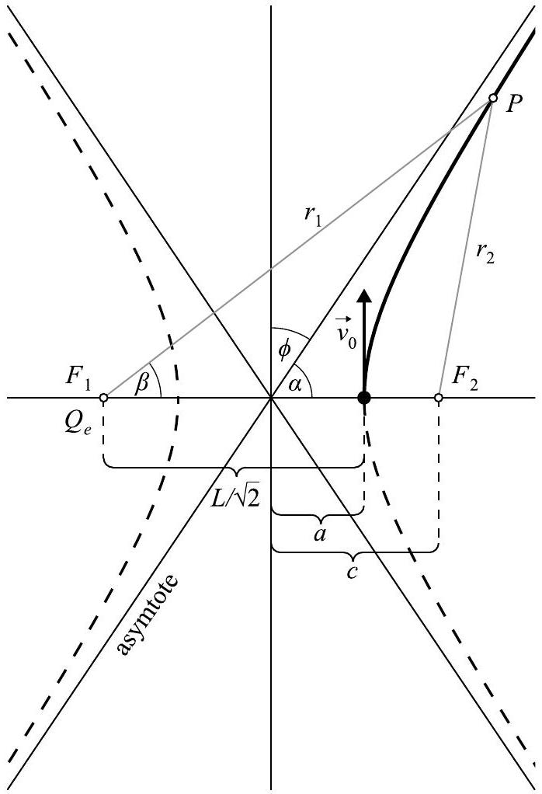
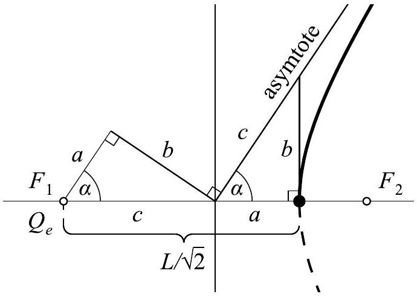
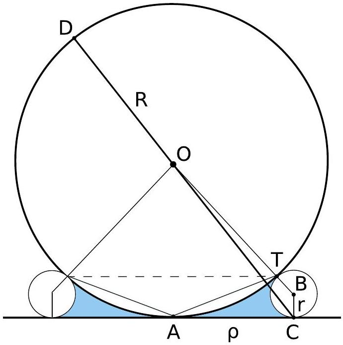
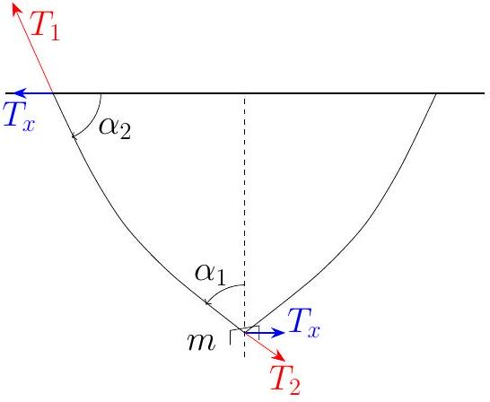
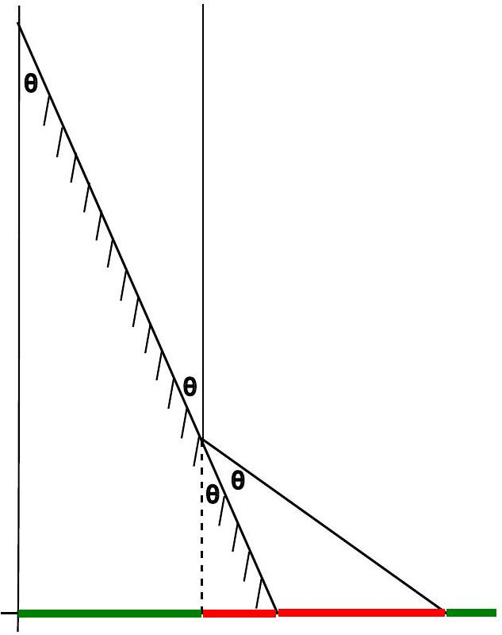
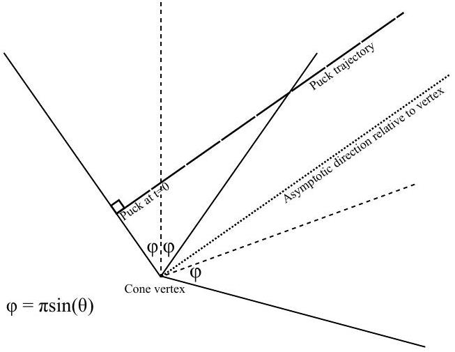
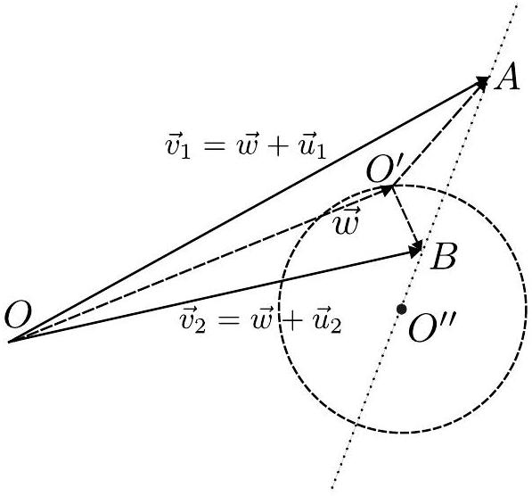
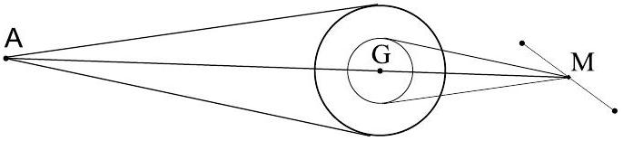

## Nordic-Baltic Physics Olympiad 2024

1. Four charges (7 points) - Solution by Päivo Simson, grading schemes by Päivo Simson, Oleg Košik and Lasse Franti.
i) (2 points) Assuming $v \ll c$ and ignoring gravity, the initial total energy of the system is the sum of classical kinetic and potential energies

$$
\begin{gathered}
E _ { t o t a l } = E _ { k i n } + E _ { \text {electric } } = \\
E _ { k i n } + \frac { 1 } { 2 } \Sigma _ { i \neq j } k \frac { q _ { i } q _ { j } } { r _ { i j } } = \\
4 \frac { m v _ { 0 } ^ { 2 } } { 2 } + 4 \frac { k q ^ { 2 } } { L } + 2 \frac { k q ^ { 2 } } { \sqrt { 2 } L } = \\
= 4 \left( \frac { m v _ { 0 } ^ { 2 } } { 2 } + \frac { k q ^ { 2 } } { L } \frac { 4 + \sqrt { 2 } } { 4 } \right)
\end{gathered}
$$

After the particles have moved infinitely far from each other, the potential energy becomes zero and the total energy is only kinetic:

$$
E _ { \text {total } } = 4 \frac { m v _ { f } ^ { 2 } } { 2 } .
$$

Since the total energy does not change we have from the equality of these two expressions

$$
v _ { f } = \sqrt { v _ { 0 } ^ { 2 } + \frac { k q ^ { 2 } } { L m } \frac { 4 + \sqrt { 2 } } { 2 } } .
$$

Grading:

- Idea of using energy conservation (0.2 pts)
- Idea of symmetry and equality of quantities (0.2 pts)
- Idea of total energy as a sum of kinetic and electrostatic (0.2 pts)
- Formula for electrostatic energy including the two different distances (0.3 pts)
- Factor $\frac { 1 } { 2 }$ from pairings (0.4 pts)
- Final energy is purely kinetic (0.4 pts)
- Correct final answer (0.3 pts)
- If only dimensionless factors missing and final answer is reasonable (0.2 pts)
ii) (5 points)
Let the required angle be $\phi$.

The expression for the total energy reveals that the particles behave effectively independent of each other as if they are only subject to a central field generated by a single effective charge

$$
Q _ { e } = q \frac { 2 \sqrt { 2 } + 1 } { 4 } \approx 0.96 q ,
$$

fixed at the center of mass of the system, and initially at a distance $L / \sqrt { 2 }$ from each particle. This observation allows us to reduce the initial four-body problem into four independent (and identical) two-body problems involving only the spatially fixed charge $Q _ { e }$ and one moving charge $q$.The trajectories are therefore hyperbolas with one focus located at the position of the effective charge. Since the force is repulsive, the effective charge is at the focus $F _ { 1 }$ as shown in the following figure.

Let's now calculate the asymptote angle $\alpha$, since the required angle $\phi$ is just $\pi / 2 - \alpha$.

A hyperbola is defined as a set of points $P$, such that the absolute difference of the distances from $P$ to two fixed points $F _ { 1 }$ and $F _ { 2 }$ (the foci) is constant. Let the distances be $r _ { 1 }$ and $r _ { 2 }$. From the figure it is easy to see that the constant is equal to $2 a$ : if we take the point $P$ on the $x$-axis, then $r _ { 1 } - r _ { 2 } =$ $c + a - ( c - a ) = 2 a$.

To determine the asymptote angle $\alpha$, let us look at the triangle $F _ { 1 } P F _ { 2 }$. From the law of cosines, we have

$$
r _ { 2 } ^ { 2 } = r _ { 1 } ^ { 2 } + 4 c ^ { 2 } - 4 c r _ { 1 } \cos \beta .
$$

Solving for $\cos \beta$ and using $r _ { 2 } = r _ { 1 } - 2 a$ we get

$$
\cos \beta = \frac { r _ { 1 } ^ { 2 } - r _ { 2 } ^ { 2 } + 4 c ^ { 2 } } { 4 c r _ { 1 } } = \frac { a } { c } + \frac { c ^ { 2 } - a ^ { 2 } } { c r _ { 1 } } .
$$

As $r _ { 1 } \rightarrow \infty$, then $\beta \rightarrow \alpha$, and we get the expression for the cosine of the asymptote

$$
\cos \alpha = \frac { a } { c } .
$$

Now using $c = L / \sqrt { 2 } - a$ and knowing that

$$
E = \frac { k q Q _ { e } } { 2 a } = \frac { m v _ { 0 } ^ { 2 } } { 2 } + \frac { \sqrt { 2 } k q Q _ { e } } { L }
$$

(the vis-viva equation for the hyperbola), from which

$$
\frac { 1 } { a } = \frac { m v _ { 0 } ^ { 2 } } { k q Q _ { e } } + \frac { 2 \sqrt { 2 } } { L } ,
$$

we finally get

$$
\begin{aligned}
& \sin \phi = \cos \alpha = \frac { a } { c } = \frac { 1 } { \frac { L } { \sqrt { 2 } a } - 1 } = \\
& = \frac { 1 } { 1 + \frac { L m v _ { 0 } ^ { 2 } } { \sqrt { 2 } k q Q _ { e } } } = \frac { 1 } { 1 + \frac { 4 L m v _ { 0 } ^ { 2 } } { k q ^ { 2 } ( 4 + \sqrt { 2 } ) } } .
\end{aligned}
$$

Grading:

- Effective repulsive central force $F = \frac { A } { r ^ { 2 } }$ pointing from the COM (explicit expression or statement is required) (1 pts)
- Realising hyperbolic motion (0.5 pts)
- Central charge is located at the correct foCUS (0.5 pts)
- Expression for the angle $\phi$ or $\alpha$ in terms of geometrical parameters e.g. $\cos \alpha = a / c$, $\tan \alpha = b / a$ (1 pts)
- Vis-viva equation OR angular momentum conservation (1 pts)
- Deriving final answer (1 pts)

Subpoints for angular momentum conservation:

- Mentioned that angular momentum is conserved (0.3 pts)
- Writes initial angular momentum around COM using $L$ and $v _ { 0 }$ (0.3 pts)
- Writes final angular momentum around COM using $v _ { f }$ (0.4 pts)
Variation 1.
If the student doesn't know the vis-viva equation for the hyperbola
$$
E = \frac { k q Q _ { e } } { 2 a } ,
$$
which differs from the corresponding equation for the ellipse only by the sign of the total energy, it can be derived as follows.
From the asymptote angle formula
$$
\cos \alpha = \frac { a } { c }
$$
the geometric relationships shown in the following figure follow immediately.

We see that the two right triangles on the figure are identical.
From the conservation of angular momentum (with respect to the point $F _ { 1 }$ ) we have
$$
m ( c + a ) v _ { 0 } = m b v _ { f } \Longrightarrow v _ { f } = v _ { 0 } \frac { c + a } { b } ,
$$

and from the conservation of energy using $b ^ { 2 } = c ^ { 2 } - a ^ { 2 }$

$$
\frac { k q Q _ { e } } { a + c } = \frac { m v _ { f } ^ { 2 } } { 2 } - \frac { m v _ { 0 } ^ { 2 } } { 2 } =
$$

$$
= \frac { m v _ { 0 } ^ { 2 } } { 2 } \left( \frac { ( c + a ) ^ { 2 } } { c ^ { 2 } - a ^ { 2 } } - 1 \right) = \frac { m v _ { 0 } ^ { 2 } } { 2 } \frac { 2 a } { c - a } ,
$$

from which

$$
\frac { m v _ { 0 } ^ { 2 } } { 2 } = \frac { c - a } { 2 a } \cdot \frac { k q Q _ { e } } { c + a } .
$$

Inserting this into the total energy expression we finally get

$$
E = k q Q _ { e } \left( \frac { 1 } { 2 a } \cdot \frac { c - a } { c + a } + \frac { 1 } { c + a } \right) = \frac { k q Q _ { e } } { 2 a } .
$$

Variation 2.
Using the algebraic equation for the hyperbola

$$
\frac { x ^ { 2 } } { a ^ { 2 } } - \frac { y ^ { 2 } } { b ^ { 2 } } = 1 ,
$$

and knowing that $b ^ { 2 } = c ^ { 2 } - a ^ { 2 }$, we get

$$
\tan \alpha = \lim _ { x \rightarrow \infty } \frac { y } { x } = \lim _ { x \rightarrow \infty } b \sqrt { \frac { 1 } { a ^ { 2 } } - \frac { 1 } { x ^ { 2 } } } = \frac { b } { a } .
$$

Variation 3.
The vis-viva equation step can be done using conservation of angular momentum around COM, as all the forces are radial.

$$
\mathcal { L } = m v _ { 0 } \frac { L } { \sqrt { 2 } } = m v _ { f } b
$$

since we already know $a + c = \frac { L } { \sqrt { 2 } } , c ^ { 2 } =$ $a ^ { 2 } + b ^ { 2 }$, we can solve for the hyperbolas parameters.
2. Oklo Fission Reactor (7 points) - Solution by Tudor Plopeanu, Jaan Kalda and Topi Löytäinen.
i) (1.5 points)The rate of natural decay is proportional to the amount of decaying material. If $\nu$ is the amount of ${ } ^ { 235 } \mathrm { U }$ at some point in time, then $\frac { \mathrm { d } \nu } { \mathrm { d } t } = - k \nu$ for some positive constant $k$. Then, $\frac { \nu _ { b } } { \nu _ { a } } = \mathrm { e } ^ { - k \left( t _ { b } - t _ { a } \right) }$ for some moments $t _ { b } > t _ { a }$. The half-time is defined as the time until the amount of material is halved, so $k \tau _ { 5 } = \ln 2 , k = \frac { \ln 2 } { \tau _ { 5 } } , \frac { \nu _ { b } } { \nu _ { a } } = \left( e ^ { \ln 2 } \right) ^ { \frac { t _ { b } - t _ { a } } { \tau _ { 5 } } } =$ $2 ^ { \frac { t _ { b } - t _ { a } } { \tau _ { 5 } } }$. Therefore, the amount of ${ } ^ { 235 } \mathrm { U }$ in natural uranium when the Oklo's reactor operated was $2 ^ { \frac { T _ { 0 } } { \tau _ { 5 } } }$ times higher. Similarly, the amount of ${ } ^ { 238 } \mathrm { U }$ was $2 ^ { \frac { T _ { 0 } } { \tau _ { 8 } } }$ higher. The natural abundence of ${ } ^ { 235 } \mathrm { U } T _ { 0 }$ years ago was

$$
R _ { 1 } \approx \frac { \frac { \nu _ { 5 } } { \nu _ { 8 } } 2 ^ { \frac { T _ { 0 } } { \tau _ { 5 } } } } { \frac { \nu _ { 5 } } { \nu _ { 8 } } 2 ^ { \frac { T _ { 0 } } { \tau _ { 5 } } } + 2 ^ { \frac { T _ { 0 } } { \tau _ { 8 } } } } \approx 3.16 \% ,
$$

where $\nu _ { 5 }$ and $\nu _ { 8 }$ represent the number of isotopes of uranium. Keep in mind that $R =$ $\nu _ { 5 } / \left( \nu _ { 5 } + \nu _ { 8 } \right)$, so $\nu _ { 5 } / \nu _ { 8 } = R / ( 1 - R )$.
Grading: (preliminary)

1. Amount of ${ } ^ { 238 } \mathrm { U }$ during operation $\nu _ { 8 } ^ { \prime } =$ $\nu _ { 8 } 2 ^ { T _ { 0 } / \tau _ { 8 } }$. (0.3 pts)
2. Amount of ${ } ^ { 235 } \mathrm { U }$ during operation $\nu _ { 5 } ^ { \prime } =$ $\nu _ { 5 } 2 ^ { T _ { 0 } / \tau _ { 5 } }$. (0.3 pts)
3. Abundance of ${ } ^ { 235 } \mathrm { U }$ during operation expressed in terms of $\nu _ { 5 }$ and $\nu _ { 8 }$. (0.3 pts)
4. Ratio $\nu _ { 5 } / \nu _ { 8 }$ expressed in terms of $R$. (0.3 pts)
5. Abundance of ${ } ^ { 235 } \mathrm { U }$ expressed in terms of $R$ and numerical answer. (0.3 pts)

ii) (2 points) From here on we shall assume that before the Oklo reactor started operating, its abundence of uranium isotopes matched the natural abundence. After it finished operating, the ${ } ^ { 235 } \mathrm { U }$ isotopes kept decaying at the normal rate, reaching the value we see today.

The mass of ${ } ^ { 235 } \mathrm { U }$ after the reactor finished operating was $M _ { 1 } \approx 2 ^ { \frac { T _ { 0 } } { \tau _ { 5 } } } M R _ { O } \approx$ $1.84 \times 10 ^ { 7 } \mathrm {~kg}$.

The ${ } ^ { 238 } \mathrm { U }$ isotopes underwent normal decay, and we shall use them to compute the mass of ${ } ^ { 235 } \mathrm { U }$ before the reactor started. The mass of ${ } ^ { 238 } \mathrm { U }$ was approximately $M ( 1 -$ $R ) 2 ^ { \frac { T _ { 0 } } { \tau _ { 8 } } }$. The mass of ${ } ^ { 235 } \mathrm { U }$ before the reactor operated can, as such, be estimated as

$$
M _ { 0 } = \frac { R _ { 1 } } { 1 - R _ { 1 } } M ( 1 - R ) 2 ^ { \frac { T _ { 0 } } { \tau _ { 8 } } } \approx 2.14 \times 10 ^ { 7 } \mathrm {~kg} .
$$

The number of ${ } ^ { 235 } \mathrm { U }$ nuclei which reacted is $\nu = \left[ \left( M _ { 0 } - M _ { 1 } \right) / 0.235 \right] \cdot N _ { A } \approx 7.61 \times 10 ^ { 30 }$. The amount of energy generated through fission is the above value multiplied by $E _ { 0 }$. The average power of the reactor is $\nu E _ { 0 } / T \approx$ $7.73 \times 10 ^ { 7 } \mathrm {~W}$.
Grading: (preliminary)

1. Mass of ${ } ^ { 235 } \mathrm { U }$ by the end of operation $M _ { 5 } ^ { \prime } = 2 ^ { T _ { 0 } / \tau _ { 5 } } M R _ { 0 }$. (0.4 pts)
2. Mass of ${ } ^ { 238 } \mathrm { U }$ by the end of operation $M _ { 8 } ^ { \prime } = 2 ^ { T _ { 0 } / \tau _ { 8 } } M ( 1 - R )$. (0.3 pts)
3. Mass of ${ } ^ { 235 } \mathrm { U }$ at the beginning of operation $2 ^ { T _ { 0 } / \tau _ { 8 } } M ( 1 - R ) \frac { R ^ { \prime } } { 1 - R ^ { \prime } }$. (0.3 pts)
4. Number of atoms that have undergone fission $N = N _ { A } \Delta M / 0.235$. (0.3 pts
5. Energy $E = N E _ { 0 }$. (0.2 pts)
6. Units converted correctly. (0.2 pts)
7. Power: expression and numerical value. (0.3 pts)

iii) (1.5 points) Neutrons released from fission tend to have a high kinetic energy which have a low probability to cause further fissions. We need to slow them down to increse this probability. Water is relatively good for slowing down neutrons. This slowing down is called "moderation". The reactor could not explode since the water necessary for moderation would vapourize if the power increased too much. This would prevent an uncontrolled chain reactor from happening. The reactor's power depends on water being present and thus the operation was selfregulating.

When the water intake doubled, the amount of power doubled.

Grading: (preliminary)

1. Idea that neutrons from fission unlikely to cause fission unless moderated: (0.3 pts)
2. Idea of water as a moderator: (0.2 pts)
3. Idea of self-regulating behavior: (0.5 pts)
4. Observation that power doubles when flow doubles: (0.5 pts)

iv) (2 points) The amount of energy generated by the reactor was $\nu E _ { 0 }$. We shall consider the vast majority of it to have gone into heating up and vaporizing water. Let us consider water flowing in at $0 ^ { \circ } C$ and leaving at $100 ^ { \circ } C$. Then, the amount of energy absorbed by 1 kg of water is $\left( 100 ^ { \circ } K \right) c + L =$ $E _ { w } = 2.68 \times 10 ^ { 6 } \mathrm {~J}$. The total mass of water that flowed into Oklo's reactor is $\nu E _ { 0 } / E _ { w } =$ $9.09 \times 10 ^ { 13 } \mathrm {~kg}$.

Grading: (preliminary)

1. Approximation that all energy went into water (0.5 p)
2. $\Delta T \approx 100 ( \mathbf { 0 . 3 ~ p } )$
3. Both heating and vaporization considered (0.3 p)
4. $E _ { w } = 2.68 \times 10 ^ { 6 } \mathrm {~J}$ or similar idea (0.3 p)
5. $\nu E _ { 0 } / E _ { w } = 9.09 \times 10 ^ { 13 } \mathrm {~kg} ( \mathbf { 0 . 6 } \mathbf { p } )$
3. Sticky ball (4 points) - Solution by Jaan Kalda, Tudor Plopeanu, grading schemes by Eppu Leinonen.

Let the radius of the neck be $\rho \ll R$ thus the force from surface tension at the contact of the sphere is negligible (angle to the horizontal $\approx 0$ ). Then, the curvature radius of the meniscus $r \ll \rho$ can be found from the intersecting secants theorem applied on a point $C$ on the bottom edge of the neck relative to the ball and approximating that the point $T$ is (near) the intersection of $C D$ and the circle: $2 r \cdot 2 R \approx \rho ^ { 2 }$. On the drawing, $A C ^ { 2 } \approx C T \cdot C D$ and we approximate $C T$ as $2 r , R + r$ as $R$, and $A C$ as $\rho$. The pressure difference between the water and the surrounding air is $\Delta p = \sigma / r$. Its total vertical component is equal to its amplitude times the vertical cross-section $S = \pi \rho ^ { 2 }$. As such, the total vertical force on the ball difference between the two cases (with and without water) is $\Delta F \approx \sigma \pi \rho ^ { 2 } / r = 4 \pi \sigma R$.
Grading: (preliminary) Note that differing sign conventions are tolerated

- Stating that the meniscus is (roughly) inverse spherical or usage of constant $r$ to characterise the meniscus as inverse spherical (0.5 pts)
- $r \ll \rho \ll R$ (0.1 pts)
- Stating that surface tension from from contact is negligible or $\Delta F$ comes from the pressure difference (either explicitly or implicitly) (0.5 pts)
$\cdot 2 r \cdot 2 R \approx \rho ^ { 2 }$ (0.7 pts) (if not found, partial points can be earned as below)
- $C T \approx 2 r$ (0.1 pts)
- $R + r \approx R$ (0.1 pts)
- $A C \approx \rho$ (0.2 pts)
- $A C ^ { 2 } \approx C T \cdot C D$ or statement of interesecting secants theorems (0.3 pts)
- $\Delta p = \sigma / r$ (1 pts) (if not found, partial points can be earned as below)
- $\Delta p = \sigma \left( 1 / r _ { 1 } + 1 / r _ { 2 } \right)$ or any attempt to use a form of the Laplace-Young equation (0.2 pts)
- $\Delta p = \sigma ( 1 / \rho - 1 / r )$ (0.3 pts)
- $S = \pi \rho ^ { 2 }$ (correct effective are for pressure) (0.5 pts)
- $\Delta F = S \Delta p$ (0.5 pts)
- $\Delta F \approx 4 \pi \sigma R$ (0.2 pts) (0.1 pts for each of the following)
- $\Delta F > 0$ or noting that the contact force increases
- Correct dimensionless factor of $4 \pi$ and correct dimensions (only if approach is correct)

Solution 2 by Eppu Leinonen
The position of the meniscus can be parameterised using the angle $\theta = \angle T O A$. The meniscus is small as the amount of water is small. Thus $| \theta | \ll 1$ and the radii can be approximated as $\rho = R \sin \theta \approx R \theta$ and $2 r \approx R ( 1 - \cos \theta ) \approx R \theta ^ { 2 } / 2$. The change in normal force due to surface tension is $\Delta F _ { \sigma } = 2 \pi \sigma \rho \sin \theta \approx 2 \pi \sigma R \theta ^ { 2 } \approx 0$. Using the Young-Laplace equation $\Delta p = \sigma ( 1 / \rho -$ $1 / r ) \approx \sigma \left( 1 / \theta - 4 / \theta ^ { 2 } \right)$. Thus the total change in normal force due to pressure difference is $\Delta F _ { p } = - S \Delta P = - \pi \rho ^ { 2 } \Delta P \approx \pi \sigma R ( 4 - \theta ) \approx$ $4 \pi \sigma R ^ { 2 }$. I.e. $\Delta F = \Delta F _ { p } + \Delta F _ { \sigma } \approx \Delta F _ { p } \approx$ $4 \pi \sigma R$.

Grading: (preliminary) Note that differing sign conventions are tolerated

- Stating that the meniscus is (roughly) inverse spherical or usage of constant $r$ to characterise the meniscus as inverse spherical (0.5 pts)
- $| \theta | \ll 1$ (0.1 pts)
- $\rho \approx R \theta$ (0.2 pts)
- $A C \approx \rho$ (0.2 pts)
- $r \approx R \theta ^ { 2 } / 4$ (0.3 pts)
- $\Delta F _ { \sigma } \propto \theta ^ { 2 } \ll \Delta F _ { p }$ or any statement that the force from surface tension is negligible or $\Delta F = \Delta F _ { p }$ (0.5 pts)
- $\Delta p = \sigma / r$ (1 pts) (if not found, partial points can be earned as below)
- $\Delta p = \sigma \left( 1 / r _ { 1 } + 1 / r _ { 2 } \right)$ or any attempt to use a form of the Laplace-Young equation (0.2 pts)
- $\Delta p = \sigma ( 1 / \rho - 1 / r )$ (0.3 pts)
- $S = \pi \rho ^ { 2 }$ (correct effective area for pressure) (0.5 pts)
- $\Delta F _ { p } = - S \Delta p$ (0.5 pts)
- $\Delta F \approx 4 \pi \sigma R$ (0.2 pts) (0.1 pts for each of the following)
- $\Delta F > 0$ or noting that the contact force increases
- Correct dimensionless factor of $4 \pi$ and correct dimensions (only if approach is correct)

Note: A common approach was to use the method of virtual displacement to solve for the force caused by the meniscus. However, it turns out that $\delta A _ { l g } \propto \sqrt { r } \delta r$ (the area of the meniscus-air interface is roughly half of a spherical toroid with radii $\rho$ and $r$ ) which means that the change in potential energy due to the change in surface area is negligible $( r \ll R )$. Thus the virtual work done by lifting the sphere only counteracts the virtual work done by the pressure, which reduces the problem back to either solution 1 or solution 2. Thus no points are granted for just mentioning this approach and telling that $\delta U = \sigma \delta A _ { l g }$.

Solution 3 using virtual displacement (by Jaan Kalda). Let us denote the contact area of water and plate with $A = \pi \rho ^ { 2 }$; then, the contact area of water and ball is also approximately $A$. Let the ball touch initially the plate, and then be raised by $\mathrm { d } x$. Since the volume of water is conserved, no work is made by atmospheric pressure, and $2 r \mathrm {~d} A = A \mathrm {~d} x$, where $\mathrm { d } A$ is the change of the contact area; hence, $\frac { \mathrm { d } A } { \mathrm {~d} x } = A / 2 r$. Meanwhile, for zero contact angle, the difference of surface energies at the air-solid interface, and at the watersolid interface equals to the surface energy of the water-air interface. This fact can be expressed in terms of the three surface tension coefficients denoted with $\sigma _ { 1 } , \sigma _ { 2 }$, and $\sigma$, respectively: $\sigma _ { 1 } - \sigma _ { 2 } = \sigma \cos \alpha = \sigma$. During our virtual displacement, the air-water interface remains almost constant; meanwhile, air-solid interface is increased by $2 \mathrm {~d} A$ (contributed equally by the ball and plate surfaces). Therefore, the surface energy is increased by $\mathrm { d } U = \left( \sigma _ { 1 } - \sigma _ { 2 } \right) 2 \mathrm {~d} A = 2 \sigma \mathrm {~d} A$. Now we can find force as $F = \frac { \mathrm { d } U } { \mathrm {~d} x } = 2 \sigma \frac { \mathrm {~d} A } { \mathrm {~d} x } =$ $\sigma A / r$. This is the same expression we obtained from Young-Laplace equation. From this point on, the solution follows the steps made above.

Grading: (preliminary) Note that differing sign conventions are tolerated.

- Only the contact area between the solid and the liquid changes notably (0.5 pts)
$\cdot \frac { \mathrm { d } A } { \mathrm {~d} x } = A / 2 r$ (0.5 pts)
- $\sigma _ { 1 } - \sigma _ { 2 } = \sigma$ (0.2 pts)
- $\mathrm { d } U = 2 \left( \sigma _ { 1 } - \sigma _ { 2 } \right) \mathrm { d } A$ (0.3 pts)
- $F = \frac { \mathrm { d } U } { \mathrm {~d} x }$ (only if $A$ has been identified correctly) (0.3 pts)
- $F = \sigma A / r$ (0.2 pts)

These replace noting that $\Delta F _ { \sigma } \approx 0 , \Delta p =$ $\sigma / r$ and $\Delta F = S \Delta p$ from the other solutions.
4. Totality (8 points) - Solution by Tudor Plopeanu, Taavet Kalda. Grading: (preliminary)

- In in this task, numerical errors in the answers give (-0.1 pts) (as long as the answer is reasonable)

i) (1.5 points) As the distance from the Moon to the Sun is much larger than the distance from the Moon to the Earth, we can consider the speed of the Moon's shadow on Earth to be equal to the Moon's speed altogether. The speed of the Moon is the ratio of the circumference of its orbit to its period:

$$
v _ { m } = \frac { 2 \pi R _ { m } } { T _ { m } } = 1.02 \mathrm {~km} / \mathrm { s } .
$$

Because during the peak of the eclipse, the centre-points of Earth, the Moon and the Sun lie on the same line, the shadow of the Moon must move along the diameter of the Earth when viewed face-on. As such, the shadow travels a distance of $2 r _ { e }$ while it's still visible on Earth and the eclipse will be observable

for time

$$
\begin{aligned}
T _ { \mathrm { ecl } } & = \frac { 2 r _ { e } } { v _ { m } } = \frac { r _ { e } } { \pi R _ { m } } T _ { m } \\
& \approx 12.5 \times 10 ^ { 3 } \mathrm {~s} = 3.46 \mathrm {~h} .
\end{aligned}
$$

Grading: (preliminary)

- Explains that the moons shadow can be approximated by the moons position (0.5 pts)
- Correct speed of the moon (0.5 pts)
- Correct final expression (0.5 pts)
- Minor mistake in final expression (-0.2 pts)

ii) (1 point) In absence of the Earth's rotation, the Moon's shadow would cover close to $\pi$ radians. Over $T _ { \mathrm { ecl } }$, the Earth rotates by $2 \pi \frac { T _ { e c l } } { T _ { 0 } }$ radians. The Earth's rotation goes "in the same direction" as the Moon's shadow, and therefore the total longitudinal reach of the eclipse is $\left| 180 \left( 1 - 2 T _ { \mathrm { ecl } } / T _ { 0 } \right) \right| \approx 128$ degrees.

Grading: (preliminary)

- Figures out that the angle is $\pi$ without the rotation of the earth (0.3 pts)
- Explains that the angle becomes smaller than $\pi$ due to earths rotation (0.3 pts)
- Correct final formula and answer (0.4 pts)
- Thinks earths rotation goes against the moons rotation and obtains an angle $> \pi$ (-0.3 pts)

iii) (1.5 points) Right near the end of the eclipse, the Earth's rotation moves the surface under the Moon's shadow almost perpendicularly to the Moon's shadow's velocity. As such, the width of the Moon's shadow is equal to the distance travelled by the Moon's shadow for the duration of the totality at that point,

$$
w _ { \lambda } = v _ { m } t _ { 0 } = 2 \pi R _ { m } \frac { t _ { 0 } } { T _ { m } } \approx 123 \mathrm {~km} .
$$

At the equator, the surface of the Earth is closer by $r _ { e }$ to the Moon compared to the point where the eclipse ends, serving to further increase the area of the full shadow. As the Moon covers an angle of approximately $\alpha = 2 r _ { m } / R _ { m }$ radians in the sky, when getting closer to the moon by $r _ { e }$, the width of its shadow will increase by roughly $\alpha r _ { e } \approx$
57.7 km. As such, the total width of the shadow near the equator is around $w _ { \mathrm { eq } } =$ $v _ { m } t _ { 0 } + \alpha r _ { e } = 180 \mathrm {~km}$.

Grading: (preliminary)

- Realizes that the velocities are perpendicular at the end of the eclipse (0.4 pts)
- Calculates the width of the eclipse at some point on earth (0.5 pts)
- Correctly finds how to translate the width to the width at the equator (0.5 pts)
- Correct final answer (0.1 pts)

iv) (1.5 points)The peak of the eclipse occurs on the equator, firstly because that's where the Moon's shadow is the biggest due to it being closer to the Moon, but also because the Earth's rotation is the fastest there, and the rotation of the Earth serves to lengthen the effect of the eclipse. At the equator the surface of the Earth moves with speed $v _ { e } =$ $2 \pi r _ { e } / T _ { 0 } = 0.46 \mathrm {~km} / \mathrm { s }$. The angle between the velocity of the Earth's surface at the equator and the Moon's shadow's velocity is $\lambda$, so the relative speed of the Moon's shadow can be obtained from cosine theorem as

$$
v _ { \mathrm { rel } } = \sqrt { v _ { m } ^ { 2 } + v _ { e } ^ { 2 } - 2 v _ { m } v _ { e } \cos \lambda } = 0.654 \mathrm {~km} / \mathrm { s } .
$$

The duration while the eclipse can be observed during the peak is thus $t _ { \mathrm { eq } } =$ $w _ { \text {eq } } / v _ { \text {rel } } = 276 \mathrm {~s} = 4.6 \mathrm {~min}$.

Grading: (preliminary)

- Shows that the eclipse must be observable the longest time at the equator (0.5 pts)
- Finds the relative velocity between the moon's shadow and the velocity of the surface of the earth (0.5 pts)
- From this finds the formula for the maximum duration of the eclipse (0.5 pts)
- Forgetting to take the angle between the velocities into account (-0.3 pts)

v) (1 point) Because $a \ll R _ { e }$, we can treat the relative velocity between the Moon's shadow and Earth to be the same as in the previous subpart. The full shadow of the Moon on the Earth at the equator is a circle, and we can find the distance the Moon's shadow has to travel over the course of the totality at a point displaced by $a$ using the Pythagorean Theorem as $2 \left( w _ { \text {eq } } ^ { 2 } / 4 - a ^ { 2 } \right) ^ { 1 / 2 }$. The eclipse is then observable for

$$
\frac { 1 } { v _ { \mathrm { rel } } } \sqrt { w _ { \mathrm { eq } } ^ { 2 } - 4 a ^ { 2 } } = 230 \mathrm {~s} = 3.8 \mathrm {~min} .
$$

Grading: (preliminary)

- Argues that the relative velocity is approximately the same as in the previous task (0.5 pts)

- Correct geometry and answer (0.5 pts)
vi) (1.5 points)With our assumptions, the typical width of an eclipse is $\left( w _ { \lambda } + w _ { \text {eq } } \right) / 4$, and the typical length on the surface of the Earth is $\pi r _ { e }$. As such, a typical eclipse covers an area equal to the product of the two above values. From there, we deduce the probability of an eclipse being noticeable from a given arbitrary point on Earth as the area spanned by the eclipse, $\pi r _ { e } \left( w _ { \lambda } + w _ { e q } \right) / 4$, divided by the surface area of Earth, $4 \pi r _ { e } ^ { 2 }$. Then, the expected number of eclipses until one covers a given arbitrary point is the multiplicative inverse of the above probability. As eclipses occur, on average, every 18 months, the expected time for this to happen is

$$
\frac { 16 r _ { e } } { w _ { \lambda } + w _ { \mathrm { eq } } } \cdot 18 \text { months } \approx 500 \text { years. }
$$

Grading: (preliminary)

- Shows that the probability per eclipse is equal to the area covered by the eclipse divided by the total area of the earth (0.5 pts)
- Finds the area covered by one eclipse (0.5 pts)
- Correctly multiples the inverse probability with the duration between eclipses and finds the correct answer (0.5 pts)
5. String and Pendulum (10 points) - Solution by Päivo Simson, Tudor Plopeanu.
i) (5 points) We build two pendulums of different lengths and release them from different angles such that their periods are equal. We choose a small enough amplitude for the longer pendulum to be able to use the small angle formula, and a large amplitude for the short pendulum.

We measure the lengths of the pendulums. Let $l _ { 0 }$ be the length of the longer pendulum and $l _ { 1 }$ be the length of the shorter pendulum. Additionally, we measure the angular amplitude $\phi$ (in degrees) of the shorter (larger-amplitude oscillating) pendulum with a protractor. From the equality of periods, we get

$$
\sqrt { l _ { 0 } } = \sqrt { l _ { 1 } } \left( 1 + A \alpha ^ { 2 } \right) ,
$$

from which

$$
A = \frac { \sqrt { \frac { l _ { 0 } } { l _ { 1 } } } - 1 } { \alpha ^ { 2 } } = \frac { \sqrt { \frac { l _ { 0 } } { l _ { 1 } } } - 1 } { \left( \frac { \pi \phi } { 180 ^ { \circ } } \right) ^ { 2 } } .
$$

We repeat the experiment with different lengths and finally find the average of the results. With the example values: $\phi = 55 ^ { \circ } , l _ { 0 } =$ 41.5 cm and $l _ { 1 } = 36.5 \mathrm {~cm}$ we get $A \approx 0.07$. The theoretical true value is $A \approx 0.063$, but the expected measured value is slightly larger, as higher order terms of the theoretical expansion ( $1 + A \alpha ^ { 2 } + B \alpha ^ { 4 } + \ldots$ ) are "combined" in the value of $A$. Thus generally, the larger the angle used in the measurement, the larger the value of $A$, which is why a value in the range $A \in [ 0.06,0.08 ]$ is to be expected.

We note a common solution attempt of measuring the number of periods until two pendulums of equal length, but different initial angles, sync up again (i.e. one obtains a phase shift). However, the inaccuracy in this method is very large, in large part due to the amplitude drastically decreasing for large angles as an effect of energy dissipation. Even if a value of $A \approx 0.07$ is obtained, this might therefore not get the "correct value" mark. However, if the amplitude decrease is taken into account, for example by averaging the angular amplitudes over the measurement time, it is possible to obtain a more accurate and correct result.

Another common attempt of using a second pendulum as a "clock" results in a far too low time resolution, and therefore is not rewarded any points.

Grading: (preliminary)
Note: The "sync up method" can be rewarded up to 1.5pts (0.5pts for measurements, 1pts for multiple datapoints).

- Recognize that we may use two pendulums with different lengths and angular amplitudes with equal periods (0.5 pts)
- Presented measurement data of relevant quantities (0.5 pts)
- Good choice of measurements (i.e. large enough angles, correct measured angle, long enough pendulum for reasonably large period etc.) (0.5 pts)
- Using two or more datapoints (e.g. different lengths etc.) (1 pts)
- Obtaining a correct expression for $A$ in terms of measurable quantities (1 pts)
- Correct value $A \in [ 0.06,0.08 ]$ (1.5 pts)

ii) (5 points)

We shall tie some red string to two fixture points on the same horizontal level and dangle the known mass staple from the middle point. We measure the angles the string makes with the horizontal plane at the middle points and next to the supports, averaging the latter for a more accurate value. Let $\alpha _ { 1 }$ be the angle at the staple's level, and $\alpha _ { 2 }$ be the angle at the support's level. Let $T _ { x }$ be the (unknown) horizontal tension in the string. Along the string, between the staple and the support, $T _ { x }$ is constant, as all acting forces are vertical.

Equilibrium around the staple implies $2 T _ { x } \cot \alpha _ { 1 } = m g$. Equilibrium on the string strictly between the staple and the support implies $2 T _ { x } \left( \tan \alpha _ { 2 } - \cot \alpha _ { 1 } \right) = M g$, where $M$ is the mass of the string. We compute the mass of one meter's worth of string as

$$
\begin{aligned}
\frac { M } { l } & = \frac { m } { l } \frac { \tan \alpha _ { 2 } - \cot \alpha _ { 1 } } { \cot \alpha _ { 1 } } \\
& = \frac { m } { l } \left( \tan \alpha _ { 1 } \tan \alpha _ { 2 } - 1 \right) ,
\end{aligned}
$$

where $l$ is the measured length of string.
We repeat the experiment with different lengths and finally find the average of the results. With the example values $\alpha _ { 1 } = 70 ^ { \circ }$, $\alpha _ { 2 } = 41 ^ { \circ }$, we find $M \approx 0.12 \mathrm {~g} . ^ { 1 }$

Grading: (preliminary) Easy to by chance get close to the correct answer using other methods, e.g. scales, balancing, other pendulums, ... Also the method of physical vs mathematical pendulum does not work, likely due to air resistance.

- Recognize the method (banana) (1 pts)
- Recognize that the system is in equilibrium, and we may balance the forces (1 pts)
- Correct equation (1 pts)
- (Conditional on correct method being used) Correct answer [0.11, 0.15] (2 pts)
6. Cones (8 points) - Solution by Tudor Plopeanu, grading schemes by Eppu Leinonen and Aleksi Kononen.
i) (2 points) We will consider any extreme point on the red heart and its reflection. This may be easiest and most precise for the points furthest from the center of the picture, but any edge point of the red heart would suffice. Let $\theta$ be the cone's half apex angle. Let $r$ be the measured ratio of the (angular) distance from the perceived image to the mirror and the perceived image to the original point. Then, $\frac { \tan \theta } { \tan 2 \theta } =$ $r$, so $\theta = \arccos \frac { 1 } { \sqrt { 2 ( 1 - r ) } }$, or alternatively $\arctan \sqrt { 1 - 2 r }$. Of course, the apex angle is $2 \theta$, which is double the above.

For measured $r = 0.25$, we have the answer $2 \theta \approx 1.22$ radians, or 71 degrees.

Grading: (preliminary)

- Stating that the image is formed by vertical rays as the camera is far away (0.5 pts)
- Correct explicit expression of $\theta$ with respect to $r$ (or some other measurable variable) (1 pts) (if not found, partial points can be earned as below)
- Correct geometrical figure (0.2 pts)
- $r = \tan \theta / \tan 2 \theta$ or equivalent or a correct implicit equation for $\theta$ (0.5 pts)
- Correct numerical answer $2 \theta \in \left[ 65 ^ { \circ } , 76 ^ { \circ } \right]$ (0.5 pts) (only if approach is correct)
- If only $\theta$ is given and not $2 \theta$ (-0.2 pts)

ii) (1 point) The contribution of gravity along the side of the cone has to be equal to the contribution of the centrifugal force. As such, $m g \cos \theta = \frac { m v ^ { 2 } } { R } \sin \theta$, so $v = \sqrt { R g \cot \theta }$.
Grading: (preliminary)

- Correct force balance (0.5 pts)
- Correct expression for $v$ (0.5 pts)
- Mistakes in trigonometry (-0.1 pts)

iii) (2.5 points) The puck's energy is the sum of its gravitational potential energy and its kinetic energy, so for a maximal vertical displacement $h _ { f }$, and the speed $v _ { f }$ at that moment, we have $E = \frac { v ^ { 2 } } { 8 } + g h _ { f } =$ $\frac { v _ { f } ^ { 2 } } { 2 }$. From the conservation of angular momentum between the initial moment and the minimal distance to axis moment, when the velocity is horizontal, we can deduce that $\frac { v } { 2 } R = v _ { f } R _ { f }$, where $R _ { f }$ is the minimal distance to the cone's axis. We can relate $h _ { f }$ and $R _ { f }$ through $\frac { R - R _ { f } } { h _ { f } } = \tan \theta$. Then, $h _ { f } = ( R -$ $\left. R _ { f } \right) \cot \theta$. Replacing $h _ { f }$ and $v _ { f }$ in the energy conservation, $\frac { v ^ { 2 } } { 8 } = \frac { v ^ { 2 } R ^ { 2 } } { 8 R _ { f } ^ { 2 } } - g \left( R - R _ { f } \right) \cot \theta$. Replacing $v ^ { 2 } = R g \cot \theta$ and solving the third degree polynomial in $R _ { f } , 8 R _ { f } ^ { 3 } - 9 R R _ { f } ^ { 2 } + R ^ { 3 } =$ 0 , yields the roots $R , \frac { 1 + \sqrt { 33 } } { 16 } R$, and some negative value. Our minimal radius is, as such, $\frac { 1 + \sqrt { 33 } } { 16 } R \approx 0.42 R$.
Grading: (preliminary)

- Idea of using energy and angular momentum conservation (0.2 pts) (0.1 pts for each)
- Correct energy conservation (0.5 pts)
- Correct angular momentum conservation (0.5 pts)
- Correct relation between $h _ { f }$ and $R _ { f }$ (0.1 pts)
- Correct third degree polynomial (0.5 pts)
- Picking the physically relevant solution (0.5 pts)
- Correct final answer (0.2 pts)

iv) (2.5 points) Let us unfold the cone and repeat its pattern, as in the figure above. We note that the relation between the apex angle and the angle of the unfolded cone are re-

[^0]
lated through the area of a cone $\pi L ^ { 2 } \sin \theta =$ $\varphi L ^ { 2 }$ and as such $\varphi = \pi \sin \theta$. The puck's trajectory is a straight line starting perpendicular to the edge of our unfolded cone. The radius vector will rotate, in our drawing, by $90 ^ { \circ } = \pi / 2$ over an infinite period of time. To match the rotation on our representation of the cone with the rotation of the radius vector, we remind ourselves that a $360 = 2 \pi$ degree rotation of the radius vector matches a $2 \varphi$ rotation on our drawing. As such, the number of radians of rotation will be $\frac { \pi } { 2 } \frac { 2 \pi } { 2 \pi \sin \theta } = \frac { \pi } { 2 \sin \theta }$.
Grading: (preliminary)

- Idea of folding out the cone (0.2 pts)
- Stating that the trajectory is a straight line in the folded plane (1 pts)
- Correct 90 degree rotation in the folded picture or a correct figure (0.6 pts)
- Correct relation between rotation in the folded plane and the rotation of the radial vector (0.7 pts)
- Using $\theta$ instead of $2 \theta$ as the apex angle (-0.3 pts)

Solution 2 by Eppu Leinonen
Let $\phi$ be the total rotation angle of the radius vector and $r$ its length. The speed related to $\dot { \phi }$ is $r \dot { \phi }$ and the speed related to $\dot { r }$ is $\dot { r } \csc \phi$, the projection of which to the radial axis is $\dot { r }$. Thus energy conservation states that $r ^ { 2 } \dot { \phi } ^ { 2 } + \dot { r } \csc \theta = v ^ { 2 }$. Also the projection of the angular momentum onto the symmetry axis is also conserved and as such $r ^ { 2 } \dot { \phi } = R v$. From this we solve $\dot { \phi }$ and substitute to the energy conservation equation to get $\dot { r } = v \sqrt { 1 - ( R / r ) ^ { 2 } } \sin \theta$. Integrating both sides from time $t = 0$ to $t = t ( r ( 0 ) = R$ and $r ( t ) = r$ ) yields $r ^ { 2 } = \sqrt { R ^ { 2 } + v ^ { 2 } t ^ { 2 } \sin ^ { 2 } \theta }$. Then $\dot { \phi } = \frac { R v } { R ^ { 2 } + v ^ { 2 } t ^ { 2 } \sin ^ { 2 } \theta }$ which we can integrate from $t = 0$ to $t = \infty$ by noticing that $\arctan ^ { \prime } x = 1 / \left( 1 + x ^ { 2 } \right)$ which gives $\phi _ { \infty } =$ $\frac { \pi } { 2 \sin \theta }$.
Grading: (preliminary)

- Idea of using energy and angular momentum (projection) (0.1 pts) (both required for points)
- Correct energy conservation with respect

- Correct angular momentum (projection) conservation (0.4 pts)
- Equivalent form $\dot { r } = v \sqrt { 1 - ( R / r ) ^ { 2 } }$ (0.5 pts)
- Solving $r ( t )$ (partials below) (0.5 pts)
- Correct integration boundaries (0.1 pts)
- Solving $\phi _ { \infty }$ (partials below) (0.6 pts)
    - Setting up integral of the form $\phi _ { \infty } =$ $\int R v / r ^ { 2 } ( t ) \mathrm { d } t$ (0.1 pts)
- Correct integration boundaries (0.1 pts)
$- 1 / \sin \theta$ dependence (0.3 pts)

Solution 3 by Eppu Leinonen
Split the velocity into two components: the velocity from changing angle of the radius vector $\phi , v _ { \perp }$, and the velocity up along the cone $v _ { \| }$. In cylindrical coordinates the radial force law now states $N \cos \theta = m v _ { \perp } \dot { \phi } - m \dot { v } _ { \| } \sin \theta$ and the vertical force law now states $N \sin \theta = m v _ { \| } \cos \theta$. From this we can solve for $\dot { \phi } = \dot { v } _ { \| } / \left( v _ { \perp } \sin \theta \right)$. From conservation of energy $v _ { \perp } = \sqrt { v ^ { 2 } - v _ { \| } }$and thus $\phi _ { \infty } =$ $\frac { 1 } { \sin \theta } \int _ { 0 } ^ { v } \frac { \mathrm {~d} v _ { \| } } { \sqrt { v ^ { 2 } - v _ { \| } ^ { 2 } } } = \frac { \pi } { 2 \sin \theta }$. The integral can be calculated easily by recoginising that it represents a quarter of the area of a unit circle.
Grading: (preliminary)

- Correct radial and vertical equations of motion (0.4 pts) (0.2 for each)
- Representing them in $\phi , v _ { \| } , v _ { \perp }$ (0.4 pts) (0.2 for each)
- Correct relation between $\dot { \phi }$ and $v _ { \perp } , \dot { v } _ { \| }$ (0.5 pts)
    - For wrong trigonometric dependence (- 0.2 pts)
- Using the energy conservation law to relate $\dot { \phi }$ to only $v _ { \perp }$ or $v _ { \| }$and derivatives (0.7 pts)
- Solving the integral (0.5 pts) (partial points below)
- Correct integration boundaries (0.1 pts)
- Noticing the area of a circle (0.2 pts)

Solution 4 by Aleksi Kononen and Eppu Leinonen
Split the velocity into two components: the velocity from changing angle of the radius vector $\phi , v _ { \perp }$, and the velocity up along the cone $v _ { \| }$. Go to the frame corotating with puck. In this frame, there will be three inertial forces on the puck: centrifugal, Coriolis, and Euler. Both the Coriolis and Euler forces point perpendicularly to $v _ { \| }$and tangentially to the cone. However, as the frame is corotating $\dot { v } _ { \perp } ^ { \prime } = 0$ in the frame, and thus the Coriolis and Euler forces must cancel. This means that the radial component of the normal force is $N _ { r } = m v _ { \perp } ^ { 2 } / r$. Thus back in the inertial frame we get $\dot { v } _ { \| } = \frac { v _ { \perp } ^ { 2 } } { r } \sin \theta$. On the other hand $\dot { \phi } = v _ { \perp } / r = \frac { 1 } { \sin \theta } \dot { v } _ { \| } / v _ { \perp }$. From energy conservation $v _ { \perp } = \sqrt { v ^ { 2 } - v _ { \| } ^ { 2 } }$ and thus $\phi _ { \infty } = \frac { 1 } { \sin \theta } \int _ { 0 } ^ { v } \frac { \mathrm {~d} v _ { \| } } { \sqrt { v ^ { 2 } - v _ { \| } ^ { 2 } } } = \frac { \pi } { 2 \sin \theta }$. The integral can be calculated easily by recoginising that it represents a quarter of the area of a unit circle.

Grading: (preliminary)

- Argument for why the radial component of the normal force is equal $m v _ { \perp } ^ { 2 } / r$ (0.7 pts) (partials below for non-inertial frame method)
- Noting that in the inertial frame there are three inertial forces (0.1 pts)
- Noting that Coriolis and Euler forces are parallel to $v _ { \perp }$ (0.3 pts)
- Noting that Coriolis and Euler forces must be equal as $\dot { v } _ { \perp } ^ { \prime } = 0$ (0.3 pts)
- Noting that the radial component normal force is equal to $m v _ { \perp } ^ { 2 } / r$ ( $\mathbf { 0 . 1 }$ pts)
- Correct relation between $\dot { \phi }$ and $v _ { \perp } , \dot { v } _ { \| }$ (0.5 pts)
- For wrong trigonometric dependence (- 0.2 pts)
- Using the energy conservation law to relate $\dot { \phi }$ to only $v _ { \perp }$ or $v _ { \| }$and derivatives ( $\mathbf { 0 . 7 }$ pts)
- Solving the integral (0.5 pts) (partial points below)
- Correct integration boundaries (0.1 pts)
- Noticing the area of a circle (0.2 pts)
7. Waves (4 points) - Solution by Tudor Plopeanu.
i) (1 point) Both $g k ^ { \alpha }$ and $\frac { \sigma } { \rho } k ^ { \beta }$ 's dimensionalities are $\mathrm { s } ^ { - 2 }$, while $k$ 's dimensionality is $\mathrm { m } ^ { - 1 }$. The surface tension's dimensionality is $\mathrm { kg } / \mathrm { s } ^ { 2 }$. As such, $\alpha = 1$ and $\beta = 3$.

Grading: (preliminary)

1. Dimensional analysis (or similar technique). (0.2 pts)
2. Units of $\sigma$ (0.2 pts)
3. $\alpha = 1$. (0.3 pts)
4. $\beta = 3$. (0.3 pts)

ii) (3 points)

The phase and group velocities of the wake are equal, i.e. $\frac { \mathrm { d } \omega } { \mathrm { d } k } = \frac { \omega } { k }$. We can find $\frac { \omega } { k }$ from the Mach angle formed by the wave front in the picture: $\sin \mu = \frac { \omega } { U k }$. Differentiating the dispersion relation,

$$
2 \omega \frac { \mathrm {~d} \omega } { \mathrm {~d} k } = \left( g + 3 \frac { \sigma } { \rho } k ^ { 2 } \right) \Longrightarrow 2 \omega ^ { 2 } = k \left( g + 3 \frac { \sigma } { \rho } k ^ { 2 } \right) .
$$

Substituting our dispersion relation, we obtain $g = \frac { \sigma } { \rho } k ^ { 2 }$ and $\omega ^ { 2 } = 2 g k$. Substituting $g ^ { \frac { 1 } { 2 } } = \left( \frac { \sigma } { \rho } \right) ^ { \frac { 1 } { 2 } } k$, we reach $\frac { \omega ^ { 2 } } { k ^ { 2 } } = 2 \left( \frac { g \sigma } { \rho } \right) ^ { \frac { 1 } { 2 } }$. Thus, we can find

$$
\sigma = \frac { \rho U ^ { 4 } \sin ^ { 4 } \mu } { 4 g } \approx 60 \mathrm {~g} \mathrm {~s} ^ { - 2 } .
$$

for measured $\mu \approx 21.5 ^ { \circ }$.
Grading: (preliminary)

1. Identifying $d \omega / d k = \omega / k$. (0.6 pts)
2. Correct angle i.e. $\sin ( \mu ) = \omega / ( U k )$ (0.6 pts)
3. Measuring $\mu$ from the picture (0.4 pts)
4. Value $\mu \in \left[ 20 ^ { \circ } , 30 ^ { \circ } \right]$ (0.3 pts)
5. Calculate the derivative $d \omega / d k$ (0.4 pts)
6. Correct expression for $\sigma$ (0.4 pts)
7. Value $\sigma \approx 60 \mathrm {~g} \mathrm {~s} ^ { - 2 }$ (0.3 pts)
8. Airplanes (7 points) - Solution by Tudor Plopeanu.

i) (1 point) Let $\vec { w }$ be the speed of the wind at the airplanes' altitude, and let $\vec { u } _ { 1 }$ and $\vec { u } _ { 2 }$ be the planes' respective speeds in absence of wind. $\vec { v } _ { 1 } = \vec { w } + \vec { u } _ { 1 } , \vec { v } _ { 2 } = \vec { w } + \vec { u } _ { 2 }$. Let $O ^ { \prime }$ be the point such that $\overrightarrow { O O ^ { \prime } } = \vec { w } , A$ the point such that $\overrightarrow { O A } = \vec { v } _ { 1 }$, and $B$ the point such that $\overrightarrow { O B } = \vec { v } _ { 2 }$. As $\left| \vec { w } - \vec { v } _ { 1 } \right| = \left| \vec { w } - \vec { v } _ { 2 } \right|$, we know that $O ^ { \prime }$ lies on the perpendicular bisector of $( A B )$, which we shall denote as $l$. A quick check also yields that all points on this line are valid selections for $\vec { w } . \left| \vec { u } _ { 1 } \right| = \left| A O ^ { \prime } \right|$. We can find the minimal airspeed as the length of the perpendicular from $A$ to $l$, of length $| A B | / 2$. For a vector result in terms of $\vec { v } _ { 1 }$ and $\vec { v } _ { 2 }$, we have

$$
\begin{aligned}
\left| \vec { u } _ { 1 } \right| _ { \min } & = \left| \vec { v } _ { 1 } - \vec { v } _ { 2 } \right| / 2 \\
& = \frac { 1 } { 2 } \sqrt { v _ { 1 } ^ { 2 } + v _ { 2 } ^ { 2 } - 2 v _ { 1 } v _ { 2 } \cos \alpha } .
\end{aligned}
$$

Grading:
This is relevant for all three subproblems. The solutions are mainly geometric, however several students have tried solving it in a more algebraic manner. If it yielded the correct answer or near correct answer, points were given, but otherwise partial points were not given.

- Representing the problem with vectors and adding the velocities correctly (0.2 pts)
- Wrong order or sign (-0.1 pts)
- The wind velocity vector $w$ on perpendicular bisector of $( A B )$ (0.4 pts)
- The minimum airspeed needs $w$ to lie on the intersection of $A B$ and the perpendicular bisector (0.1 pts)
- calculating correct answer (0.3 pts)
- Small error but reasonable answer with correct units, or not expanded answer that is simple to expand (-0.1 pts)

ii) (3 points)The minimal wind speed is given by the length of the perpendicular from $O$ to $l$. This is the length of $\left( \vec { v } _ { 1 } + \vec { v } _ { 2 } \right) / 2$ projected on $\vec { v } _ { 1 } - \vec { v } _ { 2 }$, and can be found as

$$
\begin{aligned}
| \vec { w } | _ { \min } & = \frac { \left| \left( \vec { v } _ { 1 } + \vec { v } _ { 2 } \right) \cdot \left( \vec { v } _ { 1 } - \vec { v } _ { 2 } \right) \right| } { 2 \left| \vec { v } _ { 1 } - \vec { v } _ { 2 } \right| } \\
& = \frac { \left. | | \vec { v } _ { 1 } \right| ^ { 2 } - \left| \vec { v } _ { 2 } \right| ^ { 2 } \mid } { 2 \left| \vec { v } _ { 1 } - \vec { v } _ { 2 } \right| } \\
& = \frac { \left| v _ { 1 } ^ { 2 } - v _ { 2 } ^ { 2 } \right| } { 2 \sqrt { v _ { 1 } ^ { 2 } + v _ { 2 } ^ { 2 } - 2 v _ { 1 } v _ { 2 } \cos \alpha } }
\end{aligned}
$$

Grading:

- Representing the problem with vectors and adding the velocities correctly (0.5 pts)
- The wind velocity vector $w$ on perpendicular bisector of $( A B )$ (0.5 pts)
- The wind velocity is smallest when it is perpendicular to $l$ (0.5 pts)
- Calculating the correct answer (1.5 pts)
- Small error but reasonable answer with correct units, or not expanded answer that is simple to expand (-0.5 pts)

iii) (3 points) In this situation, $\left| \vec { w } - \vec { v } _ { 1 } \right| =$ $2 \left| \vec { w } - \vec { v } _ { 2 } \right|$, so $O ^ { \prime }$ is on the Apollonius's circle with respect to the points $A$ and $B$, such that the points on the circle are 2 times closer to $B$ than to $A$. Let its center be $O ^ { \prime \prime }$. Its radius is $R _ { A } = 2 \left| \vec { v } _ { 1 } - \vec { v } _ { 2 } \right| / 3$ (this can be found by considering the intersection points of the Apollonius circle with the line $A B$ ). We are tasked to find the shortest distance from $O$ to this circle, which is found as $\left| O O ^ { \prime \prime } \right| - R _ { A }$. We note that $O \vec { O } ^ { \prime \prime } = ( 4 / 3 ) \vec { v } _ { 2 } - ( 1 / 3 ) \vec { v } _ { 1 }$. The minimal wind speed is thus

Grading:

- Representing the problem with vectors and adding the velocities correctly (0.2 pts)
- The wind velocity vector $w$ needs to lie on the Apollonius circle (doesn't need the name) (1.3 pts)
- if one realises it is a circle, but not the correct one (0.5 pts) is given
- Calculating the $R _ { A }$ (0.5 pts)
- Calculating the correct answer (1 pts)
- Small error but reasonable answer with correct units, or not expanded answer that is simple to expand (-0.5 pts)
9. Triangle (5 points) - Solution by Tudor Plopeanu.

Let us consider points $A$, where the detached ball is, and $M$, the middle point of the remaining string. Let $G$ be the center of mass of the three balls, lying on the segment $[ A M ]$ such that $G A = 2 G M$.

As the same gravity force acted on all the balls, we can consider their free-falling frame and note that our lab-frame picture is simply a translation of a similar picture taken in the free-falling frame. As such, we can work in the free-falling frame, and assume that both the detached ball and the center of mass of the other two balls have moved in a straight line ( $A$ and $M$ have moved linearly in time). The overall center of mass, $G$, has not moved at all.

One can easily find the length of the rope from the picture, let us denote it as $l$. Before the ropes snapped, the balls were rotating around $G$, their trajectories being tangential to the circle of center $G$ and radius $\frac { \sqrt { 3 } } { 3 } l$. The ball which detached continued in this trajectory until it reached point $A$. As such, we know that the length the ball has traveled is equal to the length of its tangent to $\mathcal { C } \left( G , \frac { \sqrt { 3 } } { 3 } l \right)$. This length is $\sqrt { A G ^ { 2 } - \frac { l ^ { 2 } } { 3 } } = v T$, where $v$ is the speed of the detached ball.

For the two balls that are still attached,the angular momentum they had with respect to their center of mass is preserved, and as such they have been rotating around it with speed $\frac { \sqrt { 3 } } { 2 } v$. The angle by which they have rotated is $\theta = \frac { \sqrt { 3 } v } { l } T = \frac { \sqrt { 3 A G ^ { 2 } - l ^ { 2 } } } { l } = \sqrt { \frac { 4 } { 3 } \left( \frac { A M } { l } \right) ^ { 2 } - 1 }$. For a measured value of $\frac { A M } { L } \approx 4.8 , \theta \approx 5.5$ radians.

We can discover the same angle geometrically: let us consider the tangents from $M$ to $\mathcal { C } \left( G , \frac { \sqrt { 3 } } { 6 } l \right)$. Each line represents a case, whether the rotation was clockwise or counterclockwise. The string that remained attached went alongside each of these lines, respectively, when the other two strings snapped. The "top" line represents clockwise rotation and the "bottom" line represents counterclockwise rotation. As such, the angle should be measured clockwise and counterclockwise respectively. The one most fitting is for the counterclockwise rotation.

Grading: (preliminary)

- Student displays knowledge of the situation (rotating in a plane perpendicular to the ground etc.) (0.5 pts)
- Determines COM (0.5 pts)
- Draws (or detailed describes) trajectory after separation and does so correctly (paralell but not colinear lines of COMtravels etc.). ( $\mathbf { 0 . 5 } \mathbf { ~ p t s }$ )
- Showing that $\omega _ { 1 } = \omega _ { 2 }$ (triangle and twoconnected balls) (1 pts)
- For each formula: $v _ { 1 } = \omega _ { i } r , s _ { 1 } = v _ { 1 } T$, $\alpha = \omega _ { 2 } T$ (0.2 pts)
- Correct final expression $\alpha = \frac { s _ { 1 } } { r }$ (0.4 pts)
- Correct final value $\alpha = 5.6 \mathrm { rad }$ (with some tolerance for measurement errors) (0.5 pts)
- For (ii): full marks if correct. Requires (i) to be correct. Answer is counter-clockwise. In exceptionally well motivated cases, half marks are awarded for correct reasoning

even from incorrect answers in part (i). (1 pts)
10. Kitchen Physics (12 points) - Solution by Tudor Plopeanu, grading schemes by Eero Uustalu, Mihhail Olentšenko and Uku Andreas Reigo.
i) (6 points) The multimeter given is not precise enough to measure the resistance of the aluminium foil coating as-is. To increase the resistance, we cut it in a long, thin band of approximately the same width. We also scrape the ends of the band (with a sponge) in order to improve the contact with the crocodile clips. We plug the multimeter into a circuit with the aluminium band, and measure the resistance $R = \frac { \rho l } { S }$, where $S$ is the cross-section area and $l$ is the length of our band. As $S$ is the product of thickness $t$ and the width $w$ of our band, we find

$$
t = \frac { \rho l } { R w } \approx 6.3 \mu \mathrm {~m} .
$$

Note: directly measuring the width of the aluminium foil (for example by folding it a few times first) would yield an inaccurate result due to the paper component of the material.
ii) (6 points) First, we measure the thickness of our plastic wrap by folding it enough times to reach our equipment's precision: $t \approx 13.5 \mu \mathrm {~m}$.

Then, we set the wrap between two aluminium foils, such that a measured surface $S$ of film is sandwiched between the aluminium foils (and, of course, the aluminium foils do not touch or, otherwise, a shortcircuit is formed). Thus we have created a capacitor. Its design is imperfect, as there are air gaps in between the layers. In order to minimize the airgaps, we will physically press on the set-up using the wooden laminated plate (while adding some padding, for the pressure to be distributed closer to uniformly).

All that is left is to connect the multimeter to the capacitor, by connecting each crocodile clip to a different aluminium foil.

While the readings can be rather chaotic, we shall consider the highest value displayed on the multimeter, as it corresponds to the lowest amount of air inside the setup.

$$
C = \frac { \varepsilon \varepsilon _ { 0 } S } { d } \Longrightarrow \varepsilon = \frac { C d } { \varepsilon _ { 0 } S } \approx 5
$$

We repeat the experiment, perhaps also considering different surface areas for our capacitor.
Grading: (preliminary)
For the first part, solution through resistance is graded.

- The idea that resistance of foil strip can be used to calculate thickness of the foil (0.4 pts)
- The idea (or implication by specifying length) that length has to be maximized to achieve reasonably precise multimeter measurements by cutting the material into long strips (0.8 pts)
- The idea (or implication by specifyingwidth) that width has to be minimized to achieve reasonably precise multimeter measurements by cutting the material into thin strips (0.8 pts)
- Width is large enough to be cut by hand precisely and consistently: $w \geq 8 \mathrm {~mm}$ is (1.3 pts); $6 \mathrm {~mm} \leq w < 8 \mathrm {~mm}$ is (0.9 pts); $3 \mathrm {~mm} \leq w < 6 \mathrm {~mm}$ is (0.5 pts)
- Length is large enough to give sufficient resistance, bag height is not enough: $l \geq$ 2 m is ( $\mathbf { 1 . 0 }$ pts); $1.4 \mathrm {~m} \leq l < 2 \mathrm {~m}$ is (0.6 pts); $0.8 \mathrm {~m} \leq l < 1.4 \mathrm {~m}$ is (0.3 pts); $0.34 \mathrm {~m} \leq l <$ 0.8 m is (0.1 pts)
- Correct formulae are used for resistance and cross-section area (0.2 pts)
- Correct thickness value $t$ is calculated: $5 \mu \mathrm {~m} \leq t \leq 7.5 \mu \mathrm {~m}$ is (1.5 pts); $4 \mu \mathrm {~m} \leq$ $t \leq 9 \mu \mathrm {~m}$ is ( $\mathbf { 1 . 0 }$ pts); $3 \mu \mathrm {~m} \leq t \leq 12 \mu \mathrm {~m}$ is (0.5 pts)

If aluminium foil has not been properly cleaned (can be seen from too high resistance), points are halved and rounded up if need be.

Through direct measurement, no correct value of aluminium foil thickness $t$ can be achieved due to paper layer, which makes $\approx 90 \%$ of the foil total thickness. No points are given, unless idea of separating the layers is proposed (0.4 pts); if folding of multiple layers is mentioned, additionally give (0.8 pts)

For the second part, one solution can be graded.

- Idea to use capacitor (it is not enough to simply mention capacitance) (0.8 pts); ifno follow up ideas (why is the capacitor used) is provided, or described capacitor is inadequate for the task, give (0.4 pts)
- Idea to fold plastic wrap (at least 8 layers required for maximum points) (0.6 pts)
- Thickness of plastic wrap $t$ is measured correctly: $12 \mu \mathrm {~m} \leq t \leq 15 \mu \mathrm {~m}$ is ( $\mathbf { 0 . 6 }$ pts); $11 \mu \mathrm {~m} \leq t \leq 17 \mu \mathrm {~m}$ is (0.3 pts)
- Clean aluminium foil is used as plates of the capacitor (0.4 pts); if laminated foil is used and lamination is mentioned as a factor, give (0.2 pts)
- Idea that air between plates will decrease capacitance due to increased distanced between plates and decreased average permittivity (0.6 pts)
- The correct execution of pressure application to the capacitor to push out air bubbles and straighten out the material (0.4 pts); if done imperfectly, give (0.2 pts); if maximum surface area is desired and used (larger than wooden plate) and application of pressure is impossible, give (0.4 pts)
- Cushioning foam is used to equally distribute pressure and avoid damage to the materials (0.8 pts); if done imperfectly or placed between the capacitor plates, give (0.4 pts)
- Correct formulae are used (0.3 pts)
- Correct answer is given in case of clean foil: $4 \leq \varepsilon \leq 5.5$ is (1.5pts); $3 \leq \varepsilon \leq 6$ is (0.9 pts); $2 \leq \varepsilon \leq 6.5$ is (0.3 pts); in case if laminated foil is used: $2 \leq \varepsilon \leq 2.5$ is ( $\mathbf { 1 . 0 }$ pts); $1.5 \leq \varepsilon \leq 3$ is ( $\mathbf { 0 . 4 }$ pts)

Note: if answer is guessed or acquired from wrongful idea, no points are given.

[^0]:    ${ } ^ { 1 }$ Weighing the string on a scale, we found the true value to be 0.135 g .
