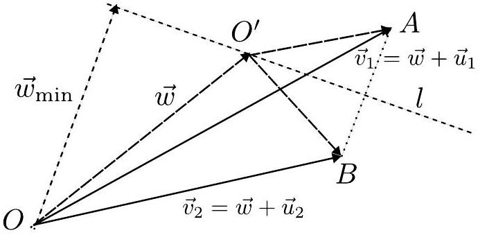

8. Airplanes (7 points) - Solution by Tudor Plopeanu.

i) (1 point) Let $\vec { w }$ be the speed of the wind at the airplanes' altitude, and let $\vec { u } _ { 1 }$ and $\vec { u } _ { 2 }$ be the planes' respective speeds in absence of wind. $\vec { v } _ { 1 } = \vec { w } + \vec { u } _ { 1 } , \vec { v } _ { 2 } = \vec { w } + \vec { u } _ { 2 }$. Let $O ^ { \prime }$ be the point such that $\overrightarrow { O O ^ { \prime } } = \vec { w } , A$ the point such that $\overrightarrow { O A } = \vec { v } _ { 1 }$, and $B$ the point such that $\overrightarrow { O B } = \vec { v } _ { 2 }$. As $\left| \vec { w } - \vec { v } _ { 1 } \right| = \left| \vec { w } - \vec { v } _ { 2 } \right|$, we know that $O ^ { \prime }$ lies on the perpendicular bisector of $( A B )$, which we shall denote as $l$. A quick check also yields that all points on this line are valid selections for $\vec { w } . \left| \vec { u } _ { 1 } \right| = \left| A O ^ { \prime } \right|$. We can find the minimal airspeed as the length of the perpendicular from $A$ to $l$, of length $| A B | / 2$. For a vector result in terms of $\vec { v } _ { 1 }$ and $\vec { v } _ { 2 }$, we have

$$
\begin{aligned}
\left| \vec { u } _ { 1 } \right| _ { \min } & = \left| \vec { v } _ { 1 } - \vec { v } _ { 2 } \right| / 2 \\
& = \frac { 1 } { 2 } \sqrt { v _ { 1 } ^ { 2 } + v _ { 2 } ^ { 2 } - 2 v _ { 1 } v _ { 2 } \cos \alpha } .
\end{aligned}
$$
