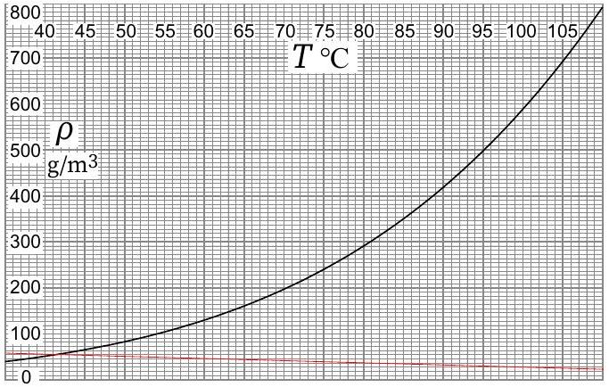

# 2. Evaporation (7 points) — Solution by Jaan Kalda

i) (2 points) Water is in a good approximation incompressible; hence, when the piston starts moving, the growing volume must be filled by gas which can be only the water vapours. Thus, the water starts boiling: these vapours must be in equilibrium with water, hence the vapour pressure must be equal to the pressure inside the piston. We can read from the graph that at $T _ { 0 }$, the vapour density is $\rho = 420 \mathrm {~g} \mathrm {~m} ^ { - 3 }$; this corresponds to the pressure $p _ { 1 } = \rho R T / \mu = 70 \mathrm { kPa }$. With atmospheric pressure $p _ { 0 } = 100 \mathrm { kPa }$, the force

needed to pull the piston is $S \left( p _ { 0 } - p _ { 1 } \right) =$ 300 N .

ii) (2 points)When the piston is pulled by displacement $a$, creating new volume $V _ { \text {new } } =$ $S \times a$, the water partially evaporates to fill this volume with vapour and the remaining liquid water cools from temperature $T _ { 0 }$ to $T _ { 1 }$. The mass of vapour $m _ { v }$ needed to fill the new volume can be calculated using the vapour density $\rho _ { 1 } = 405 \mathrm {~g} \mathrm {~m} ^ { - 3 }$ as $m _ { v } = S a \rho _ { 1 }$. For the heat balance, the energy needed for evaporation must come from the cooling of the remaining liquid water:

$$
\begin{equation*}
m _ { v } L = \left( m - m _ { v } \right) \cdot c \cdot \left( T _ { 0 } - T _ { 1 } \right) ; \tag{1}
\end{equation*}
$$

here we have neglected the dependence of $L$ on temperature, and heat capacity of water vapours, because $\mu L \gg 4 R \left( T _ { 1 } - T _ { 0 } \right)$ (but we have not neglected the work done by piston, because $L$ is actually the enthalpy of evaporation already includes $p \Delta V$ ). Similarly, since $L \gg c \left( T _ { 1 } - T _ { 0 } \right)$, we can neglect $m _ { v }$ in the right-hand-side and express

$$
\begin{equation*}
m = \frac { m _ { v } L } { c \left( T _ { 0 } - T _ { 1 } \right) } = \frac { \rho _ { 1 } S a L } { c \left( T _ { 0 } - T _ { 1 } \right) } = 650 \mathrm {~g} . \tag{2}
\end{equation*}
$$

iii) (3 points) At the thermal equilibrium, there is as much heat flux to the skin as there is heat loss due to evaporation. The former (per area) equals to $\kappa \frac { \mathrm { d } T } { \mathrm {~d} x }$ and the latter (per area) - to $- L J m$ where $m$ is the mass of one molecule, which we find to be $m = \mu / N _ { A }$ to get $J \mu L / N _ { A }$. Note that the minus sign comes from the fact that the particles diffuse from higher density areas to lower density areas. Now from the ideal gas law $n =$ $P / T k _ { B } = P N _ { A } / T R$ to get $J = - D \frac { \mathrm {~d} } { \mathrm {~d} x } \frac { r p } { T k _ { B } } =$ $- D \frac { \mathrm {~d} } { \mathrm {~d} x } \frac { P N _ { A } } { R T }$. Now the pressure of the water vapour is related to $r$ through $P = r p$, where $p$ denotes the saturation pressure of vapour. So,

$$
\kappa \frac { \mathrm { d } T } { \mathrm {~d} x } = - \frac { D L \mu } { R } \frac { \mathrm {~d} } { \mathrm {~d} x } \frac { r p } { T } ,
$$

where $p = p ( T )$ denotes the water vapour saturation pressure at the local air temperature; hence by integrating over $x$ we obtain

$$
\kappa \left( T - T _ { s } \right) = \frac { D L \mu } { R } \left[ \frac { p \left( T _ { s } \right) } { T _ { s } } - \frac { r p ( T ) } { T } \right]
$$

where the index $s$ denotes quantities evaluated at the skin surface. Also, we have used the fact that $r _ { s } = 1$, because at the skin surface, the air is in direct contact with water (due to sweating, skin is wet), so that $p r _ { s } =$ $p \left( T _ { s } \right)$. Substituting $\rho = \frac { p \mu } { R T }$ we obtain

$$
\rho \left( T _ { s } \right) = r \rho ( T ) + \frac { \kappa } { D L } \left( T - T _ { s } \right) .
$$

Here we evaluate from the graph $\operatorname { r } \rho ( T ) =$ $24.3 \mathrm {~g} \mathrm {~m} ^ { - 3 }$ and $\frac { \kappa } { D L } = 0.51 \mathrm {~g} \mathrm {~m} ^ { - 3 } \mathrm {~K} ^ { - 1 }$. Now we can draw this straight line onto the graph provided to find the intersection point at $T _ { s } = 41.5 ^ { \circ } \mathrm { C }$.

If working with $\rho$ earlier on one can show that that the heat flux up magnitude is

Solution 2 by Eppu Leinonen: One can also work directly with $\rho$ through the fact that $n = N / V = M N _ { A } / \mu V = \rho N _ { A } / \mu$. Then the heat flux magnitude will directly become $L J m = L m D \frac { \mathrm {~d} n } { \mathrm {~d} x } = L m D \frac { N _ { A } } { \mu } \frac { \mathrm {~d} \rho } { \mathrm {~d} x } = L D \frac { \mathrm {~d} \rho _ { v } } { \mathrm {~d} x }$, where $\rho _ { v }$ is the density of the water vapour. Then with correct signs we get

$$
\kappa \frac { \mathrm { d } T } { \mathrm {~d} x } = - L D \frac { \mathrm {~d} \rho _ { v } } { \mathrm {~d} x }
$$

from which by integrating and using $\rho _ { v } = r \rho$ we get

$$
\rho \left( T _ { s } \right) = r \rho ( T ) + \frac { \kappa } { D L } \left( T - T _ { s } \right)
$$

and the solution proceeds the same way as in solution 1.
