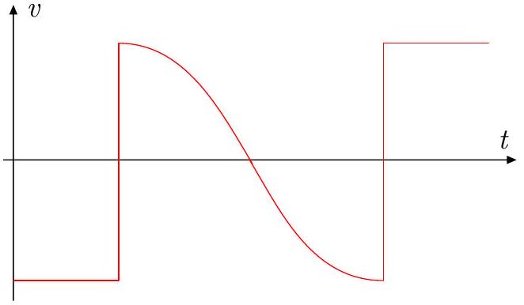
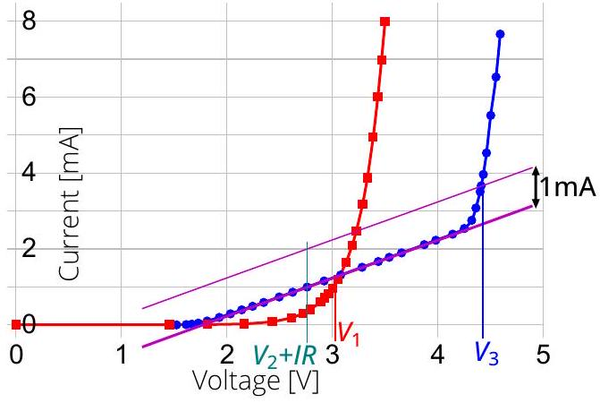
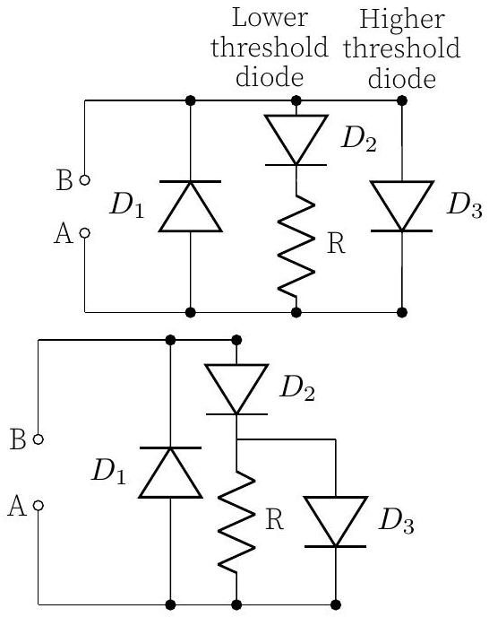
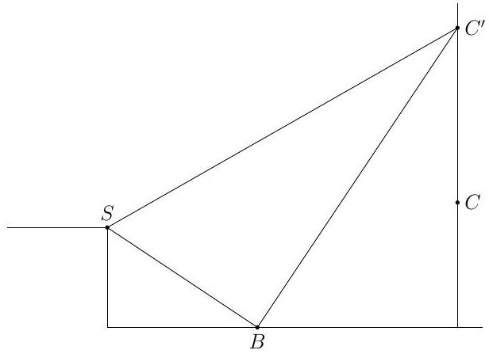
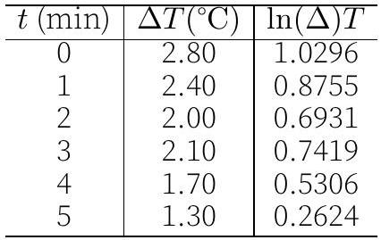
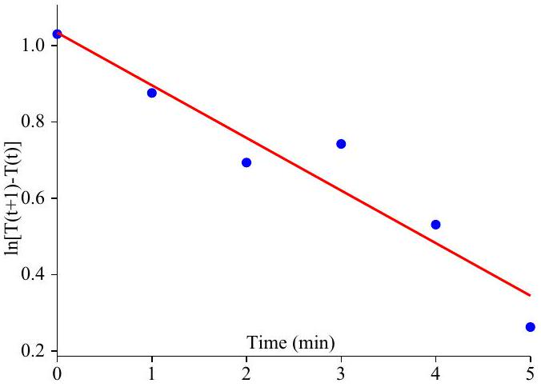
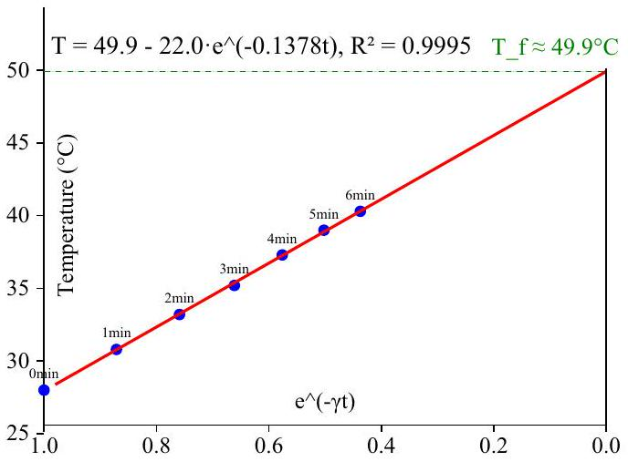
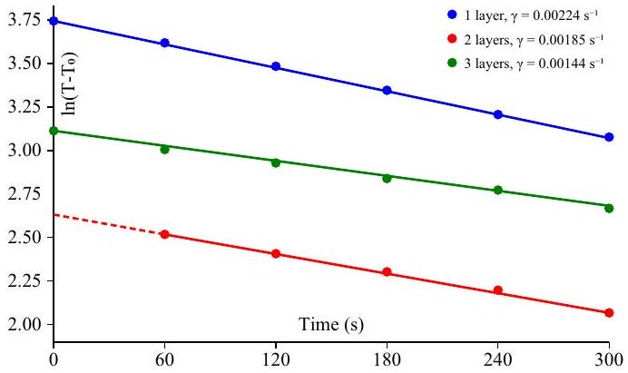

## Nordic-Baltic Physics Olympiad 2025

1. Flying dumbbell (10 points) - Solution by Jaan Kalda, grading schemes by Author 2.
i) (2 points) Free oscillations of the dumbbell take place around the centre of mass, i.e. the centre of the rod. Therefore, we need the stiffness of a half of the rod. This stiffness is expressed as $k = Y \frac { \pi } { 2 } d ^ { 2 } / l$. We also need the mass of the ball $m = \frac { 4 } { 3 } \pi r ^ { 3 } \rho$. The oscillation angular frequency $\omega = \sqrt { k / m }$, hence the period

$$
T = 2 \pi \sqrt { \frac { m } { k } } = 4 \pi \frac { r } { d } \sqrt { \frac { 2 \rho r l } { 3 Y } } \approx 0.64 \mathrm {~ms} .
$$

ii) (2 points) The easiest way to estimate is to notice that a compressed ball is essentially a compression wave in steel, so the period is on the order of a wave with wave length $2 r$. Knowing that the sound speed $c _ { s } = \sqrt { Y / \rho }$, we obtain $\tau \sim 2 r / c _ { s } = 2 r \sqrt { \rho / Y } = 4 \mu \mathrm {~s}$. Alternatively, one can approximate the ball as a spring of stiffness $\kappa \sim Y r$ and mass $\sim m$, and obtain a similar result with $\tau \sim 2 \pi \sqrt { m / \kappa }$.
iii) (2 points) When the dumbbell with axis perpendicular to the wall approaches with velocity $\vec { v } = - v \hat { x }$, the front ball impacts the wall first. Since the impact time $( \tau \approx$ $4 \mu \mathrm {~s} )$ is much shorter than the oscillation period ( $T \approx 0.64 \mathrm {~ms}$ ), the front ball's velocity changes almost instantaneously from $- v$ to $+ v$, while the rear ball continues with velocity $- v$. Since the balls have equal masses, the centre of mass remains stationary. The dumbbell then oscillates about this stationary centre of mass, with the front ball's velocity following a half-period sinusoidal oscillation, changing from $+ v$ to $- v$ over a time interval of $T / 2$. When the velocity reaches $- v$, the front ball impacts the wall again, and its velocity changes instantaneously from $- v$ to +v. After this second impact, both balls move away from the wall, with the same velocity $+ v$, so the dumbbell as a whole departs with velocity $+ v$.

iv) (2 points) During the impact, the front ball velocity becomes opposite, so the centre of mass stops (as the rear ball moves still with its old speed). After the collision, the front ball obtains a component $v \cos \alpha$ along its axis, and $v \sin \alpha$ perpendicular to it. The former initiates oscillations of period $T$, and the latter - a rotation at angular speed

$$
\Omega = v \sin \alpha / ( l / 2 ) = 2 v \sin \alpha / l
$$

The ball will hit the wall twice if the rotation is slow, and only once if the rotation is fast enough; let us study this in more details. By time $t \ll 1 / \Omega$, the rotation angle is $\Omega t$, and the distance of the farthest point of the ball from the rotation centre is $l / 2 - a \sin ( \omega t )$, where the oscillation amplitude can be obtained from the energy conservation law, $a =$ $v \cos \alpha \sqrt { m / k } = v \cos \alpha / \omega$. So, the distance from the wall of the closest point of the ball is

$$
\begin{gathered}
\frac { l } { 2 } \cos \alpha - \left[ \frac { l } { 2 } - a \sin ( \omega t ) \right] \cos ( \alpha + \Omega t ) \approx \\
\approx \frac { l } { 2 } \Omega t \sin \alpha + a \cos \alpha \sin \omega t = \\
= v t \sin ^ { 2 } \alpha + \frac { v } { \omega } \cos ^ { 2 } \alpha \sin \omega t = \\
= \frac { v } { \omega } s \sin ^ { 2 } \alpha + \frac { v } { \omega } \cos ^ { 2 } \alpha \sin s , \quad s \equiv \omega t
\end{gathered}
$$

If this expression becomes negative, there will be a second collision. So, the cross-over value of $\alpha = \alpha _ { 0 }$ is such that the expression becomes never negative, hence

$$
\tan ^ { 2 } \alpha _ { 0 } = - \min \frac { \sin s } { s } \approx 0.217 ,
$$

hence

$$
\alpha _ { 0 } = \arctan \sqrt { 0.217 } \approx 25 ^ { \circ } .
$$

If we divide this expression by corresponding v) (2 points) Using the results of the previous task, the angular speed after the initial collision is $\Omega = 2 v \sin \alpha / l$. The dumbbell rotates around its centre of mass, longitudinal oscillations decay by the time of the second collision. It rotates until the other ball will hit the wall. At the moment of the second collision, the velocity of the ball is $v \sin \alpha$, and its projection to the surface normal of the wall is $- v \sin ^ { 2 } \alpha$. During the second collision, that components reverses sign, and as a result, both balls have now $x$-directional velocity component $v \sin ^ { 2 } \alpha$. Hence, this is also the speed of the centre of mass -- the speed with which the dumbbell departs from the wall.

Grading: (preliminary)

- i)
- explaining that oscillation is symmetric around centre of the rod (invoking Newton's third law suffices as well) 0.5 pts
- expressing stiffness of half-rod
- minor mistake made in stiffness
-0.2 pts
- mass of the ball $m = \frac { 4 } { 3 } \pi r ^ { 3 } \rho$
- Realising that the system can be treated as
0.3 pts
- oscillation period $T = 2 \pi \sqrt { \frac { m } { k } }$
- final answer
- ii)
- Solution 1:
- Realise compressed ball is essentially a compression wave
- Formula for speed of sound
- Relation between time, radius and speed

- Final answer
- Solution 2:
- Realise the ball can be thought of as a
spring
- Estimate spring constant
- Relation between spring constant and time
0.5 pts
- Final answer
- iii)
- 2 hits
- velocity of front ball flips almost instantan-
eously
- centre of mass stays at rest
- sinusoidal movement of front ball
- constant velocity $- v$ of front ball after

- iv)

- Realise it behaves as in previous question (balls at velocity -v and v, CM at rest), but it now also rotates and oscillates around centre of mass

- Expression for the angular speed of rotation
- Expression of the amplitude of oscillations
0.2 pts

- Realise the difference in interaction is that if the first ball bounces once or twice 0.2 pts
- Formula for the distance of the front ball to the wall over time
- Realise that if the distance is over 0 for all $t > 0$ the first ball does not hit the wall twice
- Finding the critical angle given this condition
- v)
- Realise that the dumbbell rotates around its centre of mass (after first collision) 0.2 pts
- Realise that the longitudinal oscillations have decayed by the time of the second collision
- Expression for velocity of ball $v \sin \alpha \mathbf { 0 . 5 }$ pts
- Expression for the component of velocity of ball in direction of surface normal $v \sin ^ { 2 } \alpha$
- Realise the component of velocity of second ball in direction of surface normal is also $v \sin ^ { 2 } \alpha$
- Realise the speed of the centre of mass $v \sin ^ { 2 } \alpha$
0.2 pts
2. Evaporation (7 points) - Solution by Jaan Kalda, grading schemes by Mattias Bjerklöv, Marko Tsengov, Eppu Leinonen.
i) (2 points) Water is in a good approximation incompressible; hence, when the piston starts moving, the growing volume must be filled by gas which can be only the water vapours. Thus, the water starts boiling: these vapours must be in equilibrium with water, hence the vapour pressure must be equal to the pressure inside the piston. We can read from the graph that at $T _ { 0 }$, the vapour density is $\rho = 420 \mathrm {~g} \mathrm {~m} ^ { - 3 }$; this corresponds to the pressure $p _ { 1 } = \rho R T / \mu = 70 \mathrm { kPa }$. With atmospheric pressure $p _ { 0 } = 100 \mathrm { kPa }$, the force

needed to pull the piston is $S \left( p _ { 0 } - p _ { 1 } \right) =$ 300 N .

- Realize that the pressure inside the the cylinder equals the saturated vapour pressure of water at temperature $T _ { 0 }$. 0.8 pts
- Read the density $\rho$ from the graph, in the range [400, 440]gm ${ } ^ { - 3 }$. 0.2 pts
- Use the ideal gas law to find an expression for the pressure $p _ { 1 }$ at temperature $T _ { 0 }$. 0.4 pts
- Correct expression for the force: $S \left( p _ { 0 } - p _ { 1 } \right)$. 0.4 pts - Correct numerical answer. 0.2 pts

ii) (2 points)When the piston is pulled by displacement $a$, creating new volume $V _ { \text {new } } =$ $S \times a$, the water partially evaporates to fill this volume with vapour and the remaining liquid water cools from temperature $T _ { 0 }$ to $T _ { 1 }$. The mass of vapour $m _ { v }$ needed to fill the new volume can be calculated using the vapour density $\rho _ { 1 } = 405 \mathrm {~g} \mathrm {~m} ^ { - 3 }$ as $m _ { v } = S a \rho _ { 1 }$. For the heat balance, the energy needed for evaporation must come from the cooling of the remaining liquid water:

$$
\begin{equation*}
m _ { v } L = \left( m - m _ { v } \right) \cdot c \cdot \left( T _ { 0 } - T _ { 1 } \right) ; \tag{1}
\end{equation*}
$$

here we have neglected the dependence of $L$ on temperature, and heat capacity of water vapours, because $\mu L \gg 4 R \left( T _ { 1 } - T _ { 0 } \right)$ (but we have not neglected the work done by piston, because $L$ is actually the enthalpy of evaporation already includes $p \Delta V$ ). Similarly, since $L \gg c \left( T _ { 1 } - T _ { 0 } \right)$, we can neglect $m _ { v }$ in the right-hand-side and express

$$
\begin{equation*}
m = \frac { m _ { v } L } { c \left( T _ { 0 } - T _ { 1 } \right) } = \frac { \rho _ { 1 } S a L } { c \left( T _ { 0 } - T _ { 1 } \right) } = 650 \mathrm {~g} . \tag{2}
\end{equation*}
$$

- Read the vapour density $\rho _ { 1 }$ from the graph $\left( \rho _ { 1 } \in [ 390,420 ] \mathrm { gm } ^ { - 3 } \right)$. 0.2 pts
- Correct expression for mass of water vapour. 0.3 pts
- Correct expression for the latent heat $\left( m _ { v } L \right)$. 0.3 pts
- Correct expression for heat lost by water $\left( \left( m - m _ { v } \right) \cdot c \cdot \left( T _ { 0 } - T _ { 1 } \right) \right.$.) 0.3 pts
- Expression for energy conservation. 0.4 pts
- Correct expression for mass of water $m$. 0.3 pts
- Correct numerical answer $m \in [ 630,680 ]$ g (with correct dimension). 0.2 pts

iii) (3 points) At the thermal equilibrium, there is as much heat flux to the skin as there is heat loss due to evaporation. The former (per area) equals to $\kappa \frac { \mathrm { d } T } { \mathrm {~d} x }$ and the latter (per area) - to $- L J m$ where $m$ is the mass of one molecule, which we find to be $m = \mu / N _ { A }$ to get $J \mu L / N _ { A }$. Note that the minus sign comes from the fact that the particles diffuse from higher density areas to lower density areas. Now from the ideal gas law $n =$ $P / T k _ { B } = P N _ { A } / T R$ to get $J = - D \frac { \mathrm {~d} } { \mathrm {~d} x } \frac { r p } { T k _ { B } } =$ $- D \frac { \mathrm {~d} } { \mathrm {~d} x } \frac { P N _ { A } } { R T }$. Now the pressure of the water vapour is related to $r$ through $P = r p$, where $p$ denotes the saturation pressure of vapour. So,

$$
\kappa \frac { \mathrm { d } T } { \mathrm {~d} x } = - \frac { D L \mu } { R } \frac { \mathrm {~d} } { \mathrm {~d} x } \frac { r p } { T } ,
$$

where $p = p ( T )$ denotes the water vapour saturation pressure at the local air temperature; hence by integrating over $x$ we obtain

$$
\kappa \left( T - T _ { s } \right) = \frac { D L \mu } { R } \left[ \frac { p \left( T _ { s } \right) } { T _ { s } } - \frac { r p ( T ) } { T } \right]
$$

where the index $s$ denotes quantities evaluated at the skin surface. Also, we have used the fact that $r _ { s } = 1$, because at the skin surface, the air is in direct contact with water (due to sweating, skin is wet), so that $p r _ { s } =$ $p \left( T _ { s } \right)$. Substituting $\rho = \frac { p \mu } { R T }$ we obtain

$$
\rho \left( T _ { s } \right) = r \rho ( T ) + \frac { \kappa } { D L } \left( T - T _ { s } \right) .
$$

Here we evaluate from the graph $\operatorname { r } \rho ( T ) =$ $24.3 \mathrm {~g} \mathrm {~m} ^ { - 3 }$ and $\frac { \kappa } { D L } = 0.51 \mathrm {~g} \mathrm {~m} ^ { - 3 } \mathrm {~K} ^ { - 1 }$. Now we can draw this straight line onto the graph provided to find the intersection point at $T _ { s } = 41.5 ^ { \circ } \mathrm { C }$.

Grading: (preliminary)
$N B !$ the $\rho = p \mu / R T$ substitution can be done earlier so the schemes below represent only the relevant observations which can be done with $\rho$ already. Also equivalent forms will give points (i.e. if using $k$ and $N _ { a }$ instead of $R$ in the middle steps)

- heat going away from skin (up) = heat going to skin (down) at the equilibrium 0.4 pts
- Heat flux down $\kappa \frac { \mathrm { d } T } { \mathrm {~d} x }$

- Heat flux up magnitude $\frac { D L \mu } { R } \frac { \mathrm {~d} } { \mathrm {~d} x } \frac { P } { T }$ (partial points available for the equivalents to the steps below) 0.5 pts
- Magnitude of heat flux up is $L J m \mathbf { 0 . 3 p t s }$
- $m = \mu / N _ { A }$
- $n = P / T k _ { B }$

0.1 pts

- Deducing that the direction of the heat flow is opposite to $\frac { \mathrm { d } n } { \mathrm {~d} x }$ (explicitly mentioned or with the existence of the minus sign in the equations) 0.1 pts

- $P = r p$ 0.1 pts

- $\kappa \left( T - T _ { s } \right) = \frac { D L \mu } { R } \left[ \frac { p \left( T _ { s } \right) } { T _ { s } } - \frac { r p ( T ) } { T } \right]$ (i.e. integrating correctly) 0.4 pts
- Or doing a change from $\mathrm { d } \rightarrow \Delta$ in the derivatives has to be motivated properly (i.e. for heat conductivity no need for any explicit explanation but for Fick's law one must state that $J$ is constant (due to the amount of particles is conserved)).
- $\rho = p \mu / R T$ 0.1 pts
- Reading $\rho$ correctly ( $\rho _ { 1 } \in [ 800,815 ] \mathrm { gm } ^ { - 3 }$ )) 0.2p pts
- Graphical method 0.8 pts
- Noticing that $\rho \left( T _ { s } \right) = r \rho ( T ) + \frac { \kappa } { D L } \left( T - T _ { s } \right)$ defines a straight line in $( T , \rho ) \quad \mathbf { 0 . 8 }$ pts
- Any other valid numerical method that is explained is accepted
- Correct final result $T \in [ 36,47 ] ^ { \circ } \mathrm { C } \quad \mathbf { 0 . 2 }$ pts

If working with $\rho$ earlier on one can show that that the heat flux up magnitude is

Solution 2 by Eppu Leinonen: One can also work directly with $\rho$ through the fact that $n = N / V = M N _ { A } / \mu V = \rho N _ { A } / \mu$. Then the heat flux magnitude will directly become $L J m = L m D \frac { \mathrm {~d} n } { \mathrm {~d} x } = L m D \frac { N _ { A } } { \mu } \frac { \mathrm {~d} \rho } { \mathrm {~d} x } = L D \frac { \mathrm {~d} \rho _ { v } } { \mathrm {~d} x }$, where $\rho _ { v }$ is the density of the water vapour. Then with correct signs we get

$$
\kappa \frac { \mathrm { d } T } { \mathrm {~d} x } = - L D \frac { \mathrm {~d} \rho _ { v } } { \mathrm {~d} x }
$$

from which by integrating and using $\rho _ { v } = r \rho$ we get

$$
\rho \left( T _ { s } \right) = r \rho ( T ) + \frac { \kappa } { D L } \left( T - T _ { s } \right)
$$

and the solution proceeds the same way as in solution 1.

The following grading scheme is given to provide exact correspondences to the scheme of solution 1. Grading:

- heat going away from skin (up) = heat going to skin (down) at the equilibrium 0.4 pts
- Heat flux down $\kappa \frac { \mathrm { d } T } { \mathrm {~d} x }$

- Heat flux up magnitude $L D \frac { \mathrm {~d} \rho _ { v } } { \mathrm {~d} x }$ (partial points available for the equivalents to the steps below) steps below) - Working with $\rho$ directly - Magnitude of heat flux up is $L J m 0.3$ pts - $n = \rho N _ { A } / \mu$ - $\mu = m N _ { A }$ 0.1 pts
- Deducing that the direction of the heat flow is opposite to $\frac { \mathrm { d } n } { \mathrm {~d} x }$ (explicitly mentioned or with the existence of the minus sign in the equations) - $\rho _ { v } = r \rho _ { v }$ 0.1 pts
- $\kappa \left( T - T _ { s } \right) = L D \left( \rho \left( T _ { s } \right) - r \rho ( T ) \right)$ (i.e. integrating correctly) - Or doing a change from $\mathrm { d } \rightarrow \Delta$ in the derivatives has to be motivated properly (i.e. for heat conductivity no need for any explicit explanation but for Fick's law one must state that $J$ is constant (due to the amount of particles is conserved)).
- Reading $\rho$ correctly ( $\rho _ { 1 } \in [ 800,815 ] \mathrm { gm } ^ { - 3 }$ )) 0.2p pts
- Graphical method - Noticing that $\rho \left( T _ { s } \right) = r \rho ( T ) + \frac { \kappa } { D L } \left( T - T _ { s } \right)$ defines a straight line in $( T , \rho ) \quad \mathbf { 0 . 8 ~ p t s }$
- Any other valid numerical method that is explained is accepted

- Correct final result $T \in [ 36,47 ] ^ { \circ } \mathrm { C } \quad \mathbf { 0 . 2 }$ pts

3. Nuclear Reactors (6 points) - Solution and grading scheme by Topi Lind, Melvin Storbacka, Oleg Kosik, Aleksandr Sorokin and Ludmila Belogrudova.
i) (1 point)If the speed of the particle is much less than the speed of light, we can use nonrelativistic approach. For non-relativistic particles we know $v = \sqrt { 2 E _ { k } / m }$. Substituting values gives us $v _ { f } = 2.2 \times 10 ^ { 3 } \mathrm {~m} \mathrm {~s} ^ { - 1 }$. This

is much less than the speed of light and thus justified. Another way to justify the applicability of the non-relativistic approach would be to say that kinetic energy is significantly less than the rest energy $\left( E _ { f } \ll m _ { \mathrm { n } } c ^ { 2 } \right)$.

Typo in problem description. $E _ { f } = 0.025 \mathrm { eV }$ is the mode of the Maxwell-Boltzmann distribution which gives $E = k _ { b } T$. Average gives $E = ( 3 / 2 ) k _ { b } T$.
Using the mode of the Maxwell-Boltzmann distribution, $E = k _ { \mathrm { B } } T$, and remembering to convert from eV to J correctly, we find

$$
T _ { f } = \frac { 0.025 \cdot 1.602 \times 10 ^ { - 19 } } { 1.38 \times 10 ^ { - 23 } } = 290 \mathrm {~K} .
$$

With $E = ( 3 / 2 ) k _ { \mathrm { B } } T$ we find $T _ { f } \approx 193 \mathrm {~K}$.
ii) (1 point) The non-relativistic approach justified as in previous task. Same approach gives us $v _ { 0 } = 2.0 \times 10 ^ { 7 } \mathrm {~m} \mathrm {~s} ^ { - 1 }$.

Grading i)+ii): (preliminary)

- Expresses $v _ { f } = \sqrt { 2 E _ { f } / m }$ and/or $v _ { 0 } =$ $\sqrt { 2 E _ { 0 } / m }$ 0.3 pts
- Calculates $v _ { f } = 2.2 \times 10 ^ { 3 } \mathrm {~m} \mathrm {~s} ^ { - 1 }$ and/or $v _ { 0 } = 2.0 \times 10 ^ { 7 } \mathrm {~m} \mathrm {~s} ^ { - 1 }$ for two correct numerical values; $\mathbf { 0 . 5 }$ pts; if only one value is correct 0.3 pts.
- Uses $E _ { f } = \frac { 3 } { 2 } k _ { B } T$ 0.3 pts
- Using this formula calculates $T = 193 \mathrm {~K}$ 0.3 pts
- Justifies the validity of the classical approach in both cases $\mathbf { 0 . 3 + 0 . 3 \mathbf { p t s } }$ Remark. Using $E _ { f } = k _ { B } T$ without justification and finding $T = 290 \mathrm {~K}$ gives $\mathbf { 0 p t s }$ for the formula and 0.3 pts for the numerical calculation.

iii) (2.5 points) In a collision between particle 1 ( $m _ { 1 } , v _ { 1 , i }$ and $v _ { 1 , f }$ ) and particle 2 ( $m _ { 2 } , v _ { 2 , i }$ and $v _ { 2 , f }$ ) momentum is conserved,

$$
m _ { 1 } \left( v _ { 1 , f } - v _ { 1 , i } \right) = m _ { 2 } \left( v _ { 2 , i } - v _ { 2 , f } \right)
$$

and since the collisions are elastic, kinetic energy is also conserved:

$$
m _ { 1 } \left( v _ { 1 , f } ^ { 2 } - v _ { 1 , i } ^ { 2 } \right) = m _ { 2 } \left( v _ { 2 , i } ^ { 2 } - v _ { 2 , f } ^ { 2 } \right) .
$$

Dividing the latter by the former leads to

$$
v _ { 1 , i } + v _ { 1 , f } = v _ { 2 , i } + v _ { 2 , f } .
$$

Substituting this to the conservation of momentum gives for particle 1:

$$
v _ { 1 , f } = \frac { m _ { 1 } - m _ { 2 } } { m _ { 1 } + m _ { 2 } } v _ { 1 , i } + \frac { 2 m _ { 2 } } { m _ { 1 } + m _ { 2 } } v _ { 2 , i } ,
$$

and similarly for particle 2:

$$
v _ { 2 , f } = \frac { 2 m _ { 1 } } { m _ { 1 } + m _ { 2 } } v _ { 1 , i } + \frac { m _ { 1 } - m _ { 2 } } { m _ { 1 } + m _ { 2 } } v _ { 2 , i } .
$$

We see that with $m _ { 1 } = m _ { 2 }$ there is a maximum transfer of momentum. Assuming that particle 1 is the neutron and particle 2 is the target, and that the target is at rest for all intents and purposes, the mass of the moderators atoms should be the same as the neutrons.

In a single collision with a stationary atom of the moderator, the speed of the neutron decreases by the factor of $\frac { m _ { 1 } - m _ { 2 } } { m _ { 1 } + m _ { 2 } }$, so the speed of the neutron after $N$ head-on collisions with stationary atoms of moderator will be

$$
v _ { N } = v \left( \frac { m _ { 1 } - m _ { 2 } } { m _ { 1 } + m _ { 2 } } \right) ^ { N } .
$$

Hence,

$$
\begin{aligned}
N & = \frac { \ln \left( v _ { f } / v _ { 0 } \right) } { \ln \left[ \left( m _ { 1 } - m _ { 2 } \right) / \left( m _ { 1 } + m _ { 2 } \right) \right] } \\
& = \frac { 1 } { 2 } \frac { \ln \left( E _ { f } / E _ { 0 } \right) } { \ln \left[ \left( m _ { 1 } - m _ { 2 } \right) / \left( m _ { 1 } + m _ { 2 } \right) \right] } = 614 .
\end{aligned}
$$

Grading: (preliminary)

- $T \ll T _ { f }$, so moderator atoms are essentially at rest 0.3 pts
- Justifies that maximum momentum transfer is when $m _ { \mathrm { n } } = M$ 0.4 pts
- Applies energy and momentum conservation 0.3 pts +

0.3 pts

- Expresses $u = v \frac { m _ { 1 } - m _ { 2 } } { m _ { 1 } + m _ { 2 } }$ 0.4 pts
- Expresses $v _ { f } = v _ { 0 } \left( \frac { m _ { 1 } - m _ { 2 } } { m _ { 1 } + m _ { 2 } } \right) ^ { N }$ 0.5 pts
- Calculates $N = 614$ 0.3 pts

iv) (1.5 points) We can model the gas inside the rod as an ideal gas. Simply due to swelling the pressure inside the rod would increase from 2.5 MPa to 5 MPa as we know from Boyle's law $P _ { 1 } V _ { 1 } = P _ { 2 } V _ { 2 } \rightsquigarrow P _ { 2 } =$ $P _ { 1 } V _ { 1 } / V _ { 2 }$. Thus, the release of xenon must contribute 1.5 MPa's worth of pressure due to Dalton's law $p _ { \text {tot } } = p _ { \mathrm { He } } + p _ { \mathrm { Xe } }$. From ideal gas law we find the amount of xenon moles as law we find the amount of xenon moles as

$$
n _ { \mathrm { Xe } } = p _ { \mathrm { Xe } } V / R T _ { 0 } = 5.5 \times 10 ^ { - 3 } \mathrm {~mol} ,
$$

where $p _ { \mathrm { Xe } } = 1.5 \mathrm { MPa } , V _ { 2 } = 9 \mathrm {~cm} ^ { 3 }$ and $T =$ 293 K. In a similar manner we find that the amount of helium in the beginning was

$$
n _ { \mathrm { He } } = p _ { \mathrm { He } } V _ { 0 } / R T _ { 0 } = 1.8 \times 10 ^ { - 2 } \mathrm {~mol} ,
$$

where $P _ { \mathrm { He } } = 2.5 \mathrm { MPa } , V _ { 0 } = 18 \mathrm {~cm} ^ { 3 }$ and $T _ { 0 } = 293 \mathrm {~K}$. The ratio of the two is

$$
\frac { n _ { \mathrm { He } } } { n _ { \mathrm { Xe } } } \approx 3.3 .
$$

Grading: (preliminary)

- Applies Boyle's law
- Applies Dalton's law
- Expresses $n _ { \mathrm { Xe } } = p _ { \mathrm { Xe } } V / R T _ { 0 }$
- Calculates $n _ { \mathrm { Xe } } = 5.5 \times 10 ^ { - 3 } \mathrm {~mol}$
- Expresses $n _ { \mathrm { He } } = p _ { \mathrm { He } } V _ { 0 } / R T _ { 0 }$
- Calculates $\frac { n _ { \mathrm { He } } } { n _ { \mathrm { Xe } } } = 3.3$
4. BLACK BOX (12 points) - Eero Uustalu. First we need to assemble a simple circuit allowing us to measure the $V - I$ curve of the black box: voltmeter in parallel to the box, and ammeter in series. The measurement results are shown in the table below, both for forward current (blue) and for reverse current (red) (the headers of the reverse current data has minus sign).

Voltage and Current Measurements

| V (V) | I (mA) | -V (V) | -I (mA) |
| :--- | :--- | :--- | :--- |
| 4.59 | 7.66 | 3.491 | 7.98 |
| 4.55 | 6.53 | 3.458 | 6.98 |
| 4.50 | 5.52 | 3.423 | 6.00 |
| 4.46 | 4.53 | 3.379 | 4.94 |
| 4.43 | 3.964 | 3.324 | 3.868 |
| 4.41 | 3.665 | 3.279 | 3.178 |
| 4.40 | 3.51 | 3.219 | 2.468 |
| 4.36 | 3.08 | 3.180 | 2.088 |
| 4.32 | 2.756 | 3.121 | 1.637 |
| 4.25 | 2.54 | 3.044 | 1.186 |
| 4.14 | 2.391 | 2.993 | 0.958 |
| 3.98 | 2.23 | 2.956 | 0.817 |
| 3.871 | 2.115 | 2.922 | 0.711 |
| 3.656 | 1.897 | 2.880 | 0.595 |
| 3.539 | 1.781 | 2.784 | 0.403 |
| 3.436 | 1.67 | 2.713 | 0.2931 |
| 3.282 | 1.519 | 2.607 | 0.1847 |
| 3.079 | 1.314 | 2.423 | 0.0801 |
| 2.923 | 1.159 | 2.156 | 0.0219 |
| 2.762 | 0.998 | 1.807 | 0.0037 |
| 2.625 | 0.862 | 1.451 | 0.0006 |
| 2.498 | 0.736 | 0 | 0 |
| 2.351 | 0.593 |  |  |
| 2.246 | 0.491 |  |  |
| 2.143 | 0.398 |  |  |
| 2.036 | 0.2932 |  |  |
| 1.931 | 0.1989 |  |  |
| 1.815 | 0.1037 |  |  |
| 1.732 | 0.0486 |  |  |
| 1.670 | 0.021 |  |  |
| 1.617 | 0.0087 |  |  |
| 1.526 | 0.0016 |  |  |
| 1.467 | 0.0005 |  |  |

These data will be used for all the tasks.
i) (4 points)

Based on these data, we can determine that there is a single diode allowing negative currents to flow, with no other components in that branch, as the $V - I$ curve shows the classical exponential dependence characteristic of a diode.

The situation is more complex for positive currents: there must be two parallel branches allowing current to flow. One branch must contain a diode with a lower threshold voltage in series with a resistor, which explains why the initial exponential curve transitions into a linear relationship characteristic of resistive behaviour. The second branch must contain a diode with a higher threshold voltage (approximately

4.3 V) that only conducts when this voltage is exceeded.

This second branch could be either in parallel with just a resistor, or in parallel with the series combination of the resistor and first diode. These two configurations cannot be distinguished based solely on the $V - I$ curves, and both will be considered correct interpretations of the data. The two possible circuits are shown below.

Note that faulty measurements give no points in regard to data sufficiency (for example if the voltage was read from the power source without any corrections made) Each plot (forward and reverse current) gives 1.2 points:
Grading: (preliminary)

- Drawing and labeling a graph's axes 0.2 pts
- Collecting sufficient data for the graph that shows both linear and non-linear characteristics of the circuit 0.5 pts
- Plotting the data to the graph

In total, the forward and reverse direction plots give 2.4 points. Drawing the circuit used in each the measurement gives 0.3 p each for a total of 0.6p.

For drawing a possible circuit diagram (Refer to diagrams for option 1 and 2):
Grading: (preliminary)

- Placing the reverse diode $D _ { 1 }$ correctly 0.3 pts
- Placing the forward diodes $D _ { 2 } , D _ { 3 }$ and the

ii) (2 points) The resistor's resistance is the inverse of the slope in the linear section of the curve. To ensure accuracy, the most linear segment should be selected for this calculation. The fit line is shown in purple in the figure above, yielding a resistance of $R =$ $1008 \Omega$.

Grading: (preliminary)

- Method for getting $R _ { 1 }$

- Reaching a close enough ( ±10\%) value for the resistance 1 pts

iii) (6 points) The accepted uncertainty of all subsequent results is ±10 \% of the values presented here. The opening voltage $V _ { 1 }$ of diode $D _ { 1 }$ can be found at the point where the red curve intersects the 1 mA value. For greater precision, additional measurements could be performed by gradually adjusting the voltage until exactly 1 mA current is reached. Based on our current measurements, the result is 3.004 V.

The value of $V _ { 2 }$ can be found at the point where the blue curve reaches 1 mA , from which we must subtract the resistor's voltage drop $I R$. This calculation gives $V _ { 2 } = 1.757 \mathrm {~V}$.

To determine the opening voltage of diode $D _ { 3 }$, we must first subtract the current through the resistor. This can be accomplished graphically by drawing a line parallel to the linear segment's fit line, at a 1 mA distance, as illustrated in the figure. For option 1, this procedure directly yields $V _ { 3 } = 4.47 \mathrm {~V}$. For option 2 (the actual configuration inside the box), we need to subtract voltage $V _ { 2 }$. Consequently, $V _ { 3 } = 2.71 \mathrm {~V}$ for option 2.

Grading: (preliminary)

- Reaching a close enough value for the opening voltage $V _ { 1 }$ 1 pts

Getting value for $V _ { 2 }$ :

- Reading the value of $V _ { 2 } + I R$ at 1 mA 0.5 pts
- Subtracting $I R$ based on the inverse of the slope at the linear section 0.5 pts
- Getting the value to within 10 \% 1 pts

Calculating the value for $V _ { 3 }$ depends on the schematic that was used. This schema is written for option 2. Valid solution for option 1 still gives the same max points.

- Reading the total voltage where 1 mA is going through $D _ { 3 }$ 0.5 pts
- Subtracting $V _ { 2 }$ from the total 1.5 pts
- Reaching a close enough ( ±10\%) value for $V _ { 3 } = 2.71 \mathrm {~V}$ 1 pts

5. Throwing (6 points) - Solution by Eppu Leinonen and Jaan Kalda.
i) (2 points) In the drone's reference frame, the effective gravitational field is $( g , g )$, which has a magnitude of $g \sqrt { 2 }$ pointing at a 45° angle. The initial kinetic energy of the ballis $\frac { 1 } { 2 } m v _ { 0 } ^ { 2 }$, and the final energy: potential energy change is $m ( g \sqrt { 2 } ) \cdot ( h \sqrt { 2 } )$, where $h \sqrt { 2 }$ is the displacement along the direction of the effective field From the energy conservation law we obtain $\frac { 1 } { 2 } m v _ { 0 } ^ { 2 } = m ( g \sqrt { 2 } ) \cdot ( h \sqrt { 2 } )$, hence $v _ { 0 } = 2 \sqrt { g h }$.

Grading: (preliminary)

- Idea of switching to the coaccelerating frame 1 pts
- Ball gains horizontal acceleration $g \mathbf { 0 . 3 }$ pts
- Effective gravitational field $g \sqrt { 2 }$ point from drone to throwing point 0.2 pts
- Energy conservation or the respective kinematical equation 0.3 pts
- Correct answer 0.2 pts

Solution 2 by Anne-Sofie Mårtensson and Adam Warnerbring: In time $t$ the drone travels a distance $s = \frac { 1 } { 2 } g t ^ { 2 }$. For a collision to occur at time $t$ the ball must travel a distance $h$ up giving us an equation $h = v t \sin \alpha - \frac { 1 } { 2 } g t ^ { 2 }$ and a distance $h + s$ horizontally giving us an equation $h + s = v t \cos \alpha$. From these equations we get $v t \sin \alpha = v t \cos \alpha$, which means that $\alpha = 45 ^ { \circ }$. This means that the initial $x$ and $y$-components of the velocity must be the same. Thus the initial speed minimised when the highest point of the trajectory is minimal which happens when it is a height $h$ away from the throwing point. From energy conservation we get $\frac { 1 } { 2 } \left( \frac { v _ { 0 } } { \sqrt { 2 } } \right) ^ { 2 } = g h$ to get $v _ { 0 } = 2 \sqrt { g h }$

- Correct kinematic equations for each)
- Getting the condition $\sin \alpha = \cos \alpha$
- $\alpha = 45 ^ { \circ }$
0.1 pts
- $v _ { x , 0 } = v _ { y , 0 }$ implies that the highest point of the trajectory has to be as low as possible 0.5 pts
- Energy conservation or the respective kinematical equation 0.3 pts
- Correct answer

velocity from $\alpha = 45 ^ { \circ }$ as follows. If we go back to our kinematical equations, we get that the condition for the drone and the ball to meet at the same $x$-coordinate is $v t \sin \alpha$ - $\frac { 1 } { 2 } g t ^ { 2 } = \frac { v t } { \sqrt { 2 } } - \frac { 1 } { 2 } g t ^ { 2 } = h + s = h + \frac { 1 } { 2 } g t ^ { 2 }$. But also for the $y$ coordinate we have $h = v t \sin \alpha -$ $\frac { 1 } { 2 } g t ^ { 2 } = \frac { v t } { \sqrt { 2 } } - \frac { 1 } { 2 } g t ^ { 2 }$. I.e. both equations become $\frac { 1 } { 2 } g t ^ { 2 } - \frac { v t } { \sqrt { 2 } } + h = 0$, so we only need to find out what is the minimal velocity that this equation has a solution. Since the equation is a quadratic, it has a solution when its discriminant $\Delta$ is non-negative. Now $\Delta =$ $v ^ { 2 } / 2 - 2 g h$, which is an increasing function of $v$. Thus the minimal speed with which the collision is possible is when the discriminant is zero. Thus we get $v = 2 \sqrt { g h }$.

Some students interpreted the task such that the drone has an acceleration $( g , -$ $g$ ). This interpretation makes the problem more difficult and will be accepted. The following solution shows how this version of the problem can be solved Solution for the alternative interpretation by Eppu Leinonen: If we move to the coaccelerating frame of the drone, the ball will have a net acceleration $( - g , 0 )$, and the drone will stay in place. This invites us to rotate the coordinate axes that the acceleration of the ball is $( 0 , - g )$ and if we set the origin at the throwing point, the drone will be at $( - h , h )$. Now all the points reachable by the ball with an initial speed $v$ are given by the so called envelope curve which is known to have the equation $y \leq$ $v _ { 0 } ^ { 2 } / 2 g - g x ^ { 2 } / 2 v _ { 0 } ^ { 2 }$. With the minimal possible speed the drone will be on the envelope curve as otherwise the point is not reachable or the speed can be made smaller. So we need to find $v _ { 0 }$ such that the equation $h = v _ { 0 } ^ { 2 } / 2 g - g h ^ { 2 } / 2 v _ { 0 } ^ { 2 }$ has a solution. Rearranging gives $v _ { 0 } ^ { 4 } - 2 g h v _ { 0 } ^ { 2 } - g ^ { 2 } h ^ { 2 } = 0$ which is a quadratic in $v _ { 0 } ^ { 2 }$ (biquadratic in $v _ { 0 }$ ) which has the solutions $v _ { 0 } ^ { 2 } = \frac { 2 g h \pm \sqrt { 4 g ^ { 2 } h ^ { 2 } + 4 g ^ { 2 } h ^ { 2 } } } { 2 } = g h \pm$ $g h \sqrt { 2 }$ which is only positive if ± is + so $v _ { 0 } ^ { 2 } =$ $( 1 + \sqrt { 2 } ) g h$ and as such $v _ { 0 } = \sqrt { ( 1 + \sqrt { 2 } ) g h }$.

Grading:

- Idea of switching to the coaccelerating frame 1 pts
- Ball gains vertical and horizontal acceleration $g$ 0.3 pts
- Effective gravitational field $( 0 , - g )$ (in the rotated coordinate frame, but this rotation is not necessary) 0.2 pts
- Drone must be on the envelope curve 0.2 pts
- Correct form for the envelope curve 0.1 pts - Correct answer 0.2 pts

For other solutions, at most 0.6 points for kinematical equations that describe the conditions necessary for the ball and drone to collide - the rest of the analysis must be fully correct to get the rest of the points.

NB! If a student has interpreted that the drones acceleration is along the $y$-axis or that antiparallel to the $y$-axis means to the positive $y$-axis, it is automatically 0 points.
ii) (4 points)

Solution 1. Let us use the free-falling frame of reference wherein the ball and the stone move along straight lines. That frame fell together with points $S$ and $B$ during the flight time of duration $t$ by $h = \frac { 1 } { 2 } g t ^ { 2 }$, so in that frame the position of the collision point $C ^ { \prime }$ is obtained by shifting $C$ relative to $S$ and $B$ by distance $h$ upwards. In that frame, $\left| S C ^ { \prime } \right| =$ $v t$ and $\left| B C ^ { \prime } \right| = u t$, hence $\left| S C ^ { \prime } \right| / \left| B C ^ { \prime } \right| = v / u$. We have $v$ fixed and want to have as small as possible $u$, so $\left| S C ^ { \prime } \right| / \left| B C ^ { \prime } \right|$ needs to be maximal. From the sine theorem, $\left| S C ^ { \prime } \right| / \left| B C ^ { \prime } \right| =$ $\sin \angle S B C ^ { \prime } / \sin \angle C ^ { \prime } S B$. As $\angle C ^ { \prime } S B$ is defined by the stone-throwing angle and is therefore fixed, the boy needs to maximize $\sin \angle C ^ { \prime } B S$. Obviously, the maximum of 1 is reached for $\angle C ^ { \prime } B S = 90 ^ { \circ }$. Therefore, we need to draw a perpendicular to $S B$ at $B$, and find $C ^ { \prime }$ as its intersection point with the vertical line drawn through $C$. Then $\left| C C ^ { \prime } \right| = \frac { 1 } { 2 } g t ^ { 2 }$ from where we obtain $t = \sqrt { 2 \left| C C ^ { \prime } \right| / g } , v =$ $\sqrt { g } \left| S C ^ { \prime } \right| / \sqrt { 2 \left| C C ^ { \prime } \right| } \approx 12.3 \mathrm {~m} \mathrm {~s} ^ { - 1 }$ and $u =$ $\sqrt { g } \left| B C ^ { \prime } \right| / \sqrt { 2 \left| C C ^ { \prime } \right| } \approx 10.9 \mathrm {~m} \mathrm {~s} ^ { - 1 }$

Grading: (preliminary)

- The idea of switching to the free-falling frame 0.5 pts
- Stating (explicitly or implicitly) that the stone and the ball travel in straight lines 0.5 pts
- $S C ^ { \prime } = v t$ and $B C ^ { \prime } = u t \quad \mathbf { 0 . 2 ~ p t s }$ (0.1 for each)
- Noticing that we need to minimise $\left| S C ^ { \prime } \right| / \left| B C ^ { \prime } \right|$ (or maximise the reciprocal) 0.3 pts
- Sine theorem (to minimise) 0.5 pts 0.5 pts
- In the free falling frame $C ^ { \prime }$ is shifted upwards with respect to $S , B , C$ 0.5 pts
$\cdot \left| C C ^ { \prime } \right| = \frac { 1 } { 2 } g t ^ { 2 }$

0.1 pts

- Well drawn geometrical construction (that is correct) 0.5 pts
- $v = \sqrt { g } \left| S C ^ { \prime } \right| / \sqrt { 2 \left| C C ^ { \prime } \right| }$ and $u =$ $\sqrt { g } \left| B C ^ { \prime } \right| / \sqrt { 2 \left| C C ^ { \prime } \right| }$ 0.2 pts (0.1 for each)
- $v \in [ 11.8,12.7 ] \mathrm { m } \mathrm { s } ^ { - 1 } , u \in [ 10.5,11.4 ] \mathrm { m } \mathrm { s } ^ { - 1 }$ 0.2 pts ( 0.1 for each, only if correct method)

Note. Well drawn means that straight lines are straight lines and the 90 degree angles look like 90 degree angles. The points will only be given if the construction is relevant for a correct solution to the problem.

Solution 2. A purely geometric proof for $C ^ { \prime } B \perp B S A$ to minimise $B C ^ { \prime } / S C ^ { \prime }$ goes as follows (the rest of the solution is the same). After going to the free fall frame, go to the frame moving with velocity $\vec { v }$. For the ball to hit the ball its velocity in this frame $\vec { u } ^ { \prime }$ must point at the stone. I.e. we get that $\vec { u } ^ { \prime } = k \overrightarrow { B S }$, where $k > 0$. On the other hand $\vec { u } ^ { \prime } = \vec { u } - \vec { v }$. But now this means that $\vec { v } - \vec { u }$ must end up on the line $S B$. The possible ending points of

$\vec { v } - \vec { u }$ are achieved by drawing a circle of ra- second contribution comes from the buoydius $u$ around the ending point of $\vec { v }$. With the ancy force that can be split into two compon- minimal $| \vec { u } |$ to achieve the condition of the ents: the upward buoyancy force as if the en- relative velocity ending up on $S B$ the circle tire beam were submerged (acts at the centre will be tangent to $S B$ which means that $\vec { u } \perp$ of mass, creating zero torque), and the down- $\overrightarrow { B S }$. ward "missing" buoyancy force of the trian-

This will replace minimising the ratio and gular section above water (creates a torque). This missing buoyancy force $F$ is what be- using the sine law to give in total 0.8p for comes a real buoyancy force once additional method and 0.5 for the correct angle. birds land and press the beam fully under-

## Grading:

 water; if the length of the beam is $L$ then- Noticing that $\vec { v } - \vec { u }$ is on $S B$

0.3 pts

- A valid argument that $u$ is minimal when $\vec { u } \perp \overrightarrow { S B }$ 0.5 pts

Solution 3. An analytic proof for $C ^ { \prime } B \perp$ $B S$ to minimise $B C ^ { \prime } / S C ^ { \prime }$ goes as follows (the rest of the solution is the same). Without the loss of generality we can put the point $S$ at $( 0,0 )$ and the point $B$ at some $( q , 0 )$ (i.e. we rotate and move our coordinate system to achieve this). The $S C ^ { \prime }$ line is given by $y = k x$ for some $k$ and thus a general form for the point $C ^ { \prime }$ is $( x , k x )$. Thus the ratio of the lengths becomes

$$
R = \frac { \sqrt { ( x - q ) ^ { 2 } + k ^ { 2 } x ^ { 2 } } } { \sqrt { \left( k ^ { 2 } + 1 \right) x ^ { 2 } } } .
$$

Differentiating this (preferrably logarithimically) and finding the 0 of the the derivative gives

$$
x = q
$$

i.e. $C ^ { \prime } = ( q , k q )$ and as such $C ^ { \prime } B \perp B S$.
The following points replace the "Sine theorem (to minimise)" part from Solution 1

Grading: (preliminary)

- Correct $R$ function to maximise/minimise 0.2 pts
- Derivative $= 0$

0.1 pts

- Performing the rest of the calculation fully correct 0.2 pts
6. Birds (4 points) - Solution by Jaan Kalda. Let us consider the torque balance with respect to the beam's centre of mass. Note that as the beam is long and thin and the other end of the beam doesn't rise above the water, the beam will stay approximately horizontal, which we will use to calculate the moment arms. First, the beam's weight acts at its centre of mass, creating zero torque. The the arm of this force is the distance from the centre of mass of the beam to the centre of mass of the triangle which is at the intersection point of medians, which are a distance $\frac { 2 } { 3 } L$ away from the bird. Thus the moment arm of $F$ is $\left( \frac { 2 } { 3 } - \frac { 1 } { 2 } \right) L = \frac { 1 } { 6 } L$. The arm of the bird's weight $m g$ is $\frac { 1 } { 2 } L$, hence $\frac { 1 } { 2 } L \cdot m g =$ $\frac { 1 } { 6 } L \cdot F$, i.e. $F = 3 m g$. This means that additionally, the beam can support up to 3 more birds, i.e. 4 birds in total.

Note: according the official solution, the answer does not depend on how much of the beam is left in the water nor on any other unknown properties of the beam. As such, fixing any of these parameters does not create a maximum condition.

## Grading (preliminary)

- Used any correct torque balance 0.6 pts
- Used any correct force balance with the bird present 0.3 pts
- Moment arm for the force of the bird 0.2 pts
- Explicitly stated or derived the center of mass of a triangle 0.6 pts
- Moment arm for the buoyancy force 0.3 pts
- Justified numerical answer (4) 0.3 pts
- A final solution that does not depend on fixing any unknown parameters 2 pts

\section*{7. Charged rod (6 points) - Solution by Jaan} Kalda, grading schemes by....
i) (2 points) Notice that all particles with the same charge-to-mass ratio orbit in a homogeneous magnetic field $B$ with the same frequency $\omega _ { B } = \frac { B q } { m }$; the orbit is a circle of radius $r = \frac { v } { \omega _ { B } }$. Indeed, the Lorentz force must provide the centripetal acceleration, hence $B q v = m v \omega _ { B } \Rightarrow \omega _ { B } = \frac { B q } { m }$.
Since the mass-to-charge ratio is the same

On the other hand, if the angular speed were smaller or larger, we would have either $B q v < m v \omega$ or $B q v > m v \omega$ for all the pieces, resulting in either stretching or compressive tension force at the centre of the rod, respectively. Therefore, the answer is $\omega = \frac { B q } { m }$.

## Grading: (preliminary)

- Considers forces on an infinitesimal part of the rod 0.4 pts
- Equates, with justification, Lorentz and centrifugal forces $\mathrm { d } q v B = \mathrm { d } m \omega ^ { 2 } r$ 0.4 pts
- $U s e s \omega = \frac { v } { r }$
- Uses $\frac { \mathrm { d } q } { \mathrm {~d} m } = \frac { q } { m }$
- Expresses $\omega = \frac { q B } { m }$
ii) (4 points)To begin with, let us notice that if

$$
\begin{aligned}
\sum _ { i } q _ { i } \frac { \mathrm {~d} \vec { r } _ { i } } { \mathrm {~d} t } \times \vec { B } & = \alpha \sum _ { i } m _ { i } \frac { \mathrm {~d} \vec { r } _ { i } } { \mathrm {~d} t } \times \vec { B } \\
& = \alpha \frac { \mathrm { d } \vec { r } _ { C } } { \mathrm {~d} t } \times \vec { B } \sum _ { i } m _ { i }
\end{aligned}
$$

So, Newton's second law reads

$$
\frac { \mathrm { d } ^ { 2 } \vec { r } _ { C } } { \mathrm {~d} t ^ { 2 } } \sum _ { i } m _ { i } = \frac { q } { m } \frac { \mathrm {~d} \vec { r } _ { C } } { \mathrm {~d} t } \times \vec { B } \sum _ { i } m _ { i } .
$$

The total mass of the system cancels out from this equation, and we can see that the centre of mass $\vec { r } _ { C }$ moves in the same way as a point charge $q$ with mass $m$.

Alternatively, the same can be achieved through integration. From Newton's second law $m \vec { a } _ { C } = \int \mathrm { d } q \vec { v } \times \vec { B }$, where $\vec { v }$ is the velocity of the charge element $\mathrm { d } q$. But since the mass and charge distributions are homogenous, $\mathrm { d } q = \frac { q } { m } \mathrm {~d} m$ and $\vec { B }$ is constant so it can be taken out from the integral to achieve $m \vec { a } _ { C } = \frac { q } { m } \left( \int \vec { v } \mathrm {~d} m \right) \times \vec { B }$. But now the integral is just $m \vec { v } _ { C }$ (can be seen directly or through the definition of centre of mass $\int \frac { \mathrm { d } \vec { r } } { \mathrm {~d} t } \mathrm {~d} m = \frac { \mathrm { d } } { \mathrm { d } t } \int \vec { r } \mathrm {~d} m = m \vec { r } _ { C }$. Thus we get $m \vec { a } _ { C } = q \vec { v } _ { C } \times \vec { B }$.

Additionally, the rod can (and will) rotate with a constant speed. The fact that the angular speed must be constant follows from the conservation of kinetic energy of the rod, which is the sum of the kinetic energy of its centre of mass and the rotational energy around the centre of mass. The former is constant, so the latter must be as well.

The centre of mass moves with speed $v / 2$ and draws a circle of radius $R = \frac { m v } { 2 B q }$ that passes through the point $\left( \frac { l } { 2 } , 0 \right)$ and for which the $x$-axis is a symmetry axis. The red end can reach the origin only when the centre of mass is at a distance $\frac { l } { 2 }$ from the origin. This can happen either after a full cyclotron period $T = 2 \pi / \omega _ { B }$, or at any moment assuming $R = \frac { l } { 2 }$ and the circle is centred around the origin.

To determine if this can happen earlier than after time $T$, let us assume that $R =$ $\frac { m v } { 2 B q } = \frac { l } { 2 }$. In that case, the angular speed of the rod's rotation is $\Omega = \frac { v } { l }$, and we get $v = \frac { B q l } { m }$. This means $\Omega = \frac { B q } { m } = \omega _ { B }$, i. e., the rod's rotational angular speed is the same as the centre of mass' angular speed in its orbit, which would cause the blue end to remain at the origin.

Next, we examine if the red end can reach the origin after time $T$. For this to happen, the condition is that $\Omega T = ( 2 \pi n + \pi )$, where $n$ is an integer. Since $\Omega = v / l$ and we need to minimize $v$, we take $n = 0$ to obtain $v =$ $\pi l / T = \frac { l B q } { 2 m }$.

Grading: (preliminary)

- Deduces, with justification, that the net force on the rod $\vec { F } = q \vec { v } _ { C } \times \vec { B }$ 0.5 pts
- Uses $v _ { C } = v / 2$ 0.2 pts
- Justifies that the COM moves on a circular path path 0.3 pts
- Expresses the radius of the path traced by the $\operatorname { COM } R = \frac { m v } { 2 q B }$ 0.3 pts

- Concludes that the angular velocity of the COM is $\omega = \frac { q B } { m }$ 0.2 pts
- Expresses the angular velocity of the rotation around the $\operatorname { COM } \Omega = \frac { v } { l }$ 0.2 pts
- Justifies that $\Omega$ is conserved

- Argues that $t < \frac { 2 \pi } { \omega }$ is possible only if $R =$ l/2 0.5 pts
- Justifies that in this case, the red end will never end up at the origin 0.5 pts
- Justifies that $\Omega t = \pi + 2 \pi k$ with $k \in \mathbb { Z } _ { \geqslant 0 }$ 0.4 pts
- Expresses $v = \frac { q B l } { m } \left( \frac { 1 } { 2 } + k \right)$
8. Phase spiral (9 points) - Taavet Kalda.
i) (1 point) Gravitational acceleration obeys Gauss' law, i.e., the number of field lines passing through a closed surface is proportional to the enclosed mass. We can see from the example of a point mass $M$ that $\int g \mathrm {~d} A =$ $4 \pi G M$. Applied for the case of an infinite plane with constant density with a cuboid of area $A$ and half-thickness $z$, we get $- 2 a _ { z } A =$ $4 \pi G 2 A z \rho _ { 0 }$ so
$a _ { z } = - 4 \pi G \rho _ { 0 } z$.

Grading: (preliminary)

- Idea of using Gauss' law 0.3 pts
- Formula relating the mass inside with gravitational flux 0.3 pts
- Application of Gauss' law on a cuboid
- Final result 0.2 pts

Alternative solution:

- Finding the acceleration of a thin disk by integrating over its surface, of which:
- Writing down the integral 0.3 pts
- Correct evaluation, including finding that the acceleration is independent of the displacement from the surface

0.2 pts

- Inferring that only the surface density inside $- a < z < a$ contributes to the final acceleration 0.3 pts
- Final result 0.2 pts
ii) (0.5 points) The acceleration is proportional to displacement and therefore corresponds to a harmonic oscillator. The period

$$
T = \frac { 2 \pi } { \sqrt { 4 \pi G \rho _ { 0 } } } = \sqrt { \frac { \pi } { G \rho _ { 0 } } } .
$$

Grading: (preliminary)

- Noticing that the movement is that of a harmonic oscillator 0.3 pts
- Expression for the oscillation period 0.2 pts
iii) (2.5 points) If we follow the trajectory of a single star that lies on the spiral, we would find it oscillating around the mid-plane with some period $T ( z )$ that decreases with increasing $z$. Over the course of an orbit, the energy per unit mass is conserved and is given by $E = v _ { z } ^ { 2 } / 2 + \Phi ( z )$. We know that near the mid-plane, the gravitational potential is minimal and equal to zero, so $v _ { z }$ is maximal and the kinetic energy is equal to the total energy. Hence, we know the total energy of stars at the seven intersection points of the spiral with $z = 0$. Similarly, when $v _ { z } = 0$, the kinetic energy is minimal and equal to zero, so the total energy is equal to $\Phi ( z )$ at those points.

As one traces the various intersection points with $v _ { z } = 0$ and $z = 0$ along the spiral, the maximal extent of the orbit keeps increasing. To the first order, if we assume that the maximal extent increases linearly with each crossing, we can find the potential energy of the crossings of $v _ { z } = 0$ as the average between the kinetic energies of the previous and subsequent crossing over $z = 0$. This allows us to determine the potential energy at all the crossings with $v _ { z } = 0$, as tabulated and plotted below.

| $i$ | $z _ { i }$ (kpc) | $\Phi \left( z _ { i } \right) \left( \mathrm { km } ^ { 2 } / \mathrm { s } ^ { 2 } \right)$ |
| :--- | :--- | :--- |
| 1 | 0.27 | 180 |
| 2 | 0.39 | 330 |
| 3 | 0.54 | 530 |
| 4 | 0.72 | 800 |
| 5 | 0.97 | 1200 |
| 6 | 1.34 | 1800 |

Grading: (preliminary)

- Making use of the total energy at $z = 0$ intersection points being known (either explicitly or implicitly) 0.7 pts
- Interpolating the values at $v _ { z } = 0$ from neighbouring $z = 0$ crossovers. This should be explicitly mentioned 0.8 pts
- Tabulating the potential, of which: 0.7 pts
- using six points
- using four to five points
- using one to three points
- $\Phi ( z )$ vs $z$ correctly plotted

$\Phi ( z ) / ( 2 \pi G z )$
Of course, here, $\rho _ { 0 }$ is a placeholder variable while using the constant profile approximation to simplify the calculus. The final result is expected to deviate from the true value by a numerical factor that's close to unity.

Assuming that dark matter density dominates far away, we can use the difference between the farthest two datapoints at $z _ { 5 }$ and $z _ { 6 }$ to estimate the dark matter density via

$$
\begin{aligned}
\Sigma \left( z _ { 6 } \right) - \Sigma \left( z _ { 5 } \right) & = \rho _ { \mathrm { DM } } \left( z _ { 6 } - z _ { 5 } \right) \\
& = \frac { 1 } { 2 \pi G } \left( \frac { \Phi \left( z _ { 6 } \right) } { z _ { 6 } } - \frac { \Phi \left( z _ { 5 } \right) } { z _ { 5 } } \right) .
\end{aligned}
$$

Thus,

$$
\begin{aligned}
\rho _ { \mathrm { DM } } & \approx \frac { 1 } { 2 \pi G \left( z _ { 6 } - z _ { 5 } \right) } \left( \frac { \Phi \left( z _ { 6 } \right) } { z _ { 6 } } - \frac { \Phi \left( z _ { 5 } \right) } { z _ { 5 } } \right) \\
& = 7.7 \times 10 ^ { - 22 } \mathrm {~kg} / \mathrm { m } ^ { 3 } = 0.011 \mathrm { M } _ { \odot } / \mathrm { pc } ^ { 3 } .
\end{aligned}
$$

Dark matter therefore makes up around $\rho _ { \mathrm { DM } } / \rho _ { 0 } = 13 \%$ of the total local matter budget.

Grading: (preliminary)

- Obtaining an expression for the total mass contained within $z$ 0.7 pts
- Taking the difference between the total mass within $z _ { 6 }$ and $z _ { 5 }$ for calculating the dark matter content 0.9 pts
- Final expression for $\rho _ { \mathrm { DM } }$ based on $z _ { 6 }$ and $z _ { 5 }$ 0.3 pts

Alternative scheme:

- Using the previous expression for $\rho$ based on $\Phi ( z )$ to express $\left( z _ { 6 } - z _ { 5 } \right) \rho _ { \mathrm { DM } } = z _ { 6 } \rho \left( z _ { 6 } \right) -$ $z _ { 5 } \rho \left( z _ { 5 } \right)$ $z _ { 5 } \rho \left( z _ { 5 } \right)$ 1.6 pts
- Final expression for $\rho _ { \mathrm { DM } }$ based on $z _ { 6 }$ and $z _ { 5 }$ 0.3 pts 0.1 pts

vi) (2 points) We can estimate the time of the perturbation by using the winding rate between two points on the spiral and how many full turns around the origin they have made relative to each other. Using the harmonic estimate, firstly, $\rho _ { 0 } = \Phi ( z ) / \left( 2 \pi G z ^ { 2 } \right)$ and secondly the angular frequency is

$$
\omega ( z ) = \sqrt { 4 \pi G \rho _ { 0 } } = \sqrt { 2 \Phi ( z ) / z ^ { 2 } } .
$$

By, for example, picking points $z _ { 1 }$ and $z _ { 6 }$ and seeing that they have 2.5 full turns between

them, we can express how long ago the perturbation happened:

$$
\begin{aligned}
T _ { 0 } & = 2.5 \frac { 2 \pi } { \omega \left( z _ { 6 } \right) - \omega \left( z _ { 5 } \right) } \\
& = 5 \pi \left( \sqrt { 2 \Phi \left( z _ { 1 } \right) / z _ { 1 } ^ { 2 } } - \sqrt { 2 \Phi \left( z _ { 6 } \right) / z _ { 6 } ^ { 2 } } \right) ^ { - 1 } \\
& = 1.9 \times 10 ^ { 16 } \mathrm {~s} = 620 \mathrm { Myr } .
\end{aligned}
$$

The timescale is relatively long, but compared to the lifespan of the Milky Way, which is around 13.6 billion years, it's relatively recent.

Grading: (preliminary)

- Idea of using differences in the winding rate between two points on the spiral

1.0 pts

- Expression for angular frequency $\omega$ in terms of $\Phi ( z )$ by assuming a harmonic oscillator 0.5 pts
- Picking two points and connecting the age of the spiral, $\omega$ and the winding amount

0.3 pts

- Numerical value within 10 \% of the solution value 0.2 pts
9. Hot plate (12 points) - Jaan Kalda.
i)(3 points) Both aluminium plates were immersed in hot water until thermal equilibrium was reached, then removed, dried with tissue paper, and measured using an infrared thermometer. The plates have identical thermal properties except for their surface coating, so they should have reached the same actual temperature in the hot water bath. Experimental measurements:

| $T _ { \text {polished } } \left( { } ^ { \circ } \mathrm { C } \right)$ | $T _ { \text {black } } \left( { } ^ { \circ } \mathrm { C } \right)$ | $T _ { \text {room } } \left( { } ^ { \circ } \mathrm { C } \right)$ |
| :--- | :--- | :--- |
| 26.2 | 70.9 | 22.9 |
| 26.0 | 70.7 | 22.9 |
| 25.4 | 70.2 | 22.9 |

The infrared thermometer measures temperature based on thermal radiation and we were told it is calibrated for emissivity $\varepsilon =$ 1 (in reality, it is calibrated for $\varepsilon = 0.95$, but this difference is not significant). We were also told that the radiation power can be linearized: $P _ { \text {thermal } } = P _ { 0 } + \alpha T$. Objects with $\varepsilon < 1$ radiate $P _ { \varepsilon } = \varepsilon \left( P _ { 0 } + \alpha T _ { \varepsilon } \right)$, but they also reflect/scatter the radiation falling

$$
T _ { \text {reading } } = \varepsilon \cdot T _ { \varepsilon } + ( 1 - \varepsilon ) \cdot T _ { 0 }
$$

Since the black plate has $\varepsilon = 1$, its reading directly gives the actual temperature of both plates. Rearranging to solve for emissivity:

$$
\varepsilon = \frac { T _ { \text {polished } } - T _ { 0 } } { T _ { \text {black } } - T _ { 0 } }
$$

Calculating for each measurement:

$$
\begin{aligned}
& \varepsilon _ { 1 } = \frac { 26.2 - 22.9 } { 70.9 - 22.9 } = 0.069 \\
& \varepsilon _ { 2 } = \frac { 26.0 - 22.9 } { 70.7 - 22.9 } = 0.065 \\
& \varepsilon _ { 3 } = \frac { 25.4 - 22.9 } { 70.2 - 22.9 } = 0.053
\end{aligned}
$$

Taking the average: $\varepsilon = \frac { 0.069 + 0.065 + 0.053 } { 3 } =$ $0.062 \approx 0.06$ The emissivity of the polished aluminium plate is $\varepsilon = 0.06 \pm 0.01$.

Grading: (preliminary)

- The idea of heating the two plates together in water (using alternative methods doesn't guarantee equal temperatures for the plates well) 0.4 pts
- Measuring the radiance of the plates in a properly (plates are properly dried and measurements are done in a timely manner) 0.4 pts
- Making at least three measurements of the black plate, the polished plate and the surrounding environment (0.2 p for each set of 3, totalling) 0.6 pts
- Understanding that the IR temperature reading of the polished plate is affected not only by the plate itself, but also by the reflected radiation of the environment
$$
T _ { \text {reading } } = \varepsilon \cdot T _ { \text {actual } } + ( 1 - \varepsilon ) \cdot T _ { \text {ambient } }
$$
, not just
$$
T _ { \text {reading } } = \varepsilon \cdot T _ { \text {actual } }
$$

0.3 pts

- Deriving a correct formula for emissivity, expressed in terms of the three measured temperatures 0.7 pts
- Calculated value of emissivity in the range from 0.03 to $0.12 \quad \mathbf { 0 . 6 } \mathbf { p t s }$ (for values from 0.02 to 0.2: 0.4 pts, for values from 0.01 to 0.3: 0.2 pts).
ii) (3 points) Solution 1. Here the main idea is to heat the plate using the resistor. Once thermal equilibrium is reached with plate's temperature $T = T _ { f }$, the heating power $P = V ^ { 2 } / R$ equals to the power dissipated to the environment, $H \left( T _ { f } - T _ { 0 } \right)$ (with $T _ { 0 }$ denoting the room temperature), hence we can determine the heat exchange coefficient as $H = V ^ { 2 } / R \left( T _ { f } - T _ { 0 } \right)$. The main difficulty with this approach is that the characteristic thermalization time is long, around 7 minutes, so for a more or less precise measurement, one should wait around half an hour.
Grading: (preliminary)
- The idea of using resistive heating and waiting for thermalization 0.5 pts
- For waiting long enough, up to 0.8 pts ;as follows: for each five minutes missing from more than 30 minutes, subtract 0.2 pts (so, less than 30 minutes is 0.8 pts; less than 25 minutes is 0.6 pts ... etc).
- The voltage is maximized to have maximal $T _ { f }$ (needed to reduce the relative error of $T _ { f } - T _ { 0 } \quad \mathbf { 0 . 4 p t s }$ (the maximal allowed voltage of 15 V gives maximal points, each missing volt subtracts 0.1 pts.
- Measuring the temperature and obtaining a value that is reasonable for the given voltage, i.e. difference is not bigger than 1 °C 0.6 pts

- Deriving a correct formula for $H \quad \mathbf { 0 . 5 }$ pts
- Evaluating correctly 0.2 pts (any mistake, either with units or arithmetic, leads to no points)

Solution 2. In order to avoid long waiting time, the following approach can be used. Although it involves more complicated data analysis, the analysis results are re-usable by part iii.

The black aluminium plate was placed on the foam plastic with the resistor beneath it, providing continuous heating. Temperature readings were recorded at one-minute intervals (the first row shows time in minutes, the second - the measured temperature in °C:

| 0 | 1 | 2 | 3 | 4 | 5 | 6 |
| :--- | :--- | :--- | :--- | :--- | :--- | :--- |
| 28.0 | 30.8 | 33.2 | 35.2 | 37.3 | 39.0 | 40.3 |

For heating with constant power, the temperature evolution follows $T = T _ { f } -$ $\theta \mathrm { e } ^ { - \gamma t }$, where $T _ { f }$ is the final equilibrium temperature, $\theta$ is a constant depending on the initial temperature, and $\gamma$ is the inverse of the characteristic time constant. To determine $\gamma$, we examine successive temperature increments $T ( t + \tau ) - T ( t ) = \theta \mathrm { e } ^ { - \gamma t } \left( \mathrm { e } ^ { \gamma \tau } - 1 \right)$ with $\tau = 1 \mathrm {~min}$, which should decrease exponentially, i.e. $\ln \Delta T \equiv \ln [ T ( t + \tau ) - T ( t ) ] =$ $- \gamma t +$ const should be a linear function of time.

Linear regression analysis of $\ln [ T ( t + 1 ) -$ $T ( t ) ]$ versus $t$ yields:

$$
\ln [ T ( t + \tau ) - T ( t ) ] = 1.0333 - 0.1378 t
$$

with $R ^ { 2 } = 0.9209$ indicating a good fit. Thus we obtain $\gamma = 0.1378 \mathrm {~min} ^ { - 1 }$, corresponding to the time constant of the thermal system $1 / \gamma \approx 7.3$ minutes.

We now plot $T$ versus $\mathrm { e } ^ { - \gamma t }$ to find $T _ { f }$ as the intercept when $\mathrm { e } ^ { - \gamma t } = 0$ :

$$
T = T _ { f } - \theta \mathrm { e } ^ { - \gamma t }
$$

Computing $\mathrm { e } ^ { - 0.1378 n \tau } , n = 0 , \ldots 6$ values yields

$$
\mathrm { e } ^ { - \gamma n \tau } \in \{ 1.00,0.87,0.76,0.66,0.58,0.50,0.44 \} ;
$$

the corresponding plot is provided below.

Linear regression of $T$ versus $\mathrm { e } ^ { - \gamma t }$ yields $T _ { f } \approx 49.9 ^ { \circ } C$, as shown in the equation:

$$
T = 49.9 - 22.0 \cdot \mathrm { e } ^ { - 0.1378 t }
$$

with $R ^ { 2 } = 0.9995$ indicating an excellent fit. At thermal equilibrium, the power dissipated equals the power supplied:

$$
P = \frac { U ^ { 2 } } { R } = h \cdot A \cdot \left( T _ { f } - T _ { 0 } \right) = H \cdot \left( T _ { f } - T _ { 0 } \right)
$$

where $h$ is the heat transfer coefficient per unit area, $H$ is the total heat transfer coefficient, $A$ is the plate area, $U$ is the applied voltage, and $R$ is the resistor's resistance. Using $U = 15 \mathrm {~V} , R = 220 \Omega , A = 40 \times 40 \mathrm {~mm} ^ { 2 } =$ $1.6 \times 10 ^ { - 3 } \mathrm {~m} ^ { 2 }$, and $T _ { 0 } = 22.9 ^ { \circ } \mathrm { C }$ we obtain

$$
h = \frac { U ^ { 2 } / R } { A \cdot \left( T _ { f } - T _ { 0 } \right) } \approx 23.6 \mathrm {~W} / \left( \mathrm { m } ^ { 2 } \cdot \mathrm {~K} \right) .
$$

The total heat transfer coefficient $H$ is found as

$$
H = h \cdot A = 37.8 \mathrm { mWK } ^ { - 1 } .
$$

Grading: (preliminary)

- Coming up with the idea of analysing exponential decay of temperature change with a graph and deriving the heat transfer coefficient from that 0.5 pts
- Correct equation $T ( t ) = T _ { f } - \theta \mathrm { e } ^ { - \gamma t }$. $\mathbf { 0 . 3 }$ pts
- Plotting the data to a graph to determine the $\gamma$ and to confirm the validity of collected data 0.3 pts
- At least 5 datapoints used.
- Measure for at least 5 minutes.

- Calculating the slope and retrieving $\gamma$ from it. 0.2 pts
- Finding the maximal temperature for used voltage used, using plot of $T$ vs $e ^ { - \gamma t }$. $\mathbf { 0 . 5 }$ pts

$$
P = \frac { U ^ { 2 } } { R } = h \cdot A \cdot \left( T _ { f } - T _ { 0 } \right) = H \cdot \left( T _ { f } - T _ { 0 } \right)
$$

without errors 0.5 pts

- Getting heat Transfer coefficient close to expected value 0.5 pts

iii) (2 points) Solution 1 To determine the heat capacity, we can use the heating curve from Part 2. During heating, the energy balance is written as

$$
P _ { \mathrm { in } } - P _ { \mathrm { out } } \equiv \Delta P = C \frac { \mathrm {~d} T } { \mathrm {~d} t } ,
$$

where $P _ { \text {in } } = U ^ { 2 } / R$ is the input power, $P _ { \text {out } } =$ $H \left( T - T _ { 0 } \right)$ (where $T _ { 0 } = T _ { \text {room } }$ is the room temperature) is the power lost to the environment, $C$ is the heat capacity, and $\frac { \mathrm { d } T } { \mathrm {~d} t }$ is the rate of temperature change. Using our exponential model $T = T _ { f } - \theta \mathrm { e } ^ { - \gamma t }$, we find:

$$
\frac { \mathrm { d } T } { \mathrm {~d} t } = \theta \gamma \mathrm { e } ^ { - \gamma t } = \gamma \left( T _ { f } - T \right)
$$

Substituting into the energy balance:

$$
P _ { \mathrm { in } } - H \left( T - T _ { 0 } \right) = C \gamma \left( T _ { f } - T \right) .
$$

This allows us to calculate the heat capacity $C$ as

$$
C = \frac { P _ { \mathrm { in } } - H \left( T - T _ { 0 } \right) } { \gamma \left( T _ { f } - T \right) } .
$$

Now we need to use the values from Parts 1 and 2:

$$
\begin{aligned}
U & = 15 \mathrm {~V} , \quad R = 220 \Omega , \quad H = 3.78 \times 10 ^ { - 2 } \mathrm { WK } ^ { - } \\
T _ { 0 } & = 22.9 ^ { \circ } \mathrm { C } , T _ { f } = 49.9 ^ { \circ } \mathrm { C } , \quad \gamma = 0.1378 \mathrm {~min} ^ { - 1 } .
\end{aligned}
$$

The input power is evaluated as

| $P _ { \mathrm { out } } = H \left[ T ( t ) - T _ { 0 } \right] = - C \frac { \mathrm {~d} T } { \mathrm {~d} t } = \gamma C \left[ T ( t ) - T _ { 0 } \right]$, |
| :--- |

hence

$$
C = H / \gamma .
$$

Similarly to the solution 1, we have used the fact that the plate cools exponentially in time and hence, $\frac { \mathrm { d } T } { \mathrm {~d} t } = \gamma \left[ T ( t ) - T _ { 0 } \right]$. The decay rate can be found by plotting $\ln \left[ T ( t ) - T _ { 0 } \right]$ against $t$ and determining the slope of the linear fit line.

- The idea of using the $T ( t )$ dependence, either for cooling or heating with the resistor 0.2 pts
- Measuring and tabulating at least 6 data points 0.3 pts (subtract 0.1 pts for each missing)
- Data points cover at least 6 minutes 0.3 pts (subtract 0.1 pts for each missing minute)
- The idea of using log-linear plot for data linearization 0.2 pts
- Correct data plotting

- Finding the slope of a fit line

- The idea of substituting time derivative with multiplication by $\gamma \mathbf { 0 . 2 }$ pts (alternative approach of calculating derivative by finite difference ratio $\Delta T / \delta t$ is significantly less accurate).
- Deriving a correct formula for $C \quad 0.2$ pts
- Obtaining a reasonable numerical value for $C$, i.e. from $13 \mathrm { JK } ^ { - 1 }$ to 20 - $\mathbf { 0 . 2 }$ pts (else from 10 to 25: 0.1 pts).
iv) (4 points)

For this part, cooling experiments were conducted with the aluminium plate covered by different numbers of silicone rubber layers. The plate was heated in water and then allowed to cool, with temperature recorded as a function of time.

| $t ( \mathrm {~s} )$ | 0 | 60 | 120 | 180 | 240 | 300 |
| :--- | :--- | :--- | :--- | :--- | :--- | :--- |
| $T _ { 1 \text { layer } } \left( { } ^ { \circ } \mathrm { C } \right)$ | 65.2 | 60.2 | 55.5 | 51.3 | 47.6 | 44.6 |
| $T _ { 2 \text { layers } } \left( { } ^ { \circ } \mathrm { C } \right)$ | * | 35.3 | 34.0 | 32.9 | 31.9 | 30.8 |
| $T _ { 3 \text { layers } } \left( { } ^ { \circ } \mathrm { C } \right)$ | 45.4 | 43.1 | 41.6 | 40.0 | 38.9 | 37.3 |

*The data point at $t = 0$ for 2 layers is excluded as it did not represent complete thermal equilibrium across the silicone layers. For a cooling process with constant ambient temperature, the temperature follows an exponential decay:

$$
T ( t ) = T _ { 0 } - \left( T _ { \text {initial } } - T _ { 0 } \right) e ^ { - \gamma t }
$$

The time constant $\gamma$ is related to the thermal resistance $\mathcal { R }$ and heat capacity $C$ by

$$
\gamma = \frac { 1 } { \mathcal { R } C } .
$$

Taking the natural logarithm of the temperature difference from ambient yields

$$
\ln \left[ T ( t ) - T _ { 0 } \right] = - \gamma t + \mathrm { const }
$$

Using linear regression on the logarithmic cooling curves, we obtain:

$$
\begin{aligned}
\gamma _ { 1 \text { layer } } & = 2.244 \times 10 ^ { - 3 } \mathrm {~s} ^ { - 1 } \\
\gamma _ { 2 \text { layers } } & = 1.852 \times 10 ^ { - 3 } \mathrm {~s} ^ { - 1 } \\
\gamma _ { 3 \text { layers } } & = 1.438 \times 10 ^ { - 3 } \mathrm {~s} ^ { - 1 }
\end{aligned}
$$

Using our previously determined heat capacity $C = 16.5 \mathrm {~J} / \mathrm { K }$, we calculate the total thermal resistance for each case:

$$
\begin{aligned}
& R _ { 1 \text { layer } } = \frac { 1 } { \gamma _ { 1 \text { layer } } \cdot C } = 27.0 \mathrm {~K} / \mathrm { W } \\
& R _ { 2 \text { layers } } = \frac { 1 } { \gamma _ { 2 \text { layers } } \cdot C } = 32.7 \mathrm {~K} / \mathrm { W } \\
& R _ { 3 \text { layers } } = \frac { 1 } { \gamma _ { 3 \text { layers } } \cdot C } = 42.1 \mathrm {~K} / \mathrm { W }
\end{aligned}
$$

The total thermal resistance includes the resistance of the silicone layers and the thermal resistance of convection and radiation. Each additional layer adds a resistance $\Delta R =$ $\delta / ( \kappa A )$, where $\delta$ is the layer thickness, $\kappa$ is the thermal conductivity, and $A$ is the area. The incremental resistances between layers are:

$$
\begin{aligned}
& \Delta R _ { 12 } = R _ { 2 \text { layers } } - R _ { 1 \text { layer } } = 5.7 \mathrm {~K} \mathrm {~W} ^ { - 1 } \\
& \Delta R _ { 23 } = R _ { 3 \text { layers } } - R _ { 2 \text { layers } } = 9.4 \mathrm {~K} \mathrm {~W} ^ { - 1 }
\end{aligned}
$$

Taking the average incremental resistance per layer:

$$
\overline { \Delta R } = \frac { \Delta R _ { 12 } + \Delta R _ { 23 } } { 2 } = 7.6 \mathrm {~K} \mathrm {~W} ^ { - 1 }
$$

With the silicone rubber pad thickness $\delta =$ $0.8 \mathrm {~mm} = 8 \times 10 ^ { - 4 } \mathrm {~m}$ and area $A = 40 \times 40$ $\mathrm { mm } ^ { 2 } = 1.6 \times 10 ^ { - 3 } \mathrm {~m} ^ { 2 }$, we can calculate the thermal conductivity:

$$
\kappa = \frac { \delta } { \overline { \Delta R } \cdot A } = 0.066 \mathrm {~W} / ( \mathrm { m } \cdot \mathrm {~K} )
$$

The precision of this experiment can be increased by longer runs and adding additional silicon layers.

- The idea of letting the plate to cool down while covering it with a different number of silicon sheets and measuring the $T ( t )$ dependencies, 0.3 pts
- For the quantity of recorded data: within each data series (i.e. a series with a different number of silicon sheets), at least 6 data points: 0.3 pts (subtract 0.1 for each missing), within up to three different data series - in total up to $3 \times 0.3 \mathrm { pts }$, i.e. $\quad \mathbf { 0 . 9 }$ pts
- Data points in each data series cover at least 6 minutes: 0.2 pts (0.1 pts if less than 6 but more than 4 minutes) - in total up to 0.6 pts
- The idea of using log-linear plot for data linearization 0.2 pts
- Correctly plotting the data: 0.1 pts each, up to 0.3 pts
- Calculating $\gamma$ for each of the series, 0.1 pts for each (up to for three data series), in total up to 0.3 pts
- Correctly expressing the heat conductivity in terms of a difference of the $\gamma$ values 0.7 pts
- Finding conductivity on the basis of all the $\gamma$ values (either by pair-wise calculation, or

- Obtained value of $\kappa$ within a reasonable range, i.e from 0.05 to $0.1 \mathrm {~W} \mathrm {~m} ^ { - 1 } \mathrm {~K} ^ { - 1 }$ :

0.3 pts (else if from 0.04 to 0.12: 0.2 pts; else from 0.02 to 0.14: 0.1 pts).
