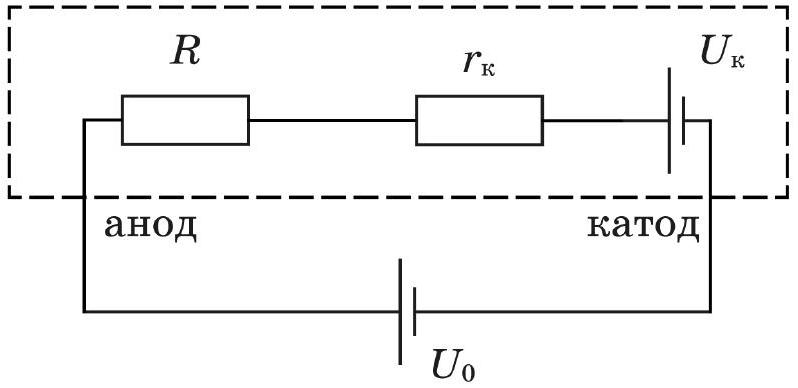
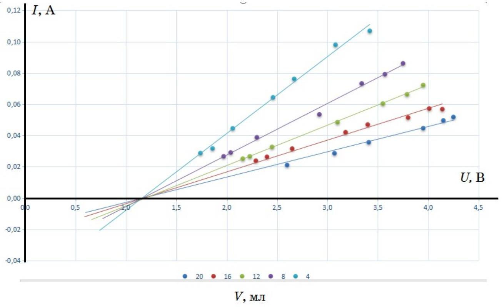
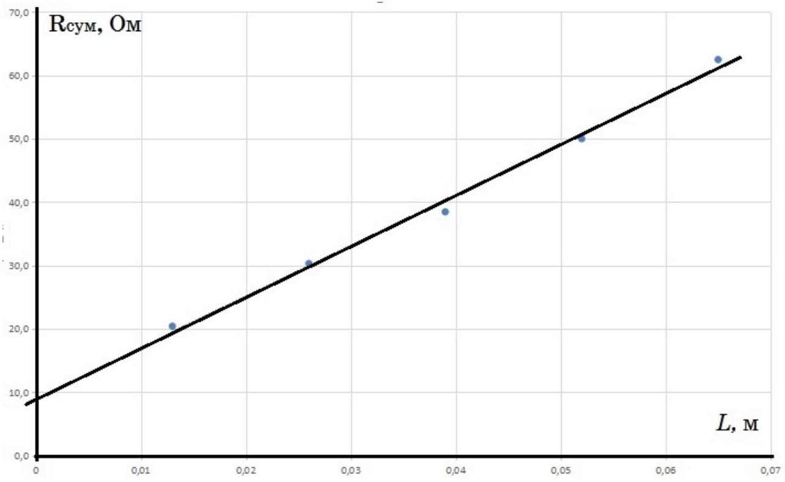

A1 ${ } ^ { \text {?? } }$ Измерьте омметром сопротивление ограничительного резистора $R _ { 1 }$ (см. оборудование). Ниже указано его приблизительное значение 10 Ом, однако в расчётах используйте полученное вами более точное значение.

Измерим мультиметром в режиме омметра сопротивление ограничительного резистора $R _ { 1 } = 10,10$ м.

A2 ${ } ^ { 7.50 }$ Экспериментально подтвердите справедливость предложенной модели. Для этого исследуйте BAX раствора при 5-ти различных расстояниях между электродами.

Собираем измерительную цепь, состоящую из последовательно включённых батарейки, блока регулировки и шприца с раствором соли. К электродам шприца подключаем вольтметр. Второй вольтметр подключаем параллельно эталонному сопротивлению $R _ { 1 }$ для измерения силы тока в цепи.

Всю совокупность процессов на катоде и аноде предлагается представить в виде последовательной цепи, состоящей из поданного на неё внешнего напряжения $U _ { 0 }$, сопротивления объёма электролита $R$, контактной ЭДС $U _ { \mathrm { K } }$ и контактного сопротивления $r _ { \mathrm { K } }$ (рис.1).
Предполагается, что величина $R$ прямо пропорциональна удельному сопротивлению электролита $\rho$, расстоянию между электродами $L$ и обратно пропорциональна площади поперечного сечения электролитической ванны $S$.

Теоретическая ВАХ электролитической ванны в рамках данной модели имеет вид

$$
\begin{equation*}
I = \left( U - U _ { \mathrm { K } } \right) / \left( ( \rho L / S ) + r _ { \mathrm { K } } \right) \tag{1}
\end{equation*}
$$

где $I$ - сила тока в цепи, и при фиксированной $L$ представляет собой прямую линию, пересекающую ось напряжения в точке $U = U _ { \text {к } }$. Коэффициент наклона этой прямой определяется суммой контактного и объёмного сопротивлений $R _ { \text {сум } }$

$$
\begin{equation*}
( \Delta U / \Delta I ) = ( \rho L / S ) + r _ { \mathrm { к } } = R _ { \text {сум } } \tag{2}
\end{equation*}
$$

Зависимость угла наклона ВАХ электролитической ванны от длины ванны $L$ в рамках данной модели, согласно (2), должна быть линейной. График этой зависимости даст возможность при известной $S$ определить величины $\rho$ и $r _ { \text {к } }$.

Снимаем вольт-амперную характеристику раствора. В таблицах приведены результаты измерения BAX раствора при 5 различных объёмах жидкости в шприце $V$ (и соответствующих расстояниях $L$ между электродами).

| $U _ { 10 } , \mathrm { mB }$ | $U , \mathrm { mB }$ | $I , \mathrm {~mA}$ | $V$, мл | $L$, cm |
| :--- | :--- | :--- | :--- | :--- |
| 290 | 1740 | 28,7 | 4 | 1,3 |
| 320 | 1860 | 31,7 |  |  |
| 450 | 2060 | 44,6 |  |  |
| 650 | 2460 | 64,4 |  |  |
| 770 | 2670 | 76,2 |  |  |
| 990 | 3080 | 98,0 |  |  |
| 1080 | 3420 | 106,9 |  |  |
| $U _ { 10 } , \mathrm { mB }$ | $U , \mathrm { mB }$ | $I , \mathrm {~mA}$ | $V$, мл | $L$, CM |
| 870 | 3750 | 86,1 | 8 | 2,6 |
| 800 | 3570 | 79,2 |  |  |
| 740 | 3340 | 73,3 |  |  |
| 540 | 2920 | 53,5 |  |  |
| 392 | 2300 | 38,8 |  |  |
| 294 | 2040 | 29,1 |  |  |
| 269 | 1970 | 26,6 |  |  |
| $U _ { 10 } , \mathrm { mB }$ | $U , \mathrm { mB }$ | $I , \mathrm {~mA}$ | $V$, мл | $L$, cm |
| 254 | 2160 | 25,1 | 12 | 3,9 |
| 269 | 2230 | 26,6 |  |  |

| 330 | 2450 | 32,7 |
| :--- | :--- | :--- |
| 490 | 3100 | 48,5 |
| 610 | 3550 | 60,4 |
| 670 | 3790 | 66,3 |
| 730 | 3950 | 72,3 |

| $U _ { 10 } , \mathrm { mB }$ | $U , \mathrm { mB }$ | $I , \mathrm {~mA}$ | $V$, мл | $L$, cm |
| :--- | :--- | :--- | :--- | :--- |
| 574 | 4140 | 56,8 | 16 | 5,2 |
| 578 | 4010 | 57,2 |  |  |
| 520 | 3800 | 51,5 |  |  |
| 475 | 3400 | 47,0 |  |  |
| 425 | 3180 | 42,1 |  |  |
| 319 | 2650 | 31,6 |  |  |
| 266 | 2400 | 26,3 |  |  |

| $U _ { 10 } , \mathrm { mB }$ | $U , \mathrm { mB }$ | $I , \mathrm {~mA}$ | $V$, мл | $L$, cm |
| :--- | :--- | :--- | :--- | :--- |
| 213 | 2600 | 21,1 | 20 | 6,5 |
| 289 | 3070 | 28,6 |  |  |
| 360 | 3410 | 35,6 |  |  |
| 451 | 3950 | 44,7 |  |  |
| 501 | 4150 | 49,6 |  |  |
| 523 | 4250 | 51,8 |  |  |

Строим BAX для всех экспериментов

А3 ${ } ^ { 1.00 }$ Оцените величину контактной разности потенциалов $U _ { к }$.

С помощью графика определяем:

1. Из точки пересечения графиков и оси напряжений величину контактной разности потенциалов $U _ { \mathrm { K } } = 1,2 \mathrm {~B}$.
2. Из углового коэффициента (см. формулу (2)) сопротивление объёма электролита вместе с сопротивлением контактных областей $R _ { \text {сум } }$ для 5-ти значений $L$.

A4 ${ } ^ { 2.50 }$ Определите величину контактного сопротивления $r _ { \text {к } }$.

Результаты обработки экспериментальных данных для пяти значений $L$ представлены в таблице и на рисунке.

| № | $L , \mathrm {~m}$ | $1 / R _ { \text {сум } } , 1 / О м$ | $R _ { \text {cym } }$, Ом |
| :--- | :--- | :--- | :--- |
| 1 | 0,065 | 0,016 | 62,5 |

| 2 | 0,052 | 0,020 | 50,0 |
| :--- | :--- | :--- | :--- |
| 3 | 0,039 | 0,026 | 38,5 |
| 4 | 0,026 | 0,033 | 30,3 |
| 5 | 0,013 | 0,049 | 20,4 |

Из графика находим $r _ { \text {к } } = R _ { \text {сум } } ( 0 ) = 9,2$ Ом.

A5 ${ } ^ { 1.00 }$ Рассчитайте удельную проводимость $\sigma$ трёхпроцентного раствора хлорида натрия в воде.

Площадь сечения поршня $S = 3,1 \cdot 10 ^ { - 4 } \mathrm {~m} ^ { 2 }$ (можно найти измеряя диаметр поршня или отношение объёма к длине). В рамках используемой модели $\Delta R _ { \text {сум } } / \Delta L = \rho / S$. По наклону прямой графика $R _ { \text {сум } } ( L )$ находим удельное сопротивление используемого раствора соли $\rho = 0,24 \mathrm { Ом } \cdot \mathrm { м }$. То есть, $\sigma = 1 / \rho = 4,2 ( \mathrm { Om } \cdot \mathrm { m } ) ^ { - 1 }$.

А6 ${ } ^ { 3.00 }$ Вычислите подвижность $\mu$ ионов натрия и хлора в этом растворе.

Удельная проводимость электролита $\sigma = 1 / \rho = q _ { 1 } n _ { 1 } \mu _ { 1 } + q _ { 2 } n _ { 2 } \mu _ { 2 }$ где $q _ { 1 }$ и $q _ { 2 }$ модули электрических зарядов положительных и отрицательных ионов соответственно ( в случае ионов натрия и хлора $q _ { 1 } = q _ { 2 } =$ е, где е - элементарный заряд), $n _ { 1 }$ и $n _ { 2 }$ - их концентрации ( в нашем случае они одинаковы и равны $n ) , \mu _ { 1 }$ и $\mu _ { 2 }$ - подвижности отрицательных и положительных ионов в растворе, которые, согласно условию задачи, также равны друг другу $\mu _ { 1 } = \mu _ { 2 } = \mu$. Окончательно,

$$
\mu = \frac { \sigma } { 2 \mathrm { e } n }
$$

Вычисляем концентрацию ионов натрия (или хлора) в трёхпроцентном растворе поваренной соли NaCl

$$
n = N / V = \frac { m _ { \mathrm { NaCl } } N _ { a } \rho _ { \text {раств } } } { M _ { \mathrm { NaCl } } m _ { \text {раств } } } = 0,03 \frac { N _ { a } \rho _ { \text {раств } } } { M _ { \text {NaCl } } } = 3,2 \cdot 10 ^ { 26 } \mathrm { M } ^ { - 3 }
$$

Вычисляем подвижность:

$$
\mu = \frac { \sigma } { ( 2 \mathrm { e } n ) } = 4,0 \cdot 10 ^ { - 8 } \frac { \mathrm { M } ^ { 2 } } { \mathrm {~B} \cdot \mathrm { c } }
$$

, что хорошо согласуется с литературными данными.
